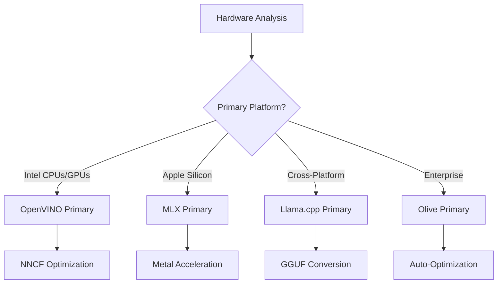
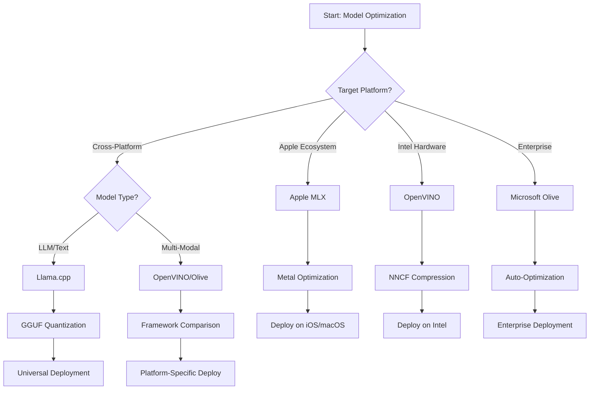
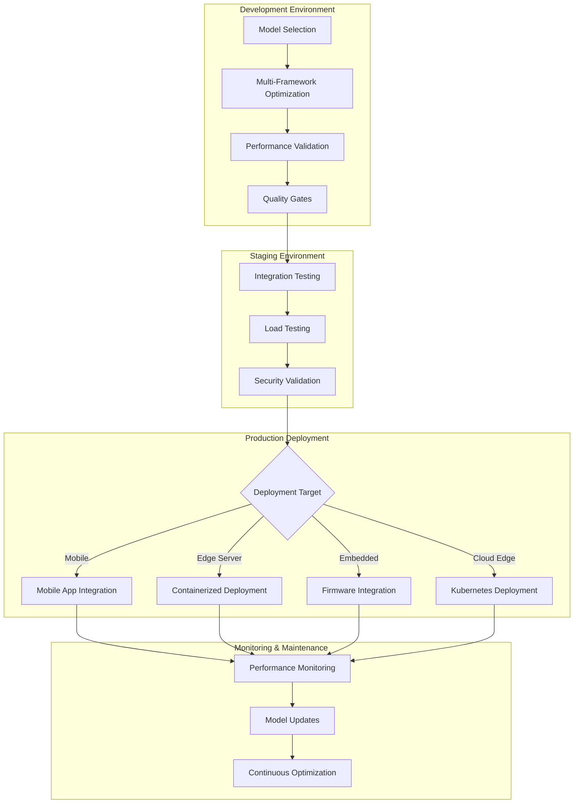

<!--
CO_OP_TRANSLATOR_METADATA:
{
  "original_hash": "6719c4a7e44b948230ac5f5cab3699bd",
  "translation_date": "2025-09-17T17:51:25+00:00",
  "source_file": "Module04/06.workflow-synthesis.md",
  "language_code": "ar"
}
-->
# القسم 6: توليف سير عمل تطوير الذكاء الاصطناعي الطرفي

## جدول المحتويات
1. [المقدمة](../../../Module04)
2. [أهداف التعلم](../../../Module04)
3. [نظرة عامة على سير العمل الموحد](../../../Module04)
4. [مصفوفة اختيار الإطار](../../../Module04)
5. [توليف أفضل الممارسات](../../../Module04)
6. [دليل استراتيجية النشر](../../../Module04)
7. [سير عمل تحسين الأداء](../../../Module04)
8. [قائمة التحقق من جاهزية الإنتاج](../../../Module04)
9. [استكشاف الأخطاء ومراقبتها](../../../Module04)
10. [ضمان مستقبل خط أنابيب الذكاء الاصطناعي الطرفي](../../../Module04)

## المقدمة

يتطلب تطوير الذكاء الاصطناعي الطرفي فهمًا متقدمًا للعديد من أطر تحسين الأداء، استراتيجيات النشر، واعتبارات الأجهزة. هذا التوليف الشامل يجمع المعرفة من Llama.cpp، Microsoft Olive، OpenVINO، وApple MLX لإنشاء سير عمل موحد يعزز الكفاءة، يحافظ على الجودة، ويضمن نشر ناجح في الإنتاج.

خلال هذه الدورة، استعرضنا أطر تحسين الأداء الفردية، كل منها يتميز بنقاط قوة واستخدامات متخصصة. ومع ذلك، غالبًا ما تتطلب مشاريع الذكاء الاصطناعي الطرفي في العالم الحقيقي الجمع بين تقنيات متعددة أو اتخاذ قرارات استراتيجية حول النهج الذي سيحقق أفضل النتائج بناءً على القيود والمتطلبات المحددة.

يهدف هذا القسم إلى توليف الحكمة الجماعية من جميع الأطر إلى سير عمل عملي، أشجار اتخاذ القرار، وأفضل الممارسات التي تمكنك من بناء حلول ذكاء اصطناعي طرفي جاهزة للإنتاج بكفاءة وفعالية. سواء كنت تقوم بتحسين الأداء للأجهزة المحمولة، الأنظمة المدمجة، أو الخوادم الطرفية، يوفر هذا الدليل الإطار الاستراتيجي لاتخاذ قرارات مستنيرة طوال دورة تطويرك.

## أهداف التعلم

بنهاية هذا القسم، ستكون قادرًا على:

### اتخاذ قرارات استراتيجية
- **تقييم واختيار** إطار التحسين الأمثل بناءً على متطلبات المشروع، قيود الأجهزة، وسيناريوهات النشر
- **تصميم سير عمل شامل** يدمج تقنيات تحسين متعددة لتحقيق أقصى كفاءة
- **تقييم التوازنات** بين دقة النموذج، سرعة الاستنتاج، استخدام الذاكرة، وتعقيد النشر عبر الأطر المختلفة

### دمج سير العمل
- **تنفيذ خطوط تطوير موحدة** تستفيد من نقاط القوة في أطر التحسين المتعددة
- **إنشاء سير عمل قابل للتكرار** لضمان تحسين النموذج ونشره بشكل متسق عبر البيئات المختلفة
- **تأسيس بوابات جودة** وعمليات تحقق لضمان أن النماذج المحسنة تلبي متطلبات الإنتاج

### تحسين الأداء
- **تطبيق استراتيجيات تحسين منهجية** باستخدام التكميم، التشذيب، وتقنيات التسريع الخاصة بالأجهزة
- **مراقبة وقياس الأداء** للنماذج عبر مستويات التحسين المختلفة وأهداف النشر
- **تحسين الأداء لمنصات الأجهزة المحددة** بما في ذلك CPU، GPU، NPU، والمسرعات الطرفية المتخصصة

### نشر الإنتاج
- **تصميم بنى نشر قابلة للتوسع** تستوعب تنسيقات النماذج المتعددة ومحركات الاستنتاج
- **تنفيذ المراقبة والملاحظة** لتطبيقات الذكاء الاصطناعي الطرفي في بيئات الإنتاج
- **تأسيس سير عمل الصيانة** لتحديث النماذج، مراقبة الأداء، وتحسين النظام

### التميز عبر المنصات
- **نشر النماذج المحسنة** عبر منصات الأجهزة المتنوعة مع الحفاظ على أداء متسق
- **التعامل مع تحسينات خاصة بالمنصات** لأنظمة Windows، macOS، Linux، الأجهزة المحمولة، والأنظمة المدمجة
- **إنشاء طبقات تجريد** تمكن من النشر السلس عبر البيئات الطرفية المختلفة

## نظرة عامة على سير العمل الموحد

### المرحلة 1: تحليل المتطلبات واختيار الإطار

يبدأ نجاح نشر الذكاء الاصطناعي الطرفي بتحليل متطلبات شامل يُعلم اختيار الإطار واستراتيجية التحسين.

#### 1.1 تقييم الأجهزة


**اعتبارات رئيسية:**
- **معمارية CPU**: قدرات x86، ARM، Apple Silicon
- **توفر المسرعات**: GPU، NPU، VPU، شرائح الذكاء الاصطناعي المتخصصة
- **قيود الذاكرة**: حدود RAM، سعة التخزين
- **ميزانية الطاقة**: عمر البطارية، قيود الحرارة
- **الاتصال**: متطلبات العمل دون اتصال، قيود النطاق الترددي

#### 1.2 مصفوفة متطلبات التطبيق

| المتطلب | Llama.cpp | Microsoft Olive | OpenVINO | Apple MLX |
|---------|-----------|-----------------|----------|-----------|
| عبر المنصات | ✅ ممتاز | ⚡ جيد | ⚡ جيد | ❌ فقط Apple |
| تكامل المؤسسات | ⚡ أساسي | ✅ ممتاز | ✅ ممتاز | ⚡ محدود |
| نشر الأجهزة المحمولة | ✅ ممتاز | ⚡ جيد | ⚡ جيد | ✅ ممتاز لـ iOS |
| استنتاج في الوقت الحقيقي | ✅ ممتاز | ✅ ممتاز | ✅ ممتاز | ✅ ممتاز |
| تنوع النماذج | ✅ تركيز على LLM | ✅ جميع النماذج | ✅ جميع النماذج | ✅ تركيز على LLM |
| سهولة الاستخدام | ✅ بسيط | ✅ تلقائي | ⚡ متوسط | ✅ بسيط |

### المرحلة 2: إعداد النموذج وتحسينه

#### 2.1 خط أنابيب تقييم النموذج العالمي

```python
# Universal Model Assessment Framework
class EdgeAIModelAssessment:
    def __init__(self, model_path, target_hardware):
        self.model_path = model_path
        self.target_hardware = target_hardware
        self.optimization_frameworks = []
        
    def assess_model_characteristics(self):
        """Analyze model size, architecture, and complexity"""
        return {
            'model_size': self.get_model_size(),
            'parameter_count': self.get_parameter_count(),
            'architecture_type': self.detect_architecture(),
            'quantization_compatibility': self.check_quantization_support()
        }
    
    def recommend_optimization_strategy(self):
        """Recommend optimal frameworks and techniques"""
        characteristics = self.assess_model_characteristics()
        
        if self.target_hardware.startswith('apple'):
            return self.mlx_optimization_strategy(characteristics)
        elif self.target_hardware.startswith('intel'):
            return self.openvino_optimization_strategy(characteristics)
        elif characteristics['model_size'] > 7_000_000_000:  # 7B+ parameters
            return self.enterprise_optimization_strategy(characteristics)
        else:
            return self.lightweight_optimization_strategy(characteristics)
```

#### 2.2 خط أنابيب تحسين متعدد الأطر

**نهج التحسين المتسلسل:**
1. **التحويل الأولي**: التحويل إلى تنسيق وسيط (ONNX عند الإمكان)
2. **تحسين خاص بالإطار**: تطبيق تقنيات متخصصة
3. **التحقق المتقاطع**: التحقق من الأداء عبر المنصات المستهدفة
4. **التعبئة النهائية**: التحضير للنشر

```bash
# Multi-Framework Optimization Script
#!/bin/bash

MODEL_NAME="phi-3-mini"
BASE_MODEL="microsoft/Phi-3-mini-4k-instruct"

# Phase 1: ONNX Conversion (Universal)
python convert_to_onnx.py --model $BASE_MODEL --output models/onnx/

# Phase 2: Platform-Specific Optimization
if [[ "$TARGET_PLATFORM" == "intel" ]]; then
    # OpenVINO Optimization
    python optimize_openvino.py --input models/onnx/ --output models/openvino/
elif [[ "$TARGET_PLATFORM" == "apple" ]]; then
    # MLX Optimization
    python optimize_mlx.py --input $BASE_MODEL --output models/mlx/
elif [[ "$TARGET_PLATFORM" == "cross" ]]; then
    # Llama.cpp Optimization
    python convert_to_gguf.py --input models/onnx/ --output models/gguf/
fi

# Phase 3: Validation
python validate_optimization.py --original $BASE_MODEL --optimized models/$TARGET_PLATFORM/
```

### المرحلة 3: التحقق من الأداء والقياس

#### 3.1 إطار قياس شامل

```python
class EdgeAIBenchmark:
    def __init__(self, optimized_models):
        self.models = optimized_models
        self.metrics = {
            'inference_time': [],
            'memory_usage': [],
            'accuracy_score': [],
            'throughput': [],
            'energy_consumption': []
        }
    
    def run_comprehensive_benchmark(self):
        """Execute standardized benchmarks across all optimized models"""
        test_inputs = self.generate_test_inputs()
        
        for model_framework, model_path in self.models.items():
            print(f"Benchmarking {model_framework}...")
            
            # Latency Testing
            latency = self.measure_inference_latency(model_path, test_inputs)
            
            # Memory Profiling
            memory = self.profile_memory_usage(model_path)
            
            # Accuracy Validation
            accuracy = self.validate_model_accuracy(model_path, test_inputs)
            
            # Throughput Analysis
            throughput = self.measure_throughput(model_path)
            
            self.record_metrics(model_framework, latency, memory, accuracy, throughput)
    
    def generate_optimization_report(self):
        """Create comprehensive comparison report"""
        report = {
            'recommendations': self.analyze_performance_trade_offs(),
            'deployment_guidance': self.generate_deployment_recommendations(),
            'monitoring_requirements': self.define_monitoring_metrics()
        }
        return report
```

## مصفوفة اختيار الإطار

### شجرة اتخاذ القرار لاختيار الإطار



### معايير اختيار شاملة

#### 1. توافق الاستخدام الأساسي

**نماذج اللغة الكبيرة (LLMs):**
- **Llama.cpp**: الأفضل للنشر عبر CPU وعبر المنصات
- **Apple MLX**: الأمثل لـ Apple Silicon مع ذاكرة موحدة
- **OpenVINO**: ممتاز للأجهزة Intel مع تحسين NNCF
- **Microsoft Olive**: مثالي لعمليات المؤسسات مع الأتمتة

**النماذج متعددة الوسائط:**
- **OpenVINO**: دعم شامل للرؤية، الصوت، والنص
- **Microsoft Olive**: تحسين على مستوى المؤسسات لخطوط الأنابيب المعقدة
- **Llama.cpp**: محدود للنماذج النصية فقط
- **Apple MLX**: دعم متزايد للتطبيقات متعددة الوسائط

#### 2. مصفوفة منصات الأجهزة

| المنصة | الإطار الأساسي | الخيار الثانوي | الميزات المتخصصة |
|--------|----------------|----------------|------------------|
| Intel CPU/GPU | OpenVINO | Microsoft Olive | ضغط NNCF، تحسين Intel |
| NVIDIA GPU | Microsoft Olive | OpenVINO | تسريع CUDA، ميزات المؤسسات |
| Apple Silicon | Apple MLX | Llama.cpp | Metal shaders، ذاكرة موحدة |
| ARM Mobile | Llama.cpp | OpenVINO | عبر المنصات، اعتماديات قليلة |
| Edge TPU | OpenVINO | Microsoft Olive | دعم المسرعات المتخصصة |
| Embedded ARM | Llama.cpp | OpenVINO | بصمة صغيرة، استنتاج فعال |

#### 3. تفضيلات سير العمل التطويري

**النماذج الأولية السريعة:**
1. **Llama.cpp**: أسرع إعداد، نتائج فورية
2. **Apple MLX**: واجهة برمجة تطبيقات Python بسيطة، تكرار سريع
3. **Microsoft Olive**: تحسين تلقائي، إعدادات قليلة
4. **OpenVINO**: إعداد أكثر تعقيدًا، ميزات شاملة

**الإنتاج المؤسسي:**
1. **Microsoft Olive**: ميزات المؤسسات، تكامل Azure
2. **OpenVINO**: نظام Intel، أدوات شاملة
3. **Apple MLX**: تطبيقات المؤسسات الخاصة بـ Apple
4. **Llama.cpp**: نشر بسيط، ميزات مؤسسية محدودة

## توليف أفضل الممارسات

### مبادئ التحسين العالمية

#### 1. استراتيجية التحسين التدريجي

```python
class ProgressiveOptimization:
    def __init__(self, base_model):
        self.base_model = base_model
        self.optimization_stages = [
            'baseline_measurement',
            'format_conversion',
            'quantization_optimization',
            'hardware_acceleration',
            'production_validation'
        ]
    
    def execute_progressive_optimization(self):
        """Apply optimization techniques incrementally"""
        
        # Stage 1: Baseline Measurement
        baseline_metrics = self.measure_baseline_performance()
        
        # Stage 2: Format Conversion
        converted_model = self.convert_to_optimal_format()
        conversion_metrics = self.measure_performance(converted_model)
        
        # Stage 3: Quantization
        quantized_model = self.apply_quantization(converted_model)
        quantization_metrics = self.measure_performance(quantized_model)
        
        # Stage 4: Hardware Acceleration
        accelerated_model = self.enable_hardware_acceleration(quantized_model)
        acceleration_metrics = self.measure_performance(accelerated_model)
        
        # Stage 5: Validation
        production_ready = self.validate_for_production(accelerated_model)
        
        return self.compile_optimization_report(
            baseline_metrics, conversion_metrics, 
            quantization_metrics, acceleration_metrics
        )
```

#### 2. تنفيذ بوابات الجودة

**بوابات الحفاظ على الدقة:**
- الحفاظ على >95% من دقة النموذج الأصلية
- التحقق باستخدام مجموعات اختبار تمثيلية
- تنفيذ اختبارات A/B للتحقق من الإنتاج

**بوابات تحسين الأداء:**
- تحقيق تحسين سرعة لا يقل عن 2x
- تقليل بصمة الذاكرة بنسبة لا تقل عن 50%
- التحقق من اتساق وقت الاستنتاج

**بوابات جاهزية الإنتاج:**
- اجتياز اختبارات الضغط تحت الحمل
- إثبات الأداء المستقر بمرور الوقت
- التحقق من متطلبات الأمان والخصوصية

### دمج أفضل الممارسات الخاصة بالإطار

#### 1. توليف استراتيجية التكميم

```python
# Unified Quantization Approach
class UnifiedQuantizationStrategy:
    def __init__(self, model, target_platform):
        self.model = model
        self.platform = target_platform
        
    def select_optimal_quantization(self):
        """Choose best quantization based on platform and requirements"""
        
        if self.platform == 'apple_silicon':
            return self.mlx_quantization_strategy()
        elif self.platform == 'intel_hardware':
            return self.openvino_quantization_strategy()
        elif self.platform == 'cross_platform':
            return self.llamacpp_quantization_strategy()
        else:
            return self.olive_quantization_strategy()
    
    def mlx_quantization_strategy(self):
        """Apple MLX-specific quantization"""
        return {
            'method': 'mlx_quantize',
            'precision': 'int4',
            'group_size': 64,
            'optimization_target': 'unified_memory'
        }
    
    def openvino_quantization_strategy(self):
        """OpenVINO NNCF quantization"""
        return {
            'method': 'nncf_quantize',
            'precision': 'int8',
            'calibration_method': 'post_training',
            'optimization_target': 'intel_hardware'
        }
```

#### 2. تحسين تسريع الأجهزة

**توليف تحسين CPU:**
- **تعليمات SIMD**: الاستفادة من النوى المحسنة عبر الأطر
- **عرض نطاق الذاكرة**: تحسين تخطيطات البيانات لكفاءة التخزين المؤقت
- **التشغيل المتزامن**: تحقيق توازن بين التوازي وقيود الموارد

**أفضل الممارسات لتسريع GPU:**
- **معالجة الدُفعات**: زيادة الإنتاجية بأحجام دُفعات مناسبة
- **إدارة الذاكرة**: تحسين تخصيص ذاكرة GPU ونقلها
- **الدقة**: استخدام FP16 عند الدعم لتحسين الأداء

**تحسين المسرعات المتخصصة/NPU:**
- **هيكل النموذج**: ضمان التوافق مع قدرات المسرعات
- **تدفق البيانات**: تحسين خطوط أنابيب الإدخال/الإخراج لكفاءة المسرعات
- **استراتيجيات التراجع**: تنفيذ تراجع إلى CPU للعمليات غير المدعومة

## دليل استراتيجية النشر

### بنية النشر العالمية



### أنماط النشر الخاصة بالمنصات

#### 1. استراتيجية نشر الأجهزة المحمولة

```yaml
# Mobile Deployment Configuration
mobile_deployment:
  ios:
    framework: apple_mlx
    optimization:
      quantization: int4
      memory_mapping: true
      background_execution: limited
    packaging:
      format: mlx
      bundle_size: <50MB
      
  android:
    framework: llama_cpp
    optimization:
      quantization: q4_k_m
      threading: android_optimized
      memory_management: conservative
    packaging:
      format: gguf
      apk_size: <100MB
      
  cross_platform:
    framework: onnx_runtime
    optimization:
      quantization: int8
      execution_provider: cpu
    packaging:
      format: onnx
      shared_libraries: minimal
```

#### 2. نشر خوادم الطرف

```yaml
# Edge Server Deployment Configuration
edge_server:
  intel_based:
    framework: openvino
    optimization:
      quantization: int8
      acceleration: cpu_gpu_auto
      batch_processing: dynamic
    deployment:
      container: openvino_runtime
      orchestration: kubernetes
      scaling: horizontal
      
  nvidia_based:
    framework: microsoft_olive
    optimization:
      quantization: int4
      acceleration: cuda
      tensor_parallelism: true
    deployment:
      container: nvidia_triton
      orchestration: kubernetes
      scaling: gpu_aware
```

### أفضل الممارسات للتعبئة في الحاويات

```dockerfile
# Multi-Framework Edge AI Container
FROM ubuntu:22.04 as base

# Install common dependencies
RUN apt-get update && apt-get install -y \
    python3 \
    python3-pip \
    build-essential \
    cmake \
    && rm -rf /var/lib/apt/lists/*

# Framework-specific stages
FROM base as openvino
RUN pip install openvino nncf optimum[intel]

FROM base as llamacpp
RUN git clone https://github.com/ggerganov/llama.cpp.git \
    && cd llama.cpp && make LLAMA_OPENBLAS=1

FROM base as olive
RUN pip install olive-ai[auto-opt] onnxruntime-genai

# Production stage with selected framework
FROM openvino as production
COPY models/ /app/models/
COPY src/ /app/src/
WORKDIR /app

EXPOSE 8080
CMD ["python3", "src/inference_server.py"]
```

## سير عمل تحسين الأداء

### ضبط الأداء المنهجي

#### 1. خط أنابيب قياس الأداء

```python
class EdgeAIPerformanceProfiler:
    def __init__(self, model_path, framework):
        self.model_path = model_path
        self.framework = framework
        self.profiling_results = {}
    
    def comprehensive_profiling(self):
        """Execute comprehensive performance analysis"""
        
        # CPU Profiling
        cpu_profile = self.profile_cpu_usage()
        
        # Memory Profiling
        memory_profile = self.profile_memory_usage()
        
        # Inference Latency
        latency_profile = self.profile_inference_latency()
        
        # Throughput Analysis
        throughput_profile = self.profile_throughput()
        
        # Energy Consumption (where available)
        energy_profile = self.profile_energy_consumption()
        
        return self.compile_performance_report(
            cpu_profile, memory_profile, latency_profile,
            throughput_profile, energy_profile
        )
    
    def identify_bottlenecks(self):
        """Automatically identify performance bottlenecks"""
        bottlenecks = []
        
        if self.profiling_results['cpu_utilization'] > 80:
            bottlenecks.append('cpu_bound')
        
        if self.profiling_results['memory_usage'] > 90:
            bottlenecks.append('memory_bound')
        
        if self.profiling_results['inference_variance'] > 20:
            bottlenecks.append('inconsistent_performance')
        
        return self.generate_optimization_recommendations(bottlenecks)
```

#### 2. خط أنابيب التحسين التلقائي

```python
class AutomatedOptimizationPipeline:
    def __init__(self, base_model, target_constraints):
        self.base_model = base_model
        self.constraints = target_constraints
        self.optimization_history = []
    
    def execute_optimization_search(self):
        """Systematically search optimization space"""
        
        optimization_candidates = [
            {'quantization': 'int8', 'pruning': 0.1},
            {'quantization': 'int4', 'pruning': 0.2},
            {'quantization': 'int8', 'acceleration': 'gpu'},
            {'quantization': 'int4', 'acceleration': 'npu'}
        ]
        
        best_configuration = None
        best_score = 0
        
        for config in optimization_candidates:
            optimized_model = self.apply_optimization(config)
            score = self.evaluate_optimization(optimized_model)
            
            if score > best_score and self.meets_constraints(optimized_model):
                best_score = score
                best_configuration = config
            
            self.optimization_history.append({
                'config': config,
                'score': score,
                'model': optimized_model
            })
        
        return best_configuration, self.optimization_history
```

### تحسين متعدد الأهداف

#### 1. تحسين باريتو للذكاء الاصطناعي الطرفي

```python
class ParetoOptimization:
    def __init__(self, objectives=['speed', 'accuracy', 'memory']):
        self.objectives = objectives
        self.pareto_frontier = []
    
    def find_pareto_optimal_solutions(self, optimization_results):
        """Identify Pareto-optimal configurations"""
        
        for result in optimization_results:
            is_dominated = False
            
            for frontier_point in self.pareto_frontier:
                if self.dominates(frontier_point, result):
                    is_dominated = True
                    break
            
            if not is_dominated:
                # Remove dominated points from frontier
                self.pareto_frontier = [
                    point for point in self.pareto_frontier 
                    if not self.dominates(result, point)
                ]
                
                self.pareto_frontier.append(result)
        
        return self.pareto_frontier
    
    def recommend_configuration(self, user_preferences):
        """Recommend configuration based on user preferences"""
        
        weighted_scores = []
        for config in self.pareto_frontier:
            score = sum(
                user_preferences[obj] * config['metrics'][obj] 
                for obj in self.objectives
            )
            weighted_scores.append((score, config))
        
        return max(weighted_scores, key=lambda x: x[0])[1]
```

## قائمة التحقق من جاهزية الإنتاج

### التحقق الشامل من الإنتاج

#### 1. ضمان جودة النموذج

```python
class ProductionReadinessValidator:
    def __init__(self, optimized_model, production_requirements):
        self.model = optimized_model
        self.requirements = production_requirements
        self.validation_results = {}
    
    def validate_model_quality(self):
        """Comprehensive model quality validation"""
        
        # Accuracy Validation
        accuracy_result = self.validate_accuracy()
        
        # Performance Validation
        performance_result = self.validate_performance()
        
        # Robustness Testing
        robustness_result = self.validate_robustness()
        
        # Security Assessment
        security_result = self.validate_security()
        
        # Compliance Verification
        compliance_result = self.validate_compliance()
        
        return self.compile_validation_report(
            accuracy_result, performance_result, robustness_result,
            security_result, compliance_result
        )
    
    def generate_certification_report(self):
        """Generate production certification report"""
        return {
            'model_signature': self.generate_model_signature(),
            'validation_timestamp': datetime.now(),
            'validation_results': self.validation_results,
            'deployment_approval': self.check_deployment_approval(),
            'monitoring_requirements': self.define_monitoring_requirements()
        }
```

#### 2. قائمة التحقق من نشر الإنتاج

**التحقق قبل النشر:**
- [ ] دقة النموذج تلبي الحد الأدنى من المتطلبات (>95% من الأساس)
- [ ] تحقيق أهداف الأداء (زمن الاستجابة، الإنتاجية، الذاكرة)
- [ ] تقييم الثغرات الأمنية ومعالجتها
- [ ] اكتمال اختبارات الضغط تحت الحمل المتوقع
- [ ] اختبار سيناريوهات الفشل والتحقق من إجراءات الاسترداد
- [ ] تكوين أنظمة المراقبة والتنبيه
- [ ] اختبار إجراءات التراجع وتوثيقها

**عملية النشر:**
- [ ] تنفيذ استراتيجية نشر الأزرق-الأخضر
- [ ] تكوين زيادة تدريجية لحركة المرور
- [ ] تنشيط لوحات مراقبة الوقت الحقيقي
- [ ] إنشاء خطوط أساس الأداء
- [ ] تعريف عتبات معدل الخطأ
- [ ] تكوين مشغلات التراجع التلقائي

**المراقبة بعد النشر:**
- [ ] تنشيط اكتشاف انحراف النموذج
- [ ] تكوين تنبيهات تدهور الأداء
- [ ] تمكين مراقبة استخدام الموارد
- [ ] تتبع مقاييس تجربة المستخدم
- [ ] الحفاظ على إصدار النموذج وسجل النسب
- [ ] جدولة مراجعات أداء النموذج بانتظام

### التكامل المستمر/النشر المستمر (CI/CD)

```yaml
# Edge AI CI/CD Pipeline Configuration
edge_ai_pipeline:
  stages:
    - model_validation
    - optimization
    - testing
    - staging_deployment
    - production_deployment
    - monitoring
  
  model_validation:
    accuracy_threshold: 0.95
    performance_baseline: required
    security_scan: enabled
    
  optimization:
    frameworks:
      - llama_cpp
      - openvino
      - microsoft_olive
    validation:
      cross_validation: enabled
      performance_comparison: required
      
  testing:
    unit_tests: comprehensive
    integration_tests: full_pipeline
    load_tests: production_scale
    security_tests: comprehensive
    
  deployment:
    strategy: blue_green
    traffic_ramping: gradual
    rollback: automatic
    monitoring: real_time
```

## استكشاف الأخطاء ومراقبتها

### إطار استكشاف الأخطاء العالمي

#### 1. المشكلات الشائعة والحلول

**مشكلات الأداء:**
```python
class PerformanceTroubleshooter:
    def __init__(self, model_metrics):
        self.metrics = model_metrics
        
    def diagnose_performance_issues(self):
        """Systematic performance issue diagnosis"""
        
        issues = []
        
        # High latency diagnosis
        if self.metrics['avg_latency'] > self.metrics['target_latency']:
            issues.append(self.diagnose_latency_issues())
        
        # Memory usage diagnosis
        if self.metrics['memory_usage'] > self.metrics['memory_limit']:
            issues.append(self.diagnose_memory_issues())
        
        # Throughput diagnosis
        if self.metrics['throughput'] < self.metrics['target_throughput']:
            issues.append(self.diagnose_throughput_issues())
        
        return self.generate_resolution_plan(issues)
    
    def diagnose_latency_issues(self):
        """Specific latency troubleshooting"""
        potential_causes = []
        
        if self.metrics['cpu_utilization'] > 80:
            potential_causes.append('cpu_bottleneck')
        
        if self.metrics['memory_bandwidth'] > 90:
            potential_causes.append('memory_bandwidth_limit')
        
        if self.metrics['model_size'] > self.metrics['optimal_size']:
            potential_causes.append('model_too_large')
        
        return {
            'issue': 'high_latency',
            'causes': potential_causes,
            'solutions': self.generate_latency_solutions(potential_causes)
        }
```

**استكشاف الأخطاء الخاص بالإطار:**

| المشكلة | Llama.cpp | Microsoft Olive | OpenVINO | Apple MLX |
|---------|-----------|-----------------|----------|-----------|
| مشكلات الذاكرة | تقليل طول السياق | تقليل حجم الدُفعة | تمكين التخزين المؤقت | استخدام تعيين الذاكرة |
| بطء الاستنتاج | تمكين SIMD | التحقق من التكميم | تحسين التشغيل المتزامن | تمكين Metal |
| فقدان الدقة | تكميم أعلى | إعادة التدريب باستخدام QAT | زيادة المعايرة | تحسين بعد التكميم |
| التوافق | التحقق من تنسيق النموذج | التحقق من إصدار الإطار | تحديث برامج التشغيل | التحقق من إصدار macOS |

#### 2. استراتيجية مراقبة الإنتاج

```python
class EdgeAIMonitoring:
    def __init__(self, deployment_config):
        self.config = deployment_config
        self.metrics_collectors = []
        self.alerting_rules = []
    
    def setup_comprehensive_monitoring(self):
        """Configure comprehensive monitoring for Edge AI deployment"""
        
        # Model Performance Monitoring
        self.setup_model_performance_monitoring()
        
        # Infrastructure Monitoring
        self.setup_infrastructure_monitoring()
        
        # Business Metrics Monitoring
        self.setup_business_metrics_monitoring()
        
        # Security Monitoring
        self.setup_security_monitoring()
    
    def setup_model_performance_monitoring(self):
        """Model-specific performance monitoring"""
        metrics = [
            'inference_latency_p50',
            'inference_latency_p95',
            'inference_latency_p99',
            'model_accuracy_drift',
            'prediction_confidence_distribution',
            'error_rate',
            'throughput_requests_per_second'
        ]
        
        for metric in metrics:
            self.add_metric_collector(metric)
            self.add_alerting_rule(metric)
    
    def detect_model_drift(self):
        """Automated model drift detection"""
        drift_indicators = [
            self.statistical_drift_detection(),
            self.performance_drift_detection(),
            self.data_distribution_shift_detection()
        ]
        
        return self.aggregate_drift_signals(drift_indicators)
```

### حل المشكلات تلقائيًا

```python
class AutomatedIssueResolution:
    def __init__(self, monitoring_system):
        self.monitoring = monitoring_system
        self.resolution_strategies = {}
    
    def handle_performance_degradation(self, alert):
        """Automated performance issue resolution"""
        
        if alert['type'] == 'high_latency':
            return self.resolve_latency_issue(alert)
        elif alert['type'] == 'high_memory_usage':
            return self.resolve_memory_issue(alert)
        elif alert['type'] == 'accuracy_drift':
            return self.resolve_accuracy_issue(alert)
        
    def resolve_latency_issue(self, alert):
        """Automated latency issue resolution"""
        resolution_steps = [
            'increase_cpu_allocation',
            'enable_model_caching',
            'reduce_batch_size',
            'switch_to_quantized_model'
        ]
        
        for step in resolution_steps:
            if self.apply_resolution_step(step):
                return f"Resolved latency issue with: {step}"
        
        return "Escalating to human operator"
```

## ضمان مستقبل خط أنابيب الذكاء الاصطناعي الطرفي

### دمج التقنيات الناشئة

#### 1. دعم الأجهزة من الجيل التالي

```python
class FutureHardwareIntegration:
    def __init__(self):
        self.supported_accelerators = [
            'npu_next_gen',
            'quantum_processors',
            'neuromorphic_chips',
            'optical_processors'
        ]
    
    def design_adaptive_pipeline(self):
        """Create hardware-agnostic optimization pipeline"""
        
        pipeline = {
            'model_preparation': self.universal_model_preparation(),
            'hardware_detection': self.dynamic_hardware_detection(),
            'optimization_selection': self.adaptive_optimization_selection(),
            'performance_validation': self.hardware_agnostic_validation()
        }
        
        return pipeline
    
    def adaptive_optimization_selection(self):
        """Dynamically select optimization based on available hardware"""
        
        def optimize_for_hardware(model, available_hardware):
            if 'npu' in available_hardware:
                return self.npu_optimization(model)
            elif 'quantum' in available_hardware:
                return self.quantum_optimization(model)
            elif 'neuromorphic' in available_hardware:
                return self.neuromorphic_optimization(model)
            else:
                return self.fallback_optimization(model)
        
        return optimize_for_hardware
```

#### 2. تطور هيكل النموذج

**دعم الهياكل الناشئة:**
- **Mixture of Experts (MoE)**: هياكل النماذج المتفرقة لتحقيق الكفاءة
- **التوليد المعزز بالاسترجاع**: أنظمة النموذج الهجين + قاعدة المعرفة
- **النماذج متعددة الوسائط**: تكامل الرؤية + اللغة + الصوت
- **التعلم الفيدرالي**: التدريب والتطوير الموزع

```python
class NextGenModelSupport:
    def __init__(self):
        self.architecture_handlers = {
            'moe': self.handle_mixture_of_experts,
            'rag': self.handle_retrieval_augmented,
            'multimodal': self.handle_multimodal,
            'federated': self.handle_federated_learning
        }
    
    def handle_mixture_of_experts(self, model):
        """Optimize Mixture of Experts models for edge deployment"""
        optimization_strategy = {
            'expert_pruning': True,
            'routing_optimization': True,
            'expert_quantization': 'per_expert',
            'load_balancing': 'dynamic'
        }
        return self.apply_moe_optimization(model, optimization_strategy)
```

### التعلم المستمر والتكيف

#### 1. دمج التعلم عبر الإنترنت

```python
class EdgeOnlineLearning:
    def __init__(self, base_model, learning_rate=0.001):
        self.base_model = base_model
        self.learning_rate = learning_rate
        self.adaptation_buffer = []
    
    def continuous_adaptation(self, new_data, feedback):
        """Continuously adapt model based on edge data"""
        
        # Privacy-preserving local adaptation
        local_updates = self.compute_local_gradients(new_data, feedback)
        
        # Apply updates with constraints
        adapted_model = self.apply_constrained_updates(
            self.base_model, local_updates
        )
        
        # Validate adaptation quality
        if self.validate_adaptation(adapted_model):
            self.base_model = adapted_model
            return True
        
        return False
    
    def federated_learning_participation(self):
        """Participate in federated learning while preserving privacy"""
        
        # Compute local model updates
        local_updates = self.compute_private_updates()
        
        # Differential privacy protection
        private_updates = self.apply_differential_privacy(local_updates)
        
        # Share with federated learning coordinator
        return self.share_updates(private_updates)
```

#### 2. الاستدامة والذكاء الاصطناعي الأخضر

```python
class GreenEdgeAI:
    def __init__(self, sustainability_targets):
        self.targets = sustainability_targets
        self.energy_monitor = EnergyMonitor()
    
    def optimize_for_sustainability(self, model):
        """Optimize model for minimal environmental impact"""
        
        optimization_objectives = [
            'minimize_energy_consumption',
            'maximize_hardware_utilization',
            'reduce_model_training_cost',
            'extend_device_lifetime'
        ]
        
        return self.multi_objective_green_optimization(
            model, optimization_objectives
        )
    
    def carbon_aware_deployment(self):
        """Deploy models considering carbon footprint"""
        
        deployment_strategy = {
            'prefer_renewable_energy_regions': True,
            'optimize_for_energy_efficiency': True,
            'minimize_data_transfer': True,
            'lifecycle_carbon_accounting': True
        }
        
        return deployment_strategy
```

## الخاتمة

يمثل هذا التوليف الشامل لسير العمل تتويجًا لمعرفة تحسين الذكاء الاصطناعي الطرفي، حيث يجمع أفضل الممارسات من جميع أطر التحسين الرئيسية في نهج موحد وجاهز للإنتاج. باتباع هذه الإرشادات، ستتمكن من:

**تحقيق الأداء الأمثل**: من خلال اختيار الإطار المنهجي، التحسين التدريجي، والتحقق الشامل، لضمان أن تطبيقات الذكاء الاصطناعي الطرفي تقدم أقصى كفاءة.

**ضمان جاهزية الإنتاج**: من خلال الاختبار الشامل، المراقبة، وبوابات الجودة التي تضمن النشر والتشغيل الموثوق في البيئات الواقعية.

**الحفاظ على النجاح طويل الأمد**: من خلال المراقبة المستمرة، حل المشكلات تلقائيًا، واستراتيجيات التكيف التي تحافظ على حلول الذكاء الاصطناعي الطرفي فعالة وذات صلة.

**ضمان استثمار مستقبلي**: من خلال تصميم خطوط أنابيب مرنة وغير مرتبطة بالأجهزة يمكن أن تتطور مع التقنيات والمتطلبات الناشئة.

يستمر مشهد الذكاء الاصطناعي الطرفي في التطور بسرعة، مع ظهور منصات أجهزة جديدة، تقنيات تحسين، واستراتيجيات نشر بانتظام. يوفر هذا التوليف الأساس للتنقل في هذا التعقيد أثناء بناء حلول ذكاء اصطناعي طرفي قوية، فعالة، وقابلة للصيانة تقدم قيمة حقيقية في بيئات الإنتاج.
تذكر أن أفضل استراتيجية تحسين هي تلك التي تلبي احتياجاتك المحددة مع الحفاظ على المرونة للتكيف مع تطور هذه الاحتياجات. استخدم هذا الدليل كإطار عمل لاتخاذ قرارات مستنيرة، ولكن دائمًا قم بالتحقق من اختياراتك من خلال الاختبار التجريبي وتجربة النشر في العالم الحقيقي.

## ➡️ ما الخطوة التالية

واصل رحلتك في الذكاء الاصطناعي الطرفي من خلال استكشاف [الوحدة الخامسة: SLMOps ونشر الإنتاج](../Module05/README.md) لتتعرف على الجوانب التشغيلية لإدارة دورة حياة نماذج اللغة الصغيرة.

---

**إخلاء المسؤولية**:  
تم ترجمة هذا المستند باستخدام خدمة الترجمة بالذكاء الاصطناعي [Co-op Translator](https://github.com/Azure/co-op-translator). بينما نسعى لتحقيق الدقة، يرجى العلم أن الترجمات الآلية قد تحتوي على أخطاء أو معلومات غير دقيقة. يجب اعتبار المستند الأصلي بلغته الأصلية المصدر الرسمي. للحصول على معلومات حاسمة، يُوصى بالاستعانة بترجمة بشرية احترافية. نحن غير مسؤولين عن أي سوء فهم أو تفسيرات خاطئة تنشأ عن استخدام هذه الترجمة.