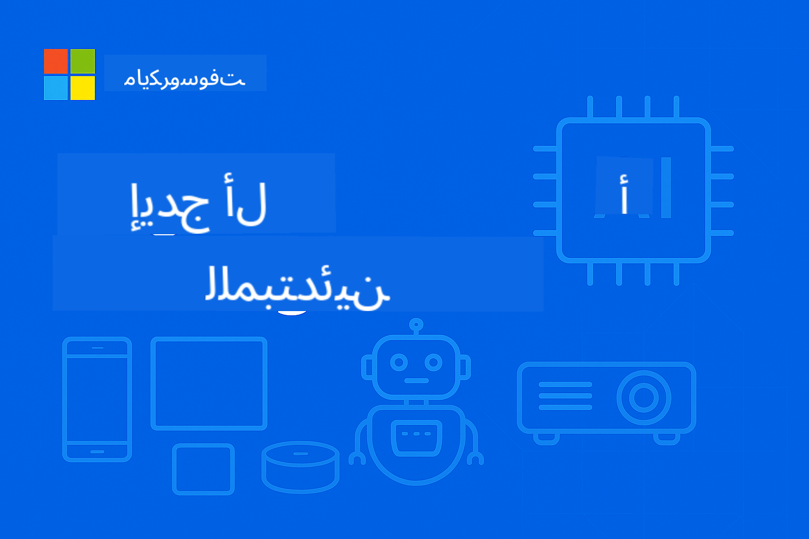

<!--
CO_OP_TRANSLATOR_METADATA:
{
  "original_hash": "ff006cd813df4152f5036e7b2bc5ed32",
  "translation_date": "2025-09-24T13:19:51+00:00",
  "source_file": "README.md",
  "language_code": "ar"
}
-->
# EdgeAI للمبتدئين



[](https://GitHub.com/microsoft/edgeai-for-beginners/graphs/contributors)
[](https://GitHub.com/microsoft/edgeai-for-beginners/issues)
[](https://GitHub.com/microsoft/edgeai-for-beginners/pulls)
[](http://makeapullrequest.com)

[](https://GitHub.com/microsoft/edgeai-for-beginners/watchers)
[](https://GitHub.com/microsoft/edgeai-for-beginners/fork)
[](https://GitHub.com/microsoft/edgeai-for-beginners/stargazers)

[](https://discord.com/invite/ByRwuEEgH4)

اتبع هذه الخطوات للبدء باستخدام هذه الموارد:

1. **تفرع المستودع**: انقر [](https://GitHub.com/microsoft/edgeai-for-beginners/fork)
2. **استنساخ المستودع**: `git clone https://github.com/microsoft/edgeai-for-beginners.git`
3. [**انضم إلى Discord الخاص بـ Azure AI Foundry وتواصل مع الخبراء والمطورين الآخرين**](https://discord.com/invite/ByRwuEEgH4)

### 🌐 دعم متعدد اللغات

#### مدعوم عبر GitHub Action (تلقائي ودائم التحديث)

[العربية](./README.md) | [البنغالية](../bn/README.md) | [البلغارية](../bg/README.md) | [البورمية (ميانمار)](../my/README.md) | [الصينية (المبسطة)](../zh/README.md) | [الصينية (التقليدية، هونغ كونغ)](../hk/README.md) | [الصينية (التقليدية، ماكاو)](../mo/README.md) | [الصينية (التقليدية، تايوان)](../tw/README.md) | [الكرواتية](../hr/README.md) | [التشيكية](../cs/README.md) | [الدانماركية](../da/README.md) | [الهولندية](../nl/README.md) | [الفنلندية](../fi/README.md) | [الفرنسية](../fr/README.md) | [الألمانية](../de/README.md) | [اليونانية](../el/README.md) | [العبرية](../he/README.md) | [الهندية](../hi/README.md) | [الهنغارية](../hu/README.md) | [الإندونيسية](../id/README.md) | [الإيطالية](../it/README.md) | [اليابانية](../ja/README.md) | [الكورية](../ko/README.md) | [الماليزية](../ms/README.md) | [الماراثية](../mr/README.md) | [النيبالية](../ne/README.md) | [النرويجية](../no/README.md) | [الفارسية (الإيرانية)](../fa/README.md) | [البولندية](../pl/README.md) | [البرتغالية (البرازيل)](../br/README.md) | [البرتغالية (البرتغال)](../pt/README.md) | [البنجابية (غورموخي)](../pa/README.md) | [الرومانية](../ro/README.md) | [الروسية](../ru/README.md) | [الصربية (السيريلية)](../sr/README.md) | [السلوفاكية](../sk/README.md) | [السلوفينية](../sl/README.md) | [الإسبانية](../es/README.md) | [السواحيلية](../sw/README.md) | [السويدية](../sv/README.md) | [التاغالوغية (الفلبينية)](../tl/README.md) | [التايلاندية](../th/README.md) | [التركية](../tr/README.md) | [الأوكرانية](../uk/README.md) | [الأردية](../ur/README.md) | [الفيتنامية](../vi/README.md)

**إذا كنت ترغب في دعم لغات إضافية، يمكنك الاطلاع على اللغات المدعومة [هنا](https://github.com/Azure/co-op-translator/blob/main/getting_started/supported-languages.md)**

## المقدمة

مرحبًا بك في **EdgeAI للمبتدئين** – رحلتك الشاملة إلى عالم الذكاء الاصطناعي على الحافة. هذه الدورة تربط بين قدرات الذكاء الاصطناعي القوية والتطبيق العملي في العالم الحقيقي على الأجهزة الطرفية، مما يمكنك من استغلال إمكانيات الذكاء الاصطناعي مباشرةً حيث يتم إنشاء البيانات واتخاذ القرارات.

### ما ستتعلمه

تأخذك هذه الدورة من المفاهيم الأساسية إلى التنفيذ الجاهز للإنتاج، وتشمل:
- **نماذج اللغة الصغيرة (SLMs)** المصممة للنشر على الأجهزة الطرفية
- **تحسين الأجهزة** عبر منصات متنوعة
- **الاستنتاج في الوقت الحقيقي** مع الحفاظ على الخصوصية
- **استراتيجيات النشر الإنتاجي** لتطبيقات المؤسسات

### لماذا يهم EdgeAI

يمثل EdgeAI تحولًا جذريًا يعالج تحديات العصر الحديث:
- **الخصوصية والأمان**: معالجة البيانات الحساسة محليًا دون الحاجة إلى السحابة
- **الأداء في الوقت الحقيقي**: القضاء على تأخير الشبكة للتطبيقات الحساسة للوقت
- **الكفاءة الاقتصادية**: تقليل تكاليف عرض النطاق الترددي والحوسبة السحابية
- **العمليات المستدامة**: الحفاظ على الوظائف أثناء انقطاع الشبكة
- **الامتثال التنظيمي**: تلبية متطلبات سيادة البيانات

### الذكاء الاصطناعي على الحافة

يشير Edge AI إلى تشغيل خوارزميات الذكاء الاصطناعي ونماذج اللغة محليًا على الأجهزة، بالقرب من مكان إنشاء البيانات، دون الاعتماد على موارد السحابة للاستنتاج. يقلل من التأخير، يعزز الخصوصية، ويمكّن اتخاذ القرارات في الوقت الحقيقي.

### المبادئ الأساسية:
- **الاستنتاج على الجهاز**: تشغيل نماذج الذكاء الاصطناعي على الأجهزة الطرفية (الهواتف، أجهزة التوجيه، المتحكمات الدقيقة، أجهزة الكمبيوتر الصناعية)
- **القدرة على العمل دون اتصال**: العمل دون الحاجة إلى اتصال دائم بالإنترنت
- **التأخير المنخفض**: استجابات فورية مناسبة لأنظمة الوقت الحقيقي
- **سيادة البيانات**: الحفاظ على البيانات الحساسة محليًا، مما يعزز الأمان والامتثال

### نماذج اللغة الصغيرة (SLMs)

نماذج مثل Phi-4، Mistral-7B، وGemma هي نسخ محسنة من نماذج اللغة الكبيرة – تم تدريبها أو تقليل حجمها لتناسب:
- **تقليل استهلاك الذاكرة**: استخدام فعال لذاكرة الأجهزة الطرفية المحدودة
- **تقليل الطلب على الحوسبة**: تحسين الأداء على وحدات المعالجة المركزية ووحدات معالجة الرسومات الطرفية
- **أوقات بدء تشغيل أسرع**: تهيئة سريعة لتطبيقات استجابة سريعة

تفتح هذه النماذج إمكانيات قوية لمعالجة اللغة الطبيعية مع تلبية قيود:
- **أنظمة مضمنة**: أجهزة إنترنت الأشياء ووحدات التحكم الصناعية
- **الأجهزة المحمولة**: الهواتف الذكية والأجهزة اللوحية مع قدرات العمل دون اتصال
- **أجهزة إنترنت الأشياء**: أجهزة الاستشعار والأجهزة الذكية ذات الموارد المحدودة
- **الخوادم الطرفية**: وحدات المعالجة المحلية ذات موارد GPU محدودة
- **أجهزة الكمبيوتر الشخصية**: سيناريوهات النشر على أجهزة الكمبيوتر المكتبية والمحمولة

## وحدات الدورة والتنقل

| الوحدة | الموضوع | مجال التركيز | المحتوى الرئيسي | المستوى | المدة |
|--------|-------|------------|-------------|--------|----------|
| [📚 01](../../Module01) | [أساسيات EdgeAI](./Module01/README.md) | مقارنة بين السحابة وEdge AI | أساسيات EdgeAI • دراسات حالة واقعية • دليل التنفيذ • النشر الطرفي | مبتدئ | 3-4 ساعات |
| [🧠 02](../../Module02) | [أسس نماذج SLM](./Module02/README.md) | عائلات النماذج والهندسة | عائلة Phi • عائلة Qwen • عائلة Gemma • BitNET • μModel • Phi-Silica | مبتدئ | 4-5 ساعات |
| [🚀 03](../../Module03) | [ممارسة نشر SLM](./Module03/README.md) | النشر المحلي والسحابي | التعلم المتقدم • البيئة المحلية • النشر السحابي | متوسط | 4-5 ساعات |
| [⚙️ 04](../../Module04) | [أدوات تحسين النماذج](./Module04/README.md) | تحسين عبر المنصات | المقدمة • Llama.cpp • Microsoft Olive • OpenVINO • Apple MLX • توليف سير العمل | متوسط | 5-6 ساعات |
| [🔧 05](../../Module05) | [SLMOps الإنتاجي](./Module05/README.md) | عمليات الإنتاج | مقدمة SLMOps • تقليل حجم النماذج • التخصيص • النشر الإنتاجي | متقدم | 5-6 ساعات |
| [🤖 06](../../Module06) | [وكلاء الذكاء الاصطناعي واستدعاء الوظائف](./Module06/README.md) | أطر الوكلاء وMCP | مقدمة الوكلاء • استدعاء الوظائف • بروتوكول سياق النموذج | متقدم | 4-5 ساعات |
| [💻 07](../../Module07) | [تنفيذ المنصة](./Module07/README.md) | عينات عبر المنصات | أدوات الذكاء الاصطناعي • Foundry Local • تطوير Windows | متقدم | 3-4 ساعات |
| [🏭 08](../../Module08) | [أدوات Foundry Local](./Module08/README.md) | عينات جاهزة للإنتاج | تطبيقات العينات (راجع التفاصيل أدناه) | خبير | 8-10 ساعات |

### 🏭 **الوحدة 08: تطبيقات العينات**

- [01: بدء سريع للدردشة عبر REST](./Module08/samples/01/README.md)
- [02: تكامل OpenAI SDK](./Module08/samples/02/README.md)
- [03: اكتشاف النماذج ومعايير الأداء](./Module08/samples/03/README.md)
- [04: تطبيق Chainlit RAG](./Module08/samples/04/README.md)
- [05: تنسيق متعدد الوكلاء](./Module08/samples/05/README.md)
- [06: موجه النماذج كأدوات](./Module08/samples/06/README.md)
- [07: عميل API مباشر](./Module08/samples/07/README.md)
- [08: تطبيق دردشة Windows 11](./Module08/samples/08/README.md)
- [09: نظام متعدد الوكلاء المتقدم](./Module08/samples/09/README.md)
- [10: إطار عمل أدوات Foundry](./Module08/samples/10/README.md)

### 📊 **ملخص مسار التعلم**
- **المدة الإجمالية**: 36-45 ساعة
- **المسار المبتدئ**: الوحدات 01-02 (7-9 ساعات)  
- **المسار المتوسط**: الوحدات 03-04 (9-11 ساعات)
- **المسار المتقدم**: الوحدات 05-07 (12-15 ساعات)
- **المسار الخبير**: الوحدة 08 (8-10 ساعات)

## ما ستبنيه

### 🎯 الكفاءات الأساسية
- **هندسة Edge AI**: تصميم أنظمة ذكاء اصطناعي محلية مع تكامل السحابة
- **تحسين النماذج**: تقليل حجم النماذج وضغطها للنشر الطرفي (زيادة السرعة بنسبة 85%، تقليل الحجم بنسبة 75%)
- **النشر متعدد المنصات**: Windows، الأجهزة المحمولة، الأنظمة المدمجة، وأنظمة السحابة الطرفية
- **عمليات الإنتاج**: مراقبة، توسيع، وصيانة الذكاء الاصطناعي الطرفي في الإنتاج

### 🏗️ المشاريع العملية
- **تطبيقات دردشة Foundry Local**: تطبيق Windows 11 محلي مع تبديل النماذج
- **أنظمة متعددة الوكلاء**: منسق مع وكلاء متخصصين للمهام المعقدة  
- **تطبيقات RAG**: معالجة المستندات المحلية مع البحث المتجه
- **موجه النماذج**: اختيار ذكي بين النماذج بناءً على تحليل المهام
- **إطارات عمل API**: عملاء جاهزون للإنتاج مع بث ومراقبة الصحة
- **أدوات متعددة المنصات**: أنماط تكامل LangChain/Semantic Kernel

### 🏢 تطبيقات صناعية
**التصنيع** • **الرعاية الصحية** • **المركبات ذاتية القيادة** • **المدن الذكية** • **تطبيقات الهواتف المحمولة**

## البدء السريع

**مسار التعلم الموصى به** (إجمالي 20-30 ساعة):

1. **📚 الأساسيات** (الوحدات 01-02): مفاهيم EdgeAI + عائلات نماذج SLM
2. **⚙️ التحسين** (الوحدات 03-04): النشر + أطر تقليل الحجم  
3. **🚀 الإنتاج** (الوحدات 05-06): SLMOps + وكلاء الذكاء الاصطناعي + استدعاء الوظائف
4. **💻 التنفيذ** (الوحدات 07-08): عينات المنصة + أدوات Foundry Local

تتضمن كل وحدة نظرية، تمارين عملية، وعينات كود جاهزة للإنتاج.

## تأثير على المسار المهني
**الأدوار التقنية**: مهندس حلول EdgeAI • مهندس تعلم الآلة (Edge) • مطور IoT AI • مطور AI للهواتف المحمولة  

**قطاعات الصناعة**: التصنيع 4.0 • التكنولوجيا الصحية • الأنظمة الذاتية • التكنولوجيا المالية • الإلكترونيات الاستهلاكية  

**مشاريع المحفظة**: أنظمة متعددة الوكلاء • تطبيقات RAG للإنتاج • النشر عبر المنصات • تحسين الأداء  

## هيكل المستودع  

```
edgeai-for-beginners/
├── 📚 Module01-04/     # Fundamentals → SLMs → Deployment → Optimization  
├── 🔧 Module05-06/     # SLMOps → AI Agents → Function Calling
├── 💻 Module07/        # Platform Samples (VS Code, Windows, Jetson, Mobile)
├── 🏭 Module08/        # Foundry Local Toolkit + 10 Comprehensive Samples
│   ├── samples/01-06/  # Foundation: REST, SDK, RAG, Agents, Routing
│   └── samples/07-10/  # Advanced: API Client, Windows App, Enterprise Agents, Tools
├── 🌐 translations/    # Multi-language support (8+ languages)
└── 📋 STUDY_GUIDE.md   # Structured learning paths & time allocation
```
  

## أبرز مميزات الدورة  

✅ **التعلم التدريجي**: النظرية → التطبيق → النشر في الإنتاج  
✅ **دراسات حالة حقيقية**: مايكروسوفت، خطوط الطيران اليابانية، تطبيقات المؤسسات  
✅ **أمثلة عملية**: أكثر من 50 مثالًا، 10 عروض شاملة لـ Foundry Local  
✅ **تركيز على الأداء**: تحسينات سرعة بنسبة 85%، تقليل الحجم بنسبة 75%  
✅ **متعدد المنصات**: ويندوز، الهواتف المحمولة، الأنظمة المدمجة، السحابة-الحافة الهجينة  
✅ **جاهزية للإنتاج**: المراقبة، التوسع، الأمن، أطر الامتثال  

📖 **[دليل الدراسة متوفر](STUDY_GUIDE.md)**: مسار تعلم منظم لمدة 20 ساعة مع إرشادات تخصيص الوقت وأدوات التقييم الذاتي.  

---

**EdgeAI يمثل مستقبل نشر الذكاء الاصطناعي**: محلي أولاً، يحافظ على الخصوصية، وفعال. أتقن هذه المهارات لبناء الجيل القادم من التطبيقات الذكية.  

## دورات أخرى  

فريقنا يقدم دورات أخرى! تحقق من:  

- [MCP للمبتدئين](https://github.com/microsoft/mcp-for-beginners)  
- [وكلاء الذكاء الاصطناعي للمبتدئين](https://github.com/microsoft/ai-agents-for-beginners?WT.mc_id=academic-105485-koreyst)  
- [الذكاء الاصطناعي التوليدي للمبتدئين باستخدام .NET](https://github.com/microsoft/Generative-AI-for-beginners-dotnet?WT.mc_id=academic-105485-koreyst)  
- [الذكاء الاصطناعي التوليدي للمبتدئين باستخدام JavaScript](https://github.com/microsoft/generative-ai-with-javascript?WT.mc_id=academic-105485-koreyst)  
- [الذكاء الاصطناعي التوليدي للمبتدئين](https://github.com/microsoft/generative-ai-for-beginners?WT.mc_id=academic-105485-koreyst)  
- [تعلم الآلة للمبتدئين](https://aka.ms/ml-beginners?WT.mc_id=academic-105485-koreyst)  
- [علم البيانات للمبتدئين](https://aka.ms/datascience-beginners?WT.mc_id=academic-105485-koreyst)  
- [الذكاء الاصطناعي للمبتدئين](https://aka.ms/ai-beginners?WT.mc_id=academic-105485-koreyst)  
- [الأمن السيبراني للمبتدئين](https://github.com/microsoft/Security-101??WT.mc_id=academic-96948-sayoung)  
- [تطوير الويب للمبتدئين](https://aka.ms/webdev-beginners?WT.mc_id=academic-105485-koreyst)  
- [إنترنت الأشياء للمبتدئين](https://aka.ms/iot-beginners?WT.mc_id=academic-105485-koreyst)  
- [تطوير XR للمبتدئين](https://github.com/microsoft/xr-development-for-beginners?WT.mc_id=academic-105485-koreyst)  
- [إتقان GitHub Copilot للبرمجة المزدوجة بالذكاء الاصطناعي](https://aka.ms/GitHubCopilotAI?WT.mc_id=academic-105485-koreyst)  
- [إتقان GitHub Copilot لمطوري C#/.NET](https://github.com/microsoft/mastering-github-copilot-for-dotnet-csharp-developers?WT.mc_id=academic-105485-koreyst)  
- [اختر مغامرتك الخاصة مع Copilot](https://github.com/microsoft/CopilotAdventures?WT.mc_id=academic-105485-koreyst)  

---

