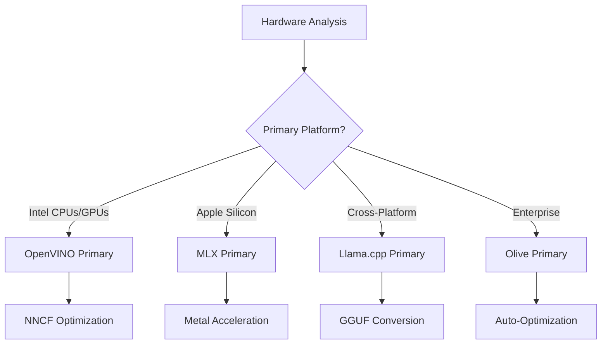
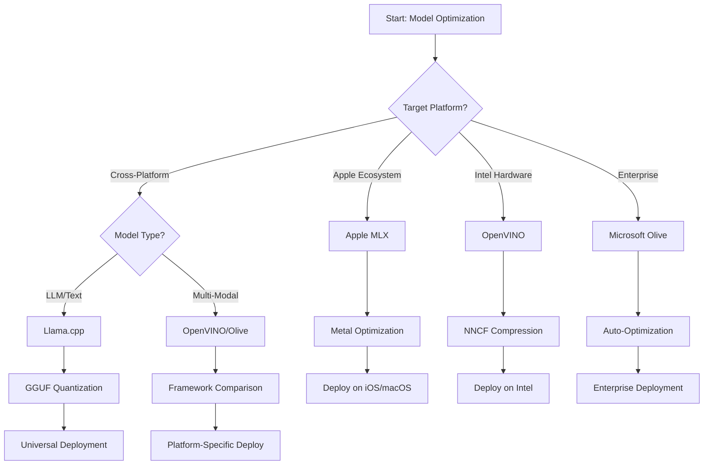
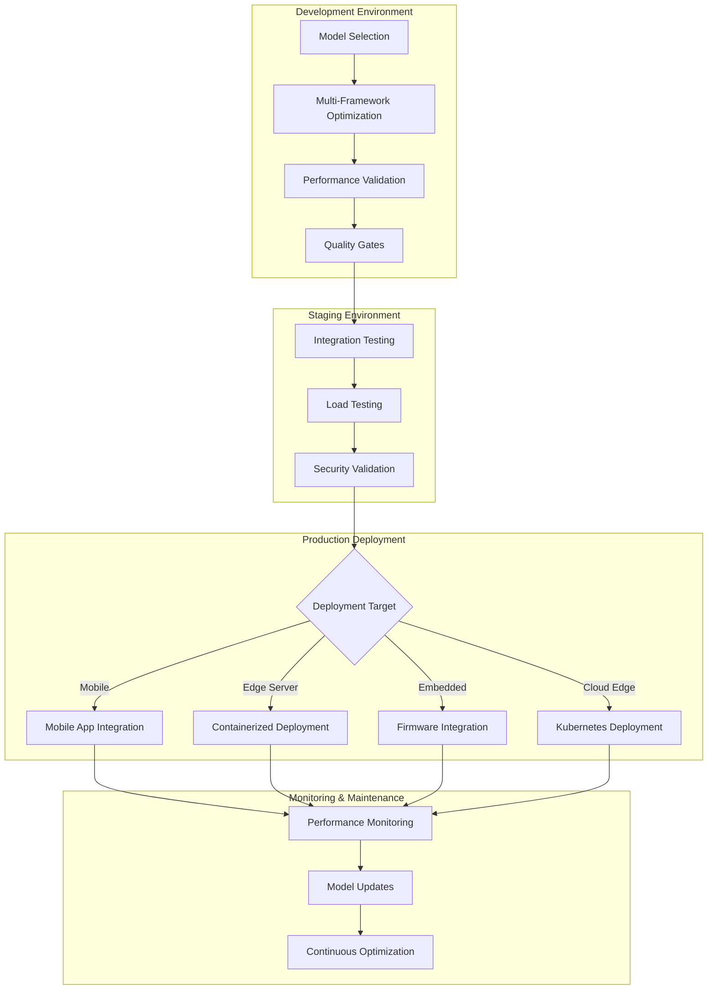

<!--
CO_OP_TRANSLATOR_METADATA:
{
  "original_hash": "6719c4a7e44b948230ac5f5cab3699bd",
  "translation_date": "2025-09-19T00:32:17+00:00",
  "source_file": "Module04/06.workflow-synthesis.md",
  "language_code": "bg"
}
-->
# Раздел 6: Синтез на работния процес за разработка на Edge AI

## Съдържание
1. [Въведение](../../../Module04)
2. [Цели на обучението](../../../Module04)
3. [Общ преглед на унифицирания работен процес](../../../Module04)
4. [Матрица за избор на рамка](../../../Module04)
5. [Синтез на най-добрите практики](../../../Module04)
6. [Ръководство за стратегия за внедряване](../../../Module04)
7. [Работен процес за оптимизация на производителността](../../../Module04)
8. [Контролен списък за готовност за производство](../../../Module04)
9. [Отстраняване на проблеми и мониторинг](../../../Module04)
10. [Осигуряване на бъдещето на вашия Edge AI процес](../../../Module04)

## Въведение

Разработката на Edge AI изисква задълбочено разбиране на множество рамки за оптимизация, стратегии за внедряване и хардуерни съображения. Този изчерпателен синтез обединява знанията от Llama.cpp, Microsoft Olive, OpenVINO и Apple MLX, за да създаде унифициран работен процес, който максимизира ефективността, поддържа качеството и гарантира успешното внедряване в производство.

През целия курс разгледахме отделни рамки за оптимизация, всяка със своите уникални предимства и специализирани приложения. Въпреки това, реалните Edge AI проекти често изискват комбиниране на техники от различни рамки или вземане на стратегически решения за това кой подход ще даде най-добри резултати при специфични ограничения и изисквания.

Този раздел синтезира колективната мъдрост от всички рамки в приложими работни процеси, решения и най-добри практики, които ви позволяват да изграждате готови за производство Edge AI решения ефективно и ефикасно. Независимо дали оптимизирате за мобилни устройства, вградени системи или edge сървъри, това ръководство предоставя стратегическа рамка за вземане на информирани решения през целия жизнен цикъл на разработката.

## Цели на обучението

До края на този раздел ще можете:

### Стратегическо вземане на решения
- **Оценяване и избор** на оптималната рамка за оптимизация въз основа на изискванията на проекта, хардуерните ограничения и сценариите за внедряване
- **Проектиране на изчерпателни работни процеси**, които интегрират множество техники за оптимизация за максимална ефективност
- **Оценяване на компромисите** между точността на модела, скоростта на извеждане, използването на паметта и сложността на внедряването в различни рамки

### Интеграция на работния процес
- **Прилагане на унифицирани процеси на разработка**, които използват силните страни на множество рамки за оптимизация
- **Създаване на възпроизводими работни процеси** за последователна оптимизация и внедряване на модели в различни среди
- **Установяване на качествени проверки** и процеси за валидиране, за да се гарантира, че оптимизираните модели отговарят на изискванията за производство

### Оптимизация на производителността
- **Прилагане на систематични стратегии за оптимизация** чрез квантизация, изрязване и техники за хардуерно ускорение
- **Мониторинг и бенчмаркинг** на производителността на модела на различни нива на оптимизация и цели за внедряване
- **Оптимизация за специфични хардуерни платформи**, включително CPU, GPU, NPU и специализирани edge ускорители

### Внедряване в производство
- **Проектиране на мащабируеми архитектури за внедряване**, които поддържат множество формати на модели и двигатели за извеждане
- **Прилагане на мониторинг и наблюдаемост** за Edge AI приложения в производствени среди
- **Установяване на работни процеси за поддръжка** за актуализации на модели, мониторинг на производителността и оптимизация на системата

### Изключителност на различни платформи
- **Внедряване на оптимизирани модели** на различни хардуерни платформи, като се поддържа последователна производителност
- **Работа с оптимизации, специфични за платформата** за Windows, macOS, Linux, мобилни и вградени системи
- **Създаване на слоеве за абстракция**, които позволяват безпроблемно внедряване в различни edge среди

## Общ преглед на унифицирания работен процес

### Фаза 1: Анализ на изискванията и избор на рамка

Основата на успешното внедряване на Edge AI започва с подробен анализ на изискванията, който информира избора на рамка и стратегия за оптимизация.

#### 1.1 Оценка на хардуера


**Основни съображения:**
- **Архитектура на CPU**: x86, ARM, възможности на Apple Silicon
- **Наличност на ускорители**: GPU, NPU, VPU, специализирани AI чипове
- **Ограничения на паметта**: RAM ограничения, капацитет за съхранение
- **Енергиен бюджет**: Живот на батерията, топлинни ограничения
- **Свързаност**: Изисквания за офлайн режим, ограничения на честотната лента

#### 1.2 Матрица на изискванията за приложение

| Изискване | Llama.cpp | Microsoft Olive | OpenVINO | Apple MLX |
|-----------|-----------|-----------------|----------|-----------|
| Кросплатформеност | ✅ Отлично | ⚡ Добро | ⚡ Добро | ❌ Само Apple |
| Интеграция в предприятия | ⚡ Основно | ✅ Отлично | ✅ Отлично | ⚡ Ограничено |
| Внедряване на мобилни устройства | ✅ Отлично | ⚡ Добро | ⚡ Добро | ✅ iOS Отлично |
| Извеждане в реално време | ✅ Отлично | ✅ Отлично | ✅ Отлично | ✅ Отлично |
| Разнообразие на модели | ✅ Фокус върху LLM | ✅ Всички модели | ✅ Всички модели | ✅ Фокус върху LLM |
| Лесна употреба | ✅ Просто | ✅ Автоматизирано | ⚡ Умерено | ✅ Просто |

### Фаза 2: Подготовка и оптимизация на модела

#### 2.1 Универсален процес за оценка на модела

```python
# Universal Model Assessment Framework
class EdgeAIModelAssessment:
    def __init__(self, model_path, target_hardware):
        self.model_path = model_path
        self.target_hardware = target_hardware
        self.optimization_frameworks = []
        
    def assess_model_characteristics(self):
        """Analyze model size, architecture, and complexity"""
        return {
            'model_size': self.get_model_size(),
            'parameter_count': self.get_parameter_count(),
            'architecture_type': self.detect_architecture(),
            'quantization_compatibility': self.check_quantization_support()
        }
    
    def recommend_optimization_strategy(self):
        """Recommend optimal frameworks and techniques"""
        characteristics = self.assess_model_characteristics()
        
        if self.target_hardware.startswith('apple'):
            return self.mlx_optimization_strategy(characteristics)
        elif self.target_hardware.startswith('intel'):
            return self.openvino_optimization_strategy(characteristics)
        elif characteristics['model_size'] > 7_000_000_000:  # 7B+ parameters
            return self.enterprise_optimization_strategy(characteristics)
        else:
            return self.lightweight_optimization_strategy(characteristics)
```

#### 2.2 Многорамков процес за оптимизация

**Последователен подход за оптимизация:**
1. **Първоначално преобразуване**: Преобразуване в междинен формат (ONNX, когато е възможно)
2. **Оптимизация, специфична за рамката**: Прилагане на специализирани техники
3. **Кръстосана валидация**: Проверка на производителността на целевите платформи
4. **Крайно пакетиране**: Подготовка за внедряване

```bash
# Multi-Framework Optimization Script
#!/bin/bash

MODEL_NAME="phi-3-mini"
BASE_MODEL="microsoft/Phi-3-mini-4k-instruct"

# Phase 1: ONNX Conversion (Universal)
python convert_to_onnx.py --model $BASE_MODEL --output models/onnx/

# Phase 2: Platform-Specific Optimization
if [[ "$TARGET_PLATFORM" == "intel" ]]; then
    # OpenVINO Optimization
    python optimize_openvino.py --input models/onnx/ --output models/openvino/
elif [[ "$TARGET_PLATFORM" == "apple" ]]; then
    # MLX Optimization
    python optimize_mlx.py --input $BASE_MODEL --output models/mlx/
elif [[ "$TARGET_PLATFORM" == "cross" ]]; then
    # Llama.cpp Optimization
    python convert_to_gguf.py --input models/onnx/ --output models/gguf/
fi

# Phase 3: Validation
python validate_optimization.py --original $BASE_MODEL --optimized models/$TARGET_PLATFORM/
```

### Фаза 3: Валидация на производителността и бенчмаркинг

#### 3.1 Изчерпателна рамка за бенчмаркинг

```python
class EdgeAIBenchmark:
    def __init__(self, optimized_models):
        self.models = optimized_models
        self.metrics = {
            'inference_time': [],
            'memory_usage': [],
            'accuracy_score': [],
            'throughput': [],
            'energy_consumption': []
        }
    
    def run_comprehensive_benchmark(self):
        """Execute standardized benchmarks across all optimized models"""
        test_inputs = self.generate_test_inputs()
        
        for model_framework, model_path in self.models.items():
            print(f"Benchmarking {model_framework}...")
            
            # Latency Testing
            latency = self.measure_inference_latency(model_path, test_inputs)
            
            # Memory Profiling
            memory = self.profile_memory_usage(model_path)
            
            # Accuracy Validation
            accuracy = self.validate_model_accuracy(model_path, test_inputs)
            
            # Throughput Analysis
            throughput = self.measure_throughput(model_path)
            
            self.record_metrics(model_framework, latency, memory, accuracy, throughput)
    
    def generate_optimization_report(self):
        """Create comprehensive comparison report"""
        report = {
            'recommendations': self.analyze_performance_trade_offs(),
            'deployment_guidance': self.generate_deployment_recommendations(),
            'monitoring_requirements': self.define_monitoring_metrics()
        }
        return report
```

## Матрица за избор на рамка

### Решаващо дърво за избор на рамка



### Изчерпателни критерии за избор

#### 1. Съответствие с основния случай на употреба

**Големи езикови модели (LLMs):**
- **Llama.cpp**: Най-добро за CPU-фокусирано, кросплатформено внедряване
- **Apple MLX**: Оптимално за Apple Silicon с унифицирана памет
- **OpenVINO**: Отлично за Intel хардуер с NNCF оптимизация
- **Microsoft Olive**: Идеално за работни процеси в предприятия с автоматизация

**Мултимодални модели:**
- **OpenVINO**: Изчерпателна поддръжка за визия, аудио и текст
- **Microsoft Olive**: Оптимизация на ниво предприятие за сложни процеси
- **Llama.cpp**: Ограничено до текстови модели
- **Apple MLX**: Нарастваща поддръжка за мултимодални приложения

#### 2. Матрица на хардуерните платформи

| Платформа | Основна рамка | Вторичен вариант | Специализирани функции |
|-----------|---------------|------------------|-------------------------|
| Intel CPU/GPU | OpenVINO | Microsoft Olive | NNCF компресия, Intel оптимизация |
| NVIDIA GPU | Microsoft Olive | OpenVINO | CUDA ускорение, функции за предприятия |
| Apple Silicon | Apple MLX | Llama.cpp | Metal шейдъри, унифицирана памет |
| ARM Mobile | Llama.cpp | OpenVINO | Кросплатформеност, минимални зависимости |
| Edge TPU | OpenVINO | Microsoft Olive | Поддръжка на специализирани ускорители |
| Вграден ARM | Llama.cpp | OpenVINO | Минимален отпечатък, ефективно извеждане |

#### 3. Предпочитания за работния процес на разработка

**Бързо прототипиране:**
1. **Llama.cpp**: Най-бърза настройка, незабавни резултати
2. **Apple MLX**: Прост Python API, бърза итерация
3. **Microsoft Olive**: Автоматизирана оптимизация, минимална конфигурация
4. **OpenVINO**: По-сложна настройка, изчерпателни функции

**Производство в предприятия:**
1. **Microsoft Olive**: Функции за предприятия, интеграция с Azure
2. **OpenVINO**: Екосистема на Intel, изчерпателни инструменти
3. **Apple MLX**: Приложения, специфични за Apple
4. **Llama.cpp**: Просто внедряване, ограничени функции за предприятия

## Синтез на най-добрите практики

### Универсални принципи за оптимизация

#### 1. Стратегия за прогресивна оптимизация

```python
class ProgressiveOptimization:
    def __init__(self, base_model):
        self.base_model = base_model
        self.optimization_stages = [
            'baseline_measurement',
            'format_conversion',
            'quantization_optimization',
            'hardware_acceleration',
            'production_validation'
        ]
    
    def execute_progressive_optimization(self):
        """Apply optimization techniques incrementally"""
        
        # Stage 1: Baseline Measurement
        baseline_metrics = self.measure_baseline_performance()
        
        # Stage 2: Format Conversion
        converted_model = self.convert_to_optimal_format()
        conversion_metrics = self.measure_performance(converted_model)
        
        # Stage 3: Quantization
        quantized_model = self.apply_quantization(converted_model)
        quantization_metrics = self.measure_performance(quantized_model)
        
        # Stage 4: Hardware Acceleration
        accelerated_model = self.enable_hardware_acceleration(quantized_model)
        acceleration_metrics = self.measure_performance(accelerated_model)
        
        # Stage 5: Validation
        production_ready = self.validate_for_production(accelerated_model)
        
        return self.compile_optimization_report(
            baseline_metrics, conversion_metrics, 
            quantization_metrics, acceleration_metrics
        )
```

#### 2. Прилагане на качествени проверки

**Проверки за запазване на точността:**
- Поддържане на >95% от оригиналната точност на модела
- Валидиране спрямо представителни тестови набори
- Прилагане на A/B тестване за валидиране в производство

**Проверки за подобрение на производителността:**
- Постигане на минимум 2x подобрение на скоростта
- Намаляване на използването на паметта с поне 50%
- Валидиране на консистентността на времето за извеждане

**Проверки за готовност за производство:**
- Успешно преминаване на стрес тестове под натоварване
- Демонстрация на стабилна производителност във времето
- Валидиране на изискванията за сигурност и поверителност

### Интеграция на най-добрите практики, специфични за рамката

#### 1. Синтез на стратегия за квантизация

```python
# Unified Quantization Approach
class UnifiedQuantizationStrategy:
    def __init__(self, model, target_platform):
        self.model = model
        self.platform = target_platform
        
    def select_optimal_quantization(self):
        """Choose best quantization based on platform and requirements"""
        
        if self.platform == 'apple_silicon':
            return self.mlx_quantization_strategy()
        elif self.platform == 'intel_hardware':
            return self.openvino_quantization_strategy()
        elif self.platform == 'cross_platform':
            return self.llamacpp_quantization_strategy()
        else:
            return self.olive_quantization_strategy()
    
    def mlx_quantization_strategy(self):
        """Apple MLX-specific quantization"""
        return {
            'method': 'mlx_quantize',
            'precision': 'int4',
            'group_size': 64,
            'optimization_target': 'unified_memory'
        }
    
    def openvino_quantization_strategy(self):
        """OpenVINO NNCF quantization"""
        return {
            'method': 'nncf_quantize',
            'precision': 'int8',
            'calibration_method': 'post_training',
            'optimization_target': 'intel_hardware'
        }
```

#### 2. Оптимизация за хардуерно ускорение

**Синтез на оптимизация за CPU:**
- **SIMD инструкции**: Използване на оптимизирани ядра в рамките на рамките
- **Пропускателна способност на паметта**: Оптимизация на разположението на данните за ефективност на кеша
- **Потокове**: Балансиране на паралелизма с ограниченията на ресурсите

**Най-добри практики за GPU ускорение:**
- **Партидна обработка**: Максимизиране на пропускателната способност с подходящи размери на партидите
- **Управление на паметта**: Оптимизация на разпределението и трансферите на GPU памет
- **Прецизност**: Използване на FP16, когато е поддържано, за по-добра производителност

**Оптимизация за NPU/специализирани ускорители:**
- **Архитектура на модела**: Осигуряване на съвместимост с възможностите на ускорителя
- **Поток на данни**: Оптимизация на входно/изходните процеси за ефективност на ускорителя
- **Стратегии за резервиране**: Прилагане на резервиране към CPU за неподдържани операции

## Ръководство за стратегия за внедряване

### Универсална архитектура за внедряване



### Патерни за внедряване, специфични за платформата

#### 1. Стратегия за внедряване на мобилни устройства

```yaml
# Mobile Deployment Configuration
mobile_deployment:
  ios:
    framework: apple_mlx
    optimization:
      quantization: int4
      memory_mapping: true
      background_execution: limited
    packaging:
      format: mlx
      bundle_size: <50MB
      
  android:
    framework: llama_cpp
    optimization:
      quantization: q4_k_m
      threading: android_optimized
      memory_management: conservative
    packaging:
      format: gguf
      apk_size: <100MB
      
  cross_platform:
    framework: onnx_runtime
    optimization:
      quantization: int8
      execution_provider: cpu
    packaging:
      format: onnx
      shared_libraries: minimal
```

#### 2. Внедряване на edge сървъри

```yaml
# Edge Server Deployment Configuration
edge_server:
  intel_based:
    framework: openvino
    optimization:
      quantization: int8
      acceleration: cpu_gpu_auto
      batch_processing: dynamic
    deployment:
      container: openvino_runtime
      orchestration: kubernetes
      scaling: horizontal
      
  nvidia_based:
    framework: microsoft_olive
    optimization:
      quantization: int4
      acceleration: cuda
      tensor_parallelism: true
    deployment:
      container: nvidia_triton
      orchestration: kubernetes
      scaling: gpu_aware
```

### Най-добри практики за контейнеризация

```dockerfile
# Multi-Framework Edge AI Container
FROM ubuntu:22.04 as base

# Install common dependencies
RUN apt-get update && apt-get install -y \
    python3 \
    python3-pip \
    build-essential \
    cmake \
    && rm -rf /var/lib/apt/lists/*

# Framework-specific stages
FROM base as openvino
RUN pip install openvino nncf optimum[intel]

FROM base as llamacpp
RUN git clone https://github.com/ggerganov/llama.cpp.git \
    && cd llama.cpp && make LLAMA_OPENBLAS=1

FROM base as olive
RUN pip install olive-ai[auto-opt] onnxruntime-genai

# Production stage with selected framework
FROM openvino as production
COPY models/ /app/models/
COPY src/ /app/src/
WORKDIR /app

EXPOSE 8080
CMD ["python3", "src/inference_server.py"]
```

## Работен процес за оптимизация на производителността

### Систематично настройване на производителността

#### 1. Процес за профилиране на производителността

```python
class EdgeAIPerformanceProfiler:
    def __init__(self, model_path, framework):
        self.model_path = model_path
        self.framework = framework
        self.profiling_results = {}
    
    def comprehensive_profiling(self):
        """Execute comprehensive performance analysis"""
        
        # CPU Profiling
        cpu_profile = self.profile_cpu_usage()
        
        # Memory Profiling
        memory_profile = self.profile_memory_usage()
        
        # Inference Latency
        latency_profile = self.profile_inference_latency()
        
        # Throughput Analysis
        throughput_profile = self.profile_throughput()
        
        # Energy Consumption (where available)
        energy_profile = self.profile_energy_consumption()
        
        return self.compile_performance_report(
            cpu_profile, memory_profile, latency_profile,
            throughput_profile, energy_profile
        )
    
    def identify_bottlenecks(self):
        """Automatically identify performance bottlenecks"""
        bottlenecks = []
        
        if self.profiling_results['cpu_utilization'] > 80:
            bottlenecks.append('cpu_bound')
        
        if self.profiling_results['memory_usage'] > 90:
            bottlenecks.append('memory_bound')
        
        if self.profiling_results['inference_variance'] > 20:
            bottlenecks.append('inconsistent_performance')
        
        return self.generate_optimization_recommendations(bottlenecks)
```

#### 2. Автоматизиран процес за оптимизация

```python
class AutomatedOptimizationPipeline:
    def __init__(self, base_model, target_constraints):
        self.base_model = base_model
        self.constraints = target_constraints
        self.optimization_history = []
    
    def execute_optimization_search(self):
        """Systematically search optimization space"""
        
        optimization_candidates = [
            {'quantization': 'int8', 'pruning': 0.1},
            {'quantization': 'int4', 'pruning': 0.2},
            {'quantization': 'int8', 'acceleration': 'gpu'},
            {'quantization': 'int4', 'acceleration': 'npu'}
        ]
        
        best_configuration = None
        best_score = 0
        
        for config in optimization_candidates:
            optimized_model = self.apply_optimization(config)
            score = self.evaluate_optimization(optimized_model)
            
            if score > best_score and self.meets_constraints(optimized_model):
                best_score = score
                best_configuration = config
            
            self.optimization_history.append({
                'config': config,
                'score': score,
                'model': optimized_model
            })
        
        return best_configuration, self.optimization_history
```

### Многоцелева оптимизация

#### 1. Парето оптимизация за Edge AI

```python
class ParetoOptimization:
    def __init__(self, objectives=['speed', 'accuracy', 'memory']):
        self.objectives = objectives
        self.pareto_frontier = []
    
    def find_pareto_optimal_solutions(self, optimization_results):
        """Identify Pareto-optimal configurations"""
        
        for result in optimization_results:
            is_dominated = False
            
            for frontier_point in self.pareto_frontier:
                if self.dominates(frontier_point, result):
                    is_dominated = True
                    break
            
            if not is_dominated:
                # Remove dominated points from frontier
                self.pareto_frontier = [
                    point for point in self.pareto_frontier 
                    if not self.dominates(result, point)
                ]
                
                self.pareto_frontier.append(result)
        
        return self.pareto_frontier
    
    def recommend_configuration(self, user_preferences):
        """Recommend configuration based on user preferences"""
        
        weighted_scores = []
        for config in self.pareto_frontier:
            score = sum(
                user_preferences[obj] * config['metrics'][obj] 
                for obj in self.objectives
            )
            weighted_scores.append((score, config))
        
        return max(weighted_scores, key=lambda x: x[0])[1]
```

## Контролен списък за готовност за производство

### Изчерпателна валидиране за производство

#### 1. Осигуряване на качеството на модела

```python
class ProductionReadinessValidator:
    def __init__(self, optimized_model, production_requirements):
        self.model = optimized_model
        self.requirements = production_requirements
        self.validation_results = {}
    
    def validate_model_quality(self):
        """Comprehensive model quality validation"""
        
        # Accuracy Validation
        accuracy_result = self.validate_accuracy()
        
        # Performance Validation
        performance_result = self.validate_performance()
        
        # Robustness Testing
        robustness_result = self.validate_robustness()
        
        # Security Assessment
        security_result = self.validate_security()
        
        # Compliance Verification
        compliance_result = self.validate_compliance()
        
        return self.compile_validation_report(
            accuracy_result, performance_result, robustness_result,
            security_result, compliance_result
        )
    
    def generate_certification_report(self):
        """Generate production certification report"""
        return {
            'model_signature': self.generate_model_signature(),
            'validation_timestamp': datetime.now(),
            'validation_results': self.validation_results,
            'deployment_approval': self.check_deployment_approval(),
            'monitoring_requirements': self.define_monitoring_requirements()
        }
```

#### 2. Контролен списък за внедряване в производство

**Валидиране преди внедряване:**
- [ ] Точността на модела отговаря на минималните изисквания (>95% от базовата линия)
- [ ] Постигнати са целите за производителност (латентност, пропускателна способност, памет)
- [ ] Оценени и смекчени са уязвимостите в сигурността
- [ ] Завършено стрес тестване под очаквано натоварване
- [ ] Тествани сценарии за отказ и валидирани процедури за възстановяване
- [ ] Конфигурирани системи за мониторинг и предупреждение
- [ ] Тествани и документирани процедури за връщане назад

**Процес на внедряване:**
- [ ] Прилагане на стратегия за внедряване "синьо-зелено"
- [ ] Конфигурирано постепенно увеличаване на трафика
- [ ] Активни табла за мониторинг в реално време
- [ ] Установени базови линии за производителност
- [ ] Дефинирани прагове за честота на грешки
- [ ] Конфигурирани автоматизирани тригери за връщане назад

**Мониторинг след внедряване:**
- [ ] Активно откриване на отклонения на модела
- [ ] Конфигурирани предупреждения за деградация на производителността
- [ ] Активен мониторинг на използването на ресурси
- [ ] Проследяване на метрики за потребителски опит
- [ ] Поддържане на версиониране и произход на модела
- [ ] Планирани редовни прегледи на производителността на модела

### Непрекъсната интеграция/непрекъснато внедряване (CI/CD)

```yaml
# Edge AI CI/CD Pipeline Configuration
edge_ai_pipeline:
  stages:
    - model_validation
    - optimization
    - testing
    - staging_deployment
    - production_deployment
    - monitoring
  
  model_validation:
    accuracy_threshold: 0.95
    performance_baseline: required
    security_scan: enabled
    
  optimization:
    frameworks:
      - llama_cpp
      - openvino
      - microsoft_olive
    validation:
      cross_validation: enabled
      performance_comparison: required
      
  testing:
    unit_tests: comprehensive
    integration_tests: full_pipeline
    load_tests: production_scale
    security_tests: comprehensive
    
  deployment:
    strategy: blue_green
    traffic_ramping: gradual
    rollback: automatic
    monitoring: real_time
```

## Отстраняване на проблеми и мониторинг

### Универсална рамка за отстраняване на проблеми

#### 1. Чести проблеми и решения

**Проблеми с производителността:**
```python
class PerformanceTroubleshooter:
    def __init__(self, model_metrics):
        self.metrics = model_metrics
        
    def diagnose_performance_issues(self):
        """Systematic performance issue diagnosis"""
        
        issues = []
        
        # High latency diagnosis
        if self.metrics['avg_latency'] > self.metrics['target_latency']:
            issues.append(self.diagnose_latency_issues())
        
        # Memory usage diagnosis
        if self.metrics['memory_usage'] > self.metrics['memory_limit']:
            issues.append(self.diagnose_memory_issues())
        
        # Throughput diagnosis
        if self.metrics['throughput'] < self.metrics['target_throughput']:
            issues.append(self.diagnose_throughput_issues())
        
        return self.generate_resolution_plan(issues)
    
    def diagnose_latency_issues(self):
        """Specific latency troubleshooting"""
        potential_causes = []
        
        if self.metrics['cpu_utilization'] > 80:
            potential_causes.append('cpu_bottleneck')
        
        if self.metrics['memory_bandwidth'] > 90:
            potential_causes.append('memory_bandwidth_limit')
        
        if self.metrics['model_size'] > self.metrics['optimal_size']:
            potential_causes.append('model_too_large')
        
        return {
            'issue': 'high_latency',
            'causes': potential_causes,
            'solutions': self.generate_latency_solutions(potential_causes)
        }
```

**Отстраняване на проблеми, специфични за рамката:**

| Проблем | Llama.cpp | Microsoft Olive | OpenVINO | Apple MLX |
|---------|-----------|-----------------|----------|-----------|
| Проблеми с паметта | Намаляване на дължината на контекста | Намаляване на размера на партидата | Активиране на кеширане | Използване на паметно картографиране |
| Бавно извеждане | Активиране на SIMD | Проверка на квантизацията | Оптимизация на потоците | Активира
Запомнете, че най-добрата стратегия за оптимизация е тази, която отговаря на вашите специфични изисквания, като същевременно запазва гъвкавостта да се адаптира, когато тези изисквания се променят. Използвайте това ръководство като рамка за вземане на информирани решения, но винаги проверявайте избора си чрез емпирично тестване и опит от реални внедрения.

## ➡️ Какво следва

Продължете своето пътуване в Edge AI, като разгледате [Модул 5: SLMOps и внедряване в производство](../Module05/README.md), за да научите повече за оперативните аспекти на управлението на жизнения цикъл на малки езикови модели.

---

**Отказ от отговорност**:  
Този документ е преведен с помощта на AI услуга за превод [Co-op Translator](https://github.com/Azure/co-op-translator). Въпреки че се стремим към точност, моля, имайте предвид, че автоматизираните преводи може да съдържат грешки или неточности. Оригиналният документ на неговия роден език трябва да се счита за авторитетен източник. За критична информация се препоръчва професионален човешки превод. Ние не носим отговорност за недоразумения или погрешни интерпретации, произтичащи от използването на този превод.