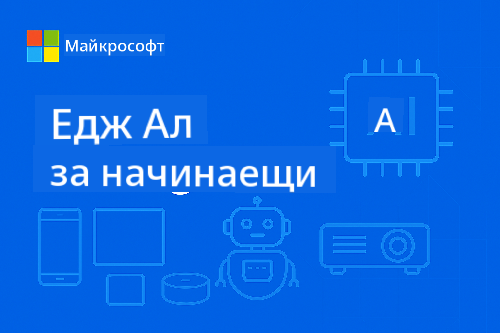

<!--
CO_OP_TRANSLATOR_METADATA:
{
  "original_hash": "3f3219903847ef3849e482fa30a64ad4",
  "translation_date": "2025-09-26T09:52:16+00:00",
  "source_file": "README.md",
  "language_code": "bg"
}
-->
# EdgeAI за начинаещи



[](https://GitHub.com/microsoft/edgeai-for-beginners/graphs/contributors)
[](https://GitHub.com/microsoft/edgeai-for-beginners/issues)
[](https://GitHub.com/microsoft/edgeai-for-beginners/pulls)
[](http://makeapullrequest.com)

[](https://GitHub.com/microsoft/edgeai-for-beginners/watchers)
[](https://GitHub.com/microsoft/edgeai-for-beginners/fork)
[](https://GitHub.com/microsoft/edgeai-for-beginners/stargazers)

[](https://discord.com/invite/ByRwuEEgH4)

Следвайте тези стъпки, за да започнете да използвате тези ресурси:

1. **Fork на репозитория**: Кликнете [](https://GitHub.com/microsoft/edgeai-for-beginners/fork)
2. **Клонирайте репозитория**: `git clone https://github.com/microsoft/edgeai-for-beginners.git`
3. [**Присъединете се към Azure AI Foundry Discord и се срещнете с експерти и други разработчици**](https://discord.com/invite/ByRwuEEgH4)

### 🌐 Поддръжка на много езици

#### Поддържани чрез GitHub Action (Автоматизирано и винаги актуално)

[Арабски](../ar/README.md) | [Бенгалски](../bn/README.md) | [Български](./README.md) | [Бирмански (Мианмар)](../my/README.md) | [Китайски (опростен)](../zh/README.md) | [Китайски (традиционен, Хонг Конг)](../hk/README.md) | [Китайски (традиционен, Макао)](../mo/README.md) | [Китайски (традиционен, Тайван)](../tw/README.md) | [Хърватски](../hr/README.md) | [Чешки](../cs/README.md) | [Датски](../da/README.md) | [Холандски](../nl/README.md) | [Фински](../fi/README.md) | [Френски](../fr/README.md) | [Немски](../de/README.md) | [Гръцки](../el/README.md) | [Иврит](../he/README.md) | [Хинди](../hi/README.md) | [Унгарски](../hu/README.md) | [Индонезийски](../id/README.md) | [Италиански](../it/README.md) | [Японски](../ja/README.md) | [Корейски](../ko/README.md) | [Малайски](../ms/README.md) | [Марати](../mr/README.md) | [Непалски](../ne/README.md) | [Норвежки](../no/README.md) | [Персийски (Фарси)](../fa/README.md) | [Полски](../pl/README.md) | [Португалски (Бразилия)](../br/README.md) | [Португалски (Португалия)](../pt/README.md) | [Пенджабски (Гурмукхи)](../pa/README.md) | [Румънски](../ro/README.md) | [Руски](../ru/README.md) | [Сръбски (Кирилица)](../sr/README.md) | [Словашки](../sk/README.md) | [Словенски](../sl/README.md) | [Испански](../es/README.md) | [Суахили](../sw/README.md) | [Шведски](../sv/README.md) | [Тагалог (Филипински)](../tl/README.md) | [Тайландски](../th/README.md) | [Турски](../tr/README.md) | [Украински](../uk/README.md) | [Урду](../ur/README.md) | [Виетнамски](../vi/README.md)

**Ако желаете да бъдат добавени допълнителни езици, списъкът с поддържани езици е [тук](https://github.com/Azure/co-op-translator/blob/main/getting_started/supported-languages.md)**

## Въведение

Добре дошли в **EdgeAI за начинаещи** – вашето пътешествие в трансформиращия свят на Edge изкуствения интелект. Този курс свързва мощните възможности на AI с практическото му приложение на устройства на ръба, като ви дава възможност да използвате потенциала на AI директно там, където се генерират данни и трябва да се вземат решения.

### Какво ще научите

Този курс ще ви преведе от основните концепции до готови за производство реализации, обхващайки:
- **Малки езикови модели (SLMs)**, оптимизирани за внедряване на ръба
- **Оптимизация, съобразена с хардуера** за различни платформи
- **Реално време на изводи** с възможности за запазване на поверителността
- **Стратегии за внедряване в производството** за корпоративни приложения

### Защо EdgeAI е важен

Edge AI представлява промяна в парадигмата, която адресира ключови съвременни предизвикателства:
- **Поверителност и сигурност**: Обработвайте чувствителни данни локално, без да ги изпращате в облака
- **Производителност в реално време**: Елиминирайте мрежовата латентност за приложения, изискващи бързи реакции
- **Икономическа ефективност**: Намалете разходите за мрежова връзка и облачни изчисления
- **Устойчиви операции**: Поддържайте функционалност дори при прекъсвания на мрежата
- **Съответствие с регулациите**: Спазвайте изискванията за суверенитет на данните

### Edge AI

Edge AI се отнася до изпълнението на AI алгоритми и езикови модели локално на хардуер, близо до мястото, където се генерират данни, без да се разчита на облачни ресурси за изводи. Това намалява латентността, подобрява поверителността и позволява вземане на решения в реално време.

### Основни принципи:
- **Изводи на устройството**: AI моделите се изпълняват на устройства на ръба (телефони, рутери, микроконтролери, индустриални компютри)
- **Офлайн възможности**: Функционира без постоянна интернет връзка
- **Ниска латентност**: Незабавни отговори, подходящи за системи в реално време
- **Суверенитет на данните**: Поддържа чувствителните данни локално, подобрявайки сигурността и съответствието

### Малки езикови модели (SLMs)

SLMs като Phi-4, Mistral-7B и Gemma са оптимизирани версии на по-големи LLMs – обучени или дистилирани за:
- **Намалена памет**: Ефективно използване на ограничената памет на устройствата на ръба
- **По-ниски изчислителни изисквания**: Оптимизирани за производителност на CPU и edge GPU
- **По-бързо стартиране**: Бърза инициализация за отзивчиви приложения

Те отключват мощни NLP възможности, като същевременно отговарят на ограниченията на:
- **Вградени системи**: IoT устройства и индустриални контролери
- **Мобилни устройства**: Смартфони и таблети с офлайн възможности
- **IoT устройства**: Сензори и умни устройства с ограничени ресурси
- **Edge сървъри**: Локални процесорни единици с ограничени GPU ресурси
- **Персонални компютри**: Сценарии за внедряване на настолни и лаптоп компютри

## Модули на курса и навигация

| Модул | Тема | Фокусна област | Основно съдържание | Ниво | Продължителност |
|-------|------|----------------|--------------------|------|-----------------|
| [📖 00 ](./introduction.md) | [Въведение в EdgeAI](./introduction.md) | Основи и контекст | Преглед на EdgeAI • Приложения в индустрията • Въведение в SLM • Учебни цели | Начинаещ | 1-2 ч. |
| [📚 01](../../Module01) | [Основи на EdgeAI](./Module01/README.md) | Сравнение между облачен и Edge AI | Основи на EdgeAI • Примери от реалния свят • Ръководство за внедряване • Edge внедряване | Начинаещ | 3-4 ч. |
| [🧠 02](../../Module02) | [Основи на SLM моделите](./Module02/README.md) | Семейства и архитектура на моделите | Phi Family • Qwen Family • Gemma Family • BitNET • μModel • Phi-Silica | Начинаещ | 4-5 ч. |
| [🚀 03](../../Module03) | [Практика за внедряване на SLM](./Module03/README.md) | Локално и облачно внедряване | Разширено обучение • Локална среда • Облачно внедряване | Средно | 4-5 ч. |
| [⚙️ 04](../../Module04) | [Инструментариум за оптимизация на модели](./Module04/README.md) | Кросплатформена оптимизация | Въведение • Llama.cpp • Microsoft Olive • OpenVINO • Apple MLX • Синтез на работни потоци | Средно | 5-6 ч. |
| [🔧 05](../../Module05) | [SLMOps в производството](./Module05/README.md) | Операции в производството | Въведение в SLMOps • Дистилация на модели • Фина настройка • Внедряване в производството | Напреднало | 5-6 ч. |
| [🤖 06](../../Module06) | [AI агенти и извикване на функции](./Module06/README.md) | Рамки за агенти и MCP | Въведение в агентите • Извикване на функции • Протокол за контекст на модела | Напреднало | 4-5 ч. |
| [💻 07](../../Module07) | [Платформена имплементация](./Module07/README.md) | Кросплатформени примери | AI инструментариум • Foundry Local • Разработка за Windows | Напреднало | 3-4 ч. |
| [🏭 08](../../Module08) | [Foundry Local Toolkit](./Module08/README.md) | Примери, готови за производство | Примерни приложения (вижте подробности по-долу) | Експерт | 8-10 ч. |

### 🏭 **Модул 08: Примерни приложения**

- [01: REST Chat Quickstart](./Module08/samples/01/README.md)
- [02: Интеграция на OpenAI SDK](./Module08/samples/02/README.md)
- [03: Откриване и бенчмаркинг на модели](./Module08/samples/03/README.md)
- [04: Chainlit RAG приложение](./Module08/samples/04/README.md)
- [05: Оркестрация на множество агенти](./Module08/samples/05/README.md)
- [06: Рутер за модели като инструменти](./Module08/samples/06/README.md)
- [07: Директен API клиент](./Module08/samples/07/README.md)
- [08: Chat приложение за Windows 11](./Module08/samples/08/README.md)
- [09: Разширена система с множество агенти](./Module08/samples/09/README.md)
- [10: Рамка за инструменти на Foundry](./Module08/samples/10/README.md)

### 📊 **Обобщение на учебния път**
- **Обща продължителност**: 36-45 часа
- **Път за начинаещи**: Модули 01-02 (7-9 часа)  
- **Път за средно ниво**: Модули 03-04 (9-11 часа)
- **Път за напреднали**: Модули 05-07 (12-15 часа)
- **Път за експерти**: Модул 08 (8-10 часа)

## Какво ще изградите

### 🎯 Основни компетенции
- **Архитектура на Edge AI**: Проектиране на локални AI системи с интеграция в облака
- **Оптимизация на модели**: Квантизация и компресия на модели за внедряване на ръба (85% ускорение, 75% намаление на размера)
- **Мултиплатформено внедряване**: Windows, мобилни устройства, вградени системи и хибридни облачно-ръбови системи
- **Операции в производството**: Мониторинг, мащабиране и поддръжка на Edge AI в производствени условия

### 🏗️ Практически проекти
- **Foundry Local Chat приложения**: Нативно приложение за Windows 11 с превключване на модели
- **Системи с множество агенти**: Координатор със специализирани агенти за сложни работни потоци  
- **RAG приложения**: Локална обработка на документи с векторно търсене
- **Рутери за модели**: Интелигентен избор между модели въз основа на анализ на задачите
- **API рамки**: Клиенти, готови за производство, със стрийминг и мониторинг на състоянието
- **Кросплатформени инструменти**: Модели за интеграция с LangChain/Semantic Kernel

### 🏢 Приложения в индустрията
**Производство** • **Здравеопазване** • **Автономни превозни средства** • **Умни градове** • **Мобилни приложения**

## Бърз старт

**Препоръчан учебен път** (20-30 часа общо):

0. **📖 Въведение** ([Introduction.md](./introduction.md)): Основи на EdgeAI + контекст в индустрията + учебна рамка
1. **📚 Основи** (Модули 01-02): Концепции на EdgeAI + семейства SLM модели
2. **⚙️ Оптимизация** (Модули 03-04): Внедряване + рамки за квантизация  
3. **🚀 Продукция** (Модули 05-06): SLMOps + AI агенти + извикване на функции  
4. **💻 Имплементация** (Модули 07-08): Примерни платформи + Foundry Local инструментариум  

Всеки модул включва теория, практически упражнения и примери с готов за продукция код.

## Въздействие върху кариерата

**Технически роли**: Архитект на EdgeAI решения • ML инженер (Edge) • IoT AI разработчик • Мобилен AI разработчик  

**Индустриални сектори**: Производство 4.0 • Здравни технологии • Автономни системи • ФинТех • Потребителска електроника  

**Проекти за портфолио**: Мулти-агентни системи • Продукционни RAG приложения • Кросплатформено внедряване • Оптимизация на производителността  

## Структура на репозитория

```
edgeai-for-beginners/
├── 📖 introduction.md  # Foundation: EdgeAI Overview & Learning Framework
├── 📚 Module01-04/     # Fundamentals → SLMs → Deployment → Optimization  
├── 🔧 Module05-06/     # SLMOps → AI Agents → Function Calling
├── 💻 Module07/        # Platform Samples (VS Code, Windows, Jetson, Mobile)
├── 🏭 Module08/        # Foundry Local Toolkit + 10 Comprehensive Samples
│   ├── samples/01-06/  # Foundation: REST, SDK, RAG, Agents, Routing
│   └── samples/07-10/  # Advanced: API Client, Windows App, Enterprise Agents, Tools
├── 🌐 translations/    # Multi-language support (8+ languages)
└── 📋 STUDY_GUIDE.md   # Structured learning paths & time allocation
```
  
## Основни акценти на курса

✅ **Прогресивно обучение**: Теория → Практика → Продукционно внедряване  
✅ **Реални казуси**: Microsoft, Japan Airlines, корпоративни внедрявания  
✅ **Практически примери**: Над 50 примера, 10 изчерпателни Foundry Local демонстрации  
✅ **Фокус върху производителността**: 85% подобрение на скоростта, 75% намаление на размера  
✅ **Мултиплатформеност**: Windows, мобилни устройства, вградени системи, хибрид облак-край  
✅ **Готовност за продукция**: Мониторинг, мащабиране, сигурност, рамки за съответствие  

📖 **[Наличен учебен наръчник](STUDY_GUIDE.md)**: Структуриран 20-часов учебен план с насоки за разпределение на времето и инструменти за самооценка.

---

**EdgeAI представлява бъдещето на AI внедряването**: локално ориентирано, запазващо поверителността и ефективно. Овладейте тези умения, за да създавате следващото поколение интелигентни приложения.

## Други курсове

Нашият екип предлага и други курсове! Разгледайте:  

- [MCP за начинаещи](https://github.com/microsoft/mcp-for-beginners)  
- [AI агенти за начинаещи](https://github.com/microsoft/ai-agents-for-beginners?WT.mc_id=academic-105485-koreyst)  
- [Генеративен AI за начинаещи с .NET](https://github.com/microsoft/Generative-AI-for-beginners-dotnet?WT.mc_id=academic-105485-koreyst)  
- [Генеративен AI за начинаещи с JavaScript](https://github.com/microsoft/generative-ai-with-javascript?WT.mc_id=academic-105485-koreyst)  
- [Генеративен AI за начинаещи](https://github.com/microsoft/generative-ai-for-beginners?WT.mc_id=academic-105485-koreyst)  
- [ML за начинаещи](https://aka.ms/ml-beginners?WT.mc_id=academic-105485-koreyst)  
- [Наука за данни за начинаещи](https://aka.ms/datascience-beginners?WT.mc_id=academic-105485-koreyst)  
- [AI за начинаещи](https://aka.ms/ai-beginners?WT.mc_id=academic-105485-koreyst)  
- [Киберсигурност за начинаещи](https://github.com/microsoft/Security-101??WT.mc_id=academic-96948-sayoung)  
- [Уеб разработка за начинаещи](https://aka.ms/webdev-beginners?WT.mc_id=academic-105485-koreyst)  
- [IoT за начинаещи](https://aka.ms/iot-beginners?WT.mc_id=academic-105485-koreyst)  
- [XR разработка за начинаещи](https://github.com/microsoft/xr-development-for-beginners?WT.mc_id=academic-105485-koreyst)  
- [Овладяване на GitHub Copilot за AI програмиране в екип](https://aka.ms/GitHubCopilotAI?WT.mc_id=academic-105485-koreyst)  
- [Овладяване на GitHub Copilot за C#/.NET разработчици](https://github.com/microsoft/mastering-github-copilot-for-dotnet-csharp-developers?WT.mc_id=academic-105485-koreyst)  
- [Избери своето приключение с Copilot](https://github.com/microsoft/CopilotAdventures?WT.mc_id=academic-105485-koreyst)  

---

