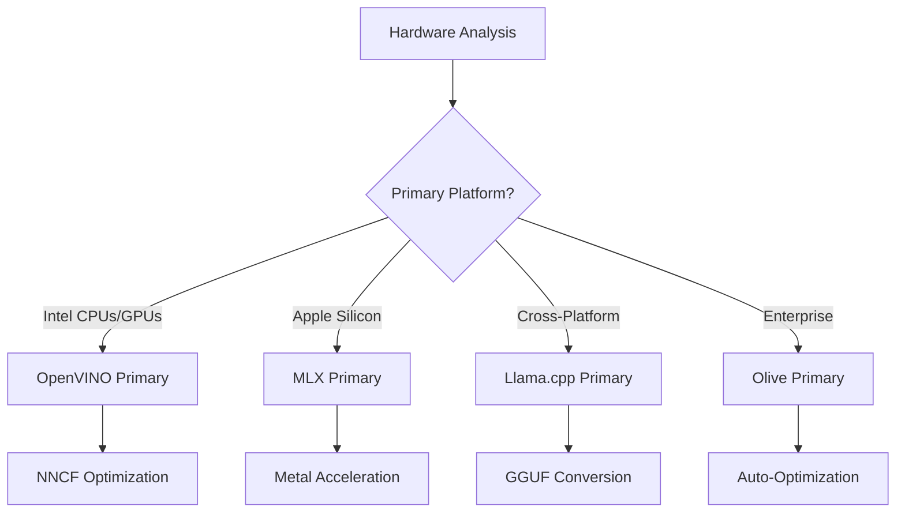
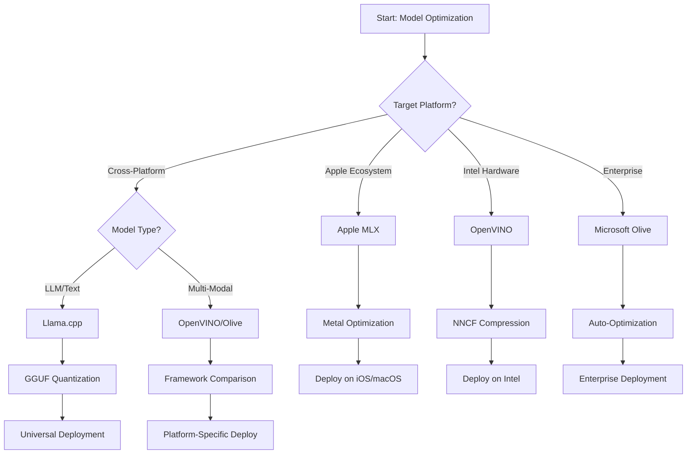
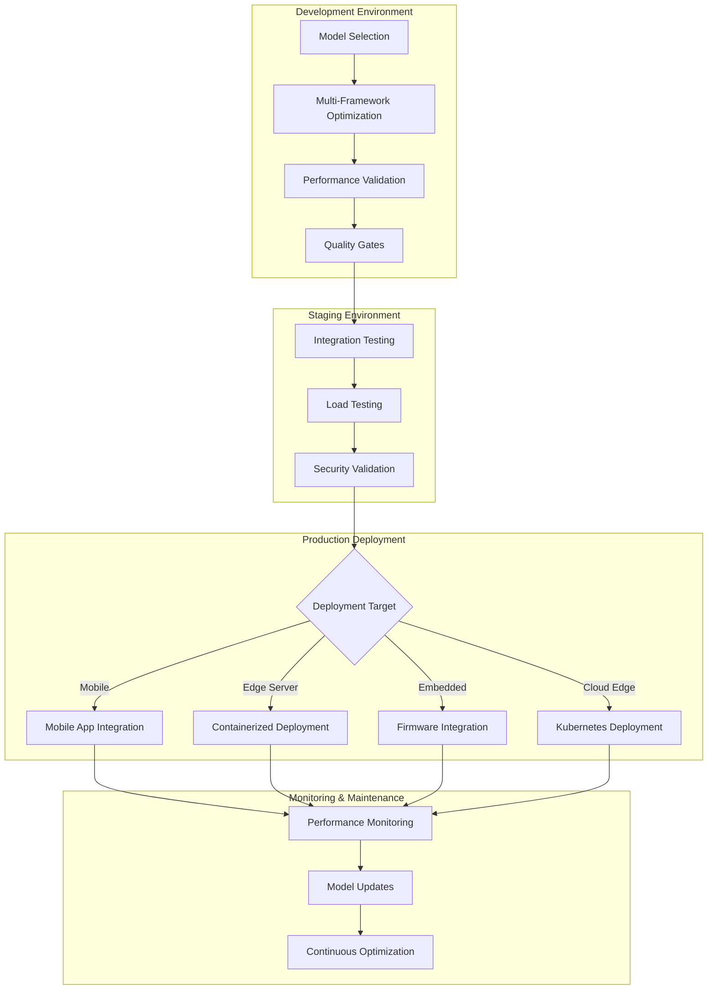

<!--
CO_OP_TRANSLATOR_METADATA:
{
  "original_hash": "6719c4a7e44b948230ac5f5cab3699bd",
  "translation_date": "2025-09-17T20:56:17+00:00",
  "source_file": "Module04/06.workflow-synthesis.md",
  "language_code": "bn"
}
-->
# অধ্যায় ৬: এজ এআই ডেভেলপমেন্ট ওয়ার্কফ্লো সংশ্লেষণ

## বিষয়সূচি
1. [ভূমিকা](../../../Module04)
2. [শিক্ষার লক্ষ্য](../../../Module04)
3. [একীভূত ওয়ার্কফ্লো ওভারভিউ](../../../Module04)
4. [ফ্রেমওয়ার্ক নির্বাচন ম্যাট্রিক্স](../../../Module04)
5. [সেরা পদ্ধতির সংশ্লেষণ](../../../Module04)
6. [ডিপ্লয়মেন্ট কৌশল গাইড](../../../Module04)
7. [পারফরম্যান্স অপ্টিমাইজেশন ওয়ার্কফ্লো](../../../Module04)
8. [প্রোডাকশন প্রস্তুতির চেকলিস্ট](../../../Module04)
9. [সমস্যা সমাধান এবং পর্যবেক্ষণ](../../../Module04)
10. [আপনার এজ এআই পাইপলাইন ভবিষ্যত-প্রমাণ করা](../../../Module04)

## ভূমিকা

এজ এআই ডেভেলপমেন্টের জন্য বিভিন্ন অপ্টিমাইজেশন ফ্রেমওয়ার্ক, ডিপ্লয়মেন্ট কৌশল এবং হার্ডওয়্যার বিবেচনার একটি গভীর জ্ঞান প্রয়োজন। এই ব্যাপক সংশ্লেষণ Llama.cpp, Microsoft Olive, OpenVINO এবং Apple MLX থেকে প্রাপ্ত জ্ঞানকে একত্রিত করে একটি একীভূত ওয়ার্কফ্লো তৈরি করে যা দক্ষতা সর্বাধিক করে, গুণমান বজায় রাখে এবং সফল প্রোডাকশন ডিপ্লয়মেন্ট নিশ্চিত করে।

এই কোর্সে আমরা প্রতিটি অপ্টিমাইজেশন ফ্রেমওয়ার্কের অনন্য শক্তি এবং বিশেষায়িত ব্যবহারের ক্ষেত্রে আলাদা করে আলোচনা করেছি। তবে, বাস্তব জীবনের এজ এআই প্রকল্পগুলিতে প্রায়শই একাধিক ফ্রেমওয়ার্কের কৌশল একত্রিত করা বা নির্দিষ্ট সীমাবদ্ধতা এবং প্রয়োজনীয়তার জন্য কোন পদ্ধতি সেরা ফলাফল দেবে তা নিয়ে কৌশলগত সিদ্ধান্ত নেওয়া প্রয়োজন।

এই অধ্যায়টি সমস্ত ফ্রেমওয়ার্ক থেকে প্রাপ্ত সম্মিলিত জ্ঞানকে কার্যকরী ওয়ার্কফ্লো, সিদ্ধান্ত গাছ এবং সেরা পদ্ধতিতে সংশ্লেষিত করে যা আপনাকে দক্ষতার সাথে এবং কার্যকরভাবে প্রোডাকশন-প্রস্তুত এজ এআই সমাধান তৈরি করতে সক্ষম করে। আপনি মোবাইল ডিভাইস, এমবেডেড সিস্টেম বা এজ সার্ভারের জন্য অপ্টিমাইজ করছেন কিনা, এই গাইডটি আপনার ডেভেলপমেন্ট লাইফসাইকেল জুড়ে তথ্যপূর্ণ সিদ্ধান্ত নেওয়ার জন্য একটি কৌশলগত কাঠামো প্রদান করে।

## শিক্ষার লক্ষ্য

এই অধ্যায় শেষে, আপনি সক্ষম হবেন:

### কৌশলগত সিদ্ধান্ত গ্রহণ
- **মূল্যায়ন এবং নির্বাচন করুন** প্রকল্পের প্রয়োজনীয়তা, হার্ডওয়্যার সীমাবদ্ধতা এবং ডিপ্লয়মেন্ট পরিস্থিতির উপর ভিত্তি করে সর্বোত্তম অপ্টিমাইজেশন ফ্রেমওয়ার্ক
- **বিস্তৃত ওয়ার্কফ্লো ডিজাইন করুন** যা সর্বাধিক দক্ষতার জন্য একাধিক অপ্টিমাইজেশন কৌশলকে সংহত করে
- **ট্রেড-অফ মূল্যায়ন করুন** মডেলের নির্ভুলতা, ইনফারেন্স গতি, মেমরি ব্যবহার এবং বিভিন্ন ফ্রেমওয়ার্ক জুড়ে ডিপ্লয়মেন্ট জটিলতার মধ্যে

### ওয়ার্কফ্লো ইন্টিগ্রেশন
- **একীভূত ডেভেলপমেন্ট পাইপলাইন বাস্তবায়ন করুন** যা একাধিক অপ্টিমাইজেশন ফ্রেমওয়ার্কের শক্তি ব্যবহার করে
- **পুনরুত্পাদনযোগ্য ওয়ার্কফ্লো তৈরি করুন** যা বিভিন্ন পরিবেশ জুড়ে মডেল অপ্টিমাইজেশন এবং ডিপ্লয়মেন্টে সামঞ্জস্য বজায় রাখে
- **গুণমান গেট এবং যাচাইকরণ প্রক্রিয়া স্থাপন করুন** যাতে অপ্টিমাইজড মডেলগুলি প্রোডাকশন প্রয়োজনীয়তা পূরণ করে

### পারফরম্যান্স অপ্টিমাইজেশন
- **পদ্ধতিগত অপ্টিমাইজেশন কৌশল প্রয়োগ করুন** কোয়ান্টাইজেশন, প্রুনিং এবং হার্ডওয়্যার-নির্দিষ্ট অ্যাক্সিলারেশন কৌশল ব্যবহার করে
- **মডেলের পারফরম্যান্স পর্যবেক্ষণ এবং বেঞ্চমার্ক করুন** বিভিন্ন অপ্টিমাইজেশন স্তর এবং ডিপ্লয়মেন্ট লক্ষ্য জুড়ে
- **নির্দিষ্ট হার্ডওয়্যার প্ল্যাটফর্মের জন্য অপ্টিমাইজ করুন** যেমন CPU, GPU, NPU এবং বিশেষায়িত এজ অ্যাক্সিলারেটর

### প্রোডাকশন ডিপ্লয়মেন্ট
- **স্কেলযোগ্য ডিপ্লয়মেন্ট আর্কিটেকচার ডিজাইন করুন** যা একাধিক মডেল ফরম্যাট এবং ইনফারেন্স ইঞ্জিনকে সমর্থন করে
- **প্রোডাকশন পরিবেশে এজ এআই অ্যাপ্লিকেশনের জন্য পর্যবেক্ষণ এবং পর্যবেক্ষণযোগ্যতা বাস্তবায়ন করুন**
- **মডেল আপডেট, পারফরম্যান্স পর্যবেক্ষণ এবং সিস্টেম অপ্টিমাইজেশনের জন্য রক্ষণাবেক্ষণ ওয়ার্কফ্লো স্থাপন করুন**

### ক্রস-প্ল্যাটফর্ম দক্ষতা
- **বিভিন্ন হার্ডওয়্যার প্ল্যাটফর্ম জুড়ে অপ্টিমাইজড মডেল ডিপ্লয় করুন** এবং সামঞ্জস্যপূর্ণ পারফরম্যান্স বজায় রাখুন
- **প্ল্যাটফর্ম-নির্দিষ্ট অপ্টিমাইজেশন পরিচালনা করুন** Windows, macOS, Linux, মোবাইল এবং এমবেডেড সিস্টেমের জন্য
- **অ্যাবস্ট্রাকশন লেয়ার তৈরি করুন** যা বিভিন্ন এজ পরিবেশ জুড়ে নির্বিঘ্ন ডিপ্লয়মেন্ট সক্ষম করে

## একীভূত ওয়ার্কফ্লো ওভারভিউ

### ধাপ ১: প্রয়োজনীয়তা বিশ্লেষণ এবং ফ্রেমওয়ার্ক নির্বাচন

সফল এজ এআই ডিপ্লয়মেন্টের ভিত্তি হল একটি বিস্তারিত প্রয়োজনীয়তা বিশ্লেষণ যা ফ্রেমওয়ার্ক নির্বাচন এবং অপ্টিমাইজেশন কৌশলকে নির্দেশ করে।

#### ১.১ হার্ডওয়্যার মূল্যায়ন


**মূল বিবেচ্য বিষয়:**
- **CPU আর্কিটেকচার**: x86, ARM, Apple Silicon ক্ষমতা
- **অ্যাক্সিলারেটর উপলব্ধতা**: GPU, NPU, VPU, বিশেষায়িত AI চিপ
- **মেমরি সীমাবদ্ধতা**: RAM সীমাবদ্ধতা, স্টোরেজ ক্ষমতা
- **পাওয়ার বাজেট**: ব্যাটারি লাইফ, তাপীয় সীমাবদ্ধতা
- **সংযোগ**: অফলাইন প্রয়োজনীয়তা, ব্যান্ডউইথ সীমাবদ্ধতা

#### ১.২ অ্যাপ্লিকেশন প্রয়োজনীয়তা ম্যাট্রিক্স

| প্রয়োজনীয়তা | Llama.cpp | Microsoft Olive | OpenVINO | Apple MLX |
|----------------|-----------|-----------------|----------|-----------|
| ক্রস-প্ল্যাটফর্ম | ✅ চমৎকার | ⚡ ভালো | ⚡ ভালো | ❌ শুধুমাত্র Apple |
| এন্টারপ্রাইজ ইন্টিগ্রেশন | ⚡ মৌলিক | ✅ চমৎকার | ✅ চমৎকার | ⚡ সীমিত |
| মোবাইল ডিপ্লয়মেন্ট | ✅ চমৎকার | ⚡ ভালো | ⚡ ভালো | ✅ iOS চমৎকার |
| রিয়েল-টাইম ইনফারেন্স | ✅ চমৎকার | ✅ চমৎকার | ✅ চমৎকার | ✅ চমৎকার |
| মডেল বৈচিত্র্য | ✅ LLM ফোকাস | ✅ সব মডেল | ✅ সব মডেল | ✅ LLM ফোকাস |
| ব্যবহারের সহজতা | ✅ সহজ | ✅ স্বয়ংক্রিয় | ⚡ মাঝারি | ✅ সহজ |

### ধাপ ২: মডেল প্রস্তুতি এবং অপ্টিমাইজেশন

#### ২.১ ইউনিভার্সাল মডেল মূল্যায়ন পাইপলাইন

```python
# Universal Model Assessment Framework
class EdgeAIModelAssessment:
    def __init__(self, model_path, target_hardware):
        self.model_path = model_path
        self.target_hardware = target_hardware
        self.optimization_frameworks = []
        
    def assess_model_characteristics(self):
        """Analyze model size, architecture, and complexity"""
        return {
            'model_size': self.get_model_size(),
            'parameter_count': self.get_parameter_count(),
            'architecture_type': self.detect_architecture(),
            'quantization_compatibility': self.check_quantization_support()
        }
    
    def recommend_optimization_strategy(self):
        """Recommend optimal frameworks and techniques"""
        characteristics = self.assess_model_characteristics()
        
        if self.target_hardware.startswith('apple'):
            return self.mlx_optimization_strategy(characteristics)
        elif self.target_hardware.startswith('intel'):
            return self.openvino_optimization_strategy(characteristics)
        elif characteristics['model_size'] > 7_000_000_000:  # 7B+ parameters
            return self.enterprise_optimization_strategy(characteristics)
        else:
            return self.lightweight_optimization_strategy(characteristics)
```

#### ২.২ মাল্টি-ফ্রেমওয়ার্ক অপ্টিমাইজেশন পাইপলাইন

**ক্রমিক অপ্টিমাইজেশন পদ্ধতি:**
1. **প্রাথমিক রূপান্তর**: মধ্যবর্তী ফরম্যাটে রূপান্তর (যখন সম্ভব ONNX)
2. **ফ্রেমওয়ার্ক-নির্দিষ্ট অপ্টিমাইজেশন**: বিশেষায়িত কৌশল প্রয়োগ করুন
3. **ক্রস-ভ্যালিডেশন**: লক্ষ্য প্ল্যাটফর্ম জুড়ে পারফরম্যান্স যাচাই করুন
4. **চূড়ান্ত প্যাকেজিং**: ডিপ্লয়মেন্টের জন্য প্রস্তুত করুন

```bash
# Multi-Framework Optimization Script
#!/bin/bash

MODEL_NAME="phi-3-mini"
BASE_MODEL="microsoft/Phi-3-mini-4k-instruct"

# Phase 1: ONNX Conversion (Universal)
python convert_to_onnx.py --model $BASE_MODEL --output models/onnx/

# Phase 2: Platform-Specific Optimization
if [[ "$TARGET_PLATFORM" == "intel" ]]; then
    # OpenVINO Optimization
    python optimize_openvino.py --input models/onnx/ --output models/openvino/
elif [[ "$TARGET_PLATFORM" == "apple" ]]; then
    # MLX Optimization
    python optimize_mlx.py --input $BASE_MODEL --output models/mlx/
elif [[ "$TARGET_PLATFORM" == "cross" ]]; then
    # Llama.cpp Optimization
    python convert_to_gguf.py --input models/onnx/ --output models/gguf/
fi

# Phase 3: Validation
python validate_optimization.py --original $BASE_MODEL --optimized models/$TARGET_PLATFORM/
```

### ধাপ ৩: পারফরম্যান্স যাচাই এবং বেঞ্চমার্কিং

#### ৩.১ ব্যাপক বেঞ্চমার্কিং ফ্রেমওয়ার্ক

```python
class EdgeAIBenchmark:
    def __init__(self, optimized_models):
        self.models = optimized_models
        self.metrics = {
            'inference_time': [],
            'memory_usage': [],
            'accuracy_score': [],
            'throughput': [],
            'energy_consumption': []
        }
    
    def run_comprehensive_benchmark(self):
        """Execute standardized benchmarks across all optimized models"""
        test_inputs = self.generate_test_inputs()
        
        for model_framework, model_path in self.models.items():
            print(f"Benchmarking {model_framework}...")
            
            # Latency Testing
            latency = self.measure_inference_latency(model_path, test_inputs)
            
            # Memory Profiling
            memory = self.profile_memory_usage(model_path)
            
            # Accuracy Validation
            accuracy = self.validate_model_accuracy(model_path, test_inputs)
            
            # Throughput Analysis
            throughput = self.measure_throughput(model_path)
            
            self.record_metrics(model_framework, latency, memory, accuracy, throughput)
    
    def generate_optimization_report(self):
        """Create comprehensive comparison report"""
        report = {
            'recommendations': self.analyze_performance_trade_offs(),
            'deployment_guidance': self.generate_deployment_recommendations(),
            'monitoring_requirements': self.define_monitoring_metrics()
        }
        return report
```

## ফ্রেমওয়ার্ক নির্বাচন ম্যাট্রিক্স

### ফ্রেমওয়ার্ক নির্বাচনের জন্য সিদ্ধান্ত গাছ



### বিস্তারিত নির্বাচন মানদণ্ড

#### ১. প্রাথমিক ব্যবহারের ক্ষেত্রে সামঞ্জস্য

**বড় ভাষা মডেল (LLMs):**
- **Llama.cpp**: CPU-কেন্দ্রিক, ক্রস-প্ল্যাটফর্ম ডিপ্লয়মেন্টের জন্য সেরা
- **Apple MLX**: Apple Silicon-এর জন্য উপযুক্ত, ইউনিফাইড মেমরি সহ
- **OpenVINO**: Intel হার্ডওয়্যারের জন্য চমৎকার, NNCF অপ্টিমাইজেশন সহ
- **Microsoft Olive**: এন্টারপ্রাইজ ওয়ার্কফ্লো এবং স্বয়ংক্রিয়তার জন্য আদর্শ

**মাল্টি-মোডাল মডেল:**
- **OpenVINO**: ভিশন, অডিও এবং টেক্সটের জন্য ব্যাপক সমর্থন
- **Microsoft Olive**: জটিল পাইপলাইনের জন্য এন্টারপ্রাইজ-গ্রেড অপ্টিমাইজেশন
- **Llama.cpp**: শুধুমাত্র টেক্সট-ভিত্তিক মডেলের জন্য সীমিত
- **Apple MLX**: মাল্টি-মোডাল অ্যাপ্লিকেশনের জন্য ক্রমবর্ধমান সমর্থন

#### ২. হার্ডওয়্যার প্ল্যাটফর্ম ম্যাট্রিক্স

| প্ল্যাটফর্ম | প্রাথমিক ফ্রেমওয়ার্ক | দ্বিতীয় বিকল্প | বিশেষায়িত বৈশিষ্ট্য |
|------------|--------------------|------------------|---------------------|
| Intel CPU/GPU | OpenVINO | Microsoft Olive | NNCF কম্প্রেশন, Intel অপ্টিমাইজেশন |
| NVIDIA GPU | Microsoft Olive | OpenVINO | CUDA অ্যাক্সিলারেশন, এন্টারপ্রাইজ বৈশিষ্ট্য |
| Apple Silicon | Apple MLX | Llama.cpp | Metal শেডার, ইউনিফাইড মেমরি |
| ARM মোবাইল | Llama.cpp | OpenVINO | ক্রস-প্ল্যাটফর্ম, ন্যূনতম নির্ভরতা |
| Edge TPU | OpenVINO | Microsoft Olive | বিশেষায়িত অ্যাক্সিলারেটর সমর্থন |
| এমবেডেড ARM | Llama.cpp | OpenVINO | ন্যূনতম ফুটপ্রিন্ট, দক্ষ ইনফারেন্স |

#### ৩. ডেভেলপমেন্ট ওয়ার্কফ্লো পছন্দ

**দ্রুত প্রোটোটাইপিং:**
1. **Llama.cpp**: দ্রুত সেটআপ, তাৎক্ষণিক ফলাফল
2. **Apple MLX**: সহজ Python API, দ্রুত পুনরাবৃত্তি
3. **Microsoft Olive**: স্বয়ংক্রিয় অপ্টিমাইজেশন, ন্যূনতম কনফিগারেশন
4. **OpenVINO**: আরও জটিল সেটআপ, ব্যাপক বৈশিষ্ট্য

**এন্টারপ্রাইজ প্রোডাকশন:**
1. **Microsoft Olive**: এন্টারপ্রাইজ বৈশিষ্ট্য, Azure ইন্টিগ্রেশন
2. **OpenVINO**: Intel ইকোসিস্টেম, ব্যাপক টুলস
3. **Apple MLX**: Apple-নির্দিষ্ট এন্টারপ্রাইজ অ্যাপ্লিকেশন
4. **Llama.cpp**: সহজ ডিপ্লয়মেন্ট, সীমিত এন্টারপ্রাইজ বৈশিষ্ট্য

## সেরা পদ্ধতির সংশ্লেষণ

### সার্বজনীন অপ্টিমাইজেশন নীতিমালা

#### ১. প্রগতিশীল অপ্টিমাইজেশন কৌশল

```python
class ProgressiveOptimization:
    def __init__(self, base_model):
        self.base_model = base_model
        self.optimization_stages = [
            'baseline_measurement',
            'format_conversion',
            'quantization_optimization',
            'hardware_acceleration',
            'production_validation'
        ]
    
    def execute_progressive_optimization(self):
        """Apply optimization techniques incrementally"""
        
        # Stage 1: Baseline Measurement
        baseline_metrics = self.measure_baseline_performance()
        
        # Stage 2: Format Conversion
        converted_model = self.convert_to_optimal_format()
        conversion_metrics = self.measure_performance(converted_model)
        
        # Stage 3: Quantization
        quantized_model = self.apply_quantization(converted_model)
        quantization_metrics = self.measure_performance(quantized_model)
        
        # Stage 4: Hardware Acceleration
        accelerated_model = self.enable_hardware_acceleration(quantized_model)
        acceleration_metrics = self.measure_performance(accelerated_model)
        
        # Stage 5: Validation
        production_ready = self.validate_for_production(accelerated_model)
        
        return self.compile_optimization_report(
            baseline_metrics, conversion_metrics, 
            quantization_metrics, acceleration_metrics
        )
```

#### ২. গুণমান গেট বাস্তবায়ন

**নির্ভুলতা সংরক্ষণ গেট:**
- মূল মডেলের ৯৫% এর বেশি নির্ভুলতা বজায় রাখুন
- প্রতিনিধিত্বশীল টেস্ট ডেটাসেটের বিরুদ্ধে যাচাই করুন
- প্রোডাকশন যাচাইয়ের জন্য A/B টেস্টিং বাস্তবায়ন করুন

**পারফরম্যান্স উন্নতি গেট:**
- ন্যূনতম ২x গতি উন্নতি অর্জন করুন
- মেমরি ফুটপ্রিন্ট অন্তত ৫০% হ্রাস করুন
- ইনফারেন্স সময় সামঞ্জস্য যাচাই করুন

**প্রোডাকশন প্রস্তুতি গেট:**
- লোডের অধীনে স্ট্রেস টেস্টিং পাস করুন
- সময়ের সাথে সাথে স্থিতিশীল পারফরম্যান্স প্রদর্শন করুন
- নিরাপত্তা এবং গোপনীয়তার প্রয়োজনীয়তা যাচাই করুন

### ফ্রেমওয়ার্ক-নির্দিষ্ট সেরা পদ্ধতির সংহতি

#### ১. কোয়ান্টাইজেশন কৌশল সংশ্লেষণ

```python
# Unified Quantization Approach
class UnifiedQuantizationStrategy:
    def __init__(self, model, target_platform):
        self.model = model
        self.platform = target_platform
        
    def select_optimal_quantization(self):
        """Choose best quantization based on platform and requirements"""
        
        if self.platform == 'apple_silicon':
            return self.mlx_quantization_strategy()
        elif self.platform == 'intel_hardware':
            return self.openvino_quantization_strategy()
        elif self.platform == 'cross_platform':
            return self.llamacpp_quantization_strategy()
        else:
            return self.olive_quantization_strategy()
    
    def mlx_quantization_strategy(self):
        """Apple MLX-specific quantization"""
        return {
            'method': 'mlx_quantize',
            'precision': 'int4',
            'group_size': 64,
            'optimization_target': 'unified_memory'
        }
    
    def openvino_quantization_strategy(self):
        """OpenVINO NNCF quantization"""
        return {
            'method': 'nncf_quantize',
            'precision': 'int8',
            'calibration_method': 'post_training',
            'optimization_target': 'intel_hardware'
        }
```

#### ২. হার্ডওয়্যার অ্যাক্সিলারেশন অপ্টিমাইজেশন

**CPU অপ্টিমাইজেশন সংশ্লেষণ:**
- **SIMD নির্দেশাবলী**: ফ্রেমওয়ার্ক জুড়ে অপ্টিমাইজড কার্নেল ব্যবহার করুন
- **মেমরি ব্যান্ডউইথ**: ক্যাশ দক্ষতার জন্য ডেটা লেআউট অপ্টিমাইজ করুন
- **থ্রেডিং**: প্যারালেলিজম এবং রিসোর্স সীমাবদ্ধতার মধ্যে ভারসাম্য বজায় রাখুন

**GPU অ্যাক্সিলারেশন সেরা পদ্ধতি:**
- **ব্যাচ প্রসেসিং**: উপযুক্ত ব্যাচ সাইজ দিয়ে থ্রুপুট সর্বাধিক করুন
- **মেমরি ম্যানেজমেন্ট**: GPU মেমরি বরাদ্দ এবং স্থানান্তর অপ্টিমাইজ করুন
- **প্রিসিশন**: FP16 সমর্থিত হলে ব্যবহার করুন, উন্নত পারফরম্যান্সের জন্য

**NPU/বিশেষায়িত অ্যাক্সিলারেটর অপ্টিমাইজেশন:**
- **মডেল আর্কিটেকচার**: অ্যাক্সিলারেটর ক্ষমতার সাথে সামঞ্জস্য নিশ্চিত করুন
- **ডেটা ফ্লো**: অ্যাক্সিলারেটর দক্ষতার জন্য ইনপুট/আউটপুট পাইপলাইন অপ্টিমাইজ করুন
- **ফলব্যাক কৌশল**: অসমর্থিত অপারেশনের জন্য CPU ফলব্যাক বাস্তবায়ন করুন

## ডিপ্লয়মেন্ট কৌশল গাইড

### সার্বজনীন ডিপ্লয়মেন্ট আর্কিটেকচার



### প্ল্যাটফর্ম-নির্দিষ্ট ডিপ্লয়মেন্ট প্যাটার্ন

#### ১. মোবাইল ডিপ্লয়মেন্ট কৌশল

```yaml
# Mobile Deployment Configuration
mobile_deployment:
  ios:
    framework: apple_mlx
    optimization:
      quantization: int4
      memory_mapping: true
      background_execution: limited
    packaging:
      format: mlx
      bundle_size: <50MB
      
  android:
    framework: llama_cpp
    optimization:
      quantization: q4_k_m
      threading: android_optimized
      memory_management: conservative
    packaging:
      format: gguf
      apk_size: <100MB
      
  cross_platform:
    framework: onnx_runtime
    optimization:
      quantization: int8
      execution_provider: cpu
    packaging:
      format: onnx
      shared_libraries: minimal
```

#### ২. এজ সার্ভার ডিপ্লয়মেন্ট

```yaml
# Edge Server Deployment Configuration
edge_server:
  intel_based:
    framework: openvino
    optimization:
      quantization: int8
      acceleration: cpu_gpu_auto
      batch_processing: dynamic
    deployment:
      container: openvino_runtime
      orchestration: kubernetes
      scaling: horizontal
      
  nvidia_based:
    framework: microsoft_olive
    optimization:
      quantization: int4
      acceleration: cuda
      tensor_parallelism: true
    deployment:
      container: nvidia_triton
      orchestration: kubernetes
      scaling: gpu_aware
```

### কন্টেইনারাইজেশন সেরা পদ্ধতি

```dockerfile
# Multi-Framework Edge AI Container
FROM ubuntu:22.04 as base

# Install common dependencies
RUN apt-get update && apt-get install -y \
    python3 \
    python3-pip \
    build-essential \
    cmake \
    && rm -rf /var/lib/apt/lists/*

# Framework-specific stages
FROM base as openvino
RUN pip install openvino nncf optimum[intel]

FROM base as llamacpp
RUN git clone https://github.com/ggerganov/llama.cpp.git \
    && cd llama.cpp && make LLAMA_OPENBLAS=1

FROM base as olive
RUN pip install olive-ai[auto-opt] onnxruntime-genai

# Production stage with selected framework
FROM openvino as production
COPY models/ /app/models/
COPY src/ /app/src/
WORKDIR /app

EXPOSE 8080
CMD ["python3", "src/inference_server.py"]
```

## পারফরম্যান্স অপ্টিমাইজেশন ওয়ার্কফ্লো

### পদ্ধতিগত পারফরম্যান্স টিউনিং

#### ১. পারফরম্যান্স প্রোফাইলিং পাইপলাইন

```python
class EdgeAIPerformanceProfiler:
    def __init__(self, model_path, framework):
        self.model_path = model_path
        self.framework = framework
        self.profiling_results = {}
    
    def comprehensive_profiling(self):
        """Execute comprehensive performance analysis"""
        
        # CPU Profiling
        cpu_profile = self.profile_cpu_usage()
        
        # Memory Profiling
        memory_profile = self.profile_memory_usage()
        
        # Inference Latency
        latency_profile = self.profile_inference_latency()
        
        # Throughput Analysis
        throughput_profile = self.profile_throughput()
        
        # Energy Consumption (where available)
        energy_profile = self.profile_energy_consumption()
        
        return self.compile_performance_report(
            cpu_profile, memory_profile, latency_profile,
            throughput_profile, energy_profile
        )
    
    def identify_bottlenecks(self):
        """Automatically identify performance bottlenecks"""
        bottlenecks = []
        
        if self.profiling_results['cpu_utilization'] > 80:
            bottlenecks.append('cpu_bound')
        
        if self.profiling_results['memory_usage'] > 90:
            bottlenecks.append('memory_bound')
        
        if self.profiling_results['inference_variance'] > 20:
            bottlenecks.append('inconsistent_performance')
        
        return self.generate_optimization_recommendations(bottlenecks)
```

#### ২. স্বয়ংক্রিয় অপ্টিমাইজেশন পাইপলাইন

```python
class AutomatedOptimizationPipeline:
    def __init__(self, base_model, target_constraints):
        self.base_model = base_model
        self.constraints = target_constraints
        self.optimization_history = []
    
    def execute_optimization_search(self):
        """Systematically search optimization space"""
        
        optimization_candidates = [
            {'quantization': 'int8', 'pruning': 0.1},
            {'quantization': 'int4', 'pruning': 0.2},
            {'quantization': 'int8', 'acceleration': 'gpu'},
            {'quantization': 'int4', 'acceleration': 'npu'}
        ]
        
        best_configuration = None
        best_score = 0
        
        for config in optimization_candidates:
            optimized_model = self.apply_optimization(config)
            score = self.evaluate_optimization(optimized_model)
            
            if score > best_score and self.meets_constraints(optimized_model):
                best_score = score
                best_configuration = config
            
            self.optimization_history.append({
                'config': config,
                'score': score,
                'model': optimized_model
            })
        
        return best_configuration, self.optimization_history
```

### বহু-উদ্দেশ্য অপ্টিমাইজেশন

#### ১. এজ এআই-এর জন্য প্যারেটো অপ্টিমাইজেশন

```python
class ParetoOptimization:
    def __init__(self, objectives=['speed', 'accuracy', 'memory']):
        self.objectives = objectives
        self.pareto_frontier = []
    
    def find_pareto_optimal_solutions(self, optimization_results):
        """Identify Pareto-optimal configurations"""
        
        for result in optimization_results:
            is_dominated = False
            
            for frontier_point in self.pareto_frontier:
                if self.dominates(frontier_point, result):
                    is_dominated = True
                    break
            
            if not is_dominated:
                # Remove dominated points from frontier
                self.pareto_frontier = [
                    point for point in self.pareto_frontier 
                    if not self.dominates(result, point)
                ]
                
                self.pareto_frontier.append(result)
        
        return self.pareto_frontier
    
    def recommend_configuration(self, user_preferences):
        """Recommend configuration based on user preferences"""
        
        weighted_scores = []
        for config in self.pareto_frontier:
            score = sum(
                user_preferences[obj] * config['metrics'][obj] 
                for obj in self.objectives
            )
            weighted_scores.append((score, config))
        
        return max(weighted_scores, key=lambda x: x[0])[1]
```

## প্রোডাকশন প্রস্তুতির চেকলিস্ট

### ব্যাপক প্রোডাকশন যাচাইকরণ

#### ১. মডেল গুণমান নিশ্চিতকরণ

```python
class ProductionReadinessValidator:
    def __init__(self, optimized_model, production_requirements):
        self.model = optimized_model
        self.requirements = production_requirements
        self.validation_results = {}
    
    def validate_model_quality(self):
        """Comprehensive model quality validation"""
        
        # Accuracy Validation
        accuracy_result = self.validate_accuracy()
        
        # Performance Validation
        performance_result = self.validate_performance()
        
        # Robustness Testing
        robustness_result = self.validate_robustness()
        
        # Security Assessment
        security_result = self.validate_security()
        
        # Compliance Verification
        compliance_result = self.validate_compliance()
        
        return self.compile_validation_report(
            accuracy_result, performance_result, robustness_result,
            security_result, compliance_result
        )
    
    def generate_certification_report(self):
        """Generate production certification report"""
        return {
            'model_signature': self.generate_model_signature(),
            'validation_timestamp': datetime.now(),
            'validation_results': self.validation_results,
            'deployment_approval': self.check_deployment_approval(),
            'monitoring_requirements': self.define_monitoring_requirements()
        }
```

#### ২. প্রোডাকশন ডিপ্লয়মেন্ট চেকলিস্ট

**প্রি-ডিপ্লয়মেন্ট যাচাইকরণ:**
- [ ] মডেলের নির্ভুলতা ন্যূনতম প্রয়োজনীয়তা পূরণ করে (>৯৫% বেসলাইন)
- [ ] পারফরম্যান্স লক্ষ্য অর্জিত হয়েছে (লেটেন্সি, থ্রুপুট, মেমরি)
- [ ] নিরাপত্তা দুর্বলতা মূল্যায়ন এবং প্রশমিত করা হয়েছে
- [ ] প্রত্যাশিত লোডের অধীনে স্ট্রেস টেস্টিং সম্পন্ন
- [ ] ব্যর্থতার পরিস্থিতি পরীক্ষা এবং পুনরুদ্ধার পদ্ধতি যাচাই করা হয়েছে
- [ ] পর্যবেক্ষণ এবং সতর্কতা সিস্টেম কনফিগার করা হয়েছে
- [ ] রোলব্যাক পদ্ধতি পরীক্ষা এবং
স্মরণ রাখুন, সেরা অপ্টিমাইজেশন কৌশলটি হলো সেটি যা আপনার নির্দিষ্ট প্রয়োজনগুলো পূরণ করে এবং সেই প্রয়োজনগুলো পরিবর্তিত হলে তার সাথে মানিয়ে নিতে পারে। এই গাইডটি তথ্যপূর্ণ সিদ্ধান্ত নেওয়ার জন্য একটি কাঠামো হিসেবে ব্যবহার করুন, তবে সবসময় আপনার পছন্দগুলোকে বাস্তব পরীক্ষা এবং বাস্তব-জগতের প্রয়োগ অভিজ্ঞতার মাধ্যমে যাচাই করুন।

## ➡️ পরবর্তী পদক্ষেপ

আপনার Edge AI যাত্রা চালিয়ে যান [Module 5: SLMOps and Production Deployment](../Module05/README.md) অন্বেষণ করে, যেখানে ছোট ভাষার মডেলের জীবনচক্র ব্যবস্থাপনার কার্যক্রম সম্পর্কে শিখবেন।

---

**অস্বীকৃতি**:  
এই নথিটি AI অনুবাদ পরিষেবা [Co-op Translator](https://github.com/Azure/co-op-translator) ব্যবহার করে অনুবাদ করা হয়েছে। আমরা যথাসম্ভব সঠিক অনুবাদের চেষ্টা করি, তবে অনুগ্রহ করে মনে রাখবেন যে স্বয়ংক্রিয় অনুবাদে ত্রুটি বা অসঙ্গতি থাকতে পারে। নথিটির মূল ভাষায় লেখা সংস্করণটিকেই প্রামাণিক উৎস হিসেবে বিবেচনা করা উচিত। গুরুত্বপূর্ণ তথ্যের জন্য, পেশাদার মানব অনুবাদ ব্যবহার করার পরামর্শ দেওয়া হচ্ছে। এই অনুবাদ ব্যবহারের ফলে সৃষ্ট কোনো ভুল বোঝাবুঝি বা ভুল ব্যাখ্যার জন্য আমরা দায়ী নই।  