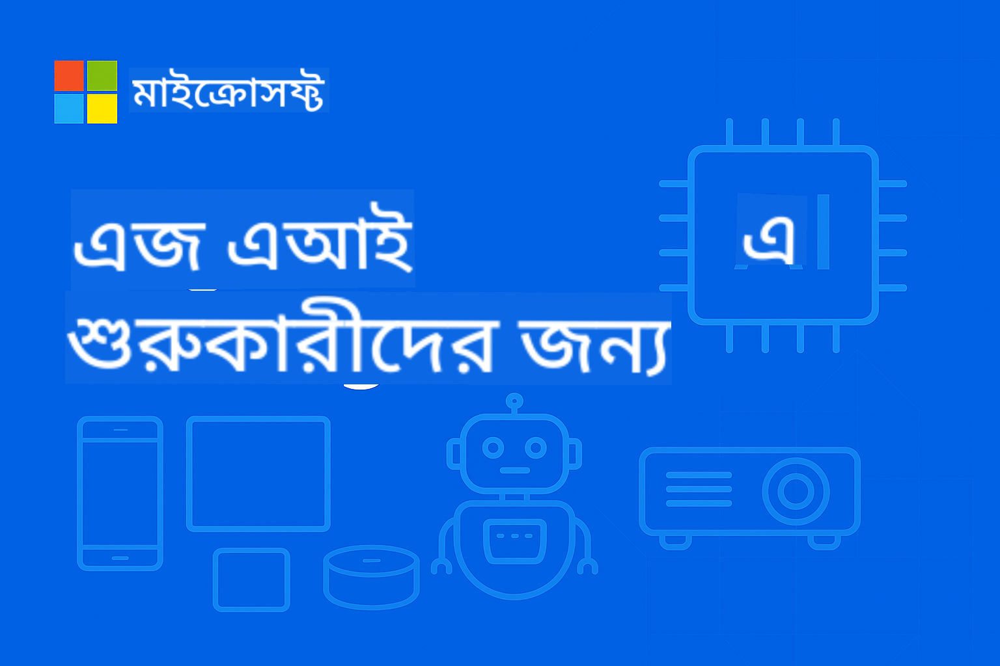

<!--
CO_OP_TRANSLATOR_METADATA:
{
  "original_hash": "9a189d7d9d47816a518ca119d79dc19b",
  "translation_date": "2025-09-22T17:11:14+00:00",
  "source_file": "README.md",
  "language_code": "bn"
}
-->
# EdgeAI for Beginners



[](https://GitHub.com/microsoft/edgeai-for-beginners/graphs/contributors)
[](https://GitHub.com/microsoft/edgeai-for-beginners/issues)
[](https://GitHub.com/microsoft/edgeai-for-beginners/pulls)
[](http://makeapullrequest.com)

[](https://GitHub.com/microsoft/edgeai-for-beginners/watchers)
[](https://GitHub.com/microsoft/edgeai-for-beginners/fork)
[](https://GitHub.com/microsoft/edgeai-for-beginners/stargazers)

[](https://discord.com/invite/ByRwuEEgH4)

এই রিসোর্সগুলো ব্যবহার শুরু করতে নিচের ধাপগুলো অনুসরণ করুন:

1. **রিপোজিটরি ফর্ক করুন**: ক্লিক করুন [](https://GitHub.com/microsoft/edgeai-for-beginners/fork)
2. **রিপোজিটরি ক্লোন করুন**: `git clone https://github.com/microsoft/edgeai-for-beginners.git`
3. [**Azure AI Foundry Discord-এ যোগ দিন এবং বিশেষজ্ঞ ও অন্যান্য ডেভেলপারদের সাথে পরিচিত হন**](https://discord.com/invite/ByRwuEEgH4)

### 🌐 বহু-ভাষার সমর্থন

#### GitHub Action এর মাধ্যমে সমর্থিত (স্বয়ংক্রিয় এবং সর্বদা আপডেটেড)

[Arabic](../ar/README.md) | [Bengali](./README.md) | [Bulgarian](../bg/README.md) | [Burmese (Myanmar)](../my/README.md) | [Chinese (Simplified)](../zh/README.md) | [Chinese (Traditional, Hong Kong)](../hk/README.md) | [Chinese (Traditional, Macau)](../mo/README.md) | [Chinese (Traditional, Taiwan)](../tw/README.md) | [Croatian](../hr/README.md) | [Czech](../cs/README.md) | [Danish](../da/README.md) | [Dutch](../nl/README.md) | [Finnish](../fi/README.md) | [French](../fr/README.md) | [German](../de/README.md) | [Greek](../el/README.md) | [Hebrew](../he/README.md) | [Hindi](../hi/README.md) | [Hungarian](../hu/README.md) | [Indonesian](../id/README.md) | [Italian](../it/README.md) | [Japanese](../ja/README.md) | [Korean](../ko/README.md) | [Malay](../ms/README.md) | [Marathi](../mr/README.md) | [Nepali](../ne/README.md) | [Norwegian](../no/README.md) | [Persian (Farsi)](../fa/README.md) | [Polish](../pl/README.md) | [Portuguese (Brazil)](../br/README.md) | [Portuguese (Portugal)](../pt/README.md) | [Punjabi (Gurmukhi)](../pa/README.md) | [Romanian](../ro/README.md) | [Russian](../ru/README.md) | [Serbian (Cyrillic)](../sr/README.md) | [Slovak](../sk/README.md) | [Slovenian](../sl/README.md) | [Spanish](../es/README.md) | [Swahili](../sw/README.md) | [Swedish](../sv/README.md) | [Tagalog (Filipino)](../tl/README.md) | [Thai](../th/README.md) | [Turkish](../tr/README.md) | [Ukrainian](../uk/README.md) | [Urdu](../ur/README.md) | [Vietnamese](../vi/README.md)

**যদি আপনি অতিরিক্ত ভাষার অনুবাদ চান, সমর্থিত ভাষার তালিকা [এখানে](https://github.com/Azure/co-op-translator/blob/main/getting_started/supported-languages.md) পাওয়া যাবে।**

## পরিচিতি

**EdgeAI for Beginners**-এ আপনাকে স্বাগতম – Edge Artificial Intelligence-এর পরিবর্তনশীল জগতে আপনার পূর্ণাঙ্গ যাত্রা। এই কোর্সটি শক্তিশালী AI ক্ষমতা এবং বাস্তব জীবনের প্রয়োগের মধ্যে সেতুবন্ধন তৈরি করে, যা আপনাকে AI-এর সম্ভাবনাকে সরাসরি সেই জায়গায় ব্যবহার করতে সক্ষম করে যেখানে ডেটা তৈরি হয় এবং সিদ্ধান্ত নেওয়া প্রয়োজন।

### আপনি কী শিখবেন

এই কোর্সটি আপনাকে মৌলিক ধারণা থেকে শুরু করে প্রোডাকশন-রেডি বাস্তবায়ন পর্যন্ত নিয়ে যাবে, যেখানে অন্তর্ভুক্ত রয়েছে:
- **Small Language Models (SLMs)** যা Edge ডিপ্লয়মেন্টের জন্য অপ্টিমাইজ করা হয়েছে
- **হার্ডওয়্যার-সচেতন অপ্টিমাইজেশন** বিভিন্ন প্ল্যাটফর্মে
- **রিয়েল-টাইম ইনফারেন্স** যা গোপনীয়তা রক্ষা করে
- **প্রোডাকশন ডিপ্লয়মেন্ট** কৌশল যা এন্টারপ্রাইজ অ্যাপ্লিকেশনের জন্য উপযুক্ত

### কেন EdgeAI গুরুত্বপূর্ণ

Edge AI একটি নতুন দৃষ্টিভঙ্গি উপস্থাপন করে যা আধুনিক সময়ের গুরুত্বপূর্ণ চ্যালেঞ্জগুলো সমাধান করে:
- **গোপনীয়তা ও নিরাপত্তা**: সংবেদনশীল ডেটা স্থানীয়ভাবে প্রক্রিয়াকরণ করুন, ক্লাউডে প্রকাশ না করে
- **রিয়েল-টাইম পারফরম্যান্স**: সময়-সংবেদনশীল অ্যাপ্লিকেশনের জন্য নেটওয়ার্ক লেটেন্সি দূর করুন
- **খরচ সাশ্রয়**: ব্যান্ডউইথ এবং ক্লাউড কম্পিউটিং খরচ কমান
- **স্থিতিশীল কার্যক্রম**: নেটওয়ার্ক বিভ্রাটের সময় কার্যকারিতা বজায় রাখুন
- **নিয়ন্ত্রক সম্মতি**: ডেটা সার্বভৌমত্বের প্রয়োজনীয়তা পূরণ করুন

### Edge AI

Edge AI বলতে বোঝায় AI অ্যালগরিদম এবং ভাষার মডেলগুলো স্থানীয় হার্ডওয়্যারে চালানো—ডেটা যেখানে তৈরি হয় তার কাছাকাছি—ক্লাউড রিসোর্সের উপর নির্ভর না করে। এটি লেটেন্সি কমায়, গোপনীয়তা বাড়ায় এবং রিয়েল-টাইম সিদ্ধান্ত গ্রহণ সক্ষম করে।

### মূল নীতিমালা:
- **অন-ডিভাইস ইনফারেন্স**: AI মডেলগুলো Edge ডিভাইসে (ফোন, রাউটার, মাইক্রোকন্ট্রোলার, ইন্ডাস্ট্রিয়াল PC) চালানো হয়
- **অফলাইন সক্ষমতা**: স্থায়ী ইন্টারনেট সংযোগ ছাড়াই কাজ করে
- **কম লেটেন্সি**: রিয়েল-টাইম সিস্টেমের জন্য তাৎক্ষণিক প্রতিক্রিয়া
- **ডেটা সার্বভৌমত্ব**: সংবেদনশীল ডেটা স্থানীয়ভাবে রাখে, নিরাপত্তা এবং সম্মতি উন্নত করে

### Small Language Models (SLMs)

Phi-4, Mistral-7B, এবং Gemma-এর মতো SLMs বড় LLMs-এর অপ্টিমাইজড সংস্করণ—যেগুলো প্রশিক্ষিত বা ডিস্টিল করা হয়েছে:
- **কম মেমরি ব্যবহার**: সীমিত Edge ডিভাইস মেমরির কার্যকর ব্যবহার
- **কম কম্পিউটিং চাহিদা**: CPU এবং Edge GPU পারফরম্যান্সের জন্য অপ্টিমাইজড
- **দ্রুত স্টার্টআপ টাইম**: প্রতিক্রিয়াশীল অ্যাপ্লিকেশনের জন্য দ্রুত ইনিশিয়ালাইজেশন

এসএলএমগুলো শক্তিশালী NLP ক্ষমতা প্রদান করে, যা নিম্নলিখিত সীমাবদ্ধতাগুলো পূরণ করে:
- **এমবেডেড সিস্টেম**: IoT ডিভাইস এবং ইন্ডাস্ট্রিয়াল কন্ট্রোলার
- **মোবাইল ডিভাইস**: স্মার্টফোন এবং ট্যাবলেট যা অফলাইন সক্ষমতা সহ
- **IoT ডিভাইস**: সীমিত রিসোর্স সহ সেন্সর এবং স্মার্ট ডিভাইস
- **Edge সার্ভার**: সীমিত GPU রিসোর্স সহ স্থানীয় প্রসেসিং ইউনিট
- **পার্সোনাল কম্পিউটার**: ডেস্কটপ এবং ল্যাপটপ ডিপ্লয়মেন্টের পরিস্থিতি

## কোর্সের কাঠামো

### [মডিউল ০১: EdgeAI এর মৌলিক বিষয় এবং পরিবর্তন](./Module01/README.md)
**থিম**: Edge AI ডিপ্লয়মেন্টের পরিবর্তনশীল দৃষ্টিভঙ্গি

#### অধ্যায়ের কাঠামো:
- [**সেকশন ১: EdgeAI এর মৌলিক বিষয়**](./Module01/01.EdgeAIFundamentals.md)
  - প্রচলিত ক্লাউড AI বনাম Edge AI তুলনা
  - Edge কম্পিউটিং চ্যালেঞ্জ এবং সীমাবদ্ধতা
  - মূল প্রযুক্তি: মডেল কোয়ান্টাইজেশন, কম্প্রেশন অপ্টিমাইজেশন, Small Language Models (SLMs)
  - হার্ডওয়্যার অ্যাক্সিলারেশন: NPUs, GPU অপ্টিমাইজেশন, CPU অপ্টিমাইজেশন
  - সুবিধা: গোপনীয়তা, নিরাপত্তা, কম লেটেন্সি, অফলাইন সক্ষমতা, খরচ সাশ্রয়

- [**সেকশন ২: বাস্তব জীবনের কেস স্টাডি**](./Module01/02.RealWorldCaseStudies.md)
  - Microsoft Phi & Mu মডেল ইকোসিস্টেম
  - Japan Airlines AI রিপোর্টিং সিস্টেম কেস স্টাডি
  - বাজারের প্রভাব এবং ভবিষ্যতের দিকনির্দেশনা
  - ডিপ্লয়মেন্ট বিবেচনা এবং সেরা অনুশীলন

- [**সেকশন ৩: ব্যবহারিক বাস্তবায়ন গাইড**](./Module01/03.PracticalImplementationGuide.md)
  - ডেভেলপমেন্ট পরিবেশ সেটআপ (Python 3.10+, .NET 8+)
  - হার্ডওয়্যার প্রয়োজনীয়তা এবং সুপারিশকৃত কনফিগারেশন
  - মূল মডেল পরিবারের রিসোর্স
  - কোয়ান্টাইজেশন এবং অপ্টিমাইজেশন টুল (Llama.cpp, Microsoft Olive, Apple MLX)
  - মূল্যায়ন এবং যাচাইকরণ চেকলিস্ট

- [**সেকশন ৪: Edge AI ডিপ্লয়মেন্ট হার্ডওয়্যার প্ল্যাটফর্ম**](./Module01/04.EdgeDeployment.md)
  - Edge AI ডিপ্লয়মেন্ট বিবেচনা এবং প্রয়োজনীয়তা
  - Intel Edge AI হার্ডওয়্যার এবং অপ্টিমাইজেশন কৌশল
  - Qualcomm AI মোবাইল এবং এমবেডেড সিস্টেমের জন্য সমাধান
  - NVIDIA Jetson এবং Edge কম্পিউটিং প্ল্যাটফর্ম
  - Windows AI PC প্ল্যাটফর্ম NPU অ্যাক্সিলারেশন সহ
  - হার্ডওয়্যার-নির্দিষ্ট অপ্টিমাইজেশন কৌশল

---

### [মডিউল ০২: Small Language Model এর ভিত্তি](./Module02/README.md)
**থিম**: SLM এর তাত্ত্বিক নীতিমালা, বাস্তবায়ন কৌশল, এবং প্রোডাকশন ডিপ্লয়মেন্ট

#### অধ্যায়ের কাঠামো:
- [**সেকশন ১: Microsoft Phi মডেল পরিবারের মৌলিক বিষয়**](./Module02/01.PhiFamily.md)
  - ডিজাইন দর্শনের বিবর্তন (Phi-1 থেকে Phi-4)
  - দক্ষতা-প্রথম আর্কিটেকচার ডিজাইন
  - বিশেষায়িত ক্ষমতা (যুক্তি, মাল্টিমোডাল, Edge ডিপ্লয়মেন্ট)

- [**সেকশন ২: Qwen পরিবারের মৌলিক বিষয়**](./Module02/02.QwenFamily.md)
  - ওপেন সোর্স উৎকর্ষতা (Qwen 1.0 থেকে Qwen3) - Hugging Face-এ উপলব্ধ
  - উন্নত যুক্তি আর্কিটেকচার চিন্তাভাবনার মোড ক্ষমতা সহ
  - স্কেলযোগ্য ডিপ্লয়মেন্ট অপশন (0.5B-235B প্যারামিটার)

- [**সেকশন ৩: Gemma পরিবারের মৌলিক বিষয়**](./Module02/03.GemmaFamily.md)
  - গবেষণা-চালিত উদ্ভাবন (Gemma 3 & 3n)
  - মাল্টিমোডাল উৎকর্ষতা
  - মোবাইল-প্রথম আর্কিটেকচার

- [**সেকশন ৪: BitNET পরিবারের মৌলিক বিষয়**](./Module02/04.BitNETFamily.md)
  - বিপ্লবী কোয়ান্টাইজেশন প্রযুক্তি (1.58-bit)
  - বিশেষায়িত ইনফারেন্স ফ্রেমওয়ার্ক https://github.com/microsoft/BitNet থেকে
  - চরম দক্ষতার মাধ্যমে টেকসই AI নেতৃত্ব

- [**সেকশন ৫: Microsoft Mu মডেল পরিবারের মৌলিক বিষয়**](./Module02/05.mumodel.md)
  - Windows 11-এ অন্তর্নির্মিত ডিভাইস-প্রথম আর্কিটেকচার
  - Windows 11 Settings-এর সাথে সিস্টেম ইন্টিগ্রেশন
  - গোপনীয়তা-সংরক্ষণকারী অফলাইন অপারেশন

- [**সেকশন ৬: Phi-Silica এর মৌলিক বিষয়**](./Module02/06.phisilica.md)
  - Windows 11 Copilot+ PCs-এ অন্তর্নির্মিত NPU-অপ্টিমাইজড আর্কিটেকচার
  - অসাধারণ দক্ষতা (650 টোকেন/সেকেন্ড 1.5W-এ)
  - Windows App SDK-এর সাথে ডেভেলপার ইন্টিগ্রেশন

---

### [মডিউল ০৩: Small Language Model ডিপ্লয়মেন্ট](./Module03/README.md)
**থিম**: SLM এর সম্পূর্ণ জীবনচক্র ডিপ্লয়মেন্ট, তত্ত্ব থেকে প্রোডাকশন পরিবেশ পর্যন্ত

#### অধ্যায়ের কাঠামো:
- [**সেকশন ১: SLM উন্নত শিক্ষা**](./Module03/01.SLMAdvancedLearning.md)
  - প্যারামিটার শ্রেণীবিন্যাস কাঠামো (Micro SLM 100M-1.4B, Medium SLM 14B-30B)
  - উন্নত অপ্টিমাইজেশন কৌশল (কোয়ান্টাইজেশন পদ্ধতি, BitNET 1-bit কোয়ান্টাইজেশন)
  - মডেল অর্জনের কৌশল (Phi মডেলের জন্য Azure AI Foundry, নির্বাচিত মডেলের জন্য Hugging Face)

- [**সেকশন ২: স্থানীয় পরিবেশে ডিপ্লয়মেন্ট**](./Module03/02.DeployingSLMinLocalEnv.md)
  - Ollama ইউনিভার্সাল প্ল্যাটফর্ম ডিপ্লয়মেন্ট
  - Microsoft Foundry স্থানীয় এন্টারপ্রাইজ-গ্রেড সমাধান
  - ফ্রেমওয়ার্ক তুলনামূলক বিশ্লেষণ

- [**সেকশন ৩: কন্টেইনারাইজড ক্লাউড ডিপ্লয়মেন্ট**](./Module03/03.DeployingSLMinCloud.md)
  - vLLM উচ্চ-প্রদর্শন ইনফারেন্স ডিপ্লয়মেন্ট
  - Ollama কন্টেইনার অর্কেস্ট্রেশন
  - ONNX Runtime Edge-অপ্টিমাইজড বাস্তবায়ন

---

### [মডিউল ০৪: মডেল ফরম্যাট রূপান্তর এবং কোয়ান্টাইজেশন](./Module04/README.md)
**থিম**: Edge ডিপ্লয়মেন্টের জন্য প্ল্যাটফর্ম জুড়ে সম্পূর্ণ মডেল অপ্টিমাইজেশন টুলকিট

#### অধ্যায়ের কাঠামো:
- [**সেকশন ১: মডেল ফরম্যাট রূপান্তর এবং কোয়ান্টাইজেশন ভিত্তি**](./Module04/01.Introduce.md)
  - নির্ভুলতা শ্রেণীবিন্যাস কাঠামো (অতি-নিম্ন, নিম্ন, মাঝারি নির্ভুলতা)
  - GGUF এবং ONNX ফরম্যাটের সুবিধা এবং ব্যবহার ক্ষেত্র
  - অপারেশন
- [**Section 2: Llama.cpp Implementation Guide**](./Module04/02.Llamacpp.md)
  - ক্রস-প্ল্যাটফর্ম ইনস্টলেশন (Windows, macOS, Linux)
  - GGUF ফরম্যাট কনভার্সন এবং কোয়ান্টাইজেশন লেভেল (Q2_K থেকে Q8_0)
  - হার্ডওয়্যার অ্যাক্সিলারেশন (CUDA, Metal, OpenCL, Vulkan)
  - পাইথন ইন্টিগ্রেশন এবং REST API ডিপ্লয়মেন্ট

- [**Section 3: Microsoft Olive Optimization Suite**](./Module04/03.MicrosoftOlive.md)
  - হার্ডওয়্যার-অওয়্যার মডেল অপ্টিমাইজেশন ৪০+ বিল্ট-ইন কম্পোনেন্ট সহ
  - অটো-অপ্টিমাইজেশন ডায়নামিক এবং স্ট্যাটিক কোয়ান্টাইজেশন সহ
  - এন্টারপ্রাইজ ইন্টিগ্রেশন Azure ML ওয়ার্কফ্লোতে
  - জনপ্রিয় মডেল সাপোর্ট (Llama, Phi, নির্বাচিত Qwen মডেল, Gemma)

- [**Section 4: OpenVINO Toolkit Optimization Suite**](./Module04/04.openvino.md)
  - Intel-এর ওপেন-সোর্স টুলকিট ক্রস-প্ল্যাটফর্ম AI ডিপ্লয়মেন্টের জন্য
  - Neural Network Compression Framework (NNCF) উন্নত অপ্টিমাইজেশনের জন্য
  - OpenVINO GenAI বড় ভাষার মডেল ডিপ্লয়মেন্টের জন্য
  - হার্ডওয়্যার অ্যাক্সিলারেশন CPU, GPU, VPU এবং AI অ্যাক্সিলারেটর জুড়ে

- [**Section 5: Apple MLX Framework Deep Dive**](./Module04/05.AppleMLX.md)
  - Apple Silicon-এর জন্য ইউনিফাইড মেমরি আর্কিটেকচার
  - LLaMA, Mistral, Phi, নির্বাচিত Qwen মডেল সাপোর্ট
  - LoRA ফাইন-টিউনিং এবং মডেল কাস্টমাইজেশন
  - Hugging Face ইন্টিগ্রেশন ৪-বিট/৮-বিট কোয়ান্টাইজেশন সহ

- [**Section 6: Edge AI Development Workflow Synthesis**](./Module04/06.workflow-synthesis.md)
  - একীভূত ওয়ার্কফ্লো আর্কিটেকচার একাধিক অপ্টিমাইজেশন ফ্রেমওয়ার্ক ইন্টিগ্রেট করে
  - ফ্রেমওয়ার্ক নির্বাচন সিদ্ধান্ত গাছ এবং পারফরম্যান্স ট্রেড-অফ বিশ্লেষণ
  - প্রোডাকশন রেডিনেস ভ্যালিডেশন এবং ব্যাপক ডিপ্লয়মেন্ট স্ট্র্যাটেজি
  - উদীয়মান হার্ডওয়্যার এবং মডেল আর্কিটেকচারের জন্য ভবিষ্যৎ-প্রুফিং স্ট্র্যাটেজি

---

### [Module 05: SLMOps - Small Language Model Operations](./Module05/README.md)
**থিম**: সম্পূর্ণ SLM লাইফসাইকেল অপারেশন ডিস্টিলেশন থেকে প্রোডাকশন ডিপ্লয়মেন্ট পর্যন্ত

#### অধ্যায় কাঠামো:
- [**Section 1: Introduction to SLMOps**](./Module05/01.IntroduceSLMOps.md)
  - SLMOps-এর AI অপারেশনে প্যারাডাইম শিফট
  - খরচ দক্ষতা এবং প্রাইভেসি-প্রথম আর্কিটেকচার
  - কৌশলগত ব্যবসায়িক প্রভাব এবং প্রতিযোগিতামূলক সুবিধা
  - বাস্তব-জীবনের বাস্তবায়ন চ্যালেঞ্জ এবং সমাধান

- [**Section 2: Model Distillation - From Theory to Practice**](./Module05/02.SLMOps-Distillation.md)
  - শিক্ষক থেকে ছাত্র মডেলে জ্ঞান স্থানান্তর
  - দুই-পর্যায়ের ডিস্টিলেশন প্রক্রিয়া বাস্তবায়ন
  - Azure ML ডিস্টিলেশন ওয়ার্কফ্লো ব্যবহারিক উদাহরণ সহ
  - ৮৫% ইনফারেন্স সময় হ্রাস ৯২% সঠিকতা ধরে রেখে

- [**Section 3: Fine-Tuning - Customizing Models for Specific Tasks**](./Module05/03.SLMOps-Finetuing.md)
  - প্যারামিটার-দক্ষ ফাইন-টিউনিং (PEFT) কৌশল
  - LoRA এবং QLoRA উন্নত পদ্ধতি
  - Microsoft Olive ফাইন-টিউনিং বাস্তবায়ন
  - মাল্টি-অ্যাডাপ্টার ট্রেনিং এবং হাইপারপ্যারামিটার অপ্টিমাইজেশন

- [**Section 4: Deployment - Production-Ready Implementation**](./Module05/04.SLMOps.Deployment.md)
  - প্রোডাকশনের জন্য মডেল কনভার্সন এবং কোয়ান্টাইজেশন
  - Foundry Local ডিপ্লয়মেন্ট কনফিগারেশন
  - পারফরম্যান্স বেঞ্চমার্কিং এবং কোয়ালিটি ভ্যালিডেশন
  - ৭৫% সাইজ হ্রাস প্রোডাকশন মনিটরিং সহ

---

### [Module 06: SLM Agentic Systems - AI Agents and Function Calling](./Module06/README.md)
**থিম**: SLM এজেন্টিক সিস্টেম বাস্তবায়ন ফাউন্ডেশন থেকে উন্নত ফাংশন কলিং এবং Model Context Protocol ইন্টিগ্রেশন পর্যন্ত

#### অধ্যায় কাঠামো:
- [**Section 1: AI Agents and Small Language Models Foundation**](./Module06/01.IntroduceAgent.md)
  - এজেন্ট শ্রেণীবিভাগ ফ্রেমওয়ার্ক (রিফ্লেক্স, মডেল-ভিত্তিক, লক্ষ্য-ভিত্তিক, লার্নিং এজেন্ট)
  - SLM মৌলিক বিষয় এবং অপ্টিমাইজেশন কৌশল (GGUF, কোয়ান্টাইজেশন, এজ ফ্রেমওয়ার্ক)
  - SLM বনাম LLM ট্রেড-অফ বিশ্লেষণ (১০-৩০× খরচ হ্রাস, ৭০-৮০% কার্যকারিতা)
  - Ollama, VLLM, এবং Microsoft এজ সলিউশন ব্যবহার করে বাস্তবায়ন

- [**Section 2: Function Calling in Small Language Models**](./Module06/02.FunctionCalling.md)
  - সিস্টেম্যাটিক ওয়ার্কফ্লো বাস্তবায়ন (ইন্টেন্ট ডিটেকশন, JSON আউটপুট, এক্সটার্নাল এক্সিকিউশন)
  - প্ল্যাটফর্ম-নির্দিষ্ট বাস্তবায়ন (Phi-4-mini, নির্বাচিত Qwen মডেল, Microsoft Foundry Local)
  - উন্নত উদাহরণ (মাল্টি-এজেন্ট সহযোগিতা, ডায়নামিক টুল নির্বাচন)
  - প্রোডাকশন বিবেচনা (রেট লিমিটিং, অডিট লগিং, সিকিউরিটি ব্যবস্থা)

- [**Section 3: Model Context Protocol (MCP) Integration**](./Module06/03.IntroduceMCP.md)
  - প্রোটোকল আর্কিটেকচার এবং স্তরযুক্ত সিস্টেম ডিজাইন
  - মাল্টি-ব্যাকএন্ড সাপোর্ট (Ollama ডেভেলপমেন্টের জন্য, vLLM প্রোডাকশনের জন্য)
  - সংযোগ প্রোটোকল (STDIO এবং SSE মোড)
  - বাস্তব-জীবনের অ্যাপ্লিকেশন (ওয়েব অটোমেশন, ডেটা প্রসেসিং, API ইন্টিগ্রেশন)

---

### [Module 07: EdgeAI Implementation Samples](./Module07/README.md)
**থিম**: বিভিন্ন প্ল্যাটফর্ম এবং ফ্রেমওয়ার্ক জুড়ে ব্যাপক EdgeAI বাস্তবায়ন

#### অধ্যায় কাঠামো:
- [**AI Toolkit for Visual Studio Code**](./Module07/aitoolkit.md)
  - Visual Studio Code-এ ব্যাপক Edge AI ডেভেলপমেন্ট পরিবেশ
  - মডেল ক্যাটালগ এবং এজ ডিপ্লয়মেন্টের জন্য ডিসকভারি
  - লোকাল টেস্টিং, অপ্টিমাইজেশন, এবং এজেন্ট ডেভেলপমেন্ট ওয়ার্কফ্লো
  - এজ দৃশ্যপটের জন্য পারফরম্যান্স মনিটরিং এবং মূল্যায়ন

- [**Windows EdgeAI Development Guide**](./Module07/windowdeveloper.md)
  - Windows AI Foundry প্ল্যাটফর্মের ব্যাপক ওভারভিউ
  - Phi Silica API দক্ষ NPU ইনফারেন্সের জন্য
  - Computer Vision API ইমেজ প্রসেসিং এবং OCR-এর জন্য
  - Foundry Local CLI লোকাল ডেভেলপমেন্ট এবং টেস্টিংয়ের জন্য

- [**EdgeAI in NVIDIA Jetson Orin Nano**](./Module07/README.md#1-edgeai-in-nvidia-jetson-orin-nano)
  - ক্রেডিট-কার্ড-সাইজ ফর্ম ফ্যাক্টরে ৬৭ TOPS AI পারফরম্যান্স
  - জেনারেটিভ AI মডেল সাপোর্ট (ভিশন ট্রান্সফর্মার, LLMs, ভিশন-ল্যাঙ্গুয়েজ মডেল)
  - রোবটিক্স, ড্রোন, ইন্টেলিজেন্ট ক্যামেরা, স্বয়ংক্রিয় ডিভাইসের অ্যাপ্লিকেশন
  - $২৪৯ প্ল্যাটফর্ম গণতান্ত্রিক AI ডেভেলপমেন্টের জন্য

- [**EdgeAI in Mobile Applications with .NET MAUI and ONNX Runtime GenAI**](./Module07/README.md#2-edgeai-in-mobile-applications-with-net-maui-and-onnx-runtime-genai)
  - একক C# কোডবেস দিয়ে ক্রস-প্ল্যাটফর্ম মোবাইল AI
  - হার্ডওয়্যার অ্যাক্সিলারেশন সাপোর্ট (CPU, GPU, মোবাইল AI প্রসেসর)
  - প্ল্যাটফর্ম-নির্দিষ্ট অপ্টিমাইজেশন (CoreML iOS-এর জন্য, NNAPI Android-এর জন্য)
  - সম্পূর্ণ জেনারেটিভ AI লুপ বাস্তবায়ন

- [**EdgeAI in Azure with Small Language Models Engine**](./Module07/README.md#3-edgeai-in-azure-with-small-language-models-engine)
  - ক্লাউড-এজ হাইব্রিড ডিপ্লয়মেন্ট আর্কিটেকচার
  - Azure AI সার্ভিস ইন্টিগ্রেশন ONNX Runtime সহ
  - এন্টারপ্রাইজ-স্কেল ডিপ্লয়মেন্ট এবং ক্রমাগত মডেল ম্যানেজমেন্ট
  - হাইব্রিড AI ওয়ার্কফ্লো বুদ্ধিমান ডকুমেন্ট প্রসেসিংয়ের জন্য

- [**EdgeAI with Windows ML**](./Module07/README.md#4-edgeai-with-windows-ml)
  - Windows AI Foundry ভিত্তি অন-ডিভাইস ইনফারেন্সের জন্য
  - ইউনিভার্সাল হার্ডওয়্যার সাপোর্ট (AMD, Intel, NVIDIA, Qualcomm সিলিকন)
  - স্বয়ংক্রিয় হার্ডওয়্যার অ্যাবস্ট্রাকশন এবং অপ্টিমাইজেশন
  - বিভিন্ন Windows হার্ডওয়্যার ইকোসিস্টেমের জন্য ইউনিফাইড ফ্রেমওয়ার্ক

- [**EdgeAI with Foundry Local Applications**](./Module07/README.md#5-edgeai-with-foundry-local-applications)
  - প্রাইভেসি-ফোকাসড RAG বাস্তবায়ন লোকাল রিসোর্স দিয়ে
  - Phi-4 ভাষার মডেল ইন্টিগ্রেশন সেমান্টিক সার্চ সহ (শুধুমাত্র Phi মডেল)
  - লোকাল ভেক্টর ডাটাবেস সাপোর্ট (SQLite, Qdrant)
  - ডেটা সার্বভৌমত্ব এবং অফলাইন অপারেশন সক্ষমতা

### [Module 08: Microsoft Foundry Local – Complete Developer Toolkit](./Module08/README.md)
**থিম**: Foundry Local দিয়ে AI তৈরি, চালানো এবং ইন্টিগ্রেট করা; Azure AI Foundry দিয়ে স্কেল এবং হাইব্রিডাইজ করা

#### অধ্যায় কাঠামো:
- [**1: Getting Started with Foundry Local**](./Module08/01.FoundryLocalSetup.md)
- [**2: Build AI Solutions with Azure AI Foundry**](./Module08/02.AzureAIFoundryIntegration.md)
- [**3: Open-Source Models Foundry Local**](./Module08/03.OpenSourceModels.md)
- [**4: Cutting-Edge Models and On-Device Inference**](./Module08/04.CuttingEdgeModels.md)
- [**5: AI-Powered Agents with Foundry Local**](./Module08/05.AIPoweredAgents.md)
- [**6: Models as Tools**](./Module08/06.ModelsAsTools.md)

## কোর্স শেখার লক্ষ্য

এই ব্যাপক EdgeAI কোর্স সম্পন্ন করার মাধ্যমে, আপনি প্রোডাকশন-রেডি EdgeAI সমাধান ডিজাইন, বাস্তবায়ন এবং ডিপ্লয় করার দক্ষতা অর্জন করবেন। আমাদের কাঠামোগত পদ্ধতি নিশ্চিত করে যে আপনি তাত্ত্বিক ভিত্তি এবং ব্যবহারিক বাস্তবায়ন দক্ষতা উভয়ই আয়ত্ত করবেন।

### প্রযুক্তিগত দক্ষতা

**প্রাথমিক জ্ঞান**
- ক্লাউড-ভিত্তিক এবং এজ-ভিত্তিক AI আর্কিটেকচারের মধ্যে মৌলিক পার্থক্য বুঝুন
- মডেল কোয়ান্টাইজেশন, কম্প্রেশন এবং অপ্টিমাইজেশনের নীতিগুলি আয়ত্ত করুন
- হার্ডওয়্যার অ্যাক্সিলারেশন বিকল্পগুলি (NPUs, GPUs, CPUs) এবং তাদের ডিপ্লয়মেন্ট প্রভাব বুঝুন

**বাস্তবায়ন দক্ষতা**
- বিভিন্ন এজ প্ল্যাটফর্মে Small Language Models ডিপ্লয় করুন (মোবাইল, এম্বেডেড, IoT, এজ সার্ভার)
- অপ্টিমাইজেশন ফ্রেমওয়ার্ক প্রয়োগ করুন যেমন Llama.cpp, Microsoft Olive, ONNX Runtime, এবং Apple MLX
- সাব-সেকেন্ড রেসপন্স প্রয়োজনীয়তার সাথে রিয়েল-টাইম ইনফারেন্স সিস্টেম বাস্তবায়ন করুন

**প্রোডাকশন দক্ষতা**
- এন্টারপ্রাইজ অ্যাপ্লিকেশনের জন্য স্কেলযোগ্য EdgeAI আর্কিটেকচার ডিজাইন করুন
- ডিপ্লয়ড সিস্টেমের জন্য মনিটরিং, রক্ষণাবেক্ষণ এবং আপডেটিং কৌশল বাস্তবায়ন করুন
- প্রাইভেসি-প্রিজার্ভিং EdgeAI বাস্তবায়নের জন্য সিকিউরিটি সেরা অনুশীলন প্রয়োগ করুন

### কৌশলগত সক্ষমতা

**সিদ্ধান্ত গ্রহণের কাঠামো**
- EdgeAI সুযোগগুলি মূল্যায়ন করুন এবং ব্যবসায়িক অ্যাপ্লিকেশনের জন্য উপযুক্ত ব্যবহার কেস চিহ্নিত করুন
- মডেল সঠিকতা, ইনফারেন্স গতি, পাওয়ার খরচ এবং হার্ডওয়্যার খরচের মধ্যে ট্রেড-অফ মূল্যায়ন করুন
- নির্দিষ্ট ডিপ্লয়মেন্ট সীমাবদ্ধতার উপর ভিত্তি করে উপযুক্ত SLM পরিবার এবং কনফিগারেশন নির্বাচন করুন

**সিস্টেম আর্কিটেকচার**
- বিদ্যমান অবকাঠামোর সাথে ইন্টিগ্রেট করা এন্ড-টু-এন্ড EdgeAI সমাধান ডিজাইন করুন
- সর্বোত্তম পারফরম্যান্স এবং খরচ দক্ষতার জন্য হাইব্রিড এজ-ক্লাউড আর্কিটেকচার পরিকল্পনা করুন
- রিয়েল-টাইম AI অ্যাপ্লিকেশনের জন্য ডেটা ফ্লো এবং প্রসেসিং পাইপলাইন বাস্তবায়ন করুন

### শিল্প অ্যাপ্লিকেশন

**বাস্তবায়ন দৃশ্যপট**
- **উৎপাদন**: গুণমান নিয়ন্ত্রণ ব্যবস্থা, পূর্বাভাস রক্ষণাবেক্ষণ, এবং প্রক্রিয়া অপ্টিমাইজেশন
- **স্বাস্থ্যসেবা**: প্রাইভেসি-প্রিজার্ভিং ডায়াগনস্টিক টুল এবং রোগী পর্যবেক্ষণ ব্যবস্থা
- **পরিবহন**: স্বয়ংক্রিয় যানবাহনের সিদ্ধান্ত গ্রহণ এবং ট্রাফিক ব্যবস্থাপনা
- **স্মার্ট সিটি**: বুদ্ধিমান অবকাঠামো এবং সম্পদ ব্যবস্থাপনা ব্যবস্থা
- **ভোক্তা ইলেকট্রনিক্স**: AI-চালিত মোবাইল অ্যাপ্লিকেশন এবং স্মার্ট হোম ডিভাইস

## শেখার ফলাফল সংক্ষিপ্তসার

### Module 01 শেখার ফলাফল:
- ক্লাউড এবং এজ AI আর্কিটেকচারের মধ্যে মৌলিক পার্থক্য বুঝুন
- এজ ডিপ্লয়মেন্টের জন্য মূল অপ্টিমাইজেশন কৌশল আয়ত্ত করুন
- বাস্তব-জীবনের অ্যাপ্লিকেশন এবং সফলতার গল্পগুলি চিনুন
- EdgeAI সমাধান বাস্তবায়নের জন্য ব্যবহারিক দক্ষতা অর্জন করুন

### Module 02 শেখার ফলাফল:
- বিভিন্ন SLM ডিজাইন দর্শনের গভীর বোঝাপড়া এবং তাদের ডিপ্লয়মেন্ট প্রভাব
- কম্পিউটেশনাল সীমাবদ্ধতা এবং পারফরম্যান্স প্রয়োজনীয়তার উপর ভিত্তি করে কৌশলগত সিদ্ধান্ত গ্রহণের ক্ষমতা আয়ত্ত করুন
- ডিপ্লয়মেন্ট নমনীয়তার ট্রেড-অফ বুঝুন
- দক্ষ AI আর্কিটেকচারের জন্য ভবিষ্যৎ-প্রস্তুত অন্তর্দৃষ্টি অর্জন করুন

### Module 03 শেখার ফলাফল:
- কৌশলগত মডেল নির্বাচন ক্ষমতা
- অপ্টিমাইজেশন কৌশল আয়ত্ত করুন
- ডিপ্লয়মেন্ট নমনীয়তা আয়ত্ত করুন
- প্রোডাকশন-রেডি কনফিগারেশন ক্ষমতা অর্জন করুন

### Module 04 শেখার ফলাফল:
- কোয়ান্টাইজেশন সীমা এবং ব্যবহারিক অ্যাপ্লিকেশনের গভীর বোঝাপড়া
- একাধিক অপ্ট
- **ঝুঁকি ব্যবস্থাপনা**: EdgeAI বাস্তবায়নে প্রযুক্তিগত ও কার্যক্রমগত ঝুঁকি চিহ্নিত করা এবং কমানো
- **ROI অপ্টিমাইজেশন**: EdgeAI বাস্তবায়ন থেকে পরিমাপযোগ্য ব্যবসায়িক মূল্য প্রদর্শন করা

### ক্যারিয়ার উন্নয়নের সুযোগ

**পেশাগত ভূমিকা**
- EdgeAI সলিউশন আর্কিটেক্ট
- মেশিন লার্নিং ইঞ্জিনিয়ার (Edge বিশেষায়ন)
- IoT AI ডেভেলপার
- মোবাইল AI অ্যাপ্লিকেশন ডেভেলপার
- এন্টারপ্রাইজ AI কনসালট্যান্ট

**শিল্প খাত**
- স্মার্ট ম্যানুফ্যাকচারিং এবং ইন্ডাস্ট্রি 4.0
- স্বয়ংক্রিয় যানবাহন এবং পরিবহন
- স্বাস্থ্য প্রযুক্তি এবং চিকিৎসা যন্ত্রপাতি
- ফিনান্সিয়াল টেকনোলজি এবং সিকিউরিটি
- কনজিউমার ইলেকট্রনিক্স এবং মোবাইল অ্যাপ্লিকেশন

### সার্টিফিকেশন এবং যাচাইকরণ

**পোর্টফোলিও উন্নয়ন**
- EdgeAI প্রকল্প সম্পন্ন করে ব্যবহারিক দক্ষতা প্রদর্শন করা
- একাধিক হার্ডওয়্যার প্ল্যাটফর্মে প্রোডাকশন-রেডি সলিউশন ডিপ্লয় করা
- অপ্টিমাইজেশন কৌশল এবং অর্জিত পারফরম্যান্স উন্নতির ডকুমেন্টেশন তৈরি করা

**নিরবচ্ছিন্ন শিক্ষার পথ**
- উন্নত AI বিশেষায়নের ভিত্তি
- ক্লাউড-এজ হাইব্রিড আর্কিটেকচারের প্রস্তুতি
- উদীয়মান AI প্রযুক্তি এবং ফ্রেমওয়ার্কের প্রবেশদ্বার

এই কোর্স আপনাকে AI প্রযুক্তি বাস্তবায়নের অগ্রভাগে স্থাপন করে, যেখানে বুদ্ধিমান সক্ষমতাগুলি আধুনিক জীবনের শক্তি প্রদানকারী ডিভাইস এবং সিস্টেমগুলিতে নির্বিঘ্নে সংযুক্ত হয়।

## ফাইল স্ট্রাকচার ট্রি ডায়াগ্রাম

```
edgeai-for-beginners/
├── imgs/
│   └── cover.png
├── Module01/ (EdgeAI Fundamentals and Transformation)
│   ├── 01.EdgeAIFundamentals.md
│   ├── 02.RealWorldCaseStudies.md
│   ├── 03.PracticalImplementationGuide.md
│   ├── 04.EdgeDeployment.md
│   └── README.md
├── Module02/ (Small Language Model Foundations)
│   ├── 01.PhiFamily.md
│   ├── 02.QwenFamily.md
│   ├── 03.GemmaFamily.md
│   ├── 04.BitNETFamily.md
│   ├── 05.mumodel.md
│   ├── 06.phisilica.md
│   └── README.md
├── Module03/ (SLM Deployment Practice)
│   ├── 01.SLMAdvancedLearning.md
│   ├── 02.DeployingSLMinLocalEnv.md
│   ├── 03.DeployingSLMinCloud.md
│   └── README.md
├── Module04/ (Model Format Conversion and Quantization)
│   ├── 01.Introduce.md
│   ├── 02.Llamacpp.md
│   ├── 03.MicrosoftOlive.md
│   ├── 04.openvino.md
│   ├── 05.AppleMLX.md
│   ├── 06.workflow-synthesis.md
│   └── README.md
├── Module05/ (SLMOps - Small Language Model Operations)
│   ├── 01.IntroduceSLMOps.md
│   ├── 02.SLMOps-Distillation.md
│   ├── 03.SLMOps-Finetuing.md
│   ├── 04.SLMOps.Deployment.md
│   └── README.md
├── Module06/ (SLM Agentic Systems)
│   ├── 01.IntroduceAgent.md
│   ├── 02.FunctionCalling.md
│   ├── 03.IntroduceMCP.md
│   └── README.md
├── Module07/ (EdgeAI Implementation Samples)
│   ├── aitoolkit.md
│   ├── windowdeveloper.md
│   └── README.md
├── Module08/ (Hands on with Foundry Local)
│   ├── 01.FoundryLocalSetup.md
│   ├── 02.AzureAIFoundryIntegration.md
│   ├── 03.OpenSourceModels.md
│   ├── 04.CuttingEdgeModels.md
│   ├── 05.AIPoweredAgents.md
│   ├── 06.ModelsAsTools.md
│   └── README.md
├── CODE_OF_CONDUCT.md
├── LICENSE
├── README.md (This file)
├── SECURITY.md
├── STUDY_GUIDE.md
└── SUPPORT.md
```

## কোর্স বৈশিষ্ট্য

- **প্রগতিশীল শিক্ষা**: মৌলিক ধারণা থেকে উন্নত বাস্তবায়নে ধাপে ধাপে অগ্রসর হওয়া
- **তত্ত্ব এবং অনুশীলনের সংমিশ্রণ**: প্রতিটি মডিউলে তাত্ত্বিক ভিত্তি এবং ব্যবহারিক কার্যক্রম অন্তর্ভুক্ত
- **বাস্তব কেস স্টাডি**: Microsoft, Alibaba, Google এবং অন্যান্যদের প্রকৃত কেসের উপর ভিত্তি করে
- **হ্যান্ডস-অন অনুশীলন**: সম্পূর্ণ কনফিগারেশন ফাইল, API টেস্টিং পদ্ধতি এবং ডিপ্লয়মেন্ট স্ক্রিপ্ট
- **পারফরম্যান্স বেঞ্চমার্ক**: ইনফারেন্স স্পিড, মেমরি ব্যবহার এবং রিসোর্স প্রয়োজনীয়তার বিস্তারিত তুলনা
- **এন্টারপ্রাইজ-গ্রেড বিবেচনা**: সিকিউরিটি প্র্যাকটিস, কমপ্লায়েন্স ফ্রেমওয়ার্ক এবং ডেটা প্রোটেকশন কৌশল

## শুরু করার জন্য

প্রস্তাবিত শিক্ষার পথ:
1. **Module01** দিয়ে EdgeAI এর মৌলিক ধারণা তৈরি করুন
2. **Module02** এ বিভিন্ন SLM মডেল পরিবারের গভীর জ্ঞান অর্জন করুন
3. **Module03** এ ব্যবহারিক বাস্তবায়নের দক্ষতা আয়ত্ত করুন
4. **Module04** এ উন্নত মডেল অপ্টিমাইজেশন, ফরম্যাট কনভার্সন এবং ফ্রেমওয়ার্ক সিন্থেসিস শিখুন
5. **Module05** সম্পন্ন করুন প্রোডাকশন-রেডি বাস্তবায়নের জন্য SLMOps আয়ত্ত করতে
6. **Module06** এ SLM এজেন্টিক সিস্টেম এবং ফাংশন কলিং সক্ষমতা বুঝুন
7. **Module07** সম্পন্ন করুন AI Toolkit এবং বিভিন্ন EdgeAI বাস্তবায়নের নমুনার ব্যবহারিক অভিজ্ঞতা অর্জন করতে
8. **Module08** অন্বেষণ করুন সম্পূর্ণ Foundry Local ডেভেলপার টুলকিট (লোকাল-ফার্স্ট ডেভেলপমেন্ট হাইব্রিড Azure ইন্টিগ্রেশনের সাথে)

প্রতিটি মডিউল স্বাধীনভাবে সম্পূর্ণ, তবে ধারাবাহিক শিক্ষার মাধ্যমে সর্বোত্তম ফলাফল পাওয়া যাবে।

## স্টাডি গাইড

একটি বিস্তৃত [স্টাডি গাইড](STUDY_GUIDE.md) উপলব্ধ রয়েছে যা আপনার শিক্ষার অভিজ্ঞতা সর্বাধিক করতে সাহায্য করবে। স্টাডি গাইড প্রদান করে:

- **সংগঠিত শিক্ষার পথ**: ২০ ঘণ্টার মধ্যে কোর্স সম্পন্ন করার জন্য অপ্টিমাইজড সময়সূচি
- **সময় বরাদ্দ নির্দেশিকা**: পড়া, অনুশীলন এবং প্রকল্পের মধ্যে ভারসাম্য বজায় রাখার জন্য নির্দিষ্ট সুপারিশ
- **মূল ধারণার উপর ফোকাস**: প্রতিটি মডিউলের জন্য অগ্রাধিকারপ্রাপ্ত শিক্ষার লক্ষ্য
- **স্ব-মূল্যায়ন সরঞ্জাম**: আপনার বোঝাপড়া পরীক্ষা করার জন্য প্রশ্ন এবং অনুশীলন
- **মিনি-প্রকল্পের ধারণা**: আপনার শেখা শক্তিশালী করতে ব্যবহারিক প্রয়োগ

স্টাডি গাইডটি তীব্র শিক্ষার (১ সপ্তাহ) এবং পার্ট-টাইম শিক্ষার (৩ সপ্তাহ) উভয় ক্ষেত্রেই উপযোগী, এমনকি আপনি যদি কোর্সে মাত্র ১০ ঘণ্টা সময় দিতে পারেন তবুও সময় কার্যকরভাবে বরাদ্দ করার স্পষ্ট নির্দেশনা প্রদান করে।

---

**EdgeAI এর ভবিষ্যৎ মডেল আর্কিটেকচার, কোয়ান্টাইজেশন কৌশল এবং বাস্তবায়ন কৌশলের ক্রমাগত উন্নতির মধ্যে নিহিত। এই কৌশলগুলি দক্ষতা এবং বিশেষায়নকে সাধারণ উদ্দেশ্য সক্ষমতার উপর অগ্রাধিকার দেয়। যে সংস্থাগুলি এই পরিবর্তনকে গ্রহণ করবে তারা AI এর রূপান্তরকারী সম্ভাবনাকে কাজে লাগানোর জন্য এবং তাদের ডেটা ও কার্যক্রমের উপর নিয়ন্ত্রণ বজায় রাখার জন্য ভালো অবস্থানে থাকবে।**

## অন্যান্য কোর্স

আমাদের টিম অন্যান্য কোর্স তৈরি করে! দেখুন:

- [MCP for Beginners](https://github.com/microsoft/mcp-for-beginners)
- [AI Agents For Beginners](https://github.com/microsoft/ai-agents-for-beginners?WT.mc_id=academic-105485-koreyst)
- [Generative AI for Beginners using .NET](https://github.com/microsoft/Generative-AI-for-beginners-dotnet?WT.mc_id=academic-105485-koreyst)
- [Generative AI for Beginners using JavaScript](https://github.com/microsoft/generative-ai-with-javascript?WT.mc_id=academic-105485-koreyst)
- [Generative AI for Beginners](https://github.com/microsoft/generative-ai-for-beginners?WT.mc_id=academic-105485-koreyst)
- [ML for Beginners](https://aka.ms/ml-beginners?WT.mc_id=academic-105485-koreyst)
- [Data Science for Beginners](https://aka.ms/datascience-beginners?WT.mc_id=academic-105485-koreyst)
- [AI for Beginners](https://aka.ms/ai-beginners?WT.mc_id=academic-105485-koreyst)
- [Cybersecurity for Beginners](https://github.com/microsoft/Security-101??WT.mc_id=academic-96948-sayoung)
- [Web Dev for Beginners](https://aka.ms/webdev-beginners?WT.mc_id=academic-105485-koreyst)
- [IoT for Beginners](https://aka.ms/iot-beginners?WT.mc_id=academic-105485-koreyst)
- [XR Development for Beginners](https://github.com/microsoft/xr-development-for-beginners?WT.mc_id=academic-105485-koreyst)
- [Mastering GitHub Copilot for AI Paired Programming](https://aka.ms/GitHubCopilotAI?WT.mc_id=academic-105485-koreyst)
- [Mastering GitHub Copilot for C#/.NET Developers](https://github.com/microsoft/mastering-github-copilot-for-dotnet-csharp-developers?WT.mc_id=academic-105485-koreyst)
- [Choose Your Own Copilot Adventure](https://github.com/microsoft/CopilotAdventures?WT.mc_id=academic-105485-koreyst)

---

