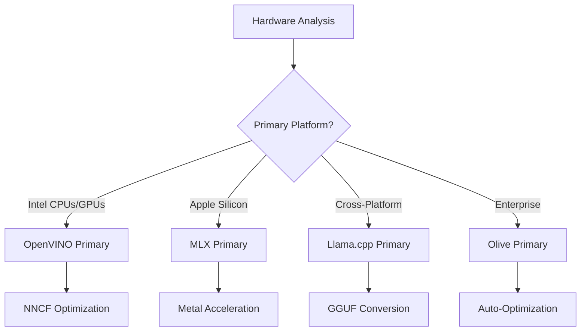
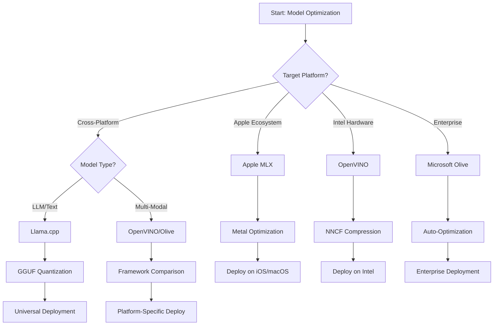
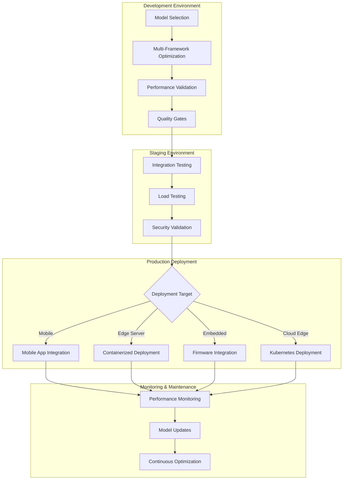

<!--
CO_OP_TRANSLATOR_METADATA:
{
  "original_hash": "6719c4a7e44b948230ac5f5cab3699bd",
  "translation_date": "2025-09-17T23:34:00+00:00",
  "source_file": "Module04/06.workflow-synthesis.md",
  "language_code": "br"
}
-->
# Seção 6: Síntese do Fluxo de Trabalho de Desenvolvimento de Edge AI

## Índice
1. [Introdução](../../../Module04)
2. [Objetivos de Aprendizagem](../../../Module04)
3. [Visão Geral do Fluxo de Trabalho Unificado](../../../Module04)
4. [Matriz de Seleção de Frameworks](../../../Module04)
5. [Síntese de Melhores Práticas](../../../Module04)
6. [Guia de Estratégia de Implantação](../../../Module04)
7. [Fluxo de Trabalho de Otimização de Desempenho](../../../Module04)
8. [Checklist de Prontidão para Produção](../../../Module04)
9. [Solução de Problemas e Monitoramento](../../../Module04)
10. [Preparando Seu Pipeline de Edge AI para o Futuro](../../../Module04)

## Introdução

O desenvolvimento de Edge AI exige um entendimento sofisticado de múltiplos frameworks de otimização, estratégias de implantação e considerações de hardware. Esta síntese abrangente reúne o conhecimento do Llama.cpp, Microsoft Olive, OpenVINO e Apple MLX para criar um fluxo de trabalho unificado que maximiza a eficiência, mantém a qualidade e garante uma implantação bem-sucedida em produção.

Ao longo deste curso, exploramos frameworks de otimização individuais, cada um com pontos fortes únicos e casos de uso especializados. No entanto, projetos reais de Edge AI frequentemente exigem a combinação de técnicas de múltiplos frameworks ou decisões estratégicas sobre qual abordagem oferecerá os melhores resultados para restrições e requisitos específicos.

Esta seção sintetiza o conhecimento coletivo de todos os frameworks em fluxos de trabalho acionáveis, árvores de decisão e melhores práticas que permitem construir soluções de Edge AI prontas para produção de forma eficiente e eficaz. Seja otimizando para dispositivos móveis, sistemas embarcados ou servidores de borda, este guia fornece a estrutura estratégica para tomar decisões informadas ao longo do ciclo de desenvolvimento.

## Objetivos de Aprendizagem

Ao final desta seção, você será capaz de:

### Tomada de Decisão Estratégica
- **Avaliar e selecionar** o framework de otimização ideal com base nos requisitos do projeto, restrições de hardware e cenários de implantação
- **Projetar fluxos de trabalho abrangentes** que integrem múltiplas técnicas de otimização para máxima eficiência
- **Analisar trade-offs** entre precisão do modelo, velocidade de inferência, uso de memória e complexidade de implantação em diferentes frameworks

### Integração de Fluxos de Trabalho
- **Implementar pipelines de desenvolvimento unificados** que aproveitem os pontos fortes de múltiplos frameworks de otimização
- **Criar fluxos de trabalho reproduzíveis** para otimização e implantação consistente de modelos em diferentes ambientes
- **Estabelecer critérios de qualidade** e processos de validação para garantir que os modelos otimizados atendam aos requisitos de produção

### Otimização de Desempenho
- **Aplicar estratégias sistemáticas de otimização** usando quantização, poda e técnicas de aceleração específicas de hardware
- **Monitorar e avaliar** o desempenho do modelo em diferentes níveis de otimização e alvos de implantação
- **Otimizar para plataformas de hardware específicas**, incluindo CPU, GPU, NPU e aceleradores especializados de borda

### Implantação em Produção
- **Projetar arquiteturas de implantação escaláveis** que acomodem múltiplos formatos de modelo e motores de inferência
- **Implementar monitoramento e observabilidade** para aplicações de Edge AI em ambientes de produção
- **Estabelecer fluxos de manutenção** para atualizações de modelo, monitoramento de desempenho e otimização de sistemas

### Excelência Multiplataforma
- **Implantar modelos otimizados** em diversas plataformas de hardware mantendo desempenho consistente
- **Lidar com otimizações específicas de plataforma** para Windows, macOS, Linux, dispositivos móveis e sistemas embarcados
- **Criar camadas de abstração** que permitam implantação contínua em diferentes ambientes de borda

## Visão Geral do Fluxo de Trabalho Unificado

### Fase 1: Análise de Requisitos e Seleção de Framework

O sucesso na implantação de Edge AI começa com uma análise detalhada de requisitos que informa a seleção de frameworks e a estratégia de otimização.

#### 1.1 Avaliação de Hardware


**Considerações Principais:**
- **Arquitetura de CPU**: Capacidades de x86, ARM, Apple Silicon
- **Disponibilidade de Aceleradores**: GPU, NPU, VPU, chips de IA especializados
- **Restrições de Memória**: Limitações de RAM, capacidade de armazenamento
- **Orçamento de Energia**: Vida útil da bateria, restrições térmicas
- **Conectividade**: Requisitos offline, limitações de largura de banda

#### 1.2 Matriz de Requisitos de Aplicação

| Requisito | Llama.cpp | Microsoft Olive | OpenVINO | Apple MLX |
|-----------|-----------|-----------------|----------|-----------|
| Multiplataforma | ✅ Excelente | ⚡ Bom | ⚡ Bom | ❌ Apenas Apple |
| Integração Empresarial | ⚡ Básico | ✅ Excelente | ✅ Excelente | ⚡ Limitado |
| Implantação Móvel | ✅ Excelente | ⚡ Bom | ⚡ Bom | ✅ iOS Excelente |
| Inferência em Tempo Real | ✅ Excelente | ✅ Excelente | ✅ Excelente | ✅ Excelente |
| Diversidade de Modelos | ✅ Foco em LLM | ✅ Todos os Modelos | ✅ Todos os Modelos | ✅ Foco em LLM |
| Facilidade de Uso | ✅ Simples | ✅ Automatizado | ⚡ Moderado | ✅ Simples |

### Fase 2: Preparação e Otimização de Modelos

#### 2.1 Pipeline Universal de Avaliação de Modelos

```python
# Universal Model Assessment Framework
class EdgeAIModelAssessment:
    def __init__(self, model_path, target_hardware):
        self.model_path = model_path
        self.target_hardware = target_hardware
        self.optimization_frameworks = []
        
    def assess_model_characteristics(self):
        """Analyze model size, architecture, and complexity"""
        return {
            'model_size': self.get_model_size(),
            'parameter_count': self.get_parameter_count(),
            'architecture_type': self.detect_architecture(),
            'quantization_compatibility': self.check_quantization_support()
        }
    
    def recommend_optimization_strategy(self):
        """Recommend optimal frameworks and techniques"""
        characteristics = self.assess_model_characteristics()
        
        if self.target_hardware.startswith('apple'):
            return self.mlx_optimization_strategy(characteristics)
        elif self.target_hardware.startswith('intel'):
            return self.openvino_optimization_strategy(characteristics)
        elif characteristics['model_size'] > 7_000_000_000:  # 7B+ parameters
            return self.enterprise_optimization_strategy(characteristics)
        else:
            return self.lightweight_optimization_strategy(characteristics)
```

#### 2.2 Pipeline de Otimização Multi-Framework

**Abordagem de Otimização Sequencial:**
1. **Conversão Inicial**: Converter para formato intermediário (ONNX quando possível)
2. **Otimização Específica do Framework**: Aplicar técnicas especializadas
3. **Validação Cruzada**: Verificar desempenho em plataformas-alvo
4. **Empacotamento Final**: Preparar para implantação

```bash
# Multi-Framework Optimization Script
#!/bin/bash

MODEL_NAME="phi-3-mini"
BASE_MODEL="microsoft/Phi-3-mini-4k-instruct"

# Phase 1: ONNX Conversion (Universal)
python convert_to_onnx.py --model $BASE_MODEL --output models/onnx/

# Phase 2: Platform-Specific Optimization
if [[ "$TARGET_PLATFORM" == "intel" ]]; then
    # OpenVINO Optimization
    python optimize_openvino.py --input models/onnx/ --output models/openvino/
elif [[ "$TARGET_PLATFORM" == "apple" ]]; then
    # MLX Optimization
    python optimize_mlx.py --input $BASE_MODEL --output models/mlx/
elif [[ "$TARGET_PLATFORM" == "cross" ]]; then
    # Llama.cpp Optimization
    python convert_to_gguf.py --input models/onnx/ --output models/gguf/
fi

# Phase 3: Validation
python validate_optimization.py --original $BASE_MODEL --optimized models/$TARGET_PLATFORM/
```

### Fase 3: Validação de Desempenho e Benchmarking

#### 3.1 Framework Abrangente de Benchmarking

```python
class EdgeAIBenchmark:
    def __init__(self, optimized_models):
        self.models = optimized_models
        self.metrics = {
            'inference_time': [],
            'memory_usage': [],
            'accuracy_score': [],
            'throughput': [],
            'energy_consumption': []
        }
    
    def run_comprehensive_benchmark(self):
        """Execute standardized benchmarks across all optimized models"""
        test_inputs = self.generate_test_inputs()
        
        for model_framework, model_path in self.models.items():
            print(f"Benchmarking {model_framework}...")
            
            # Latency Testing
            latency = self.measure_inference_latency(model_path, test_inputs)
            
            # Memory Profiling
            memory = self.profile_memory_usage(model_path)
            
            # Accuracy Validation
            accuracy = self.validate_model_accuracy(model_path, test_inputs)
            
            # Throughput Analysis
            throughput = self.measure_throughput(model_path)
            
            self.record_metrics(model_framework, latency, memory, accuracy, throughput)
    
    def generate_optimization_report(self):
        """Create comprehensive comparison report"""
        report = {
            'recommendations': self.analyze_performance_trade_offs(),
            'deployment_guidance': self.generate_deployment_recommendations(),
            'monitoring_requirements': self.define_monitoring_metrics()
        }
        return report
```

## Matriz de Seleção de Frameworks

### Árvore de Decisão para Seleção de Framework



### Critérios Abrangentes de Seleção

#### 1. Alinhamento com o Caso de Uso Principal

**Modelos de Linguagem Grande (LLMs):**
- **Llama.cpp**: Melhor para implantação focada em CPU e multiplataforma
- **Apple MLX**: Ideal para Apple Silicon com memória unificada
- **OpenVINO**: Excelente para hardware Intel com otimização NNCF
- **Microsoft Olive**: Perfeito para fluxos de trabalho empresariais com automação

**Modelos Multimodais:**
- **OpenVINO**: Suporte abrangente para visão, áudio e texto
- **Microsoft Olive**: Otimização de nível empresarial para pipelines complexos
- **Llama.cpp**: Limitado a modelos baseados em texto
- **Apple MLX**: Suporte crescente para aplicações multimodais

#### 2. Matriz de Plataforma de Hardware

| Plataforma | Framework Principal | Opção Secundária | Recursos Especializados |
|------------|---------------------|------------------|-------------------------|
| Intel CPU/GPU | OpenVINO | Microsoft Olive | Compressão NNCF, otimização Intel |
| NVIDIA GPU | Microsoft Olive | OpenVINO | Aceleração CUDA, recursos empresariais |
| Apple Silicon | Apple MLX | Llama.cpp | Shaders Metal, memória unificada |
| ARM Móvel | Llama.cpp | OpenVINO | Multiplataforma, dependências mínimas |
| Edge TPU | OpenVINO | Microsoft Olive | Suporte a aceleradores especializados |
| ARM Embarcado | Llama.cpp | OpenVINO | Pegada mínima, inferência eficiente |

#### 3. Preferências de Fluxo de Trabalho de Desenvolvimento

**Prototipagem Rápida:**
1. **Llama.cpp**: Configuração mais rápida, resultados imediatos
2. **Apple MLX**: API Python simples, iteração rápida
3. **Microsoft Olive**: Otimização automatizada, configuração mínima
4. **OpenVINO**: Configuração mais complexa, recursos abrangentes

**Produção Empresarial:**
1. **Microsoft Olive**: Recursos empresariais, integração com Azure
2. **OpenVINO**: Ecossistema Intel, ferramentas abrangentes
3. **Apple MLX**: Aplicações empresariais específicas da Apple
4. **Llama.cpp**: Implantação simples, recursos empresariais limitados

## Síntese de Melhores Práticas

### Princípios Universais de Otimização

#### 1. Estratégia de Otimização Progressiva

```python
class ProgressiveOptimization:
    def __init__(self, base_model):
        self.base_model = base_model
        self.optimization_stages = [
            'baseline_measurement',
            'format_conversion',
            'quantization_optimization',
            'hardware_acceleration',
            'production_validation'
        ]
    
    def execute_progressive_optimization(self):
        """Apply optimization techniques incrementally"""
        
        # Stage 1: Baseline Measurement
        baseline_metrics = self.measure_baseline_performance()
        
        # Stage 2: Format Conversion
        converted_model = self.convert_to_optimal_format()
        conversion_metrics = self.measure_performance(converted_model)
        
        # Stage 3: Quantization
        quantized_model = self.apply_quantization(converted_model)
        quantization_metrics = self.measure_performance(quantized_model)
        
        # Stage 4: Hardware Acceleration
        accelerated_model = self.enable_hardware_acceleration(quantized_model)
        acceleration_metrics = self.measure_performance(accelerated_model)
        
        # Stage 5: Validation
        production_ready = self.validate_for_production(accelerated_model)
        
        return self.compile_optimization_report(
            baseline_metrics, conversion_metrics, 
            quantization_metrics, acceleration_metrics
        )
```

#### 2. Implementação de Portões de Qualidade

**Portões de Preservação de Precisão:**
- Manter >95% da precisão original do modelo
- Validar contra conjuntos de teste representativos
- Implementar testes A/B para validação em produção

**Portões de Melhoria de Desempenho:**
- Alcançar no mínimo 2x de melhoria de velocidade
- Reduzir o uso de memória em pelo menos 50%
- Validar consistência no tempo de inferência

**Portões de Prontidão para Produção:**
- Passar em testes de estresse sob carga
- Demonstrar desempenho estável ao longo do tempo
- Validar requisitos de segurança e privacidade

### Integração de Melhores Práticas Específicas de Framework

#### 1. Síntese de Estratégia de Quantização

```python
# Unified Quantization Approach
class UnifiedQuantizationStrategy:
    def __init__(self, model, target_platform):
        self.model = model
        self.platform = target_platform
        
    def select_optimal_quantization(self):
        """Choose best quantization based on platform and requirements"""
        
        if self.platform == 'apple_silicon':
            return self.mlx_quantization_strategy()
        elif self.platform == 'intel_hardware':
            return self.openvino_quantization_strategy()
        elif self.platform == 'cross_platform':
            return self.llamacpp_quantization_strategy()
        else:
            return self.olive_quantization_strategy()
    
    def mlx_quantization_strategy(self):
        """Apple MLX-specific quantization"""
        return {
            'method': 'mlx_quantize',
            'precision': 'int4',
            'group_size': 64,
            'optimization_target': 'unified_memory'
        }
    
    def openvino_quantization_strategy(self):
        """OpenVINO NNCF quantization"""
        return {
            'method': 'nncf_quantize',
            'precision': 'int8',
            'calibration_method': 'post_training',
            'optimization_target': 'intel_hardware'
        }
```

#### 2. Otimização de Aceleração de Hardware

**Síntese de Otimização para CPU:**
- **Instruções SIMD**: Aproveitar kernels otimizados em frameworks
- **Largura de Banda de Memória**: Otimizar layouts de dados para eficiência de cache
- **Threading**: Balancear paralelismo com restrições de recursos

**Melhores Práticas para Aceleração em GPU:**
- **Processamento em Lote**: Maximizar throughput com tamanhos de lote apropriados
- **Gerenciamento de Memória**: Otimizar alocação e transferências de memória da GPU
- **Precisão**: Usar FP16 quando suportado para melhor desempenho

**Otimização para NPU/Aceleradores Especializados:**
- **Arquitetura do Modelo**: Garantir compatibilidade com capacidades do acelerador
- **Fluxo de Dados**: Otimizar pipelines de entrada/saída para eficiência do acelerador
- **Estratégias de Fallback**: Implementar fallback para CPU em operações não suportadas

## Guia de Estratégia de Implantação

### Arquitetura Universal de Implantação



### Padrões de Implantação Específicos de Plataforma

#### 1. Estratégia de Implantação Móvel

```yaml
# Mobile Deployment Configuration
mobile_deployment:
  ios:
    framework: apple_mlx
    optimization:
      quantization: int4
      memory_mapping: true
      background_execution: limited
    packaging:
      format: mlx
      bundle_size: <50MB
      
  android:
    framework: llama_cpp
    optimization:
      quantization: q4_k_m
      threading: android_optimized
      memory_management: conservative
    packaging:
      format: gguf
      apk_size: <100MB
      
  cross_platform:
    framework: onnx_runtime
    optimization:
      quantization: int8
      execution_provider: cpu
    packaging:
      format: onnx
      shared_libraries: minimal
```

#### 2. Implantação em Servidores de Borda

```yaml
# Edge Server Deployment Configuration
edge_server:
  intel_based:
    framework: openvino
    optimization:
      quantization: int8
      acceleration: cpu_gpu_auto
      batch_processing: dynamic
    deployment:
      container: openvino_runtime
      orchestration: kubernetes
      scaling: horizontal
      
  nvidia_based:
    framework: microsoft_olive
    optimization:
      quantization: int4
      acceleration: cuda
      tensor_parallelism: true
    deployment:
      container: nvidia_triton
      orchestration: kubernetes
      scaling: gpu_aware
```

### Melhores Práticas de Containerização

```dockerfile
# Multi-Framework Edge AI Container
FROM ubuntu:22.04 as base

# Install common dependencies
RUN apt-get update && apt-get install -y \
    python3 \
    python3-pip \
    build-essential \
    cmake \
    && rm -rf /var/lib/apt/lists/*

# Framework-specific stages
FROM base as openvino
RUN pip install openvino nncf optimum[intel]

FROM base as llamacpp
RUN git clone https://github.com/ggerganov/llama.cpp.git \
    && cd llama.cpp && make LLAMA_OPENBLAS=1

FROM base as olive
RUN pip install olive-ai[auto-opt] onnxruntime-genai

# Production stage with selected framework
FROM openvino as production
COPY models/ /app/models/
COPY src/ /app/src/
WORKDIR /app

EXPOSE 8080
CMD ["python3", "src/inference_server.py"]
```

## Fluxo de Trabalho de Otimização de Desempenho

### Ajuste Sistemático de Desempenho

#### 1. Pipeline de Perfil de Desempenho

```python
class EdgeAIPerformanceProfiler:
    def __init__(self, model_path, framework):
        self.model_path = model_path
        self.framework = framework
        self.profiling_results = {}
    
    def comprehensive_profiling(self):
        """Execute comprehensive performance analysis"""
        
        # CPU Profiling
        cpu_profile = self.profile_cpu_usage()
        
        # Memory Profiling
        memory_profile = self.profile_memory_usage()
        
        # Inference Latency
        latency_profile = self.profile_inference_latency()
        
        # Throughput Analysis
        throughput_profile = self.profile_throughput()
        
        # Energy Consumption (where available)
        energy_profile = self.profile_energy_consumption()
        
        return self.compile_performance_report(
            cpu_profile, memory_profile, latency_profile,
            throughput_profile, energy_profile
        )
    
    def identify_bottlenecks(self):
        """Automatically identify performance bottlenecks"""
        bottlenecks = []
        
        if self.profiling_results['cpu_utilization'] > 80:
            bottlenecks.append('cpu_bound')
        
        if self.profiling_results['memory_usage'] > 90:
            bottlenecks.append('memory_bound')
        
        if self.profiling_results['inference_variance'] > 20:
            bottlenecks.append('inconsistent_performance')
        
        return self.generate_optimization_recommendations(bottlenecks)
```

#### 2. Pipeline de Otimização Automatizada

```python
class AutomatedOptimizationPipeline:
    def __init__(self, base_model, target_constraints):
        self.base_model = base_model
        self.constraints = target_constraints
        self.optimization_history = []
    
    def execute_optimization_search(self):
        """Systematically search optimization space"""
        
        optimization_candidates = [
            {'quantization': 'int8', 'pruning': 0.1},
            {'quantization': 'int4', 'pruning': 0.2},
            {'quantization': 'int8', 'acceleration': 'gpu'},
            {'quantization': 'int4', 'acceleration': 'npu'}
        ]
        
        best_configuration = None
        best_score = 0
        
        for config in optimization_candidates:
            optimized_model = self.apply_optimization(config)
            score = self.evaluate_optimization(optimized_model)
            
            if score > best_score and self.meets_constraints(optimized_model):
                best_score = score
                best_configuration = config
            
            self.optimization_history.append({
                'config': config,
                'score': score,
                'model': optimized_model
            })
        
        return best_configuration, self.optimization_history
```

### Otimização Multi-Objetivo

#### 1. Otimização de Pareto para Edge AI

```python
class ParetoOptimization:
    def __init__(self, objectives=['speed', 'accuracy', 'memory']):
        self.objectives = objectives
        self.pareto_frontier = []
    
    def find_pareto_optimal_solutions(self, optimization_results):
        """Identify Pareto-optimal configurations"""
        
        for result in optimization_results:
            is_dominated = False
            
            for frontier_point in self.pareto_frontier:
                if self.dominates(frontier_point, result):
                    is_dominated = True
                    break
            
            if not is_dominated:
                # Remove dominated points from frontier
                self.pareto_frontier = [
                    point for point in self.pareto_frontier 
                    if not self.dominates(result, point)
                ]
                
                self.pareto_frontier.append(result)
        
        return self.pareto_frontier
    
    def recommend_configuration(self, user_preferences):
        """Recommend configuration based on user preferences"""
        
        weighted_scores = []
        for config in self.pareto_frontier:
            score = sum(
                user_preferences[obj] * config['metrics'][obj] 
                for obj in self.objectives
            )
            weighted_scores.append((score, config))
        
        return max(weighted_scores, key=lambda x: x[0])[1]
```

## Checklist de Prontidão para Produção

### Validação Abrangente de Produção

#### 1. Garantia de Qualidade do Modelo

```python
class ProductionReadinessValidator:
    def __init__(self, optimized_model, production_requirements):
        self.model = optimized_model
        self.requirements = production_requirements
        self.validation_results = {}
    
    def validate_model_quality(self):
        """Comprehensive model quality validation"""
        
        # Accuracy Validation
        accuracy_result = self.validate_accuracy()
        
        # Performance Validation
        performance_result = self.validate_performance()
        
        # Robustness Testing
        robustness_result = self.validate_robustness()
        
        # Security Assessment
        security_result = self.validate_security()
        
        # Compliance Verification
        compliance_result = self.validate_compliance()
        
        return self.compile_validation_report(
            accuracy_result, performance_result, robustness_result,
            security_result, compliance_result
        )
    
    def generate_certification_report(self):
        """Generate production certification report"""
        return {
            'model_signature': self.generate_model_signature(),
            'validation_timestamp': datetime.now(),
            'validation_results': self.validation_results,
            'deployment_approval': self.check_deployment_approval(),
            'monitoring_requirements': self.define_monitoring_requirements()
        }
```

#### 2. Checklist de Implantação em Produção

**Validação Pré-Implantação:**
- [ ] Precisão do modelo atende aos requisitos mínimos (>95% do baseline)
- [ ] Metas de desempenho alcançadas (latência, throughput, memória)
- [ ] Vulnerabilidades de segurança avaliadas e mitigadas
- [ ] Testes de estresse concluídos sob carga esperada
- [ ] Cenários de falha testados e procedimentos de recuperação validados
- [ ] Sistemas de monitoramento e alerta configurados
- [ ] Procedimentos de rollback testados e documentados

**Processo de Implantação:**
- [ ] Estratégia de implantação blue-green implementada
- [ ] Configuração de aumento gradual de tráfego
- [ ] Dashboards de monitoramento em tempo real ativos
- [ ] Linhas de base de desempenho estabelecidas
- [ ] Limites de taxa de erro definidos
- [ ] Gatilhos automatizados de rollback configurados

**Monitoramento Pós-Implantação:**
- [ ] Detecção de deriva de modelo ativa
- [ ] Alertas de degradação de desempenho configurados
- [ ] Monitoramento de utilização de recursos habilitado
- [ ] Métricas de experiência do usuário rastreadas
- [ ] Versionamento e linhagem de modelos mantidos
- [ ] Revisões regulares de desempenho do modelo agendadas

### Integração Contínua/Implantação Contínua (CI/CD)

```yaml
# Edge AI CI/CD Pipeline Configuration
edge_ai_pipeline:
  stages:
    - model_validation
    - optimization
    - testing
    - staging_deployment
    - production_deployment
    - monitoring
  
  model_validation:
    accuracy_threshold: 0.95
    performance_baseline: required
    security_scan: enabled
    
  optimization:
    frameworks:
      - llama_cpp
      - openvino
      - microsoft_olive
    validation:
      cross_validation: enabled
      performance_comparison: required
      
  testing:
    unit_tests: comprehensive
    integration_tests: full_pipeline
    load_tests: production_scale
    security_tests: comprehensive
    
  deployment:
    strategy: blue_green
    traffic_ramping: gradual
    rollback: automatic
    monitoring: real_time
```

## Solução de Problemas e Monitoramento

### Framework Universal de Solução de Problemas

#### 1. Problemas Comuns e Soluções

**Problemas de Desempenho:**
```python
class PerformanceTroubleshooter:
    def __init__(self, model_metrics):
        self.metrics = model_metrics
        
    def diagnose_performance_issues(self):
        """Systematic performance issue diagnosis"""
        
        issues = []
        
        # High latency diagnosis
        if self.metrics['avg_latency'] > self.metrics['target_latency']:
            issues.append(self.diagnose_latency_issues())
        
        # Memory usage diagnosis
        if self.metrics['memory_usage'] > self.metrics['memory_limit']:
            issues.append(self.diagnose_memory_issues())
        
        # Throughput diagnosis
        if self.metrics['throughput'] < self.metrics['target_throughput']:
            issues.append(self.diagnose_throughput_issues())
        
        return self.generate_resolution_plan(issues)
    
    def diagnose_latency_issues(self):
        """Specific latency troubleshooting"""
        potential_causes = []
        
        if self.metrics['cpu_utilization'] > 80:
            potential_causes.append('cpu_bottleneck')
        
        if self.metrics['memory_bandwidth'] > 90:
            potential_causes.append('memory_bandwidth_limit')
        
        if self.metrics['model_size'] > self.metrics['optimal_size']:
            potential_causes.append('model_too_large')
        
        return {
            'issue': 'high_latency',
            'causes': potential_causes,
            'solutions': self.generate_latency_solutions(potential_causes)
        }
```

**Solução de Problemas Específica de Framework:**

| Problema | Llama.cpp | Microsoft Olive | OpenVINO | Apple MLX |
|----------|-----------|-----------------|----------|-----------|
| Problemas de Memória | Reduzir comprimento do contexto | Reduzir tamanho do lote | Habilitar cache | Usar mapeamento de memória |
| Inferência Lenta | Habilitar SIMD | Verificar quantização | Otimizar threading | Habilitar Metal |
| Perda de Precisão | Quantização mais alta | Re-treinar com QAT | Aumentar calibração | Ajustar pós-quantização |
| Compatibilidade | Verificar formato do modelo | Verificar versão do framework | Atualizar drivers | Verificar versão do macOS |

#### 2. Estratégia de Monitoramento em Produção

```python
class EdgeAIMonitoring:
    def __init__(self, deployment_config):
        self.config = deployment_config
        self.metrics_collectors = []
        self.alerting_rules = []
    
    def setup_comprehensive_monitoring(self):
        """Configure comprehensive monitoring for Edge AI deployment"""
        
        # Model Performance Monitoring
        self.setup_model_performance_monitoring()
        
        # Infrastructure Monitoring
        self.setup_infrastructure_monitoring()
        
        # Business Metrics Monitoring
        self.setup_business_metrics_monitoring()
        
        # Security Monitoring
        self.setup_security_monitoring()
    
    def setup_model_performance_monitoring(self):
        """Model-specific performance monitoring"""
        metrics = [
            'inference_latency_p50',
            'inference_latency_p95',
            'inference_latency_p99',
            'model_accuracy_drift',
            'prediction_confidence_distribution',
            'error_rate',
            'throughput_requests_per_second'
        ]
        
        for metric in metrics:
            self.add_metric_collector(metric)
            self.add_alerting_rule(metric)
    
    def detect_model_drift(self):
        """Automated model drift detection"""
        drift_indicators = [
            self.statistical_drift_detection(),
            self.performance_drift_detection(),
            self.data_distribution_shift_detection()
        ]
        
        return self.aggregate_drift_signals(drift_indicators)
```

### Resolução Automatizada de Problemas

```python
class AutomatedIssueResolution:
    def __init__(self, monitoring_system):
        self.monitoring = monitoring_system
        self.resolution_strategies = {}
    
    def handle_performance_degradation(self, alert):
        """Automated performance issue resolution"""
        
        if alert['type'] == 'high_latency':
            return self.resolve_latency_issue(alert)
        elif alert['type'] == 'high_memory_usage':
            return self.resolve_memory_issue(alert)
        elif alert['type'] == 'accuracy_drift':
            return self.resolve_accuracy_issue(alert)
        
    def resolve_latency_issue(self, alert):
        """Automated latency issue resolution"""
        resolution_steps = [
            'increase_cpu_allocation',
            'enable_model_caching',
            'reduce_batch_size',
            'switch_to_quantized_model'
        ]
        
        for step in resolution_steps:
            if self.apply_resolution_step(step):
                return f"Resolved latency issue with: {step}"
        
        return "Escalating to human operator"
```

## Preparando Seu Pipeline de Edge AI para o Futuro

### Integração de Tecnologias Emergentes

#### 1. Suporte a Hardware de Próxima Geração

```python
class FutureHardwareIntegration:
    def __init__(self):
        self.supported_accelerators = [
            'npu_next_gen',
            'quantum_processors',
            'neuromorphic_chips',
            'optical_processors'
        ]
    
    def design_adaptive_pipeline(self):
        """Create hardware-agnostic optimization pipeline"""
        
        pipeline = {
            'model_preparation': self.universal_model_preparation(),
            'hardware_detection': self.dynamic_hardware_detection(),
            'optimization_selection': self.adaptive_optimization_selection(),
            'performance_validation': self.hardware_agnostic_validation()
        }
        
        return pipeline
    
    def adaptive_optimization_selection(self):
        """Dynamically select optimization based on available hardware"""
        
        def optimize_for_hardware(model, available_hardware):
            if 'npu' in available_hardware:
                return self.npu_optimization(model)
            elif 'quantum' in available_hardware:
                return self.quantum_optimization(model)
            elif 'neuromorphic' in available_hardware:
                return self.neuromorphic_optimization(model)
            else:
                return self.fallback_optimization(model)
        
        return optimize_for_hardware
```

#### 2. Evolução da Arquitetura de Modelos

**Suporte para Arquiteturas Emergentes:**
- **Mixture of Experts (MoE)**: Arquiteturas de modelo esparsas para eficiência
- **Geração Aumentada por Recuperação**: Sistemas híbridos de modelo + base de conhecimento
- **Modelos Multimodais**: Integração de Visão + Linguagem + Áudio
- **Aprendizado Federado**: Treinamento e otimização distribuídos

```python
class NextGenModelSupport:
    def __init__(self):
        self.architecture_handlers = {
            'moe': self.handle_mixture_of_experts,
            'rag': self.handle_retrieval_augmented,
            'multimodal': self.handle_multimodal,
            'federated': self.handle_federated_learning
        }
    
    def handle_mixture_of_experts(self, model):
        """Optimize Mixture of Experts models for edge deployment"""
        optimization_strategy = {
            'expert_pruning': True,
            'routing_optimization': True,
            'expert_quantization': 'per_expert',
            'load_balancing': 'dynamic'
        }
        return self.apply_moe_optimization(model, optimization_strategy)
```

### Aprendizado Contínuo e Adaptação

#### 1. Integração de Aprendizado Online

```python
class EdgeOnlineLearning:
    def __init__(self, base_model, learning_rate=0.001):
        self.base_model = base_model
        self.learning_rate = learning_rate
        self.adaptation_buffer = []
    
    def continuous_adaptation(self, new_data, feedback):
        """Continuously adapt model based on edge data"""
        
        # Privacy-preserving local adaptation
        local_updates = self.compute_local_gradients(new_data, feedback)
        
        # Apply updates with constraints
        adapted_model = self.apply_constrained_updates(
            self.base_model, local_updates
        )
        
        # Validate adaptation quality
        if self.validate_adaptation(adapted_model):
            self.base_model = adapted_model
            return True
        
        return False
    
    def federated_learning_participation(self):
        """Participate in federated learning while preserving privacy"""
        
        # Compute local model updates
        local_updates = self.compute_private_updates()
        
        # Differential privacy protection
        private_updates = self.apply_differential_privacy(local_updates)
        
        # Share with federated learning coordinator
        return self.share_updates(private_updates)
```

#### 2. Sustentabilidade e IA Verde

```python
class GreenEdgeAI:
    def __init__(self, sustainability_targets):
        self.targets = sustainability_targets
        self.energy_monitor = EnergyMonitor()
    
    def optimize_for_sustainability(self, model):
        """Optimize model for minimal environmental impact"""
        
        optimization_objectives = [
            'minimize_energy_consumption',
            'maximize_hardware_utilization',
            'reduce_model_training_cost',
            'extend_device_lifetime'
        ]
        
        return self.multi_objective_green_optimization(
            model, optimization_objectives
        )
    
    def carbon_aware_deployment(self):
        """Deploy models considering carbon footprint"""
        
        deployment_strategy = {
            'prefer_renewable_energy_regions': True,
            'optimize_for_energy_efficiency': True,
            'minimize_data_transfer': True,
            'lifecycle_carbon_accounting': True
        }
        
        return deployment_strategy
```

## Conclusão

Esta síntese abrangente de fluxo de trabalho representa a culminação do conhecimento de otimização de Edge AI, reunindo as melhores práticas de todos os principais frameworks de otimização em uma abordagem unificada e pronta para produção. Ao seguir estas diretrizes, você será capaz de:

**Alcançar Desempenho Ótimo**: Por meio de seleção sistemática de frameworks, otimização progressiva e validação abrangente, garantindo que suas aplicações de Edge AI entreguem máxima eficiência.

**Garantir Prontidão para Produção**: Com testes rigorosos, monitoramento e critérios de qualidade que asseguram implantação e operação confiáveis em ambientes reais.

**Manter Sucesso a Longo Prazo**: Por meio de monitoramento contínuo, resolução automatizada de problemas e estratégias de adaptação que mantêm suas soluções de Edge AI performantes e relevantes.

**Preparar Seu Investimento para o Futuro**: Projetando pipelines flexíveis e independentes de hardware que podem evoluir com tecnologias e requisitos emergentes.

O cenário de Edge AI continua evoluindo rapidamente, com novas plataformas de hardware, técnicas de otimização e estratégias de implantação surgindo regularmente. Esta síntese fornece a base para navegar por essa complexidade enquanto constrói soluções robustas, eficientes e sustentáveis de Edge AI que entregam valor real em ambientes de produção.
Lembre-se de que a melhor estratégia de otimização é aquela que atende aos seus requisitos específicos enquanto mantém a flexibilidade para se adaptar conforme esses requisitos evoluem. Use este guia como uma estrutura para tomar decisões informadas, mas sempre valide suas escolhas por meio de testes empíricos e experiências de implantação no mundo real.

## ➡️ O que vem a seguir

Continue sua jornada em Edge AI explorando [Módulo 5: SLMOps e Implantação em Produção](../Module05/README.md) para aprender sobre os aspectos operacionais do gerenciamento do ciclo de vida de Modelos de Linguagem Pequenos.

---

**Aviso Legal**:  
Este documento foi traduzido utilizando o serviço de tradução por IA [Co-op Translator](https://github.com/Azure/co-op-translator). Embora nos esforcemos para garantir a precisão, esteja ciente de que traduções automatizadas podem conter erros ou imprecisões. O documento original em seu idioma nativo deve ser considerado a fonte autoritativa. Para informações críticas, recomenda-se a tradução profissional realizada por humanos. Não nos responsabilizamos por quaisquer mal-entendidos ou interpretações equivocadas decorrentes do uso desta tradução.