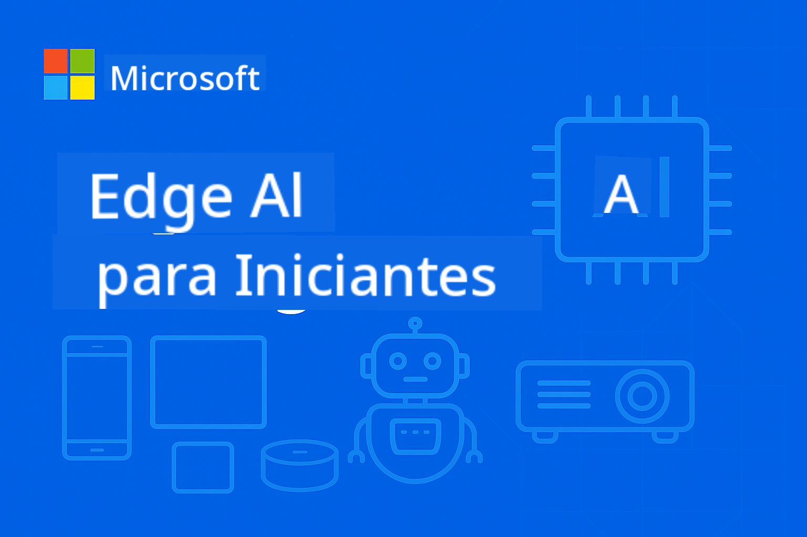

<!--
CO_OP_TRANSLATOR_METADATA:
{
  "original_hash": "22c6dae04591abc5f0d80f944ed663d5",
  "translation_date": "2025-09-26T10:31:18+00:00",
  "source_file": "introduction.md",
  "language_code": "br"
}
-->
# Introdução à IA de Borda para Iniciantes



Bem-vindo à sua jornada no mundo da **Inteligência Artificial de Borda** – uma abordagem revolucionária que traz o poder da IA diretamente para onde os dados são criados e as decisões precisam ser tomadas. Esta introdução estabelecerá as bases para entender por que a IA de Borda representa o futuro da computação inteligente e como você pode dominar sua implementação.

## O que é IA de Borda?

A IA de Borda representa uma mudança fundamental do processamento tradicional baseado em nuvem para a **inteligência local, no dispositivo**. Em vez de enviar dados para servidores distantes, a IA de Borda processa informações diretamente em dispositivos de borda – smartphones, sensores IoT, equipamentos industriais, veículos autônomos e sistemas embarcados.

### O Paradigma da IA de Borda

```
Traditional AI:     Device → Cloud → Processing → Response → Device
Edge AI:           Device → Local Processing → Immediate Response
```
  
Essa mudança de paradigma elimina a necessidade de enviar dados para a nuvem, permitindo:
- **Respostas instantâneas** (latência de sub-milissegundos)
- **Privacidade aprimorada** (os dados nunca saem do dispositivo)
- **Operação confiável** (funciona sem conectividade com a internet)
- **Redução de custos** (uso mínimo de largura de banda e computação na nuvem)

## Por que a IA de Borda é importante agora

### A Tempestade Perfeita de Inovação

Três tendências tecnológicas convergiram para tornar a IA de Borda não apenas possível, mas essencial:

1. **Revolução do Hardware**: Chipsets modernos (Apple Silicon, Qualcomm Snapdragon, NVIDIA Jetson) agora incluem aceleração de IA em pacotes compactos e eficientes em termos de energia.
2. **Otimização de Modelos**: Modelos de Linguagem Pequenos (SLMs) como Phi-4, Gemma e Mistral oferecem 80-90% do desempenho de modelos grandes em apenas 10-20% do tamanho.
3. **Demanda do Mundo Real**: Indústrias exigem IA instantânea, privada e confiável que as soluções baseadas em nuvem não conseguem fornecer.

### Principais Motivações Empresariais

**Privacidade e Conformidade**
- Saúde: Dados de pacientes devem permanecer no local (conformidade com HIPAA)
- Finanças: Processamento de transações exige soberania de dados
- Manufatura: Processos proprietários precisam ser protegidos contra exposição

**Requisitos de Desempenho**
- Veículos autônomos: Decisões críticas para a vida em milissegundos
- Automação industrial: Controle de qualidade e monitoramento de segurança em tempo real
- Jogos e AR/VR: Experiências imersivas exigem latência imperceptível

**Eficiência Econômica**
- Telecomunicações: Processamento local de milhões de leituras de sensores IoT
- Varejo: Análise em loja sem custos massivos de largura de banda
- Cidades inteligentes: Inteligência distribuída em milhares de dispositivos

## Indústrias Transformadas pela IA de Borda

### 🏭 **Manufatura e Indústria 4.0**
- **Manutenção Preditiva**: Modelos de IA em equipamentos industriais preveem falhas antes que ocorram
- **Controle de Qualidade**: Detecção de defeitos em tempo real nas linhas de produção
- **Monitoramento de Segurança**: Detecção e resposta imediata a perigos
- **Cadeia de Suprimentos**: Gerenciamento inteligente de inventário em cada ponto

**Impacto no Mundo Real**: A Siemens usa IA de Borda para manutenção preditiva, reduzindo o tempo de inatividade em 30-50% e os custos de manutenção em 25%.

### 🏥 **Saúde e Dispositivos Médicos**
- **Imagens Diagnósticas**: Análise de raios-X e ressonâncias magnéticas com IA no ponto de atendimento
- **Monitoramento de Pacientes**: Avaliação contínua da saúde por meio de dispositivos vestíveis
- **Assistência Cirúrgica**: Orientação em tempo real durante procedimentos
- **Descoberta de Medicamentos**: Processamento local de simulações moleculares

**Impacto no Mundo Real**: As soluções de IA de Borda da Philips permitem que radiologistas diagnostiquem condições 40% mais rápido, mantendo 99% de precisão.

### 🚗 **Sistemas Autônomos e Transporte**
- **Veículos Autônomos**: Tomada de decisão em frações de segundo para navegação e segurança
- **Gestão de Tráfego**: Controle inteligente de interseções e otimização de fluxo
- **Operações de Frotas**: Otimização de rotas em tempo real e monitoramento da saúde dos veículos
- **Logística**: Robôs autônomos em armazéns e sistemas de entrega

**Impacto no Mundo Real**: O sistema Full Self-Driving da Tesla processa dados de sensores localmente, tomando mais de 40 decisões por segundo para navegação autônoma segura.

### 🏙️ **Cidades Inteligentes e Infraestrutura**
- **Segurança Pública**: Detecção de ameaças em tempo real e resposta a emergências
- **Gestão de Energia**: Otimização de redes inteligentes e integração de energia renovável
- **Monitoramento Ambiental**: Qualidade do ar, poluição sonora e rastreamento climático
- **Planejamento Urbano**: Análise de fluxo de tráfego e otimização de infraestrutura

**Impacto no Mundo Real**: A iniciativa de cidade inteligente de Singapura usa mais de 100.000 sensores de IA de Borda para gestão de tráfego, reduzindo os tempos de deslocamento em 25%.

### 📱 **Tecnologia de Consumo e Mobile**
- **IA em Smartphones**: Fotografia aprimorada, assistentes de voz e personalização
- **Casas Inteligentes**: Automação inteligente e sistemas de segurança
- **Dispositivos Vestíveis**: Monitoramento de saúde e otimização de fitness
- **Jogos**: Melhoria de gráficos em tempo real e otimização de jogabilidade

**Impacto no Mundo Real**: O Neural Engine da Apple processa 15,8 trilhões de operações por segundo localmente, permitindo recursos como tradução de idiomas em tempo real e fotografia computacional.

## Modelos de Linguagem Pequenos: O Motor da IA de Borda

### O que são Modelos de Linguagem Pequenos (SLMs)?

SLMs são **versões compactas e otimizadas** de grandes modelos de linguagem, projetados especificamente para implantação em dispositivos de borda:

- **Phi-4**: 14B parâmetros, otimizado para raciocínio e geração de código
- **Gemma 2B/7B**: Modelos eficientes do Google para diversas tarefas de NLP
- **Mistral-7B**: Modelo de alto desempenho com licenciamento amigável para uso comercial
- **Série Qwen**: Modelos multilíngues da Alibaba otimizados para implantação móvel

### A Vantagem dos SLMs

| Capacidade | Modelos de Linguagem Grandes | Modelos de Linguagem Pequenos |
|------------|------------------------------|------------------------------|
| **Tamanho** | 70B-405B parâmetros | 1B-14B parâmetros |
| **Memória** | 40-200GB RAM | 2-16GB RAM |
| **Velocidade de Inferência** | 2-10 segundos | 50-500ms |
| **Implantação** | Servidores de alto desempenho | Smartphones, dispositivos embarcados |
| **Custo** | $1000s/mês | Custo único de hardware |
| **Privacidade** | Dados enviados para a nuvem | Processamento permanece local |

### Realidade de Desempenho

Os SLMs modernos alcançam capacidades notáveis:
- **90% do desempenho do GPT-3.5** em muitas tarefas
- **Conversação em tempo real**
- **Geração e depuração de código**
- **Tradução multilíngue**
- **Análise e resumo de documentos**

## Objetivos de Aprendizagem

Ao concluir este curso de EdgeAI para Iniciantes, você será capaz de:

### 🎯 **Conhecimento Fundamental**
- Compreender os fatores técnicos e empresariais por trás da adoção da IA de Borda
- Comparar arquiteturas de IA de borda e nuvem e seus casos de uso apropriados
- Identificar as características e capacidades de diferentes famílias de SLMs
- Analisar os requisitos de hardware para implantação de IA de Borda

### 🛠️ **Habilidades Técnicas**
- Implantar SLMs em diversas plataformas (Windows, mobile, embarcado, híbrido borda-nuvem)
- Otimizar modelos para restrições de borda usando quantização, poda e compressão
- Implementar aplicações de IA de Borda prontas para produção com monitoramento e escalabilidade
- Construir sistemas multiagentes e frameworks de chamada de função para fluxos de trabalho complexos

### 🏗️ **Implementação Prática**
- Criar aplicativos de chat com troca de modelos locais e gerenciamento de conversas
- Desenvolver sistemas RAG (Geração Aumentada por Recuperação) com processamento local de documentos
- Construir roteadores de modelos que selecionam inteligentemente entre modelos de IA especializados
- Projetar frameworks de API com streaming, monitoramento de saúde e tratamento de erros

### 🚀 **Implantação em Produção**
- Estabelecer pipelines de SLMOps para versionamento, teste e implantação de modelos
- Implementar práticas de segurança para aplicações de IA de Borda
- Projetar arquiteturas escaláveis que equilibram processamento de borda e nuvem
- Criar estratégias de monitoramento e manutenção para sistemas de IA de Borda em produção

## Resultados de Aprendizagem

Ao concluir o curso, você estará preparado para:

### **Domínio Técnico**
✅ **Implantar soluções de IA de Borda prontas para produção** em Windows, mobile e plataformas embarcadas  
✅ **Otimizar modelos de IA para restrições de borda**, alcançando redução de tamanho de 75% com retenção de desempenho de 85%  
✅ **Construir sistemas de agentes inteligentes** com chamada de função e orquestração multi-modelo  
✅ **Criar arquiteturas híbridas borda-nuvem escaláveis** para aplicações empresariais  

### **Aplicações Industriais**
✅ **Projetar soluções para manufatura** com manutenção preditiva e controle de qualidade  
✅ **Desenvolver aplicações de saúde** com processamento de dados de pacientes em conformidade com privacidade  
✅ **Construir sistemas automotivos** para tomada de decisão em tempo real e segurança  
✅ **Criar infraestrutura de cidades inteligentes** para tráfego, segurança e monitoramento ambiental  

### **Avanço na Carreira**
✅ **Arquiteto de Soluções EdgeAI**: Projetar estratégias abrangentes de IA de Borda  
✅ **Engenheiro de ML (Especialização em Borda)**: Otimizar e implantar modelos para ambientes de borda  
✅ **Desenvolvedor de IoT com IA**: Criar sistemas IoT inteligentes com processamento local  
✅ **Desenvolvedor de IA Mobile**: Construir aplicativos móveis com inferência local  

## Arquitetura do Curso

Este curso segue uma abordagem de **domínio progressivo**:

### **Fase 1: Fundamentos** (Módulos 01-02)  
Construa compreensão conceitual e explore famílias de modelos  

### **Fase 2: Implementação** (Módulos 03-04)  
Domine técnicas de implantação e otimização  

### **Fase 3: Produção** (Módulos 05-06)  
Aprenda SLMOps e frameworks avançados de agentes  

### **Fase 4: Especialização** (Módulos 07-08)  
Implementação específica para plataformas e exemplos abrangentes  

## Métricas de Sucesso

Acompanhe seu progresso com esses resultados concretos:

- **Projetos de Portfólio**: 10+ aplicações prontas para produção abrangendo várias indústrias  
- **Marcos de Desempenho**: Modelos funcionando com tempo de inferência <500ms em dispositivos de borda  
- **Metas de Implantação**: Aplicações funcionando em Windows, mobile e plataformas embarcadas  
- **Prontidão Empresarial**: Soluções com frameworks de monitoramento, escalabilidade e segurança  

## Começando

Pronto para transformar sua compreensão sobre implantação de IA? Sua jornada começa com **[Módulo 01: Fundamentos de EdgeAI](./Module01/README.md)**, onde você explorará as bases técnicas que tornam a IA de Borda possível e examinará estudos de caso do mundo real de líderes da indústria.

**Próximo Passo**: [📚 Módulo 01 - Fundamentos de EdgeAI →](./Module01/README.md)

---

**O futuro da IA é local, imediato e privado. Domine a IA de Borda para construir a próxima geração de aplicações inteligentes.**

---

