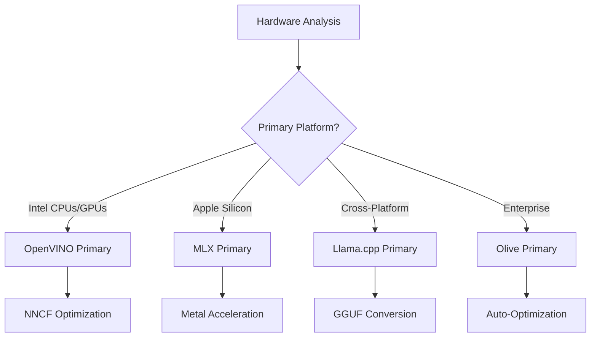
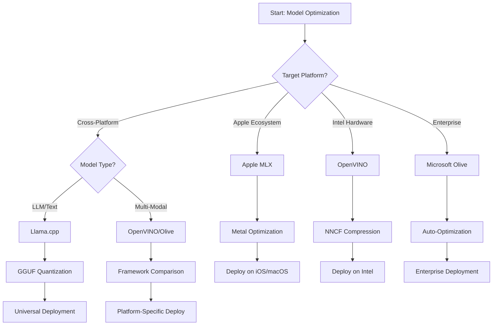
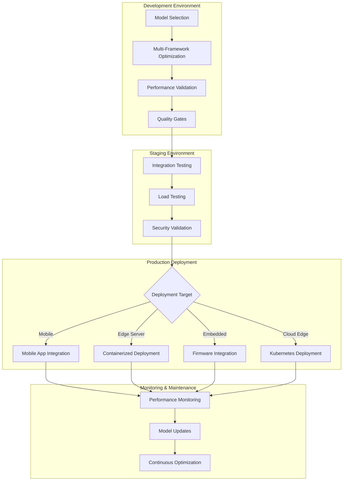

<!--
CO_OP_TRANSLATOR_METADATA:
{
  "original_hash": "6719c4a7e44b948230ac5f5cab3699bd",
  "translation_date": "2025-09-18T16:57:39+00:00",
  "source_file": "Module04/06.workflow-synthesis.md",
  "language_code": "cs"
}
-->
# Sekce 6: Syntéza pracovního postupu vývoje Edge AI

## Obsah
1. [Úvod](../../../Module04)
2. [Cíle učení](../../../Module04)
3. [Přehled sjednoceného pracovního postupu](../../../Module04)
4. [Maticový výběr frameworků](../../../Module04)
5. [Syntéza osvědčených postupů](../../../Module04)
6. [Průvodce strategií nasazení](../../../Module04)
7. [Pracovní postup optimalizace výkonu](../../../Module04)
8. [Kontrolní seznam připravenosti na produkci](../../../Module04)
9. [Řešení problémů a monitorování](../../../Module04)
10. [Zajištění budoucí odolnosti vašeho Edge AI pipeline](../../../Module04)

## Úvod

Vývoj Edge AI vyžaduje sofistikované porozumění různým optimalizačním frameworkům, strategiím nasazení a hardwarovým požadavkům. Tato komplexní syntéza spojuje znalosti z Llama.cpp, Microsoft Olive, OpenVINO a Apple MLX, aby vytvořila sjednocený pracovní postup, který maximalizuje efektivitu, udržuje kvalitu a zajišťuje úspěšné nasazení v produkci.

V průběhu tohoto kurzu jsme se zabývali jednotlivými optimalizačními frameworky, z nichž každý má své jedinečné přednosti a specializované případy použití. Nicméně reálné projekty Edge AI často vyžadují kombinaci technik z více frameworků nebo strategická rozhodnutí o tom, který přístup přinese nejlepší výsledky pro konkrétní omezení a požadavky.

Tato sekce syntetizuje kolektivní znalosti ze všech frameworků do praktických pracovních postupů, rozhodovacích stromů a osvědčených postupů, které vám umožní efektivně a účinně vytvářet produkčně připravená řešení Edge AI. Ať už optimalizujete pro mobilní zařízení, vestavěné systémy nebo edge servery, tento průvodce poskytuje strategický rámec pro informovaná rozhodnutí během celého vývojového cyklu.

## Cíle učení

Na konci této sekce budete schopni:

### Strategické rozhodování
- **Vyhodnotit a vybrat** optimální optimalizační framework na základě požadavků projektu, hardwarových omezení a scénářů nasazení
- **Navrhnout komplexní pracovní postupy**, které integrují více optimalizačních technik pro maximální efektivitu
- **Posoudit kompromisy** mezi přesností modelu, rychlostí inferencí, využitím paměti a složitostí nasazení napříč různými frameworky

### Integrace pracovního postupu
- **Implementovat sjednocené vývojové pipeline**, které využívají přednosti více optimalizačních frameworků
- **Vytvořit reprodukovatelné pracovní postupy** pro konzistentní optimalizaci modelů a nasazení v různých prostředích
- **Zavést kontrolní brány kvality** a validační procesy, aby optimalizované modely splňovaly požadavky na produkci

### Optimalizace výkonu
- **Aplikovat systematické optimalizační strategie** pomocí kvantizace, prořezávání a technik specifických pro hardware
- **Monitorovat a benchmarkovat** výkon modelu napříč různými úrovněmi optimalizace a cílovými platformami
- **Optimalizovat pro specifické hardwarové platformy**, včetně CPU, GPU, NPU a specializovaných edge akcelerátorů

### Nasazení do produkce
- **Navrhnout škálovatelné architektury nasazení**, které podporují různé formáty modelů a inference enginy
- **Implementovat monitorování a observabilitu** pro aplikace Edge AI v produkčním prostředí
- **Zavést pracovní postupy údržby** pro aktualizace modelů, monitorování výkonu a optimalizaci systému

### Excelence napříč platformami
- **Nasadit optimalizované modely** na různých hardwarových platformách při zachování konzistentního výkonu
- **Řešit optimalizace specifické pro platformu** pro Windows, macOS, Linux, mobilní a vestavěné systémy
- **Vytvořit abstraktní vrstvy**, které umožňují bezproblémové nasazení napříč různými edge prostředími

## Přehled sjednoceného pracovního postupu

### Fáze 1: Analýza požadavků a výběr frameworku

Základem úspěšného nasazení Edge AI je důkladná analýza požadavků, která informuje o výběru frameworku a optimalizační strategii.

#### 1.1 Hodnocení hardwaru


**Klíčové úvahy:**
- **Architektura CPU**: x86, ARM, schopnosti Apple Silicon
- **Dostupnost akcelerátorů**: GPU, NPU, VPU, specializované AI čipy
- **Omezení paměti**: Limity RAM, kapacita úložiště
- **Energetický rozpočet**: Výdrž baterie, tepelné omezení
- **Konektivita**: Požadavky na offline režim, omezení šířky pásma

#### 1.2 Matice požadavků aplikace

| Požadavek | Llama.cpp | Microsoft Olive | OpenVINO | Apple MLX |
|-----------|-----------|-----------------|----------|-----------|
| Napříč platformami | ✅ Výborné | ⚡ Dobré | ⚡ Dobré | ❌ Pouze Apple |
| Integrace do podniků | ⚡ Základní | ✅ Výborné | ✅ Výborné | ⚡ Omezené |
| Nasazení na mobil | ✅ Výborné | ⚡ Dobré | ⚡ Dobré | ✅ iOS Výborné |
| Inferencí v reálném čase | ✅ Výborné | ✅ Výborné | ✅ Výborné | ✅ Výborné |
| Rozmanitost modelů | ✅ Zaměření na LLM | ✅ Všechny modely | ✅ Všechny modely | ✅ Zaměření na LLM |
| Snadné použití | ✅ Jednoduché | ✅ Automatizované | ⚡ Střední | ✅ Jednoduché |

### Fáze 2: Příprava a optimalizace modelu

#### 2.1 Univerzální pipeline hodnocení modelu

```python
# Universal Model Assessment Framework
class EdgeAIModelAssessment:
    def __init__(self, model_path, target_hardware):
        self.model_path = model_path
        self.target_hardware = target_hardware
        self.optimization_frameworks = []
        
    def assess_model_characteristics(self):
        """Analyze model size, architecture, and complexity"""
        return {
            'model_size': self.get_model_size(),
            'parameter_count': self.get_parameter_count(),
            'architecture_type': self.detect_architecture(),
            'quantization_compatibility': self.check_quantization_support()
        }
    
    def recommend_optimization_strategy(self):
        """Recommend optimal frameworks and techniques"""
        characteristics = self.assess_model_characteristics()
        
        if self.target_hardware.startswith('apple'):
            return self.mlx_optimization_strategy(characteristics)
        elif self.target_hardware.startswith('intel'):
            return self.openvino_optimization_strategy(characteristics)
        elif characteristics['model_size'] > 7_000_000_000:  # 7B+ parameters
            return self.enterprise_optimization_strategy(characteristics)
        else:
            return self.lightweight_optimization_strategy(characteristics)
```

#### 2.2 Pipeline optimalizace napříč frameworky

**Sekvenční přístup k optimalizaci:**
1. **Počáteční konverze**: Převod do meziformátu (ONNX, pokud je to možné)
2. **Optimalizace specifická pro framework**: Aplikace specializovaných technik
3. **Křížová validace**: Ověření výkonu na cílových platformách
4. **Finální balení**: Příprava na nasazení

```bash
# Multi-Framework Optimization Script
#!/bin/bash

MODEL_NAME="phi-3-mini"
BASE_MODEL="microsoft/Phi-3-mini-4k-instruct"

# Phase 1: ONNX Conversion (Universal)
python convert_to_onnx.py --model $BASE_MODEL --output models/onnx/

# Phase 2: Platform-Specific Optimization
if [[ "$TARGET_PLATFORM" == "intel" ]]; then
    # OpenVINO Optimization
    python optimize_openvino.py --input models/onnx/ --output models/openvino/
elif [[ "$TARGET_PLATFORM" == "apple" ]]; then
    # MLX Optimization
    python optimize_mlx.py --input $BASE_MODEL --output models/mlx/
elif [[ "$TARGET_PLATFORM" == "cross" ]]; then
    # Llama.cpp Optimization
    python convert_to_gguf.py --input models/onnx/ --output models/gguf/
fi

# Phase 3: Validation
python validate_optimization.py --original $BASE_MODEL --optimized models/$TARGET_PLATFORM/
```

### Fáze 3: Validace výkonu a benchmarking

#### 3.1 Komplexní framework pro benchmarking

```python
class EdgeAIBenchmark:
    def __init__(self, optimized_models):
        self.models = optimized_models
        self.metrics = {
            'inference_time': [],
            'memory_usage': [],
            'accuracy_score': [],
            'throughput': [],
            'energy_consumption': []
        }
    
    def run_comprehensive_benchmark(self):
        """Execute standardized benchmarks across all optimized models"""
        test_inputs = self.generate_test_inputs()
        
        for model_framework, model_path in self.models.items():
            print(f"Benchmarking {model_framework}...")
            
            # Latency Testing
            latency = self.measure_inference_latency(model_path, test_inputs)
            
            # Memory Profiling
            memory = self.profile_memory_usage(model_path)
            
            # Accuracy Validation
            accuracy = self.validate_model_accuracy(model_path, test_inputs)
            
            # Throughput Analysis
            throughput = self.measure_throughput(model_path)
            
            self.record_metrics(model_framework, latency, memory, accuracy, throughput)
    
    def generate_optimization_report(self):
        """Create comprehensive comparison report"""
        report = {
            'recommendations': self.analyze_performance_trade_offs(),
            'deployment_guidance': self.generate_deployment_recommendations(),
            'monitoring_requirements': self.define_monitoring_metrics()
        }
        return report
```

## Maticový výběr frameworků

### Rozhodovací strom pro výběr frameworku



### Komplexní kritéria výběru

#### 1. Zarovnání s primárním případem použití

**Velké jazykové modely (LLMs):**
- **Llama.cpp**: Nejlepší pro nasazení zaměřené na CPU napříč platformami
- **Apple MLX**: Optimální pro Apple Silicon s jednotnou pamětí
- **OpenVINO**: Výborné pro hardware Intel s optimalizací NNCF
- **Microsoft Olive**: Ideální pro podnikové workflow s automatizací

**Multimodální modely:**
- **OpenVINO**: Komplexní podpora pro vizi, audio a text
- **Microsoft Olive**: Podniková optimalizace pro složité pipeline
- **Llama.cpp**: Omezeno na textové modely
- **Apple MLX**: Rostoucí podpora pro multimodální aplikace

#### 2. Matice hardwarových platforem

| Platforma | Primární framework | Sekundární možnost | Specializované funkce |
|-----------|--------------------|--------------------|-----------------------|
| Intel CPU/GPU | OpenVINO | Microsoft Olive | Komprese NNCF, optimalizace Intel |
| NVIDIA GPU | Microsoft Olive | OpenVINO | CUDA akcelerace, podnikové funkce |
| Apple Silicon | Apple MLX | Llama.cpp | Metal shadery, jednotná paměť |
| ARM Mobile | Llama.cpp | OpenVINO | Napříč platformami, minimální závislosti |
| Edge TPU | OpenVINO | Microsoft Olive | Podpora specializovaných akcelerátorů |
| Vestavěné ARM | Llama.cpp | OpenVINO | Minimální stopa, efektivní inference |

#### 3. Preference pracovního postupu vývoje

**Rychlé prototypování:**
1. **Llama.cpp**: Nejrychlejší nastavení, okamžité výsledky
2. **Apple MLX**: Jednoduché API v Pythonu, rychlá iterace
3. **Microsoft Olive**: Automatizovaná optimalizace, minimální konfigurace
4. **OpenVINO**: Složitější nastavení, komplexní funkce

**Podniková produkce:**
1. **Microsoft Olive**: Podnikové funkce, integrace Azure
2. **OpenVINO**: Ekosystém Intel, komplexní nástroje
3. **Apple MLX**: Podnikové aplikace specifické pro Apple
4. **Llama.cpp**: Jednoduché nasazení, omezené podnikové funkce

## Syntéza osvědčených postupů

### Univerzální principy optimalizace

#### 1. Strategie postupné optimalizace

```python
class ProgressiveOptimization:
    def __init__(self, base_model):
        self.base_model = base_model
        self.optimization_stages = [
            'baseline_measurement',
            'format_conversion',
            'quantization_optimization',
            'hardware_acceleration',
            'production_validation'
        ]
    
    def execute_progressive_optimization(self):
        """Apply optimization techniques incrementally"""
        
        # Stage 1: Baseline Measurement
        baseline_metrics = self.measure_baseline_performance()
        
        # Stage 2: Format Conversion
        converted_model = self.convert_to_optimal_format()
        conversion_metrics = self.measure_performance(converted_model)
        
        # Stage 3: Quantization
        quantized_model = self.apply_quantization(converted_model)
        quantization_metrics = self.measure_performance(quantized_model)
        
        # Stage 4: Hardware Acceleration
        accelerated_model = self.enable_hardware_acceleration(quantized_model)
        acceleration_metrics = self.measure_performance(accelerated_model)
        
        # Stage 5: Validation
        production_ready = self.validate_for_production(accelerated_model)
        
        return self.compile_optimization_report(
            baseline_metrics, conversion_metrics, 
            quantization_metrics, acceleration_metrics
        )
```

#### 2. Implementace kontrolních bran kvality

**Brány zachování přesnosti:**
- Zachovat >95 % původní přesnosti modelu
- Validovat na reprezentativních testovacích datových sadách
- Implementovat A/B testování pro validaci v produkci

**Brány zlepšení výkonu:**
- Dosáhnout minimálně 2x zlepšení rychlosti
- Snížit paměťovou stopu alespoň o 50 %
- Validovat konzistenci času inferencí

**Brány připravenosti na produkci:**
- Projít zátěžovým testováním pod zátěží
- Prokázat stabilní výkon v čase
- Validovat požadavky na bezpečnost a soukromí

### Integrace osvědčených postupů specifických pro frameworky

#### 1. Syntéza strategie kvantizace

```python
# Unified Quantization Approach
class UnifiedQuantizationStrategy:
    def __init__(self, model, target_platform):
        self.model = model
        self.platform = target_platform
        
    def select_optimal_quantization(self):
        """Choose best quantization based on platform and requirements"""
        
        if self.platform == 'apple_silicon':
            return self.mlx_quantization_strategy()
        elif self.platform == 'intel_hardware':
            return self.openvino_quantization_strategy()
        elif self.platform == 'cross_platform':
            return self.llamacpp_quantization_strategy()
        else:
            return self.olive_quantization_strategy()
    
    def mlx_quantization_strategy(self):
        """Apple MLX-specific quantization"""
        return {
            'method': 'mlx_quantize',
            'precision': 'int4',
            'group_size': 64,
            'optimization_target': 'unified_memory'
        }
    
    def openvino_quantization_strategy(self):
        """OpenVINO NNCF quantization"""
        return {
            'method': 'nncf_quantize',
            'precision': 'int8',
            'calibration_method': 'post_training',
            'optimization_target': 'intel_hardware'
        }
```

#### 2. Optimalizace hardwarové akcelerace

**Syntéza optimalizace CPU:**
- **SIMD instrukce**: Využití optimalizovaných jader napříč frameworky
- **Šířka paměti**: Optimalizace datových rozvržení pro efektivitu cache
- **Vlákna**: Vyvážení paralelismu s omezeními zdrojů

**Osvědčené postupy akcelerace GPU:**
- **Batch Processing**: Maximalizace propustnosti s vhodnými velikostmi batchů
- **Správa paměti**: Optimalizace alokace a přenosů paměti GPU
- **Přesnost**: Použití FP16, pokud je podporováno, pro lepší výkon

**Optimalizace NPU/specializovaných akcelerátorů:**
- **Architektura modelu**: Zajištění kompatibility s možnostmi akcelerátoru
- **Tok dat**: Optimalizace vstupních/výstupních pipeline pro efektivitu akcelerátoru
- **Strategie zálohy**: Implementace zálohy na CPU pro nepodporované operace

## Průvodce strategií nasazení

### Univerzální architektura nasazení



### Vzory nasazení specifické pro platformu

#### 1. Strategie nasazení na mobil

```yaml
# Mobile Deployment Configuration
mobile_deployment:
  ios:
    framework: apple_mlx
    optimization:
      quantization: int4
      memory_mapping: true
      background_execution: limited
    packaging:
      format: mlx
      bundle_size: <50MB
      
  android:
    framework: llama_cpp
    optimization:
      quantization: q4_k_m
      threading: android_optimized
      memory_management: conservative
    packaging:
      format: gguf
      apk_size: <100MB
      
  cross_platform:
    framework: onnx_runtime
    optimization:
      quantization: int8
      execution_provider: cpu
    packaging:
      format: onnx
      shared_libraries: minimal
```

#### 2. Nasazení na edge server

```yaml
# Edge Server Deployment Configuration
edge_server:
  intel_based:
    framework: openvino
    optimization:
      quantization: int8
      acceleration: cpu_gpu_auto
      batch_processing: dynamic
    deployment:
      container: openvino_runtime
      orchestration: kubernetes
      scaling: horizontal
      
  nvidia_based:
    framework: microsoft_olive
    optimization:
      quantization: int4
      acceleration: cuda
      tensor_parallelism: true
    deployment:
      container: nvidia_triton
      orchestration: kubernetes
      scaling: gpu_aware
```

### Osvědčené postupy kontejnerizace

```dockerfile
# Multi-Framework Edge AI Container
FROM ubuntu:22.04 as base

# Install common dependencies
RUN apt-get update && apt-get install -y \
    python3 \
    python3-pip \
    build-essential \
    cmake \
    && rm -rf /var/lib/apt/lists/*

# Framework-specific stages
FROM base as openvino
RUN pip install openvino nncf optimum[intel]

FROM base as llamacpp
RUN git clone https://github.com/ggerganov/llama.cpp.git \
    && cd llama.cpp && make LLAMA_OPENBLAS=1

FROM base as olive
RUN pip install olive-ai[auto-opt] onnxruntime-genai

# Production stage with selected framework
FROM openvino as production
COPY models/ /app/models/
COPY src/ /app/src/
WORKDIR /app

EXPOSE 8080
CMD ["python3", "src/inference_server.py"]
```

## Pracovní postup optimalizace výkonu

### Systematické ladění výkonu

#### 1. Pipeline profilování výkonu

```python
class EdgeAIPerformanceProfiler:
    def __init__(self, model_path, framework):
        self.model_path = model_path
        self.framework = framework
        self.profiling_results = {}
    
    def comprehensive_profiling(self):
        """Execute comprehensive performance analysis"""
        
        # CPU Profiling
        cpu_profile = self.profile_cpu_usage()
        
        # Memory Profiling
        memory_profile = self.profile_memory_usage()
        
        # Inference Latency
        latency_profile = self.profile_inference_latency()
        
        # Throughput Analysis
        throughput_profile = self.profile_throughput()
        
        # Energy Consumption (where available)
        energy_profile = self.profile_energy_consumption()
        
        return self.compile_performance_report(
            cpu_profile, memory_profile, latency_profile,
            throughput_profile, energy_profile
        )
    
    def identify_bottlenecks(self):
        """Automatically identify performance bottlenecks"""
        bottlenecks = []
        
        if self.profiling_results['cpu_utilization'] > 80:
            bottlenecks.append('cpu_bound')
        
        if self.profiling_results['memory_usage'] > 90:
            bottlenecks.append('memory_bound')
        
        if self.profiling_results['inference_variance'] > 20:
            bottlenecks.append('inconsistent_performance')
        
        return self.generate_optimization_recommendations(bottlenecks)
```

#### 2. Automatizovaná pipeline optimalizace

```python
class AutomatedOptimizationPipeline:
    def __init__(self, base_model, target_constraints):
        self.base_model = base_model
        self.constraints = target_constraints
        self.optimization_history = []
    
    def execute_optimization_search(self):
        """Systematically search optimization space"""
        
        optimization_candidates = [
            {'quantization': 'int8', 'pruning': 0.1},
            {'quantization': 'int4', 'pruning': 0.2},
            {'quantization': 'int8', 'acceleration': 'gpu'},
            {'quantization': 'int4', 'acceleration': 'npu'}
        ]
        
        best_configuration = None
        best_score = 0
        
        for config in optimization_candidates:
            optimized_model = self.apply_optimization(config)
            score = self.evaluate_optimization(optimized_model)
            
            if score > best_score and self.meets_constraints(optimized_model):
                best_score = score
                best_configuration = config
            
            self.optimization_history.append({
                'config': config,
                'score': score,
                'model': optimized_model
            })
        
        return best_configuration, self.optimization_history
```

### Multi-objektivní optimalizace

#### 1. Pareto optimalizace pro Edge AI

```python
class ParetoOptimization:
    def __init__(self, objectives=['speed', 'accuracy', 'memory']):
        self.objectives = objectives
        self.pareto_frontier = []
    
    def find_pareto_optimal_solutions(self, optimization_results):
        """Identify Pareto-optimal configurations"""
        
        for result in optimization_results:
            is_dominated = False
            
            for frontier_point in self.pareto_frontier:
                if self.dominates(frontier_point, result):
                    is_dominated = True
                    break
            
            if not is_dominated:
                # Remove dominated points from frontier
                self.pareto_frontier = [
                    point for point in self.pareto_frontier 
                    if not self.dominates(result, point)
                ]
                
                self.pareto_frontier.append(result)
        
        return self.pareto_frontier
    
    def recommend_configuration(self, user_preferences):
        """Recommend configuration based on user preferences"""
        
        weighted_scores = []
        for config in self.pareto_frontier:
            score = sum(
                user_preferences[obj] * config['metrics'][obj] 
                for obj in self.objectives
            )
            weighted_scores.append((score, config))
        
        return max(weighted_scores, key=lambda x: x[0])[1]
```

## Kontrolní seznam připravenosti na produkci

### Komplexní validace produkce

#### 1. Zajištění kvality modelu

```python
class ProductionReadinessValidator:
    def __init__(self, optimized_model, production_requirements):
        self.model = optimized_model
        self.requirements = production_requirements
        self.validation_results = {}
    
    def validate_model_quality(self):
        """Comprehensive model quality validation"""
        
        # Accuracy Validation
        accuracy_result = self.validate_accuracy()
        
        # Performance Validation
        performance_result = self.validate_performance()
        
        # Robustness Testing
        robustness_result = self.validate_robustness()
        
        # Security Assessment
        security_result = self.validate_security()
        
        # Compliance Verification
        compliance_result = self.validate_compliance()
        
        return self.compile_validation_report(
            accuracy_result, performance_result, robustness_result,
            security_result, compliance_result
        )
    
    def generate_certification_report(self):
        """Generate production certification report"""
        return {
            'model_signature': self.generate_model_signature(),
            'validation_timestamp': datetime.now(),
            'validation_results': self.validation_results,
            'deployment_approval': self.check_deployment_approval(),
            'monitoring_requirements': self.define_monitoring_requirements()
        }
```

#### 2. Kontrolní seznam nasazení do produkce

**Validace před nasazením:**
- [ ] Přesnost modelu splňuje minimální požadavky (>95 % základní hodnoty)
- [ ] Cíle výkonu dosaženy (latence, propustnost, paměť)
- [ ] Zhodnoceny a zmírněny bezpečnostní zranitelnosti
- [ ] Dokončeno zátěžové testování pod očekávanou zátěží
- [ ] Otestovány scénáře selhání a validovány postupy obnovy
- [ ] Konfigurovány systémy monitorování a upozornění
- [ ] Otestovány a zdokumentovány postupy rollbacku

**Proces nasazení:**
- [ ] Implementována strategie nasazení blue-green
- [ ] Konfigurováno postupné zvyšování provozu
- [ ] Aktivní dashboardy monitorování v reálném čase
- [ ] Stanoveny výchozí hodnoty výkonu
- [ ] Definovány prahové hodnoty chybovosti
- [ ] Konfigurovány automatizované spouštěče rollbacku

**Monitorování po nasazení:**
- [ ] Aktivní detekce driftu modelu
- [ ] Konfigurována upozornění na degradaci výkonu
- [ ] Aktivní monitorování využití zdrojů
- [ ] Sledovány metriky uživatelské zkušenosti
- [ ] Udržována verzování a rodokmen modelu
- [ ] Naplánovány pravidelné přezkumy výkonu modelu

### Kontinuální integrace/kontinuální nasazení (CI/CD)

```yaml
# Edge AI CI/CD Pipeline Configuration
edge_ai_pipeline:
  stages:
    - model_validation
    - optimization
    - testing
    - staging_deployment
    - production_deployment
    - monitoring
  
  model_validation:
    accuracy_threshold: 0.95
    performance_baseline: required
    security_scan: enabled
    
  optimization:
    frameworks:
      - llama_cpp
      - openvino
      - microsoft_olive
    validation:
      cross_validation: enabled
      performance_comparison: required
      
  testing:
    unit_tests: comprehensive
    integration_tests: full_pipeline
    load_tests: production_scale
    security_tests: comprehensive
    
  deployment:
    strategy: blue_green
    traffic_ramping: gradual
    rollback: automatic
    monitoring: real_time
```

## Řešení problémů a monitorování

### Univerzální framework pro řešení problémů

#### 1. Běžné problémy a řešení

**Problémy s výkonem:**
```python
class PerformanceTroubleshooter:
    def __init__(self, model_metrics):
        self.metrics = model_metrics
        
    def diagnose_performance_issues(self):
        """Systematic performance issue diagnosis"""
        
        issues = []
        
        # High latency diagnosis
        if self.metrics['avg_latency'] > self.metrics['target_latency']:
            issues.append(self.diagnose_latency_issues())
        
        # Memory usage diagnosis
        if self.metrics['memory_usage'] > self.metrics['memory_limit']:
            issues.append(self.diagnose_memory_issues())
        
        # Throughput diagnosis
        if self.metrics['throughput'] < self.metrics['target_throughput']:
            issues.append(self.diagnose_throughput_issues())
        
        return self.generate_resolution_plan(issues)
    
    def diagnose_latency_issues(self):
        """Specific latency troubleshooting"""
        potential_causes = []
        
        if self.metrics['cpu_utilization'] > 80:
            potential_causes.append('cpu_bottleneck')
        
        if self.metrics['memory_bandwidth'] > 90:
            potential_causes.append('memory_bandwidth_limit')
        
        if self.metrics['model_size'] > self.metrics['optimal_size']:
            potential_causes.append('model_too_large')
        
        return {
            'issue': 'high_latency',
            'causes': potential_causes,
            'solutions': self.generate_latency_solutions(potential_causes)
        }
```

**Řešení problémů specifické pro frameworky:**

| Problém | Llama.cpp | Microsoft Olive | OpenVINO | Apple MLX |
|---------|-----------|-----------------|----------|-----------|
| Problémy s pamětí | Snížit délku kontextu | Snížit velikost batchu | Aktivovat caching | Použít mapování paměti |
| Pomalejší inference | Aktivovat SIMD | Zkontrolovat kvantizaci | Optimalizovat vlákna | Aktivovat Metal |
| Ztráta přesnosti | Vyšší kvantizace | Přetrénovat s QAT | Zvýšit kalibraci | Doladit po kvantizaci |
| Kompatibilita | Zkontrolovat formát modelu | Ověřit verzi frameworku | Aktualizovat ovladače | Zkontrolovat verzi macOS |

#### 2. Strategie monitorování produkce

```python
class EdgeAIMonitoring:
    def __init__(self, deployment_config):
        self.config = deployment_config
        self.metrics_collectors = []
        self.alerting_rules = []
    
    def setup_comprehensive_monitoring(self):
        """Configure comprehensive monitoring for Edge AI deployment"""
        
        # Model Performance Monitoring
        self.setup_model_performance_monitoring()
        
        # Infrastructure Monitoring
        self.setup_infrastructure_monitoring()
        
        # Business Metrics Monitoring
        self.setup_business_metrics_monitoring()
        
        # Security Monitoring
        self.setup_security_monitoring()
    
    def setup_model_performance_monitoring(self):
        """Model-specific performance monitoring"""
        metrics = [
            'inference_latency_p50',
            'inference_latency_p95',
            'inference_latency_p99',
            'model_accuracy_drift',
            'prediction_confidence_distribution',
            'error_rate',
            'throughput_requests_per_second'
        ]
        
        for metric in metrics:
            self.add_metric_collector(metric)
            self.add_alerting_rule(metric)
    
    def detect_model_drift(self):
        """Automated model drift detection"""
        drift_indicators = [
            self.statistical_drift_detection(),
            self.performance_drift_detection(),
            self.data_distribution_shift_detection()
        ]
        
        return self.aggregate_drift_signals(drift_indicators)
```

### Automatizované řešení problémů

```python
class AutomatedIssueResolution:
    def __init__(self, monitoring_system):
        self.monitoring = monitoring_system
        self.resolution_strategies = {}
    
    def handle_performance_degradation(self, alert):
        """Automated performance issue resolution"""
        
        if alert['type'] == 'high_latency':
            return self.resolve_latency_issue(alert)
        elif alert['type'] == 'high_memory_usage':
            return self.resolve_memory_issue(alert)
        elif alert['type'] == 'accuracy_drift':
            return self.resolve_accuracy_issue(alert)
        
    def resolve_latency_issue(self, alert):
        """Automated latency issue resolution"""
        resolution_steps = [
            'increase_cpu_allocation',
            'enable_model_caching',
            'reduce_batch_size',
            'switch_to_quantized_model'
        ]
        
        for step in resolution_steps:
            if self.apply_resolution_step(step):
                return f"Resolved latency issue with: {step}"
        
        return "Escalating to human operator"
```

## Zajištění budoucí odolnosti vašeho Edge AI pipeline

### Integrace nově vznikajících technologií

#### 1. Podpora hardwaru nové generace

```python
class FutureHardwareIntegration:
    def __init__(self):
        self.supported_accelerators = [
            'npu_next_gen',
            'quantum_processors',
            'neuromorphic_chips',
            'optical_processors'
        ]
    
    def design_adaptive_pipeline(self):
        """Create hardware-agnostic optimization pipeline"""
        
        pipeline = {
            'model_preparation': self.universal_model_preparation(),
            'hardware_detection': self.dynamic_hardware_detection(),
            'optimization_selection': self.adaptive_optimization_selection(),
            'performance_validation': self.hardware_agnostic_validation()
        }
        
        return pipeline
    
    def adaptive_optimization_selection(self):
        """Dynamically select optimization based on available hardware"""
        
        def optimize_for_hardware(model, available_hardware):
            if 'npu' in available_hardware:
                return self.npu_optimization(model)
            elif 'quantum' in available_hardware:
                return self.quantum_optimization(model)
            elif 'neuromorphic' in available_hardware:
                return self.neuromorphic_optimization(model)
            else:
                return self.fallback_optimization(model)
        
        return optimize_for_hardware
```

#### 2. Evoluce architektury modelu

**Podpora pro nové architektury:**
- **Mixture of Experts (MoE)**: Řídké architektury modelů pro efektivitu
- **Retrieval-Augmented Generation**: Hybridní systémy model + znalostní báze
- **Multimodální modely**: Integrace vize + jazyka + audia
- **Federované učení**: Distribuované trénování a optimalizace

```python
class NextGenModelSupport:
    def __init__(self):
        self.architecture_handlers = {
            'moe': self.handle_mixture_of_experts,
            'rag': self.handle_retrieval_augmented,
            'multimodal': self.handle_multimodal,
            'federated': self.handle_federated_learning
        }
    
    def handle_mixture_of_experts(self, model):
        """Optimize Mixture of Experts models for edge deployment"""
        optimization_strategy = {
            'expert_pruning': True,
            'routing_optimization': True,
            'expert_quantization': 'per_expert',
            'load_balancing': 'dynamic'
        }
        return self.apply_moe_optimization(model, optimization_strategy)
```

### Kontinuální učení a adaptace

#### 1. Integrace online učení

```python
class EdgeOnlineLearning:
    def __init__(self, base_model, learning_rate=0.001):
        self.base_model = base_model
        self.learning_rate = learning_rate
        self.adaptation_buffer = []
    
    def continuous_adaptation(self, new_data, feedback):
        """Continuously adapt model based on edge data"""
        
        # Privacy-preserving local adaptation
        local_updates = self.compute_local_gradients(new_data, feedback)
        
        # Apply updates with constraints
        adapted_model = self.apply_constrained_updates(
            self.base_model, local_updates
        )
        
        # Validate adaptation quality
        if self.validate_adaptation(adapted_model):
            self.base_model = adapted_model
            return True
        
        return False
    
    def federated_learning_participation(self):
        """Participate in federated learning while preserving privacy"""
        
        # Compute local model updates
        local_updates = self.compute_private_updates()
        
        # Differential privacy protection
        private_updates = self.apply_differential_privacy(local_updates)
        
        # Share with federated learning coordinator
        return self.share_updates(private_updates)
```

#### 2. Udržitelnost a Green AI

```python
class GreenEdgeAI:
    def __init__(self, sustainability_targets):
        self.targets = sustainability_targets
        self.energy_monitor = EnergyMonitor()
    
    def optimize_for_sustainability(self, model):
        """Optimize model for minimal environmental impact"""
        
        optimization_objectives = [
            'minimize_energy_consumption',
            'maximize_hardware_utilization',
            'reduce_model_training_cost',
            'extend_device_lifetime'
        ]
        
        return self.multi_objective_green_optimization(
            model, optimization_objectives
        )
    
    def carbon_aware_deployment(self):
        """Deploy models considering carbon footprint"""
        
        deployment_strategy = {
            'prefer_renewable_energy_regions': True,
            'optimize_for_energy_efficiency': True,
            'minimize_data_transfer': True,
            'lifecycle_carbon_accounting': True
        }
        
        return deployment_strategy
```

## Závěr

Tato komplexní syntéza pracovního postupu představuje vyvrcholení znalostí o optimalizaci Edge AI, spojující osvědčené postupy ze všech hlavních optimalizačních frameworků do sjednoceného, produkčně připraveného přístupu. Dodržováním těchto pokynů budete schopni:

**Dosáhnout optimálního výkonu**: Prostřednictvím system
Pamatujte, že nejlepší strategie optimalizace je ta, která splňuje vaše konkrétní požadavky a zároveň si zachovává flexibilitu přizpůsobit se, jak se tyto požadavky vyvíjejí. Použijte tento průvodce jako rámec pro informované rozhodování, ale vždy ověřujte své volby prostřednictvím empirického testování a zkušeností z reálného nasazení.

## ➡️ Co dál

Pokračujte ve své cestě Edge AI prozkoumáním [Modulu 5: SLMOps a nasazení do produkce](../Module05/README.md), kde se dozvíte o provozních aspektech správy životního cyklu malých jazykových modelů.

---

**Prohlášení**:  
Tento dokument byl přeložen pomocí služby pro automatický překlad [Co-op Translator](https://github.com/Azure/co-op-translator). Ačkoli se snažíme o přesnost, mějte na paměti, že automatické překlady mohou obsahovat chyby nebo nepřesnosti. Původní dokument v jeho původním jazyce by měl být považován za autoritativní zdroj. Pro důležité informace se doporučuje profesionální lidský překlad. Neodpovídáme za žádná nedorozumění nebo nesprávné interpretace vyplývající z použití tohoto překladu.