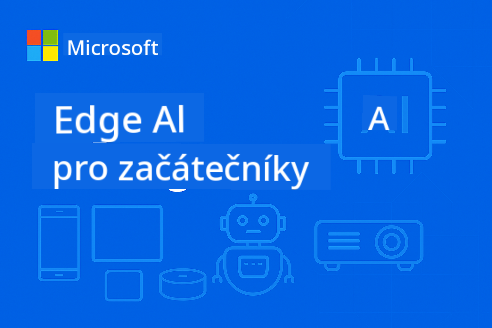

<!--
CO_OP_TRANSLATOR_METADATA:
{
  "original_hash": "c817161ba08864340737d623f761b9ae",
  "translation_date": "2025-09-18T15:26:24+00:00",
  "source_file": "README.md",
  "language_code": "cs"
}
-->
# EdgeAI pro začátečníky



[](https://GitHub.com/microsoft/edgeai-for-beginners/graphs/contributors)  
[](https://GitHub.com/microsoft/edgeai-for-beginners/issues)  
[](https://GitHub.com/microsoft/edgeai-for-beginners/pulls)  
[](http://makeapullrequest.com)  

[](https://GitHub.com/microsoft/edgeai-for-beginners/watchers)  
[](https://GitHub.com/microsoft/edgeai-for-beginners/fork)  
[](https://GitHub.com/microsoft/edgeai-for-beginners/stargazers)  

[](https://discord.com/invite/ByRwuEEgH4)

Postupujte podle těchto kroků, abyste mohli začít používat tyto zdroje:

1. **Forkněte repozitář**: Klikněte [](https://GitHub.com/microsoft/edgeai-for-beginners/fork)  
2. **Naklonujte repozitář**: `git clone https://github.com/microsoft/edgeai-for-beginners.git`  
3. [**Připojte se na Discord Azure AI Foundry a setkejte se s odborníky a dalšími vývojáři**](https://discord.com/invite/ByRwuEEgH4)  

### 🌐 Podpora více jazyků

#### Podporováno prostřednictvím GitHub Action (automatizované a vždy aktuální)

[Arabština](../ar/README.md) | [Bengálština](../bn/README.md) | [Bulharština](../bg/README.md) | [Barmština (Myanmar)](../my/README.md) | [Čínština (zjednodušená)](../zh/README.md) | [Čínština (tradiční, Hongkong)](../hk/README.md) | [Čínština (tradiční, Macao)](../mo/README.md) | [Čínština (tradiční, Tchaj-wan)](../tw/README.md) | [Chorvatština](../hr/README.md) | [Čeština](./README.md) | [Dánština](../da/README.md) | [Nizozemština](../nl/README.md) | [Finština](../fi/README.md) | [Francouzština](../fr/README.md) | [Němčina](../de/README.md) | [Řečtina](../el/README.md) | [Hebrejština](../he/README.md) | [Hindština](../hi/README.md) | [Maďarština](../hu/README.md) | [Indonéština](../id/README.md) | [Italština](../it/README.md) | [Japonština](../ja/README.md) | [Korejština](../ko/README.md) | [Malajština](../ms/README.md) | [Maráthština](../mr/README.md) | [Nepálština](../ne/README.md) | [Norština](../no/README.md) | [Perština (Fársí)](../fa/README.md) | [Polština](../pl/README.md) | [Portugalština (Brazílie)](../br/README.md) | [Portugalština (Portugalsko)](../pt/README.md) | [Panjábština (Gurmukhi)](../pa/README.md) | [Rumunština](../ro/README.md) | [Ruština](../ru/README.md) | [Srbština (cyrilice)](../sr/README.md) | [Slovenština](../sk/README.md) | [Slovinština](../sl/README.md) | [Španělština](../es/README.md) | [Svahilština](../sw/README.md) | [Švédština](../sv/README.md) | [Tagalog (Filipínština)](../tl/README.md) | [Thajština](../th/README.md) | [Turečtina](../tr/README.md) | [Ukrajinština](../uk/README.md) | [Urdu](../ur/README.md) | [Vietnamština](../vi/README.md)

**Pokud si přejete přidat další překlady, seznam podporovaných jazyků najdete [zde](https://github.com/Azure/co-op-translator/blob/main/getting_started/supported-languages.md)**

## Úvod

Vítejte v **EdgeAI pro začátečníky** – komplexní cestě do transformačního světa Edge umělé inteligence. Tento kurz propojuje výkonné schopnosti AI s praktickým nasazením v reálném světě na edge zařízeních, což vám umožní využít potenciál AI přímo tam, kde se generují data a kde je třeba činit rozhodnutí.

### Co se naučíte

Tento kurz vás provede od základních konceptů až po implementace připravené k produkci, včetně:
- **Malých jazykových modelů (SLMs)** optimalizovaných pro nasazení na edge
- **Optimalizace s ohledem na hardware** na různých platformách
- **Inference v reálném čase** s funkcemi zachování soukromí
- **Strategií nasazení do produkce** pro podnikové aplikace

### Proč je EdgeAI důležité

Edge AI představuje změnu paradigmatu, která řeší klíčové moderní výzvy:
- **Soukromí a bezpečnost**: Zpracování citlivých dat lokálně bez vystavení cloudu
- **Výkon v reálném čase**: Eliminace latence sítě pro aplikace kritické na čas
- **Efektivita nákladů**: Snížení nákladů na šířku pásma a cloudové výpočty
- **Odolnost provozu**: Zachování funkčnosti během výpadků sítě
- **Regulační shoda**: Splnění požadavků na suverenitu dat

### Edge AI

Edge AI označuje provozování AI algoritmů a jazykových modelů lokálně na hardwaru – blízko místa, kde se generují data – bez spoléhání na cloudové zdroje pro inference. Snižuje latenci, zvyšuje soukromí a umožňuje rozhodování v reálném čase.

### Základní principy:
- **Inference na zařízení**: AI modely běží na edge zařízeních (telefony, routery, mikrokontroléry, průmyslové PC)
- **Offline schopnosti**: Funguje bez trvalého připojení k internetu
- **Nízká latence**: Okamžité reakce vhodné pro systémy v reálném čase
- **Suverenita dat**: Udržuje citlivá data lokálně, zlepšuje bezpečnost a shodu

### Malé jazykové modely (SLMs)

SLMs jako Phi-4, Mistral-7B a Gemma jsou optimalizované verze větších LLMs – trénované nebo destilované pro:
- **Snížené nároky na paměť**: Efektivní využití omezené paměti edge zařízení
- **Nižší výpočetní nároky**: Optimalizované pro výkon CPU a edge GPU
- **Rychlejší start**: Rychlá inicializace pro pohotové aplikace

Umožňují výkonné NLP schopnosti při splnění omezení:
- **Vestavěné systémy**: IoT zařízení a průmyslové kontroléry
- **Mobilní zařízení**: Smartphony a tablety s offline schopnostmi
- **IoT zařízení**: Senzory a chytrá zařízení s omezenými zdroji
- **Edge servery**: Lokální zpracovací jednotky s omezenými GPU zdroji
- **Osobní počítače**: Scénáře nasazení na stolních a přenosných počítačích

## Architektura kurzu

### [Modul 01: Základy EdgeAI a transformace](./Module01/README.md)
**Téma**: Transformativní posun v nasazení Edge AI

#### Struktura kapitol:
- [**Sekce 1: Základy EdgeAI**](./Module01/01.EdgeAIFundamentals.md)
  - Porovnání tradiční cloudové AI a Edge AI
  - Výzvy a omezení edge computingu
  - Klíčové technologie: kvantizace modelů, kompresní optimalizace, malé jazykové modely (SLMs)
  - Hardwarová akcelerace: NPUs, optimalizace GPU, optimalizace CPU
  - Výhody: soukromí, bezpečnost, nízká latence, offline schopnosti, efektivita nákladů

- [**Sekce 2: Případové studie z reálného světa**](./Module01/02.RealWorldCaseStudies.md)
  - Ekosystém modelů Microsoft Phi & Mu
  - Případová studie AI reportovacího systému Japan Airlines
  - Dopad na trh a budoucí směry
  - Úvahy o nasazení a osvědčené postupy

- [**Sekce 3: Praktický průvodce implementací**](./Module01/03.PracticalImplementationGuide.md)
  - Nastavení vývojového prostředí (Python 3.10+, .NET 8+)
  - Požadavky na hardware a doporučené konfigurace
  - Zdroje rodiny základních modelů
  - Nástroje pro kvantizaci a optimalizaci (Llama.cpp, Microsoft Olive, Apple MLX)
  - Kontrolní seznam hodnocení a ověření

- [**Sekce 4: Hardwarové platformy pro nasazení Edge AI**](./Module01/04.EdgeDeployment.md)
  - Úvahy a požadavky na nasazení Edge AI
  - Hardwarové řešení Intel pro Edge AI a optimalizační techniky
  - Řešení Qualcomm AI pro mobilní a vestavěné systémy
  - NVIDIA Jetson a platformy pro edge computing
  - Windows AI PC platformy s akcelerací NPU
  - Strategie optimalizace specifické pro hardware

---

### [Modul 02: Základy malých jazykových modelů](./Module02/README.md)
**Téma**: Teoretické principy SLM, strategie implementace a nasazení do produkce

#### Struktura kapitol:
- [**Sekce 1: Základy rodiny modelů Microsoft Phi**](./Module02/01.PhiFamily.md)
  - Vývoj filozofie designu (Phi-1 až Phi-4)
  - Architektura zaměřená na efektivitu
  - Specializované schopnosti (usuzování, multimodální, nasazení na edge)

- [**Sekce 2: Základy rodiny Qwen**](./Module02/02.QwenFamily.md)
  - Excelence open source (Qwen 1.0 až Qwen3) – dostupné přes Hugging Face
  - Pokročilá architektura usuzování s režimem myšlení
  - Možnosti škálovatelného nasazení (0.5B-235B parametrů)

- [**Sekce 3: Základy rodiny Gemma**](./Module02/03.GemmaFamily.md)
  - Inovace řízená výzkumem (Gemma 3 & 3n)
  - Multimodální excelence
  - Architektura zaměřená na mobilní zařízení

- [**Sekce 4: Základy rodiny BitNET**](./Module02/04.BitNETFamily.md)
  - Revoluční technologie kvantizace (1.58-bit)
  - Specializovaný inference framework z https://github.com/microsoft/BitNet
  - Udržitelná AI díky extrémní efektivitě

- [**Sekce 5: Základy modelu Microsoft Mu**](./Module02/05.mumodel.md)
  - Architektura zaměřená na zařízení integrovaná do Windows 11
  - Systémová integrace s nastavením Windows 11
  - Funkce zachování soukromí při offline provozu

- [**Sekce 6: Základy Phi-Silica**](./Module02/06.phisilica.md)
  - Architektura optimalizovaná pro NPU integrovaná do Windows 11 Copilot+ PC
  - Výjimečná efektivita (650 tokenů/sekundu při 1.5W)
  - Integrace pro vývojáře s Windows App SDK

---

### [Modul 03: Nasazení malých jazykových modelů](./Module03/README.md)
**Téma**: Kompletní životní cyklus nasazení SLM, od teorie po produkční prostředí

#### Struktura kapitol:
- [**Sekce 1: Pokročilé učení SLM**](./Module03/01.SLMAdvancedLearning.md)
  - Rámec klasifikace parametrů (Micro SLM 100M-1.4B, Medium SLM 14B-30B)
  - Pokročilé optimalizační techniky (metody kvantizace, BitNET 1-bit kvantizace)
  - Strategie získávání modelů (Azure AI Foundry pro Phi modely, Hugging Face pro vybrané modely)

- [**Sekce 2: Nasazení v lokálním prostředí**](./Module03/02.DeployingSLMinLocalEnv.md)
  - Univerzální platforma Ollama
  - Lokální podniková řešení Microsoft Foundry
  - Komparativní analýza frameworků

- [**Sekce 3: Nasazení v kontejnerizovaném cloudu**](./Module03/03.DeployingSLMinCloud.md)
  - Nasazení inference s vysokým výkonem pomocí vLLM
  - Orchestrace kontejnerů Ollama
  - Implementace optimalizovaná pro edge pomocí ONNX Runtime

---

### [Modul 04: Konverze formátu modelu a kvantizace](./Module04/README.md)
**Téma**: Kompletní sada nástrojů pro optimalizaci modelů pro nasazení na edge napříč platformami

#### Struktura kapitol:
- [**Sekce 1: Základy konverze formátu modelu a kvantizace**](./Module04/01.Introduce.md)
  - Rámec klasifikace přesnosti (ultra-nízká, nízká, střední přesnost)
  - Výhody a případy použití formátů GGUF a ONNX
  - Výhody kvantizace pro provozní efektivitu
  - Výkonnostní benchmarky a porovnání paměťových nároků
- [**Sekce 2: Průvodce implementací Llama.cpp**](./Module04/02.Llamacpp.md)
  - Instalace napříč platformami (Windows, macOS, Linux)
  - Konverze do formátu GGUF a úrovně kvantizace (Q2_K až Q8_0)
  - Hardwarová akcelerace (CUDA, Metal, OpenCL, Vulkan)
  - Integrace s Pythonem a nasazení REST API

- [**Sekce 3: Optimalizační sada Microsoft Olive**](./Module04/03.MicrosoftOlive.md)
  - Optimalizace modelů s ohledem na hardware s více než 40 vestavěnými komponentami
  - Automatická optimalizace s dynamickou a statickou kvantizací
  - Podniková integrace s pracovními postupy Azure ML
  - Podpora populárních modelů (Llama, Phi, vybrané modely Qwen, Gemma)

- [**Sekce 4: Optimalizační sada OpenVINO Toolkit**](./Module04/04.openvino.md)
  - Open-source sada od Intelu pro nasazení AI napříč platformami
  - Framework pro kompresi neuronových sítí (NNCF) pro pokročilou optimalizaci
  - OpenVINO GenAI pro nasazení velkých jazykových modelů
  - Hardwarová akcelerace na CPU, GPU, VPU a AI akcelerátorech

- [**Sekce 5: Detailní průzkum Apple MLX Framework**](./Module04/05.AppleMLX.md)
  - Architektura sjednocené paměti pro Apple Silicon
  - Podpora modelů LLaMA, Mistral, Phi-3, vybraných modelů Qwen
  - Jemné ladění LoRA a přizpůsobení modelů
  - Integrace s Hugging Face s kvantizací 4-bit/8-bit

- [**Sekce 6: Syntéza pracovního postupu pro vývoj Edge AI**](./Module04/06.workflow-synthesis.md)
  - Sjednocená architektura pracovního postupu integrující více optimalizačních frameworků
  - Rozhodovací stromy pro výběr frameworku a analýza výkonových kompromisů
  - Validace připravenosti pro produkci a komplexní strategie nasazení
  - Strategie pro budoucí hardware a modelové architektury

---

### [Modul 05: SLMOps - Operace malých jazykových modelů](./Module05/README.md)
**Téma**: Kompletní operace životního cyklu SLM od destilace po nasazení do produkce

#### Struktura kapitol:
- [**Sekce 1: Úvod do SLMOps**](./Module05/01.IntroduceSLMOps.md)
  - Posun paradigmatu SLMOps v AI operacích
  - Nákladová efektivita a architektura zaměřená na soukromí
  - Strategický obchodní dopad a konkurenční výhody
  - Výzvy a řešení při implementaci v reálném světě

- [**Sekce 2: Destilace modelů - od teorie k praxi**](./Module05/02.SLMOps-Distillation.md)
  - Přenos znalostí z učitelských modelů na studentské modely
  - Implementace dvoustupňového procesu destilace
  - Pracovní postupy destilace v Azure ML s praktickými příklady
  - 85% zkrácení času inferencí při zachování 92% přesnosti

- [**Sekce 3: Jemné ladění - přizpůsobení modelů pro specifické úkoly**](./Module05/03.SLMOps-Finetuing.md)
  - Techniky jemného ladění s efektivním využitím parametrů (PEFT)
  - Pokročilé metody LoRA a QLoRA
  - Implementace jemného ladění pomocí Microsoft Olive
  - Trénink s více adaptéry a optimalizace hyperparametrů

- [**Sekce 4: Nasazení - implementace připravená pro produkci**](./Module05/04.SLMOps.Deployment.md)
  - Konverze modelů a kvantizace pro produkci
  - Konfigurace nasazení Foundry Local
  - Benchmarking výkonu a validace kvality
  - 75% zmenšení velikosti s monitorováním produkce

---

### [Modul 06: Agentické systémy SLM - AI agenti a volání funkcí](./Module06/README.md)
**Téma**: Implementace agentických systémů SLM od základů po pokročilé volání funkcí a integraci Model Context Protocol

#### Struktura kapitol:
- [**Sekce 1: AI agenti a základy malých jazykových modelů**](./Module06/01.IntroduceAgent.md)
  - Rámec klasifikace agentů (reflexní, založené na modelu, založené na cíli, učící se agenti)
  - Základy SLM a optimalizační strategie (GGUF, kvantizace, edge frameworky)
  - Analýza kompromisů mezi SLM a LLM (10-30× snížení nákladů, 70-80% efektivita úkolů)
  - Praktické nasazení s Ollama, VLLM a řešeními Microsoft edge

- [**Sekce 2: Volání funkcí v malých jazykových modelech**](./Module06/02.FunctionCalling.md)
  - Systematická implementace pracovního postupu (detekce záměru, výstup JSON, externí provedení)
  - Implementace specifické pro platformu (Phi-4-mini, vybrané modely Qwen, Microsoft Foundry Local)
  - Pokročilé příklady (spolupráce více agentů, dynamický výběr nástrojů)
  - Produkční úvahy (omezení rychlosti, auditní logování, bezpečnostní opatření)

- [**Sekce 3: Integrace Model Context Protocol (MCP)**](./Module06/03.IntroduceMCP.md)
  - Architektura protokolu a vrstvený systémový design
  - Podpora více backendů (Ollama pro vývoj, vLLM pro produkci)
  - Protokoly připojení (režimy STDIO a SSE)
  - Aplikace v reálném světě (automatizace webu, zpracování dat, integrace API)

---

### [Modul 07: Ukázky implementace EdgeAI](./Module07/README.md)
**Téma**: Komplexní implementace EdgeAI napříč různými platformami a frameworky

#### Struktura kapitol:
- [**AI Toolkit pro Visual Studio Code**](./Module07/aitoolkit.md)
  - Komplexní prostředí pro vývoj Edge AI ve VS Code
  - Katalog modelů a jejich objevování pro nasazení na edge
  - Lokální testování, optimalizace a pracovní postupy vývoje agentů
  - Monitorování výkonu a hodnocení pro edge scénáře

- [**Průvodce vývojem EdgeAI na Windows**](./Module07/windowdeveloper.md)
  - Komplexní přehled platformy Windows AI Foundry
  - API Phi Silica pro efektivní inferenci na NPU
  - API pro počítačové vidění pro zpracování obrazu a OCR
  - Foundry Local CLI pro lokální vývoj a testování

- [**EdgeAI na NVIDIA Jetson Orin Nano**](./Module07/README.md#1-edgeai-in-nvidia-jetson-orin-nano)
  - 67 TOPS AI výkon v zařízení velikosti kreditní karty
  - Podpora generativních AI modelů (transformery pro vidění, LLM, modely vidění-jazyk)
  - Aplikace v robotice, dronech, inteligentních kamerách, autonomních zařízeních
  - Cenově dostupná platforma za $249 pro demokratizovaný vývoj AI

- [**EdgeAI v mobilních aplikacích s .NET MAUI a ONNX Runtime GenAI**](./Module07/README.md#2-edgeai-in-mobile-applications-with-net-maui-and-onnx-runtime-genai)
  - Cross-platform mobilní AI s jednotnou C# základnou
  - Podpora hardwarové akcelerace (CPU, GPU, mobilní AI procesory)
  - Optimalizace specifické pro platformu (CoreML pro iOS, NNAPI pro Android)
  - Kompletní implementace generativní AI smyčky

- [**EdgeAI v Azure s motorem malých jazykových modelů**](./Module07/README.md#3-edgeai-in-azure-with-small-language-models-engine)
  - Hybridní architektura nasazení cloud-edge
  - Integrace Azure AI služeb s ONNX Runtime
  - Nasazení v měřítku podniků a kontinuální správa modelů
  - Hybridní AI pracovní postupy pro inteligentní zpracování dokumentů

- [**EdgeAI s Windows ML**](./Module07/README.md#4-edgeai-with-windows-ml)
  - Základ platformy Windows AI Foundry pro výkonnou inferenci na zařízení
  - Univerzální podpora hardwaru (AMD, Intel, NVIDIA, Qualcomm silicon)
  - Automatická abstrakce hardwaru a optimalizace
  - Sjednocený framework pro různorodý ekosystém Windows hardwaru

- [**EdgeAI s aplikacemi Foundry Local**](./Module07/README.md#5-edgeai-with-foundry-local-applications)
  - Implementace RAG zaměřená na soukromí s lokálními zdroji
  - Integrace jazykového modelu Phi-3 se semantickým vyhledáváním (pouze modely Phi)
  - Podpora lokálních vektorových databází (SQLite, Qdrant)
  - Schopnosti datové suverenity a offline provozu

## Cíle kurzu

Dokončením tohoto komplexního kurzu EdgeAI získáte odborné znalosti pro návrh, implementaci a nasazení produkčně připravených řešení EdgeAI. Náš strukturovaný přístup zajišťuje, že zvládnete jak teoretické základy, tak praktické dovednosti implementace.

### Technické kompetence

**Základní znalosti**
- Porozumění základním rozdílům mezi cloudovými a edge AI architekturami
- Osvojení principů kvantizace modelů, komprese a optimalizace pro prostředí s omezenými zdroji
- Pochopení možností hardwarové akcelerace (NPU, GPU, CPU) a jejich dopadů na nasazení

**Implementační dovednosti**
- Nasazení malých jazykových modelů na různých edge platformách (mobilní, vestavěné, IoT, edge servery)
- Aplikace optimalizačních frameworků včetně Llama.cpp, Microsoft Olive, ONNX Runtime a Apple MLX
- Implementace systémů inferencí v reálném čase s požadavky na odezvu pod jednu sekundu

**Produkční odbornost**
- Návrh škálovatelných EdgeAI architektur pro podnikové aplikace
- Implementace strategií monitorování, údržby a aktualizace nasazených systémů
- Aplikace bezpečnostních osvědčených postupů pro implementace EdgeAI zaměřené na soukromí

### Strategické schopnosti

**Rámec rozhodování**
- Hodnocení příležitostí EdgeAI a identifikace vhodných případů použití pro obchodní aplikace
- Posouzení kompromisů mezi přesností modelu, rychlostí inferencí, spotřebou energie a náklady na hardware
- Výběr vhodných rodin SLM a konfigurací na základě specifických omezení nasazení

**Systémová architektura**
- Návrh end-to-end EdgeAI řešení, která se integrují do stávající infrastruktury
- Plánování hybridních edge-cloud architektur pro optimální výkon a nákladovou efektivitu
- Implementace datových toků a zpracovatelských pipeline pro AI aplikace v reálném čase

### Průmyslové aplikace

**Praktické scénáře nasazení**
- **Výroba**: Systémy kontroly kvality, prediktivní údržba a optimalizace procesů
- **Zdravotnictví**: Diagnostické nástroje zaměřené na soukromí a systémy monitorování pacientů
- **Doprava**: Rozhodování autonomních vozidel a řízení dopravy
- **Chytrá města**: Inteligentní infrastruktura a systémy řízení zdrojů
- **Spotřební elektronika**: Mobilní aplikace poháněné AI a chytrá domácí zařízení

## Přehled očekávaných výsledků kurzu

### Výsledky učení modulu 01:
- Porozumění základním rozdílům mezi cloudovými a edge AI architekturami
- Osvojení základních optimalizačních technik pro nasazení na edge
- Rozpoznání aplikací v reálném světě a úspěšných příběhů
- Získání praktických dovedností pro implementaci EdgeAI řešení

### Výsledky učení modulu 02:
- Hluboké porozumění různým filozofiím návrhu SLM a jejich dopadům na nasazení
- Osvojení strategických schopností rozhodování na základě výpočetních omezení a požadavků na výkon
- Porozumění kompromisům flexibility nasazení
- Získání pohledu na budoucnost efektivních AI architektur

### Výsledky učení modulu 03:
- Schopnosti strategického výběru modelů
- Osvojení technik optimalizace
- Osvojení flexibility nasazení
- Schopnosti konfigurace připravené pro produkci

### Výsledky učení modulu 04:
- Hluboké porozumění hranicím kvantizace a praktickým aplikacím
- Praktické zkušenosti s více optimalizačními frameworky (Llama.cpp, Olive, OpenVINO, MLX)
- Osvojení optimalizace hardwaru Intel pomocí OpenVINO a NNCF
- Schopnosti výběru optimalizace s ohledem na hardware napříč různými platformami
- Dovednosti nasazení do produkce pro edge computing napříč platformami
- Strategický výběr frameworků a syntéza pracovních postupů pro optimální Edge AI řešení

### Výsledky učení modulu 05:
- Osvojení paradigmatu SLMOps a operačních principů
- Implementace destilace modelů pro přenos znalostí a optimalizaci efektivity
- Aplikace technik jemného ladění pro přizpůsobení modelů specifickým doménám
- Nasazení produkčně připravených SLM řešení se strategiemi monitorování a údržby

### Výsledky učení modulu 06:
- Porozumění základním konceptům AI agentů a architektury malých jazykových modelů
- Osvojení implementace volání funkcí napříč různými platformami a frameworky
- Integrace Model Context Protocol (MCP) pro standardizovanou interakci s externími nástroji
- Vytvoření sofistikovaných agentických systémů s minimálními požadavky na lidský zásah

### Výsledky učení modulu 07:
- Osvojení AI Toolkit pro Visual Studio Code pro komplexní pracovní postupy vývoje Edge AI
- Získání odbornosti na platformě Windows AI Foundry a optimalizačních strategiích NPU
- Získání praktických zkušeností s různými platformami EdgeAI a strategiemi implementace
- Osvojení technik optimalizace specifických pro hardware napříč platformami NVIDIA, mobilními, Azure a Windows
- Porozumění kompromisům nasazení mezi výkonem, náklady a požadavky na soukromí
- Rozvoj praktických dovedností pro vytváření reálných EdgeAI aplikací napříč různými ekosystémy

## Očekávané výsledky kurzu

Po úspěšném dokončení tohoto kurzu budete vybaveni znalostmi, dovednostmi a sebevědomím vést iniciativy EdgeAI v profesionálním prostředí.

### Profesionální připravenost

**Technické vedení**
- **Architektura řešení**: Návrh komplexních EdgeAI systémů splňujících podnikové požadavky
- **Optimalizace výkonu**: Dosažení optimální rovnováhy mezi přesností, rychlostí a spotřebou zdrojů
- **Nasazení napříč platformami**: Implementace řešení na Windows, Linux, mobilních a vestavěných platformách
- **Provoz v produkci**: Údržba a škálování EdgeAI systémů s podnikovou spolehlivostí

**Odbornost v průmyslu**
- **Hodnocení technologií**: Posouzení a doporučení EdgeAI řešení pro specifické obchodní výzvy
- **Plánování implementace**: Vývoj realistických časových plánů a požadavků na zdroje pro EdgeAI projekty
- **Řízení rizik**: Identifikace a zmírnění technických a provozních rizik při nasazení EdgeAI
- **Optimalizace ROI**: Prokázání měřitelné obchodní hodnoty z implementací EdgeAI

### Příležitosti pro kariérní růst

**Profesionální role**
- Architekt řešení EdgeAI
- Strojový učení inženýr (specializace na Edge)
- Vývojář Io
Tento kurz vás postaví do čela nasazení AI technologií, kde inteligentní schopnosti jsou bezproblémově integrovány do zařízení a systémů, které pohánějí moderní život.

## Diagram struktury souborů

```
edgeai-for-beginners/
├── imgs/
│   └── cover.png
├── Module01/ (EdgeAI Fundamentals and Transformation)
│   ├── 01.EdgeAIFundamentals.md
│   ├── 02.RealWorldCaseStudies.md
│   ├── 03.PracticalImplementationGuide.md
│   ├── 04.EdgeDeployment.md
│   └── README.md
├── Module02/ (Small Language Model Foundations)
│   ├── 01.PhiFamily.md
│   ├── 02.QwenFamily.md
│   ├── 03.GemmaFamily.md
│   ├── 04.BitNETFamily.md
│   ├── 05.mumodel.md
│   ├── 06.phisilica.md
│   └── README.md
├── Module03/ (SLM Deployment Practice)
│   ├── 01.SLMAdvancedLearning.md
│   ├── 02.DeployingSLMinLocalEnv.md
│   ├── 03.DeployingSLMinCloud.md
│   └── README.md
├── Module04/ (Model Format Conversion and Quantization)
│   ├── 01.Introduce.md
│   ├── 02.Llamacpp.md
│   ├── 03.MicrosoftOlive.md
│   ├── 04.openvino.md
│   ├── 05.AppleMLX.md
│   ├── 06.workflow-synthesis.md
│   └── README.md
├── Module05/ (SLMOps - Small Language Model Operations)
│   ├── 01.IntroduceSLMOps.md
│   ├── 02.SLMOps-Distillation.md
│   ├── 03.SLMOps-Finetuing.md
│   ├── 04.SLMOps.Deployment.md
│   └── README.md
├── Module06/ (SLM Agentic Systems)
│   ├── 01.IntroduceAgent.md
│   ├── 02.FunctionCalling.md
│   ├── 03.IntroduceMCP.md
│   └── README.md
├── Module07/ (EdgeAI Implementation Samples)
│   ├── aitoolkit.md
│   ├── windowdeveloper.md
│   └── README.md
├── CODE_OF_CONDUCT.md
├── LICENSE
├── README.md (This file)
├── SECURITY.md
├── STUDY_GUIDE.md
└── SUPPORT.md
```

## Vlastnosti kurzu

- **Progresivní učení**: Postupný přechod od základních konceptů k pokročilému nasazení
- **Integrace teorie a praxe**: Každý modul obsahuje teoretické základy i praktické operace
- **Skutečné případové studie**: Založeno na reálných případech od Microsoftu, Alibaby, Googlu a dalších
- **Praktická cvičení**: Kompletní konfigurační soubory, postupy testování API a nasazovací skripty
- **Výkonnostní benchmarky**: Podrobné srovnání rychlosti inferencí, využití paměti a požadavků na zdroje
- **Podnikové aspekty**: Bezpečnostní postupy, rámce pro dodržování předpisů a strategie ochrany dat

## Začínáme

Doporučená studijní cesta:
1. Začněte s **Module01**, abyste získali základní porozumění EdgeAI
2. Pokračujte na **Module02**, abyste důkladně pochopili různé rodiny modelů SLM
3. Naučte se **Module03**, abyste zvládli praktické dovednosti nasazení
4. Pokračujte s **Module04** pro pokročilou optimalizaci modelů, konverzi formátů a syntézu rámců
5. Dokončete **Module05**, abyste zvládli SLMOps pro implementace připravené na produkci
6. Prozkoumejte **Module06**, abyste pochopili systémy SLM agentů a schopnosti volání funkcí
7. Dokončete **Module07**, abyste získali praktické zkušenosti s AI Toolkitem a různými příklady implementace EdgeAI

Každý modul je navržen tak, aby byl samostatně kompletní, ale postupné učení poskytne nejlepší výsledky.

## Průvodce studiem

Komplexní [Průvodce studiem](STUDY_GUIDE.md) je k dispozici, aby vám pomohl maximalizovat váš studijní zážitek. Průvodce studiem poskytuje:

- **Strukturované studijní cesty**: Optimalizované rozvrhy pro dokončení kurzu za 20 hodin
- **Doporučení pro rozdělení času**: Specifické návrhy pro vyvážení čtení, cvičení a projektů
- **Zaměření na klíčové koncepty**: Prioritizované studijní cíle pro každý modul
- **Nástroje pro sebehodnocení**: Otázky a cvičení pro ověření vašeho porozumění
- **Nápady na mini-projekty**: Praktické aplikace pro upevnění vašich znalostí

Průvodce studiem je navržen tak, aby vyhovoval jak intenzivnímu učení (1 týden), tak i částečnému studiu (3 týdny), s jasnými pokyny, jak efektivně rozdělit čas, i když můžete kurzu věnovat pouze 10 hodin.

---

**Budoucnost EdgeAI spočívá v neustálém zlepšování architektur modelů, technik kvantizace a strategií nasazení, které upřednostňují efektivitu a specializaci před univerzálními schopnostmi. Organizace, které přijmou tento posun paradigmatu, budou dobře připraveny využít transformační potenciál AI a zároveň si udržet kontrolu nad svými daty a operacemi.**

## Další kurzy

Náš tým vytváří další kurzy! Podívejte se na:

- [MCP pro začátečníky](https://github.com/microsoft/mcp-for-beginners)
- [AI Agents pro začátečníky](https://github.com/microsoft/ai-agents-for-beginners?WT.mc_id=academic-105485-koreyst)
- [Generativní AI pro začátečníky s využitím .NET](https://github.com/microsoft/Generative-AI-for-beginners-dotnet?WT.mc_id=academic-105485-koreyst)
- [Generativní AI pro začátečníky s využitím JavaScriptu](https://github.com/microsoft/generative-ai-with-javascript?WT.mc_id=academic-105485-koreyst)
- [Generativní AI pro začátečníky](https://github.com/microsoft/generative-ai-for-beginners?WT.mc_id=academic-105485-koreyst)
- [ML pro začátečníky](https://aka.ms/ml-beginners?WT.mc_id=academic-105485-koreyst)
- [Data Science pro začátečníky](https://aka.ms/datascience-beginners?WT.mc_id=academic-105485-koreyst)
- [AI pro začátečníky](https://aka.ms/ai-beginners?WT.mc_id=academic-105485-koreyst)
- [Kybernetická bezpečnost pro začátečníky](https://github.com/microsoft/Security-101??WT.mc_id=academic-96948-sayoung)
- [Webový vývoj pro začátečníky](https://aka.ms/webdev-beginners?WT.mc_id=academic-105485-koreyst)
- [IoT pro začátečníky](https://aka.ms/iot-beginners?WT.mc_id=academic-105485-koreyst)
- [XR vývoj pro začátečníky](https://github.com/microsoft/xr-development-for-beginners?WT.mc_id=academic-105485-koreyst)
- [Ovládnutí GitHub Copilot pro párové programování s AI](https://aka.ms/GitHubCopilotAI?WT.mc_id=academic-105485-koreyst)
- [Ovládnutí GitHub Copilot pro vývojáře C#/.NET](https://github.com/microsoft/mastering-github-copilot-for-dotnet-csharp-developers?WT.mc_id=academic-105485-koreyst)
- [Vyberte si vlastní dobrodružství s Copilotem](https://github.com/microsoft/CopilotAdventures?WT.mc_id=academic-105485-koreyst)

---

**Prohlášení**:  
Tento dokument byl přeložen pomocí služby pro automatický překlad [Co-op Translator](https://github.com/Azure/co-op-translator). I když se snažíme o přesnost, mějte prosím na paměti, že automatické překlady mohou obsahovat chyby nebo nepřesnosti. Původní dokument v jeho původním jazyce by měl být považován za autoritativní zdroj. Pro důležité informace doporučujeme profesionální lidský překlad. Neodpovídáme za žádná nedorozumění nebo nesprávné interpretace vyplývající z použití tohoto překladu.