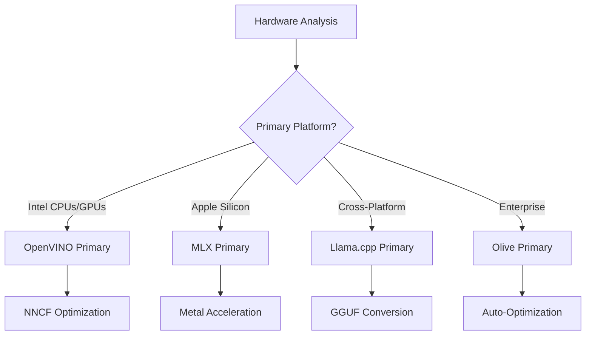
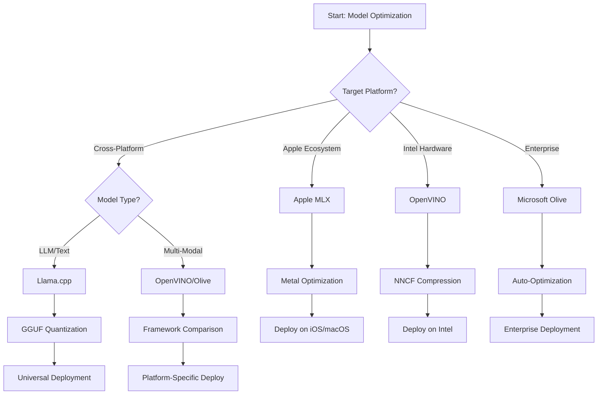
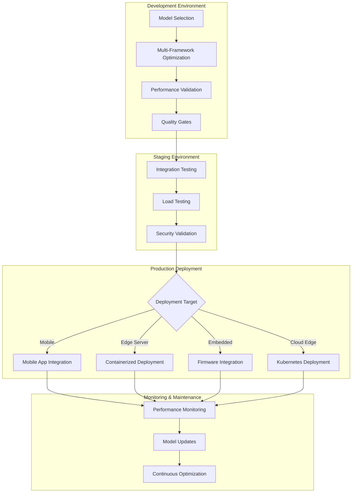

<!--
CO_OP_TRANSLATOR_METADATA:
{
  "original_hash": "6719c4a7e44b948230ac5f5cab3699bd",
  "translation_date": "2025-09-18T10:17:46+00:00",
  "source_file": "Module04/06.workflow-synthesis.md",
  "language_code": "da"
}
-->
# Afsnit 6: Workflow-syntese for Edge AI-udvikling

## Indholdsfortegnelse
1. [Introduktion](../../../Module04)
2. [Læringsmål](../../../Module04)
3. [Oversigt over samlet workflow](../../../Module04)
4. [Matrix for valg af framework](../../../Module04)
5. [Syntese af bedste praksis](../../../Module04)
6. [Guide til implementeringsstrategi](../../../Module04)
7. [Workflow for optimering af ydeevne](../../../Module04)
8. [Tjekliste for produktionsparathed](../../../Module04)
9. [Fejlfinding og overvågning](../../../Module04)
10. [Fremtidssikring af din Edge AI-pipeline](../../../Module04)

## Introduktion

Udvikling af Edge AI kræver en avanceret forståelse af flere optimeringsframeworks, implementeringsstrategier og hardwareovervejelser. Denne omfattende syntese samler viden fra Llama.cpp, Microsoft Olive, OpenVINO og Apple MLX for at skabe et samlet workflow, der maksimerer effektivitet, opretholder kvalitet og sikrer succesfuld implementering i produktion.

Gennem dette kursus har vi udforsket individuelle optimeringsframeworks, hver med unikke styrker og specialiserede anvendelsesområder. I praksis kræver Edge AI-projekter dog ofte en kombination af teknikker fra flere frameworks eller strategiske beslutninger om, hvilken tilgang der giver de bedste resultater under specifikke begrænsninger og krav.

Dette afsnit samler den samlede viden fra alle frameworks i handlingsorienterede workflows, beslutningstræer og bedste praksis, der gør det muligt for dig at bygge produktionsklare Edge AI-løsninger effektivt og målrettet. Uanset om du optimerer til mobile enheder, indlejrede systemer eller edge-servere, giver denne guide den strategiske ramme for at træffe informerede beslutninger gennem hele din udviklingsproces.

## Læringsmål

Ved afslutningen af dette afsnit vil du være i stand til at:

### Strategisk beslutningstagning
- **Evaluere og vælge** det optimale optimeringsframework baseret på projektkrav, hardwarebegrænsninger og implementeringsscenarier
- **Designe omfattende workflows**, der integrerer flere optimeringsteknikker for maksimal effektivitet
- **Vurdere kompromiser** mellem modelnøjagtighed, inferenshastighed, hukommelsesforbrug og implementeringskompleksitet på tværs af forskellige frameworks

### Workflow-integration
- **Implementere samlede udviklingspipelines**, der udnytter styrkerne fra flere optimeringsframeworks
- **Skabe reproducerbare workflows** for konsistent modeloptimering og implementering på tværs af forskellige miljøer
- **Etablere kvalitetskontroller** og valideringsprocesser for at sikre, at optimerede modeller opfylder produktionskrav

### Ydeevneoptimering
- **Anvende systematiske optimeringsstrategier** ved hjælp af kvantisering, beskæring og hardware-specifikke accelerationsteknikker
- **Overvåge og benchmarke** modelpræstationer på tværs af forskellige optimeringsniveauer og implementeringsmål
- **Optimere til specifikke hardwareplatforme**, herunder CPU, GPU, NPU og specialiserede edge-acceleratorer

### Implementering i produktion
- **Designe skalerbare implementeringsarkitekturer**, der understøtter flere modelformater og inferensmotorer
- **Implementere overvågning og observabilitet** for Edge AI-applikationer i produktionsmiljøer
- **Etablere vedligeholdelsesworkflows** for modelopdateringer, ydeevneovervågning og systemoptimering

### Ekspertise på tværs af platforme
- **Implementere optimerede modeller** på tværs af forskellige hardwareplatforme, mens der opretholdes konsistent ydeevne
- **Håndtere platform-specifikke optimeringer** til Windows, macOS, Linux, mobile og indlejrede systemer
- **Skabe abstraktionslag**, der muliggør problemfri implementering på tværs af forskellige edge-miljøer

## Oversigt over samlet workflow

### Fase 1: Kravsanalyse og valg af framework

Grundlaget for en succesfuld Edge AI-implementering starter med en grundig kravsanalyse, der informerer om valg af framework og optimeringsstrategi.

#### 1.1 Hardwarevurdering


**Vigtige overvejelser:**
- **CPU-arkitektur**: x86, ARM, Apple Silicon-egenskaber
- **Accelerator-tilgængelighed**: GPU, NPU, VPU, specialiserede AI-chips
- **Hukommelsesbegrænsninger**: RAM-begrænsninger, lagerkapacitet
- **Strømforbrug**: Batterilevetid, termiske begrænsninger
- **Forbindelse**: Offlinekrav, båndbreddebegrænsninger

#### 1.2 Matrix for applikationskrav

| Krav | Llama.cpp | Microsoft Olive | OpenVINO | Apple MLX |
|------|-----------|-----------------|----------|-----------|
| Tværplatform | ✅ Fremragende | ⚡ God | ⚡ God | ❌ Kun Apple |
| Enterprise-integration | ⚡ Grundlæggende | ✅ Fremragende | ✅ Fremragende | ⚡ Begrænset |
| Mobil implementering | ✅ Fremragende | ⚡ God | ⚡ God | ✅ iOS Fremragende |
| Real-time inferens | ✅ Fremragende | ✅ Fremragende | ✅ Fremragende | ✅ Fremragende |
| Modeldiversitet | ✅ Fokus på LLM | ✅ Alle modeller | ✅ Alle modeller | ✅ Fokus på LLM |
| Brugervenlighed | ✅ Enkel | ✅ Automatiseret | ⚡ Moderat | ✅ Enkel |

### Fase 2: Modelforberedelse og optimering

#### 2.1 Universel pipeline til modelvurdering

```python
# Universal Model Assessment Framework
class EdgeAIModelAssessment:
    def __init__(self, model_path, target_hardware):
        self.model_path = model_path
        self.target_hardware = target_hardware
        self.optimization_frameworks = []
        
    def assess_model_characteristics(self):
        """Analyze model size, architecture, and complexity"""
        return {
            'model_size': self.get_model_size(),
            'parameter_count': self.get_parameter_count(),
            'architecture_type': self.detect_architecture(),
            'quantization_compatibility': self.check_quantization_support()
        }
    
    def recommend_optimization_strategy(self):
        """Recommend optimal frameworks and techniques"""
        characteristics = self.assess_model_characteristics()
        
        if self.target_hardware.startswith('apple'):
            return self.mlx_optimization_strategy(characteristics)
        elif self.target_hardware.startswith('intel'):
            return self.openvino_optimization_strategy(characteristics)
        elif characteristics['model_size'] > 7_000_000_000:  # 7B+ parameters
            return self.enterprise_optimization_strategy(characteristics)
        else:
            return self.lightweight_optimization_strategy(characteristics)
```

#### 2.2 Multi-framework optimeringspipeline

**Sekventiel optimeringsmetode:**
1. **Initial konvertering**: Konverter til et mellemformat (ONNX, når muligt)
2. **Framework-specifik optimering**: Anvend specialiserede teknikker
3. **Krydsvalidering**: Verificer ydeevne på tværs af målplatforme
4. **Endelig pakning**: Forbered til implementering

```bash
# Multi-Framework Optimization Script
#!/bin/bash

MODEL_NAME="phi-3-mini"
BASE_MODEL="microsoft/Phi-3-mini-4k-instruct"

# Phase 1: ONNX Conversion (Universal)
python convert_to_onnx.py --model $BASE_MODEL --output models/onnx/

# Phase 2: Platform-Specific Optimization
if [[ "$TARGET_PLATFORM" == "intel" ]]; then
    # OpenVINO Optimization
    python optimize_openvino.py --input models/onnx/ --output models/openvino/
elif [[ "$TARGET_PLATFORM" == "apple" ]]; then
    # MLX Optimization
    python optimize_mlx.py --input $BASE_MODEL --output models/mlx/
elif [[ "$TARGET_PLATFORM" == "cross" ]]; then
    # Llama.cpp Optimization
    python convert_to_gguf.py --input models/onnx/ --output models/gguf/
fi

# Phase 3: Validation
python validate_optimization.py --original $BASE_MODEL --optimized models/$TARGET_PLATFORM/
```

### Fase 3: Ydeevnevalidering og benchmarking

#### 3.1 Omfattende benchmark-framework

```python
class EdgeAIBenchmark:
    def __init__(self, optimized_models):
        self.models = optimized_models
        self.metrics = {
            'inference_time': [],
            'memory_usage': [],
            'accuracy_score': [],
            'throughput': [],
            'energy_consumption': []
        }
    
    def run_comprehensive_benchmark(self):
        """Execute standardized benchmarks across all optimized models"""
        test_inputs = self.generate_test_inputs()
        
        for model_framework, model_path in self.models.items():
            print(f"Benchmarking {model_framework}...")
            
            # Latency Testing
            latency = self.measure_inference_latency(model_path, test_inputs)
            
            # Memory Profiling
            memory = self.profile_memory_usage(model_path)
            
            # Accuracy Validation
            accuracy = self.validate_model_accuracy(model_path, test_inputs)
            
            # Throughput Analysis
            throughput = self.measure_throughput(model_path)
            
            self.record_metrics(model_framework, latency, memory, accuracy, throughput)
    
    def generate_optimization_report(self):
        """Create comprehensive comparison report"""
        report = {
            'recommendations': self.analyze_performance_trade_offs(),
            'deployment_guidance': self.generate_deployment_recommendations(),
            'monitoring_requirements': self.define_monitoring_metrics()
        }
        return report
```

## Matrix for valg af framework

### Beslutningstræ for valg af framework



### Omfattende udvælgelseskriterier

#### 1. Primær brugstilpasning

**Store sprogmodeller (LLMs):**
- **Llama.cpp**: Bedst til CPU-fokuseret, tværplatform implementering
- **Apple MLX**: Optimal til Apple Silicon med samlet hukommelse
- **OpenVINO**: Fremragende til Intel-hardware med NNCF-optimering
- **Microsoft Olive**: Ideel til enterprise-workflows med automatisering

**Multimodale modeller:**
- **OpenVINO**: Omfattende support til vision, lyd og tekst
- **Microsoft Olive**: Enterprise-optimering til komplekse pipelines
- **Llama.cpp**: Begrænset til tekstbaserede modeller
- **Apple MLX**: Voksende support til multimodale applikationer

#### 2. Hardwareplatform-matrix

| Platform | Primært framework | Sekundært valg | Specialiserede funktioner |
|----------|-------------------|----------------|---------------------------|
| Intel CPU/GPU | OpenVINO | Microsoft Olive | NNCF-kompression, Intel-optimering |
| NVIDIA GPU | Microsoft Olive | OpenVINO | CUDA-acceleration, enterprise-funktioner |
| Apple Silicon | Apple MLX | Llama.cpp | Metal-shaders, samlet hukommelse |
| ARM Mobile | Llama.cpp | OpenVINO | Tværplatform, minimale afhængigheder |
| Edge TPU | OpenVINO | Microsoft Olive | Support til specialiserede acceleratorer |
| Indlejret ARM | Llama.cpp | OpenVINO | Minimal footprint, effektiv inferens |

#### 3. Udviklingsworkflow-præferencer

**Hurtig prototyping:**
1. **Llama.cpp**: Hurtigste opsætning, øjeblikkelige resultater
2. **Apple MLX**: Enkel Python-API, hurtig iteration
3. **Microsoft Olive**: Automatiseret optimering, minimal konfiguration
4. **OpenVINO**: Mere kompleks opsætning, omfattende funktioner

**Enterprise-produktion:**
1. **Microsoft Olive**: Enterprise-funktioner, Azure-integration
2. **OpenVINO**: Intel-økosystem, omfattende værktøjer
3. **Apple MLX**: Apple-specifikke enterprise-applikationer
4. **Llama.cpp**: Enkel implementering, begrænsede enterprise-funktioner

## Syntese af bedste praksis

### Universelle optimeringsprincipper

#### 1. Progressiv optimeringsstrategi

```python
class ProgressiveOptimization:
    def __init__(self, base_model):
        self.base_model = base_model
        self.optimization_stages = [
            'baseline_measurement',
            'format_conversion',
            'quantization_optimization',
            'hardware_acceleration',
            'production_validation'
        ]
    
    def execute_progressive_optimization(self):
        """Apply optimization techniques incrementally"""
        
        # Stage 1: Baseline Measurement
        baseline_metrics = self.measure_baseline_performance()
        
        # Stage 2: Format Conversion
        converted_model = self.convert_to_optimal_format()
        conversion_metrics = self.measure_performance(converted_model)
        
        # Stage 3: Quantization
        quantized_model = self.apply_quantization(converted_model)
        quantization_metrics = self.measure_performance(quantized_model)
        
        # Stage 4: Hardware Acceleration
        accelerated_model = self.enable_hardware_acceleration(quantized_model)
        acceleration_metrics = self.measure_performance(accelerated_model)
        
        # Stage 5: Validation
        production_ready = self.validate_for_production(accelerated_model)
        
        return self.compile_optimization_report(
            baseline_metrics, conversion_metrics, 
            quantization_metrics, acceleration_metrics
        )
```

#### 2. Implementering af kvalitetskontroller

**Kvalitetskontroller for nøjagtighed:**
- Bevar >95% af den oprindelige modelnøjagtighed
- Valider mod repræsentative testdatasæt
- Implementer A/B-test for produktionsvalidering

**Kvalitetskontroller for ydeevne:**
- Opnå minimum 2x hastighedsforbedring
- Reducer hukommelsesforbrug med mindst 50%
- Valider konsistens i inferenstid

**Kvalitetskontroller for produktionsparathed:**
- Bestå stresstest under belastning
- Demonstrer stabil ydeevne over tid
- Valider sikkerheds- og privatlivskrav

### Integration af framework-specifikke bedste praksis

#### 1. Syntese af kvantiseringsstrategi

```python
# Unified Quantization Approach
class UnifiedQuantizationStrategy:
    def __init__(self, model, target_platform):
        self.model = model
        self.platform = target_platform
        
    def select_optimal_quantization(self):
        """Choose best quantization based on platform and requirements"""
        
        if self.platform == 'apple_silicon':
            return self.mlx_quantization_strategy()
        elif self.platform == 'intel_hardware':
            return self.openvino_quantization_strategy()
        elif self.platform == 'cross_platform':
            return self.llamacpp_quantization_strategy()
        else:
            return self.olive_quantization_strategy()
    
    def mlx_quantization_strategy(self):
        """Apple MLX-specific quantization"""
        return {
            'method': 'mlx_quantize',
            'precision': 'int4',
            'group_size': 64,
            'optimization_target': 'unified_memory'
        }
    
    def openvino_quantization_strategy(self):
        """OpenVINO NNCF quantization"""
        return {
            'method': 'nncf_quantize',
            'precision': 'int8',
            'calibration_method': 'post_training',
            'optimization_target': 'intel_hardware'
        }
```

#### 2. Optimering af hardwareacceleration

**CPU-optimering:**
- **SIMD-instruktioner**: Udnyt optimerede kerner på tværs af frameworks
- **Hukommelsesbåndbredde**: Optimer datalayouts for cache-effektivitet
- **Trådning**: Balancer parallelisme med ressourcebegrænsninger

**GPU-acceleration:**
- **Batch-behandling**: Maksimer gennemløb med passende batch-størrelser
- **Hukommelsesstyring**: Optimer GPU-hukommelsesallokering og overførsler
- **Præcision**: Brug FP16, når det understøttes, for bedre ydeevne

**NPU/specialiseret acceleratoroptimering:**
- **Modelarkitektur**: Sikr kompatibilitet med acceleratorens kapabiliteter
- **Dataflow**: Optimer input/output-pipelines for acceleratorens effektivitet
- **Fallback-strategier**: Implementer CPU-fallback for ikke-understøttede operationer

## Guide til implementeringsstrategi

### Universel implementeringsarkitektur



### Platform-specifikke implementeringsmønstre

#### 1. Mobil implementeringsstrategi

```yaml
# Mobile Deployment Configuration
mobile_deployment:
  ios:
    framework: apple_mlx
    optimization:
      quantization: int4
      memory_mapping: true
      background_execution: limited
    packaging:
      format: mlx
      bundle_size: <50MB
      
  android:
    framework: llama_cpp
    optimization:
      quantization: q4_k_m
      threading: android_optimized
      memory_management: conservative
    packaging:
      format: gguf
      apk_size: <100MB
      
  cross_platform:
    framework: onnx_runtime
    optimization:
      quantization: int8
      execution_provider: cpu
    packaging:
      format: onnx
      shared_libraries: minimal
```

#### 2. Edge-server implementering

```yaml
# Edge Server Deployment Configuration
edge_server:
  intel_based:
    framework: openvino
    optimization:
      quantization: int8
      acceleration: cpu_gpu_auto
      batch_processing: dynamic
    deployment:
      container: openvino_runtime
      orchestration: kubernetes
      scaling: horizontal
      
  nvidia_based:
    framework: microsoft_olive
    optimization:
      quantization: int4
      acceleration: cuda
      tensor_parallelism: true
    deployment:
      container: nvidia_triton
      orchestration: kubernetes
      scaling: gpu_aware
```

### Bedste praksis for containerisering

```dockerfile
# Multi-Framework Edge AI Container
FROM ubuntu:22.04 as base

# Install common dependencies
RUN apt-get update && apt-get install -y \
    python3 \
    python3-pip \
    build-essential \
    cmake \
    && rm -rf /var/lib/apt/lists/*

# Framework-specific stages
FROM base as openvino
RUN pip install openvino nncf optimum[intel]

FROM base as llamacpp
RUN git clone https://github.com/ggerganov/llama.cpp.git \
    && cd llama.cpp && make LLAMA_OPENBLAS=1

FROM base as olive
RUN pip install olive-ai[auto-opt] onnxruntime-genai

# Production stage with selected framework
FROM openvino as production
COPY models/ /app/models/
COPY src/ /app/src/
WORKDIR /app

EXPOSE 8080
CMD ["python3", "src/inference_server.py"]
```

## Workflow for optimering af ydeevne

### Systematisk tuning af ydeevne

#### 1. Pipeline til ydeevneprofilering

```python
class EdgeAIPerformanceProfiler:
    def __init__(self, model_path, framework):
        self.model_path = model_path
        self.framework = framework
        self.profiling_results = {}
    
    def comprehensive_profiling(self):
        """Execute comprehensive performance analysis"""
        
        # CPU Profiling
        cpu_profile = self.profile_cpu_usage()
        
        # Memory Profiling
        memory_profile = self.profile_memory_usage()
        
        # Inference Latency
        latency_profile = self.profile_inference_latency()
        
        # Throughput Analysis
        throughput_profile = self.profile_throughput()
        
        # Energy Consumption (where available)
        energy_profile = self.profile_energy_consumption()
        
        return self.compile_performance_report(
            cpu_profile, memory_profile, latency_profile,
            throughput_profile, energy_profile
        )
    
    def identify_bottlenecks(self):
        """Automatically identify performance bottlenecks"""
        bottlenecks = []
        
        if self.profiling_results['cpu_utilization'] > 80:
            bottlenecks.append('cpu_bound')
        
        if self.profiling_results['memory_usage'] > 90:
            bottlenecks.append('memory_bound')
        
        if self.profiling_results['inference_variance'] > 20:
            bottlenecks.append('inconsistent_performance')
        
        return self.generate_optimization_recommendations(bottlenecks)
```

#### 2. Automatiseret optimeringspipeline

```python
class AutomatedOptimizationPipeline:
    def __init__(self, base_model, target_constraints):
        self.base_model = base_model
        self.constraints = target_constraints
        self.optimization_history = []
    
    def execute_optimization_search(self):
        """Systematically search optimization space"""
        
        optimization_candidates = [
            {'quantization': 'int8', 'pruning': 0.1},
            {'quantization': 'int4', 'pruning': 0.2},
            {'quantization': 'int8', 'acceleration': 'gpu'},
            {'quantization': 'int4', 'acceleration': 'npu'}
        ]
        
        best_configuration = None
        best_score = 0
        
        for config in optimization_candidates:
            optimized_model = self.apply_optimization(config)
            score = self.evaluate_optimization(optimized_model)
            
            if score > best_score and self.meets_constraints(optimized_model):
                best_score = score
                best_configuration = config
            
            self.optimization_history.append({
                'config': config,
                'score': score,
                'model': optimized_model
            })
        
        return best_configuration, self.optimization_history
```

### Multi-objektiv optimering

#### 1. Pareto-optimering for Edge AI

```python
class ParetoOptimization:
    def __init__(self, objectives=['speed', 'accuracy', 'memory']):
        self.objectives = objectives
        self.pareto_frontier = []
    
    def find_pareto_optimal_solutions(self, optimization_results):
        """Identify Pareto-optimal configurations"""
        
        for result in optimization_results:
            is_dominated = False
            
            for frontier_point in self.pareto_frontier:
                if self.dominates(frontier_point, result):
                    is_dominated = True
                    break
            
            if not is_dominated:
                # Remove dominated points from frontier
                self.pareto_frontier = [
                    point for point in self.pareto_frontier 
                    if not self.dominates(result, point)
                ]
                
                self.pareto_frontier.append(result)
        
        return self.pareto_frontier
    
    def recommend_configuration(self, user_preferences):
        """Recommend configuration based on user preferences"""
        
        weighted_scores = []
        for config in self.pareto_frontier:
            score = sum(
                user_preferences[obj] * config['metrics'][obj] 
                for obj in self.objectives
            )
            weighted_scores.append((score, config))
        
        return max(weighted_scores, key=lambda x: x[0])[1]
```

## Tjekliste for produktionsparathed

### Omfattende produktionsvalidering

#### 1. Kvalitetssikring af model

```python
class ProductionReadinessValidator:
    def __init__(self, optimized_model, production_requirements):
        self.model = optimized_model
        self.requirements = production_requirements
        self.validation_results = {}
    
    def validate_model_quality(self):
        """Comprehensive model quality validation"""
        
        # Accuracy Validation
        accuracy_result = self.validate_accuracy()
        
        # Performance Validation
        performance_result = self.validate_performance()
        
        # Robustness Testing
        robustness_result = self.validate_robustness()
        
        # Security Assessment
        security_result = self.validate_security()
        
        # Compliance Verification
        compliance_result = self.validate_compliance()
        
        return self.compile_validation_report(
            accuracy_result, performance_result, robustness_result,
            security_result, compliance_result
        )
    
    def generate_certification_report(self):
        """Generate production certification report"""
        return {
            'model_signature': self.generate_model_signature(),
            'validation_timestamp': datetime.now(),
            'validation_results': self.validation_results,
            'deployment_approval': self.check_deployment_approval(),
            'monitoring_requirements': self.define_monitoring_requirements()
        }
```

#### 2. Tjekliste for produktionsimplementering

**Validering før implementering:**
- [ ] Modelnøjagtighed opfylder minimumskrav (>95% af baseline)
- [ ] Ydeevnemål opnået (latens, gennemløb, hukommelse)
- [ ] Sikkerhedssårbarheder vurderet og afhjulpet
- [ ] Stresstest gennemført under forventet belastning
- [ ] Fejlscenarier testet, og genopretningsprocedurer valideret
- [ ] Overvågnings- og alarmeringssystemer konfigureret
- [ ] Tilbagerulningsprocedurer testet og dokumenteret

**Implementeringsproces:**
- [ ] Blue-green implementeringsstrategi implementeret
- [ ] Gradvis trafikopskalering konfigureret
- [ ] Realtids-overvågningsdashboard aktivt
- [ ] Ydeevnebaselines etableret
- [ ] Fejlrates tærskler defineret
- [ ] Automatiske tilbagerulningstriggere konfigureret

**Overvågning efter implementering:**
- [ ] Modeldrift-detektion aktiv
- [ ] Advarsler om ydeevneforringelse konfigureret
- [ ] Ressourceudnyttelsesovervågning aktiveret
- [ ] Brugeroplevelsesmetrikker sporet
- [ ] Modelversionering og -historik vedligeholdt
- [ ] Regelmæssige modelpræstationsgennemgange planlagt

### Kontinuerlig integration/kontinuerlig implementering (CI/CD)

```yaml
# Edge AI CI/CD Pipeline Configuration
edge_ai_pipeline:
  stages:
    - model_validation
    - optimization
    - testing
    - staging_deployment
    - production_deployment
    - monitoring
  
  model_validation:
    accuracy_threshold: 0.95
    performance_baseline: required
    security_scan: enabled
    
  optimization:
    frameworks:
      - llama_cpp
      - openvino
      - microsoft_olive
    validation:
      cross_validation: enabled
      performance_comparison: required
      
  testing:
    unit_tests: comprehensive
    integration_tests: full_pipeline
    load_tests: production_scale
    security_tests: comprehensive
    
  deployment:
    strategy: blue_green
    traffic_ramping: gradual
    rollback: automatic
    monitoring: real_time
```

## Fejlfinding og overvågning

### Universel fejlfinding

#### 1. Almindelige problemer og løsninger

**Ydeevneproblemer:**
```python
class PerformanceTroubleshooter:
    def __init__(self, model_metrics):
        self.metrics = model_metrics
        
    def diagnose_performance_issues(self):
        """Systematic performance issue diagnosis"""
        
        issues = []
        
        # High latency diagnosis
        if self.metrics['avg_latency'] > self.metrics['target_latency']:
            issues.append(self.diagnose_latency_issues())
        
        # Memory usage diagnosis
        if self.metrics['memory_usage'] > self.metrics['memory_limit']:
            issues.append(self.diagnose_memory_issues())
        
        # Throughput diagnosis
        if self.metrics['throughput'] < self.metrics['target_throughput']:
            issues.append(self.diagnose_throughput_issues())
        
        return self.generate_resolution_plan(issues)
    
    def diagnose_latency_issues(self):
        """Specific latency troubleshooting"""
        potential_causes = []
        
        if self.metrics['cpu_utilization'] > 80:
            potential_causes.append('cpu_bottleneck')
        
        if self.metrics['memory_bandwidth'] > 90:
            potential_causes.append('memory_bandwidth_limit')
        
        if self.metrics['model_size'] > self.metrics['optimal_size']:
            potential_causes.append('model_too_large')
        
        return {
            'issue': 'high_latency',
            'causes': potential_causes,
            'solutions': self.generate_latency_solutions(potential_causes)
        }
```

**Framework-specifik fejlfinding:**

| Problem | Llama.cpp | Microsoft Olive | OpenVINO | Apple MLX |
|---------|-----------|-----------------|----------|-----------|
| Hukommelsesproblemer | Reducer kontekstlængde | Sænk batch-størrelse | Aktivér caching | Brug memory mapping |
| Langsom inferens | Aktivér SIMD | Tjek kvantisering | Optimer trådning | Aktivér Metal |
| Nøjagtighedstab | Højere kvantisering | Gen-træn med QAT | Øg kalibrering | Finjuster efter kvantisering |
| Kompatibilitet | Tjek modelformat | Verificer framework-version | Opdater drivere | Tjek macOS-version |

#### 2. Produktionsovervågningsstrategi

```python
class EdgeAIMonitoring:
    def __init__(self, deployment_config):
        self.config = deployment_config
        self.metrics_collectors = []
        self.alerting_rules = []
    
    def setup_comprehensive_monitoring(self):
        """Configure comprehensive monitoring for Edge AI deployment"""
        
        # Model Performance Monitoring
        self.setup_model_performance_monitoring()
        
        # Infrastructure Monitoring
        self.setup_infrastructure_monitoring()
        
        # Business Metrics Monitoring
        self.setup_business_metrics_monitoring()
        
        # Security Monitoring
        self.setup_security_monitoring()
    
    def setup_model_performance_monitoring(self):
        """Model-specific performance monitoring"""
        metrics = [
            'inference_latency_p50',
            'inference_latency_p95',
            'inference_latency_p99',
            'model_accuracy_drift',
            'prediction_confidence_distribution',
            'error_rate',
            'throughput_requests_per_second'
        ]
        
        for metric in metrics:
            self.add_metric_collector(metric)
            self.add_alerting_rule(metric)
    
    def detect_model_drift(self):
        """Automated model drift detection"""
        drift_indicators = [
            self.statistical_drift_detection(),
            self.performance_drift_detection(),
            self.data_distribution_shift_detection()
        ]
        
        return self.aggregate_drift_signals(drift_indicators)
```

### Automatiseret problemløsning

```python
class AutomatedIssueResolution:
    def __init__(self, monitoring_system):
        self.monitoring = monitoring_system
        self.resolution_strategies = {}
    
    def handle_performance_degradation(self, alert):
        """Automated performance issue resolution"""
        
        if alert['type'] == 'high_latency':
            return self.resolve_latency_issue(alert)
        elif alert['type'] == 'high_memory_usage':
            return self.resolve_memory_issue(alert)
        elif alert['type'] == 'accuracy_drift':
            return self.resolve_accuracy_issue(alert)
        
    def resolve_latency_issue(self, alert):
        """Automated latency issue resolution"""
        resolution_steps = [
            'increase_cpu_allocation',
            'enable_model_caching',
            'reduce_batch_size',
            'switch_to_quantized_model'
        ]
        
        for step in resolution_steps:
            if self.apply_resolution_step(step):
                return f"Resolved latency issue with: {step}"
        
        return "Escalating to human operator"
```

## Fremtidssikring af din Edge AI-pipeline

### Integration af nye teknologier

#### 1. Support til næste generations hardware

```python
class FutureHardwareIntegration:
    def __init__(self):
        self.supported_accelerators = [
            'npu_next_gen',
            'quantum_processors',
            'neuromorphic_chips',
            'optical_processors'
        ]
    
    def design_adaptive_pipeline(self):
        """Create hardware-agnostic optimization pipeline"""
        
        pipeline = {
            'model_preparation': self.universal_model_preparation(),
            'hardware_detection': self.dynamic_hardware_detection(),
            'optimization_selection': self.adaptive_optimization_selection(),
            'performance_validation': self.hardware_agnostic_validation()
        }
        
        return pipeline
    
    def adaptive_optimization_selection(self):
        """Dynamically select optimization based on available hardware"""
        
        def optimize_for_hardware(model, available_hardware):
            if 'npu' in available_hardware:
                return self.npu_optimization(model)
            elif 'quantum' in available_hardware:
                return self.quantum_optimization(model)
            elif 'neuromorphic' in available_hardware:
                return self.neuromorphic_optimization(model)
            else:
                return self.fallback_optimization(model)
        
        return optimize_for_hardware
```

#### 2. Udvikling af modelarkitektur

**Support til nye arkitekturer:**
- **Mixture of Experts (MoE)**: Sparse modelarkitekturer for effektivitet
- **Retrieval-Augmented Generation**: Hybrid model + vidensbase-systemer
- **Multimodale modeller**: Integration af vision + sprog + lyd
- **Federated Learning**: Distribueret træning og optimering

```python
class NextGenModelSupport:
    def __init__(self):
        self.architecture_handlers = {
            'moe': self.handle_mixture_of_experts,
            'rag': self.handle_retrieval_augmented,
            'multimodal': self.handle_multimodal,
            'federated': self.handle_federated_learning
        }
    
    def handle_mixture_of_experts(self, model):
        """Optimize Mixture of Experts models for edge deployment"""
        optimization_strategy = {
            'expert_pruning': True,
            'routing_optimization': True,
            'expert_quantization': 'per_expert',
            'load_balancing': 'dynamic'
        }
        return self.apply_moe_optimization(model, optimization_strategy)
```

### Kontinuerlig læring og tilpasning

#### 1. Integration af online læring

```python
class EdgeOnlineLearning:
    def __init__(self, base_model, learning_rate=0.001):
        self.base_model = base_model
        self.learning_rate = learning_rate
        self.adaptation_buffer = []
    
    def continuous_adaptation(self, new_data, feedback):
        """Continuously adapt model based on edge data"""
        
        # Privacy-preserving local adaptation
        local_updates = self.compute_local_gradients(new_data, feedback)
        
        # Apply updates with constraints
        adapted_model = self.apply_constrained_updates(
            self.base_model, local_updates
        )
        
        # Validate adaptation quality
        if self.validate_adaptation(adapted_model):
            self.base_model = adapted_model
            return True
        
        return False
    
    def federated_learning_participation(self):
        """Participate in federated learning while preserving privacy"""
        
        # Compute local model updates
        local_updates = self.compute_private_updates()
        
        # Differential privacy protection
        private_updates = self.apply_differential_privacy(local_updates)
        
        # Share with federated learning coordinator
        return self.share_updates(private_updates)
```

#### 2. Bæredygtighed og Green AI

```python
class GreenEdgeAI:
    def __init__(self, sustainability_targets):
        self.targets = sustainability_targets
        self.energy_monitor = EnergyMonitor()
    
    def optimize_for_sustainability(self, model):
        """Optimize model for minimal environmental impact"""
        
        optimization_objectives = [
            'minimize_energy_consumption',
            'maximize_hardware_utilization',
            'reduce_model_training_cost',
            'extend_device_lifetime'
        ]
        
        return self.multi_objective_green_optimization(
            model, optimization_objectives
        )
    
    def carbon_aware_deployment(self):
        """Deploy models considering carbon footprint"""
        
        deployment_strategy = {
            'prefer_renewable_energy_regions': True,
            'optimize_for_energy_efficiency': True,
            'minimize_data_transfer': True,
            'lifecycle_carbon_accounting': True
        }
        
        return deployment_strategy
```

## Konklusion

Denne omfattende workflow-syntese repræsenterer kulminationen af viden om Edge AI-optimering og samler bedste praksis fra alle større optimeringsframeworks i en samlet, produktionsklar tilgang. Ved at følge disse retningslinjer vil du kunne:

**Opnå optimal ydeevne**: Gennem systematisk framework-udvælgelse, progressiv optimering og omfattende validering, der sikrer, at dine Edge AI-applikationer leverer maksimal effektivitet.

**Sikre produktionsparathed**: Med grundig testning, overvågning og kvalitetskontroller, der garanterer pålidelig implementering og drift i virkelige miljøer.

**Opretholde langsigtet succes**: Gennem kontinuerlig overvågning, automatiseret problemløsning og tilpasningsstrategier, der holder dine Edge AI-løsninger effektive og relevante.

**Fremtidssikre din investering**: Ved at designe fleksible, hardware-agnostiske pipelines, der kan udvikle sig med nye teknologier og krav.

Edge AI-landskabet udvikler sig hurtigt med nye hardwareplatforme, optimeringsteknikker og implementeringsstrategier, der regelmæssigt dukker op. Denne syntese giver fundamentet for at navigere i denne kompleksitet, mens du bygger robuste, effektive og vedligeholdelsesvenlige Edge AI-løsninger, der leverer reel værdi i produktionsmiljøer.
Husk, at den bedste optimeringsstrategi er den, der opfylder dine specifikke krav, samtidig med at den bevarer fleksibiliteten til at tilpasse sig, når disse krav udvikler sig. Brug denne guide som en ramme for at træffe velinformerede beslutninger, men sørg altid for at validere dine valg gennem empirisk testning og erfaring fra virkelige implementeringer.

## ➡️ Hvad er det næste

Fortsæt din Edge AI-rejse ved at udforske [Module 5: SLMOps and Production Deployment](../Module05/README.md) for at lære om de operationelle aspekter af livscyklusstyring for Small Language Models.

---

**Ansvarsfraskrivelse**:  
Dette dokument er blevet oversat ved hjælp af AI-oversættelsestjenesten [Co-op Translator](https://github.com/Azure/co-op-translator). Selvom vi bestræber os på nøjagtighed, skal du være opmærksom på, at automatiserede oversættelser kan indeholde fejl eller unøjagtigheder. Det originale dokument på dets oprindelige sprog bør betragtes som den autoritative kilde. For kritisk information anbefales professionel menneskelig oversættelse. Vi er ikke ansvarlige for eventuelle misforståelser eller fejltolkninger, der måtte opstå som følge af brugen af denne oversættelse.