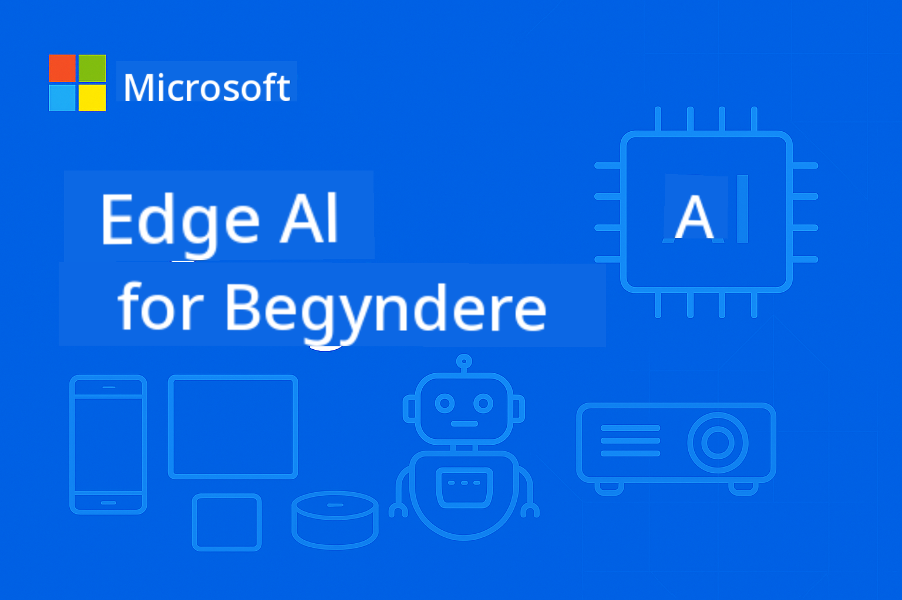

<!--
CO_OP_TRANSLATOR_METADATA:
{
  "original_hash": "22c6dae04591abc5f0d80f944ed663d5",
  "translation_date": "2025-09-26T10:36:12+00:00",
  "source_file": "introduction.md",
  "language_code": "da"
}
-->
# Introduktion til Edge AI for Begyndere



Velkommen til din rejse ind i **Edge Artificial Intelligence** – en revolutionerende tilgang, der bringer AI's kraft direkte til der, hvor data skabes, og beslutninger skal træffes. Denne introduktion vil give dig fundamentet for at forstå, hvorfor Edge AI repræsenterer fremtiden for intelligent computing, og hvordan du kan mestre dens implementering.

## Hvad er Edge AI?

Edge AI markerer et fundamentalt skift fra traditionel cloud-baseret AI-behandling til **lokal, enhedsbaseret intelligens**. I stedet for at sende data til fjerne servere, behandler Edge AI information direkte på edge-enheder – smartphones, IoT-sensorer, industrielt udstyr, autonome køretøjer og indlejrede systemer.

### Edge AI Paradigmet

```
Traditional AI:     Device → Cloud → Processing → Response → Device
Edge AI:           Device → Local Processing → Immediate Response
```

Dette paradigmeskift eliminerer turen til skyen og muliggør:
- **Øjeblikkelige svar** (sub-millisekund latency)
- **Forbedret privatliv** (data forlader aldrig enheden)
- **Pålidelig drift** (fungerer uden internetforbindelse)
- **Reducerede omkostninger** (minimal båndbredde og cloud-compute brug)

## Hvorfor Edge AI er vigtigt nu

### Den perfekte storm af innovation

Tre teknologiske trends er konvergeret og gjort Edge AI ikke bare muligt, men nødvendigt:

1. **Hardware-revolution**: Moderne chipsets (Apple Silicon, Qualcomm Snapdragon, NVIDIA Jetson) integrerer AI-acceleration i kompakte, energieffektive pakker
2. **Modeloptimering**: Små sprogmodeller (SLMs) som Phi-4, Gemma og Mistral leverer 80-90% af store modellers ydeevne i 10-20% af størrelsen
3. **Reelle behov**: Industrier kræver øjeblikkelig, privat og pålidelig AI, som cloud-løsninger ikke kan levere

### Kritiske forretningsdrivere

**Privatliv & Overholdelse**
- Sundhedssektoren: Patientdata skal forblive lokalt (HIPAA-overholdelse)
- Finans: Transaktionsbehandling kræver datasuverænitet
- Produktion: Proprietære processer skal beskyttes mod eksponering

**Ydeevnekrav**
- Autonome køretøjer: Livskritiske beslutninger på millisekunder
- Industriel automatisering: Real-time kvalitetskontrol og sikkerhedsovervågning
- Gaming & AR/VR: Immersive oplevelser kræver nul mærkbar latency

**Økonomisk effektivitet**
- Telekommunikation: Lokal behandling af millioner af IoT-sensoraflæsninger
- Detailhandel: Analyse i butikken uden massive båndbreddeomkostninger
- Smarte byer: Distribueret intelligens på tværs af tusindvis af enheder

## Industrier transformeret af Edge AI

### 🏭 **Produktion & Industri 4.0**
- **Forudsigende vedligeholdelse**: AI-modeller på industrielt udstyr forudsiger fejl, før de opstår
- **Kvalitetskontrol**: Real-time detektion af defekter på produktionslinjer
- **Sikkerhedsovervågning**: Øjeblikkelig detektion og respons på farer
- **Forsyningskæde**: Intelligent lagerstyring på alle niveauer

**Reel effekt**: Siemens bruger Edge AI til forudsigende vedligeholdelse, hvilket reducerer nedetid med 30-50% og vedligeholdelsesomkostninger med 25%.

### 🏥 **Sundhedssektoren & Medicinsk udstyr**
- **Diagnostisk billedbehandling**: AI-drevet analyse af røntgen og MR-scanninger på behandlingsstedet
- **Patientovervågning**: Kontinuerlig sundhedsvurdering via wearable-enheder
- **Kirurgisk assistance**: Real-time vejledning under procedurer
- **Lægemiddeludvikling**: Lokal behandling af molekylære simuleringer

**Reel effekt**: Philips' Edge AI-løsninger gør det muligt for radiologer at diagnosticere tilstande 40% hurtigere med 99% nøjagtighed.

### 🚗 **Autonome systemer & transport**
- **Selvkørende køretøjer**: Splitsekund beslutningstagning for navigation og sikkerhed
- **Trafikstyring**: Intelligent kontrol af kryds og optimering af trafikflow
- **Flådestyring**: Real-time ruteoptimering og overvågning af køretøjers tilstand
- **Logistik**: Autonome lagerrobotter og leveringssystemer

**Reel effekt**: Teslas Full Self-Driving system behandler sensordata lokalt og træffer 40+ beslutninger pr. sekund for sikker autonom navigation.

### 🏙️ **Smarte byer & infrastruktur**
- **Offentlig sikkerhed**: Real-time trusselsdetektion og nødrespons
- **Energistyring**: Optimering af smart grids og integration af vedvarende energi
- **Miljøovervågning**: Luftkvalitet, støjforurening og klimatracking
- **Byplanlægning**: Analyse af trafikflow og optimering af infrastruktur

**Reel effekt**: Singapores smart city-initiativ bruger 100.000+ Edge AI-sensorer til trafikstyring, hvilket reducerer pendlingstider med 25%.

### 📱 **Forbrugerteknologi & mobil**
- **Smartphone AI**: Forbedret fotografering, stemmeassistenter og personalisering
- **Smarte hjem**: Intelligent automatisering og sikkerhedssystemer
- **Wearable-enheder**: Sundhedsovervågning og fitnessoptimering
- **Gaming**: Real-time grafisk forbedring og gameplayoptimering

**Reel effekt**: Apples Neural Engine behandler 15,8 billioner operationer pr. sekund lokalt, hvilket muliggør funktioner som real-time sprogoversættelse og computational fotografering.

## Små sprogmodeller: Motoren bag Edge AI

### Hvad er små sprogmodeller (SLMs)?

SLMs er **komprimerede, optimerede versioner** af store sprogmodeller, specifikt designet til edge-implementering:

- **Phi-4**: 14B parametre, optimeret til ræsonnement og kodegenerering
- **Gemma 2B/7B**: Googles effektive modeller til diverse NLP-opgaver
- **Mistral-7B**: Højtydende model med kommercielt venlig licens
- **Qwen-serien**: Alibabas flersprogede modeller optimeret til mobil implementering

### Fordelene ved SLMs

| Funktion | Store sprogmodeller | Små sprogmodeller |
|----------|----------------------|-------------------|
| **Størrelse** | 70B-405B parametre | 1B-14B parametre |
| **Hukommelse** | 40-200GB RAM | 2-16GB RAM |
| **Inference-hastighed** | 2-10 sekunder | 50-500ms |
| **Implementering** | High-end servere | Smartphones, indlejrede enheder |
| **Omkostninger** | $1000s/måned | Engangshardwareomkostning |
| **Privatliv** | Data sendt til skyen | Behandling forbliver lokal |

### Ydeevne i praksis

Moderne SLMs opnår bemærkelsesværdige evner:
- **90% af GPT-3.5's ydeevne** i mange opgaver
- **Real-time samtale** kapaciteter
- **Kodegenerering og debugging**
- **Flersproget oversættelse**
- **Dokumentanalyse og opsummering**

## Læringsmål

Ved at gennemføre EdgeAI for Begyndere-kurset vil du:

### 🎯 **Grundlæggende viden**
- Forstå de tekniske og forretningsmæssige drivere bag Edge AI-adoption
- Sammenligne edge- og cloud-AI-arkitekturer og deres passende anvendelsesområder
- Identificere egenskaberne og kapaciteterne ved forskellige SLM-familier
- Analysere hardwarekravene til Edge AI-implementering

### 🛠️ **Tekniske færdigheder**
- Implementere SLMs på forskellige platforme (Windows, mobil, indlejret, cloud-edge hybrid)
- Optimere modeller til edge-begrænsninger ved hjælp af kvantisering, beskæring og komprimering
- Implementere produktionsklare Edge AI-applikationer med overvågning og skalering
- Bygge multi-agent systemer og funktion-kald frameworks til komplekse arbejdsgange

### 🏗️ **Praktisk implementering**
- Skabe chat-applikationer med lokal modelskift og samtalestyring
- Udvikle RAG (Retrieval-Augmented Generation) systemer med lokal dokumentbehandling
- Bygge model-routere, der intelligent vælger mellem specialiserede AI-modeller
- Designe API-frameworks med streaming, sundhedsovervågning og fejlhåndtering

### 🚀 **Produktionsimplementering**
- Etablere SLMOps-pipelines til modelversionering, test og implementering
- Implementere sikkerhedsbedste praksis for Edge AI-applikationer
- Designe skalerbare arkitekturer, der balancerer edge- og cloud-behandling
- Skabe overvågnings- og vedligeholdelsesstrategier for produktionsklare Edge AI-systemer

## Læringsresultater

Efter kursets afslutning vil du være i stand til:

### **Teknisk ekspertise**
✅ **Implementere produktionsklare Edge AI-løsninger** på tværs af Windows, mobil og indlejrede platforme  
✅ **Optimere AI-modeller til edge-begrænsninger** med 75% størrelsesreduktion og 85% ydeevnebevaring  
✅ **Bygge intelligente agentsystemer** med funktion-kald og multi-model orkestrering  
✅ **Skabe skalerbare edge-cloud hybridarkitekturer** til virksomhedsapplikationer  

### **Industrielle anvendelser**
✅ **Designe produktionsløsninger** til forudsigende vedligeholdelse og kvalitetskontrol  
✅ **Udvikle sundhedsapplikationer** med privatlivskompatibel patientdatabehandling  
✅ **Bygge bilsystemer** til real-time beslutningstagning og sikkerhed  
✅ **Skabe smart city-infrastruktur** til trafik, sikkerhed og miljøovervågning  

### **Karriereudvikling**
✅ **EdgeAI Solutions Architect**: Design omfattende Edge AI-strategier  
✅ **ML Engineer (Edge Specialization)**: Optimere og implementere modeller til edge-miljøer  
✅ **IoT AI Developer**: Skabe intelligente IoT-systemer med lokal behandling  
✅ **Mobile AI Developer**: Bygge AI-drevne mobilapplikationer med lokal inference  

## Kursusstruktur

Dette kursus følger en **progressiv mestringstilgang**:

### **Fase 1: Fundament** (Moduler 01-02)
Opbyg konceptuel forståelse og udforsk modelfamilier

### **Fase 2: Implementering** (Moduler 03-04) 
Mestre implementerings- og optimeringsteknikker

### **Fase 3: Produktion** (Moduler 05-06)
Lær SLMOps og avancerede agent-frameworks

### **Fase 4: Specialisering** (Moduler 07-08)
Platform-specifik implementering og omfattende eksempler

## Succeskriterier

Følg din fremgang med disse konkrete resultater:

- **Porteføljeprojekter**: 10+ produktionsklare applikationer på tværs af flere industrier
- **Ydeevne benchmarks**: Modeller, der kører med <500ms inference-tid på edge-enheder
- **Implementeringsmål**: Applikationer, der kører på Windows, mobil og indlejrede platforme
- **Virksomhedsparathed**: Løsninger med overvågnings-, skalerings- og sikkerhedsframeworks

## Kom godt i gang

Klar til at transformere din forståelse af AI-implementering? Din rejse begynder med **[Module 01: EdgeAI Fundamentals](./Module01/README.md)**, hvor du vil udforske de tekniske fundamenter, der gør Edge AI muligt, og undersøge virkelige case-studier fra industriledere.

**Næste skridt**: [📚 Module 01 - EdgeAI Fundamentals →](./Module01/README.md)

---

**Fremtiden for AI er lokal, øjeblikkelig og privat. Mestre Edge AI for at bygge næste generation af intelligente applikationer.**

---

