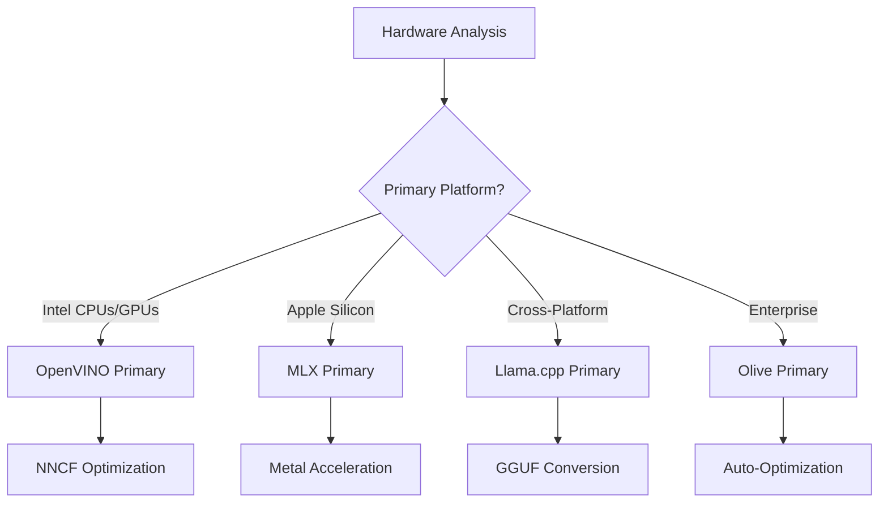
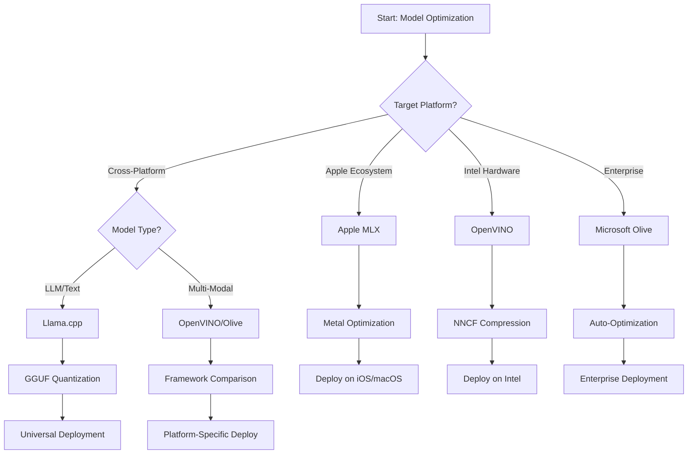
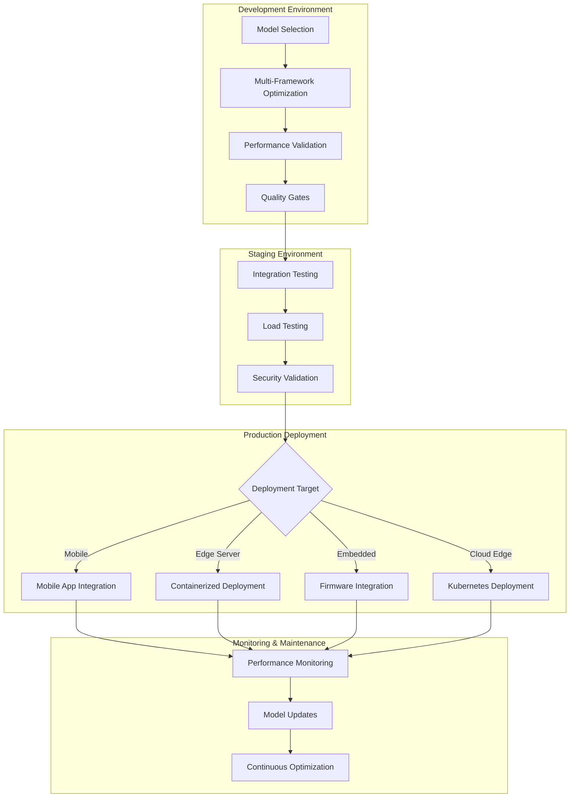

<!--
CO_OP_TRANSLATOR_METADATA:
{
  "original_hash": "6719c4a7e44b948230ac5f5cab3699bd",
  "translation_date": "2025-09-17T13:27:29+00:00",
  "source_file": "Module04/06.workflow-synthesis.md",
  "language_code": "de"
}
-->
# Abschnitt 6: Synthese des Entwicklungsworkflows für Edge AI

## Inhaltsverzeichnis
1. [Einleitung](../../../Module04)
2. [Lernziele](../../../Module04)
3. [Überblick über den einheitlichen Workflow](../../../Module04)
4. [Matrix zur Auswahl des Frameworks](../../../Module04)
5. [Synthese bewährter Praktiken](../../../Module04)
6. [Leitfaden für die Einsatzstrategie](../../../Module04)
7. [Workflow zur Leistungsoptimierung](../../../Module04)
8. [Checkliste für Produktionsbereitschaft](../../../Module04)
9. [Fehlerbehebung und Überwachung](../../../Module04)
10. [Zukunftssicherung Ihrer Edge-AI-Pipeline](../../../Module04)

## Einleitung

Die Entwicklung von Edge AI erfordert ein fundiertes Verständnis für verschiedene Optimierungsframeworks, Einsatzstrategien und Hardwareanforderungen. Diese umfassende Synthese vereint das Wissen aus Llama.cpp, Microsoft Olive, OpenVINO und Apple MLX, um einen einheitlichen Workflow zu schaffen, der Effizienz maximiert, Qualität sicherstellt und eine erfolgreiche Produktionsbereitstellung ermöglicht.

Im Verlauf dieses Kurses haben wir einzelne Optimierungsframeworks untersucht, die jeweils einzigartige Stärken und spezialisierte Anwendungsfälle bieten. In der Praxis erfordern Edge-AI-Projekte jedoch häufig die Kombination von Techniken aus mehreren Frameworks oder strategische Entscheidungen darüber, welcher Ansatz die besten Ergebnisse für spezifische Einschränkungen und Anforderungen liefert.

Dieser Abschnitt fasst das gesammelte Wissen aller Frameworks in umsetzbare Workflows, Entscheidungsbäume und bewährte Praktiken zusammen, die es Ihnen ermöglichen, produktionsreife Edge-AI-Lösungen effizient und effektiv zu entwickeln. Egal, ob Sie für mobile Geräte, eingebettete Systeme oder Edge-Server optimieren, dieser Leitfaden bietet den strategischen Rahmen für fundierte Entscheidungen während des gesamten Entwicklungszyklus.

## Lernziele

Am Ende dieses Abschnitts werden Sie in der Lage sein:

### Strategische Entscheidungsfindung
- **Bewerten und auswählen** des optimalen Optimierungsframeworks basierend auf Projektanforderungen, Hardwareeinschränkungen und Einsatzszenarien
- **Umfassende Workflows entwerfen**, die mehrere Optimierungstechniken für maximale Effizienz integrieren
- **Abwägungen bewerten** zwischen Modellgenauigkeit, Inferenzgeschwindigkeit, Speicherverbrauch und Einsatzkomplexität über verschiedene Frameworks hinweg

### Workflow-Integration
- **Einheitliche Entwicklungs-Pipelines implementieren**, die die Stärken mehrerer Optimierungsframeworks nutzen
- **Reproduzierbare Workflows erstellen** für konsistente Modelloptimierung und Bereitstellung in verschiedenen Umgebungen
- **Qualitätskontrollen und Validierungsprozesse etablieren**, um sicherzustellen, dass optimierte Modelle die Produktionsanforderungen erfüllen

### Leistungsoptimierung
- **Systematische Optimierungsstrategien anwenden** wie Quantisierung, Pruning und hardware-spezifische Beschleunigungstechniken
- **Modellleistung überwachen und benchmarken** über verschiedene Optimierungsstufen und Einsatzziele hinweg
- **Für spezifische Hardwareplattformen optimieren**, einschließlich CPU, GPU, NPU und spezialisierter Edge-Beschleuniger

### Produktionsbereitstellung
- **Skalierbare Einsatzarchitekturen entwerfen**, die mehrere Modellformate und Inferenz-Engines unterstützen
- **Überwachung und Beobachtbarkeit implementieren** für Edge-AI-Anwendungen in Produktionsumgebungen
- **Wartungs-Workflows etablieren** für Modellaktualisierungen, Leistungsüberwachung und Systemoptimierung

### Plattformübergreifende Exzellenz
- **Optimierte Modelle bereitstellen** auf verschiedenen Hardwareplattformen bei gleichbleibender Leistung
- **Plattform-spezifische Optimierungen handhaben** für Windows, macOS, Linux, mobile und eingebettete Systeme
- **Abstraktionsschichten erstellen**, die eine nahtlose Bereitstellung in verschiedenen Edge-Umgebungen ermöglichen

## Überblick über den einheitlichen Workflow

### Phase 1: Anforderungsanalyse und Framework-Auswahl

Die Grundlage für eine erfolgreiche Edge-AI-Bereitstellung beginnt mit einer gründlichen Anforderungsanalyse, die die Auswahl des Frameworks und die Optimierungsstrategie informiert.

#### 1.1 Hardwarebewertung


**Wichtige Überlegungen:**
- **CPU-Architektur**: x86, ARM, Apple Silicon-Fähigkeiten
- **Verfügbarkeit von Beschleunigern**: GPU, NPU, VPU, spezialisierte KI-Chips
- **Speicherbeschränkungen**: RAM-Limits, Speicherkapazität
- **Energieverbrauch**: Batterielaufzeit, thermische Einschränkungen
- **Konnektivität**: Offline-Anforderungen, Bandbreitenbeschränkungen

#### 1.2 Matrix der Anwendungsanforderungen

| Anforderung | Llama.cpp | Microsoft Olive | OpenVINO | Apple MLX |
|-------------|-----------|-----------------|----------|-----------|
| Plattformübergreifend | ✅ Hervorragend | ⚡ Gut | ⚡ Gut | ❌ Nur Apple |
| Unternehmensintegration | ⚡ Grundlegend | ✅ Hervorragend | ✅ Hervorragend | ⚡ Eingeschränkt |
| Mobile Bereitstellung | ✅ Hervorragend | ⚡ Gut | ⚡ Gut | ✅ iOS Hervorragend |
| Echtzeit-Inferenz | ✅ Hervorragend | ✅ Hervorragend | ✅ Hervorragend | ✅ Hervorragend |
| Modellvielfalt | ✅ Fokus auf LLM | ✅ Alle Modelle | ✅ Alle Modelle | ✅ Fokus auf LLM |
| Benutzerfreundlichkeit | ✅ Einfach | ✅ Automatisiert | ⚡ Mittel | ✅ Einfach |

### Phase 2: Modellvorbereitung und Optimierung

#### 2.1 Universelle Modellbewertungspipeline

```python
# Universal Model Assessment Framework
class EdgeAIModelAssessment:
    def __init__(self, model_path, target_hardware):
        self.model_path = model_path
        self.target_hardware = target_hardware
        self.optimization_frameworks = []
        
    def assess_model_characteristics(self):
        """Analyze model size, architecture, and complexity"""
        return {
            'model_size': self.get_model_size(),
            'parameter_count': self.get_parameter_count(),
            'architecture_type': self.detect_architecture(),
            'quantization_compatibility': self.check_quantization_support()
        }
    
    def recommend_optimization_strategy(self):
        """Recommend optimal frameworks and techniques"""
        characteristics = self.assess_model_characteristics()
        
        if self.target_hardware.startswith('apple'):
            return self.mlx_optimization_strategy(characteristics)
        elif self.target_hardware.startswith('intel'):
            return self.openvino_optimization_strategy(characteristics)
        elif characteristics['model_size'] > 7_000_000_000:  # 7B+ parameters
            return self.enterprise_optimization_strategy(characteristics)
        else:
            return self.lightweight_optimization_strategy(characteristics)
```

#### 2.2 Multi-Framework-Optimierungspipeline

**Ansatz der sequenziellen Optimierung:**
1. **Erste Konvertierung**: In ein Zwischenformat konvertieren (wenn möglich ONNX)
2. **Framework-spezifische Optimierung**: Spezialisierte Techniken anwenden
3. **Cross-Validierung**: Leistung auf Zielplattformen überprüfen
4. **Endverpackung**: Für die Bereitstellung vorbereiten

```bash
# Multi-Framework Optimization Script
#!/bin/bash

MODEL_NAME="phi-3-mini"
BASE_MODEL="microsoft/Phi-3-mini-4k-instruct"

# Phase 1: ONNX Conversion (Universal)
python convert_to_onnx.py --model $BASE_MODEL --output models/onnx/

# Phase 2: Platform-Specific Optimization
if [[ "$TARGET_PLATFORM" == "intel" ]]; then
    # OpenVINO Optimization
    python optimize_openvino.py --input models/onnx/ --output models/openvino/
elif [[ "$TARGET_PLATFORM" == "apple" ]]; then
    # MLX Optimization
    python optimize_mlx.py --input $BASE_MODEL --output models/mlx/
elif [[ "$TARGET_PLATFORM" == "cross" ]]; then
    # Llama.cpp Optimization
    python convert_to_gguf.py --input models/onnx/ --output models/gguf/
fi

# Phase 3: Validation
python validate_optimization.py --original $BASE_MODEL --optimized models/$TARGET_PLATFORM/
```

### Phase 3: Leistungsvalidierung und Benchmarking

#### 3.1 Umfassendes Benchmarking-Framework

```python
class EdgeAIBenchmark:
    def __init__(self, optimized_models):
        self.models = optimized_models
        self.metrics = {
            'inference_time': [],
            'memory_usage': [],
            'accuracy_score': [],
            'throughput': [],
            'energy_consumption': []
        }
    
    def run_comprehensive_benchmark(self):
        """Execute standardized benchmarks across all optimized models"""
        test_inputs = self.generate_test_inputs()
        
        for model_framework, model_path in self.models.items():
            print(f"Benchmarking {model_framework}...")
            
            # Latency Testing
            latency = self.measure_inference_latency(model_path, test_inputs)
            
            # Memory Profiling
            memory = self.profile_memory_usage(model_path)
            
            # Accuracy Validation
            accuracy = self.validate_model_accuracy(model_path, test_inputs)
            
            # Throughput Analysis
            throughput = self.measure_throughput(model_path)
            
            self.record_metrics(model_framework, latency, memory, accuracy, throughput)
    
    def generate_optimization_report(self):
        """Create comprehensive comparison report"""
        report = {
            'recommendations': self.analyze_performance_trade_offs(),
            'deployment_guidance': self.generate_deployment_recommendations(),
            'monitoring_requirements': self.define_monitoring_metrics()
        }
        return report
```

## Matrix zur Auswahl des Frameworks

### Entscheidungsbaum für die Framework-Auswahl



### Umfassende Auswahlkriterien

#### 1. Ausrichtung auf den primären Anwendungsfall

**Große Sprachmodelle (LLMs):**
- **Llama.cpp**: Am besten für CPU-fokussierte, plattformübergreifende Bereitstellung
- **Apple MLX**: Optimal für Apple Silicon mit einheitlichem Speicher
- **OpenVINO**: Hervorragend für Intel-Hardware mit NNCF-Optimierung
- **Microsoft Olive**: Ideal für Unternehmens-Workflows mit Automatisierung

**Multimodale Modelle:**
- **OpenVINO**: Umfassende Unterstützung für Vision, Audio und Text
- **Microsoft Olive**: Unternehmensgerechte Optimierung für komplexe Pipelines
- **Llama.cpp**: Beschränkt auf textbasierte Modelle
- **Apple MLX**: Wachsende Unterstützung für multimodale Anwendungen

#### 2. Hardwareplattform-Matrix

| Plattform | Primäres Framework | Sekundäre Option | Spezialisierte Funktionen |
|----------|------------------|------------------|---------------------|
| Intel CPU/GPU | OpenVINO | Microsoft Olive | NNCF-Kompression, Intel-Optimierung |
| NVIDIA GPU | Microsoft Olive | OpenVINO | CUDA-Beschleunigung, Unternehmensfunktionen |
| Apple Silicon | Apple MLX | Llama.cpp | Metal-Shader, einheitlicher Speicher |
| ARM Mobile | Llama.cpp | OpenVINO | Plattformübergreifend, minimale Abhängigkeiten |
| Edge TPU | OpenVINO | Microsoft Olive | Unterstützung für spezialisierte Beschleuniger |
| Eingebettetes ARM | Llama.cpp | OpenVINO | Minimaler Fußabdruck, effiziente Inferenz |

#### 3. Präferenzen für Entwicklungsworkflows

**Schnelles Prototyping:**
1. **Llama.cpp**: Schnellste Einrichtung, sofortige Ergebnisse
2. **Apple MLX**: Einfache Python-API, schnelle Iteration
3. **Microsoft Olive**: Automatisierte Optimierung, minimale Konfiguration
4. **OpenVINO**: Komplexere Einrichtung, umfassende Funktionen

**Unternehmensproduktion:**
1. **Microsoft Olive**: Unternehmensfunktionen, Azure-Integration
2. **OpenVINO**: Intel-Ökosystem, umfassende Tools
3. **Apple MLX**: Apple-spezifische Unternehmensanwendungen
4. **Llama.cpp**: Einfache Bereitstellung, eingeschränkte Unternehmensfunktionen

## Synthese bewährter Praktiken

### Universelle Optimierungsprinzipien

#### 1. Strategie der progressiven Optimierung

```python
class ProgressiveOptimization:
    def __init__(self, base_model):
        self.base_model = base_model
        self.optimization_stages = [
            'baseline_measurement',
            'format_conversion',
            'quantization_optimization',
            'hardware_acceleration',
            'production_validation'
        ]
    
    def execute_progressive_optimization(self):
        """Apply optimization techniques incrementally"""
        
        # Stage 1: Baseline Measurement
        baseline_metrics = self.measure_baseline_performance()
        
        # Stage 2: Format Conversion
        converted_model = self.convert_to_optimal_format()
        conversion_metrics = self.measure_performance(converted_model)
        
        # Stage 3: Quantization
        quantized_model = self.apply_quantization(converted_model)
        quantization_metrics = self.measure_performance(quantized_model)
        
        # Stage 4: Hardware Acceleration
        accelerated_model = self.enable_hardware_acceleration(quantized_model)
        acceleration_metrics = self.measure_performance(accelerated_model)
        
        # Stage 5: Validation
        production_ready = self.validate_for_production(accelerated_model)
        
        return self.compile_optimization_report(
            baseline_metrics, conversion_metrics, 
            quantization_metrics, acceleration_metrics
        )
```

#### 2. Implementierung von Qualitätskontrollen

**Genauigkeitserhaltende Kontrollen:**
- >95 % der ursprünglichen Modellgenauigkeit beibehalten
- Validierung mit repräsentativen Testdatensätzen
- A/B-Tests für Produktionsvalidierung implementieren

**Leistungsverbessernde Kontrollen:**
- Mindestens 2x Geschwindigkeitsverbesserung erreichen
- Speicherverbrauch um mindestens 50 % reduzieren
- Konsistenz der Inferenzzeit validieren

**Produktionsbereitschaftskontrollen:**
- Belastungstests unter Last bestehen
- Stabile Leistung über Zeit demonstrieren
- Sicherheits- und Datenschutzanforderungen validieren

### Integration bewährter Praktiken für spezifische Frameworks

#### 1. Synthese der Quantisierungsstrategie

```python
# Unified Quantization Approach
class UnifiedQuantizationStrategy:
    def __init__(self, model, target_platform):
        self.model = model
        self.platform = target_platform
        
    def select_optimal_quantization(self):
        """Choose best quantization based on platform and requirements"""
        
        if self.platform == 'apple_silicon':
            return self.mlx_quantization_strategy()
        elif self.platform == 'intel_hardware':
            return self.openvino_quantization_strategy()
        elif self.platform == 'cross_platform':
            return self.llamacpp_quantization_strategy()
        else:
            return self.olive_quantization_strategy()
    
    def mlx_quantization_strategy(self):
        """Apple MLX-specific quantization"""
        return {
            'method': 'mlx_quantize',
            'precision': 'int4',
            'group_size': 64,
            'optimization_target': 'unified_memory'
        }
    
    def openvino_quantization_strategy(self):
        """OpenVINO NNCF quantization"""
        return {
            'method': 'nncf_quantize',
            'precision': 'int8',
            'calibration_method': 'post_training',
            'optimization_target': 'intel_hardware'
        }
```

#### 2. Optimierung der Hardwarebeschleunigung

**Synthese der CPU-Optimierung:**
- **SIMD-Anweisungen**: Optimierte Kernel über Frameworks hinweg nutzen
- **Speicherbandbreite**: Datenlayouts für Cache-Effizienz optimieren
- **Threading**: Parallelität mit Ressourceneinschränkungen ausbalancieren

**Bewährte Praktiken für GPU-Beschleunigung:**
- **Batch-Verarbeitung**: Durchsatz mit geeigneten Batch-Größen maximieren
- **Speicherverwaltung**: GPU-Speicherzuweisung und -übertragungen optimieren
- **Präzision**: FP16 verwenden, wenn unterstützt, für bessere Leistung

**Optimierung für NPU/spezialisierte Beschleuniger:**
- **Modellarchitektur**: Kompatibilität mit Beschleunigerfähigkeiten sicherstellen
- **Datenfluss**: Eingabe-/Ausgabepipelines für Beschleunigereffizienz optimieren
- **Fallback-Strategien**: CPU-Fallback für nicht unterstützte Operationen implementieren

## Leitfaden für die Einsatzstrategie

### Universelle Einsatzarchitektur



### Plattform-spezifische Einsatzmuster

#### 1. Strategie für mobile Bereitstellung

```yaml
# Mobile Deployment Configuration
mobile_deployment:
  ios:
    framework: apple_mlx
    optimization:
      quantization: int4
      memory_mapping: true
      background_execution: limited
    packaging:
      format: mlx
      bundle_size: <50MB
      
  android:
    framework: llama_cpp
    optimization:
      quantization: q4_k_m
      threading: android_optimized
      memory_management: conservative
    packaging:
      format: gguf
      apk_size: <100MB
      
  cross_platform:
    framework: onnx_runtime
    optimization:
      quantization: int8
      execution_provider: cpu
    packaging:
      format: onnx
      shared_libraries: minimal
```

#### 2. Edge-Server-Bereitstellung

```yaml
# Edge Server Deployment Configuration
edge_server:
  intel_based:
    framework: openvino
    optimization:
      quantization: int8
      acceleration: cpu_gpu_auto
      batch_processing: dynamic
    deployment:
      container: openvino_runtime
      orchestration: kubernetes
      scaling: horizontal
      
  nvidia_based:
    framework: microsoft_olive
    optimization:
      quantization: int4
      acceleration: cuda
      tensor_parallelism: true
    deployment:
      container: nvidia_triton
      orchestration: kubernetes
      scaling: gpu_aware
```

### Best Practices für Containerisierung

```dockerfile
# Multi-Framework Edge AI Container
FROM ubuntu:22.04 as base

# Install common dependencies
RUN apt-get update && apt-get install -y \
    python3 \
    python3-pip \
    build-essential \
    cmake \
    && rm -rf /var/lib/apt/lists/*

# Framework-specific stages
FROM base as openvino
RUN pip install openvino nncf optimum[intel]

FROM base as llamacpp
RUN git clone https://github.com/ggerganov/llama.cpp.git \
    && cd llama.cpp && make LLAMA_OPENBLAS=1

FROM base as olive
RUN pip install olive-ai[auto-opt] onnxruntime-genai

# Production stage with selected framework
FROM openvino as production
COPY models/ /app/models/
COPY src/ /app/src/
WORKDIR /app

EXPOSE 8080
CMD ["python3", "src/inference_server.py"]
```

## Workflow zur Leistungsoptimierung

### Systematische Leistungsabstimmung

#### 1. Pipeline zur Leistungsprofilierung

```python
class EdgeAIPerformanceProfiler:
    def __init__(self, model_path, framework):
        self.model_path = model_path
        self.framework = framework
        self.profiling_results = {}
    
    def comprehensive_profiling(self):
        """Execute comprehensive performance analysis"""
        
        # CPU Profiling
        cpu_profile = self.profile_cpu_usage()
        
        # Memory Profiling
        memory_profile = self.profile_memory_usage()
        
        # Inference Latency
        latency_profile = self.profile_inference_latency()
        
        # Throughput Analysis
        throughput_profile = self.profile_throughput()
        
        # Energy Consumption (where available)
        energy_profile = self.profile_energy_consumption()
        
        return self.compile_performance_report(
            cpu_profile, memory_profile, latency_profile,
            throughput_profile, energy_profile
        )
    
    def identify_bottlenecks(self):
        """Automatically identify performance bottlenecks"""
        bottlenecks = []
        
        if self.profiling_results['cpu_utilization'] > 80:
            bottlenecks.append('cpu_bound')
        
        if self.profiling_results['memory_usage'] > 90:
            bottlenecks.append('memory_bound')
        
        if self.profiling_results['inference_variance'] > 20:
            bottlenecks.append('inconsistent_performance')
        
        return self.generate_optimization_recommendations(bottlenecks)
```

#### 2. Automatisierte Optimierungspipeline

```python
class AutomatedOptimizationPipeline:
    def __init__(self, base_model, target_constraints):
        self.base_model = base_model
        self.constraints = target_constraints
        self.optimization_history = []
    
    def execute_optimization_search(self):
        """Systematically search optimization space"""
        
        optimization_candidates = [
            {'quantization': 'int8', 'pruning': 0.1},
            {'quantization': 'int4', 'pruning': 0.2},
            {'quantization': 'int8', 'acceleration': 'gpu'},
            {'quantization': 'int4', 'acceleration': 'npu'}
        ]
        
        best_configuration = None
        best_score = 0
        
        for config in optimization_candidates:
            optimized_model = self.apply_optimization(config)
            score = self.evaluate_optimization(optimized_model)
            
            if score > best_score and self.meets_constraints(optimized_model):
                best_score = score
                best_configuration = config
            
            self.optimization_history.append({
                'config': config,
                'score': score,
                'model': optimized_model
            })
        
        return best_configuration, self.optimization_history
```

### Multi-Objective-Optimierung

#### 1. Pareto-Optimierung für Edge AI

```python
class ParetoOptimization:
    def __init__(self, objectives=['speed', 'accuracy', 'memory']):
        self.objectives = objectives
        self.pareto_frontier = []
    
    def find_pareto_optimal_solutions(self, optimization_results):
        """Identify Pareto-optimal configurations"""
        
        for result in optimization_results:
            is_dominated = False
            
            for frontier_point in self.pareto_frontier:
                if self.dominates(frontier_point, result):
                    is_dominated = True
                    break
            
            if not is_dominated:
                # Remove dominated points from frontier
                self.pareto_frontier = [
                    point for point in self.pareto_frontier 
                    if not self.dominates(result, point)
                ]
                
                self.pareto_frontier.append(result)
        
        return self.pareto_frontier
    
    def recommend_configuration(self, user_preferences):
        """Recommend configuration based on user preferences"""
        
        weighted_scores = []
        for config in self.pareto_frontier:
            score = sum(
                user_preferences[obj] * config['metrics'][obj] 
                for obj in self.objectives
            )
            weighted_scores.append((score, config))
        
        return max(weighted_scores, key=lambda x: x[0])[1]
```

## Checkliste für Produktionsbereitschaft

### Umfassende Produktionsvalidierung

#### 1. Qualitätssicherung des Modells

```python
class ProductionReadinessValidator:
    def __init__(self, optimized_model, production_requirements):
        self.model = optimized_model
        self.requirements = production_requirements
        self.validation_results = {}
    
    def validate_model_quality(self):
        """Comprehensive model quality validation"""
        
        # Accuracy Validation
        accuracy_result = self.validate_accuracy()
        
        # Performance Validation
        performance_result = self.validate_performance()
        
        # Robustness Testing
        robustness_result = self.validate_robustness()
        
        # Security Assessment
        security_result = self.validate_security()
        
        # Compliance Verification
        compliance_result = self.validate_compliance()
        
        return self.compile_validation_report(
            accuracy_result, performance_result, robustness_result,
            security_result, compliance_result
        )
    
    def generate_certification_report(self):
        """Generate production certification report"""
        return {
            'model_signature': self.generate_model_signature(),
            'validation_timestamp': datetime.now(),
            'validation_results': self.validation_results,
            'deployment_approval': self.check_deployment_approval(),
            'monitoring_requirements': self.define_monitoring_requirements()
        }
```

#### 2. Checkliste für Produktionsbereitstellung

**Validierung vor der Bereitstellung:**
- [ ] Modellgenauigkeit erfüllt Mindestanforderungen (>95 % des Ausgangswerts)
- [ ] Leistungsziele erreicht (Latenz, Durchsatz, Speicher)
- [ ] Sicherheitslücken bewertet und behoben
- [ ] Belastungstests unter erwarteter Last abgeschlossen
- [ ] Fehler-Szenarien getestet und Wiederherstellungsverfahren validiert
- [ ] Überwachungs- und Alarmsysteme konfiguriert
- [ ] Rollback-Verfahren getestet und dokumentiert

**Bereitstellungsprozess:**
- [ ] Blue-Green-Bereitstellungsstrategie implementiert
- [ ] Stufenweise Traffic-Erhöhung konfiguriert
- [ ] Echtzeit-Überwachungs-Dashboards aktiv
- [ ] Leistungs-Baselines etabliert
- [ ] Fehlerratenschwellen definiert
- [ ] Automatisierte Rollback-Auslöser konfiguriert

**Überwachung nach der Bereitstellung:**
- [ ] Modell-Drift-Erkennung aktiv
- [ ] Leistungsverschlechterungswarnungen konfiguriert
- [ ] Ressourcenüberwachung aktiviert
- [ ] Benutzererfahrungsmetriken verfolgt
- [ ] Modellversionierung und -herkunft gepflegt
- [ ] Regelmäßige Modellleistungsüberprüfungen geplant

### Kontinuierliche Integration/Kontinuierliche Bereitstellung (CI/CD)

```yaml
# Edge AI CI/CD Pipeline Configuration
edge_ai_pipeline:
  stages:
    - model_validation
    - optimization
    - testing
    - staging_deployment
    - production_deployment
    - monitoring
  
  model_validation:
    accuracy_threshold: 0.95
    performance_baseline: required
    security_scan: enabled
    
  optimization:
    frameworks:
      - llama_cpp
      - openvino
      - microsoft_olive
    validation:
      cross_validation: enabled
      performance_comparison: required
      
  testing:
    unit_tests: comprehensive
    integration_tests: full_pipeline
    load_tests: production_scale
    security_tests: comprehensive
    
  deployment:
    strategy: blue_green
    traffic_ramping: gradual
    rollback: automatic
    monitoring: real_time
```

## Fehlerbehebung und Überwachung

### Universeller Fehlerbehebungsrahmen

#### 1. Häufige Probleme und Lösungen

**Leistungsprobleme:**
```python
class PerformanceTroubleshooter:
    def __init__(self, model_metrics):
        self.metrics = model_metrics
        
    def diagnose_performance_issues(self):
        """Systematic performance issue diagnosis"""
        
        issues = []
        
        # High latency diagnosis
        if self.metrics['avg_latency'] > self.metrics['target_latency']:
            issues.append(self.diagnose_latency_issues())
        
        # Memory usage diagnosis
        if self.metrics['memory_usage'] > self.metrics['memory_limit']:
            issues.append(self.diagnose_memory_issues())
        
        # Throughput diagnosis
        if self.metrics['throughput'] < self.metrics['target_throughput']:
            issues.append(self.diagnose_throughput_issues())
        
        return self.generate_resolution_plan(issues)
    
    def diagnose_latency_issues(self):
        """Specific latency troubleshooting"""
        potential_causes = []
        
        if self.metrics['cpu_utilization'] > 80:
            potential_causes.append('cpu_bottleneck')
        
        if self.metrics['memory_bandwidth'] > 90:
            potential_causes.append('memory_bandwidth_limit')
        
        if self.metrics['model_size'] > self.metrics['optimal_size']:
            potential_causes.append('model_too_large')
        
        return {
            'issue': 'high_latency',
            'causes': potential_causes,
            'solutions': self.generate_latency_solutions(potential_causes)
        }
```

**Framework-spezifische Fehlerbehebung:**

| Problem | Llama.cpp | Microsoft Olive | OpenVINO | Apple MLX |
|---------|-----------|-----------------|----------|-----------|
| Speicherprobleme | Kontextlänge reduzieren | Batch-Größe verringern | Caching aktivieren | Speicher-Mapping verwenden |
| Langsame Inferenz | SIMD aktivieren | Quantisierung überprüfen | Threading optimieren | Metal aktivieren |
| Genauigkeitsverlust | Höhere Quantisierung | Mit QAT neu trainieren | Kalibrierung erhöhen | Nach der Quantisierung feinabstimmen |
| Kompatibilität | Modellformat überprüfen | Framework-Version verifizieren | Treiber aktualisieren | macOS-Version überprüfen |

#### 2. Strategie für Produktionsüberwachung

```python
class EdgeAIMonitoring:
    def __init__(self, deployment_config):
        self.config = deployment_config
        self.metrics_collectors = []
        self.alerting_rules = []
    
    def setup_comprehensive_monitoring(self):
        """Configure comprehensive monitoring for Edge AI deployment"""
        
        # Model Performance Monitoring
        self.setup_model_performance_monitoring()
        
        # Infrastructure Monitoring
        self.setup_infrastructure_monitoring()
        
        # Business Metrics Monitoring
        self.setup_business_metrics_monitoring()
        
        # Security Monitoring
        self.setup_security_monitoring()
    
    def setup_model_performance_monitoring(self):
        """Model-specific performance monitoring"""
        metrics = [
            'inference_latency_p50',
            'inference_latency_p95',
            'inference_latency_p99',
            'model_accuracy_drift',
            'prediction_confidence_distribution',
            'error_rate',
            'throughput_requests_per_second'
        ]
        
        for metric in metrics:
            self.add_metric_collector(metric)
            self.add_alerting_rule(metric)
    
    def detect_model_drift(self):
        """Automated model drift detection"""
        drift_indicators = [
            self.statistical_drift_detection(),
            self.performance_drift_detection(),
            self.data_distribution_shift_detection()
        ]
        
        return self.aggregate_drift_signals(drift_indicators)
```

### Automatisierte Problemlösung

```python
class AutomatedIssueResolution:
    def __init__(self, monitoring_system):
        self.monitoring = monitoring_system
        self.resolution_strategies = {}
    
    def handle_performance_degradation(self, alert):
        """Automated performance issue resolution"""
        
        if alert['type'] == 'high_latency':
            return self.resolve_latency_issue(alert)
        elif alert['type'] == 'high_memory_usage':
            return self.resolve_memory_issue(alert)
        elif alert['type'] == 'accuracy_drift':
            return self.resolve_accuracy_issue(alert)
        
    def resolve_latency_issue(self, alert):
        """Automated latency issue resolution"""
        resolution_steps = [
            'increase_cpu_allocation',
            'enable_model_caching',
            'reduce_batch_size',
            'switch_to_quantized_model'
        ]
        
        for step in resolution_steps:
            if self.apply_resolution_step(step):
                return f"Resolved latency issue with: {step}"
        
        return "Escalating to human operator"
```

## Zukunftssicherung Ihrer Edge-AI-Pipeline

### Integration neuer Technologien

#### 1. Unterstützung für nächste Generation von Hardware

```python
class FutureHardwareIntegration:
    def __init__(self):
        self.supported_accelerators = [
            'npu_next_gen',
            'quantum_processors',
            'neuromorphic_chips',
            'optical_processors'
        ]
    
    def design_adaptive_pipeline(self):
        """Create hardware-agnostic optimization pipeline"""
        
        pipeline = {
            'model_preparation': self.universal_model_preparation(),
            'hardware_detection': self.dynamic_hardware_detection(),
            'optimization_selection': self.adaptive_optimization_selection(),
            'performance_validation': self.hardware_agnostic_validation()
        }
        
        return pipeline
    
    def adaptive_optimization_selection(self):
        """Dynamically select optimization based on available hardware"""
        
        def optimize_for_hardware(model, available_hardware):
            if 'npu' in available_hardware:
                return self.npu_optimization(model)
            elif 'quantum' in available_hardware:
                return self.quantum_optimization(model)
            elif 'neuromorphic' in available_hardware:
                return self.neuromorphic_optimization(model)
            else:
                return self.fallback_optimization(model)
        
        return optimize_for_hardware
```

#### 2. Weiterentwicklung der Modellarchitektur

**Unterstützung für neue Architekturen:**
- **Mixture of Experts (MoE)**: Sparse-Modellarchitekturen für Effizienz
- **Retrieval-Augmented Generation**: Hybride Modell- + Wissensbasis-Systeme
- **Multimodale Modelle**: Integration von Vision + Sprache + Audio
- **Federated Learning**: Verteiltes Training und Optimierung

```python
class NextGenModelSupport:
    def __init__(self):
        self.architecture_handlers = {
            'moe': self.handle_mixture_of_experts,
            'rag': self.handle_retrieval_augmented,
            'multimodal': self.handle_multimodal,
            'federated': self.handle_federated_learning
        }
    
    def handle_mixture_of_experts(self, model):
        """Optimize Mixture of Experts models for edge deployment"""
        optimization_strategy = {
            'expert_pruning': True,
            'routing_optimization': True,
            'expert_quantization': 'per_expert',
            'load_balancing': 'dynamic'
        }
        return self.apply_moe_optimization(model, optimization_strategy)
```

### Kontinuierliches Lernen und Anpassung

#### 1. Integration von Online-Lernen

```python
class EdgeOnlineLearning:
    def __init__(self, base_model, learning_rate=0.001):
        self.base_model = base_model
        self.learning_rate = learning_rate
        self.adaptation_buffer = []
    
    def continuous_adaptation(self, new_data, feedback):
        """Continuously adapt model based on edge data"""
        
        # Privacy-preserving local adaptation
        local_updates = self.compute_local_gradients(new_data, feedback)
        
        # Apply updates with constraints
        adapted_model = self.apply_constrained_updates(
            self.base_model, local_updates
        )
        
        # Validate adaptation quality
        if self.validate_adaptation(adapted_model):
            self.base_model = adapted_model
            return True
        
        return False
    
    def federated_learning_participation(self):
        """Participate in federated learning while preserving privacy"""
        
        # Compute local model updates
        local_updates = self.compute_private_updates()
        
        # Differential privacy protection
        private_updates = self.apply_differential_privacy(local_updates)
        
        # Share with federated learning coordinator
        return self.share_updates(private_updates)
```

#### 2. Nachhaltigkeit und Green AI

```python
class GreenEdgeAI:
    def __init__(self, sustainability_targets):
        self.targets = sustainability_targets
        self.energy_monitor = EnergyMonitor()
    
    def optimize_for_sustainability(self, model):
        """Optimize model for minimal environmental impact"""
        
        optimization_objectives = [
            'minimize_energy_consumption',
            'maximize_hardware_utilization',
            'reduce_model_training_cost',
            'extend_device_lifetime'
        ]
        
        return self.multi_objective_green_optimization(
            model, optimization_objectives
        )
    
    def carbon_aware_deployment(self):
        """Deploy models considering carbon footprint"""
        
        deployment_strategy = {
            'prefer_renewable_energy_regions': True,
            'optimize_for_energy_efficiency': True,
            'minimize_data_transfer': True,
            'lifecycle_carbon_accounting': True
        }
        
        return deployment_strategy
```

## Fazit

Diese umfassende Workflowsynthese stellt die Essenz des Wissens zur Edge-AI-Optimierung dar und vereint die besten Praktiken aller wichtigen Optimierungsframeworks in einem einheitlichen, produktionsreifen Ansatz. Durch die Befolgung dieser Richtlinien können Sie:

**Optimale Leistung erreichen**: Durch systematische Framework-Auswahl, progressive Optimierung und umfassende Validierung, um sicherzustellen, dass Ihre Edge-AI-Anwendungen maximale Effizienz liefern.

**Produktionsbereitschaft sicherstellen**: Mit gründlichen Tests, Überwachung und Qualitätskontrollen, die eine zuverlässige Bereitstellung und den Betrieb in realen Umgebungen garantieren.

**Langfristigen Erfolg sichern**: Durch kontinuierliche Überwachung, automatisierte Problemlösung und Anpassungsstrategien, die Ihre Edge-AI-Lösungen leistungsfähig und relevant halten.

**Ihre Investition zukunftssicher machen**: Durch die Gestaltung flexibler, hardwareunabhängiger Pipelines, die sich mit neuen Technologien und Anforderungen weiterentwickeln können.

Die Edge-AI-Landschaft entwickelt sich rasant weiter, mit neuen Hardwareplattformen, Optimierungstechniken und Einsatzstrategien, die regelmäßig auftauchen. Diese Synthese bietet die Grundlage, um diese Komplexität zu meistern und robuste, effiziente und wartbare Edge-AI-Lösungen zu entwickeln, die in Produktionsumgebungen echten Mehrwert liefern.
Denken Sie daran, dass die beste Optimierungsstrategie diejenige ist, die Ihre spezifischen Anforderungen erfüllt und gleichzeitig die Flexibilität bewahrt, sich anzupassen, wenn sich diese Anforderungen weiterentwickeln. Nutzen Sie diesen Leitfaden als Rahmenwerk für fundierte Entscheidungen, aber validieren Sie Ihre Wahl stets durch empirische Tests und Erfahrungen aus der realen Anwendung.

## ➡️ Wie geht es weiter?

Setzen Sie Ihre Edge-AI-Reise fort, indem Sie [Modul 5: SLMOps und Produktionsbereitstellung](../Module05/README.md) erkunden, um mehr über die betrieblichen Aspekte des Lebenszyklusmanagements von Small Language Models zu erfahren.

---

**Haftungsausschluss**:  
Dieses Dokument wurde mit dem KI-Übersetzungsdienst [Co-op Translator](https://github.com/Azure/co-op-translator) übersetzt. Obwohl wir uns um Genauigkeit bemühen, beachten Sie bitte, dass automatisierte Übersetzungen Fehler oder Ungenauigkeiten enthalten können. Das Originaldokument in seiner ursprünglichen Sprache sollte als maßgebliche Quelle betrachtet werden. Für kritische Informationen wird eine professionelle menschliche Übersetzung empfohlen. Wir übernehmen keine Haftung für Missverständnisse oder Fehlinterpretationen, die sich aus der Nutzung dieser Übersetzung ergeben.