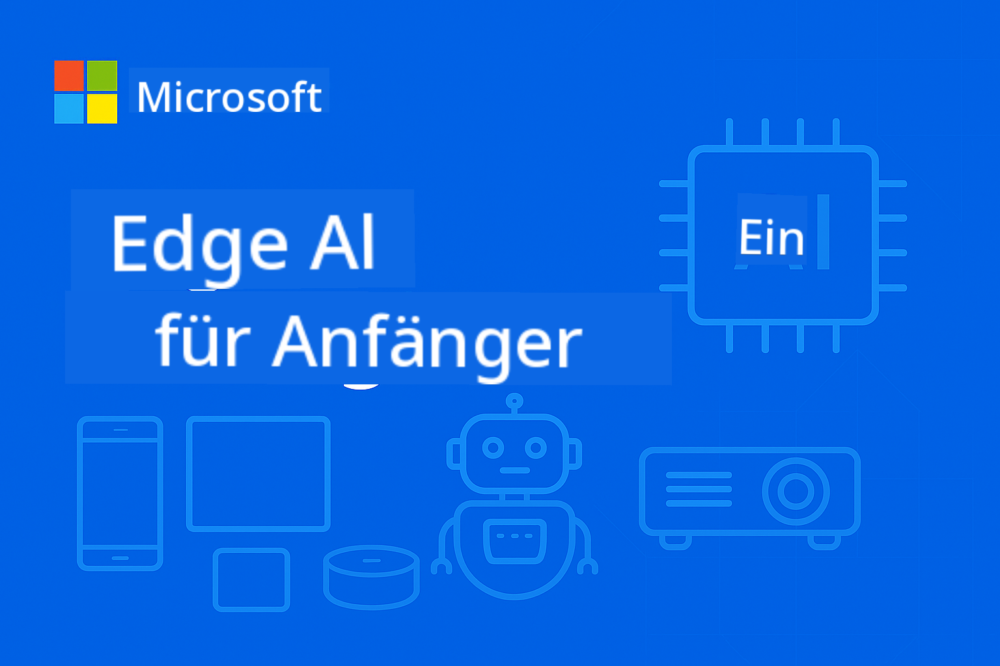

<!--
CO_OP_TRANSLATOR_METADATA:
{
  "original_hash": "3f3219903847ef3849e482fa30a64ad4",
  "translation_date": "2025-09-26T07:29:20+00:00",
  "source_file": "README.md",
  "language_code": "de"
}
-->
# EdgeAI für Anfänger



[](https://GitHub.com/microsoft/edgeai-for-beginners/graphs/contributors)
[](https://GitHub.com/microsoft/edgeai-for-beginners/issues)
[](https://GitHub.com/microsoft/edgeai-for-beginners/pulls)
[](http://makeapullrequest.com)

[](https://GitHub.com/microsoft/edgeai-for-beginners/watchers)
[](https://GitHub.com/microsoft/edgeai-for-beginners/fork)
[](https://GitHub.com/microsoft/edgeai-for-beginners/stargazers)

[](https://discord.com/invite/ByRwuEEgH4)

Folgen Sie diesen Schritten, um mit diesen Ressourcen zu beginnen:

1. **Repository forken**: Klicken Sie hier [](https://GitHub.com/microsoft/edgeai-for-beginners/fork)
2. **Repository klonen**: `git clone https://github.com/microsoft/edgeai-for-beginners.git`
3. [**Treten Sie dem Azure AI Foundry Discord bei und tauschen Sie sich mit Experten und anderen Entwicklern aus**](https://discord.com/invite/ByRwuEEgH4)

### 🌐 Mehrsprachige Unterstützung

#### Unterstützt durch GitHub Action (Automatisiert & Immer aktuell)

[Arabisch](../ar/README.md) | [Bengalisch](../bn/README.md) | [Bulgarisch](../bg/README.md) | [Birmanisch (Myanmar)](../my/README.md) | [Chinesisch (vereinfacht)](../zh/README.md) | [Chinesisch (traditionell, Hongkong)](../hk/README.md) | [Chinesisch (traditionell, Macau)](../mo/README.md) | [Chinesisch (traditionell, Taiwan)](../tw/README.md) | [Kroatisch](../hr/README.md) | [Tschechisch](../cs/README.md) | [Dänisch](../da/README.md) | [Niederländisch](../nl/README.md) | [Finnisch](../fi/README.md) | [Französisch](../fr/README.md) | [Deutsch](./README.md) | [Griechisch](../el/README.md) | [Hebräisch](../he/README.md) | [Hindi](../hi/README.md) | [Ungarisch](../hu/README.md) | [Indonesisch](../id/README.md) | [Italienisch](../it/README.md) | [Japanisch](../ja/README.md) | [Koreanisch](../ko/README.md) | [Malaiisch](../ms/README.md) | [Marathi](../mr/README.md) | [Nepalesisch](../ne/README.md) | [Norwegisch](../no/README.md) | [Persisch (Farsi)](../fa/README.md) | [Polnisch](../pl/README.md) | [Portugiesisch (Brasilien)](../br/README.md) | [Portugiesisch (Portugal)](../pt/README.md) | [Punjabi (Gurmukhi)](../pa/README.md) | [Rumänisch](../ro/README.md) | [Russisch](../ru/README.md) | [Serbisch (kyrillisch)](../sr/README.md) | [Slowakisch](../sk/README.md) | [Slowenisch](../sl/README.md) | [Spanisch](../es/README.md) | [Swahili](../sw/README.md) | [Schwedisch](../sv/README.md) | [Tagalog (Filipino)](../tl/README.md) | [Thai](../th/README.md) | [Türkisch](../tr/README.md) | [Ukrainisch](../uk/README.md) | [Urdu](../ur/README.md) | [Vietnamesisch](../vi/README.md)

**Falls Sie zusätzliche Übersetzungen wünschen, finden Sie unterstützte Sprachen [hier](https://github.com/Azure/co-op-translator/blob/main/getting_started/supported-languages.md)**

## Einführung

Willkommen bei **EdgeAI für Anfänger** – Ihre umfassende Reise in die transformative Welt der Edge-Künstlichen Intelligenz. Dieser Kurs schlägt die Brücke zwischen leistungsstarken KI-Fähigkeiten und praktischen, realen Anwendungen auf Edge-Geräten, sodass Sie die Möglichkeiten der KI direkt dort nutzen können, wo Daten generiert und Entscheidungen getroffen werden müssen.

### Was Sie lernen werden

Dieser Kurs führt Sie von den grundlegenden Konzepten bis hin zu produktionsreifen Implementierungen und behandelt:
- **Kleine Sprachmodelle (SLMs)**, die für den Einsatz auf Edge-Geräten optimiert sind
- **Hardware-optimierte Lösungen** für verschiedene Plattformen
- **Echtzeit-Inferenz** mit datenschutzfreundlichen Funktionen
- **Produktionsstrategien** für Unternehmensanwendungen

### Warum EdgeAI wichtig ist

Edge AI stellt einen Paradigmenwechsel dar, der moderne Herausforderungen adressiert:
- **Datenschutz & Sicherheit**: Verarbeitung sensibler Daten lokal, ohne Cloud-Exposition
- **Echtzeit-Leistung**: Vermeidung von Netzwerklatenz für zeitkritische Anwendungen
- **Kostenersparnis**: Reduzierung von Bandbreiten- und Cloud-Computing-Kosten
- **Robuste Betriebsfähigkeit**: Funktionalität auch bei Netzwerkausfällen
- **Regulatorische Anforderungen**: Einhaltung von Datenschutzbestimmungen

### Edge AI

Edge AI bezeichnet die Ausführung von KI-Algorithmen und Sprachmodellen lokal auf Hardware, nahe der Datenquelle, ohne auf Cloud-Ressourcen für die Inferenz angewiesen zu sein. Es reduziert Latenz, verbessert den Datenschutz und ermöglicht Echtzeit-Entscheidungen.

### Kernprinzipien:
- **On-Device-Inferenz**: KI-Modelle laufen auf Edge-Geräten (Smartphones, Router, Mikrocontroller, Industrie-PCs)
- **Offline-Fähigkeit**: Funktioniert ohne dauerhafte Internetverbindung
- **Niedrige Latenz**: Sofortige Antworten für Echtzeitsysteme
- **Datenhoheit**: Sensible Daten bleiben lokal, was Sicherheit und Compliance verbessert

### Kleine Sprachmodelle (SLMs)

SLMs wie Phi-4, Mistral-7B und Gemma sind optimierte Versionen größerer LLMs – trainiert oder destilliert für:
- **Reduzierter Speicherbedarf**: Effiziente Nutzung begrenzter Edge-Geräte-Ressourcen
- **Geringere Rechenanforderungen**: Optimiert für CPU- und Edge-GPU-Leistung
- **Schnellere Startzeiten**: Schnelle Initialisierung für reaktionsfähige Anwendungen

Sie bieten leistungsstarke NLP-Funktionen und erfüllen gleichzeitig die Anforderungen von:
- **Eingebetteten Systemen**: IoT-Geräte und industrielle Steuerungen
- **Mobilgeräten**: Smartphones und Tablets mit Offline-Fähigkeiten
- **IoT-Geräten**: Sensoren und intelligente Geräte mit begrenzten Ressourcen
- **Edge-Servern**: Lokale Verarbeitungseinheiten mit begrenzten GPU-Ressourcen
- **Personal Computern**: Einsatzszenarien für Desktops und Laptops

## Kursmodule & Navigation

| Modul | Thema | Schwerpunkt | Hauptinhalte | Niveau | Dauer |
|-------|-------|-------------|--------------|--------|-------|
| [📖 00 ](./introduction.md) | [Einführung in EdgeAI](./introduction.md) | Grundlagen & Kontext | Überblick über EdgeAI • Branchenanwendungen • Einführung in SLMs • Lernziele | Anfänger | 1-2 Std. |
| [📚 01](../../Module01) | [Grundlagen von EdgeAI](./Module01/README.md) | Vergleich Cloud vs Edge AI | Grundlagen von EdgeAI • Fallstudien • Implementierungsleitfaden • Edge-Bereitstellung | Anfänger | 3-4 Std. |
| [🧠 02](../../Module02) | [SLM-Modellgrundlagen](./Module02/README.md) | Modellfamilien & Architektur | Phi-Familie • Qwen-Familie • Gemma-Familie • BitNET • μModel • Phi-Silica | Anfänger | 4-5 Std. |
| [🚀 03](../../Module03) | [SLM-Bereitstellungspraxis](./Module03/README.md) | Lokale & Cloud-Bereitstellung | Fortgeschrittenes Lernen • Lokale Umgebung • Cloud-Bereitstellung | Mittelstufe | 4-5 Std. |
| [⚙️ 04](../../Module04) | [Toolkit zur Modelloptimierung](./Module04/README.md) | Plattformübergreifende Optimierung | Einführung • Llama.cpp • Microsoft Olive • OpenVINO • Apple MLX • Workflow-Synthese | Mittelstufe | 5-6 Std. |
| [🔧 05](../../Module05) | [SLMOps Produktion](./Module05/README.md) | Produktionsbetrieb | Einführung in SLMOps • Modell-Distillation • Feinabstimmung • Produktionsbereitstellung | Fortgeschritten | 5-6 Std. |
| [🤖 06](../../Module06) | [KI-Agenten & Funktionsaufrufe](./Module06/README.md) | Agenten-Frameworks & MCP | Einführung in Agenten • Funktionsaufrufe • Modellkontextprotokoll | Fortgeschritten | 4-5 Std. |
| [💻 07](../../Module07) | [Plattformimplementierung](./Module07/README.md) | Plattformübergreifende Beispiele | KI-Toolkit • Foundry Local • Windows-Entwicklung | Fortgeschritten | 3-4 Std. |
| [🏭 08](../../Module08) | [Foundry Local Toolkit](./Module08/README.md) | Produktionsreife Beispiele | Beispielanwendungen (Details siehe unten) | Experte | 8-10 Std. |

### 🏭 **Modul 08: Beispielanwendungen**

- [01: REST Chat Quickstart](./Module08/samples/01/README.md)
- [02: OpenAI SDK Integration](./Module08/samples/02/README.md)
- [03: Modellentdeckung & Benchmarking](./Module08/samples/03/README.md)
- [04: Chainlit RAG Anwendung](./Module08/samples/04/README.md)
- [05: Multi-Agenten-Orchestrierung](./Module08/samples/05/README.md)
- [06: Router für Modelle-als-Tools](./Module08/samples/06/README.md)
- [07: Direkter API-Client](./Module08/samples/07/README.md)
- [08: Windows 11 Chat App](./Module08/samples/08/README.md)
- [09: Fortgeschrittenes Multi-Agenten-System](./Module08/samples/09/README.md)
- [10: Foundry Tools Framework](./Module08/samples/10/README.md)

### 📊 **Zusammenfassung des Lernpfads**
- **Gesamtdauer**: 36-45 Stunden
- **Anfängerpfad**: Module 01-02 (7-9 Stunden)  
- **Mittelstufenpfad**: Module 03-04 (9-11 Stunden)
- **Fortgeschrittenenpfad**: Module 05-07 (12-15 Stunden)
- **Expertenpfad**: Modul 08 (8-10 Stunden)

## Was Sie entwickeln werden

### 🎯 Kernkompetenzen
- **Edge AI Architektur**: Entwurf von lokal-zentrierten KI-Systemen mit Cloud-Integration
- **Modelloptimierung**: Quantisierung und Komprimierung von Modellen für Edge-Bereitstellung (85% Geschwindigkeitssteigerung, 75% Größenreduktion)
- **Plattformübergreifende Bereitstellung**: Windows, Mobilgeräte, eingebettete Systeme und Cloud-Edge-Hybridsysteme
- **Produktionsbetrieb**: Überwachung, Skalierung und Wartung von Edge AI in der Produktion

### 🏗️ Praktische Projekte
- **Foundry Local Chat Apps**: Windows 11 native Anwendung mit Modellwechsel
- **Multi-Agenten-Systeme**: Koordinator mit spezialisierten Agenten für komplexe Workflows  
- **RAG-Anwendungen**: Lokale Dokumentenverarbeitung mit Vektorsuche
- **Modell-Router**: Intelligente Auswahl zwischen Modellen basierend auf Aufgabenanalyse
- **API-Frameworks**: Produktionsreife Clients mit Streaming und Gesundheitsüberwachung
- **Plattformübergreifende Tools**: LangChain/Semantic Kernel Integrationsmuster

### 🏢 Branchenanwendungen
**Fertigung** • **Gesundheitswesen** • **Autonome Fahrzeuge** • **Smart Cities** • **Mobile Apps**

## Schnellstart

**Empfohlener Lernpfad** (20-30 Stunden insgesamt):

0. **📖 Einführung** ([Introduction.md](./introduction.md)): Grundlagen von EdgeAI + Branchenkontext + Lernrahmen
1. **📚 Grundlagen** (Module 01-02): EdgeAI-Konzepte + SLM-Modellfamilien
2. **⚙️ Optimierung** (Module 03-04): Bereitstellung + Quantisierungs-Frameworks  
3. **🚀 Produktion** (Module 05-06): SLMOps + KI-Agenten + Funktionsaufrufe  
4. **💻 Implementierung** (Module 07-08): Plattformbeispiele + Foundry Local Toolkit  

Jedes Modul umfasst Theorie, praktische Übungen und produktionsreife Codebeispiele.

## Karriereauswirkungen

**Technische Rollen**: EdgeAI Solutions Architect • ML Engineer (Edge) • IoT AI Developer • Mobile AI Developer  

**Industriesektoren**: Industrie 4.0 • Gesundheitstechnologie • Autonome Systeme • FinTech • Unterhaltungselektronik  

**Portfolio-Projekte**: Multi-Agenten-Systeme • Produktionsreife RAG-Anwendungen • Plattformübergreifende Bereitstellung • Leistungsoptimierung  

## Repository-Struktur

```
edgeai-for-beginners/
├── 📖 introduction.md  # Foundation: EdgeAI Overview & Learning Framework
├── 📚 Module01-04/     # Fundamentals → SLMs → Deployment → Optimization  
├── 🔧 Module05-06/     # SLMOps → AI Agents → Function Calling
├── 💻 Module07/        # Platform Samples (VS Code, Windows, Jetson, Mobile)
├── 🏭 Module08/        # Foundry Local Toolkit + 10 Comprehensive Samples
│   ├── samples/01-06/  # Foundation: REST, SDK, RAG, Agents, Routing
│   └── samples/07-10/  # Advanced: API Client, Windows App, Enterprise Agents, Tools
├── 🌐 translations/    # Multi-language support (8+ languages)
└── 📋 STUDY_GUIDE.md   # Structured learning paths & time allocation
```
  

## Kurs-Highlights

✅ **Progressives Lernen**: Theorie → Praxis → Produktionsbereitstellung  
✅ **Echte Fallstudien**: Microsoft, Japan Airlines, Unternehmensimplementierungen  
✅ **Praktische Beispiele**: Über 50 Beispiele, 10 umfassende Foundry Local Demos  
✅ **Leistungsfokus**: 85 % Geschwindigkeitsverbesserungen, 75 % Größenreduzierungen  
✅ **Multi-Plattform**: Windows, Mobilgeräte, Embedded, Cloud-Edge-Hybride  
✅ **Produktionsreife**: Überwachung, Skalierung, Sicherheit, Compliance-Frameworks  

📖 **[Studienleitfaden verfügbar](STUDY_GUIDE.md)**: Strukturierter 20-Stunden-Lernpfad mit Zeitmanagement-Tipps und Selbstbewertungstools.

---

**EdgeAI repräsentiert die Zukunft der KI-Bereitstellung**: lokal zuerst, datenschutzfreundlich und effizient. Beherrschen Sie diese Fähigkeiten, um die nächste Generation intelligenter Anwendungen zu entwickeln.

## Weitere Kurse

Unser Team bietet weitere Kurse an! Schauen Sie sich an:

- [MCP für Anfänger](https://github.com/microsoft/mcp-for-beginners)  
- [KI-Agenten für Anfänger](https://github.com/microsoft/ai-agents-for-beginners?WT.mc_id=academic-105485-koreyst)  
- [Generative KI für Anfänger mit .NET](https://github.com/microsoft/Generative-AI-for-beginners-dotnet?WT.mc_id=academic-105485-koreyst)  
- [Generative KI für Anfänger mit JavaScript](https://github.com/microsoft/generative-ai-with-javascript?WT.mc_id=academic-105485-koreyst)  
- [Generative KI für Anfänger](https://github.com/microsoft/generative-ai-for-beginners?WT.mc_id=academic-105485-koreyst)  
- [ML für Anfänger](https://aka.ms/ml-beginners?WT.mc_id=academic-105485-koreyst)  
- [Datenwissenschaft für Anfänger](https://aka.ms/datascience-beginners?WT.mc_id=academic-105485-koreyst)  
- [KI für Anfänger](https://aka.ms/ai-beginners?WT.mc_id=academic-105485-koreyst)  
- [Cybersicherheit für Anfänger](https://github.com/microsoft/Security-101??WT.mc_id=academic-96948-sayoung)  
- [Webentwicklung für Anfänger](https://aka.ms/webdev-beginners?WT.mc_id=academic-105485-koreyst)  
- [IoT für Anfänger](https://aka.ms/iot-beginners?WT.mc_id=academic-105485-koreyst)  
- [XR-Entwicklung für Anfänger](https://github.com/microsoft/xr-development-for-beginners?WT.mc_id=academic-105485-koreyst)  
- [GitHub Copilot meistern für KI-gestütztes Pair Programming](https://aka.ms/GitHubCopilotAI?WT.mc_id=academic-105485-koreyst)  
- [GitHub Copilot meistern für C#/.NET-Entwickler](https://github.com/microsoft/mastering-github-copilot-for-dotnet-csharp-developers?WT.mc_id=academic-105485-koreyst)  
- [Wählen Sie Ihr eigenes Copilot-Abenteuer](https://github.com/microsoft/CopilotAdventures?WT.mc_id=academic-105485-koreyst)  

---

