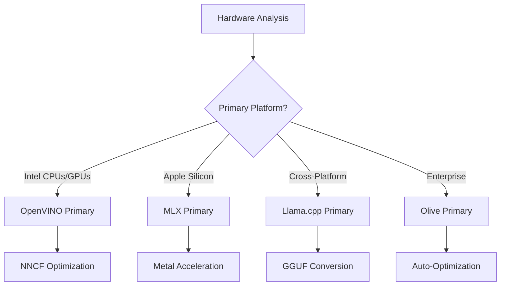
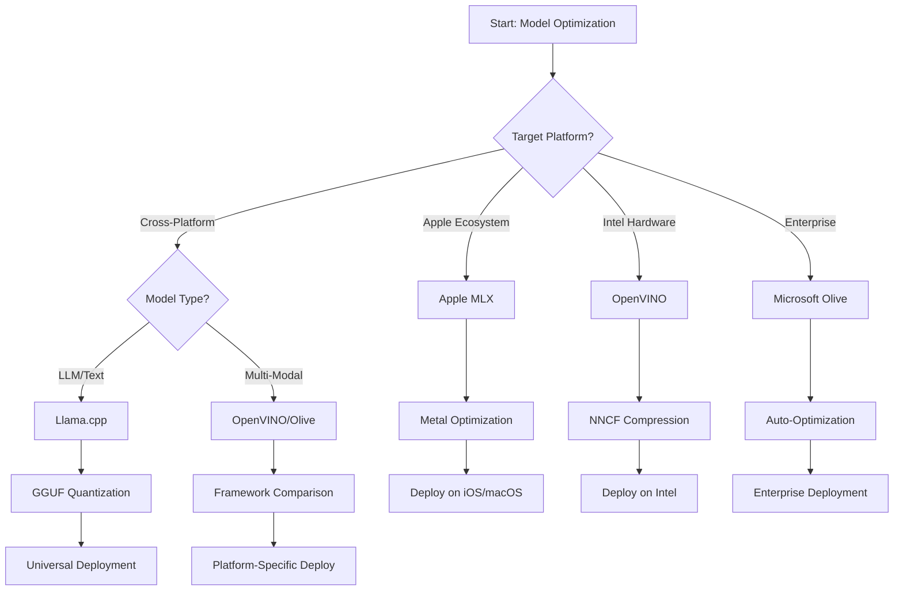
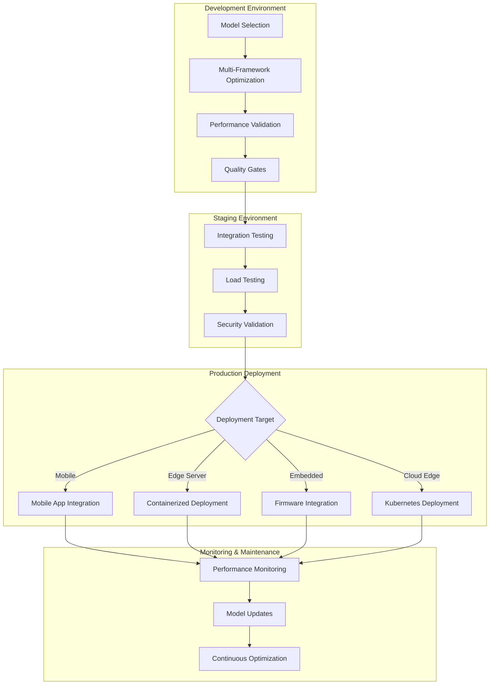

<!--
CO_OP_TRANSLATOR_METADATA:
{
  "original_hash": "6719c4a7e44b948230ac5f5cab3699bd",
  "translation_date": "2025-09-18T07:53:41+00:00",
  "source_file": "Module04/06.workflow-synthesis.md",
  "language_code": "el"
}
-->
# Ενότητα 6: Σύνθεση Ροής Εργασίας Ανάπτυξης Edge AI

## Πίνακας Περιεχομένων
1. [Εισαγωγή](../../../Module04)
2. [Στόχοι Μάθησης](../../../Module04)
3. [Επισκόπηση Ενοποιημένης Ροής Εργασίας](../../../Module04)
4. [Πίνακας Επιλογής Πλαισίου](../../../Module04)
5. [Σύνθεση Βέλτιστων Πρακτικών](../../../Module04)
6. [Οδηγός Στρατηγικής Ανάπτυξης](../../../Module04)
7. [Ροή Εργασίας Βελτιστοποίησης Απόδοσης](../../../Module04)
8. [Λίστα Ελέγχου Ετοιμότητας Παραγωγής](../../../Module04)
9. [Αντιμετώπιση Προβλημάτων και Παρακολούθηση](../../../Module04)
10. [Διασφάλιση Μελλοντικής Ανθεκτικότητας της Ροής Edge AI](../../../Module04)

## Εισαγωγή

Η ανάπτυξη Edge AI απαιτεί μια εξελιγμένη κατανόηση πολλαπλών πλαισίων βελτιστοποίησης, στρατηγικών ανάπτυξης και υλικών παραμέτρων. Αυτή η ολοκληρωμένη σύνθεση συγκεντρώνει τη γνώση από Llama.cpp, Microsoft Olive, OpenVINO και Apple MLX για τη δημιουργία μιας ενοποιημένης ροής εργασίας που μεγιστοποιεί την αποδοτικότητα, διατηρεί την ποιότητα και εξασφαλίζει επιτυχημένη ανάπτυξη στην παραγωγή.

Κατά τη διάρκεια αυτού του μαθήματος, εξετάσαμε μεμονωμένα πλαίσια βελτιστοποίησης, καθένα με μοναδικά πλεονεκτήματα και εξειδικευμένες περιπτώσεις χρήσης. Ωστόσο, τα πραγματικά έργα Edge AI συχνά απαιτούν συνδυασμό τεχνικών από πολλαπλά πλαίσια ή στρατηγικές αποφάσεις για την επιλογή της καλύτερης προσέγγισης για συγκεκριμένους περιορισμούς και απαιτήσεις.

Αυτή η ενότητα συνθέτει τη συλλογική σοφία από όλα τα πλαίσια σε πρακτικές ροές εργασίας, δέντρα αποφάσεων και βέλτιστες πρακτικές που σας επιτρέπουν να δημιουργείτε λύσεις Edge AI έτοιμες για παραγωγή με αποδοτικό και αποτελεσματικό τρόπο. Είτε βελτιστοποιείτε για κινητές συσκευές, ενσωματωμένα συστήματα ή edge servers, αυτός ο οδηγός παρέχει το στρατηγικό πλαίσιο για τη λήψη ενημερωμένων αποφάσεων καθ' όλη τη διάρκεια του κύκλου ανάπτυξης.

## Στόχοι Μάθησης

Μέχρι το τέλος αυτής της ενότητας, θα μπορείτε να:

### Στρατηγική Λήψη Αποφάσεων
- **Αξιολογείτε και επιλέγετε** το βέλτιστο πλαίσιο βελτιστοποίησης βάσει απαιτήσεων έργου, περιορισμών υλικού και σεναρίων ανάπτυξης
- **Σχεδιάζετε ολοκληρωμένες ροές εργασίας** που ενσωματώνουν πολλαπλές τεχνικές βελτιστοποίησης για μέγιστη αποδοτικότητα
- **Αξιολογείτε συμβιβασμούς** μεταξύ ακρίβειας μοντέλου, ταχύτητας πρόβλεψης, χρήσης μνήμης και πολυπλοκότητας ανάπτυξης σε διαφορετικά πλαίσια

### Ενσωμάτωση Ροής Εργασίας
- **Εφαρμόζετε ενοποιημένες ροές ανάπτυξης** που αξιοποιούν τα πλεονεκτήματα πολλαπλών πλαισίων βελτιστοποίησης
- **Δημιουργείτε αναπαραγώγιμες ροές εργασίας** για συνεπή βελτιστοποίηση και ανάπτυξη μοντέλων σε διαφορετικά περιβάλλοντα
- **Καθιερώνετε πύλες ποιότητας** και διαδικασίες επικύρωσης για να διασφαλίσετε ότι τα βελτιστοποιημένα μοντέλα πληρούν τις απαιτήσεις παραγωγής

### Βελτιστοποίηση Απόδοσης
- **Εφαρμόζετε συστηματικές στρατηγικές βελτιστοποίησης** χρησιμοποιώντας ποσοτικοποίηση, κλάδεμα και τεχνικές επιτάχυνσης υλικού
- **Παρακολουθείτε και αξιολογείτε** την απόδοση μοντέλων σε διαφορετικά επίπεδα βελτιστοποίησης και στόχους ανάπτυξης
- **Βελτιστοποιείτε για συγκεκριμένες πλατφόρμες υλικού** όπως CPU, GPU, NPU και εξειδικευμένους επιταχυντές edge

### Ανάπτυξη στην Παραγωγή
- **Σχεδιάζετε κλιμακούμενες αρχιτεκτονικές ανάπτυξης** που υποστηρίζουν πολλαπλές μορφές μοντέλων και μηχανές πρόβλεψης
- **Εφαρμόζετε παρακολούθηση και παρατηρησιμότητα** για εφαρμογές Edge AI σε περιβάλλοντα παραγωγής
- **Καθιερώνετε ροές εργασίας συντήρησης** για ενημερώσεις μοντέλων, παρακολούθηση απόδοσης και βελτιστοποίηση συστημάτων

### Αριστεία Διασυνοριακής Πλατφόρμας
- **Αναπτύσσετε βελτιστοποιημένα μοντέλα** σε διάφορες πλατφόρμες υλικού διατηρώντας συνεπή απόδοση
- **Διαχειρίζεστε βελτιστοποιήσεις ειδικές για πλατφόρμες** για Windows, macOS, Linux, κινητά και ενσωματωμένα συστήματα
- **Δημιουργείτε επίπεδα αφαίρεσης** που επιτρέπουν απρόσκοπτη ανάπτυξη σε διαφορετικά περιβάλλοντα edge

## Επισκόπηση Ενοποιημένης Ροής Εργασίας

### Φάση 1: Ανάλυση Απαιτήσεων και Επιλογή Πλαισίου

Η βάση της επιτυχημένης ανάπτυξης Edge AI ξεκινά με λεπτομερή ανάλυση απαιτήσεων που ενημερώνει την επιλογή πλαισίου και τη στρατηγική βελτιστοποίησης.

#### 1.1 Αξιολόγηση Υλικού


**Βασικές Παράμετροι:**
- **Αρχιτεκτονική CPU**: Δυνατότητες x86, ARM, Apple Silicon
- **Διαθεσιμότητα Επιταχυντών**: GPU, NPU, VPU, εξειδικευμένα AI chips
- **Περιορισμοί Μνήμης**: Περιορισμοί RAM, χωρητικότητα αποθήκευσης
- **Προϋπολογισμός Ενέργειας**: Διάρκεια μπαταρίας, θερμικοί περιορισμοί
- **Συνδεσιμότητα**: Απαιτήσεις εκτός σύνδεσης, περιορισμοί εύρους ζώνης

#### 1.2 Πίνακας Απαιτήσεων Εφαρμογής

| Απαίτηση | Llama.cpp | Microsoft Olive | OpenVINO | Apple MLX |
|----------|-----------|-----------------|----------|-----------|
| Διασυνοριακή Πλατφόρμα | ✅ Εξαιρετική | ⚡ Καλή | ⚡ Καλή | ❌ Μόνο Apple |
| Ενσωμάτωση Επιχειρήσεων | ⚡ Βασική | ✅ Εξαιρετική | ✅ Εξαιρετική | ⚡ Περιορισμένη |
| Ανάπτυξη σε Κινητά | ✅ Εξαιρετική | ⚡ Καλή | ⚡ Καλή | ✅ Εξαιρετική για iOS |
| Πρόβλεψη σε Πραγματικό Χρόνο | ✅ Εξαιρετική | ✅ Εξαιρετική | ✅ Εξαιρετική | ✅ Εξαιρετική |
| Ποικιλία Μοντέλων | ✅ Εστίαση σε LLM | ✅ Όλα τα Μοντέλα | ✅ Όλα τα Μοντέλα | ✅ Εστίαση σε LLM |
| Ευκολία Χρήσης | ✅ Απλό | ✅ Αυτοματοποιημένο | ⚡ Μέτριο | ✅ Απλό |

### Φάση 2: Προετοιμασία και Βελτιστοποίηση Μοντέλου

#### 2.1 Καθολική Ροή Αξιολόγησης Μοντέλου

```python
# Universal Model Assessment Framework
class EdgeAIModelAssessment:
    def __init__(self, model_path, target_hardware):
        self.model_path = model_path
        self.target_hardware = target_hardware
        self.optimization_frameworks = []
        
    def assess_model_characteristics(self):
        """Analyze model size, architecture, and complexity"""
        return {
            'model_size': self.get_model_size(),
            'parameter_count': self.get_parameter_count(),
            'architecture_type': self.detect_architecture(),
            'quantization_compatibility': self.check_quantization_support()
        }
    
    def recommend_optimization_strategy(self):
        """Recommend optimal frameworks and techniques"""
        characteristics = self.assess_model_characteristics()
        
        if self.target_hardware.startswith('apple'):
            return self.mlx_optimization_strategy(characteristics)
        elif self.target_hardware.startswith('intel'):
            return self.openvino_optimization_strategy(characteristics)
        elif characteristics['model_size'] > 7_000_000_000:  # 7B+ parameters
            return self.enterprise_optimization_strategy(characteristics)
        else:
            return self.lightweight_optimization_strategy(characteristics)
```

#### 2.2 Ροή Βελτιστοποίησης Πολλαπλών Πλαισίων

**Διαδοχική Προσέγγιση Βελτιστοποίησης:**
1. **Αρχική Μετατροπή**: Μετατροπή σε ενδιάμεση μορφή (ONNX όπου είναι δυνατόν)
2. **Ειδική Βελτιστοποίηση Πλαισίου**: Εφαρμογή εξειδικευμένων τεχνικών
3. **Διασταυρούμενη Επικύρωση**: Επαλήθευση απόδοσης σε πλατφόρμες στόχους
4. **Τελική Συσκευασία**: Προετοιμασία για ανάπτυξη

```bash
# Multi-Framework Optimization Script
#!/bin/bash

MODEL_NAME="phi-3-mini"
BASE_MODEL="microsoft/Phi-3-mini-4k-instruct"

# Phase 1: ONNX Conversion (Universal)
python convert_to_onnx.py --model $BASE_MODEL --output models/onnx/

# Phase 2: Platform-Specific Optimization
if [[ "$TARGET_PLATFORM" == "intel" ]]; then
    # OpenVINO Optimization
    python optimize_openvino.py --input models/onnx/ --output models/openvino/
elif [[ "$TARGET_PLATFORM" == "apple" ]]; then
    # MLX Optimization
    python optimize_mlx.py --input $BASE_MODEL --output models/mlx/
elif [[ "$TARGET_PLATFORM" == "cross" ]]; then
    # Llama.cpp Optimization
    python convert_to_gguf.py --input models/onnx/ --output models/gguf/
fi

# Phase 3: Validation
python validate_optimization.py --original $BASE_MODEL --optimized models/$TARGET_PLATFORM/
```

### Φάση 3: Επικύρωση Απόδοσης και Αξιολόγηση

#### 3.1 Ολοκληρωμένο Πλαίσιο Αξιολόγησης

```python
class EdgeAIBenchmark:
    def __init__(self, optimized_models):
        self.models = optimized_models
        self.metrics = {
            'inference_time': [],
            'memory_usage': [],
            'accuracy_score': [],
            'throughput': [],
            'energy_consumption': []
        }
    
    def run_comprehensive_benchmark(self):
        """Execute standardized benchmarks across all optimized models"""
        test_inputs = self.generate_test_inputs()
        
        for model_framework, model_path in self.models.items():
            print(f"Benchmarking {model_framework}...")
            
            # Latency Testing
            latency = self.measure_inference_latency(model_path, test_inputs)
            
            # Memory Profiling
            memory = self.profile_memory_usage(model_path)
            
            # Accuracy Validation
            accuracy = self.validate_model_accuracy(model_path, test_inputs)
            
            # Throughput Analysis
            throughput = self.measure_throughput(model_path)
            
            self.record_metrics(model_framework, latency, memory, accuracy, throughput)
    
    def generate_optimization_report(self):
        """Create comprehensive comparison report"""
        report = {
            'recommendations': self.analyze_performance_trade_offs(),
            'deployment_guidance': self.generate_deployment_recommendations(),
            'monitoring_requirements': self.define_monitoring_metrics()
        }
        return report
```

## Πίνακας Επιλογής Πλαισίου

### Δέντρο Αποφάσεων για Επιλογή Πλαισίου



### Ολοκληρωμένα Κριτήρια Επιλογής

#### 1. Ευθυγράμμιση με Κύρια Περίπτωση Χρήσης

**Μεγάλα Γλωσσικά Μοντέλα (LLMs):**
- **Llama.cpp**: Καλύτερο για ανάπτυξη με επίκεντρο την CPU και διασυνοριακή πλατφόρμα
- **Apple MLX**: Βέλτιστο για Apple Silicon με ενοποιημένη μνήμη
- **OpenVINO**: Εξαιρετικό για υλικό Intel με βελτιστοποίηση NNCF
- **Microsoft Olive**: Ιδανικό για επιχειρηματικές ροές εργασίας με αυτοματοποίηση

**Πολυτροπικά Μοντέλα:**
- **OpenVINO**: Ολοκληρωμένη υποστήριξη για όραση, ήχο και κείμενο
- **Microsoft Olive**: Βελτιστοποίηση επιχειρηματικού επιπέδου για σύνθετες ροές εργασίας
- **Llama.cpp**: Περιορισμένο σε μοντέλα βασισμένα σε κείμενο
- **Apple MLX**: Αυξανόμενη υποστήριξη για πολυτροπικές εφαρμογές

#### 2. Πίνακας Πλατφόρμας Υλικού

| Πλατφόρμα | Κύριο Πλαίσιο | Δευτερεύουσα Επιλογή | Εξειδικευμένα Χαρακτηριστικά |
|-----------|---------------|----------------------|-----------------------------|
| Intel CPU/GPU | OpenVINO | Microsoft Olive | Συμπίεση NNCF, βελτιστοποίηση Intel |
| NVIDIA GPU | Microsoft Olive | OpenVINO | Επιτάχυνση CUDA, χαρακτηριστικά επιχειρήσεων |
| Apple Silicon | Apple MLX | Llama.cpp | Metal shaders, ενοποιημένη μνήμη |
| ARM Mobile | Llama.cpp | OpenVINO | Διασυνοριακή πλατφόρμα, ελάχιστες εξαρτήσεις |
| Edge TPU | OpenVINO | Microsoft Olive | Υποστήριξη εξειδικευμένων επιταχυντών |
| Ενσωματωμένο ARM | Llama.cpp | OpenVINO | Μικρό αποτύπωμα, αποδοτική πρόβλεψη |

#### 3. Προτιμήσεις Ροής Εργασίας Ανάπτυξης

**Γρήγορη Πρωτοτυποποίηση:**
1. **Llama.cpp**: Ταχύτερη εγκατάσταση, άμεσα αποτελέσματα
2. **Apple MLX**: Απλό API Python, γρήγορη επανάληψη
3. **Microsoft Olive**: Αυτοματοποιημένη βελτιστοποίηση, ελάχιστη διαμόρφωση
4. **OpenVINO**: Πιο σύνθετη εγκατάσταση, ολοκληρωμένα χαρακτηριστικά

**Παραγωγή Επιχειρήσεων:**
1. **Microsoft Olive**: Χαρακτηριστικά επιχειρήσεων, ενσωμάτωση Azure
2. **OpenVINO**: Οικοσύστημα Intel, ολοκληρωμένα εργαλεία
3. **Apple MLX**: Εφαρμογές επιχειρήσεων ειδικές για Apple
4. **Llama.cpp**: Απλή ανάπτυξη, περιορισμένα χαρακτηριστικά επιχειρήσεων

## Σύνθεση Βέλτιστων Πρακτικών

### Καθολικές Αρχές Βελτιστοποίησης

#### 1. Στρατηγική Προοδευτικής Βελτιστοποίησης

```python
class ProgressiveOptimization:
    def __init__(self, base_model):
        self.base_model = base_model
        self.optimization_stages = [
            'baseline_measurement',
            'format_conversion',
            'quantization_optimization',
            'hardware_acceleration',
            'production_validation'
        ]
    
    def execute_progressive_optimization(self):
        """Apply optimization techniques incrementally"""
        
        # Stage 1: Baseline Measurement
        baseline_metrics = self.measure_baseline_performance()
        
        # Stage 2: Format Conversion
        converted_model = self.convert_to_optimal_format()
        conversion_metrics = self.measure_performance(converted_model)
        
        # Stage 3: Quantization
        quantized_model = self.apply_quantization(converted_model)
        quantization_metrics = self.measure_performance(quantized_model)
        
        # Stage 4: Hardware Acceleration
        accelerated_model = self.enable_hardware_acceleration(quantized_model)
        acceleration_metrics = self.measure_performance(accelerated_model)
        
        # Stage 5: Validation
        production_ready = self.validate_for_production(accelerated_model)
        
        return self.compile_optimization_report(
            baseline_metrics, conversion_metrics, 
            quantization_metrics, acceleration_metrics
        )
```

#### 2. Εφαρμογή Πυλών Ποιότητας

**Πύλες Διατήρησης Ακρίβειας:**
- Διατήρηση >95% της αρχικής ακρίβειας μοντέλου
- Επικύρωση με αντιπροσωπευτικά σύνολα δοκιμών
- Εφαρμογή A/B testing για επικύρωση παραγωγής

**Πύλες Βελτίωσης Απόδοσης:**
- Επίτευξη ελάχιστης βελτίωσης ταχύτητας 2x
- Μείωση αποτυπώματος μνήμης τουλάχιστον κατά 50%
- Επικύρωση συνέπειας χρόνου πρόβλεψης

**Πύλες Ετοιμότητας Παραγωγής:**
- Επιτυχία δοκιμών αντοχής υπό φορτίο
- Επίδειξη σταθερής απόδοσης με την πάροδο του χρόνου
- Επικύρωση απαιτήσεων ασφάλειας και ιδιωτικότητας

### Ενσωμάτωση Βέλτιστων Πρακτικών Ειδικών Πλαισίων

#### 1. Σύνθεση Στρατηγικής Ποσοτικοποίησης

```python
# Unified Quantization Approach
class UnifiedQuantizationStrategy:
    def __init__(self, model, target_platform):
        self.model = model
        self.platform = target_platform
        
    def select_optimal_quantization(self):
        """Choose best quantization based on platform and requirements"""
        
        if self.platform == 'apple_silicon':
            return self.mlx_quantization_strategy()
        elif self.platform == 'intel_hardware':
            return self.openvino_quantization_strategy()
        elif self.platform == 'cross_platform':
            return self.llamacpp_quantization_strategy()
        else:
            return self.olive_quantization_strategy()
    
    def mlx_quantization_strategy(self):
        """Apple MLX-specific quantization"""
        return {
            'method': 'mlx_quantize',
            'precision': 'int4',
            'group_size': 64,
            'optimization_target': 'unified_memory'
        }
    
    def openvino_quantization_strategy(self):
        """OpenVINO NNCF quantization"""
        return {
            'method': 'nncf_quantize',
            'precision': 'int8',
            'calibration_method': 'post_training',
            'optimization_target': 'intel_hardware'
        }
```

#### 2. Βελτιστοποίηση Επιτάχυνσης Υλικού

**Σύνθεση Βελτιστοποίησης CPU:**
- **SIMD Εντολές**: Αξιοποίηση βελτιστοποιημένων πυρήνων σε όλα τα πλαίσια
- **Εύρος Ζώνης Μνήμης**: Βελτιστοποίηση διατάξεων δεδομένων για αποδοτικότητα cache
- **Νηματοποίηση**: Ισορροπία παραλληλισμού με περιορισμούς πόρων

**Βέλτιστες Πρακτικές Επιτάχυνσης GPU:**
- **Επεξεργασία Παρτίδων**: Μέγιστη απόδοση με κατάλληλα μεγέθη παρτίδων
- **Διαχείριση Μνήμης**: Βελτιστοποίηση κατανομής και μεταφορών μνήμης GPU
- **Ακρίβεια**: Χρήση FP16 όπου υποστηρίζεται για καλύτερη απόδοση

**Βελτιστοποίηση NPU/Εξειδικευμένων Επιταχυντών:**
- **Αρχιτεκτονική Μοντέλου**: Διασφάλιση συμβατότητας με δυνατότητες επιταχυντών
- **Ροή Δεδομένων**: Βελτιστοποίηση εισόδου/εξόδου για αποδοτικότητα επιταχυντών
- **Στρατηγικές Εναλλακτικής Λύσης**: Εφαρμογή εναλλακτικής CPU για μη υποστηριζόμενες λειτουργίες

## Οδηγός Στρατηγικής Ανάπτυξης

### Καθολική Αρχιτεκτονική Ανάπτυξης



### Ειδικά Πρότυπα Ανάπτυξης Πλατφόρμας

#### 1. Στρατηγική Ανάπτυξης σε Κινητά

```yaml
# Mobile Deployment Configuration
mobile_deployment:
  ios:
    framework: apple_mlx
    optimization:
      quantization: int4
      memory_mapping: true
      background_execution: limited
    packaging:
      format: mlx
      bundle_size: <50MB
      
  android:
    framework: llama_cpp
    optimization:
      quantization: q4_k_m
      threading: android_optimized
      memory_management: conservative
    packaging:
      format: gguf
      apk_size: <100MB
      
  cross_platform:
    framework: onnx_runtime
    optimization:
      quantization: int8
      execution_provider: cpu
    packaging:
      format: onnx
      shared_libraries: minimal
```

#### 2. Ανάπτυξη Edge Server

```yaml
# Edge Server Deployment Configuration
edge_server:
  intel_based:
    framework: openvino
    optimization:
      quantization: int8
      acceleration: cpu_gpu_auto
      batch_processing: dynamic
    deployment:
      container: openvino_runtime
      orchestration: kubernetes
      scaling: horizontal
      
  nvidia_based:
    framework: microsoft_olive
    optimization:
      quantization: int4
      acceleration: cuda
      tensor_parallelism: true
    deployment:
      container: nvidia_triton
      orchestration: kubernetes
      scaling: gpu_aware
```

### Βέλτιστες Πρακτικές Κοντεϊνοποίησης

```dockerfile
# Multi-Framework Edge AI Container
FROM ubuntu:22.04 as base

# Install common dependencies
RUN apt-get update && apt-get install -y \
    python3 \
    python3-pip \
    build-essential \
    cmake \
    && rm -rf /var/lib/apt/lists/*

# Framework-specific stages
FROM base as openvino
RUN pip install openvino nncf optimum[intel]

FROM base as llamacpp
RUN git clone https://github.com/ggerganov/llama.cpp.git \
    && cd llama.cpp && make LLAMA_OPENBLAS=1

FROM base as olive
RUN pip install olive-ai[auto-opt] onnxruntime-genai

# Production stage with selected framework
FROM openvino as production
COPY models/ /app/models/
COPY src/ /app/src/
WORKDIR /app

EXPOSE 8080
CMD ["python3", "src/inference_server.py"]
```

## Ροή Εργασίας Βελτιστοποίησης Απόδοσης

### Συστηματική Ρύθμιση Απόδοσης

#### 1. Ροή Εργασίας Προφίλ Απόδοσης

```python
class EdgeAIPerformanceProfiler:
    def __init__(self, model_path, framework):
        self.model_path = model_path
        self.framework = framework
        self.profiling_results = {}
    
    def comprehensive_profiling(self):
        """Execute comprehensive performance analysis"""
        
        # CPU Profiling
        cpu_profile = self.profile_cpu_usage()
        
        # Memory Profiling
        memory_profile = self.profile_memory_usage()
        
        # Inference Latency
        latency_profile = self.profile_inference_latency()
        
        # Throughput Analysis
        throughput_profile = self.profile_throughput()
        
        # Energy Consumption (where available)
        energy_profile = self.profile_energy_consumption()
        
        return self.compile_performance_report(
            cpu_profile, memory_profile, latency_profile,
            throughput_profile, energy_profile
        )
    
    def identify_bottlenecks(self):
        """Automatically identify performance bottlenecks"""
        bottlenecks = []
        
        if self.profiling_results['cpu_utilization'] > 80:
            bottlenecks.append('cpu_bound')
        
        if self.profiling_results['memory_usage'] > 90:
            bottlenecks.append('memory_bound')
        
        if self.profiling_results['inference_variance'] > 20:
            bottlenecks.append('inconsistent_performance')
        
        return self.generate_optimization_recommendations(bottlenecks)
```

#### 2. Αυτοματοποιημένη Ροή Βελτιστοποίησης

```python
class AutomatedOptimizationPipeline:
    def __init__(self, base_model, target_constraints):
        self.base_model = base_model
        self.constraints = target_constraints
        self.optimization_history = []
    
    def execute_optimization_search(self):
        """Systematically search optimization space"""
        
        optimization_candidates = [
            {'quantization': 'int8', 'pruning': 0.1},
            {'quantization': 'int4', 'pruning': 0.2},
            {'quantization': 'int8', 'acceleration': 'gpu'},
            {'quantization': 'int4', 'acceleration': 'npu'}
        ]
        
        best_configuration = None
        best_score = 0
        
        for config in optimization_candidates:
            optimized_model = self.apply_optimization(config)
            score = self.evaluate_optimization(optimized_model)
            
            if score > best_score and self.meets_constraints(optimized_model):
                best_score = score
                best_configuration = config
            
            self.optimization_history.append({
                'config': config,
                'score': score,
                'model': optimized_model
            })
        
        return best_configuration, self.optimization_history
```

### Βελτιστοποίηση Πολλαπλών Στόχων

#### 1. Βελτιστοποίηση Pareto για Edge AI

```python
class ParetoOptimization:
    def __init__(self, objectives=['speed', 'accuracy', 'memory']):
        self.objectives = objectives
        self.pareto_frontier = []
    
    def find_pareto_optimal_solutions(self, optimization_results):
        """Identify Pareto-optimal configurations"""
        
        for result in optimization_results:
            is_dominated = False
            
            for frontier_point in self.pareto_frontier:
                if self.dominates(frontier_point, result):
                    is_dominated = True
                    break
            
            if not is_dominated:
                # Remove dominated points from frontier
                self.pareto_frontier = [
                    point for point in self.pareto_frontier 
                    if not self.dominates(result, point)
                ]
                
                self.pareto_frontier.append(result)
        
        return self.pareto_frontier
    
    def recommend_configuration(self, user_preferences):
        """Recommend configuration based on user preferences"""
        
        weighted_scores = []
        for config in self.pareto_frontier:
            score = sum(
                user_preferences[obj] * config['metrics'][obj] 
                for obj in self.objectives
            )
            weighted_scores.append((score, config))
        
        return max(weighted_scores, key=lambda x: x[0])[1]
```

## Λίστα Ελέγχου Ετοιμότητας Παραγωγής

### Ολοκληρωμένη Επικύρωση Παραγωγής

#### 1. Διασφάλιση Ποιότητας Μοντέλου

```python
class ProductionReadinessValidator:
    def __init__(self, optimized_model, production_requirements):
        self.model = optimized_model
        self.requirements = production_requirements
        self.validation_results = {}
    
    def validate_model_quality(self):
        """Comprehensive model quality validation"""
        
        # Accuracy Validation
        accuracy_result = self.validate_accuracy()
        
        # Performance Validation
        performance_result = self.validate_performance()
        
        # Robustness Testing
        robustness_result = self.validate_robustness()
        
        # Security Assessment
        security_result = self.validate_security()
        
        # Compliance Verification
        compliance_result = self.validate_compliance()
        
        return self.compile_validation_report(
            accuracy_result, performance_result, robustness_result,
            security_result, compliance_result
        )
    
    def generate_certification_report(self):
        """Generate production certification report"""
        return {
            'model_signature': self.generate_model_signature(),
            'validation_timestamp': datetime.now(),
            'validation_results': self.validation_results,
            'deployment_approval': self.check_deployment_approval(),
            'monitoring_requirements': self.define_monitoring_requirements()
        }
```

#### 2. Λίστα Ελέγχου Ανάπτυξης Παραγωγής

**Επικύρωση Πριν την Ανάπτυξη:**
- [ ] Η ακρίβεια του μοντέλου πληροί τις ελάχιστες απαιτήσεις (>95% της αρχικής)
- [ ] Επιτεύχθηκαν στόχοι απόδοσης (καθυστέρηση, ρυθμός, μνήμη)
- [ ] Α
Να θυμάστε ότι η καλύτερη στρατηγική βελτιστοποίησης είναι αυτή που ανταποκρίνεται στις συγκεκριμένες απαιτήσεις σας, ενώ διατηρεί την ευελιξία να προσαρμοστεί καθώς αυτές οι απαιτήσεις εξελίσσονται. Χρησιμοποιήστε αυτόν τον οδηγό ως πλαίσιο για να λαμβάνετε ενημερωμένες αποφάσεις, αλλά πάντα να επικυρώνετε τις επιλογές σας μέσω εμπειρικών δοκιμών και πραγματικής εμπειρίας ανάπτυξης.

## ➡️ Τι ακολουθεί

Συνεχίστε το ταξίδι σας στην Edge AI εξερευνώντας [Module 5: SLMOps and Production Deployment](../Module05/README.md) για να μάθετε σχετικά με τις λειτουργικές πτυχές της διαχείρισης κύκλου ζωής των Small Language Models.

---

**Αποποίηση ευθύνης**:  
Αυτό το έγγραφο έχει μεταφραστεί χρησιμοποιώντας την υπηρεσία αυτόματης μετάφρασης [Co-op Translator](https://github.com/Azure/co-op-translator). Παρόλο που καταβάλλουμε προσπάθειες για ακρίβεια, παρακαλούμε να έχετε υπόψη ότι οι αυτοματοποιημένες μεταφράσεις ενδέχεται να περιέχουν λάθη ή ανακρίβειες. Το πρωτότυπο έγγραφο στη μητρική του γλώσσα θα πρέπει να θεωρείται η αυθεντική πηγή. Για κρίσιμες πληροφορίες, συνιστάται επαγγελματική ανθρώπινη μετάφραση. Δεν φέρουμε ευθύνη για τυχόν παρεξηγήσεις ή εσφαλμένες ερμηνείες που προκύπτουν από τη χρήση αυτής της μετάφρασης.