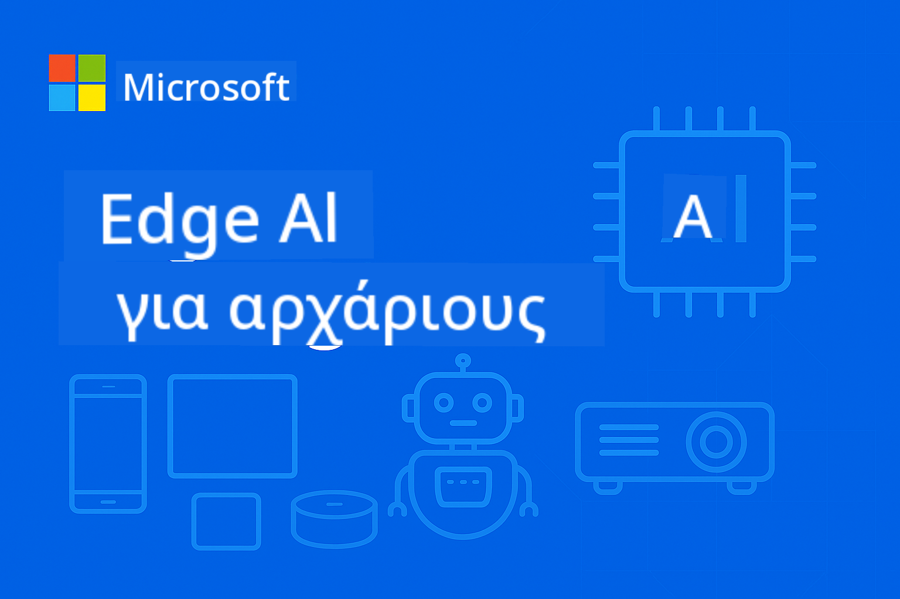

<!--
CO_OP_TRANSLATOR_METADATA:
{
  "original_hash": "dbe223abcd2955df69a08033ff16d389",
  "translation_date": "2025-10-03T07:56:17+00:00",
  "source_file": "README.md",
  "language_code": "el"
}
-->
# EdgeAI για Αρχάριους



[](https://GitHub.com/microsoft/edgeai-for-beginners/graphs/contributors)  
[](https://GitHub.com/microsoft/edgeai-for-beginners/issues)  
[](https://GitHub.com/microsoft/edgeai-for-beginners/pulls)  
[](http://makeapullrequest.com)  

[](https://GitHub.com/microsoft/edgeai-for-beginners/watchers)  
[](https://GitHub.com/microsoft/edgeai-for-beginners/fork)  
[](https://GitHub.com/microsoft/edgeai-for-beginners/stargazers)  

[](https://discord.com/invite/ByRwuEEgH4)

Ακολουθήστε αυτά τα βήματα για να ξεκινήσετε να χρησιμοποιείτε αυτούς τους πόρους:

1. **Διακλαδώστε το Αποθετήριο**: Κάντε κλικ [](https://GitHub.com/microsoft/edgeai-for-beginners/fork)  
2. **Κλωνοποιήστε το Αποθετήριο**: `git clone https://github.com/microsoft/edgeai-for-beginners.git`  
3. [**Γίνετε μέλος στο Azure AI Foundry Discord και γνωρίστε ειδικούς και άλλους προγραμματιστές**](https://discord.com/invite/ByRwuEEgH4)  

### 🌐 Υποστήριξη Πολλαπλών Γλωσσών

#### Υποστηρίζεται μέσω GitHub Action (Αυτοματοποιημένο & Πάντα Ενημερωμένο)

[Αραβικά](../ar/README.md) | [Μπενγκάλι](../bn/README.md) | [Βουλγαρικά](../bg/README.md) | [Βιρμανικά (Μιανμάρ)](../my/README.md) | [Κινέζικα (Απλοποιημένα)](../zh/README.md) | [Κινέζικα (Παραδοσιακά, Χονγκ Κονγκ)](../hk/README.md) | [Κινέζικα (Παραδοσιακά, Μακάου)](../mo/README.md) | [Κινέζικα (Παραδοσιακά, Ταϊβάν)](../tw/README.md) | [Κροατικά](../hr/README.md) | [Τσέχικα](../cs/README.md) | [Δανικά](../da/README.md) | [Ολλανδικά](../nl/README.md) | [Φινλανδικά](../fi/README.md) | [Γαλλικά](../fr/README.md) | [Γερμανικά](../de/README.md) | [Ελληνικά](./README.md) | [Εβραϊκά](../he/README.md) | [Χίντι](../hi/README.md) | [Ουγγρικά](../hu/README.md) | [Ινδονησιακά](../id/README.md) | [Ιταλικά](../it/README.md) | [Ιαπωνικά](../ja/README.md) | [Κορεατικά](../ko/README.md) | [Μαλαισιανά](../ms/README.md) | [Μαραθικά](../mr/README.md) | [Νεπαλικά](../ne/README.md) | [Νορβηγικά](../no/README.md) | [Περσικά (Φαρσί)](../fa/README.md) | [Πολωνικά](../pl/README.md) | [Πορτογαλικά (Βραζιλία)](../br/README.md) | [Πορτογαλικά (Πορτογαλία)](../pt/README.md) | [Παντζάμπι (Γκουρμούκι)](../pa/README.md) | [Ρουμανικά](../ro/README.md) | [Ρωσικά](../ru/README.md) | [Σερβικά (Κυριλλικά)](../sr/README.md) | [Σλοβακικά](../sk/README.md) | [Σλοβενικά](../sl/README.md) | [Ισπανικά](../es/README.md) | [Σουαχίλι](../sw/README.md) | [Σουηδικά](../sv/README.md) | [Ταγκαλόγκ (Φιλιππινέζικα)](../tl/README.md) | [Ταϊλανδικά](../th/README.md) | [Τουρκικά](../tr/README.md) | [Ουκρανικά](../uk/README.md) | [Ουρντού](../ur/README.md) | [Βιετναμέζικα](../vi/README.md)

**Αν θέλετε να υποστηριχθούν επιπλέον γλώσσες, οι διαθέσιμες γλώσσες παρατίθενται [εδώ](https://github.com/Azure/co-op-translator/blob/main/getting_started/supported-languages.md)**  

## Εισαγωγή

Καλώς ήρθατε στο **EdgeAI για Αρχάριους** – το ολοκληρωμένο σας ταξίδι στον μετασχηματιστικό κόσμο της Τεχνητής Νοημοσύνης στο Edge. Αυτό το μάθημα γεφυρώνει το χάσμα μεταξύ ισχυρών δυνατοτήτων AI και πρακτικής, πραγματικής εφαρμογής σε συσκευές edge, δίνοντάς σας τη δυνατότητα να αξιοποιήσετε το δυναμικό της AI απευθείας εκεί όπου δημιουργούνται δεδομένα και λαμβάνονται αποφάσεις.

### Τι θα Μάθετε

Αυτό το μάθημα σας καθοδηγεί από τις βασικές έννοιες έως τις υλοποιήσεις έτοιμες για παραγωγή, καλύπτοντας:
- **Μικρά Γλωσσικά Μοντέλα (SLMs)** βελτιστοποιημένα για ανάπτυξη στο edge
- **Βελτιστοποίηση με γνώμονα το υλικό** σε διάφορες πλατφόρμες
- **Πραγματική πρόβλεψη** με δυνατότητες διατήρησης της ιδιωτικότητας
- **Στρατηγικές ανάπτυξης παραγωγής** για επιχειρηματικές εφαρμογές

### Γιατί Είναι Σημαντικό το EdgeAI

Το Edge AI αντιπροσωπεύει μια αλλαγή παραδείγματος που αντιμετωπίζει κρίσιμες σύγχρονες προκλήσεις:
- **Ιδιωτικότητα & Ασφάλεια**: Επεξεργασία ευαίσθητων δεδομένων τοπικά χωρίς έκθεση στο cloud
- **Πραγματική Απόδοση**: Εξάλειψη καθυστερήσεων δικτύου για εφαρμογές κρίσιμες για τον χρόνο
- **Οικονομική Αποδοτικότητα**: Μείωση εξόδων εύρους ζώνης και υπολογιστικού cloud
- **Ανθεκτική Λειτουργία**: Διατήρηση λειτουργικότητας κατά τη διάρκεια διακοπών δικτύου
- **Συμμόρφωση με Κανονισμούς**: Ικανοποίηση απαιτήσεων κυριαρχίας δεδομένων

### Edge AI

Το Edge AI αναφέρεται στην εκτέλεση αλγορίθμων AI και γλωσσικών μοντέλων τοπικά σε υλικό, κοντά στο σημείο όπου δημιουργούνται δεδομένα, χωρίς να βασίζεται σε πόρους cloud για πρόβλεψη. Μειώνει την καθυστέρηση, ενισχύει την ιδιωτικότητα και επιτρέπει τη λήψη αποφάσεων σε πραγματικό χρόνο.

### Βασικές Αρχές:
- **Πρόβλεψη στη συσκευή**: Τα μοντέλα AI εκτελούνται σε συσκευές edge (τηλέφωνα, δρομολογητές, μικροελεγκτές, βιομηχανικοί υπολογιστές)
- **Δυνατότητα εκτός σύνδεσης**: Λειτουργεί χωρίς συνεχή σύνδεση στο διαδίκτυο
- **Χαμηλή καθυστέρηση**: Άμεσες αποκρίσεις κατάλληλες για συστήματα πραγματικού χρόνου
- **Κυριαρχία δεδομένων**: Διατηρεί ευαίσθητα δεδομένα τοπικά, βελτιώνοντας την ασφάλεια και τη συμμόρφωση

### Μικρά Γλωσσικά Μοντέλα (SLMs)

Τα SLMs όπως τα Phi-4, Mistral-7B και Gemma είναι βελτιστοποιημένες εκδόσεις μεγαλύτερων LLMs—εκπαιδευμένα ή αποσταγμένα για:
- **Μειωμένο αποτύπωμα μνήμης**: Αποτελεσματική χρήση περιορισμένης μνήμης συσκευών edge
- **Χαμηλότερες απαιτήσεις υπολογισμού**: Βελτιστοποιημένα για απόδοση CPU και edge GPU
- **Ταχύτεροι χρόνοι εκκίνησης**: Γρήγορη αρχικοποίηση για εφαρμογές με άμεση απόκριση

Αυτά ξεκλειδώνουν ισχυρές δυνατότητες NLP ενώ πληρούν τους περιορισμούς:
- **Ενσωματωμένων συστημάτων**: Συσκευές IoT και βιομηχανικοί ελεγκτές
- **Κινητών συσκευών**: Smartphones και tablets με δυνατότητες εκτός σύνδεσης
- **Συσκευών IoT**: Αισθητήρες και έξυπνες συσκευές με περιορισμένους πόρους
- **Edge servers**: Τοπικές μονάδες επεξεργασίας με περιορισμένους πόρους GPU
- **Προσωπικών Υπολογιστών**: Σενάρια ανάπτυξης σε επιτραπέζιους και φορητούς υπολογιστές

## Ενότητες Μαθήματος & Πλοήγηση

| Ενότητα | Θέμα | Περιοχή Εστίασης | Κύριο Περιεχόμενο | Επίπεδο | Διάρκεια |
|--------|-------|------------|-------------|--------|----------|
| [📖 00 ](./introduction.md) | [Εισαγωγή στο EdgeAI](./introduction.md) | Βάση & Πλαίσιο | Επισκόπηση EdgeAI • Εφαρμογές Βιομηχανίας • Εισαγωγή SLM • Στόχοι Μάθησης | Αρχάριος | 1-2 ώρες |
| [📚 01](../../Module01) | [Βασικά του EdgeAI](./Module01/README.md) | Σύγκριση Cloud vs Edge AI | Βασικά του EdgeAI • Μελέτες Περιπτώσεων • Οδηγός Υλοποίησης • Ανάπτυξη στο Edge | Αρχάριος | 3-4 ώρες |
| [🧠 02](../../Module02) | [Βάσεις Μοντέλων SLM](./Module02/README.md) | Οικογένειες μοντέλων & αρχιτεκτονική | Οικογένεια Phi • Οικογένεια Qwen • Οικογένεια Gemma • BitNET • μModel • Phi-Silica | Αρχάριος | 4-5 ώρες |
| [🚀 03](../../Module03) | [Πρακτική Ανάπτυξης SLM](./Module03/README.md) | Τοπική & cloud ανάπτυξη | Προχωρημένη Μάθηση • Τοπικό Περιβάλλον • Ανάπτυξη στο Cloud | Μεσαίο | 4-5 ώρες |
| [⚙️ 04](../../Module04) | [Εργαλειοθήκη Βελτιστοποίησης Μοντέλων](./Module04/README.md) | Βελτιστοποίηση σε διάφορες πλατφόρμες | Εισαγωγή • Llama.cpp • Microsoft Olive • OpenVINO • Apple MLX • Σύνθεση Ροής Εργασίας | Μεσαίο | 5-6 ώρες |
| [🔧 05](../../Module05) | [SLMOps Παραγωγή](./Module05/README.md) | Λειτουργίες παραγωγής | Εισαγωγή SLMOps • Απόσταξη Μοντέλων • Fine-tuning • Ανάπτυξη Παραγωγής | Προχωρημένο | 5-6 ώρες |
| [🤖 06](../../Module06) | [AI Agents & Κλήση Λειτουργιών](./Module06/README.md) | Πλαίσια πρακτόρων & MCP | Εισαγωγή Πρακτόρων • Κλήση Λειτουργιών • Πρωτόκολλο Πλαισίου Μοντέλου | Προχωρημένο | 4-5 ώρες |
| [💻 07](../../Module07) | [Υλοποίηση Πλατφόρμας](./Module07/README.md) | Δείγματα σε διάφορες πλατφόρμες | Εργαλειοθήκη AI • Foundry Local • Ανάπτυξη Windows | Προχωρημένο | 3-4 ώρες |
| [🏭 08](../../Module08) | [Εργαλειοθήκη Foundry Local](./Module08/README.md) | Δείγματα έτοιμα για παραγωγή | Εφαρμογές δειγμάτων (δείτε λεπτομέρειες παρακάτω) | Ειδικός | 8-10 ώρες |

### 🏭 **Ενότητα 08: Εφαρμογές Δειγμάτων**

- [01: Γρήγορη Εκκίνηση REST Chat](./Module08/samples/01/README.md)  
- [02: Ενσωμάτωση OpenAI SDK](./Module08/samples/02/README.md)  
- [03: Ανακάλυψη & Αξιολόγηση Μοντέλων](./Module08/samples/03/README.md)  
- [04: Εφαρμογή Chainlit RAG](./Module08/samples/04/README.md)  
- [05: Ορχήστρωση Πολλαπλών Πρακτόρων](./Module08/samples/05/README.md)  
- [06: Δρομολογητής Μοντέλων-ως-Εργαλεία](./Module08/samples/06/README.md)  
- [07: Άμεσος Πελάτης API](./Module08/samples/07/README.md)  
- [08: Εφαρμογή Συνομιλίας Windows 11](./Module08/samples/08/README.md)  
- [09: Προηγμένο Σύστημα Πολλαπλών Πρακτόρων](./Module08/samples/09/README.md)  
- [10: Πλαίσιο Εργαλείων Foundry](./Module08/samples/10/README.md)  

### 📊 **Περίληψη Διαδρομής Μάθησης**
- **Συνολική Διάρκεια**: 36-45 ώρες  
- **Διαδρομή Αρχαρίων**: Ενότητες 01-02 (7-9 ώρες)  
- **Διαδρομή Μεσαίου Επιπέδου**: Ενότητες 03-04 (9-11 ώρες)  
- **Διαδρομή Προχωρημένων**: Ενότητες 05-07 (12-15 ώρες)  
- **Διαδρομή Ειδικών**: Ενότητα 08 (8-10 ώρες)  

## Τι Θα Δημιουργήσετε

### 🎯 Βασικές Δεξιότητες
- **Αρχιτεκτονική Edge AI**: Σχεδιάστε συστήματα AI με τοπική προτεραιότητα και ενσωμάτωση cloud  
- **Βελτιστοποίηση Μοντέλων**: Ποσοτικοποιήστε και συμπιέστε μοντέλα για ανάπτυξη στο edge (85% αύξηση ταχύτητας, 75% μείωση μεγέθους)  
- **Ανάπτυξη σε Πολλαπλές Πλατφόρμες**: Windows, κινητά, ενσωματωμένα και υβριδικά συστήματα cloud-edge  
- **Λειτουργίες Παραγωγής**: Παρακολούθηση, κλιμάκωση και συντήρηση του Edge AI σε παραγωγή  

### 🏗️ Πρακτικά Έργα
- **Εφαρμογές Συνομιλίας Foundry Local
3. **🚀 Παραγωγή** (Ενότητες 05-06): SLMOps + AI agents + κλήση λειτουργιών  
4. **💻 Υλοποίηση** (Ενότητες 07-08): Δείγματα πλατφόρμας + Εργαλειοθήκη Foundry Local  

Κάθε ενότητα περιλαμβάνει θεωρία, πρακτικές ασκήσεις και δείγματα κώδικα έτοιμα για παραγωγή.

## Επίδραση στην Καριέρα

**Τεχνικοί Ρόλοι**: Αρχιτέκτονας Λύσεων EdgeAI • Μηχανικός ML (Edge) • Προγραμματιστής IoT AI • Προγραμματιστής Mobile AI  

**Βιομηχανικοί Τομείς**: Κατασκευή 4.0 • Τεχνολογία Υγείας • Αυτόνομα Συστήματα • FinTech • Καταναλωτικά Ηλεκτρονικά  

**Έργα Portfolio**: Συστήματα πολλαπλών πρακτόρων • Εφαρμογές RAG παραγωγής • Ανάπτυξη σε πολλαπλές πλατφόρμες • Βελτιστοποίηση απόδοσης  

## Δομή Αποθετηρίου

```
edgeai-for-beginners/
├── 📖 introduction.md  # Foundation: EdgeAI Overview & Learning Framework
├── 📚 Module01-04/     # Fundamentals → SLMs → Deployment → Optimization  
├── 🔧 Module05-06/     # SLMOps → AI Agents → Function Calling
├── 💻 Module07/        # Platform Samples (VS Code, Windows, Jetson, Mobile)
├── 🏭 Module08/        # Foundry Local Toolkit + 10 Comprehensive Samples
│   ├── samples/01-06/  # Foundation: REST, SDK, RAG, Agents, Routing
│   └── samples/07-10/  # Advanced: API Client, Windows App, Enterprise Agents, Tools
├── 🌐 translations/    # Multi-language support (8+ languages)
└── 📋 STUDY_GUIDE.md   # Structured learning paths & time allocation
```
  

## Σημεία Αναφοράς Μαθήματος

✅ **Προοδευτική Μάθηση**: Θεωρία → Πρακτική → Ανάπτυξη παραγωγής  
✅ **Πραγματικές Μελέτες Περίπτωσης**: Microsoft, Japan Airlines, εταιρικές υλοποιήσεις  
✅ **Πρακτικά Δείγματα**: 50+ παραδείγματα, 10 ολοκληρωμένα demos Foundry Local  
✅ **Εστίαση στην Απόδοση**: 85% βελτιώσεις ταχύτητας, 75% μειώσεις μεγέθους  
✅ **Πολλαπλές Πλατφόρμες**: Windows, κινητά, ενσωματωμένα, υβριδικό cloud-edge  
✅ **Έτοιμο για Παραγωγή**: Παρακολούθηση, κλιμάκωση, ασφάλεια, πλαίσια συμμόρφωσης  

📖 **[Διαθέσιμος Οδηγός Μελέτης](STUDY_GUIDE.md)**: Δομημένο μονοπάτι μάθησης 20 ωρών με καθοδήγηση κατανομής χρόνου και εργαλεία αυτοαξιολόγησης.

---

**Το EdgeAI αντιπροσωπεύει το μέλλον της ανάπτυξης AI**: τοπικό πρώτα, με σεβασμό στην ιδιωτικότητα και αποδοτικό. Κατακτήστε αυτές τις δεξιότητες για να δημιουργήσετε την επόμενη γενιά έξυπνων εφαρμογών.

## Άλλα Μαθήματα

Η ομάδα μας προσφέρει και άλλα μαθήματα! Δείτε:

- [MCP για Αρχάριους](https://github.com/microsoft/mcp-for-beginners)  
- [AI Agents για Αρχάριους](https://github.com/microsoft/ai-agents-for-beginners?WT.mc_id=academic-105485-koreyst)  
- [Generative AI για Αρχάριους με χρήση .NET](https://github.com/microsoft/Generative-AI-for-beginners-dotnet?WT.mc_id=academic-105485-koreyst)  
- [Generative AI για Αρχάριους με χρήση JavaScript](https://github.com/microsoft/generative-ai-with-javascript?WT.mc_id=academic-105485-koreyst)  
- [Generative AI για Αρχάριους](https://github.com/microsoft/generative-ai-for-beginners?WT.mc_id=academic-105485-koreyst)  
- [ML για Αρχάριους](https://aka.ms/ml-beginners?WT.mc_id=academic-105485-koreyst)  
- [Data Science για Αρχάριους](https://aka.ms/datascience-beginners?WT.mc_id=academic-105485-koreyst)  
- [AI για Αρχάριους](https://aka.ms/ai-beginners?WT.mc_id=academic-105485-koreyst)  
- [Cybersecurity για Αρχάριους](https://github.com/microsoft/Security-101??WT.mc_id=academic-96948-sayoung)  
- [Web Dev για Αρχάριους](https://aka.ms/webdev-beginners?WT.mc_id=academic-105485-koreyst)  
- [IoT για Αρχάριους](https://aka.ms/iot-beginners?WT.mc_id=academic-105485-koreyst)  
- [XR Development για Αρχάριους](https://github.com/microsoft/xr-development-for-beginners?WT.mc_id=academic-105485-koreyst)  
- [Mastering GitHub Copilot για AI Paired Programming](https://aka.ms/GitHubCopilotAI?WT.mc_id=academic-105485-koreyst)  
- [Mastering GitHub Copilot για Προγραμματιστές C#/.NET](https://github.com/microsoft/mastering-github-copilot-for-dotnet-csharp-developers?WT.mc_id=academic-105485-koreyst)  
- [Choose Your Own Copilot Adventure](https://github.com/microsoft/CopilotAdventures?WT.mc_id=academic-105485-koreyst)  

## Λήψη Βοήθειας

Αν κολλήσετε ή έχετε ερωτήσεις σχετικά με την ανάπτυξη AI εφαρμογών, συμμετάσχετε:

[](https://aka.ms/foundry/discord)  

Αν έχετε σχόλια για το προϊόν ή αντιμετωπίζετε σφάλματα κατά την ανάπτυξη, επισκεφθείτε:

[](https://aka.ms/foundry/forum)  

---

**Αποποίηση ευθύνης**:  
Αυτό το έγγραφο έχει μεταφραστεί χρησιμοποιώντας την υπηρεσία αυτόματης μετάφρασης [Co-op Translator](https://github.com/Azure/co-op-translator). Παρόλο που καταβάλλουμε προσπάθειες για ακρίβεια, παρακαλούμε να έχετε υπόψη ότι οι αυτόματες μεταφράσεις ενδέχεται να περιέχουν λάθη ή ανακρίβειες. Το πρωτότυπο έγγραφο στη μητρική του γλώσσα θα πρέπει να θεωρείται η αυθεντική πηγή. Για κρίσιμες πληροφορίες, συνιστάται επαγγελματική ανθρώπινη μετάφραση. Δεν φέρουμε ευθύνη για τυχόν παρεξηγήσεις ή εσφαλμένες ερμηνείες που προκύπτουν από τη χρήση αυτής της μετάφρασης.