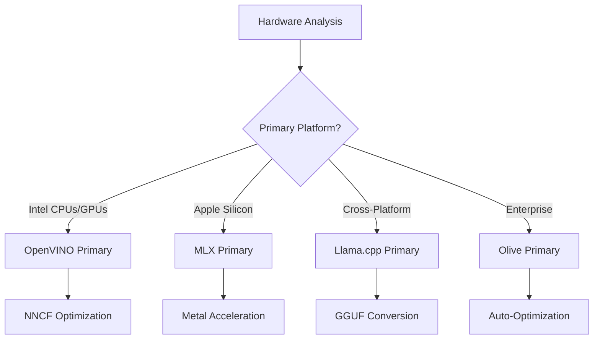
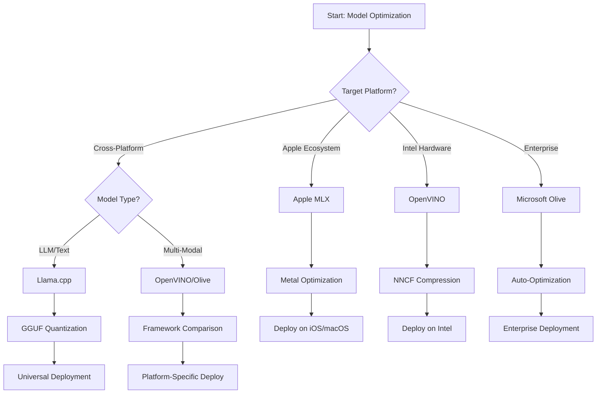
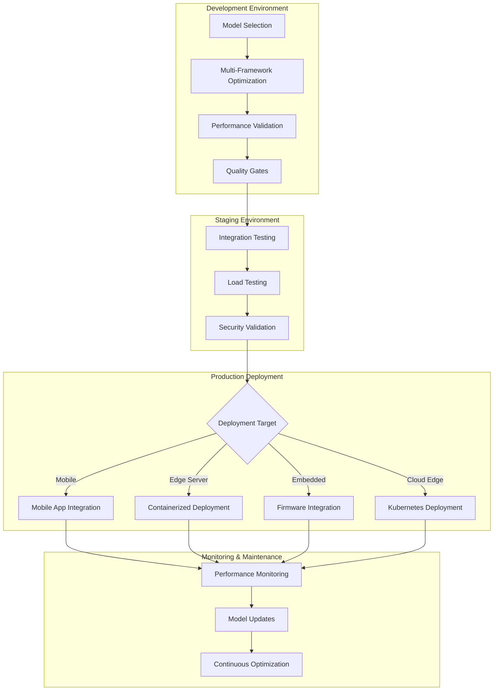

<!--
CO_OP_TRANSLATOR_METADATA:
{
  "original_hash": "6719c4a7e44b948230ac5f5cab3699bd",
  "translation_date": "2025-09-17T13:26:38+00:00",
  "source_file": "Module04/06.workflow-synthesis.md",
  "language_code": "es"
}
-->
# Sección 6: Síntesis del Flujo de Trabajo para el Desarrollo de Edge AI

## Tabla de Contenidos
1. [Introducción](../../../Module04)
2. [Objetivos de Aprendizaje](../../../Module04)
3. [Resumen del Flujo de Trabajo Unificado](../../../Module04)
4. [Matriz de Selección de Frameworks](../../../Module04)
5. [Síntesis de Mejores Prácticas](../../../Module04)
6. [Guía de Estrategia de Despliegue](../../../Module04)
7. [Flujo de Trabajo para la Optimización del Rendimiento](../../../Module04)
8. [Lista de Verificación para Preparación de Producción](../../../Module04)
9. [Solución de Problemas y Monitoreo](../../../Module04)
10. [Preparación para el Futuro de tu Pipeline de Edge AI](../../../Module04)

## Introducción

El desarrollo de Edge AI requiere un entendimiento sofisticado de múltiples frameworks de optimización, estrategias de despliegue y consideraciones de hardware. Esta síntesis integral reúne el conocimiento de Llama.cpp, Microsoft Olive, OpenVINO y Apple MLX para crear un flujo de trabajo unificado que maximiza la eficiencia, mantiene la calidad y asegura un despliegue exitoso en producción.

A lo largo de este curso, hemos explorado frameworks de optimización individuales, cada uno con fortalezas únicas y casos de uso especializados. Sin embargo, los proyectos reales de Edge AI a menudo requieren combinar técnicas de múltiples frameworks o tomar decisiones estratégicas sobre qué enfoque ofrecerá los mejores resultados según las restricciones y requisitos específicos.

Esta sección sintetiza la sabiduría colectiva de todos los frameworks en flujos de trabajo accionables, árboles de decisión y mejores prácticas que te permitirán construir soluciones de Edge AI listas para producción de manera eficiente y efectiva. Ya sea que estés optimizando para dispositivos móviles, sistemas embebidos o servidores edge, esta guía proporciona el marco estratégico para tomar decisiones informadas a lo largo de tu ciclo de desarrollo.

## Objetivos de Aprendizaje

Al final de esta sección, serás capaz de:

### Toma de Decisiones Estratégicas
- **Evaluar y seleccionar** el framework de optimización óptimo basado en los requisitos del proyecto, las restricciones de hardware y los escenarios de despliegue.
- **Diseñar flujos de trabajo integrales** que integren múltiples técnicas de optimización para máxima eficiencia.
- **Evaluar compensaciones** entre precisión del modelo, velocidad de inferencia, uso de memoria y complejidad de despliegue en diferentes frameworks.

### Integración de Flujos de Trabajo
- **Implementar pipelines de desarrollo unificados** que aprovechen las fortalezas de múltiples frameworks de optimización.
- **Crear flujos de trabajo reproducibles** para una optimización y despliegue consistentes de modelos en diferentes entornos.
- **Establecer puertas de calidad** y procesos de validación para garantizar que los modelos optimizados cumplan con los requisitos de producción.

### Optimización del Rendimiento
- **Aplicar estrategias de optimización sistemáticas** utilizando cuantización, poda y técnicas de aceleración específicas de hardware.
- **Monitorear y evaluar** el rendimiento del modelo en diferentes niveles de optimización y objetivos de despliegue.
- **Optimizar para plataformas de hardware específicas** incluyendo CPU, GPU, NPU y aceleradores edge especializados.

### Despliegue en Producción
- **Diseñar arquitecturas de despliegue escalables** que acomoden múltiples formatos de modelos y motores de inferencia.
- **Implementar monitoreo y observabilidad** para aplicaciones de Edge AI en entornos de producción.
- **Establecer flujos de trabajo de mantenimiento** para actualizaciones de modelos, monitoreo de rendimiento y optimización del sistema.

### Excelencia Multiplataforma
- **Desplegar modelos optimizados** en diversas plataformas de hardware manteniendo un rendimiento consistente.
- **Manejar optimizaciones específicas de plataforma** para Windows, macOS, Linux, móviles y sistemas embebidos.
- **Crear capas de abstracción** que permitan un despliegue fluido en diferentes entornos edge.

## Resumen del Flujo de Trabajo Unificado

### Fase 1: Análisis de Requisitos y Selección de Framework

El éxito en el despliegue de Edge AI comienza con un análisis exhaustivo de requisitos que informa la selección del framework y la estrategia de optimización.

#### 1.1 Evaluación de Hardware


**Consideraciones Clave:**
- **Arquitectura de CPU**: Capacidades de x86, ARM, Apple Silicon.
- **Disponibilidad de Aceleradores**: GPU, NPU, VPU, chips de IA especializados.
- **Restricciones de Memoria**: Limitaciones de RAM, capacidad de almacenamiento.
- **Presupuesto de Energía**: Duración de batería, restricciones térmicas.
- **Conectividad**: Requisitos offline, limitaciones de ancho de banda.

#### 1.2 Matriz de Requisitos de Aplicación

| Requisito | Llama.cpp | Microsoft Olive | OpenVINO | Apple MLX |
|-----------|-----------|-----------------|----------|-----------|
| Multiplataforma | ✅ Excelente | ⚡ Bueno | ⚡ Bueno | ❌ Solo Apple |
| Integración Empresarial | ⚡ Básico | ✅ Excelente | ✅ Excelente | ⚡ Limitado |
| Despliegue Móvil | ✅ Excelente | ⚡ Bueno | ⚡ Bueno | ✅ Excelente en iOS |
| Inferencia en Tiempo Real | ✅ Excelente | ✅ Excelente | ✅ Excelente | ✅ Excelente |
| Diversidad de Modelos | ✅ Enfoque en LLM | ✅ Todos los Modelos | ✅ Todos los Modelos | ✅ Enfoque en LLM |
| Facilidad de Uso | ✅ Simple | ✅ Automatizado | ⚡ Moderado | ✅ Simple |

### Fase 2: Preparación y Optimización del Modelo

#### 2.1 Pipeline Universal de Evaluación de Modelos

```python
# Universal Model Assessment Framework
class EdgeAIModelAssessment:
    def __init__(self, model_path, target_hardware):
        self.model_path = model_path
        self.target_hardware = target_hardware
        self.optimization_frameworks = []
        
    def assess_model_characteristics(self):
        """Analyze model size, architecture, and complexity"""
        return {
            'model_size': self.get_model_size(),
            'parameter_count': self.get_parameter_count(),
            'architecture_type': self.detect_architecture(),
            'quantization_compatibility': self.check_quantization_support()
        }
    
    def recommend_optimization_strategy(self):
        """Recommend optimal frameworks and techniques"""
        characteristics = self.assess_model_characteristics()
        
        if self.target_hardware.startswith('apple'):
            return self.mlx_optimization_strategy(characteristics)
        elif self.target_hardware.startswith('intel'):
            return self.openvino_optimization_strategy(characteristics)
        elif characteristics['model_size'] > 7_000_000_000:  # 7B+ parameters
            return self.enterprise_optimization_strategy(characteristics)
        else:
            return self.lightweight_optimization_strategy(characteristics)
```

#### 2.2 Pipeline de Optimización Multi-Framework

**Enfoque de Optimización Secuencial:**
1. **Conversión Inicial**: Convertir a formato intermedio (ONNX cuando sea posible).
2. **Optimización Específica del Framework**: Aplicar técnicas especializadas.
3. **Validación Cruzada**: Verificar rendimiento en plataformas objetivo.
4. **Empaquetado Final**: Preparar para el despliegue.

```bash
# Multi-Framework Optimization Script
#!/bin/bash

MODEL_NAME="phi-3-mini"
BASE_MODEL="microsoft/Phi-3-mini-4k-instruct"

# Phase 1: ONNX Conversion (Universal)
python convert_to_onnx.py --model $BASE_MODEL --output models/onnx/

# Phase 2: Platform-Specific Optimization
if [[ "$TARGET_PLATFORM" == "intel" ]]; then
    # OpenVINO Optimization
    python optimize_openvino.py --input models/onnx/ --output models/openvino/
elif [[ "$TARGET_PLATFORM" == "apple" ]]; then
    # MLX Optimization
    python optimize_mlx.py --input $BASE_MODEL --output models/mlx/
elif [[ "$TARGET_PLATFORM" == "cross" ]]; then
    # Llama.cpp Optimization
    python convert_to_gguf.py --input models/onnx/ --output models/gguf/
fi

# Phase 3: Validation
python validate_optimization.py --original $BASE_MODEL --optimized models/$TARGET_PLATFORM/
```

### Fase 3: Validación de Rendimiento y Evaluación

#### 3.1 Framework Integral de Evaluación

```python
class EdgeAIBenchmark:
    def __init__(self, optimized_models):
        self.models = optimized_models
        self.metrics = {
            'inference_time': [],
            'memory_usage': [],
            'accuracy_score': [],
            'throughput': [],
            'energy_consumption': []
        }
    
    def run_comprehensive_benchmark(self):
        """Execute standardized benchmarks across all optimized models"""
        test_inputs = self.generate_test_inputs()
        
        for model_framework, model_path in self.models.items():
            print(f"Benchmarking {model_framework}...")
            
            # Latency Testing
            latency = self.measure_inference_latency(model_path, test_inputs)
            
            # Memory Profiling
            memory = self.profile_memory_usage(model_path)
            
            # Accuracy Validation
            accuracy = self.validate_model_accuracy(model_path, test_inputs)
            
            # Throughput Analysis
            throughput = self.measure_throughput(model_path)
            
            self.record_metrics(model_framework, latency, memory, accuracy, throughput)
    
    def generate_optimization_report(self):
        """Create comprehensive comparison report"""
        report = {
            'recommendations': self.analyze_performance_trade_offs(),
            'deployment_guidance': self.generate_deployment_recommendations(),
            'monitoring_requirements': self.define_monitoring_metrics()
        }
        return report
```

## Matriz de Selección de Frameworks

### Árbol de Decisión para Selección de Framework



### Criterios de Selección Integral

#### 1. Alineación con el Caso de Uso Principal

**Modelos de Lenguaje Extenso (LLMs):**
- **Llama.cpp**: Mejor para despliegue multiplataforma centrado en CPU.
- **Apple MLX**: Óptimo para Apple Silicon con memoria unificada.
- **OpenVINO**: Excelente para hardware Intel con optimización NNCF.
- **Microsoft Olive**: Ideal para flujos de trabajo empresariales con automatización.

**Modelos Multimodales:**
- **OpenVINO**: Soporte integral para visión, audio y texto.
- **Microsoft Olive**: Optimización de grado empresarial para pipelines complejos.
- **Llama.cpp**: Limitado a modelos basados en texto.
- **Apple MLX**: Soporte creciente para aplicaciones multimodales.

#### 2. Matriz de Plataformas de Hardware

| Plataforma | Framework Principal | Opción Secundaria | Características Especializadas |
|------------|---------------------|-------------------|-------------------------------|
| CPU/GPU Intel | OpenVINO | Microsoft Olive | Compresión NNCF, optimización Intel |
| GPU NVIDIA | Microsoft Olive | OpenVINO | Aceleración CUDA, características empresariales |
| Apple Silicon | Apple MLX | Llama.cpp | Sombras Metal, memoria unificada |
| ARM Móvil | Llama.cpp | OpenVINO | Multiplataforma, dependencias mínimas |
| Edge TPU | OpenVINO | Microsoft Olive | Soporte especializado para aceleradores |
| ARM Embebido | Llama.cpp | OpenVINO | Huella mínima, inferencia eficiente |

#### 3. Preferencias de Flujo de Trabajo de Desarrollo

**Prototipado Rápido:**
1. **Llama.cpp**: Configuración más rápida, resultados inmediatos.
2. **Apple MLX**: API de Python simple, iteración rápida.
3. **Microsoft Olive**: Optimización automatizada, configuración mínima.
4. **OpenVINO**: Configuración más compleja, características completas.

**Producción Empresarial:**
1. **Microsoft Olive**: Características empresariales, integración con Azure.
2. **OpenVINO**: Ecosistema Intel, herramientas completas.
3. **Apple MLX**: Aplicaciones empresariales específicas de Apple.
4. **Llama.cpp**: Despliegue simple, características empresariales limitadas.

## Síntesis de Mejores Prácticas

### Principios Universales de Optimización

#### 1. Estrategia de Optimización Progresiva

```python
class ProgressiveOptimization:
    def __init__(self, base_model):
        self.base_model = base_model
        self.optimization_stages = [
            'baseline_measurement',
            'format_conversion',
            'quantization_optimization',
            'hardware_acceleration',
            'production_validation'
        ]
    
    def execute_progressive_optimization(self):
        """Apply optimization techniques incrementally"""
        
        # Stage 1: Baseline Measurement
        baseline_metrics = self.measure_baseline_performance()
        
        # Stage 2: Format Conversion
        converted_model = self.convert_to_optimal_format()
        conversion_metrics = self.measure_performance(converted_model)
        
        # Stage 3: Quantization
        quantized_model = self.apply_quantization(converted_model)
        quantization_metrics = self.measure_performance(quantized_model)
        
        # Stage 4: Hardware Acceleration
        accelerated_model = self.enable_hardware_acceleration(quantized_model)
        acceleration_metrics = self.measure_performance(accelerated_model)
        
        # Stage 5: Validation
        production_ready = self.validate_for_production(accelerated_model)
        
        return self.compile_optimization_report(
            baseline_metrics, conversion_metrics, 
            quantization_metrics, acceleration_metrics
        )
```

#### 2. Implementación de Puertas de Calidad

**Puertas de Preservación de Precisión:**
- Mantener >95% de la precisión original del modelo.
- Validar con conjuntos de datos de prueba representativos.
- Implementar pruebas A/B para validación en producción.

**Puertas de Mejora de Rendimiento:**
- Lograr al menos 2x de mejora en velocidad.
- Reducir el uso de memoria en al menos 50%.
- Validar consistencia en tiempos de inferencia.

**Puertas de Preparación para Producción:**
- Pasar pruebas de estrés bajo carga.
- Demostrar rendimiento estable a lo largo del tiempo.
- Validar requisitos de seguridad y privacidad.

### Integración de Mejores Prácticas Específicas de Framework

#### 1. Síntesis de Estrategias de Cuantización

```python
# Unified Quantization Approach
class UnifiedQuantizationStrategy:
    def __init__(self, model, target_platform):
        self.model = model
        self.platform = target_platform
        
    def select_optimal_quantization(self):
        """Choose best quantization based on platform and requirements"""
        
        if self.platform == 'apple_silicon':
            return self.mlx_quantization_strategy()
        elif self.platform == 'intel_hardware':
            return self.openvino_quantization_strategy()
        elif self.platform == 'cross_platform':
            return self.llamacpp_quantization_strategy()
        else:
            return self.olive_quantization_strategy()
    
    def mlx_quantization_strategy(self):
        """Apple MLX-specific quantization"""
        return {
            'method': 'mlx_quantize',
            'precision': 'int4',
            'group_size': 64,
            'optimization_target': 'unified_memory'
        }
    
    def openvino_quantization_strategy(self):
        """OpenVINO NNCF quantization"""
        return {
            'method': 'nncf_quantize',
            'precision': 'int8',
            'calibration_method': 'post_training',
            'optimization_target': 'intel_hardware'
        }
```

#### 2. Optimización de Aceleración de Hardware

**Síntesis de Optimización para CPU:**
- **Instrucciones SIMD**: Aprovechar kernels optimizados en todos los frameworks.
- **Ancho de Banda de Memoria**: Optimizar diseños de datos para eficiencia de caché.
- **Multiprocesamiento**: Balancear paralelismo con restricciones de recursos.

**Mejores Prácticas para Aceleración en GPU:**
- **Procesamiento por Lotes**: Maximizar el rendimiento con tamaños de lote adecuados.
- **Gestión de Memoria**: Optimizar asignación y transferencias de memoria GPU.
- **Precisión**: Usar FP16 cuando sea compatible para mejor rendimiento.

**Optimización para NPU/Aceleradores Especializados:**
- **Arquitectura del Modelo**: Asegurar compatibilidad con capacidades del acelerador.
- **Flujo de Datos**: Optimizar pipelines de entrada/salida para eficiencia del acelerador.
- **Estrategias de Respaldo**: Implementar respaldo en CPU para operaciones no compatibles.

## Guía de Estrategia de Despliegue

### Arquitectura Universal de Despliegue



### Patrones de Despliegue Específicos de Plataforma

#### 1. Estrategia de Despliegue Móvil

```yaml
# Mobile Deployment Configuration
mobile_deployment:
  ios:
    framework: apple_mlx
    optimization:
      quantization: int4
      memory_mapping: true
      background_execution: limited
    packaging:
      format: mlx
      bundle_size: <50MB
      
  android:
    framework: llama_cpp
    optimization:
      quantization: q4_k_m
      threading: android_optimized
      memory_management: conservative
    packaging:
      format: gguf
      apk_size: <100MB
      
  cross_platform:
    framework: onnx_runtime
    optimization:
      quantization: int8
      execution_provider: cpu
    packaging:
      format: onnx
      shared_libraries: minimal
```

#### 2. Despliegue en Servidores Edge

```yaml
# Edge Server Deployment Configuration
edge_server:
  intel_based:
    framework: openvino
    optimization:
      quantization: int8
      acceleration: cpu_gpu_auto
      batch_processing: dynamic
    deployment:
      container: openvino_runtime
      orchestration: kubernetes
      scaling: horizontal
      
  nvidia_based:
    framework: microsoft_olive
    optimization:
      quantization: int4
      acceleration: cuda
      tensor_parallelism: true
    deployment:
      container: nvidia_triton
      orchestration: kubernetes
      scaling: gpu_aware
```

### Mejores Prácticas de Contenerización

```dockerfile
# Multi-Framework Edge AI Container
FROM ubuntu:22.04 as base

# Install common dependencies
RUN apt-get update && apt-get install -y \
    python3 \
    python3-pip \
    build-essential \
    cmake \
    && rm -rf /var/lib/apt/lists/*

# Framework-specific stages
FROM base as openvino
RUN pip install openvino nncf optimum[intel]

FROM base as llamacpp
RUN git clone https://github.com/ggerganov/llama.cpp.git \
    && cd llama.cpp && make LLAMA_OPENBLAS=1

FROM base as olive
RUN pip install olive-ai[auto-opt] onnxruntime-genai

# Production stage with selected framework
FROM openvino as production
COPY models/ /app/models/
COPY src/ /app/src/
WORKDIR /app

EXPOSE 8080
CMD ["python3", "src/inference_server.py"]
```

## Flujo de Trabajo para la Optimización del Rendimiento

### Ajuste Sistemático del Rendimiento

#### 1. Pipeline de Perfilado de Rendimiento

```python
class EdgeAIPerformanceProfiler:
    def __init__(self, model_path, framework):
        self.model_path = model_path
        self.framework = framework
        self.profiling_results = {}
    
    def comprehensive_profiling(self):
        """Execute comprehensive performance analysis"""
        
        # CPU Profiling
        cpu_profile = self.profile_cpu_usage()
        
        # Memory Profiling
        memory_profile = self.profile_memory_usage()
        
        # Inference Latency
        latency_profile = self.profile_inference_latency()
        
        # Throughput Analysis
        throughput_profile = self.profile_throughput()
        
        # Energy Consumption (where available)
        energy_profile = self.profile_energy_consumption()
        
        return self.compile_performance_report(
            cpu_profile, memory_profile, latency_profile,
            throughput_profile, energy_profile
        )
    
    def identify_bottlenecks(self):
        """Automatically identify performance bottlenecks"""
        bottlenecks = []
        
        if self.profiling_results['cpu_utilization'] > 80:
            bottlenecks.append('cpu_bound')
        
        if self.profiling_results['memory_usage'] > 90:
            bottlenecks.append('memory_bound')
        
        if self.profiling_results['inference_variance'] > 20:
            bottlenecks.append('inconsistent_performance')
        
        return self.generate_optimization_recommendations(bottlenecks)
```

#### 2. Pipeline de Optimización Automatizada

```python
class AutomatedOptimizationPipeline:
    def __init__(self, base_model, target_constraints):
        self.base_model = base_model
        self.constraints = target_constraints
        self.optimization_history = []
    
    def execute_optimization_search(self):
        """Systematically search optimization space"""
        
        optimization_candidates = [
            {'quantization': 'int8', 'pruning': 0.1},
            {'quantization': 'int4', 'pruning': 0.2},
            {'quantization': 'int8', 'acceleration': 'gpu'},
            {'quantization': 'int4', 'acceleration': 'npu'}
        ]
        
        best_configuration = None
        best_score = 0
        
        for config in optimization_candidates:
            optimized_model = self.apply_optimization(config)
            score = self.evaluate_optimization(optimized_model)
            
            if score > best_score and self.meets_constraints(optimized_model):
                best_score = score
                best_configuration = config
            
            self.optimization_history.append({
                'config': config,
                'score': score,
                'model': optimized_model
            })
        
        return best_configuration, self.optimization_history
```

### Optimización Multiobjetivo

#### 1. Optimización de Pareto para Edge AI

```python
class ParetoOptimization:
    def __init__(self, objectives=['speed', 'accuracy', 'memory']):
        self.objectives = objectives
        self.pareto_frontier = []
    
    def find_pareto_optimal_solutions(self, optimization_results):
        """Identify Pareto-optimal configurations"""
        
        for result in optimization_results:
            is_dominated = False
            
            for frontier_point in self.pareto_frontier:
                if self.dominates(frontier_point, result):
                    is_dominated = True
                    break
            
            if not is_dominated:
                # Remove dominated points from frontier
                self.pareto_frontier = [
                    point for point in self.pareto_frontier 
                    if not self.dominates(result, point)
                ]
                
                self.pareto_frontier.append(result)
        
        return self.pareto_frontier
    
    def recommend_configuration(self, user_preferences):
        """Recommend configuration based on user preferences"""
        
        weighted_scores = []
        for config in self.pareto_frontier:
            score = sum(
                user_preferences[obj] * config['metrics'][obj] 
                for obj in self.objectives
            )
            weighted_scores.append((score, config))
        
        return max(weighted_scores, key=lambda x: x[0])[1]
```

## Lista de Verificación para Preparación de Producción

### Validación Integral de Producción

#### 1. Garantía de Calidad del Modelo

```python
class ProductionReadinessValidator:
    def __init__(self, optimized_model, production_requirements):
        self.model = optimized_model
        self.requirements = production_requirements
        self.validation_results = {}
    
    def validate_model_quality(self):
        """Comprehensive model quality validation"""
        
        # Accuracy Validation
        accuracy_result = self.validate_accuracy()
        
        # Performance Validation
        performance_result = self.validate_performance()
        
        # Robustness Testing
        robustness_result = self.validate_robustness()
        
        # Security Assessment
        security_result = self.validate_security()
        
        # Compliance Verification
        compliance_result = self.validate_compliance()
        
        return self.compile_validation_report(
            accuracy_result, performance_result, robustness_result,
            security_result, compliance_result
        )
    
    def generate_certification_report(self):
        """Generate production certification report"""
        return {
            'model_signature': self.generate_model_signature(),
            'validation_timestamp': datetime.now(),
            'validation_results': self.validation_results,
            'deployment_approval': self.check_deployment_approval(),
            'monitoring_requirements': self.define_monitoring_requirements()
        }
```

#### 2. Lista de Verificación para Despliegue en Producción

**Validación Pre-Despliegue:**
- [ ] La precisión del modelo cumple con los requisitos mínimos (>95% del modelo base).
- [ ] Se alcanzan los objetivos de rendimiento (latencia, rendimiento, memoria).
- [ ] Vulnerabilidades de seguridad evaluadas y mitigadas.
- [ ] Pruebas de estrés completadas bajo carga esperada.
- [ ] Escenarios de falla probados y procedimientos de recuperación validados.
- [ ] Sistemas de monitoreo y alertas configurados.
- [ ] Procedimientos de reversión probados y documentados.

**Proceso de Despliegue:**
- [ ] Estrategia de despliegue blue-green implementada.
- [ ] Configuración de aumento gradual de tráfico.
- [ ] Tableros de monitoreo en tiempo real activos.
- [ ] Líneas base de rendimiento establecidas.
- [ ] Umbrales de tasa de error definidos.
- [ ] Triggers de reversión automatizados configurados.

**Monitoreo Post-Despliegue:**
- [ ] Detección de deriva del modelo activa.
- [ ] Alertas de degradación de rendimiento configuradas.
- [ ] Monitoreo de utilización de recursos habilitado.
- [ ] Métricas de experiencia del usuario rastreadas.
- [ ] Versionado y linaje del modelo mantenidos.
- [ ] Revisiones regulares de rendimiento del modelo programadas.

### Integración Continua/Despliegue Continuo (CI/CD)

```yaml
# Edge AI CI/CD Pipeline Configuration
edge_ai_pipeline:
  stages:
    - model_validation
    - optimization
    - testing
    - staging_deployment
    - production_deployment
    - monitoring
  
  model_validation:
    accuracy_threshold: 0.95
    performance_baseline: required
    security_scan: enabled
    
  optimization:
    frameworks:
      - llama_cpp
      - openvino
      - microsoft_olive
    validation:
      cross_validation: enabled
      performance_comparison: required
      
  testing:
    unit_tests: comprehensive
    integration_tests: full_pipeline
    load_tests: production_scale
    security_tests: comprehensive
    
  deployment:
    strategy: blue_green
    traffic_ramping: gradual
    rollback: automatic
    monitoring: real_time
```

## Solución de Problemas y Monitoreo

### Marco Universal de Solución de Problemas

#### 1. Problemas Comunes y Soluciones

**Problemas de Rendimiento:**
```python
class PerformanceTroubleshooter:
    def __init__(self, model_metrics):
        self.metrics = model_metrics
        
    def diagnose_performance_issues(self):
        """Systematic performance issue diagnosis"""
        
        issues = []
        
        # High latency diagnosis
        if self.metrics['avg_latency'] > self.metrics['target_latency']:
            issues.append(self.diagnose_latency_issues())
        
        # Memory usage diagnosis
        if self.metrics['memory_usage'] > self.metrics['memory_limit']:
            issues.append(self.diagnose_memory_issues())
        
        # Throughput diagnosis
        if self.metrics['throughput'] < self.metrics['target_throughput']:
            issues.append(self.diagnose_throughput_issues())
        
        return self.generate_resolution_plan(issues)
    
    def diagnose_latency_issues(self):
        """Specific latency troubleshooting"""
        potential_causes = []
        
        if self.metrics['cpu_utilization'] > 80:
            potential_causes.append('cpu_bottleneck')
        
        if self.metrics['memory_bandwidth'] > 90:
            potential_causes.append('memory_bandwidth_limit')
        
        if self.metrics['model_size'] > self.metrics['optimal_size']:
            potential_causes.append('model_too_large')
        
        return {
            'issue': 'high_latency',
            'causes': potential_causes,
            'solutions': self.generate_latency_solutions(potential_causes)
        }
```

**Solución de Problemas Específica de Framework:**

| Problema | Llama.cpp | Microsoft Olive | OpenVINO | Apple MLX |
|----------|-----------|-----------------|----------|-----------|
| Problemas de Memoria | Reducir longitud de contexto | Reducir tamaño de lote | Habilitar caché | Usar mapeo de memoria |
| Inferencia Lenta | Habilitar SIMD | Verificar cuantización | Optimizar multiprocesamiento | Habilitar Metal |
| Pérdida de Precisión | Cuantización más alta | Reentrenar con QAT | Incrementar calibración | Ajustar post-cuantización |
| Compatibilidad | Verificar formato del modelo | Verificar versión del framework | Actualizar drivers | Verificar versión de macOS |

#### 2. Estrategia de Monitoreo en Producción

```python
class EdgeAIMonitoring:
    def __init__(self, deployment_config):
        self.config = deployment_config
        self.metrics_collectors = []
        self.alerting_rules = []
    
    def setup_comprehensive_monitoring(self):
        """Configure comprehensive monitoring for Edge AI deployment"""
        
        # Model Performance Monitoring
        self.setup_model_performance_monitoring()
        
        # Infrastructure Monitoring
        self.setup_infrastructure_monitoring()
        
        # Business Metrics Monitoring
        self.setup_business_metrics_monitoring()
        
        # Security Monitoring
        self.setup_security_monitoring()
    
    def setup_model_performance_monitoring(self):
        """Model-specific performance monitoring"""
        metrics = [
            'inference_latency_p50',
            'inference_latency_p95',
            'inference_latency_p99',
            'model_accuracy_drift',
            'prediction_confidence_distribution',
            'error_rate',
            'throughput_requests_per_second'
        ]
        
        for metric in metrics:
            self.add_metric_collector(metric)
            self.add_alerting_rule(metric)
    
    def detect_model_drift(self):
        """Automated model drift detection"""
        drift_indicators = [
            self.statistical_drift_detection(),
            self.performance_drift_detection(),
            self.data_distribution_shift_detection()
        ]
        
        return self.aggregate_drift_signals(drift_indicators)
```

### Resolución Automática de Problemas

```python
class AutomatedIssueResolution:
    def __init__(self, monitoring_system):
        self.monitoring = monitoring_system
        self.resolution_strategies = {}
    
    def handle_performance_degradation(self, alert):
        """Automated performance issue resolution"""
        
        if alert['type'] == 'high_latency':
            return self.resolve_latency_issue(alert)
        elif alert['type'] == 'high_memory_usage':
            return self.resolve_memory_issue(alert)
        elif alert['type'] == 'accuracy_drift':
            return self.resolve_accuracy_issue(alert)
        
    def resolve_latency_issue(self, alert):
        """Automated latency issue resolution"""
        resolution_steps = [
            'increase_cpu_allocation',
            'enable_model_caching',
            'reduce_batch_size',
            'switch_to_quantized_model'
        ]
        
        for step in resolution_steps:
            if self.apply_resolution_step(step):
                return f"Resolved latency issue with: {step}"
        
        return "Escalating to human operator"
```

## Preparación para el Futuro de tu Pipeline de Edge AI

### Integración de Tecnologías Emergentes

#### 1. Soporte para Hardware de Próxima Generación

```python
class FutureHardwareIntegration:
    def __init__(self):
        self.supported_accelerators = [
            'npu_next_gen',
            'quantum_processors',
            'neuromorphic_chips',
            'optical_processors'
        ]
    
    def design_adaptive_pipeline(self):
        """Create hardware-agnostic optimization pipeline"""
        
        pipeline = {
            'model_preparation': self.universal_model_preparation(),
            'hardware_detection': self.dynamic_hardware_detection(),
            'optimization_selection': self.adaptive_optimization_selection(),
            'performance_validation': self.hardware_agnostic_validation()
        }
        
        return pipeline
    
    def adaptive_optimization_selection(self):
        """Dynamically select optimization based on available hardware"""
        
        def optimize_for_hardware(model, available_hardware):
            if 'npu' in available_hardware:
                return self.npu_optimization(model)
            elif 'quantum' in available_hardware:
                return self.quantum_optimization(model)
            elif 'neuromorphic' in available_hardware:
                return self.neuromorphic_optimization(model)
            else:
                return self.fallback_optimization(model)
        
        return optimize_for_hardware
```

#### 2. Evolución de Arquitecturas de Modelos

**Soporte para Arquitecturas Emergentes:**
- **Mixture of Experts (MoE)**: Arquitecturas de modelos dispersos para eficiencia.
- **Generación Aumentada por Recuperación**: Sistemas híbridos de modelo + base de conocimiento.
- **Modelos Multimodales**: Integración de visión + lenguaje + audio.
- **Aprendizaje Federado**: Entrenamiento y optimización distribuidos.

```python
class NextGenModelSupport:
    def __init__(self):
        self.architecture_handlers = {
            'moe': self.handle_mixture_of_experts,
            'rag': self.handle_retrieval_augmented,
            'multimodal': self.handle_multimodal,
            'federated': self.handle_federated_learning
        }
    
    def handle_mixture_of_experts(self, model):
        """Optimize Mixture of Experts models for edge deployment"""
        optimization_strategy = {
            'expert_pruning': True,
            'routing_optimization': True,
            'expert_quantization': 'per_expert',
            'load_balancing': 'dynamic'
        }
        return self.apply_moe_optimization(model, optimization_strategy)
```

### Aprendizaje Continuo y Adaptación

#### 1. Integración de Aprendizaje en Línea

```python
class EdgeOnlineLearning:
    def __init__(self, base_model, learning_rate=0.001):
        self.base_model = base_model
        self.learning_rate = learning_rate
        self.adaptation_buffer = []
    
    def continuous_adaptation(self, new_data, feedback):
        """Continuously adapt model based on edge data"""
        
        # Privacy-preserving local adaptation
        local_updates = self.compute_local_gradients(new_data, feedback)
        
        # Apply updates with constraints
        adapted_model = self.apply_constrained_updates(
            self.base_model, local_updates
        )
        
        # Validate adaptation quality
        if self.validate_adaptation(adapted_model):
            self.base_model = adapted_model
            return True
        
        return False
    
    def federated_learning_participation(self):
        """Participate in federated learning while preserving privacy"""
        
        # Compute local model updates
        local_updates = self.compute_private_updates()
        
        # Differential privacy protection
        private_updates = self.apply_differential_privacy(local_updates)
        
        # Share with federated learning coordinator
        return self.share_updates(private_updates)
```

#### 2. Sostenibilidad y Green AI

```python
class GreenEdgeAI:
    def __init__(self, sustainability_targets):
        self.targets = sustainability_targets
        self.energy_monitor = EnergyMonitor()
    
    def optimize_for_sustainability(self, model):
        """Optimize model for minimal environmental impact"""
        
        optimization_objectives = [
            'minimize_energy_consumption',
            'maximize_hardware_utilization',
            'reduce_model_training_cost',
            'extend_device_lifetime'
        ]
        
        return self.multi_objective_green_optimization(
            model, optimization_objectives
        )
    
    def carbon_aware_deployment(self):
        """Deploy models considering carbon footprint"""
        
        deployment_strategy = {
            'prefer_renewable_energy_regions': True,
            'optimize_for_energy_efficiency': True,
            'minimize_data_transfer': True,
            'lifecycle_carbon_accounting': True
        }
        
        return deployment_strategy
```

## Conclusión

Esta síntesis integral del flujo de trabajo representa la culminación del conocimiento sobre optimización de Edge AI, reuniendo las mejores prácticas de todos los principales frameworks de optimización en un enfoque unificado y listo para producción. Siguiendo estas pautas, podrás:

**Lograr un Rendimiento Óptimo**: A través de la selección sistemática de frameworks, optimización progresiva y validación integral, asegurando que tus aplicaciones de Edge AI ofrezcan máxima eficiencia.

**Garantizar Preparación para Producción**: Con pruebas exhaustivas, monitoreo y puertas de calidad que aseguren un despliegue y operación confiables en entornos reales.

**Mantener el Éxito a Largo Plazo**: A través de monitoreo continuo, resolución automatizada de problemas y estrategias de adaptación que mantengan tus soluciones de Edge AI eficientes y relevantes.

**Preparar tu Inversión para el Futuro**: Diseñando pipelines flexibles y agnósticos de hardware que puedan evolucionar con tecnologías y requisitos emergentes.

El panorama de Edge AI continúa evolucionando rápidamente, con nuevas plataformas de hardware, técnicas de optimización y estrategias de despliegue emergiendo regularmente. Esta síntesis proporciona la base para navegar esta complejidad mientras construyes soluciones de Edge AI robustas, eficientes y mantenibles que ofrecen un valor real en entornos de producción.
Recuerda que la mejor estrategia de optimización es aquella que cumple con tus requisitos específicos mientras mantiene la flexibilidad para adaptarse a medida que esos requisitos evolucionan. Utiliza esta guía como un marco para tomar decisiones informadas, pero siempre valida tus elecciones mediante pruebas empíricas y experiencia en implementaciones reales.

## ➡️ ¿Qué sigue?

Continúa tu viaje en Edge AI explorando [Módulo 5: SLMOps y Despliegue en Producción](../Module05/README.md) para aprender sobre los aspectos operativos de la gestión del ciclo de vida de los Modelos de Lenguaje Pequeños.

---

**Descargo de responsabilidad**:  
Este documento ha sido traducido utilizando el servicio de traducción automática [Co-op Translator](https://github.com/Azure/co-op-translator). Aunque nos esforzamos por garantizar la precisión, tenga en cuenta que las traducciones automatizadas pueden contener errores o imprecisiones. El documento original en su idioma nativo debe considerarse como la fuente autorizada. Para información crítica, se recomienda una traducción profesional realizada por humanos. No nos hacemos responsables de ningún malentendido o interpretación errónea que surja del uso de esta traducción.