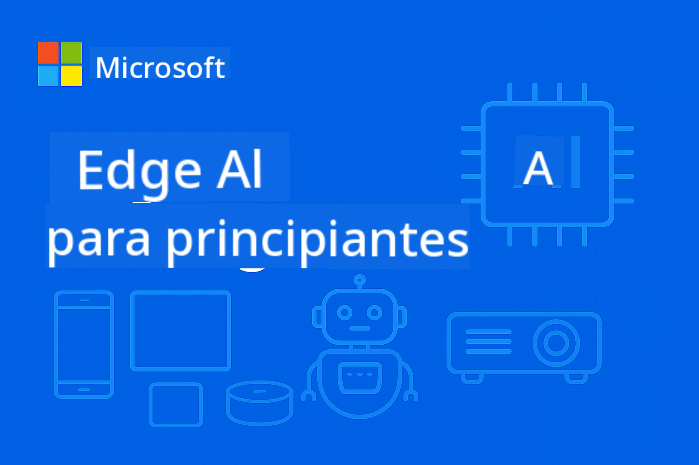

<!--
CO_OP_TRANSLATOR_METADATA:
{
  "original_hash": "8bcf70fe61c9007c880f9753cc9c3e01",
  "translation_date": "2025-10-08T20:33:31+00:00",
  "source_file": "README.md",
  "language_code": "es"
}
-->
# EdgeAI para Principiantes



[](https://GitHub.com/microsoft/edgeai-for-beginners/graphs/contributors)  
[](https://GitHub.com/microsoft/edgeai-for-beginners/issues)  
[](https://GitHub.com/microsoft/edgeai-for-beginners/pulls)  
[](http://makeapullrequest.com)  

[](https://GitHub.com/microsoft/edgeai-for-beginners/watchers)  
[](https://GitHub.com/microsoft/edgeai-for-beginners/fork)  
[](https://GitHub.com/microsoft/edgeai-for-beginners/stargazers)  

[](https://discord.com/invite/ByRwuEEgH4)

Sigue estos pasos para comenzar a usar estos recursos:

1. **Haz un Fork del Repositorio**: Haz clic en [](https://GitHub.com/microsoft/edgeai-for-beginners/fork)  
2. **Clona el Repositorio**: `git clone https://github.com/microsoft/edgeai-for-beginners.git`  
3. [**Únete al Discord de Azure AI Foundry y conecta con expertos y otros desarrolladores**](https://discord.com/invite/ByRwuEEgH4)  

### 🌐 Soporte Multilingüe

#### Disponible mediante GitHub Action (Automatizado y Siempre Actualizado)

[Árabe](../ar/README.md) | [Bengalí](../bn/README.md) | [Búlgaro](../bg/README.md) | [Birmano (Myanmar)](../my/README.md) | [Chino (Simplificado)](../zh/README.md) | [Chino (Tradicional, Hong Kong)](../hk/README.md) | [Chino (Tradicional, Macao)](../mo/README.md) | [Chino (Tradicional, Taiwán)](../tw/README.md) | [Croata](../hr/README.md) | [Checo](../cs/README.md) | [Danés](../da/README.md) | [Holandés](../nl/README.md) | [Finlandés](../fi/README.md) | [Francés](../fr/README.md) | [Alemán](../de/README.md) | [Griego](../el/README.md) | [Hebreo](../he/README.md) | [Hindi](../hi/README.md) | [Húngaro](../hu/README.md) | [Indonesio](../id/README.md) | [Italiano](../it/README.md) | [Japonés](../ja/README.md) | [Coreano](../ko/README.md) | [Malayo](../ms/README.md) | [Maratí](../mr/README.md) | [Nepalí](../ne/README.md) | [Noruego](../no/README.md) | [Persa (Farsi)](../fa/README.md) | [Polaco](../pl/README.md) | [Portugués (Brasil)](../br/README.md) | [Portugués (Portugal)](../pt/README.md) | [Punyabí (Gurmukhi)](../pa/README.md) | [Rumano](../ro/README.md) | [Ruso](../ru/README.md) | [Serbio (Cirílico)](../sr/README.md) | [Eslovaco](../sk/README.md) | [Esloveno](../sl/README.md) | [Español](./README.md) | [Suajili](../sw/README.md) | [Sueco](../sv/README.md) | [Tagalo (Filipino)](../tl/README.md) | [Tailandés](../th/README.md) | [Turco](../tr/README.md) | [Ucraniano](../uk/README.md) | [Urdu](../ur/README.md) | [Vietnamita](../vi/README.md)

**Si deseas que se admitan idiomas adicionales, consulta la lista [aquí](https://github.com/Azure/co-op-translator/blob/main/getting_started/supported-languages.md)**

## Introducción

Bienvenido a **EdgeAI para Principiantes**: tu viaje completo hacia el mundo transformador de la Inteligencia Artificial en el borde. Este curso conecta las capacidades poderosas de la IA con la implementación práctica en dispositivos de borde, permitiéndote aprovechar el potencial de la IA directamente donde se genera la información y se toman decisiones.

### Lo que Aprenderás

Este curso te lleva desde conceptos fundamentales hasta implementaciones listas para producción, cubriendo:
- **Modelos de Lenguaje Pequeños (SLMs)** optimizados para despliegue en el borde
- **Optimización consciente del hardware** en diversas plataformas
- **Inferencia en tiempo real** con capacidades de preservación de la privacidad
- **Estrategias de despliegue en producción** para aplicaciones empresariales

### Por qué es Importante EdgeAI

Edge AI representa un cambio de paradigma que aborda desafíos modernos críticos:
- **Privacidad y Seguridad**: Procesa datos sensibles localmente sin exponerlos a la nube
- **Rendimiento en Tiempo Real**: Elimina la latencia de red para aplicaciones críticas
- **Eficiencia de Costos**: Reduce el uso de ancho de banda y los gastos de computación en la nube
- **Operaciones Resilientes**: Mantén la funcionalidad durante interrupciones de red
- **Cumplimiento Normativo**: Cumple con los requisitos de soberanía de datos

### Edge AI

Edge AI se refiere a ejecutar algoritmos de IA y modelos de lenguaje localmente en hardware, cerca de donde se generan los datos, sin depender de recursos en la nube para la inferencia. Reduce la latencia, mejora la privacidad y permite la toma de decisiones en tiempo real.

### Principios Fundamentales:
- **Inferencia en el dispositivo**: Los modelos de IA se ejecutan en dispositivos de borde (teléfonos, routers, microcontroladores, PCs industriales)
- **Capacidad offline**: Funciona sin conectividad persistente a internet
- **Baja latencia**: Respuestas inmediatas adecuadas para sistemas en tiempo real
- **Soberanía de datos**: Mantiene los datos sensibles localmente, mejorando la seguridad y el cumplimiento

### Modelos de Lenguaje Pequeños (SLMs)

Los SLMs como Phi-4, Mistral-7B y Gemma son versiones optimizadas de modelos de lenguaje grandes (LLMs), entrenados o destilados para:
- **Menor uso de memoria**: Uso eficiente de la memoria limitada de los dispositivos de borde
- **Menor demanda de computación**: Optimización para rendimiento en CPU y GPU de borde
- **Tiempos de inicio más rápidos**: Inicialización rápida para aplicaciones responsivas

Desbloquean capacidades poderosas de procesamiento de lenguaje natural mientras cumplen con las limitaciones de:
- **Sistemas embebidos**: Dispositivos IoT y controladores industriales
- **Dispositivos móviles**: Smartphones y tablets con capacidades offline
- **Dispositivos IoT**: Sensores y dispositivos inteligentes con recursos limitados
- **Servidores de borde**: Unidades de procesamiento local con recursos GPU limitados
- **Computadoras personales**: Escenarios de despliegue en desktops y laptops

## Módulos del Curso y Navegación

| Módulo | Tema | Área de Enfoque | Contenido Clave | Nivel | Duración |
|--------|------|-----------------|-----------------|-------|----------|
| [📖 00 ](./introduction.md) | [Introducción a EdgeAI](./introduction.md) | Fundamentos y Contexto | Descripción de EdgeAI • Aplicaciones Industriales • Introducción a SLM • Objetivos de Aprendizaje | Principiante | 1-2 hrs |
| [📚 01](../../Module01) | [Fundamentos de EdgeAI](./Module01/README.md) | Comparación entre Cloud y Edge AI | Fundamentos de EdgeAI • Casos de Estudio Reales • Guía de Implementación • Despliegue en el Borde | Principiante | 3-4 hrs |
| [🧠 02](../../Module02) | [Fundamentos de Modelos SLM](./Module02/README.md) | Familias de modelos y arquitectura | Familia Phi • Familia Qwen • Familia Gemma • BitNET • μModel • Phi-Silica | Principiante | 4-5 hrs |
| [🚀 03](../../Module03) | [Práctica de Despliegue de SLM](./Module03/README.md) | Despliegue local y en la nube | Aprendizaje Avanzado • Entorno Local • Despliegue en la Nube | Intermedio | 4-5 hrs |
| [⚙️ 04](../../Module04) | [Kit de Herramientas de Optimización de Modelos](./Module04/README.md) | Optimización multiplataforma | Introducción • Llama.cpp • Microsoft Olive • OpenVINO • Apple MLX • Síntesis de Flujo de Trabajo | Intermedio | 5-6 hrs |
| [🔧 05](../../Module05) | [Producción SLMOps](./Module05/README.md) | Operaciones en producción | Introducción a SLMOps • Destilación de Modelos • Ajuste Fino • Despliegue en Producción | Avanzado | 5-6 hrs |
| [🤖 06](../../Module06) | [Agentes de IA y Llamadas a Funciones](./Module06/README.md) | Marcos de agentes y MCP | Introducción a Agentes • Llamadas a Funciones • Protocolo de Contexto de Modelos | Avanzado | 4-5 hrs |
| [💻 07](../../Module07) | [Implementación en Plataformas](./Module07/README.md) | Ejemplos multiplataforma | Kit de Herramientas de IA • Foundry Local • Desarrollo en Windows | Avanzado | 3-4 hrs |
| [🏭 08](../../Module08) | [Kit de Herramientas Foundry Local](./Module08/README.md) | Ejemplos listos para producción | Aplicaciones de muestra (ver detalles abajo) | Experto | 8-10 hrs |

### 🏭 **Módulo 08: Aplicaciones de Muestra**

- [01: Inicio Rápido REST Chat](./Module08/samples/01/README.md)  
- [02: Integración con OpenAI SDK](./Module08/samples/02/README.md)  
- [03: Descubrimiento y Evaluación de Modelos](./Module08/samples/03/README.md)  
- [04: Aplicación Chainlit RAG](./Module08/samples/04/README.md)  
- [05: Orquestación Multi-Agente](./Module08/samples/05/README.md)  
- [06: Enrutador de Modelos como Herramientas](./Module08/samples/06/README.md)  
- [07: Cliente API Directo](./Module08/samples/07/README.md)  
- [08: Aplicación de Chat para Windows 11](./Module08/samples/08/README.md)  
- [09: Sistema Multi-Agente Avanzado](./Module08/samples/09/README.md)  
- [10: Marco de Herramientas Foundry](./Module08/samples/10/README.md)  

### 🎓 **Taller: Ruta de Aprendizaje Práctico**

Materiales completos de taller práctico con implementaciones listas para producción:

- **[Guía del Taller](./Workshop/Readme.md)** - Objetivos de aprendizaje, resultados y navegación de recursos  
- **Ejemplos en Python** (6 sesiones) - Actualizados con mejores prácticas, manejo de errores y documentación completa  
- **Jupyter Notebooks** (8 interactivos) - Tutoriales paso a paso con evaluaciones de rendimiento  
- **Guías de Sesión** - Guías detalladas en markdown para cada sesión del taller  
- **Herramientas de Validación** - Scripts para verificar la calidad del código y realizar pruebas rápidas  

**Lo que Construirás:**
- Aplicaciones locales de chat con soporte de transmisión  
- Pipelines RAG con evaluación de calidad (RAGAS)  
- Herramientas de comparación y evaluación de modelos múltiples  
- Sistemas de orquestación multi-agente  
- Enrutamiento inteligente de modelos basado en tareas  

### 📊 **Resumen de la Ruta de Aprendizaje**
- **Duración Total**: 36-45 horas  
- **Ruta para Principiantes**: Módulos 01-02 (7-9 horas)  
- **Ruta Intermedia**: Módulos 03-04 (9-11 horas)  
- **Ruta Avanzada**: Módulos 05-07 (12-15 horas)  
- **Ruta Experta**: Módulo 08 (8-10 horas)  

## Lo que Construirás

### 🎯 Competencias Clave
- **Arquitectura de Edge AI**: Diseña sistemas de IA locales con integración en la nube  
- **Optimización de Modelos**: Cuantiza y comprime modelos para despliegue en el borde (85% de mejora en velocidad, 75% de reducción de tamaño)  
- **Despliegue Multiplataforma**: Windows, móvil, embebido y sistemas híbridos nube-borde  
- **Operaciones en Producción**: Monitoreo, escalado y mantenimiento de IA en el borde  

### 🏗️ Proyectos Prácticos
- **Aplicaciones de Chat Local Foundry**: Aplicación nativa para Windows 11 con cambio de modelos  
- **Sistemas Multi-Agente**: Coordinador con agentes especializados para flujos de trabajo complejos  
- **Aplicaciones RAG**: Procesamiento local de documentos con búsqueda vectorial  
- **Enrutadores de Modelos**: Selección inteligente entre modelos basada en el análisis de tareas  
- **Frameworks de API**: Clientes listos para producción con transmisión y monitoreo de estado  
- **Herramientas Multiplataforma**: Patrones de integración LangChain/Semantic Kernel  

### 🏢 Aplicaciones Industriales  
**Manufactura** • **Salud** • **Vehículos Autónomos** • **Ciudades Inteligentes** • **Aplicaciones Móviles**  

## Inicio Rápido  

**Ruta de Aprendizaje Recomendada** (20-30 horas en total):  

0. **📖 Introducción** ([Introduction.md](./introduction.md)): Fundamentos de EdgeAI + contexto industrial + marco de aprendizaje  
1. **📚 Fundamentos** (Módulos 01-02): Conceptos de EdgeAI + familias de modelos SLM  
2. **⚙️ Optimización** (Módulos 03-04): Despliegue + frameworks de cuantización  
3. **🚀 Producción** (Módulos 05-06): SLMOps + agentes de IA + llamadas a funciones  
4. **💻 Implementación** (Módulos 07-08): Ejemplos de plataformas + herramientas Foundry Local  

Cada módulo incluye teoría, ejercicios prácticos y ejemplos de código listos para producción.  

## Impacto en la Carrera  

**Roles Técnicos**: Arquitecto de Soluciones EdgeAI • Ingeniero de ML (Edge) • Desarrollador de IoT AI • Desarrollador de AI Móvil  

**Sectores Industriales**: Manufactura 4.0 • Tecnología de Salud • Sistemas Autónomos • FinTech • Electrónica de Consumo  

**Proyectos de Portafolio**: Sistemas multiagente • Aplicaciones RAG en producción • Despliegue multiplataforma • Optimización de rendimiento  

## Estructura del Repositorio  

```
edgeai-for-beginners/
├── 📖 introduction.md  # Foundation: EdgeAI Overview & Learning Framework
├── 📚 Module01-04/     # Fundamentals → SLMs → Deployment → Optimization  
├── 🔧 Module05-06/     # SLMOps → AI Agents → Function Calling
├── 💻 Module07/        # Platform Samples (VS Code, Windows, Jetson, Mobile)
├── 🏭 Module08/        # Foundry Local Toolkit + 10 Comprehensive Samples
│   ├── samples/01-06/  # Foundation: REST, SDK, RAG, Agents, Routing
│   └── samples/07-10/  # Advanced: API Client, Windows App, Enterprise Agents, Tools
├── 🌐 translations/    # Multi-language support (8+ languages)
└── 📋 STUDY_GUIDE.md   # Structured learning paths & time allocation
```
  

## Aspectos Destacados del Curso  

✅ **Aprendizaje Progresivo**: Teoría → Práctica → Despliegue en producción  
✅ **Casos Reales**: Microsoft, Japan Airlines, implementaciones empresariales  
✅ **Ejemplos Prácticos**: Más de 50 ejemplos, 10 demostraciones completas de Foundry Local  
✅ **Enfoque en Rendimiento**: Mejoras del 85% en velocidad, reducciones del 75% en tamaño  
✅ **Multiplataforma**: Windows, móvil, embebido, híbrido nube-edge  
✅ **Listo para Producción**: Monitoreo, escalabilidad, seguridad, frameworks de cumplimiento  

📖 **[Guía de Estudio Disponible](STUDY_GUIDE.md)**: Ruta de aprendizaje estructurada de 20 horas con orientación sobre asignación de tiempo y herramientas de autoevaluación.  

---  

**EdgeAI representa el futuro del despliegue de IA**: local primero, preservando la privacidad y eficiente. Domina estas habilidades para construir la próxima generación de aplicaciones inteligentes.  

## Otros Cursos  

¡Nuestro equipo produce otros cursos! Descubre:  

- [MCP para Principiantes](https://github.com/microsoft/mcp-for-beginners)  
- [Agentes de IA para Principiantes](https://github.com/microsoft/ai-agents-for-beginners?WT.mc_id=academic-105485-koreyst)  
- [IA Generativa para Principiantes usando .NET](https://github.com/microsoft/Generative-AI-for-beginners-dotnet?WT.mc_id=academic-105485-koreyst)  
- [IA Generativa para Principiantes usando JavaScript](https://github.com/microsoft/generative-ai-with-javascript?WT.mc_id=academic-105485-koreyst)  
- [IA Generativa para Principiantes](https://github.com/microsoft/generative-ai-for-beginners?WT.mc_id=academic-105485-koreyst)  
- [ML para Principiantes](https://aka.ms/ml-beginners?WT.mc_id=academic-105485-koreyst)  
- [Ciencia de Datos para Principiantes](https://aka.ms/datascience-beginners?WT.mc_id=academic-105485-koreyst)  
- [IA para Principiantes](https://aka.ms/ai-beginners?WT.mc_id=academic-105485-koreyst)  
- [Ciberseguridad para Principiantes](https://github.com/microsoft/Security-101??WT.mc_id=academic-96948-sayoung)  
- [Desarrollo Web para Principiantes](https://aka.ms/webdev-beginners?WT.mc_id=academic-105485-koreyst)  
- [IoT para Principiantes](https://aka.ms/iot-beginners?WT.mc_id=academic-105485-koreyst)  
- [Desarrollo XR para Principiantes](https://github.com/microsoft/xr-development-for-beginners?WT.mc_id=academic-105485-koreyst)  
- [Dominando GitHub Copilot para Programación en Pareja con IA](https://aka.ms/GitHubCopilotAI?WT.mc_id=academic-105485-koreyst)  
- [Dominando GitHub Copilot para Desarrolladores de C#/.NET](https://github.com/microsoft/mastering-github-copilot-for-dotnet-csharp-developers?WT.mc_id=academic-105485-koreyst)  
- [Elige Tu Propia Aventura con Copilot](https://github.com/microsoft/CopilotAdventures?WT.mc_id=academic-105485-koreyst)  

## Obtener Ayuda  

Si tienes dudas o preguntas sobre cómo construir aplicaciones de IA, únete a:  

[](https://aka.ms/foundry/discord)  

Si tienes comentarios sobre el producto o errores al construir, visita:  

[](https://aka.ms/foundry/forum)  

---

**Descargo de responsabilidad**:  
Este documento ha sido traducido utilizando el servicio de traducción automática [Co-op Translator](https://github.com/Azure/co-op-translator). Aunque nos esforzamos por garantizar la precisión, tenga en cuenta que las traducciones automatizadas pueden contener errores o imprecisiones. El documento original en su idioma nativo debe considerarse como la fuente autorizada. Para información crítica, se recomienda una traducción profesional realizada por humanos. No nos hacemos responsables de malentendidos o interpretaciones erróneas que puedan surgir del uso de esta traducción.