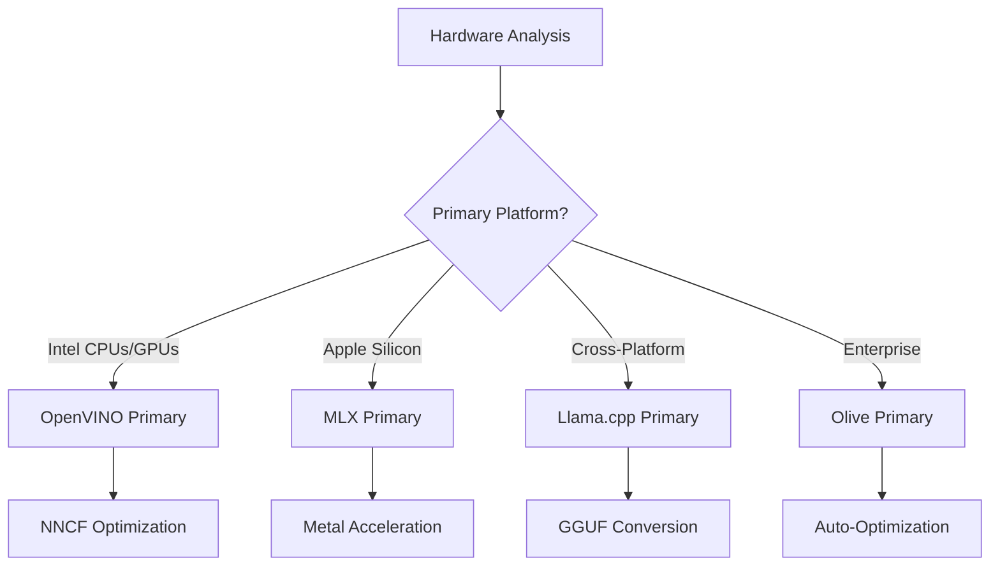
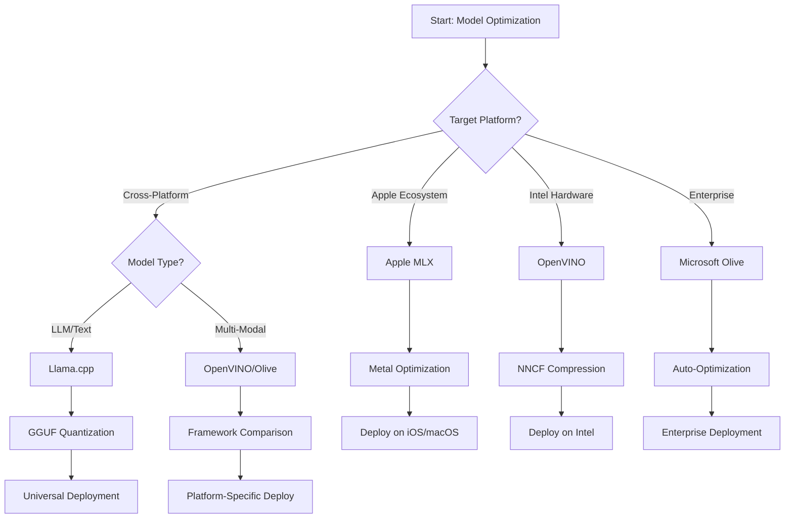
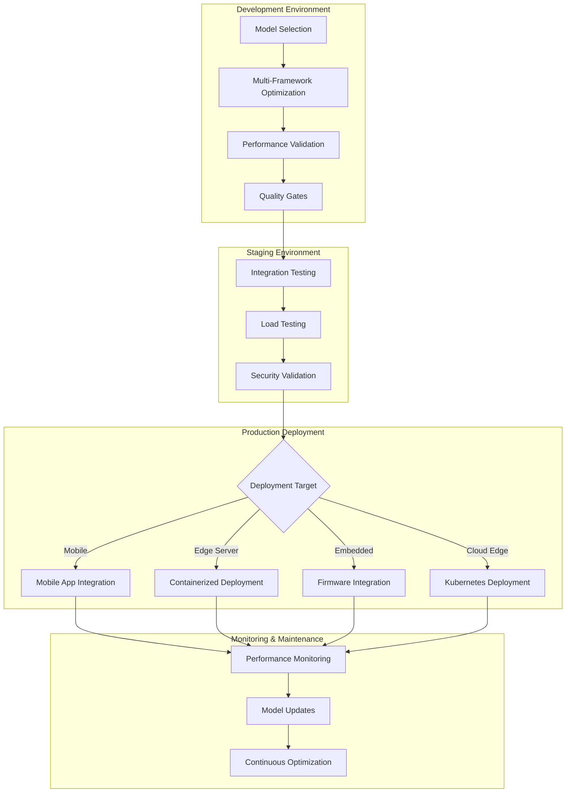

<!--
CO_OP_TRANSLATOR_METADATA:
{
  "original_hash": "6719c4a7e44b948230ac5f5cab3699bd",
  "translation_date": "2025-10-11T11:45:55+00:00",
  "source_file": "Module04/06.workflow-synthesis.md",
  "language_code": "et"
}
-->
# Section 6: Edge AI arenduse töövoo süntees

## Sisukord
1. [Sissejuhatus](../../../Module04)
2. [Õpieesmärgid](../../../Module04)
3. [Ühtse töövoo ülevaade](../../../Module04)
4. [Raamistiku valiku maatriks](../../../Module04)
5. [Parimate praktikate süntees](../../../Module04)
6. [Läbimõeldud juurutamisstrateegia](../../../Module04)
7. [Jõudluse optimeerimise töövoog](../../../Module04)
8. [Tootmisvalmiduse kontrollnimekiri](../../../Module04)
9. [Tõrkeotsing ja jälgimine](../../../Module04)
10. [Edge AI torujuhtme tulevikukindlustamine](../../../Module04)

## Sissejuhatus

Edge AI arendus nõuab põhjalikku arusaamist mitmest optimeerimisraamistikust, juurutamisstrateegiatest ja riistvara kaalutlustest. See terviklik süntees koondab teadmised Llama.cpp, Microsoft Olive, OpenVINO ja Apple MLX raamistikest, et luua ühtne töövoog, mis maksimeerib efektiivsust, säilitab kvaliteeti ja tagab eduka tootmisjuurutamise.

Kogu kursuse vältel oleme uurinud individuaalseid optimeerimisraamistikke, millest igaühel on unikaalsed tugevused ja spetsialiseeritud kasutusjuhtumid. Kuid reaalsed Edge AI projektid nõuavad sageli mitme raamistikutehnikate kombineerimist või strateegilisi otsuseid, milline lähenemine annab parima tulemuse konkreetsete piirangute ja nõuete korral.

See sektsioon sünteesib kõigi raamistikute kollektiivse tarkuse praktilisteks töövoogudeks, otsustuspuudeks ja parimateks praktikateks, mis võimaldavad teil tõhusalt ja tulemuslikult luua tootmisvalmis Edge AI lahendusi. Olenemata sellest, kas optimeerite mobiilseadmete, manussüsteemide või serviserverite jaoks, pakub see juhend strateegilist raamistikku teadlike otsuste tegemiseks kogu arendustsükli vältel.

## Õpieesmärgid

Selle sektsiooni lõpuks suudate:

### Strateegiline otsustamine
- **Hinnata ja valida** optimaalse optimeerimisraamistiku projekti nõuete, riistvara piirangute ja juurutamisstsenaariumide põhjal
- **Kavandada terviklikke töövooge**, mis integreerivad mitmeid optimeerimistehnikaid maksimaalse efektiivsuse saavutamiseks
- **Hinnata kompromisse** mudeli täpsuse, järeldamise kiiruse, mälukasutuse ja juurutamise keerukuse vahel erinevates raamistikutes

### Töövoo integreerimine
- **Rakendada ühtseid arendustorustikke**, mis kasutavad mitme optimeerimisraamistiku tugevusi
- **Luua korduvkasutatavaid töövooge**, et tagada mudeli optimeerimise ja juurutamise järjepidevus erinevates keskkondades
- **Kehtestada kvaliteedikontrolli väravaid** ja valideerimisprotsesse, et tagada optimeeritud mudelite vastavus tootmisnõuetele

### Jõudluse optimeerimine
- **Rakendada süstemaatilisi optimeerimisstrateegiaid**, kasutades kvantiseerimist, kärpimist ja riistvaraspetsiifilisi kiirendustehnikaid
- **Jälgida ja võrrelda** mudeli jõudlust erinevatel optimeerimistasemetel ja juurutamise sihtmärkidel
- **Optimeerida konkreetsete riistvaraplatvormide jaoks**, sealhulgas CPU, GPU, NPU ja spetsialiseeritud servikiirendid

### Tootmise juurutamine
- **Kavandada skaleeritavaid juurutamisarhitektuure**, mis toetavad mitut mudeliformaati ja järeldusmootorit
- **Rakendada jälgimist ja jälgitavust** Edge AI rakenduste jaoks tootmiskeskkonnas
- **Kehtestada hooldustöövooge**, mis hõlmavad mudeli uuendusi, jõudluse jälgimist ja süsteemi optimeerimist

### Platvormideülene tipptase
- **Juurutada optimeeritud mudeleid** mitmekesistel riistvaraplatvormidel, säilitades samal ajal järjepideva jõudluse
- **Käsitleda platvormispetsiifilisi optimeerimisi** Windowsi, macOS-i, Linuxi, mobiilseadmete ja manussüsteemide jaoks
- **Luua abstraktsioonikihte**, mis võimaldavad sujuvat juurutamist erinevates servikeskkondades

## Ühtse töövoo ülevaade

### Faas 1: Nõuete analüüs ja raamistikute valik

Eduka Edge AI juurutamise alus algab põhjalikust nõuete analüüsist, mis suunab raamistikute valikut ja optimeerimisstrateegiat.

#### 1.1 Riistvara hindamine


**Peamised kaalutlused:**
- **CPU arhitektuur**: x86, ARM, Apple Siliconi võimalused
- **Kiirendi saadavus**: GPU, NPU, VPU, spetsialiseeritud AI kiibid
- **Mälu piirangud**: RAM-i piirangud, salvestusmaht
- **Energiakulu**: Aku kestvus, termilised piirangud
- **Ühenduvus**: Offline nõuded, ribalaiuse piirangud

#### 1.2 Rakenduse nõuete maatriks

| Nõue | Llama.cpp | Microsoft Olive | OpenVINO | Apple MLX |
|------|-----------|-----------------|----------|-----------|
| Platvormideülene | ✅ Suurepärane | ⚡ Hea | ⚡ Hea | ❌ Ainult Apple |
| Ettevõtte integratsioon | ⚡ Põhiline | ✅ Suurepärane | ✅ Suurepärane | ⚡ Piiratud |
| Mobiilne juurutamine | ✅ Suurepärane | ⚡ Hea | ⚡ Hea | ✅ iOS Suurepärane |
| Reaalajas järeldamine | ✅ Suurepärane | ✅ Suurepärane | ✅ Suurepärane | ✅ Suurepärane |
| Mudelite mitmekesisus | ✅ LLM keskendunud | ✅ Kõik mudelid | ✅ Kõik mudelid | ✅ LLM keskendunud |
| Kasutuslihtsus | ✅ Lihtne | ✅ Automatiseeritud | ⚡ Keskmine | ✅ Lihtne |

### Faas 2: Mudeli ettevalmistamine ja optimeerimine

#### 2.1 Universaalne mudeli hindamise torujuhe

```python
# Universal Model Assessment Framework
class EdgeAIModelAssessment:
    def __init__(self, model_path, target_hardware):
        self.model_path = model_path
        self.target_hardware = target_hardware
        self.optimization_frameworks = []
        
    def assess_model_characteristics(self):
        """Analyze model size, architecture, and complexity"""
        return {
            'model_size': self.get_model_size(),
            'parameter_count': self.get_parameter_count(),
            'architecture_type': self.detect_architecture(),
            'quantization_compatibility': self.check_quantization_support()
        }
    
    def recommend_optimization_strategy(self):
        """Recommend optimal frameworks and techniques"""
        characteristics = self.assess_model_characteristics()
        
        if self.target_hardware.startswith('apple'):
            return self.mlx_optimization_strategy(characteristics)
        elif self.target_hardware.startswith('intel'):
            return self.openvino_optimization_strategy(characteristics)
        elif characteristics['model_size'] > 7_000_000_000:  # 7B+ parameters
            return self.enterprise_optimization_strategy(characteristics)
        else:
            return self.lightweight_optimization_strategy(characteristics)
```

#### 2.2 Mitmeraamistiku optimeerimise torujuhe

**Järjestikune optimeerimise lähenemine:**
1. **Esialgne konversioon**: Konverteerimine vaheformaati (ONNX, kui võimalik)
2. **Raamistikuspetsiifiline optimeerimine**: Spetsialiseeritud tehnikate rakendamine
3. **Ristvalideerimine**: Jõudluse kontroll erinevatel sihtplatvormidel
4. **Lõplik pakendamine**: Juurutamiseks ettevalmistamine

```bash
# Multi-Framework Optimization Script
#!/bin/bash

MODEL_NAME="phi-3-mini"
BASE_MODEL="microsoft/Phi-3-mini-4k-instruct"

# Phase 1: ONNX Conversion (Universal)
python convert_to_onnx.py --model $BASE_MODEL --output models/onnx/

# Phase 2: Platform-Specific Optimization
if [[ "$TARGET_PLATFORM" == "intel" ]]; then
    # OpenVINO Optimization
    python optimize_openvino.py --input models/onnx/ --output models/openvino/
elif [[ "$TARGET_PLATFORM" == "apple" ]]; then
    # MLX Optimization
    python optimize_mlx.py --input $BASE_MODEL --output models/mlx/
elif [[ "$TARGET_PLATFORM" == "cross" ]]; then
    # Llama.cpp Optimization
    python convert_to_gguf.py --input models/onnx/ --output models/gguf/
fi

# Phase 3: Validation
python validate_optimization.py --original $BASE_MODEL --optimized models/$TARGET_PLATFORM/
```

### Faas 3: Jõudluse valideerimine ja võrdlusuuringud

#### 3.1 Terviklik võrdlusuuringute raamistik

```python
class EdgeAIBenchmark:
    def __init__(self, optimized_models):
        self.models = optimized_models
        self.metrics = {
            'inference_time': [],
            'memory_usage': [],
            'accuracy_score': [],
            'throughput': [],
            'energy_consumption': []
        }
    
    def run_comprehensive_benchmark(self):
        """Execute standardized benchmarks across all optimized models"""
        test_inputs = self.generate_test_inputs()
        
        for model_framework, model_path in self.models.items():
            print(f"Benchmarking {model_framework}...")
            
            # Latency Testing
            latency = self.measure_inference_latency(model_path, test_inputs)
            
            # Memory Profiling
            memory = self.profile_memory_usage(model_path)
            
            # Accuracy Validation
            accuracy = self.validate_model_accuracy(model_path, test_inputs)
            
            # Throughput Analysis
            throughput = self.measure_throughput(model_path)
            
            self.record_metrics(model_framework, latency, memory, accuracy, throughput)
    
    def generate_optimization_report(self):
        """Create comprehensive comparison report"""
        report = {
            'recommendations': self.analyze_performance_trade_offs(),
            'deployment_guidance': self.generate_deployment_recommendations(),
            'monitoring_requirements': self.define_monitoring_metrics()
        }
        return report
```

## Raamistiku valiku maatriks

### Otsustuspuu raamistikute valikuks



### Terviklikud valikukriteeriumid

#### 1. Peamise kasutusjuhtumi sobivus

**Suured keelemudelid (LLM):**
- **Llama.cpp**: Parim CPU-keskse, platvormideülese juurutamise jaoks
- **Apple MLX**: Optimaalne Apple Siliconi jaoks, kasutades ühtset mälu
- **OpenVINO**: Suurepärane Intel riistvara jaoks NNCF optimeerimisega
- **Microsoft Olive**: Ideaalne ettevõtte töövoogude jaoks automatiseerimisega

**Multimodaalsed mudelid:**
- **OpenVINO**: Terviklik tugi visioonile, helile ja tekstile
- **Microsoft Olive**: Ettevõtte tasemel optimeerimine keerukate torujuhtmete jaoks
- **Llama.cpp**: Piiratud tekstipõhiste mudelitega
- **Apple MLX**: Kasvav tugi multimodaalsetele rakendustele

#### 2. Riistvaraplatvormi maatriks

| Platvorm | Peamine raamistik | Teisene valik | Spetsialiseeritud funktsioonid |
|----------|------------------|------------------|---------------------|
| Intel CPU/GPU | OpenVINO | Microsoft Olive | NNCF tihendamine, Intel optimeerimine |
| NVIDIA GPU | Microsoft Olive | OpenVINO | CUDA kiirendus, ettevõtte funktsioonid |
| Apple Silicon | Apple MLX | Llama.cpp | Metal shaderid, ühtne mälu |
| ARM mobiilne | Llama.cpp | OpenVINO | Platvormideülene, minimaalsed sõltuvused |
| Edge TPU | OpenVINO | Microsoft Olive | Spetsialiseeritud kiirendi tugi |
| Manustatud ARM | Llama.cpp | OpenVINO | Minimaalne jalajälg, tõhus järeldamine |

#### 3. Arendustöövoo eelistused

**Kiire prototüüpimine:**
1. **Llama.cpp**: Kiireim seadistamine, kohesed tulemused
2. **Apple MLX**: Lihtne Python API, kiire iteratsioon
3. **Microsoft Olive**: Automatiseeritud optimeerimine, minimaalne konfiguratsioon
4. **OpenVINO**: Keerukam seadistamine, terviklikud funktsioonid

**Ettevõtte tootmine:**
1. **Microsoft Olive**: Ettevõtte funktsioonid, Azure integratsioon
2. **OpenVINO**: Intel ökosüsteem, terviklikud tööriistad
3. **Apple MLX**: Apple-spetsiifilised ettevõtterakendused
4. **Llama.cpp**: Lihtne juurutamine, piiratud ettevõtte funktsioonid

## Parimate praktikate süntees

### Universaalsed optimeerimispõhimõtted

#### 1. Progressiivne optimeerimisstrateegia

```python
class ProgressiveOptimization:
    def __init__(self, base_model):
        self.base_model = base_model
        self.optimization_stages = [
            'baseline_measurement',
            'format_conversion',
            'quantization_optimization',
            'hardware_acceleration',
            'production_validation'
        ]
    
    def execute_progressive_optimization(self):
        """Apply optimization techniques incrementally"""
        
        # Stage 1: Baseline Measurement
        baseline_metrics = self.measure_baseline_performance()
        
        # Stage 2: Format Conversion
        converted_model = self.convert_to_optimal_format()
        conversion_metrics = self.measure_performance(converted_model)
        
        # Stage 3: Quantization
        quantized_model = self.apply_quantization(converted_model)
        quantization_metrics = self.measure_performance(quantized_model)
        
        # Stage 4: Hardware Acceleration
        accelerated_model = self.enable_hardware_acceleration(quantized_model)
        acceleration_metrics = self.measure_performance(accelerated_model)
        
        # Stage 5: Validation
        production_ready = self.validate_for_production(accelerated_model)
        
        return self.compile_optimization_report(
            baseline_metrics, conversion_metrics, 
            quantization_metrics, acceleration_metrics
        )
```

#### 2. Kvaliteedikontrolli väravate rakendamine

**Täpsuse säilitamise väravad:**
- Säilita >95% algse mudeli täpsusest
- Valideeri esinduslike testandmestikega
- Rakenda A/B testimist tootmisvalideerimiseks

**Jõudluse parandamise väravad:**
- Saavuta vähemalt 2x kiiruse paranemine
- Vähenda mälukasutust vähemalt 50%
- Valideeri järeldamise aja järjepidevust

**Tootmisvalmiduse väravad:**
- Läbi stressitestimine koormuse all
- Näita stabiilset jõudlust aja jooksul
- Valideeri turvalisuse ja privaatsuse nõuded

### Raamistikuspetsiifiliste parimate praktikate integreerimine

#### 1. Kvantiseerimisstrateegia süntees

```python
# Unified Quantization Approach
class UnifiedQuantizationStrategy:
    def __init__(self, model, target_platform):
        self.model = model
        self.platform = target_platform
        
    def select_optimal_quantization(self):
        """Choose best quantization based on platform and requirements"""
        
        if self.platform == 'apple_silicon':
            return self.mlx_quantization_strategy()
        elif self.platform == 'intel_hardware':
            return self.openvino_quantization_strategy()
        elif self.platform == 'cross_platform':
            return self.llamacpp_quantization_strategy()
        else:
            return self.olive_quantization_strategy()
    
    def mlx_quantization_strategy(self):
        """Apple MLX-specific quantization"""
        return {
            'method': 'mlx_quantize',
            'precision': 'int4',
            'group_size': 64,
            'optimization_target': 'unified_memory'
        }
    
    def openvino_quantization_strategy(self):
        """OpenVINO NNCF quantization"""
        return {
            'method': 'nncf_quantize',
            'precision': 'int8',
            'calibration_method': 'post_training',
            'optimization_target': 'intel_hardware'
        }
```

#### 2. Riistvarakiirenduse optimeerimine

**CPU optimeerimise süntees:**
- **SIMD juhised**: Kasuta optimeeritud tuumasid erinevates raamistikutes
- **Mälulaius**: Optimeeri andmevormingud vahemälu efektiivsuse jaoks
- **Keermestamine**: Tasakaalusta paralleelsus ressursside piirangutega

**GPU kiirenduse parimad praktikad:**
- **Partii töötlemine**: Maksimeeri läbilaskevõime sobivate partiisuurustega
- **Mälu haldamine**: Optimeeri GPU mälu ja andmeedastusi
- **Täpsus**: Kasuta FP16, kui toetatud, parema jõudluse jaoks

**NPU/spetsialiseeritud kiirendi optimeerimine:**
- **Mudeli arhitektuur**: Tagada ühilduvus kiirendi võimalustega
- **Andmevoog**: Optimeeri sisendi/väljundi torujuhtmed kiirendi efektiivsuse jaoks
- **Tagasijooksustrateegiad**: Rakenda CPU tagasijooksu toetamata operatsioonide jaoks

## Läbimõeldud juurutamisstrateegia

### Universaalne juurutamisarhitektuur



### Platvormispetsiifilised juurutamismustrid

#### 1. Mobiilne juurutamisstrateegia

```yaml
# Mobile Deployment Configuration
mobile_deployment:
  ios:
    framework: apple_mlx
    optimization:
      quantization: int4
      memory_mapping: true
      background_execution: limited
    packaging:
      format: mlx
      bundle_size: <50MB
      
  android:
    framework: llama_cpp
    optimization:
      quantization: q4_k_m
      threading: android_optimized
      memory_management: conservative
    packaging:
      format: gguf
      apk_size: <100MB
      
  cross_platform:
    framework: onnx_runtime
    optimization:
      quantization: int8
      execution_provider: cpu
    packaging:
      format: onnx
      shared_libraries: minimal
```

#### 2. Serviserveri juurutamine

```yaml
# Edge Server Deployment Configuration
edge_server:
  intel_based:
    framework: openvino
    optimization:
      quantization: int8
      acceleration: cpu_gpu_auto
      batch_processing: dynamic
    deployment:
      container: openvino_runtime
      orchestration: kubernetes
      scaling: horizontal
      
  nvidia_based:
    framework: microsoft_olive
    optimization:
      quantization: int4
      acceleration: cuda
      tensor_parallelism: true
    deployment:
      container: nvidia_triton
      orchestration: kubernetes
      scaling: gpu_aware
```

### Konteineriseerimise parimad praktikad

```dockerfile
# Multi-Framework Edge AI Container
FROM ubuntu:22.04 as base

# Install common dependencies
RUN apt-get update && apt-get install -y \
    python3 \
    python3-pip \
    build-essential \
    cmake \
    && rm -rf /var/lib/apt/lists/*

# Framework-specific stages
FROM base as openvino
RUN pip install openvino nncf optimum[intel]

FROM base as llamacpp
RUN git clone https://github.com/ggerganov/llama.cpp.git \
    && cd llama.cpp && make LLAMA_OPENBLAS=1

FROM base as olive
RUN pip install olive-ai[auto-opt] onnxruntime-genai

# Production stage with selected framework
FROM openvino as production
COPY models/ /app/models/
COPY src/ /app/src/
WORKDIR /app

EXPOSE 8080
CMD ["python3", "src/inference_server.py"]
```

## Jõudluse optimeerimise töövoog

### Süsteemne jõudluse häälestamine

#### 1. Jõudluse profiilimise torujuhe

```python
class EdgeAIPerformanceProfiler:
    def __init__(self, model_path, framework):
        self.model_path = model_path
        self.framework = framework
        self.profiling_results = {}
    
    def comprehensive_profiling(self):
        """Execute comprehensive performance analysis"""
        
        # CPU Profiling
        cpu_profile = self.profile_cpu_usage()
        
        # Memory Profiling
        memory_profile = self.profile_memory_usage()
        
        # Inference Latency
        latency_profile = self.profile_inference_latency()
        
        # Throughput Analysis
        throughput_profile = self.profile_throughput()
        
        # Energy Consumption (where available)
        energy_profile = self.profile_energy_consumption()
        
        return self.compile_performance_report(
            cpu_profile, memory_profile, latency_profile,
            throughput_profile, energy_profile
        )
    
    def identify_bottlenecks(self):
        """Automatically identify performance bottlenecks"""
        bottlenecks = []
        
        if self.profiling_results['cpu_utilization'] > 80:
            bottlenecks.append('cpu_bound')
        
        if self.profiling_results['memory_usage'] > 90:
            bottlenecks.append('memory_bound')
        
        if self.profiling_results['inference_variance'] > 20:
            bottlenecks.append('inconsistent_performance')
        
        return self.generate_optimization_recommendations(bottlenecks)
```

#### 2. Automatiseeritud optimeerimise torujuhe

```python
class AutomatedOptimizationPipeline:
    def __init__(self, base_model, target_constraints):
        self.base_model = base_model
        self.constraints = target_constraints
        self.optimization_history = []
    
    def execute_optimization_search(self):
        """Systematically search optimization space"""
        
        optimization_candidates = [
            {'quantization': 'int8', 'pruning': 0.1},
            {'quantization': 'int4', 'pruning': 0.2},
            {'quantization': 'int8', 'acceleration': 'gpu'},
            {'quantization': 'int4', 'acceleration': 'npu'}
        ]
        
        best_configuration = None
        best_score = 0
        
        for config in optimization_candidates:
            optimized_model = self.apply_optimization(config)
            score = self.evaluate_optimization(optimized_model)
            
            if score > best_score and self.meets_constraints(optimized_model):
                best_score = score
                best_configuration = config
            
            self.optimization_history.append({
                'config': config,
                'score': score,
                'model': optimized_model
            })
        
        return best_configuration, self.optimization_history
```

### Mitme eesmärgiga optimeerimine

#### 1. Pareto optimeerimine Edge AI jaoks

```python
class ParetoOptimization:
    def __init__(self, objectives=['speed', 'accuracy', 'memory']):
        self.objectives = objectives
        self.pareto_frontier = []
    
    def find_pareto_optimal_solutions(self, optimization_results):
        """Identify Pareto-optimal configurations"""
        
        for result in optimization_results:
            is_dominated = False
            
            for frontier_point in self.pareto_frontier:
                if self.dominates(frontier_point, result):
                    is_dominated = True
                    break
            
            if not is_dominated:
                # Remove dominated points from frontier
                self.pareto_frontier = [
                    point for point in self.pareto_frontier 
                    if not self.dominates(result, point)
                ]
                
                self.pareto_frontier.append(result)
        
        return self.pareto_frontier
    
    def recommend_configuration(self, user_preferences):
        """Recommend configuration based on user preferences"""
        
        weighted_scores = []
        for config in self.pareto_frontier:
            score = sum(
                user_preferences[obj] * config['metrics'][obj] 
                for obj in self.objectives
            )
            weighted_scores.append((score, config))
        
        return max(weighted_scores, key=lambda x: x[0])[1]
```

## Tootmisvalmiduse kontrollnimekiri

### Terviklik tootmisvalideerimine

#### 1. Mudeli kvaliteedi tagamine

```python
class ProductionReadinessValidator:
    def __init__(self, optimized_model, production_requirements):
        self.model = optimized_model
        self.requirements = production_requirements
        self.validation_results = {}
    
    def validate_model_quality(self):
        """Comprehensive model quality validation"""
        
        # Accuracy Validation
        accuracy_result = self.validate_accuracy()
        
        # Performance Validation
        performance_result = self.validate_performance()
        
        # Robustness Testing
        robustness_result = self.validate_robustness()
        
        # Security Assessment
        security_result = self.validate_security()
        
        # Compliance Verification
        compliance_result = self.validate_compliance()
        
        return self.compile_validation_report(
            accuracy_result, performance_result, robustness_result,
            security_result, compliance_result
        )
    
    def generate_certification_report(self):
        """Generate production certification report"""
        return {
            'model_signature': self.generate_model_signature(),
            'validation_timestamp': datetime.now(),
            'validation_results': self.validation_results,
            'deployment_approval': self.check_deployment_approval(),
            'monitoring_requirements': self.define_monitoring_requirements()
        }
```

#### 2. Tootmise juurutamise kontrollnimekiri

**Eeljuurutamise valideerimine:**
- [ ] Mudeli täpsus vastab miinimumnõuetele (>95% algtasemest)
- [ ] Jõudluse eesmärgid saavutatud (latentsus, läbilaskevõime, mälu)
- [ ] Turvahaavatavused hinnatud ja leevendatud
- [ ] Stressitestimine lõpetatud eeldatava koormuse all
- [ ] Tõrkesituatsioonid testitud ja taastumisprotseduurid valideeritud
- [ ] Jälgimis- ja häiresüsteemid konfigureeritud
- [ ] Tagasijooksu protseduurid testitud ja dokumenteeritud

**Juurutamisprotsess:**
- [ ] Sinine-roheline juurutamisstrateegia rakendatud
- [ ] Järk-järguline liikluse suurendamine konfigureeritud
- [ ] Reaalajas jälgimisdashboadid aktiivsed
- [ ] Jõudluse algtasemed kehtestatud
- [ ] Veamäärade künnised määratletud
- [ ] Automatiseeritud tagasijooksu käivitajad konfigureeritud

**Järelevalve pärast juurutamist:**
- [ ] Mudeli triivi tuvastamine aktiivne
- [ ] Jõudluse halvenemise häired konfigureeritud
- [ ] Ressursikasutuse jälgimine lubatud
- [ ] Kasutajakogemuse mõõdikud jälgitud
- [ ] Mudeli versioonimine ja päritolu säilitatud
- [ ] Regulaarne mudeli jõudluse ülevaatus ajastatud

### Pidev integratsioon/pidev juurutamine (CI/CD)

```yaml
# Edge AI CI/CD Pipeline Configuration
edge_ai_pipeline:
  stages:
    - model_validation
    - optimization
    - testing
    - staging_deployment
    - production_deployment
    - monitoring
  
  model_validation:
    accuracy_threshold: 0.95
    performance_baseline: required
    security_scan: enabled
    
  optimization:
    frameworks:
      - llama_cpp
      - openvino
      - microsoft_olive
    validation:
      cross_validation: enabled
      performance_comparison: required
      
  testing:
    unit_tests: comprehensive
    integration_tests: full_pipeline
    load_tests: production_scale
    security_tests: comprehensive
    
  deployment:
    strategy: blue_green
    traffic_ramping: gradual
    rollback: automatic
    monitoring: real_time
```

## Tõrkeotsing ja jälgimine

### Universaalne tõrkeotsingu raamistik

#### 1. Levinud probleemid ja lahendused

**Jõudluse probleemid:**
```python
class PerformanceTroubleshooter:
    def __init__(self, model_metrics):
        self.metrics = model_metrics
        
    def diagnose_performance_issues(self):
        """Systematic performance issue diagnosis"""
        
        issues = []
        
        # High latency diagnosis
        if self.metrics['avg_latency'] > self.metrics['target_latency']:
            issues.append(self.diagnose_latency_issues())
        
        # Memory usage diagnosis
        if self.metrics['memory_usage'] > self.metrics['memory_limit']:
            issues.append(self.diagnose_memory_issues())
        
        # Throughput diagnosis
        if self.metrics['throughput'] < self.metrics['target_throughput']:
            issues.append(self.diagnose_throughput_issues())
        
        return self.generate_resolution_plan(issues)
    
    def diagnose_latency_issues(self):
        """Specific latency troubleshooting"""
        potential_causes = []
        
        if self.metrics['cpu_utilization'] > 80:
            potential_causes.append('cpu_bottleneck')
        
        if self.metrics['memory_bandwidth'] > 90:
            potential_causes.append('memory_bandwidth_limit')
        
        if self.metrics['model_size'] > self.metrics['optimal_size']:
            potential_causes.append('model_too_large')
        
        return {
            'issue': 'high_latency',
            'causes': potential_causes,
            'solutions': self.generate_latency_solutions(potential_causes)
        }
```

**Raamistikuspetsiifiline tõrkeotsing:**

| Probleem | Llama.cpp | Microsoft Olive | OpenVINO | Apple MLX |
|----------|-----------|-----------------|----------|-----------|
| Mälu probleemid | Vähenda konteksti pikkust | Alanda partii suurust | Luba vahemälu | Kasuta mälukaardistust |
| Aeglane järeldamine | Luba SIMD | Kontrolli kvantiseerimist | Optimeeri keermestamist | Luba Metal |
| Täpsuse kaotus | Kõrgem kvantiseerimine | Treeni uuesti QAT-ga | Suurenda kalibreerimist | Peenhäälesta pärast kvantiseerimist |
| Ühilduvus | Kontrolli mudeli formaati | Kinnita raamistikuversion | Uuenda draivereid | Kontrolli macOS versiooni |

#### 2. Tootmise jälgimisstrateegia

```python
class EdgeAIMonitoring:
    def __init__(self, deployment_config):
        self.config = deployment_config
        self.metrics_collectors = []
        self.alerting_rules = []
    
    def setup_comprehensive_monitoring(self):
        """Configure comprehensive monitoring for Edge AI deployment"""
        
        # Model Performance Monitoring
        self.setup_model_performance_monitoring()
        
        # Infrastructure Monitoring
        self.setup_infrastructure_monitoring()
        
        # Business Metrics Monitoring
        self.setup_business_metrics_monitoring()
        
        # Security Monitoring
        self.setup_security_monitoring()
    
    def setup_model_performance_monitoring(self):
        """Model-specific performance monitoring"""
        metrics = [
            'inference_latency_p50',
            'inference_latency_p95',
            'inference_latency_p99',
            'model_accuracy_drift',
            'prediction_confidence_distribution',
            'error_rate',
            'throughput_requests_per_second'
        ]
        
        for metric in metrics:
            self.add_metric_collector(metric)
            self.add_alerting_rule(metric)
    
    def detect_model_drift(self):
        """Automated model drift detection"""
        drift_indicators = [
            self.statistical_drift_detection(),
            self.performance_drift_detection(),
            self.data_distribution_shift_detection()
        ]
        
        return self.aggregate_drift_signals(drift_indicators)
```

### Automatiseeritud probleemide lahendamine

```python
class AutomatedIssueResolution:
    def __init__(self, monitoring_system):
        self.monitoring = monitoring_system
        self.resolution_strategies = {}
    
    def handle_performance_degradation(self, alert):
        """Automated performance issue resolution"""
        
        if alert['type'] == 'high_latency':
            return self.resolve_latency_issue(alert)
        elif alert['type'] == 'high_memory_usage':
            return self.resolve_memory_issue(alert)
        elif alert['type'] == 'accuracy_drift':
            return self.resolve_accuracy_issue(alert)
        
    def resolve_latency_issue(self, alert):
        """Automated latency issue resolution"""
        resolution_steps = [
            'increase_cpu_allocation',
            'enable_model_caching',
            'reduce_batch_size',
            'switch_to_quantized_model'
        ]
        
        for step in resolution_steps:
            if self.apply_resolution_step(step):
                return f"Resolved latency issue with: {step}"
        
        return "Escalating to human operator"
```

## Edge AI torujuhtme tulevikukindlustamine

### Uute tehnoloogiate integreerimine

#### 1. Järgmise põlvkonna riistvara tugi

```python
class FutureHardwareIntegration:
    def __init__(self):
        self.supported_accelerators = [
            'npu_next_gen',
            'quantum_processors',
            'neuromorphic_chips',
            'optical_processors'
        ]
    
    def design_adaptive_pipeline(self):
        """Create hardware-agnostic optimization pipeline"""
        
        pipeline = {
            'model_preparation': self.universal_model_preparation(),
            'hardware_detection': self.dynamic_hardware_detection(),
            'optimization_selection': self.adaptive_optimization_selection(),
            'performance_validation': self.hardware_agnostic_validation()
        }
        
        return pipeline
    
    def adaptive_optimization_selection(self):
        """Dynamically select optimization based on available hardware"""
        
        def optimize_for_hardware(model, available_hardware):
            if 'npu' in available_hardware:
                return self.npu_optimization(model)
            elif 'quantum' in available_hardware:
                return self.quantum_optimization(model)
            elif 'neuromorphic' in available_hardware:
                return self.neuromorphic_optimization(model)
            else:
                return self.fallback_optimization(model)
        
        return optimize_for_hardware
```

#### 2. Mudeli arhitektu
Pea meeles, et parim optimeerimisstrateegia on see, mis vastab sinu konkreetsetele nõudmistele, säilitades samal ajal paindlikkuse kohaneda, kui need nõudmised muutuvad. Kasuta seda juhendit raamistikuna teadlike otsuste tegemiseks, kuid kinnita alati oma valikud empiirilise testimise ja reaalse kasutuskogemuse kaudu.

## ➡️ Mis edasi

Jätka oma Edge AI teekonda, uurides [Moodul 5: SLMOps ja tootmisesse juurutamine](../Module05/README.md), et õppida väikeste keelemudelite elutsükli haldamise operatiivseid aspekte.

---

**Lahtiütlus**:  
See dokument on tõlgitud AI tõlketeenuse [Co-op Translator](https://github.com/Azure/co-op-translator) abil. Kuigi püüame tagada täpsust, palume arvestada, et automaatsed tõlked võivad sisaldada vigu või ebatäpsusi. Algne dokument selle algses keeles tuleks pidada autoriteetseks allikaks. Olulise teabe puhul soovitame kasutada professionaalset inimtõlget. Me ei vastuta selle tõlke kasutamisest tulenevate arusaamatuste või valesti tõlgenduste eest.