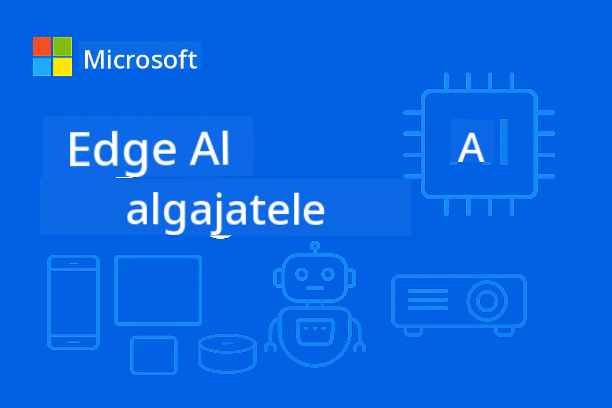

<!--
CO_OP_TRANSLATOR_METADATA:
{
  "original_hash": "cd9cb76aab17c30bfb19ef73060c5fb0",
  "translation_date": "2025-10-11T11:08:03+00:00",
  "source_file": "README.md",
  "language_code": "et"
}
-->
# EdgeAI algajatele



[](https://GitHub.com/microsoft/edgeai-for-beginners/graphs/contributors)
[](https://GitHub.com/microsoft/edgeai-for-beginners/issues)
[](https://GitHub.com/microsoft/edgeai-for-beginners/pulls)
[](http://makeapullrequest.com)

[](https://GitHub.com/microsoft/edgeai-for-beginners/watchers)
[](https://GitHub.com/microsoft/edgeai-for-beginners/fork)
[](https://GitHub.com/microsoft/edgeai-for-beginners/stargazers)

[](https://discord.com/invite/ByRwuEEgH4)

Järgi neid samme, et alustada nende ressursside kasutamist:

1. **Forki repositoorium**: Klõpsa [](https://GitHub.com/microsoft/edgeai-for-beginners/fork)
2. **Klooni repositoorium**: `git clone https://github.com/microsoft/edgeai-for-beginners.git`
3. [**Liitu Azure AI Foundry Discordiga ja kohtume ekspertide ning teiste arendajatega**](https://discord.com/invite/ByRwuEEgH4)

### 🌐 Mitmekeelne tugi

#### Toetatud GitHub Actioni kaudu (automaatne ja alati ajakohane)

[Araabia](../ar/README.md) | [Bengali](../bn/README.md) | [Bulgaaria](../bg/README.md) | [Birma (Myanmar)](../my/README.md) | [Hiina (lihtsustatud)](../zh/README.md) | [Hiina (traditsiooniline, Hongkong)](../hk/README.md) | [Hiina (traditsiooniline, Macau)](../mo/README.md) | [Hiina (traditsiooniline, Taiwan)](../tw/README.md) | [Horvaatia](../hr/README.md) | [Tšehhi](../cs/README.md) | [Taani](../da/README.md) | [Hollandi](../nl/README.md) | [Eesti](./README.md) | [Soome](../fi/README.md) | [Prantsuse](../fr/README.md) | [Saksa](../de/README.md) | [Kreeka](../el/README.md) | [Heebrea](../he/README.md) | [Hindi](../hi/README.md) | [Ungari](../hu/README.md) | [Indoneesia](../id/README.md) | [Itaalia](../it/README.md) | [Jaapani](../ja/README.md) | [Korea](../ko/README.md) | [Leedu](../lt/README.md) | [Malai](../ms/README.md) | [Marathi](../mr/README.md) | [Nepali](../ne/README.md) | [Norra](../no/README.md) | [Pärsia (Farsi)](../fa/README.md) | [Poola](../pl/README.md) | [Portugali (Brasiilia)](../br/README.md) | [Portugali (Portugal)](../pt/README.md) | [Punjabi (Gurmukhi)](../pa/README.md) | [Rumeenia](../ro/README.md) | [Vene](../ru/README.md) | [Serbia (kirillitsa)](../sr/README.md) | [Slovaki](../sk/README.md) | [Sloveeni](../sl/README.md) | [Hispaania](../es/README.md) | [Suahiili](../sw/README.md) | [Rootsi](../sv/README.md) | [Tagalogi (Filipino)](../tl/README.md) | [Tamili](../ta/README.md) | [Tai](../th/README.md) | [Türgi](../tr/README.md) | [Ukraina](../uk/README.md) | [Urdu](../ur/README.md) | [Vietnami](../vi/README.md)

**Kui soovid lisada täiendavaid tõlkeid, toetatud keeled on loetletud [siin](https://github.com/Azure/co-op-translator/blob/main/getting_started/supported-languages.md)**

## Sissejuhatus

Tere tulemast **EdgeAI algajatele** – terviklikule teekonnale Edge-tehisintellekti muutlikku maailma. See kursus ühendab võimsad AI võimalused praktilise, reaalse maailma rakendamisega servaseadmetel, võimaldades sul kasutada AI potentsiaali otse seal, kus andmed luuakse ja otsuseid tehakse.

### Mida sa õpid

See kursus viib sind põhimõistetest tootmisvalmis rakendusteni, hõlmates:
- **Väikesed keelemudelid (SLM)**, mis on optimeeritud serva kasutamiseks
- **Riistvarateadlik optimeerimine** erinevatel platvormidel
- **Reaalajas järeldamine** privaatsust säilitavate võimalustega
- **Tootmise juurutamise** strateegiad ettevõtte rakenduste jaoks

### Miks EdgeAI on oluline

Edge AI esindab paradigmat, mis lahendab tänapäeva olulisi väljakutseid:
- **Privaatsus ja turvalisus**: Töötle tundlikke andmeid lokaalselt, ilma pilve kasutamata
- **Reaalajas jõudlus**: Väldi võrgu latentsust ajakriitiliste rakenduste jaoks
- **Kuluefektiivsus**: Vähenda ribalaiuse ja pilvearvutuse kulusid
- **Töökindlus**: Säilita funktsionaalsus võrgu katkestuste ajal
- **Regulatiivne vastavus**: Järgi andmesuveräänsuse nõudeid

### Edge AI

Edge AI viitab AI algoritmide ja keelemudelite käitamisele lokaalselt riistvaral, lähedal andmete loomise kohale, ilma pilveressursse järeldamiseks kasutamata. See vähendab latentsust, parandab privaatsust ja võimaldab reaalajas otsuste tegemist.

### Põhiprintsiibid:
- **Seadmel põhinev järeldamine**: AI mudelid töötavad servaseadmetel (telefonid, ruuterid, mikrokontrollerid, tööstuslikud arvutid)
- **Võrguta võimekus**: Funktsioneerib ilma pideva internetiühenduseta
- **Madal latentsus**: Kohesed vastused, mis sobivad reaalajas süsteemidele
- **Andmesuveräänsus**: Hoidab tundlikud andmed lokaalselt, parandades turvalisust ja vastavust

### Väikesed keelemudelid (SLM)

SLM-id nagu Phi-4, Mistral-7B ja Gemma on suuremate LLM-ide optimeeritud versioonid – treenitud või destilleeritud:
- **Väiksem mälumaht**: Efektiivne piiratud servaseadmete mälu kasutamine
- **Väiksem arvutusvajadus**: Optimeeritud CPU ja serva GPU jõudluse jaoks
- **Kiirem käivitusaeg**: Kiire initsialiseerimine reageerivate rakenduste jaoks

Need avavad võimsad NLP võimalused, samal ajal vastates järgmistele piirangutele:
- **Manussüsteemid**: IoT seadmed ja tööstuslikud kontrollerid
- **Mobiilseadmed**: Nutitelefonid ja tahvelarvutid võrguta võimekusega
- **IoT seadmed**: Sensorid ja nutiseadmed piiratud ressurssidega
- **Servaserverid**: Kohalikud töötlemisüksused piiratud GPU ressurssidega
- **Personaalarvutid**: Laua- ja sülearvutite juurutamise stsenaariumid

## Kursuse moodulid ja navigeerimine

| Moodul | Teema | Fookusala | Põhisisu | Tase | Kestus |
|--------|-------|------------|-------------|--------|----------|
| [📖 00 ](./introduction.md) | [EdgeAI sissejuhatus](./introduction.md) | Alused ja kontekst | EdgeAI ülevaade • Tööstuse rakendused • SLM-i tutvustus • Õpieesmärgid | Algaja | 1-2 tundi |
| [📚 01](../../Module01) | [EdgeAI põhialused](./Module01/README.md) | Pilve ja serva AI võrdlus | EdgeAI põhialused • Reaalsed juhtumiuuringud • Rakendamise juhend • Serva juurutamine | Algaja | 3-4 tundi |
| [🧠 02](../../Module02) | [SLM mudelite alused](./Module02/README.md) | Mudelite perekonnad ja arhitektuur | Phi perekond • Qwen perekond • Gemma perekond • BitNET • μModel • Phi-Silica | Algaja | 4-5 tundi |
| [🚀 03](../../Module03) | [SLM juurutamise praktika](./Module03/README.md) | Kohalik ja pilve juurutamine | Täiustatud õppimine • Kohalik keskkond • Pilve juurutamine | Kesktase | 4-5 tundi |
| [⚙️ 04](../../Module04) | [Mudelite optimeerimise tööriistakomplekt](./Module04/README.md) | Platvormideülene optimeerimine | Sissejuhatus • Llama.cpp • Microsoft Olive • OpenVINO • Apple MLX • Töövoo süntees | Kesktase | 5-6 tundi |
| [🔧 05](../../Module05) | [SLMOps tootmine](./Module05/README.md) | Tootmise operatsioonid | SLMOps sissejuhatus • Mudeli destilleerimine • Peenhäälestamine • Tootmise juurutamine | Edasijõudnud | 5-6 tundi |
| [🤖 06](../../Module06) | [AI agendid ja funktsioonide kutsumine](./Module06/README.md) | Agendi raamistikud ja MCP | Agendi tutvustus • Funktsioonide kutsumine • Mudeli konteksti protokoll | Edasijõudnud | 4-5 tundi |
| [💻 07](../../Module07) | [Platvormi rakendamine](./Module07/README.md) | Platvormideülesed näited | AI tööriistakomplekt • Foundry Local • Windowsi arendus | Edasijõudnud | 3-4 tundi |
| [🏭 08](../../Module08) | [Foundry Local tööriistakomplekt](./Module08/README.md) | Tootmisvalmis näited | Näidisrakendused (vt allpool) | Ekspert | 8-10 tundi |

### 🏭 **Moodul 08: Näidisrakendused**

- [01: REST Chat kiirstart](./Module08/samples/01/README.md)
- [02: OpenAI SDK integreerimine](./Module08/samples/02/README.md)
- [03: Mudelite avastamine ja võrdlus](./Module08/samples/03/README.md)
- [04: Chainlit RAG rakendus](./Module08/samples/04/README.md)
- [05: Multi-agendi orkestreerimine](./Module08/samples/05/README.md)
- [06: Mudelite tööriistade ruuter](./Module08/samples/06/README.md)
- [07: Otsene API klient](./Module08/samples/07/README.md)
- [08: Windows 11 vestlusrakendus](./Module08/samples/08/README.md)
- [09: Täiustatud multi-agendi süsteem](./Module08/samples/09/README.md)
- [10: Foundry tööriistade raamistik](./Module08/samples/10/README.md)

### 🎓 **Töötuba: Praktiline õpiteekond**

Terviklikud praktilised töötoa materjalid tootmisvalmis rakendustega:

- **[Töötoa juhend](./Workshop/Readme.md)** - Täielikud õpieesmärgid, tulemused ja ressursside navigeerimine
- **Python näited** (6 sessiooni) - Uuendatud parimate praktikatega, vigade käsitlemise ja põhjaliku dokumentatsiooniga
- **Jupyter Notebookid** (8 interaktiivset) - Samm-sammult õpetused koos võrdluste ja jõudluse jälgimisega
- **Sessiooni juhendid** - Üksikasjalikud markdown-juhendid iga töötoa sessiooni jaoks
- **Valideerimise tööriistad** - Skriptid koodi kvaliteedi kontrollimiseks ja testide läbiviimiseks

**Mida sa ehitad:**
- Kohalikud AI vestlusrakendused voogedastuse toega
- RAG torud kvaliteedi hindamisega (RAGAS)
- Multi-mudeli võrdlus- ja analüüsitööriistad
- Multi-agendi orkestreerimissüsteemid
- Nutikas mudelite ruuter ülesandepõhise valikuga

### 📊 **Õpiteekonna kokkuvõte**
- **Kogu kestus**: 36-45 tundi
- **Algaja teekond**: Moodulid 01-02 (7-9 tundi)  
- **Kesktase teekond**: Moodulid 03-04 (9-11 tundi)
- **Edasijõudnud teekond**: Moodulid 05-07 (12-15 tundi)
- **Ekspert teekond**: Moodul 08 (8-10 tundi)

## Mida sa ehitad

### 🎯 Põhioskused
- **Edge AI arhitektuur**: Kujunda lokaalse eelistusega AI süsteeme pilve integreerimisega
- **Mudelite optimeerimine**: Kvantiseeri ja tihenda mudeleid serva juurutamiseks (85% kiiruse tõus, 75% suuruse vähenemine)
- **Platvormideülene juurutamine**: Windows, mobiil, manussüsteemid ja pilve-serva hübriidsüsteemid
- **Tootmistoimingud**: Serva-AI jälgimine, skaleerimine ja hooldamine tootmiskeskkonnas

### 🏗️ Praktilised projektid
- **Foundry kohalikud vestlusrakendused**: Windows 11 natiivrakendus mudelite vahetamisega
- **Multi-agent süsteemid**: Koordinaator spetsialiseeritud agentidega keerukate töövoogude jaoks  
- **RAG rakendused**: Kohalike dokumentide töötlemine vektoriotsinguga
- **Mudeliruuterid**: Tööülesande analüüsil põhinev intelligentne mudelite valik
- **API raamistikud**: Tootmiskõlblikud kliendid voogedastuse ja tervise jälgimisega
- **Platvormidevahelised tööriistad**: LangChain/Semantic Kernel integratsioonimustrid

### 🏢 Tööstusrakendused
**Tootmine** • **Tervishoid** • **Autonoomsed sõidukid** • **Targad linnad** • **Mobiilirakendused**

## Kiire alustamine

**Soovitatav õpiteekond** (kokku 20-30 tundi):

0. **📖 Sissejuhatus** ([Introduction.md](./introduction.md)): Serva-AI alused + tööstuse kontekst + õpiraamistik
1. **📚 Alused** (Moodulid 01-02): Serva-AI kontseptsioonid + SLM mudelite perekonnad
2. **⚙️ Optimeerimine** (Moodulid 03-04): Juurutamine + kvantiseerimise raamistikud  
3. **🚀 Tootmine** (Moodulid 05-06): SLMOps + AI agendid + funktsioonide kutsumine
4. **💻 Rakendamine** (Moodulid 07-08): Platvormi näidised + Foundry Local tööriistakomplekt

Iga moodul sisaldab teooriat, praktilisi harjutusi ja tootmiskõlblikke koodinäidiseid.

## Karjäärimõju

**Tehnilised rollid**: Serva-AI lahenduste arhitekt • ML insener (serva-AI) • IoT AI arendaja • Mobiilse AI arendaja

**Tööstussektorid**: Tootmine 4.0 • Tervishoiutehnoloogia • Autonoomsed süsteemid • FinTech • Tarbijaelektroonika

**Portfoolio projektid**: Multi-agent süsteemid • Tootmiskõlblikud RAG rakendused • Platvormidevaheline juurutamine • Jõudluse optimeerimine

## Repositooriumi struktuur

```
edgeai-for-beginners/
├── 📖 introduction.md  # Foundation: EdgeAI Overview & Learning Framework
├── 📚 Module01-04/     # Fundamentals → SLMs → Deployment → Optimization  
├── 🔧 Module05-06/     # SLMOps → AI Agents → Function Calling
├── 💻 Module07/        # Platform Samples (VS Code, Windows, Jetson, Mobile)
├── 🏭 Module08/        # Foundry Local Toolkit + 10 Comprehensive Samples
│   ├── samples/01-06/  # Foundation: REST, SDK, RAG, Agents, Routing
│   └── samples/07-10/  # Advanced: API Client, Windows App, Enterprise Agents, Tools
├── 🌐 translations/    # Multi-language support (8+ languages)
└── 📋 STUDY_GUIDE.md   # Structured learning paths & time allocation
```

## Kursuse esiletõstmised

✅ **Progressiivne õppimine**: Teooria → Praktika → Tootmiskeskkonna juurutamine  
✅ **Tõelised juhtumiuuringud**: Microsoft, Japan Airlines, ettevõtte rakendused  
✅ **Praktilised näidised**: 50+ näidet, 10 põhjalikku Foundry Local demo  
✅ **Jõudluse fookus**: 85% kiiruse paranemine, 75% suuruse vähendamine  
✅ **Mitmeplatvormiline**: Windows, mobiil, manussüsteemid, pilv-serva hübriid  
✅ **Tootmiskõlblik**: Jälgimine, skaleerimine, turvalisus, vastavusraamistikud

📖 **[Õpijuhend saadaval](STUDY_GUIDE.md)**: Struktureeritud 20-tunnine õpiteekond koos aja jaotamise juhiste ja enesehindamise tööriistadega.

---

**Serva-AI esindab AI juurutamise tulevikku**: kohalik-kõigepealt, privaatsust säilitav ja tõhus. Valda need oskused, et luua järgmise põlvkonna intelligentsed rakendused.

## Muud kursused

Meie meeskond pakub ka teisi kursusi! Vaata:

- [MCP algajatele](https://github.com/microsoft/mcp-for-beginners)
- [AI agendid algajatele](https://github.com/microsoft/ai-agents-for-beginners?WT.mc_id=academic-105485-koreyst)
- [Generatiivne AI algajatele kasutades .NET](https://github.com/microsoft/Generative-AI-for-beginners-dotnet?WT.mc_id=academic-105485-koreyst)
- [Generatiivne AI algajatele kasutades JavaScripti](https://github.com/microsoft/generative-ai-with-javascript?WT.mc_id=academic-105485-koreyst)
- [Generatiivne AI algajatele](https://github.com/microsoft/generative-ai-for-beginners?WT.mc_id=academic-105485-koreyst)
- [ML algajatele](https://aka.ms/ml-beginners?WT.mc_id=academic-105485-koreyst)
- [Andmeteadus algajatele](https://aka.ms/datascience-beginners?WT.mc_id=academic-105485-koreyst)
- [AI algajatele](https://aka.ms/ai-beginners?WT.mc_id=academic-105485-koreyst)
- [Küberturvalisus algajatele](https://github.com/microsoft/Security-101??WT.mc_id=academic-96948-sayoung)
- [Veebiarendus algajatele](https://aka.ms/webdev-beginners?WT.mc_id=academic-105485-koreyst)
- [IoT algajatele](https://aka.ms/iot-beginners?WT.mc_id=academic-105485-koreyst)
- [XR arendus algajatele](https://github.com/microsoft/xr-development-for-beginners?WT.mc_id=academic-105485-koreyst)
- [GitHub Copiloti valdamine AI paarisprogrammeerimiseks](https://aka.ms/GitHubCopilotAI?WT.mc_id=academic-105485-koreyst)
- [GitHub Copiloti valdamine C#/.NET arendajatele](https://github.com/microsoft/mastering-github-copilot-for-dotnet-csharp-developers?WT.mc_id=academic-105485-koreyst)
- [Vali oma Copiloti seiklus](https://github.com/microsoft/CopilotAdventures?WT.mc_id=academic-105485-koreyst)

## Abi saamine

Kui jääd hätta või sul on küsimusi AI rakenduste loomise kohta, liitu:

[](https://aka.ms/foundry/discord)

Kui sul on tootetagasisidet või vigu rakenduste loomisel, külasta:

[](https://aka.ms/foundry/forum)

---

**Lahtiütlus**:  
See dokument on tõlgitud AI tõlketeenuse [Co-op Translator](https://github.com/Azure/co-op-translator) abil. Kuigi püüame tagada täpsust, palume arvestada, et automaatsed tõlked võivad sisaldada vigu või ebatäpsusi. Algne dokument selle algses keeles tuleks pidada autoriteetseks allikaks. Olulise teabe puhul soovitame kasutada professionaalset inimtõlget. Me ei vastuta selle tõlke kasutamisest tulenevate arusaamatuste või valesti tõlgenduste eest.