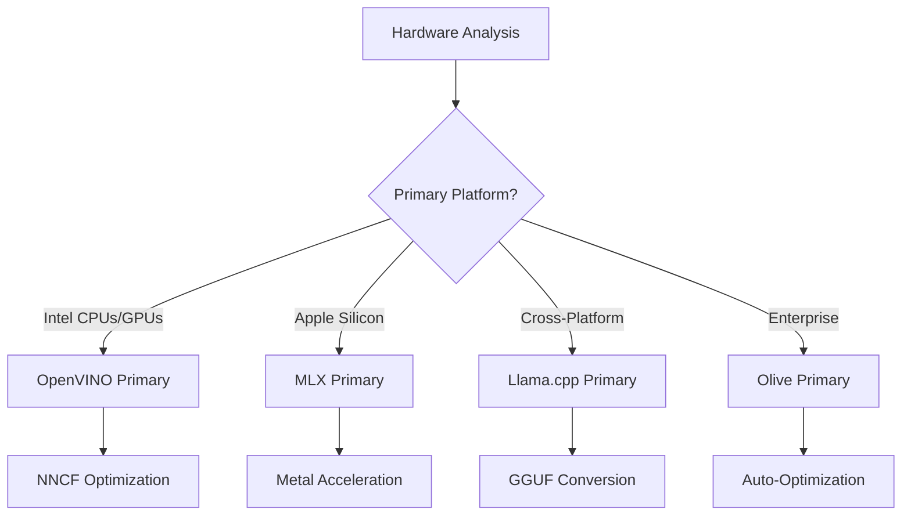
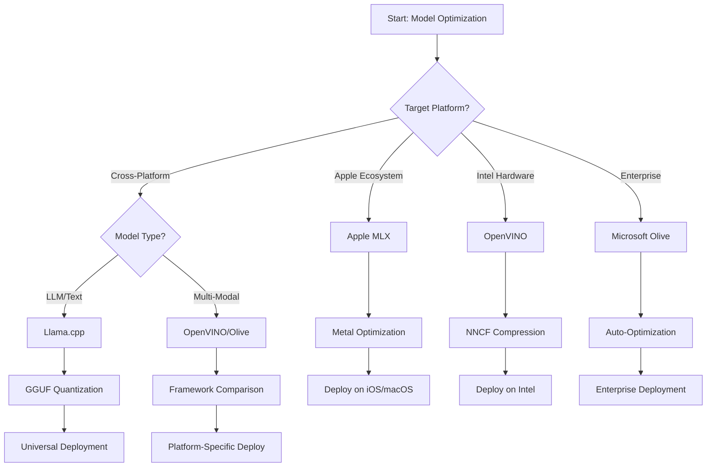
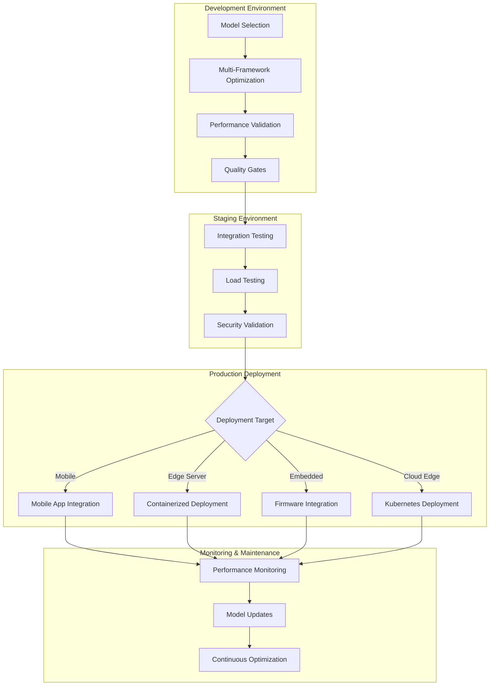

<!--
CO_OP_TRANSLATOR_METADATA:
{
  "original_hash": "6719c4a7e44b948230ac5f5cab3699bd",
  "translation_date": "2025-09-17T15:36:33+00:00",
  "source_file": "Module04/06.workflow-synthesis.md",
  "language_code": "fa"
}
-->
# بخش ۶: ترکیب جریان کاری توسعه هوش مصنوعی لبه

## فهرست مطالب
1. [مقدمه](../../../Module04)
2. [اهداف آموزشی](../../../Module04)
3. [نمای کلی جریان کاری یکپارچه](../../../Module04)
4. [ماتریس انتخاب چارچوب](../../../Module04)
5. [ترکیب بهترین روش‌ها](../../../Module04)
6. [راهنمای استراتژی استقرار](../../../Module04)
7. [جریان کاری بهینه‌سازی عملکرد](../../../Module04)
8. [چک‌لیست آمادگی برای تولید](../../../Module04)
9. [عیب‌یابی و نظارت](../../../Module04)
10. [آینده‌نگری در خط لوله هوش مصنوعی لبه](../../../Module04)

## مقدمه

توسعه هوش مصنوعی لبه نیازمند درک پیچیده‌ای از چارچوب‌های بهینه‌سازی، استراتژی‌های استقرار و ملاحظات سخت‌افزاری است. این ترکیب جامع، دانش حاصل از Llama.cpp، Microsoft Olive، OpenVINO و Apple MLX را گرد هم آورده تا یک جریان کاری یکپارچه ایجاد کند که بهره‌وری را به حداکثر برساند، کیفیت را حفظ کند و استقرار موفقیت‌آمیز در تولید را تضمین کند.

در طول این دوره، چارچوب‌های بهینه‌سازی فردی را بررسی کردیم که هر کدام نقاط قوت و موارد استفاده تخصصی خود را دارند. با این حال، پروژه‌های واقعی هوش مصنوعی لبه اغلب نیازمند ترکیب تکنیک‌های چندین چارچوب یا تصمیم‌گیری‌های استراتژیک درباره بهترین رویکرد برای محدودیت‌ها و نیازهای خاص هستند.

این بخش، خرد جمعی همه چارچوب‌ها را به جریان‌های کاری عملی، درخت‌های تصمیم‌گیری و بهترین روش‌ها ترکیب می‌کند که به شما امکان می‌دهد راه‌حل‌های هوش مصنوعی لبه آماده تولید را به طور کارآمد و مؤثر بسازید. چه در حال بهینه‌سازی برای دستگاه‌های موبایل، سیستم‌های تعبیه‌شده یا سرورهای لبه باشید، این راهنما چارچوب استراتژیکی برای تصمیم‌گیری آگاهانه در طول چرخه توسعه شما ارائه می‌دهد.

## اهداف آموزشی

تا پایان این بخش، شما قادر خواهید بود:

### تصمیم‌گیری استراتژیک
- **ارزیابی و انتخاب** بهترین چارچوب بهینه‌سازی بر اساس نیازهای پروژه، محدودیت‌های سخت‌افزاری و سناریوهای استقرار
- **طراحی جریان‌های کاری جامع** که تکنیک‌های بهینه‌سازی مختلف را برای حداکثر بهره‌وری ترکیب کنند
- **ارزیابی مبادلات** بین دقت مدل، سرعت استنتاج، استفاده از حافظه و پیچیدگی استقرار در چارچوب‌های مختلف

### یکپارچه‌سازی جریان کاری
- **پیاده‌سازی خطوط توسعه یکپارچه** که نقاط قوت چندین چارچوب بهینه‌سازی را به کار گیرند
- **ایجاد جریان‌های کاری قابل تکرار** برای بهینه‌سازی مدل و استقرار در محیط‌های مختلف
- **ایجاد دروازه‌های کیفیت** و فرآیندهای اعتبارسنجی برای اطمینان از اینکه مدل‌های بهینه‌سازی شده نیازهای تولید را برآورده می‌کنند

### بهینه‌سازی عملکرد
- **اعمال استراتژی‌های بهینه‌سازی سیستماتیک** با استفاده از کوانتیزاسیون، هرس کردن و تکنیک‌های شتاب‌دهی سخت‌افزاری
- **نظارت و ارزیابی عملکرد مدل** در سطوح مختلف بهینه‌سازی و اهداف استقرار
- **بهینه‌سازی برای پلتفرم‌های سخت‌افزاری خاص** شامل CPU، GPU، NPU و شتاب‌دهنده‌های لبه تخصصی

### استقرار تولید
- **طراحی معماری‌های استقرار مقیاس‌پذیر** که فرمت‌های مختلف مدل و موتورهای استنتاج را در بر گیرند
- **پیاده‌سازی نظارت و مشاهده‌پذیری** برای برنامه‌های هوش مصنوعی لبه در محیط‌های تولید
- **ایجاد جریان‌های کاری نگهداری** برای به‌روزرسانی مدل، نظارت بر عملکرد و بهینه‌سازی سیستم

### برتری چندپلتفرمی
- **استقرار مدل‌های بهینه‌سازی شده** در پلتفرم‌های سخت‌افزاری متنوع با حفظ عملکرد ثابت
- **مدیریت بهینه‌سازی‌های خاص پلتفرم** برای ویندوز، macOS، لینوکس، موبایل و سیستم‌های تعبیه‌شده
- **ایجاد لایه‌های انتزاعی** که استقرار بدون مشکل در محیط‌های مختلف لبه را امکان‌پذیر کنند

## نمای کلی جریان کاری یکپارچه

### مرحله ۱: تحلیل نیازها و انتخاب چارچوب

پایه موفقیت در استقرار هوش مصنوعی لبه با تحلیل دقیق نیازها آغاز می‌شود که انتخاب چارچوب و استراتژی بهینه‌سازی را اطلاع‌رسانی می‌کند.

#### ۱.۱ ارزیابی سخت‌افزار


**ملاحظات کلیدی:**
- **معماری CPU**: قابلیت‌های x86، ARM، Apple Silicon
- **دسترسی به شتاب‌دهنده**: GPU، NPU، VPU، چیپ‌های تخصصی هوش مصنوعی
- **محدودیت‌های حافظه**: محدودیت‌های RAM، ظرفیت ذخیره‌سازی
- **بودجه توان**: عمر باتری، محدودیت‌های حرارتی
- **اتصال‌پذیری**: نیازهای آفلاین، محدودیت‌های پهنای باند

#### ۱.۲ ماتریس نیازهای برنامه

| نیاز | Llama.cpp | Microsoft Olive | OpenVINO | Apple MLX |
|------|-----------|-----------------|----------|-----------|
| چندپلتفرمی | ✅ عالی | ⚡ خوب | ⚡ خوب | ❌ فقط اپل |
| یکپارچگی سازمانی | ⚡ پایه | ✅ عالی | ✅ عالی | ⚡ محدود |
| استقرار موبایل | ✅ عالی | ⚡ خوب | ⚡ خوب | ✅ عالی برای iOS |
| استنتاج بلادرنگ | ✅ عالی | ✅ عالی | ✅ عالی | ✅ عالی |
| تنوع مدل | ✅ تمرکز بر LLM | ✅ همه مدل‌ها | ✅ همه مدل‌ها | ✅ تمرکز بر LLM |
| سهولت استفاده | ✅ ساده | ✅ خودکار | ⚡ متوسط | ✅ ساده |

### مرحله ۲: آماده‌سازی و بهینه‌سازی مدل

#### ۲.۱ خط لوله ارزیابی مدل جهانی

```python
# Universal Model Assessment Framework
class EdgeAIModelAssessment:
    def __init__(self, model_path, target_hardware):
        self.model_path = model_path
        self.target_hardware = target_hardware
        self.optimization_frameworks = []
        
    def assess_model_characteristics(self):
        """Analyze model size, architecture, and complexity"""
        return {
            'model_size': self.get_model_size(),
            'parameter_count': self.get_parameter_count(),
            'architecture_type': self.detect_architecture(),
            'quantization_compatibility': self.check_quantization_support()
        }
    
    def recommend_optimization_strategy(self):
        """Recommend optimal frameworks and techniques"""
        characteristics = self.assess_model_characteristics()
        
        if self.target_hardware.startswith('apple'):
            return self.mlx_optimization_strategy(characteristics)
        elif self.target_hardware.startswith('intel'):
            return self.openvino_optimization_strategy(characteristics)
        elif characteristics['model_size'] > 7_000_000_000:  # 7B+ parameters
            return self.enterprise_optimization_strategy(characteristics)
        else:
            return self.lightweight_optimization_strategy(characteristics)
```

#### ۲.۲ خط لوله بهینه‌سازی چندچارچوبی

**رویکرد بهینه‌سازی ترتیبی:**
1. **تبدیل اولیه**: تبدیل به فرمت میانی (ONNX در صورت امکان)
2. **بهینه‌سازی خاص چارچوب**: اعمال تکنیک‌های تخصصی
3. **اعتبارسنجی متقابل**: بررسی عملکرد در پلتفرم‌های هدف
4. **بسته‌بندی نهایی**: آماده‌سازی برای استقرار

```bash
# Multi-Framework Optimization Script
#!/bin/bash

MODEL_NAME="phi-3-mini"
BASE_MODEL="microsoft/Phi-3-mini-4k-instruct"

# Phase 1: ONNX Conversion (Universal)
python convert_to_onnx.py --model $BASE_MODEL --output models/onnx/

# Phase 2: Platform-Specific Optimization
if [[ "$TARGET_PLATFORM" == "intel" ]]; then
    # OpenVINO Optimization
    python optimize_openvino.py --input models/onnx/ --output models/openvino/
elif [[ "$TARGET_PLATFORM" == "apple" ]]; then
    # MLX Optimization
    python optimize_mlx.py --input $BASE_MODEL --output models/mlx/
elif [[ "$TARGET_PLATFORM" == "cross" ]]; then
    # Llama.cpp Optimization
    python convert_to_gguf.py --input models/onnx/ --output models/gguf/
fi

# Phase 3: Validation
python validate_optimization.py --original $BASE_MODEL --optimized models/$TARGET_PLATFORM/
```

### مرحله ۳: اعتبارسنجی عملکرد و ارزیابی

#### ۳.۱ چارچوب ارزیابی جامع

```python
class EdgeAIBenchmark:
    def __init__(self, optimized_models):
        self.models = optimized_models
        self.metrics = {
            'inference_time': [],
            'memory_usage': [],
            'accuracy_score': [],
            'throughput': [],
            'energy_consumption': []
        }
    
    def run_comprehensive_benchmark(self):
        """Execute standardized benchmarks across all optimized models"""
        test_inputs = self.generate_test_inputs()
        
        for model_framework, model_path in self.models.items():
            print(f"Benchmarking {model_framework}...")
            
            # Latency Testing
            latency = self.measure_inference_latency(model_path, test_inputs)
            
            # Memory Profiling
            memory = self.profile_memory_usage(model_path)
            
            # Accuracy Validation
            accuracy = self.validate_model_accuracy(model_path, test_inputs)
            
            # Throughput Analysis
            throughput = self.measure_throughput(model_path)
            
            self.record_metrics(model_framework, latency, memory, accuracy, throughput)
    
    def generate_optimization_report(self):
        """Create comprehensive comparison report"""
        report = {
            'recommendations': self.analyze_performance_trade_offs(),
            'deployment_guidance': self.generate_deployment_recommendations(),
            'monitoring_requirements': self.define_monitoring_metrics()
        }
        return report
```

## ماتریس انتخاب چارچوب

### درخت تصمیم‌گیری برای انتخاب چارچوب



### معیارهای انتخاب جامع

#### ۱. تطابق با موارد استفاده اصلی

**مدل‌های زبان بزرگ (LLMs):**
- **Llama.cpp**: بهترین برای استقرار متمرکز بر CPU و چندپلتفرمی
- **Apple MLX**: بهینه برای Apple Silicon با حافظه یکپارچه
- **OpenVINO**: عالی برای سخت‌افزار Intel با بهینه‌سازی NNCF
- **Microsoft Olive**: ایده‌آل برای جریان‌های کاری سازمانی با خودکارسازی

**مدل‌های چندوجهی:**
- **OpenVINO**: پشتیبانی جامع از بینایی، صوت و متن
- **Microsoft Olive**: بهینه‌سازی سازمانی برای خطوط لوله پیچیده
- **Llama.cpp**: محدود به مدل‌های مبتنی بر متن
- **Apple MLX**: پشتیبانی در حال رشد از برنامه‌های چندوجهی

#### ۲. ماتریس پلتفرم سخت‌افزاری

| پلتفرم | چارچوب اصلی | گزینه ثانویه | ویژگی‌های تخصصی |
|--------|-------------|---------------|------------------|
| CPU/GPU Intel | OpenVINO | Microsoft Olive | فشرده‌سازی NNCF، بهینه‌سازی Intel |
| GPU NVIDIA | Microsoft Olive | OpenVINO | شتاب CUDA، ویژگی‌های سازمانی |
| Apple Silicon | Apple MLX | Llama.cpp | شیدرهای Metal، حافظه یکپارچه |
| موبایل ARM | Llama.cpp | OpenVINO | چندپلتفرمی، وابستگی‌های حداقلی |
| Edge TPU | OpenVINO | Microsoft Olive | پشتیبانی از شتاب‌دهنده تخصصی |
| ARM تعبیه‌شده | Llama.cpp | OpenVINO | ردپای کوچک، استنتاج کارآمد |

#### ۳. ترجیحات جریان کاری توسعه

**نمونه‌سازی سریع:**
1. **Llama.cpp**: سریع‌ترین راه‌اندازی، نتایج فوری
2. **Apple MLX**: API ساده پایتون، تکرار سریع
3. **Microsoft Olive**: بهینه‌سازی خودکار، پیکربندی حداقلی
4. **OpenVINO**: راه‌اندازی پیچیده‌تر، ویژگی‌های جامع

**تولید سازمانی:**
1. **Microsoft Olive**: ویژگی‌های سازمانی، یکپارچگی Azure
2. **OpenVINO**: اکوسیستم Intel، ابزارهای جامع
3. **Apple MLX**: برنامه‌های سازمانی خاص اپل
4. **Llama.cpp**: استقرار ساده، ویژگی‌های سازمانی محدود

## ترکیب بهترین روش‌ها

### اصول بهینه‌سازی جهانی

#### ۱. استراتژی بهینه‌سازی تدریجی

```python
class ProgressiveOptimization:
    def __init__(self, base_model):
        self.base_model = base_model
        self.optimization_stages = [
            'baseline_measurement',
            'format_conversion',
            'quantization_optimization',
            'hardware_acceleration',
            'production_validation'
        ]
    
    def execute_progressive_optimization(self):
        """Apply optimization techniques incrementally"""
        
        # Stage 1: Baseline Measurement
        baseline_metrics = self.measure_baseline_performance()
        
        # Stage 2: Format Conversion
        converted_model = self.convert_to_optimal_format()
        conversion_metrics = self.measure_performance(converted_model)
        
        # Stage 3: Quantization
        quantized_model = self.apply_quantization(converted_model)
        quantization_metrics = self.measure_performance(quantized_model)
        
        # Stage 4: Hardware Acceleration
        accelerated_model = self.enable_hardware_acceleration(quantized_model)
        acceleration_metrics = self.measure_performance(accelerated_model)
        
        # Stage 5: Validation
        production_ready = self.validate_for_production(accelerated_model)
        
        return self.compile_optimization_report(
            baseline_metrics, conversion_metrics, 
            quantization_metrics, acceleration_metrics
        )
```

#### ۲. پیاده‌سازی دروازه‌های کیفیت

**دروازه‌های حفظ دقت:**
- حفظ بیش از ۹۵٪ دقت مدل اصلی
- اعتبارسنجی با مجموعه داده‌های آزمایشی نماینده
- پیاده‌سازی تست A/B برای اعتبارسنجی تولید

**دروازه‌های بهبود عملکرد:**
- دستیابی به حداقل ۲ برابر بهبود سرعت
- کاهش ردپای حافظه حداقل ۵۰٪
- اعتبارسنجی ثبات زمان استنتاج

**دروازه‌های آمادگی تولید:**
- عبور از تست‌های فشار تحت بار
- نشان دادن عملکرد پایدار در طول زمان
- اعتبارسنجی الزامات امنیتی و حریم خصوصی

### یکپارچه‌سازی بهترین روش‌های خاص چارچوب

#### ۱. ترکیب استراتژی کوانتیزاسیون

```python
# Unified Quantization Approach
class UnifiedQuantizationStrategy:
    def __init__(self, model, target_platform):
        self.model = model
        self.platform = target_platform
        
    def select_optimal_quantization(self):
        """Choose best quantization based on platform and requirements"""
        
        if self.platform == 'apple_silicon':
            return self.mlx_quantization_strategy()
        elif self.platform == 'intel_hardware':
            return self.openvino_quantization_strategy()
        elif self.platform == 'cross_platform':
            return self.llamacpp_quantization_strategy()
        else:
            return self.olive_quantization_strategy()
    
    def mlx_quantization_strategy(self):
        """Apple MLX-specific quantization"""
        return {
            'method': 'mlx_quantize',
            'precision': 'int4',
            'group_size': 64,
            'optimization_target': 'unified_memory'
        }
    
    def openvino_quantization_strategy(self):
        """OpenVINO NNCF quantization"""
        return {
            'method': 'nncf_quantize',
            'precision': 'int8',
            'calibration_method': 'post_training',
            'optimization_target': 'intel_hardware'
        }
```

#### ۲. بهینه‌سازی شتاب‌دهی سخت‌افزاری

**ترکیب بهینه‌سازی CPU:**
- **دستورالعمل‌های SIMD**: استفاده از هسته‌های بهینه در چارچوب‌ها
- **پهنای باند حافظه**: بهینه‌سازی چیدمان داده‌ها برای کارایی کش
- **رشته‌بندی**: تعادل موازی‌سازی با محدودیت‌های منابع

**بهترین روش‌های شتاب GPU:**
- **پردازش دسته‌ای**: به حداکثر رساندن توان عملیاتی با اندازه‌های دسته مناسب
- **مدیریت حافظه**: بهینه‌سازی تخصیص حافظه GPU و انتقال‌ها
- **دقت**: استفاده از FP16 در صورت پشتیبانی برای عملکرد بهتر

**بهینه‌سازی شتاب‌دهنده‌های NPU/تخصصی:**
- **معماری مدل**: اطمینان از سازگاری با قابلیت‌های شتاب‌دهنده
- **جریان داده**: بهینه‌سازی خطوط ورودی/خروجی برای کارایی شتاب‌دهنده
- **استراتژی‌های جایگزین**: پیاده‌سازی جایگزین CPU برای عملیات‌های پشتیبانی نشده

## راهنمای استراتژی استقرار

### معماری استقرار جهانی



### الگوهای استقرار خاص پلتفرم

#### ۱. استراتژی استقرار موبایل

```yaml
# Mobile Deployment Configuration
mobile_deployment:
  ios:
    framework: apple_mlx
    optimization:
      quantization: int4
      memory_mapping: true
      background_execution: limited
    packaging:
      format: mlx
      bundle_size: <50MB
      
  android:
    framework: llama_cpp
    optimization:
      quantization: q4_k_m
      threading: android_optimized
      memory_management: conservative
    packaging:
      format: gguf
      apk_size: <100MB
      
  cross_platform:
    framework: onnx_runtime
    optimization:
      quantization: int8
      execution_provider: cpu
    packaging:
      format: onnx
      shared_libraries: minimal
```

#### ۲. استقرار سرور لبه

```yaml
# Edge Server Deployment Configuration
edge_server:
  intel_based:
    framework: openvino
    optimization:
      quantization: int8
      acceleration: cpu_gpu_auto
      batch_processing: dynamic
    deployment:
      container: openvino_runtime
      orchestration: kubernetes
      scaling: horizontal
      
  nvidia_based:
    framework: microsoft_olive
    optimization:
      quantization: int4
      acceleration: cuda
      tensor_parallelism: true
    deployment:
      container: nvidia_triton
      orchestration: kubernetes
      scaling: gpu_aware
```

### بهترین روش‌های کانتینری‌سازی

```dockerfile
# Multi-Framework Edge AI Container
FROM ubuntu:22.04 as base

# Install common dependencies
RUN apt-get update && apt-get install -y \
    python3 \
    python3-pip \
    build-essential \
    cmake \
    && rm -rf /var/lib/apt/lists/*

# Framework-specific stages
FROM base as openvino
RUN pip install openvino nncf optimum[intel]

FROM base as llamacpp
RUN git clone https://github.com/ggerganov/llama.cpp.git \
    && cd llama.cpp && make LLAMA_OPENBLAS=1

FROM base as olive
RUN pip install olive-ai[auto-opt] onnxruntime-genai

# Production stage with selected framework
FROM openvino as production
COPY models/ /app/models/
COPY src/ /app/src/
WORKDIR /app

EXPOSE 8080
CMD ["python3", "src/inference_server.py"]
```

## جریان کاری بهینه‌سازی عملکرد

### تنظیم عملکرد سیستماتیک

#### ۱. خط لوله پروفایل عملکرد

```python
class EdgeAIPerformanceProfiler:
    def __init__(self, model_path, framework):
        self.model_path = model_path
        self.framework = framework
        self.profiling_results = {}
    
    def comprehensive_profiling(self):
        """Execute comprehensive performance analysis"""
        
        # CPU Profiling
        cpu_profile = self.profile_cpu_usage()
        
        # Memory Profiling
        memory_profile = self.profile_memory_usage()
        
        # Inference Latency
        latency_profile = self.profile_inference_latency()
        
        # Throughput Analysis
        throughput_profile = self.profile_throughput()
        
        # Energy Consumption (where available)
        energy_profile = self.profile_energy_consumption()
        
        return self.compile_performance_report(
            cpu_profile, memory_profile, latency_profile,
            throughput_profile, energy_profile
        )
    
    def identify_bottlenecks(self):
        """Automatically identify performance bottlenecks"""
        bottlenecks = []
        
        if self.profiling_results['cpu_utilization'] > 80:
            bottlenecks.append('cpu_bound')
        
        if self.profiling_results['memory_usage'] > 90:
            bottlenecks.append('memory_bound')
        
        if self.profiling_results['inference_variance'] > 20:
            bottlenecks.append('inconsistent_performance')
        
        return self.generate_optimization_recommendations(bottlenecks)
```

#### ۲. خط لوله بهینه‌سازی خودکار

```python
class AutomatedOptimizationPipeline:
    def __init__(self, base_model, target_constraints):
        self.base_model = base_model
        self.constraints = target_constraints
        self.optimization_history = []
    
    def execute_optimization_search(self):
        """Systematically search optimization space"""
        
        optimization_candidates = [
            {'quantization': 'int8', 'pruning': 0.1},
            {'quantization': 'int4', 'pruning': 0.2},
            {'quantization': 'int8', 'acceleration': 'gpu'},
            {'quantization': 'int4', 'acceleration': 'npu'}
        ]
        
        best_configuration = None
        best_score = 0
        
        for config in optimization_candidates:
            optimized_model = self.apply_optimization(config)
            score = self.evaluate_optimization(optimized_model)
            
            if score > best_score and self.meets_constraints(optimized_model):
                best_score = score
                best_configuration = config
            
            self.optimization_history.append({
                'config': config,
                'score': score,
                'model': optimized_model
            })
        
        return best_configuration, self.optimization_history
```

### بهینه‌سازی چندهدفه

#### ۱. بهینه‌سازی پارتو برای هوش مصنوعی لبه

```python
class ParetoOptimization:
    def __init__(self, objectives=['speed', 'accuracy', 'memory']):
        self.objectives = objectives
        self.pareto_frontier = []
    
    def find_pareto_optimal_solutions(self, optimization_results):
        """Identify Pareto-optimal configurations"""
        
        for result in optimization_results:
            is_dominated = False
            
            for frontier_point in self.pareto_frontier:
                if self.dominates(frontier_point, result):
                    is_dominated = True
                    break
            
            if not is_dominated:
                # Remove dominated points from frontier
                self.pareto_frontier = [
                    point for point in self.pareto_frontier 
                    if not self.dominates(result, point)
                ]
                
                self.pareto_frontier.append(result)
        
        return self.pareto_frontier
    
    def recommend_configuration(self, user_preferences):
        """Recommend configuration based on user preferences"""
        
        weighted_scores = []
        for config in self.pareto_frontier:
            score = sum(
                user_preferences[obj] * config['metrics'][obj] 
                for obj in self.objectives
            )
            weighted_scores.append((score, config))
        
        return max(weighted_scores, key=lambda x: x[0])[1]
```

## چک‌لیست آمادگی برای تولید

### اعتبارسنجی جامع تولید

#### ۱. تضمین کیفیت مدل

```python
class ProductionReadinessValidator:
    def __init__(self, optimized_model, production_requirements):
        self.model = optimized_model
        self.requirements = production_requirements
        self.validation_results = {}
    
    def validate_model_quality(self):
        """Comprehensive model quality validation"""
        
        # Accuracy Validation
        accuracy_result = self.validate_accuracy()
        
        # Performance Validation
        performance_result = self.validate_performance()
        
        # Robustness Testing
        robustness_result = self.validate_robustness()
        
        # Security Assessment
        security_result = self.validate_security()
        
        # Compliance Verification
        compliance_result = self.validate_compliance()
        
        return self.compile_validation_report(
            accuracy_result, performance_result, robustness_result,
            security_result, compliance_result
        )
    
    def generate_certification_report(self):
        """Generate production certification report"""
        return {
            'model_signature': self.generate_model_signature(),
            'validation_timestamp': datetime.now(),
            'validation_results': self.validation_results,
            'deployment_approval': self.check_deployment_approval(),
            'monitoring_requirements': self.define_monitoring_requirements()
        }
```

#### ۲. چک‌لیست استقرار تولید

**اعتبارسنجی پیش از استقرار:**
- [ ] دقت مدل الزامات حداقلی را برآورده می‌کند (>۹۵٪ از خط پایه)
- [ ] اهداف عملکرد محقق شده‌اند (زمان تأخیر، توان عملیاتی، حافظه)
- [ ] آسیب‌پذیری‌های امنیتی ارزیابی و کاهش یافته‌اند
- [ ] تست فشار تحت بار مورد انتظار انجام شده است
- [ ] سناریوهای شکست آزمایش شده و روش‌های بازیابی اعتبارسنجی شده‌اند
- [ ] سیستم‌های نظارت و هشدار پیکربندی شده‌اند
- [ ] روش‌های بازگشت آزمایش و مستند شده‌اند

**فرآیند استقرار:**
- [ ] استراتژی استقرار آبی-سبز پیاده‌سازی شده است
- [ ] افزایش تدریجی ترافیک پیکربندی شده است
- [ ] داشبوردهای نظارت بلادرنگ فعال هستند
- [ ] خطوط پایه عملکرد ایجاد شده‌اند
- [ ] آستانه‌های نرخ خطا تعریف شده‌اند
- [ ] محرک‌های بازگشت خودکار پیکربندی شده‌اند

**نظارت پس از استقرار:**
- [ ] تشخیص انحراف مدل فعال است
- [ ] هشدارهای کاهش عملکرد پیکربندی شده‌اند
- [ ] نظارت بر استفاده از منابع فعال است
- [ ] معیارهای تجربه کاربر ردیابی می‌شوند
- [ ] نسخه‌بندی و شجره‌نامه مدل حفظ شده است
- [ ] بررسی‌های منظم عملکرد مدل برنامه‌ریزی شده‌اند

### یکپارچه‌سازی/استقرار مداوم (CI/CD)

```yaml
# Edge AI CI/CD Pipeline Configuration
edge_ai_pipeline:
  stages:
    - model_validation
    - optimization
    - testing
    - staging_deployment
    - production_deployment
    - monitoring
  
  model_validation:
    accuracy_threshold: 0.95
    performance_baseline: required
    security_scan: enabled
    
  optimization:
    frameworks:
      - llama_cpp
      - openvino
      - microsoft_olive
    validation:
      cross_validation: enabled
      performance_comparison: required
      
  testing:
    unit_tests: comprehensive
    integration_tests: full_pipeline
    load_tests: production_scale
    security_tests: comprehensive
    
  deployment:
    strategy: blue_green
    traffic_ramping: gradual
    rollback: automatic
    monitoring: real_time
```

## عیب‌یابی و نظارت

### چارچوب عیب‌یابی جهانی

#### ۱. مشکلات رایج و راه‌حل‌ها

**مشکلات عملکرد:**
```python
class PerformanceTroubleshooter:
    def __init__(self, model_metrics):
        self.metrics = model_metrics
        
    def diagnose_performance_issues(self):
        """Systematic performance issue diagnosis"""
        
        issues = []
        
        # High latency diagnosis
        if self.metrics['avg_latency'] > self.metrics['target_latency']:
            issues.append(self.diagnose_latency_issues())
        
        # Memory usage diagnosis
        if self.metrics['memory_usage'] > self.metrics['memory_limit']:
            issues.append(self.diagnose_memory_issues())
        
        # Throughput diagnosis
        if self.metrics['throughput'] < self.metrics['target_throughput']:
            issues.append(self.diagnose_throughput_issues())
        
        return self.generate_resolution_plan(issues)
    
    def diagnose_latency_issues(self):
        """Specific latency troubleshooting"""
        potential_causes = []
        
        if self.metrics['cpu_utilization'] > 80:
            potential_causes.append('cpu_bottleneck')
        
        if self.metrics['memory_bandwidth'] > 90:
            potential_causes.append('memory_bandwidth_limit')
        
        if self.metrics['model_size'] > self.metrics['optimal_size']:
            potential_causes.append('model_too_large')
        
        return {
            'issue': 'high_latency',
            'causes': potential_causes,
            'solutions': self.generate_latency_solutions(potential_causes)
        }
```

**عیب‌یابی خاص چارچوب:**

| مشکل | Llama.cpp | Microsoft Olive | OpenVINO | Apple MLX |
|------|-----------|-----------------|----------|-----------|
| مشکلات حافظه | کاهش طول زمینه | کاهش اندازه دسته | فعال کردن کش | استفاده از نگاشت حافظه |
| استنتاج کند | فعال کردن SIMD | بررسی کوانتیزاسیون | بهینه‌سازی رشته‌بندی | فعال کردن Metal |
| کاهش دقت | کوانتیزاسیون بالاتر | آموزش مجدد با QAT | افزایش کالیبراسیون | تنظیم دقیق پس از کوانت |
| ناسازگاری | بررسی فرمت مدل | تأیید نسخه چارچوب | به‌روزرسانی درایورها | بررسی نسخه macOS |

#### ۲. استراتژی نظارت تولید

```python
class EdgeAIMonitoring:
    def __init__(self, deployment_config):
        self.config = deployment_config
        self.metrics_collectors = []
        self.alerting_rules = []
    
    def setup_comprehensive_monitoring(self):
        """Configure comprehensive monitoring for Edge AI deployment"""
        
        # Model Performance Monitoring
        self.setup_model_performance_monitoring()
        
        # Infrastructure Monitoring
        self.setup_infrastructure_monitoring()
        
        # Business Metrics Monitoring
        self.setup_business_metrics_monitoring()
        
        # Security Monitoring
        self.setup_security_monitoring()
    
    def setup_model_performance_monitoring(self):
        """Model-specific performance monitoring"""
        metrics = [
            'inference_latency_p50',
            'inference_latency_p95',
            'inference_latency_p99',
            'model_accuracy_drift',
            'prediction_confidence_distribution',
            'error_rate',
            'throughput_requests_per_second'
        ]
        
        for metric in metrics:
            self.add_metric_collector(metric)
            self.add_alerting_rule(metric)
    
    def detect_model_drift(self):
        """Automated model drift detection"""
        drift_indicators = [
            self.statistical_drift_detection(),
            self.performance_drift_detection(),
            self.data_distribution_shift_detection()
        ]
        
        return self.aggregate_drift_signals(drift_indicators)
```

### حل خودکار مشکلات

```python
class AutomatedIssueResolution:
    def __init__(self, monitoring_system):
        self.monitoring = monitoring_system
        self.resolution_strategies = {}
    
    def handle_performance_degradation(self, alert):
        """Automated performance issue resolution"""
        
        if alert['type'] == 'high_latency':
            return self.resolve_latency_issue(alert)
        elif alert['type'] == 'high_memory_usage':
            return self.resolve_memory_issue(alert)
        elif alert['type'] == 'accuracy_drift':
            return self.resolve_accuracy_issue(alert)
        
    def resolve_latency_issue(self, alert):
        """Automated latency issue resolution"""
        resolution_steps = [
            'increase_cpu_allocation',
            'enable_model_caching',
            'reduce_batch_size',
            'switch_to_quantized_model'
        ]
        
        for step in resolution_steps:
            if self.apply_resolution_step(step):
                return f"Resolved latency issue with: {step}"
        
        return "Escalating to human operator"
```

## آینده‌نگری در خط لوله هوش مصنوعی لبه

### یکپارچه‌سازی فناوری‌های نوظهور

#### ۱. پشتیبانی از سخت‌افزار نسل بعدی

```python
class FutureHardwareIntegration:
    def __init__(self):
        self.supported_accelerators = [
            'npu_next_gen',
            'quantum_processors',
            'neuromorphic_chips',
            'optical_processors'
        ]
    
    def design_adaptive_pipeline(self):
        """Create hardware-agnostic optimization pipeline"""
        
        pipeline = {
            'model_preparation': self.universal_model_preparation(),
            'hardware_detection': self.dynamic_hardware_detection(),
            'optimization_selection': self.adaptive_optimization_selection(),
            'performance_validation': self.hardware_agnostic_validation()
        }
        
        return pipeline
    
    def adaptive_optimization_selection(self):
        """Dynamically select optimization based on available hardware"""
        
        def optimize_for_hardware(model, available_hardware):
            if 'npu' in available_hardware:
                return self.npu_optimization(model)
            elif 'quantum' in available_hardware:
                return self.quantum_optimization(model)
            elif 'neuromorphic' in available_hardware:
                return self.neuromorphic_optimization(model)
            else:
                return self.fallback_optimization(model)
        
        return optimize_for_hardware
```

#### ۲. تکامل معماری مدل

**پشتیبانی از معماری‌های نوظهور:**
- **ترکیب متخصصان (MoE)**: معماری‌های مدل پراکنده برای بهره‌وری
- **تولید تقویت‌شده با بازیابی**: سیستم‌های ترکیبی مدل + پایگاه دانش
- **مدل‌های چندوجهی**: یکپارچه‌سازی بینایی + زبان + صوت
- **یادگیری فدرال**: آموزش و بهینه‌سازی توزیع‌شده

```python
class NextGenModelSupport:
    def __init__(self):
        self.architecture_handlers = {
            'moe': self.handle_mixture_of_experts,
            'rag': self.handle_retrieval_augmented,
            'multimodal': self.handle_multimodal,
            'federated': self.handle_federated_learning
        }
    
    def handle_mixture_of_experts(self, model):
        """Optimize Mixture of Experts models for edge deployment"""
        optimization_strategy = {
            'expert_pruning': True,
            'routing_optimization': True,
            'expert_quantization': 'per_expert',
            'load_balancing': 'dynamic'
        }
        return self.apply_moe_optimization(model, optimization_strategy)
```

### یادگیری و تطبیق مداوم

#### ۱. یکپارچه‌سازی یادگیری آنلاین

```python
class EdgeOnlineLearning:
    def __init__(self, base_model, learning_rate=0.001):
        self.base_model = base_model
        self.learning_rate = learning_rate
        self.adaptation_buffer = []
    
    def continuous_adaptation(self, new_data, feedback):
        """Continuously adapt model based on edge data"""
        
        # Privacy-preserving local adaptation
        local_updates = self.compute_local_gradients(new_data, feedback)
        
        # Apply updates with constraints
        adapted_model = self.apply_constrained_updates(
            self.base_model, local_updates
        )
        
        # Validate adaptation quality
        if self.validate_adaptation(adapted_model):
            self.base_model = adapted_model
            return True
        
        return False
    
    def federated_learning_participation(self):
        """Participate in federated learning while preserving privacy"""
        
        # Compute local model updates
        local_updates = self.compute_private_updates()
        
        # Differential privacy protection
        private_updates = self.apply_differential_privacy(local_updates)
        
        # Share with federated learning coordinator
        return self.share_updates(private_updates)
```

#### ۲. پایداری و هوش مصنوعی سبز

```python
class GreenEdgeAI:
    def __init__(self, sustainability_targets):
        self.targets = sustainability_targets
        self.energy_monitor = EnergyMonitor()
    
    def optimize_for_sustainability(self, model):
        """Optimize model for minimal environmental impact"""
        
        optimization_objectives = [
            'minimize_energy_consumption',
            'maximize_hardware_utilization',
            'reduce_model_training_cost',
            'extend_device_lifetime'
        ]
        
        return self.multi_objective_green_optimization(
            model, optimization_objectives
        )
    
    def carbon_aware_deployment(self):
        """Deploy models considering carbon footprint"""
        
        deployment_strategy = {
            'prefer_renewable_energy_regions': True,
            'optimize_for_energy_efficiency': True,
            'minimize_data_transfer': True,
            'lifecycle_carbon_accounting': True
        }
        
        return deployment_strategy
```

## نتیجه‌گیری

این ترکیب جامع جریان کاری، نمایانگر اوج دانش بهینه‌سازی هوش مصنوعی لبه است که بهترین روش‌ها از همه چارچوب‌های اصلی بهینه‌سازی را در یک رویکرد یکپارچه و آماده تولید گرد هم آورده است. با پیروی از این دستورالعمل‌ها، شما قادر خواهید بود:

**دستیابی به عملکرد بهینه**: از طریق انتخاب چارچوب سیستماتیک، بهینه‌سازی تدریجی و اعتبارسنجی جامع، اطمینان حاصل کنید که برنامه‌های هوش مصنوعی لبه شما حداکثر بهره‌وری را ارائه می‌دهند.

**تضمین آمادگی تولید**: با آزمایش‌های دقیق، نظارت و دروازه‌های کیفیت که استقرار و عملکرد قابل اعتماد در محیط‌های واقعی را تضمین می‌کنند.

**حفظ موفقیت بلندمدت**: از طریق نظارت مداوم، حل خودکار مشکلات و استراتژی‌های تطبیق که راه‌حل‌های هوش مصنوعی لبه شما را کارآمد و مرتبط نگه می‌دارند.

**آینده‌نگری سرمایه‌گذاری شما**: با طراحی خطوط لوله انعطاف‌پذیر و سخت‌افزار-آگنوستیک که می‌توانند با فناوری‌ها و نیازهای نوظهور تک
به یاد داشته باشید که بهترین استراتژی بهینه‌سازی، استراتژی‌ای است که نیازهای خاص شما را برآورده کند و در عین حال انعطاف‌پذیری لازم برای تطبیق با تغییرات این نیازها را حفظ کند. از این راهنما به عنوان چارچوبی برای تصمیم‌گیری‌های آگاهانه استفاده کنید، اما همیشه انتخاب‌های خود را از طریق آزمایش‌های تجربی و تجربه‌های واقعی در محیط عملیاتی تأیید کنید.

## ➡️ گام بعدی

سفر خود در زمینه هوش مصنوعی لبه‌ای را با بررسی [ماژول ۵: SLMOps و استقرار در محیط تولید](../Module05/README.md) ادامه دهید تا درباره جنبه‌های عملیاتی مدیریت چرخه عمر مدل‌های زبان کوچک بیشتر بیاموزید.

---

**سلب مسئولیت**:  
این سند با استفاده از سرویس ترجمه هوش مصنوعی [Co-op Translator](https://github.com/Azure/co-op-translator) ترجمه شده است. در حالی که ما تلاش می‌کنیم دقت را حفظ کنیم، لطفاً توجه داشته باشید که ترجمه‌های خودکار ممکن است شامل خطاها یا نادرستی‌ها باشند. سند اصلی به زبان اصلی آن باید به عنوان منبع معتبر در نظر گرفته شود. برای اطلاعات حساس، توصیه می‌شود از ترجمه حرفه‌ای انسانی استفاده کنید. ما مسئولیتی در قبال سوءتفاهم‌ها یا تفسیرهای نادرست ناشی از استفاده از این ترجمه نداریم.