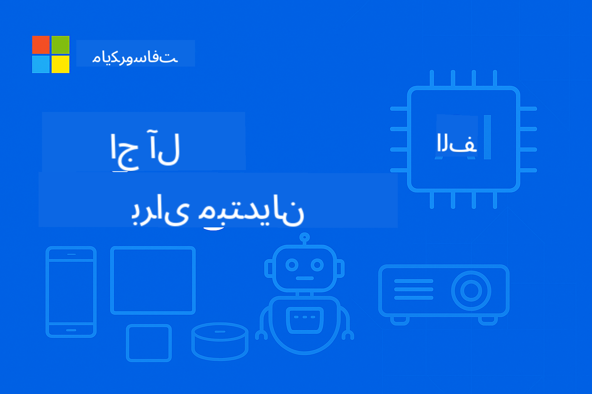

<!--
CO_OP_TRANSLATOR_METADATA:
{
  "original_hash": "8bcf70fe61c9007c880f9753cc9c3e01",
  "translation_date": "2025-10-08T21:21:37+00:00",
  "source_file": "README.md",
  "language_code": "fa"
}
-->
# EdgeAI برای مبتدیان



[](https://GitHub.com/microsoft/edgeai-for-beginners/graphs/contributors)
[](https://GitHub.com/microsoft/edgeai-for-beginners/issues)
[](https://GitHub.com/microsoft/edgeai-for-beginners/pulls)
[](http://makeapullrequest.com)

[](https://GitHub.com/microsoft/edgeai-for-beginners/watchers)
[](https://GitHub.com/microsoft/edgeai-for-beginners/fork)
[](https://GitHub.com/microsoft/edgeai-for-beginners/stargazers)

[](https://discord.com/invite/ByRwuEEgH4)

برای شروع استفاده از این منابع، مراحل زیر را دنبال کنید:

1. **مخزن را انشعاب دهید**: کلیک کنید [](https://GitHub.com/microsoft/edgeai-for-beginners/fork)
2. **مخزن را کلون کنید**: `git clone https://github.com/microsoft/edgeai-for-beginners.git`
3. [**به Discord Azure AI Foundry بپیوندید و با کارشناسان و توسعه‌دهندگان دیگر آشنا شوید**](https://discord.com/invite/ByRwuEEgH4)

### 🌐 پشتیبانی چندزبانه

#### پشتیبانی شده از طریق GitHub Action (به‌صورت خودکار و همیشه به‌روز)

[عربی](../ar/README.md) | [بنگالی](../bn/README.md) | [بلغاری](../bg/README.md) | [برمه‌ای (میانمار)](../my/README.md) | [چینی (ساده‌شده)](../zh/README.md) | [چینی (سنتی، هنگ‌کنگ)](../hk/README.md) | [چینی (سنتی، ماکائو)](../mo/README.md) | [چینی (سنتی، تایوان)](../tw/README.md) | [کرواتی](../hr/README.md) | [چکی](../cs/README.md) | [دانمارکی](../da/README.md) | [هلندی](../nl/README.md) | [فنلاندی](../fi/README.md) | [فرانسوی](../fr/README.md) | [آلمانی](../de/README.md) | [یونانی](../el/README.md) | [عبری](../he/README.md) | [هندی](../hi/README.md) | [مجاری](../hu/README.md) | [اندونزیایی](../id/README.md) | [ایتالیایی](../it/README.md) | [ژاپنی](../ja/README.md) | [کره‌ای](../ko/README.md) | [مالایی](../ms/README.md) | [مراتی](../mr/README.md) | [نپالی](../ne/README.md) | [نروژی](../no/README.md) | [فارسی](./README.md) | [لهستانی](../pl/README.md) | [پرتغالی (برزیل)](../br/README.md) | [پرتغالی (پرتغال)](../pt/README.md) | [پنجابی (گرمکھی)](../pa/README.md) | [رومانیایی](../ro/README.md) | [روسی](../ru/README.md) | [صربی (سیریلیک)](../sr/README.md) | [اسلواکی](../sk/README.md) | [اسلوونیایی](../sl/README.md) | [اسپانیایی](../es/README.md) | [سواحیلی](../sw/README.md) | [سوئدی](../sv/README.md) | [تاگالوگ (فیلیپینی)](../tl/README.md) | [تایلندی](../th/README.md) | [ترکی](../tr/README.md) | [اوکراینی](../uk/README.md) | [اردو](../ur/README.md) | [ویتنامی](../vi/README.md)

**اگر مایل به اضافه شدن زبان‌های ترجمه‌ای بیشتری هستید، لیست زبان‌های پشتیبانی‌شده [اینجا](https://github.com/Azure/co-op-translator/blob/main/getting_started/supported-languages.md) موجود است.**

## مقدمه

به **EdgeAI برای مبتدیان** خوش آمدید – سفری جامع به دنیای تحول‌آفرین هوش مصنوعی لبه. این دوره شکاف بین قابلیت‌های قدرتمند هوش مصنوعی و پیاده‌سازی عملی در دستگاه‌های لبه را پر می‌کند و به شما این امکان را می‌دهد که از پتانسیل هوش مصنوعی مستقیماً در جایی که داده‌ها تولید می‌شوند و تصمیمات باید گرفته شوند، بهره‌برداری کنید.

### آنچه خواهید آموخت

این دوره شما را از مفاهیم پایه تا پیاده‌سازی‌های آماده تولید هدایت می‌کند و شامل موارد زیر است:
- **مدل‌های زبانی کوچک (SLMs)** بهینه‌شده برای پیاده‌سازی در لبه
- **بهینه‌سازی مبتنی بر سخت‌افزار** در پلتفرم‌های متنوع
- **استنتاج بلادرنگ** با قابلیت‌های حفظ حریم خصوصی
- **استراتژی‌های پیاده‌سازی تولیدی** برای کاربردهای سازمانی

### چرا EdgeAI اهمیت دارد؟

هوش مصنوعی لبه یک تغییر پارادایم است که به چالش‌های مدرن مهمی پاسخ می‌دهد:
- **حریم خصوصی و امنیت**: پردازش داده‌های حساس به‌صورت محلی بدون نیاز به ارسال به فضای ابری
- **عملکرد بلادرنگ**: حذف تأخیر شبکه برای کاربردهای حساس به زمان
- **کارایی هزینه**: کاهش هزینه‌های پهنای باند و محاسبات ابری
- **عملیات پایدار**: حفظ عملکرد در زمان قطعی شبکه
- **رعایت مقررات**: تطابق با الزامات حاکمیت داده

### هوش مصنوعی لبه

هوش مصنوعی لبه به اجرای الگوریتم‌ها و مدل‌های زبانی هوش مصنوعی به‌صورت محلی روی سخت‌افزار، نزدیک به جایی که داده‌ها تولید می‌شوند، بدون وابستگی به منابع ابری برای استنتاج اشاره دارد. این فناوری تأخیر را کاهش می‌دهد، حریم خصوصی را بهبود می‌بخشد و تصمیم‌گیری بلادرنگ را ممکن می‌سازد.

### اصول اصلی:
- **استنتاج روی دستگاه**: اجرای مدل‌های هوش مصنوعی روی دستگاه‌های لبه (مانند تلفن‌ها، روترها، میکروکنترلرها، کامپیوترهای صنعتی)
- **قابلیت آفلاین**: عملکرد بدون نیاز به اتصال مداوم به اینترنت
- **تأخیر کم**: پاسخ‌های فوری مناسب برای سیستم‌های بلادرنگ
- **حاکمیت داده**: نگهداری داده‌های حساس به‌صورت محلی، بهبود امنیت و تطابق

### مدل‌های زبانی کوچک (SLMs)

مدل‌هایی مانند Phi-4، Mistral-7B و Gemma نسخه‌های بهینه‌شده‌ای از مدل‌های زبانی بزرگ‌تر هستند که برای موارد زیر آموزش یا تقطیر شده‌اند:
- **کاهش حافظه مورد نیاز**: استفاده بهینه از حافظه محدود دستگاه‌های لبه
- **کاهش نیاز به محاسبات**: بهینه‌شده برای عملکرد CPU و GPU لبه
- **زمان راه‌اندازی سریع‌تر**: شروع سریع برای برنامه‌های پاسخگو

این مدل‌ها قابلیت‌های قدرتمند پردازش زبان طبیعی را در حالی که محدودیت‌های زیر را رعایت می‌کنند، فراهم می‌کنند:
- **سیستم‌های تعبیه‌شده**: دستگاه‌های IoT و کنترلرهای صنعتی
- **دستگاه‌های موبایل**: تلفن‌های هوشمند و تبلت‌ها با قابلیت‌های آفلاین
- **دستگاه‌های IoT**: حسگرها و دستگاه‌های هوشمند با منابع محدود
- **سرورهای لبه**: واحدهای پردازش محلی با منابع GPU محدود
- **کامپیوترهای شخصی**: سناریوهای پیاده‌سازی روی دسکتاپ و لپ‌تاپ

## ماژول‌های دوره و مسیر یادگیری

| ماژول | موضوع | حوزه تمرکز | محتوای کلیدی | سطح | مدت زمان |
|--------|-------|------------|-------------|--------|----------|
| [📖 00 ](./introduction.md) | [مقدمه‌ای بر EdgeAI](./introduction.md) | پایه و زمینه | مرور EdgeAI • کاربردهای صنعتی • معرفی SLM • اهداف یادگیری | مبتدی | 1-2 ساعت |
| [📚 01](../../Module01) | [مبانی EdgeAI](./Module01/README.md) | مقایسه هوش مصنوعی ابری و لبه | مبانی EdgeAI • مطالعات موردی واقعی • راهنمای پیاده‌سازی • پیاده‌سازی لبه | مبتدی | 3-4 ساعت |
| [🧠 02](../../Module02) | [مبانی مدل SLM](./Module02/README.md) | خانواده‌ها و معماری مدل | خانواده Phi • خانواده Qwen • خانواده Gemma • BitNET • μModel • Phi-Silica | مبتدی | 4-5 ساعت |
| [🚀 03](../../Module03) | [تمرین پیاده‌سازی SLM](./Module03/README.md) | پیاده‌سازی محلی و ابری | یادگیری پیشرفته • محیط محلی • پیاده‌سازی ابری | متوسط | 4-5 ساعت |
| [⚙️ 04](../../Module04) | [ابزار بهینه‌سازی مدل](./Module04/README.md) | بهینه‌سازی چندپلتفرمی | مقدمه • Llama.cpp • Microsoft Olive • OpenVINO • Apple MLX • ترکیب جریان کاری | متوسط | 5-6 ساعت |
| [🔧 05](../../Module05) | [تولید SLMOps](./Module05/README.md) | عملیات تولید | مقدمه SLMOps • تقطیر مدل • تنظیم دقیق • پیاده‌سازی تولید | پیشرفته | 5-6 ساعت |
| [🤖 06](../../Module06) | [عوامل هوش مصنوعی و فراخوانی توابع](./Module06/README.md) | چارچوب‌های عامل و MCP | مقدمه عامل • فراخوانی توابع • پروتکل زمینه مدل | پیشرفته | 4-5 ساعت |
| [💻 07](../../Module07) | [پیاده‌سازی پلتفرم](./Module07/README.md) | نمونه‌های چندپلتفرمی | ابزارهای هوش مصنوعی • Foundry Local • توسعه ویندوز | پیشرفته | 3-4 ساعت |
| [🏭 08](../../Module08) | [ابزار Foundry Local](./Module08/README.md) | نمونه‌های آماده تولید | برنامه‌های نمونه (جزئیات در زیر) | متخصص | 8-10 ساعت |

### 🏭 **ماژول 08: برنامه‌های نمونه**

- [01: شروع سریع چت REST](./Module08/samples/01/README.md)
- [02: یکپارچه‌سازی SDK OpenAI](./Module08/samples/02/README.md)
- [03: کشف و ارزیابی مدل](./Module08/samples/03/README.md)
- [04: برنامه Chainlit RAG](./Module08/samples/04/README.md)
- [05: هماهنگی چندعاملی](./Module08/samples/05/README.md)
- [06: مسیریاب مدل‌ها به‌عنوان ابزار](./Module08/samples/06/README.md)
- [07: کلاینت API مستقیم](./Module08/samples/07/README.md)
- [08: برنامه چت ویندوز 11](./Module08/samples/08/README.md)
- [09: سیستم پیشرفته چندعاملی](./Module08/samples/09/README.md)
- [10: چارچوب ابزارهای Foundry](./Module08/samples/10/README.md)

### 🎓 **کارگاه: مسیر یادگیری عملی**

مواد کارگاهی جامع با پیاده‌سازی‌های آماده تولید:

- **[راهنمای کارگاه](./Workshop/Readme.md)** - اهداف یادگیری کامل، نتایج و ناوبری منابع
- **نمونه‌های پایتون** (6 جلسه) - به‌روزرسانی‌شده با بهترین شیوه‌ها، مدیریت خطا و مستندات جامع
- **دفترچه‌های Jupyter** (8 تعاملی) - آموزش‌های گام‌به‌گام با معیارها و نظارت بر عملکرد
- **راهنماهای جلسه** - راهنماهای Markdown دقیق برای هر جلسه کارگاه
- **ابزارهای اعتبارسنجی** - اسکریپت‌هایی برای بررسی کیفیت کد و انجام آزمایش‌های اولیه

**آنچه خواهید ساخت:**
- برنامه‌های چت هوش مصنوعی محلی با پشتیبانی از استریم
- خطوط لوله RAG با ارزیابی کیفیت (RAGAS)
- ابزارهای مقایسه و ارزیابی چندمدلی
- سیستم‌های هماهنگی چندعاملی
- مسیریابی هوشمند مدل با انتخاب مبتنی بر وظیفه

### 📊 **خلاصه مسیر یادگیری**
- **مدت زمان کل**: 36-45 ساعت
- **مسیر مبتدی**: ماژول‌های 01-02 (7-9 ساعت)  
- **مسیر متوسط**: ماژول‌های 03-04 (9-11 ساعت)
- **مسیر پیشرفته**: ماژول‌های 05-07 (12-15 ساعت)
- **مسیر متخصص**: ماژول 08 (8-10 ساعت)

## آنچه خواهید ساخت

### 🎯 مهارت‌های اصلی
- **معماری هوش مصنوعی لبه**: طراحی سیستم‌های هوش مصنوعی محلی با یکپارچگی ابری
- **بهینه‌سازی مدل**: کوانتایز و فشرده‌سازی مدل‌ها برای پیاده‌سازی در لبه (85% افزایش سرعت، 75% کاهش اندازه)
- **پیاده‌سازی چندپلتفرمی**: سیستم‌های ویندوز، موبایل، تعبیه‌شده و هیبریدی ابری-لبه
- **عملیات تولید**: نظارت، مقیاس‌پذیری و نگهداری هوش مصنوعی لبه در تولید

### 🏗️ پروژه‌های عملی
- **برنامه‌های چت محلی Foundry**: برنامه بومی ویندوز 11 با قابلیت تغییر مدل
- **سیستم‌های چندعاملی**: هماهنگ‌کننده با عوامل متخصص برای جریان‌های کاری پیچیده  
- **برنامه‌های RAG**: پردازش اسناد محلی با جستجوی برداری
- **روترهای مدل**: انتخاب هوشمندانه بین مدل‌ها بر اساس تحلیل وظایف  
- **چارچوب‌های API**: کلاینت‌های آماده تولید با قابلیت استریم و نظارت بر سلامت  
- **ابزارهای چندپلتفرمی**: الگوهای یکپارچه‌سازی LangChain/Semantic Kernel  

### 🏢 کاربردهای صنعتی  
**تولید** • **سلامت** • **وسایل نقلیه خودران** • **شهرهای هوشمند** • **اپلیکیشن‌های موبایل**  

## شروع سریع  

**مسیر یادگیری پیشنهادی** (مجموعاً ۲۰-۳۰ ساعت):  

0. **📖 مقدمه** ([Introduction.md](./introduction.md)): پایه‌های EdgeAI + زمینه صنعتی + چارچوب یادگیری  
1. **📚 پایه‌ها** (ماژول‌های ۰۱-۰۲): مفاهیم EdgeAI + خانواده‌های مدل SLM  
2. **⚙️ بهینه‌سازی** (ماژول‌های ۰۳-۰۴): استقرار + چارچوب‌های کوانتیزاسیون  
3. **🚀 تولید** (ماژول‌های ۰۵-۰۶): SLMOps + عوامل هوش مصنوعی + فراخوانی توابع  
4. **💻 پیاده‌سازی** (ماژول‌های ۰۷-۰۸): نمونه‌های پلتفرم + ابزار Foundry Local  

هر ماژول شامل تئوری، تمرین‌های عملی و نمونه‌های کد آماده تولید است.  

## تأثیر شغلی  

**نقش‌های فنی**: معمار راه‌حل‌های EdgeAI • مهندس یادگیری ماشین (Edge) • توسعه‌دهنده IoT AI • توسعه‌دهنده موبایل AI  

**بخش‌های صنعتی**: تولید ۴.۰ • فناوری سلامت • سیستم‌های خودران • فین‌تک • الکترونیک مصرفی  

**پروژه‌های نمونه کار**: سیستم‌های چندعاملی • اپلیکیشن‌های RAG تولیدی • استقرار چندپلتفرمی • بهینه‌سازی عملکرد  

## ساختار مخزن  

```
edgeai-for-beginners/
├── 📖 introduction.md  # Foundation: EdgeAI Overview & Learning Framework
├── 📚 Module01-04/     # Fundamentals → SLMs → Deployment → Optimization  
├── 🔧 Module05-06/     # SLMOps → AI Agents → Function Calling
├── 💻 Module07/        # Platform Samples (VS Code, Windows, Jetson, Mobile)
├── 🏭 Module08/        # Foundry Local Toolkit + 10 Comprehensive Samples
│   ├── samples/01-06/  # Foundation: REST, SDK, RAG, Agents, Routing
│   └── samples/07-10/  # Advanced: API Client, Windows App, Enterprise Agents, Tools
├── 🌐 translations/    # Multi-language support (8+ languages)
└── 📋 STUDY_GUIDE.md   # Structured learning paths & time allocation
```
  

## نکات برجسته دوره  

✅ **یادگیری پیش‌رونده**: تئوری → تمرین → استقرار تولید  
✅ **مطالعات موردی واقعی**: مایکروسافت، خطوط هوایی ژاپن، پیاده‌سازی‌های سازمانی  
✅ **نمونه‌های عملی**: بیش از ۵۰ مثال، ۱۰ دموی جامع Foundry Local  
✅ **تمرکز بر عملکرد**: ۸۵٪ بهبود سرعت، ۷۵٪ کاهش اندازه  
✅ **چندپلتفرمی**: ویندوز، موبایل، تعبیه‌شده، ترکیبی ابری-لبه  
✅ **آماده تولید**: نظارت، مقیاس‌پذیری، امنیت، چارچوب‌های انطباق  

📖 **[راهنمای مطالعه موجود](STUDY_GUIDE.md)**: مسیر یادگیری ۲۰ ساعته ساختاریافته با راهنمای تخصیص زمان و ابزارهای ارزیابی خود.  

---

**EdgeAI آینده استقرار هوش مصنوعی را نمایندگی می‌کند**: اولویت محلی، حفظ حریم خصوصی، و کارآمد. این مهارت‌ها را بیاموزید تا نسل بعدی اپلیکیشن‌های هوشمند را بسازید.  

## دوره‌های دیگر  

تیم ما دوره‌های دیگری نیز تولید می‌کند! بررسی کنید:  

- [MCP برای مبتدیان](https://github.com/microsoft/mcp-for-beginners)  
- [عوامل هوش مصنوعی برای مبتدیان](https://github.com/microsoft/ai-agents-for-beginners?WT.mc_id=academic-105485-koreyst)  
- [هوش مصنوعی تولیدی برای مبتدیان با استفاده از .NET](https://github.com/microsoft/Generative-AI-for-beginners-dotnet?WT.mc_id=academic-105485-koreyst)  
- [هوش مصنوعی تولیدی برای مبتدیان با استفاده از JavaScript](https://github.com/microsoft/generative-ai-with-javascript?WT.mc_id=academic-105485-koreyst)  
- [هوش مصنوعی تولیدی برای مبتدیان](https://github.com/microsoft/generative-ai-for-beginners?WT.mc_id=academic-105485-koreyst)  
- [یادگیری ماشین برای مبتدیان](https://aka.ms/ml-beginners?WT.mc_id=academic-105485-koreyst)  
- [علم داده برای مبتدیان](https://aka.ms/datascience-beginners?WT.mc_id=academic-105485-koreyst)  
- [هوش مصنوعی برای مبتدیان](https://aka.ms/ai-beginners?WT.mc_id=academic-105485-koreyst)  
- [امنیت سایبری برای مبتدیان](https://github.com/microsoft/Security-101??WT.mc_id=academic-96948-sayoung)  
- [توسعه وب برای مبتدیان](https://aka.ms/webdev-beginners?WT.mc_id=academic-105485-koreyst)  
- [IoT برای مبتدیان](https://aka.ms/iot-beginners?WT.mc_id=academic-105485-koreyst)  
- [توسعه XR برای مبتدیان](https://github.com/microsoft/xr-development-for-beginners?WT.mc_id=academic-105485-koreyst)  
- [تسلط بر GitHub Copilot برای برنامه‌نویسی جفتی هوش مصنوعی](https://aka.ms/GitHubCopilotAI?WT.mc_id=academic-105485-koreyst)  
- [تسلط بر GitHub Copilot برای توسعه‌دهندگان C#/.NET](https://github.com/microsoft/mastering-github-copilot-for-dotnet-csharp-developers?WT.mc_id=academic-105485-koreyst)  
- [ماجراجویی Copilot خود را انتخاب کنید](https://github.com/microsoft/CopilotAdventures?WT.mc_id=academic-105485-koreyst)  

## دریافت کمک  

اگر گیر کردید یا سوالی درباره ساخت اپلیکیشن‌های هوش مصنوعی دارید، به اینجا بپیوندید:  

[](https://aka.ms/foundry/discord)  

اگر بازخورد محصول دارید یا در هنگام ساخت خطاهایی مشاهده کردید، به اینجا مراجعه کنید:  

[](https://aka.ms/foundry/forum)  

---

**سلب مسئولیت**:  
این سند با استفاده از سرویس ترجمه هوش مصنوعی [Co-op Translator](https://github.com/Azure/co-op-translator) ترجمه شده است. در حالی که ما تلاش می‌کنیم دقت را حفظ کنیم، لطفاً توجه داشته باشید که ترجمه‌های خودکار ممکن است شامل خطاها یا نادرستی‌ها باشند. سند اصلی به زبان اصلی آن باید به عنوان منبع معتبر در نظر گرفته شود. برای اطلاعات حساس، ترجمه حرفه‌ای انسانی توصیه می‌شود. ما مسئولیتی در قبال سوء تفاهم‌ها یا تفسیرهای نادرست ناشی از استفاده از این ترجمه نداریم.