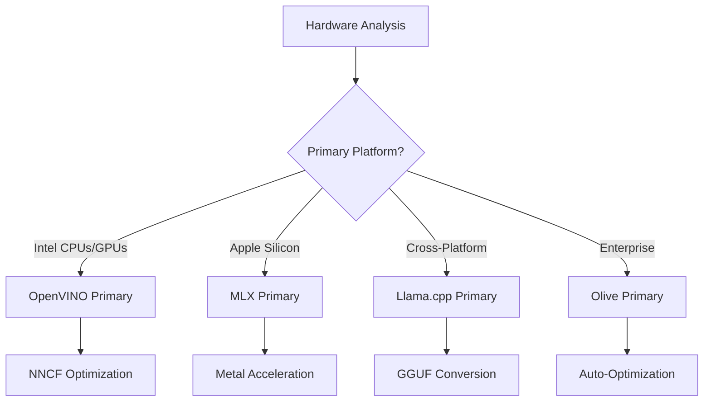
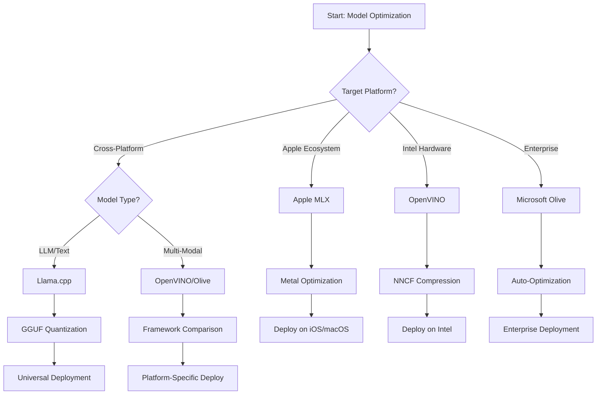
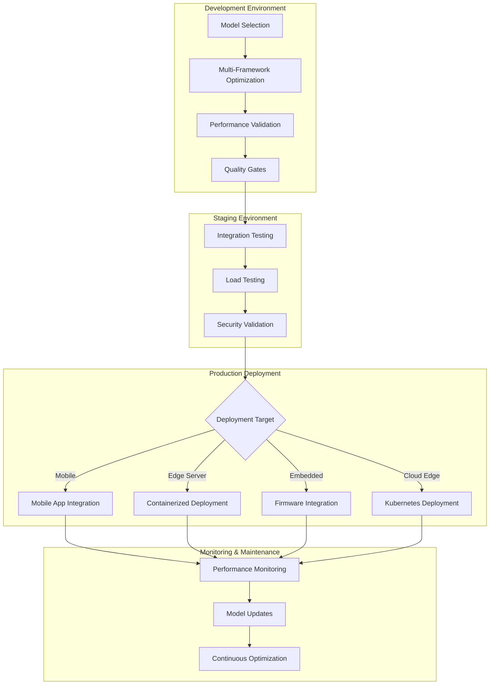

<!--
CO_OP_TRANSLATOR_METADATA:
{
  "original_hash": "6719c4a7e44b948230ac5f5cab3699bd",
  "translation_date": "2025-09-18T10:20:47+00:00",
  "source_file": "Module04/06.workflow-synthesis.md",
  "language_code": "fi"
}
-->
# Osa 6: Edge AI -kehitystyön työnkulun synteesi

## Sisällysluettelo
1. [Johdanto](../../../Module04)
2. [Oppimistavoitteet](../../../Module04)
3. [Yhtenäisen työnkulun yleiskatsaus](../../../Module04)
4. [Puitteiden valintamatriisi](../../../Module04)
5. [Parhaiden käytäntöjen synteesi](../../../Module04)
6. [Käyttöönoton strategiaopas](../../../Module04)
7. [Suorituskyvyn optimoinnin työnkulku](../../../Module04)
8. [Tuotantovalmiuden tarkistuslista](../../../Module04)
9. [Vianetsintä ja valvonta](../../../Module04)
10. [Edge AI -putkiston tulevaisuuden varmistaminen](../../../Module04)

## Johdanto

Edge AI -kehitys vaatii syvällistä ymmärrystä useista optimointipuitteista, käyttöönoton strategioista ja laitteistojen huomioimisesta. Tämä kattava synteesi yhdistää Llama.cpp:n, Microsoft Oliven, OpenVINOn ja Apple MLX:n tiedot yhtenäiseksi työnkuluksi, joka maksimoi tehokkuuden, ylläpitää laatua ja varmistaa onnistuneen tuotantokäytön.

Kurssin aikana olemme tutkineet yksittäisiä optimointipuitteita, joilla kaikilla on omat vahvuutensa ja erikoistuneet käyttötapauksensa. Todelliset Edge AI -projektit vaativat kuitenkin usein useiden puitteiden yhdistämistä tai strategisia päätöksiä siitä, mikä lähestymistapa tuottaa parhaat tulokset tiettyjen rajoitusten ja vaatimusten perusteella.

Tämä osio kokoaa yhteen kaikkien puitteiden kollektiivisen viisauden toimiviksi työnkuluiksi, päätöspuiksi ja parhaiksi käytännöiksi, jotka mahdollistavat tuotantovalmiiden Edge AI -ratkaisujen rakentamisen tehokkaasti ja vaikuttavasti. Olipa kyseessä optimointi mobiililaitteille, sulautetuille järjestelmille tai reunapalvelimille, tämä opas tarjoaa strategisen kehyksen tietoon perustuvien päätösten tekemiseen koko kehityssyklin ajan.

## Oppimistavoitteet

Tämän osion lopussa osaat:

### Strateginen päätöksenteko
- **Arvioida ja valita** optimaalinen optimointipuitteisto projektivaatimusten, laitteistorajoitusten ja käyttöönoton skenaarioiden perusteella
- **Suunnitella kattavia työnkulkuja**, jotka yhdistävät useita optimointitekniikoita maksimaalisen tehokkuuden saavuttamiseksi
- **Arvioida kompromisseja** mallin tarkkuuden, inferenssinopeuden, muistin käytön ja käyttöönoton monimutkaisuuden välillä eri puitteissa

### Työnkulun integrointi
- **Toteuttaa yhtenäisiä kehitysputkia**, jotka hyödyntävät useiden optimointipuitteiden vahvuuksia
- **Luoda toistettavia työnkulkuja**, jotka varmistavat mallien optimoinnin ja käyttöönoton johdonmukaisuuden eri ympäristöissä
- **Määrittää laadunvarmistusportteja** ja validointiprosesseja, jotka takaavat optimoitujen mallien tuotantokelpoisuuden

### Suorituskyvyn optimointi
- **Soveltaa systemaattisia optimointistrategioita** kvantisoinnin, karsinnan ja laitteistokohtaisten kiihdytystekniikoiden avulla
- **Valvoa ja vertailla** mallin suorituskykyä eri optimointitasoilla ja käyttöönoton kohteilla
- **Optimoida tiettyjä laitteistoalustoja varten**, kuten CPU, GPU, NPU ja erikoistuneet reunakiihdyttimet

### Tuotantokäyttöönotto
- **Suunnitella skaalautuvia käyttöönottoarkkitehtuureja**, jotka tukevat useita malliformaatteja ja inferenssimoottoreita
- **Toteuttaa valvonta ja havaittavuus** Edge AI -sovelluksille tuotantoympäristöissä
- **Määrittää ylläpitoprosesseja** mallipäivityksille, suorituskyvyn valvonnalle ja järjestelmän optimoinnille

### Monialustainen huippuosaaminen
- **Ottaa käyttöön optimoituja malleja** eri laitteistoalustoilla samalla säilyttäen johdonmukaisen suorituskyvyn
- **Käsitellä alustakohtaisia optimointeja** Windowsille, macOS:lle, Linuxille, mobiililaitteille ja sulautetuille järjestelmille
- **Luoda abstraktiokerroksia**, jotka mahdollistavat saumattoman käyttöönoton eri reunaympäristöissä

## Yhtenäisen työnkulun yleiskatsaus

### Vaihe 1: Vaatimusten analyysi ja puitteiden valinta

Onnistuneen Edge AI -käyttöönoton perusta alkaa perusteellisella vaatimusten analyysillä, joka ohjaa puitteiden valintaa ja optimointistrategiaa.

#### 1.1 Laitteiston arviointi


**Keskeiset huomioitavat asiat:**
- **CPU-arkkitehtuuri**: x86, ARM, Apple Silicon -ominaisuudet
- **Kiihdyttimen saatavuus**: GPU, NPU, VPU, erikoistuneet AI-sirut
- **Muistin rajoitukset**: RAM-rajoitukset, tallennuskapasiteetti
- **Virran kulutus**: Akunkesto, lämpörajat
- **Yhteydet**: Offline-vaatimukset, kaistanleveysrajoitukset

#### 1.2 Sovellusvaatimusten matriisi

| Vaatimus | Llama.cpp | Microsoft Olive | OpenVINO | Apple MLX |
|----------|-----------|-----------------|----------|-----------|
| Monialustaisuus | ✅ Erinomainen | ⚡ Hyvä | ⚡ Hyvä | ❌ Vain Apple |
| Yritysintegraatio | ⚡ Perustaso | ✅ Erinomainen | ✅ Erinomainen | ⚡ Rajoitettu |
| Mobiilikäyttöönotto | ✅ Erinomainen | ⚡ Hyvä | ⚡ Hyvä | ✅ iOS Erinomainen |
| Reaaliaikainen inferenssi | ✅ Erinomainen | ✅ Erinomainen | ✅ Erinomainen | ✅ Erinomainen |
| Mallien monipuolisuus | ✅ LLM-painotus | ✅ Kaikki mallit | ✅ Kaikki mallit | ✅ LLM-painotus |
| Käytön helppous | ✅ Yksinkertainen | ✅ Automaattinen | ⚡ Kohtalainen | ✅ Yksinkertainen |

### Vaihe 2: Mallin valmistelu ja optimointi

#### 2.1 Universaali mallin arviointiputki

```python
# Universal Model Assessment Framework
class EdgeAIModelAssessment:
    def __init__(self, model_path, target_hardware):
        self.model_path = model_path
        self.target_hardware = target_hardware
        self.optimization_frameworks = []
        
    def assess_model_characteristics(self):
        """Analyze model size, architecture, and complexity"""
        return {
            'model_size': self.get_model_size(),
            'parameter_count': self.get_parameter_count(),
            'architecture_type': self.detect_architecture(),
            'quantization_compatibility': self.check_quantization_support()
        }
    
    def recommend_optimization_strategy(self):
        """Recommend optimal frameworks and techniques"""
        characteristics = self.assess_model_characteristics()
        
        if self.target_hardware.startswith('apple'):
            return self.mlx_optimization_strategy(characteristics)
        elif self.target_hardware.startswith('intel'):
            return self.openvino_optimization_strategy(characteristics)
        elif characteristics['model_size'] > 7_000_000_000:  # 7B+ parameters
            return self.enterprise_optimization_strategy(characteristics)
        else:
            return self.lightweight_optimization_strategy(characteristics)
```

#### 2.2 Monipuitteinen optimointiputki

**Järjestelmällinen optimointilähestymistapa:**
1. **Alustava muunnos**: Muunna väliformaattiin (ONNX, jos mahdollista)
2. **Puitteistokohtainen optimointi**: Sovella erikoistuneita tekniikoita
3. **Ristiinvalidointi**: Vahvista suorituskyky kohdealustoilla
4. **Lopullinen pakkaus**: Valmista käyttöönottoa varten

```bash
# Multi-Framework Optimization Script
#!/bin/bash

MODEL_NAME="phi-3-mini"
BASE_MODEL="microsoft/Phi-3-mini-4k-instruct"

# Phase 1: ONNX Conversion (Universal)
python convert_to_onnx.py --model $BASE_MODEL --output models/onnx/

# Phase 2: Platform-Specific Optimization
if [[ "$TARGET_PLATFORM" == "intel" ]]; then
    # OpenVINO Optimization
    python optimize_openvino.py --input models/onnx/ --output models/openvino/
elif [[ "$TARGET_PLATFORM" == "apple" ]]; then
    # MLX Optimization
    python optimize_mlx.py --input $BASE_MODEL --output models/mlx/
elif [[ "$TARGET_PLATFORM" == "cross" ]]; then
    # Llama.cpp Optimization
    python convert_to_gguf.py --input models/onnx/ --output models/gguf/
fi

# Phase 3: Validation
python validate_optimization.py --original $BASE_MODEL --optimized models/$TARGET_PLATFORM/
```

### Vaihe 3: Suorituskyvyn validointi ja vertailu

#### 3.1 Kattava vertailukehys

```python
class EdgeAIBenchmark:
    def __init__(self, optimized_models):
        self.models = optimized_models
        self.metrics = {
            'inference_time': [],
            'memory_usage': [],
            'accuracy_score': [],
            'throughput': [],
            'energy_consumption': []
        }
    
    def run_comprehensive_benchmark(self):
        """Execute standardized benchmarks across all optimized models"""
        test_inputs = self.generate_test_inputs()
        
        for model_framework, model_path in self.models.items():
            print(f"Benchmarking {model_framework}...")
            
            # Latency Testing
            latency = self.measure_inference_latency(model_path, test_inputs)
            
            # Memory Profiling
            memory = self.profile_memory_usage(model_path)
            
            # Accuracy Validation
            accuracy = self.validate_model_accuracy(model_path, test_inputs)
            
            # Throughput Analysis
            throughput = self.measure_throughput(model_path)
            
            self.record_metrics(model_framework, latency, memory, accuracy, throughput)
    
    def generate_optimization_report(self):
        """Create comprehensive comparison report"""
        report = {
            'recommendations': self.analyze_performance_trade_offs(),
            'deployment_guidance': self.generate_deployment_recommendations(),
            'monitoring_requirements': self.define_monitoring_metrics()
        }
        return report
```

## Puitteiden valintamatriisi

### Päätöspuu puitteiden valintaan



### Kattavat valintakriteerit

#### 1. Ensisijainen käyttötapaus

**Suuret kielimallit (LLM):**
- **Llama.cpp**: Paras CPU-painotteiseen, monialustaiseen käyttöönottoon
- **Apple MLX**: Optimaalinen Apple Siliconille yhtenäisellä muistilla
- **OpenVINO**: Erinomainen Intel-laitteistolle NNCF-optimoinnilla
- **Microsoft Olive**: Ihanteellinen yritysputkille automaatiolla

**Monimodaaliset mallit:**
- **OpenVINO**: Kattava tuki visio-, ääni- ja tekstimalleille
- **Microsoft Olive**: Yritystason optimointi monimutkaisille putkille
- **Llama.cpp**: Rajoittuu tekstipohjaisiin malleihin
- **Apple MLX**: Kasvava tuki monimodaalisille sovelluksille

#### 2. Laitteistoalustojen matriisi

| Alusta | Ensisijainen puitteisto | Toissijainen vaihtoehto | Erikoisominaisuudet |
|--------|--------------------------|--------------------------|---------------------|
| Intel CPU/GPU | OpenVINO | Microsoft Olive | NNCF-pakkaus, Intel-optimointi |
| NVIDIA GPU | Microsoft Olive | OpenVINO | CUDA-kiihdytys, yritysominaisuudet |
| Apple Silicon | Apple MLX | Llama.cpp | Metal-shaderit, yhtenäinen muisti |
| ARM-mobiili | Llama.cpp | OpenVINO | Monialustaisuus, minimaaliset riippuvuudet |
| Edge TPU | OpenVINO | Microsoft Olive | Erikoistettu kiihdytintuki |
| Sulautettu ARM | Llama.cpp | OpenVINO | Pieni jalanjälki, tehokas inferenssi |

#### 3. Kehitystyönkulun mieltymykset

**Nopea prototyyppaus:**
1. **Llama.cpp**: Nopein asennus, välittömät tulokset
2. **Apple MLX**: Yksinkertainen Python-API, nopea iterointi
3. **Microsoft Olive**: Automaattinen optimointi, minimaalinen konfiguraatio
4. **OpenVINO**: Monimutkaisempi asennus, kattavat ominaisuudet

**Yritystuotanto:**
1. **Microsoft Olive**: Yritysominaisuudet, Azure-integraatio
2. **OpenVINO**: Intel-ekosysteemi, kattavat työkalut
3. **Apple MLX**: Apple-spesifiset yrityssovellukset
4. **Llama.cpp**: Yksinkertainen käyttöönotto, rajoitetut yritysominaisuudet

## Parhaiden käytäntöjen synteesi

### Universaalit optimointiperiaatteet

#### 1. Progressiivinen optimointistrategia

```python
class ProgressiveOptimization:
    def __init__(self, base_model):
        self.base_model = base_model
        self.optimization_stages = [
            'baseline_measurement',
            'format_conversion',
            'quantization_optimization',
            'hardware_acceleration',
            'production_validation'
        ]
    
    def execute_progressive_optimization(self):
        """Apply optimization techniques incrementally"""
        
        # Stage 1: Baseline Measurement
        baseline_metrics = self.measure_baseline_performance()
        
        # Stage 2: Format Conversion
        converted_model = self.convert_to_optimal_format()
        conversion_metrics = self.measure_performance(converted_model)
        
        # Stage 3: Quantization
        quantized_model = self.apply_quantization(converted_model)
        quantization_metrics = self.measure_performance(quantized_model)
        
        # Stage 4: Hardware Acceleration
        accelerated_model = self.enable_hardware_acceleration(quantized_model)
        acceleration_metrics = self.measure_performance(accelerated_model)
        
        # Stage 5: Validation
        production_ready = self.validate_for_production(accelerated_model)
        
        return self.compile_optimization_report(
            baseline_metrics, conversion_metrics, 
            quantization_metrics, acceleration_metrics
        )
```

#### 2. Laadunvarmistusporttien toteutus

**Tarkkuuden säilyttämisen portit:**
- Säilytä >95 % alkuperäisestä mallin tarkkuudesta
- Validointi edustavilla testidataseteilla
- Toteuta A/B-testaus tuotantovalidointia varten

**Suorituskyvyn parantamisen portit:**
- Saavuta vähintään 2x nopeuden parannus
- Vähennä muistin käyttöä vähintään 50 %
- Vahvista inferenssiajan johdonmukaisuus

**Tuotantovalmiuden portit:**
- Läpäise kuormitustestit
- Osoita vakaa suorituskyky ajan myötä
- Validointi turvallisuus- ja yksityisyysvaatimusten osalta

### Puitteistokohtaisten parhaiden käytäntöjen integrointi

#### 1. Kvantisointistrategian synteesi

```python
# Unified Quantization Approach
class UnifiedQuantizationStrategy:
    def __init__(self, model, target_platform):
        self.model = model
        self.platform = target_platform
        
    def select_optimal_quantization(self):
        """Choose best quantization based on platform and requirements"""
        
        if self.platform == 'apple_silicon':
            return self.mlx_quantization_strategy()
        elif self.platform == 'intel_hardware':
            return self.openvino_quantization_strategy()
        elif self.platform == 'cross_platform':
            return self.llamacpp_quantization_strategy()
        else:
            return self.olive_quantization_strategy()
    
    def mlx_quantization_strategy(self):
        """Apple MLX-specific quantization"""
        return {
            'method': 'mlx_quantize',
            'precision': 'int4',
            'group_size': 64,
            'optimization_target': 'unified_memory'
        }
    
    def openvino_quantization_strategy(self):
        """OpenVINO NNCF quantization"""
        return {
            'method': 'nncf_quantize',
            'precision': 'int8',
            'calibration_method': 'post_training',
            'optimization_target': 'intel_hardware'
        }
```

#### 2. Laitteistokiihdytyksen optimointi

**CPU-optimoinnin synteesi:**
- **SIMD-ohjeet**: Hyödynnä optimoituja ytimiä puitteiden välillä
- **Muistikaista**: Optimoi datan asettelut välimuistin tehokkuuden parantamiseksi
- **Säikeistys**: Tasapainota rinnakkaisuus resurssirajoitusten kanssa

**GPU-kiihdytyksen parhaat käytännöt:**
- **Eräprosessi**: Maksimoi läpimeno sopivilla eräkokoilla
- **Muistinhallinta**: Optimoi GPU-muistin allokointi ja siirrot
- **Tarkkuus**: Käytä FP16, jos tuettu, paremman suorituskyvyn saavuttamiseksi

**NPU/erikoistettujen kiihdyttimien optimointi:**
- **Mallin arkkitehtuuri**: Varmista yhteensopivuus kiihdyttimen ominaisuuksien kanssa
- **Datavirta**: Optimoi syöttö-/tulostusputket kiihdyttimen tehokkuuden parantamiseksi
- **Varastrategiat**: Toteuta CPU-varajärjestelmä tukemattomille toiminnoille

## Käyttöönoton strategiaopas

### Universaali käyttöönottoarkkitehtuuri



### Alustakohtaiset käyttöönoton mallit

#### 1. Mobiilikäyttöönoton strategia

```yaml
# Mobile Deployment Configuration
mobile_deployment:
  ios:
    framework: apple_mlx
    optimization:
      quantization: int4
      memory_mapping: true
      background_execution: limited
    packaging:
      format: mlx
      bundle_size: <50MB
      
  android:
    framework: llama_cpp
    optimization:
      quantization: q4_k_m
      threading: android_optimized
      memory_management: conservative
    packaging:
      format: gguf
      apk_size: <100MB
      
  cross_platform:
    framework: onnx_runtime
    optimization:
      quantization: int8
      execution_provider: cpu
    packaging:
      format: onnx
      shared_libraries: minimal
```

#### 2. Reunapalvelimen käyttöönotto

```yaml
# Edge Server Deployment Configuration
edge_server:
  intel_based:
    framework: openvino
    optimization:
      quantization: int8
      acceleration: cpu_gpu_auto
      batch_processing: dynamic
    deployment:
      container: openvino_runtime
      orchestration: kubernetes
      scaling: horizontal
      
  nvidia_based:
    framework: microsoft_olive
    optimization:
      quantization: int4
      acceleration: cuda
      tensor_parallelism: true
    deployment:
      container: nvidia_triton
      orchestration: kubernetes
      scaling: gpu_aware
```

### Konttien käytön parhaat käytännöt

```dockerfile
# Multi-Framework Edge AI Container
FROM ubuntu:22.04 as base

# Install common dependencies
RUN apt-get update && apt-get install -y \
    python3 \
    python3-pip \
    build-essential \
    cmake \
    && rm -rf /var/lib/apt/lists/*

# Framework-specific stages
FROM base as openvino
RUN pip install openvino nncf optimum[intel]

FROM base as llamacpp
RUN git clone https://github.com/ggerganov/llama.cpp.git \
    && cd llama.cpp && make LLAMA_OPENBLAS=1

FROM base as olive
RUN pip install olive-ai[auto-opt] onnxruntime-genai

# Production stage with selected framework
FROM openvino as production
COPY models/ /app/models/
COPY src/ /app/src/
WORKDIR /app

EXPOSE 8080
CMD ["python3", "src/inference_server.py"]
```

## Suorituskyvyn optimoinnin työnkulku

### Järjestelmällinen suorituskyvyn hienosäätö

#### 1. Suorituskyvyn profilointiputki

```python
class EdgeAIPerformanceProfiler:
    def __init__(self, model_path, framework):
        self.model_path = model_path
        self.framework = framework
        self.profiling_results = {}
    
    def comprehensive_profiling(self):
        """Execute comprehensive performance analysis"""
        
        # CPU Profiling
        cpu_profile = self.profile_cpu_usage()
        
        # Memory Profiling
        memory_profile = self.profile_memory_usage()
        
        # Inference Latency
        latency_profile = self.profile_inference_latency()
        
        # Throughput Analysis
        throughput_profile = self.profile_throughput()
        
        # Energy Consumption (where available)
        energy_profile = self.profile_energy_consumption()
        
        return self.compile_performance_report(
            cpu_profile, memory_profile, latency_profile,
            throughput_profile, energy_profile
        )
    
    def identify_bottlenecks(self):
        """Automatically identify performance bottlenecks"""
        bottlenecks = []
        
        if self.profiling_results['cpu_utilization'] > 80:
            bottlenecks.append('cpu_bound')
        
        if self.profiling_results['memory_usage'] > 90:
            bottlenecks.append('memory_bound')
        
        if self.profiling_results['inference_variance'] > 20:
            bottlenecks.append('inconsistent_performance')
        
        return self.generate_optimization_recommendations(bottlenecks)
```

#### 2. Automaattinen optimointiputki

```python
class AutomatedOptimizationPipeline:
    def __init__(self, base_model, target_constraints):
        self.base_model = base_model
        self.constraints = target_constraints
        self.optimization_history = []
    
    def execute_optimization_search(self):
        """Systematically search optimization space"""
        
        optimization_candidates = [
            {'quantization': 'int8', 'pruning': 0.1},
            {'quantization': 'int4', 'pruning': 0.2},
            {'quantization': 'int8', 'acceleration': 'gpu'},
            {'quantization': 'int4', 'acceleration': 'npu'}
        ]
        
        best_configuration = None
        best_score = 0
        
        for config in optimization_candidates:
            optimized_model = self.apply_optimization(config)
            score = self.evaluate_optimization(optimized_model)
            
            if score > best_score and self.meets_constraints(optimized_model):
                best_score = score
                best_configuration = config
            
            self.optimization_history.append({
                'config': config,
                'score': score,
                'model': optimized_model
            })
        
        return best_configuration, self.optimization_history
```

### Monitavoitteinen optimointi

#### 1. Pareto-optimointi Edge AI:lle

```python
class ParetoOptimization:
    def __init__(self, objectives=['speed', 'accuracy', 'memory']):
        self.objectives = objectives
        self.pareto_frontier = []
    
    def find_pareto_optimal_solutions(self, optimization_results):
        """Identify Pareto-optimal configurations"""
        
        for result in optimization_results:
            is_dominated = False
            
            for frontier_point in self.pareto_frontier:
                if self.dominates(frontier_point, result):
                    is_dominated = True
                    break
            
            if not is_dominated:
                # Remove dominated points from frontier
                self.pareto_frontier = [
                    point for point in self.pareto_frontier 
                    if not self.dominates(result, point)
                ]
                
                self.pareto_frontier.append(result)
        
        return self.pareto_frontier
    
    def recommend_configuration(self, user_preferences):
        """Recommend configuration based on user preferences"""
        
        weighted_scores = []
        for config in self.pareto_frontier:
            score = sum(
                user_preferences[obj] * config['metrics'][obj] 
                for obj in self.objectives
            )
            weighted_scores.append((score, config))
        
        return max(weighted_scores, key=lambda x: x[0])[1]
```

## Tuotantovalmiuden tarkistuslista

### Kattava tuotantovalidointi

#### 1. Mallin laadunvarmistus

```python
class ProductionReadinessValidator:
    def __init__(self, optimized_model, production_requirements):
        self.model = optimized_model
        self.requirements = production_requirements
        self.validation_results = {}
    
    def validate_model_quality(self):
        """Comprehensive model quality validation"""
        
        # Accuracy Validation
        accuracy_result = self.validate_accuracy()
        
        # Performance Validation
        performance_result = self.validate_performance()
        
        # Robustness Testing
        robustness_result = self.validate_robustness()
        
        # Security Assessment
        security_result = self.validate_security()
        
        # Compliance Verification
        compliance_result = self.validate_compliance()
        
        return self.compile_validation_report(
            accuracy_result, performance_result, robustness_result,
            security_result, compliance_result
        )
    
    def generate_certification_report(self):
        """Generate production certification report"""
        return {
            'model_signature': self.generate_model_signature(),
            'validation_timestamp': datetime.now(),
            'validation_results': self.validation_results,
            'deployment_approval': self.check_deployment_approval(),
            'monitoring_requirements': self.define_monitoring_requirements()
        }
```

#### 2. Tuotantokäyttöönoton tarkistuslista

**Ennen käyttöönottoa tehtävä validointi:**
- [ ] Mallin tarkkuus täyttää vähimmäisvaatimukset (>95 % lähtötasosta)
- [ ] Suorituskykytavoitteet saavutettu (viive, läpimeno, muisti)
- [ ] Turvallisuusuhat arvioitu ja korjattu
- [ ] Kuormitustestit suoritettu odotetulla kuormituksella
- [ ] Vikaskenaariot testattu ja palautusmenettelyt validoitu
- [ ] Valvonta- ja hälytysjärjestelmät määritetty
- [ ] Palautusmenettelyt testattu ja dokumentoitu

**Käyttöönoton prosessi:**
- [ ] Blue-green käyttöönoton strategia toteutettu
- [ ] Graduaalinen liikenteen lisääminen määritetty
- [ ] Reaaliaikaiset valvontapaneelit aktiiviset
- [ ] Suorituskyvyn lähtötasot määritetty
- [ ] Virheasteen kynnysarvot määritetty
- [ ] Automaattiset palautuslaukaisimet määritetty

**Käyttöönoton jälkeinen valvonta:**
- [ ] Mallin ajautumisen havaitseminen aktiivinen
- [ ] Suorituskyvyn heikkenemisen hälytykset määritetty
- [ ] Resurssien käytön valvonta käytössä
- [ ] Käyttäjäkokemuksen mittarit seurattavissa
- [ ] Malliversiointi ja sukupuu ylläpidetty
- [ ] Säännölliset mallin suorituskyvyn tarkistukset aikataulutettu

### Jatkuva integraatio/jatkuva käyttöönotto (CI/CD)

```yaml
# Edge AI CI/CD Pipeline Configuration
edge_ai_pipeline:
  stages:
    - model_validation
    - optimization
    - testing
    - staging_deployment
    - production_deployment
    - monitoring
  
  model_validation:
    accuracy_threshold: 0.95
    performance_baseline: required
    security_scan: enabled
    
  optimization:
    frameworks:
      - llama_cpp
      - openvino
      - microsoft_olive
    validation:
      cross_validation: enabled
      performance_comparison: required
      
  testing:
    unit_tests: comprehensive
    integration_tests: full_pipeline
    load_tests: production_scale
    security_tests: comprehensive
    
  deployment:
    strategy: blue_green
    traffic_ramping: gradual
    rollback: automatic
    monitoring: real_time
```

## Vianetsintä ja valvonta

### Universaali vianetsintäkehys

#### 1. Yleiset ongelmat ja ratkaisut

**Suorituskykyongelmat:**
```python
class PerformanceTroubleshooter:
    def __init__(self, model_metrics):
        self.metrics = model_metrics
        
    def diagnose_performance_issues(self):
        """Systematic performance issue diagnosis"""
        
        issues = []
        
        # High latency diagnosis
        if self.metrics['avg_latency'] > self.metrics['target_latency']:
            issues.append(self.diagnose_latency_issues())
        
        # Memory usage diagnosis
        if self.metrics['memory_usage'] > self.metrics['memory_limit']:
            issues.append(self.diagnose_memory_issues())
        
        # Throughput diagnosis
        if self.metrics['throughput'] < self.metrics['target_throughput']:
            issues.append(self.diagnose_throughput_issues())
        
        return self.generate_resolution_plan(issues)
    
    def diagnose_latency_issues(self):
        """Specific latency troubleshooting"""
        potential_causes = []
        
        if self.metrics['cpu_utilization'] > 80:
            potential_causes.append('cpu_bottleneck')
        
        if self.metrics['memory_bandwidth'] > 90:
            potential_causes.append('memory_bandwidth_limit')
        
        if self.metrics['model_size'] > self.metrics['optimal_size']:
            potential_causes.append('model_too_large')
        
        return {
            'issue': 'high_latency',
            'causes': potential_causes,
            'solutions': self.generate_latency_solutions(potential_causes)
        }
```

**Puitteistokohtainen vianetsintä:**

| Ongelma | Llama.cpp | Microsoft Olive | OpenVINO | Apple MLX |
|---------|-----------|-----------------|----------|-----------|
| Muistiongelmat | Vähennä kontekstin pituutta | Pienennä eräkokoa | Ota välimuisti käyttöön | Käytä muistimappausta |
| Hidas inferenssi | Ota SIMD käyttöön | Tarkista kvantisointi | Optimoi säikeistys | Ota Metal käyttöön |
| Tarkkuuden menetys | Korkeampi kvantisointi | Kouluta uudelleen QAT:lla | Lisää kalibrointia | Hienosäädä kvantisoinnin jälkeen |
| Yhteensopivuus | Tarkista malliformaatti | Vahvista puitteiston versio | Päivitä ajurit | Tarkista macOS-versio |

#### 2. Tuotantovalvonnan strategia

```python
class EdgeAIMonitoring:
    def __init__(self, deployment_config):
        self.config = deployment_config
        self.metrics_collectors = []
        self.alerting_rules = []
    
    def setup_comprehensive_monitoring(self):
        """Configure comprehensive monitoring for Edge AI deployment"""
        
        # Model Performance Monitoring
        self.setup_model_performance_monitoring()
        
        # Infrastructure Monitoring
        self.setup_infrastructure_monitoring()
        
        # Business Metrics Monitoring
        self.setup_business_metrics_monitoring()
        
        # Security Monitoring
        self.setup_security_monitoring()
    
    def setup_model_performance_monitoring(self):
        """Model-specific performance monitoring"""
        metrics = [
            'inference_latency_p50',
            'inference_latency_p95',
            'inference_latency_p99',
            'model_accuracy_drift',
            'prediction_confidence_distribution',
            'error_rate',
            'throughput_requests_per_second'
        ]
        
        for metric in metrics:
            self.add_metric_collector(metric)
            self.add_alerting_rule(metric)
    
    def detect_model_drift(self):
        """Automated model drift detection"""
        drift_indicators = [
            self.statistical_drift_detection(),
            self.performance_drift_detection(),
            self.data_distribution_shift_detection()
        ]
        
        return self.aggregate_drift_signals(drift_indicators)
```

### Automaattinen ongelmien ratkaisu

```python
class AutomatedIssueResolution:
    def __init__(self, monitoring_system):
        self.monitoring = monitoring_system
        self.resolution_strategies = {}
    
    def handle_performance_degradation(self, alert):
        """Automated performance issue resolution"""
        
        if alert['type'] == 'high_latency':
            return self.resolve_latency_issue(alert)
        elif alert['type'] == 'high_memory_usage':
            return self.resolve_memory_issue(alert)
        elif alert['type'] == 'accuracy_drift':
            return self.resolve_accuracy_issue(alert)
        
    def resolve_latency_issue(self, alert):
        """Automated latency issue resolution"""
        resolution_steps = [
            'increase_cpu_allocation',
            'enable_model_caching',
            'reduce_batch_size',
            'switch_to_quantized_model'
        ]
        
        for step in resolution_steps:
            if self.apply_resolution_step(step):
                return f"Resolved latency issue with: {step}"
        
        return "Escalating to human operator"
```

## Edge AI -
Muista, että paras optimointistrategia on sellainen, joka vastaa erityisiä tarpeitasi samalla kun säilyttää joustavuuden mukautua näiden tarpeiden muuttuessa. Käytä tätä opasta viitekehyksenä tehdäksesi perusteltuja päätöksiä, mutta varmista aina valintasi empiirisen testauksen ja todellisen käyttökokemuksen avulla.

## ➡️ Mitä seuraavaksi

Jatka Edge AI -matkaasi tutkimalla [Moduuli 5: SLMOps ja tuotantokäyttöönotto](../Module05/README.md), jossa opit pienten kielimallien elinkaaren hallinnan operatiivisista näkökohdista.

---

**Vastuuvapauslauseke**:  
Tämä asiakirja on käännetty käyttämällä tekoälypohjaista käännöspalvelua [Co-op Translator](https://github.com/Azure/co-op-translator). Vaikka pyrimme tarkkuuteen, huomioithan, että automaattiset käännökset voivat sisältää virheitä tai epätarkkuuksia. Alkuperäinen asiakirja sen alkuperäisellä kielellä tulisi pitää ensisijaisena lähteenä. Kriittisen tiedon osalta suositellaan ammattimaista ihmiskäännöstä. Emme ole vastuussa väärinkäsityksistä tai virhetulkinnoista, jotka johtuvat tämän käännöksen käytöstä.