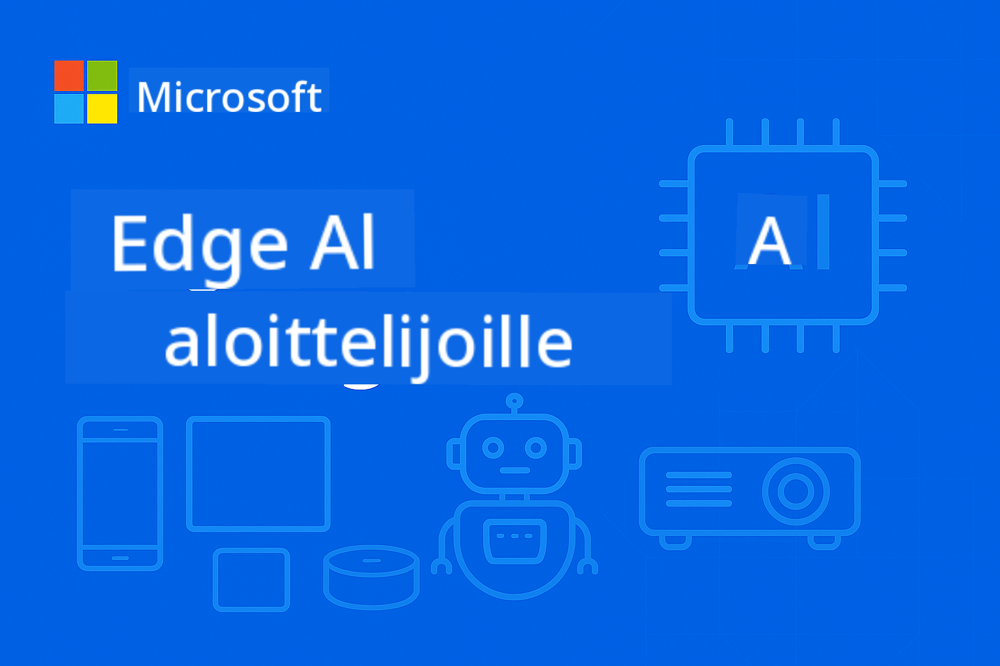

<!--
CO_OP_TRANSLATOR_METADATA:
{
  "original_hash": "ff006cd813df4152f5036e7b2bc5ed32",
  "translation_date": "2025-09-24T23:27:30+00:00",
  "source_file": "README.md",
  "language_code": "fi"
}
-->
# EdgeAI aloittelijoille



[](https://GitHub.com/microsoft/edgeai-for-beginners/graphs/contributors)  
[](https://GitHub.com/microsoft/edgeai-for-beginners/issues)  
[](https://GitHub.com/microsoft/edgeai-for-beginners/pulls)  
[](http://makeapullrequest.com)  

[](https://GitHub.com/microsoft/edgeai-for-beginners/watchers)  
[](https://GitHub.com/microsoft/edgeai-for-beginners/fork)  
[](https://GitHub.com/microsoft/edgeai-for-beginners/stargazers)  

[](https://discord.com/invite/ByRwuEEgH4)

Seuraa näitä ohjeita päästäksesi alkuun näiden resurssien käytössä:

1. **Haarauta repositorio**: Klikkaa [](https://GitHub.com/microsoft/edgeai-for-beginners/fork)  
2. **Kloonaa repositorio**: `git clone https://github.com/microsoft/edgeai-for-beginners.git`  
3. [**Liity Azure AI Foundry Discordiin ja tapaa asiantuntijoita sekä muita kehittäjiä**](https://discord.com/invite/ByRwuEEgH4)

### 🌐 Monikielinen tuki

#### Tuettu GitHub Actionin kautta (automaattinen ja aina ajan tasalla)

[Arabic](../ar/README.md) | [Bengali](../bn/README.md) | [Bulgarian](../bg/README.md) | [Burmese (Myanmar)](../my/README.md) | [Chinese (Simplified)](../zh/README.md) | [Chinese (Traditional, Hong Kong)](../hk/README.md) | [Chinese (Traditional, Macau)](../mo/README.md) | [Chinese (Traditional, Taiwan)](../tw/README.md) | [Croatian](../hr/README.md) | [Czech](../cs/README.md) | [Danish](../da/README.md) | [Dutch](../nl/README.md) | [Finnish](./README.md) | [French](../fr/README.md) | [German](../de/README.md) | [Greek](../el/README.md) | [Hebrew](../he/README.md) | [Hindi](../hi/README.md) | [Hungarian](../hu/README.md) | [Indonesian](../id/README.md) | [Italian](../it/README.md) | [Japanese](../ja/README.md) | [Korean](../ko/README.md) | [Malay](../ms/README.md) | [Marathi](../mr/README.md) | [Nepali](../ne/README.md) | [Norwegian](../no/README.md) | [Persian (Farsi)](../fa/README.md) | [Polish](../pl/README.md) | [Portuguese (Brazil)](../br/README.md) | [Portuguese (Portugal)](../pt/README.md) | [Punjabi (Gurmukhi)](../pa/README.md) | [Romanian](../ro/README.md) | [Russian](../ru/README.md) | [Serbian (Cyrillic)](../sr/README.md) | [Slovak](../sk/README.md) | [Slovenian](../sl/README.md) | [Spanish](../es/README.md) | [Swahili](../sw/README.md) | [Swedish](../sv/README.md) | [Tagalog (Filipino)](../tl/README.md) | [Thai](../th/README.md) | [Turkish](../tr/README.md) | [Ukrainian](../uk/README.md) | [Urdu](../ur/README.md) | [Vietnamese](../vi/README.md)

**Jos haluat lisätä uusia kieliä, tuetut kielet löytyvät [täältä](https://github.com/Azure/co-op-translator/blob/main/getting_started/supported-languages.md)**

## Johdanto

Tervetuloa **EdgeAI aloittelijoille** -kurssille, joka tarjoaa kattavan matkan Edge-tekoälyn mullistavaan maailmaan. Tämä kurssi yhdistää tehokkaat tekoälyominaisuudet ja käytännönläheisen toteutuksen reunalaitteilla, antaen sinulle mahdollisuuden hyödyntää tekoälyn potentiaalia suoraan siellä, missä data syntyy ja päätöksiä tarvitaan.

### Mitä opit hallitsemaan

Kurssi vie sinut peruskäsitteistä tuotantovalmiisiin toteutuksiin, kattaen:
- **Pienet kielimallit (SLM)**, jotka on optimoitu reunalaitteille
- **Laitteistotietoisen optimoinnin** eri alustoilla
- **Reaaliaikaisen päättelyn**, joka säilyttää yksityisyyden
- **Tuotantototeutuksen** strategiat yrityssovelluksiin

### Miksi EdgeAI on tärkeää

EdgeAI edustaa paradigman muutosta, joka vastaa nykyaikaisiin haasteisiin:
- **Yksityisyys ja turvallisuus**: Käsittele arkaluontoista dataa paikallisesti ilman pilvipalveluja
- **Reaaliaikainen suorituskyky**: Poista verkkoviive kriittisissä sovelluksissa
- **Kustannustehokkuus**: Vähennä kaistanleveyden ja pilvilaskennan kustannuksia
- **Toiminnan kestävyys**: Säilytä toiminnallisuus verkkokatkosten aikana
- **Säädösten noudattaminen**: Täytä datan suvereniteettivaatimukset

### EdgeAI

EdgeAI tarkoittaa tekoälyalgoritmien ja kielimallien suorittamista paikallisesti laitteistolla, lähellä datan syntypaikkaa, ilman pilvipalvelujen käyttöä päättelyyn. Se vähentää viivettä, parantaa yksityisyyttä ja mahdollistaa reaaliaikaisen päätöksenteon.

### Keskeiset periaatteet:
- **Laitteistopohjainen päättely**: Tekoälymallit toimivat reunalaitteilla (puhelimet, reitittimet, mikro-ohjaimet, teollisuus-PC:t)
- **Offline-kyvykkyys**: Toimii ilman jatkuvaa internet-yhteyttä
- **Matala viive**: Välittömät vastaukset reaaliaikaisiin järjestelmiin
- **Datan suvereniteetti**: Pitää arkaluontoisen datan paikallisena, parantaen turvallisuutta ja säädösten noudattamista

### Pienet kielimallit (SLM)

SLM:t, kuten Phi-4, Mistral-7B ja Gemma, ovat optimoituja versioita suuremmista LLM-malleista, jotka on koulutettu tai tiivistetty:
- **Pienempi muistijalanjälki**: Tehokas käyttö reunalaitteiden rajallisessa muistissa
- **Vähemmän laskentatehon tarvetta**: Optimoitu CPU- ja reunalaitteiden GPU-suorituskykyyn
- **Nopeammat käynnistysajat**: Nopeampi alustus reagoiville sovelluksille

Ne avaavat tehokkaita NLP-ominaisuuksia samalla täyttäen seuraavat rajoitukset:
- **Sulautetut järjestelmät**: IoT-laitteet ja teollisuusohjaimet
- **Mobiililaitteet**: Älypuhelimet ja tabletit offline-kyvykkyydellä
- **IoT-laitteet**: Anturit ja älylaitteet rajallisilla resursseilla
- **Reunapalvelimet**: Paikalliset käsittelyyksiköt rajallisilla GPU-resursseilla
- **Henkilökohtaiset tietokoneet**: Työpöytä- ja kannettavat tietokoneet

## Kurssin moduulit ja navigointi

| Moduuli | Aihe | Painopistealue | Keskeinen sisältö | Taso | Kesto |
|--------|-------|------------|-------------|--------|----------|
| [📚 01](../../Module01) | [EdgeAI perusteet](./Module01/README.md) | Pilvi vs EdgeAI vertailu | EdgeAI perusteet • Tosielämän tapaustutkimukset • Toteutusopas • Reunatoteutus | Aloittelija | 3-4 h |
| [🧠 02](../../Module02) | [SLM-mallien perusteet](./Module02/README.md) | Malliperheet ja arkkitehtuuri | Phi-perhe • Qwen-perhe • Gemma-perhe • BitNET • μModel • Phi-Silica | Aloittelija | 4-5 h |
| [🚀 03](../../Module03) | [SLM-toteutuskäytännöt](./Module03/README.md) | Paikallinen ja pilvitoteutus | Edistynyt oppiminen • Paikallinen ympäristö • Pilvitoteutus | Keskitaso | 4-5 h |
| [⚙️ 04](../../Module04) | [Mallien optimointityökalut](./Module04/README.md) | Monialustaoptimointi | Johdanto • Llama.cpp • Microsoft Olive • OpenVINO • Apple MLX • Työnkulun synteesi | Keskitaso | 5-6 h |
| [🔧 05](../../Module05) | [SLMOps tuotanto](./Module05/README.md) | Tuotantotoiminnot | SLMOps johdanto • Mallien tiivistäminen • Hienosäätö • Tuotantototeutus | Edistynyt | 5-6 h |
| [🤖 06](../../Module06) | [AI-agentit ja toimintokutsut](./Module06/README.md) | Agenttikehykset ja MCP | Agenttien johdanto • Toimintokutsut • Mallikontekstiprotokolla | Edistynyt | 4-5 h |
| [💻 07](../../Module07) | [Alustatoteutus](./Module07/README.md) | Monialustan esimerkit | AI-työkalut • Foundry Local • Windows-kehitys | Edistynyt | 3-4 h |
| [🏭 08](../../Module08) | [Foundry Local Toolkit](./Module08/README.md) | Tuotantovalmiit esimerkit | Esimerkkisovellukset (katso yksityiskohdat alla) | Asiantuntija | 8-10 h |

### 🏭 **Moduuli 08: Esimerkkisovellukset**

- [01: REST Chat Quickstart](./Module08/samples/01/README.md)  
- [02: OpenAI SDK -integraatio](./Module08/samples/02/README.md)  
- [03: Mallien löytö ja vertailu](./Module08/samples/03/README.md)  
- [04: Chainlit RAG -sovellus](./Module08/samples/04/README.md)  
- [05: Moniagenttien orkestrointi](./Module08/samples/05/README.md)  
- [06: Mallit työkaluna -reititin](./Module08/samples/06/README.md)  
- [07: Suora API-asiakas](./Module08/samples/07/README.md)  
- [08: Windows 11 Chat -sovellus](./Module08/samples/08/README.md)  
- [09: Edistynyt moniagenttijärjestelmä](./Module08/samples/09/README.md)  
- [10: Foundry Tools Framework](./Module08/samples/10/README.md)  

### 📊 **Oppimispolun yhteenveto**
- **Kokonaiskesto**: 36-45 tuntia  
- **Aloittelijan polku**: Moduulit 01-02 (7-9 tuntia)  
- **Keskitaso**: Moduulit 03-04 (9-11 tuntia)  
- **Edistynyt polku**: Moduulit 05-07 (12-15 tuntia)  
- **Asiantuntijan polku**: Moduuli 08 (8-10 tuntia)  

## Mitä rakennat

### 🎯 Keskeiset osaamisalueet
- **EdgeAI-arkkitehtuuri**: Suunnittele paikallisuuteen keskittyviä tekoälyjärjestelmiä pilvi-integraatiolla  
- **Mallien optimointi**: Kvantisoi ja tiivistä malleja reunatoteutukseen (85 % nopeuden parannus, 75 % koon pienennys)  
- **Monialustatoteutus**: Windows, mobiili, sulautetut järjestelmät ja pilvi-reuna-hybridijärjestelmät  
- **Tuotantotoiminnot**: Valvonta, skaalaus ja ylläpito EdgeAI-tuotannossa  

### 🏗️ Käytännön projektit
- **Foundry Local Chat -sovellukset**: Windows 11 -natiivi sovellus mallien vaihtamisella  
- **Moniagenttijärjestelmät**: Koordinaattori erikoistuneilla agenteilla monimutkaisiin työnkulkuihin  
- **RAG-sovellukset**: Paikallinen dokumenttien käsittely vektorihakuominaisuuksilla  
- **Mallireitittimet**: Älykäs mallien valinta tehtävän analyysin perusteella  
- **API-kehykset**: Tuotantovalmiit asiakasohjelmat suoratoistolla ja terveysvalvonnalla  
- **Monialustatyökalut**: LangChain/Semantic Kernel -integraatiomallit  

### 🏢 Teollisuussovellukset
**Valmistus** • **Terveydenhuolto** • **Autonomiset ajoneuvot** • **Älykaupungit** • **Mobiilisovellukset**

## Nopea aloitus

**Suositeltu oppimispolku** (20-30 tuntia yhteensä):

1. **📚 Perusteet** (Moduulit 01-02): EdgeAI-konseptit + SLM-malliperheet  
2. **⚙️ Optimointi** (Moduulit 03-04): Toteutus + kvantisointikehykset  
3. **🚀 Tuotanto** (Moduulit 05-06): SLMOps + AI-agentit + toimintokutsut  
4. **💻 Toteutus** (Moduulit 07-08): Alustaesimerkit + Foundry Local -työkalut  

Jokainen moduuli sisältää teoriaa, käytännön harjoituksia ja tuotantovalmiita koodiesimerkkejä.

## Ura vaikutus
**Tekniset roolit**: EdgeAI-ratkaisujen arkkitehti • ML-insinööri (Edge) • IoT AI -kehittäjä • Mobiili-AI-kehittäjä

**Toimialat**: Teollisuus 4.0 • Terveydenhuollon teknologia • Autonomiset järjestelmät • FinTech • Kulutuselektroniikka

**Portfolioprojektit**: Multi-agent-järjestelmät • Tuotannon RAG-sovellukset • Alustojen välinen käyttöönotto • Suorituskyvyn optimointi

## Repositorion rakenne

```
edgeai-for-beginners/
├── 📚 Module01-04/     # Fundamentals → SLMs → Deployment → Optimization  
├── 🔧 Module05-06/     # SLMOps → AI Agents → Function Calling
├── 💻 Module07/        # Platform Samples (VS Code, Windows, Jetson, Mobile)
├── 🏭 Module08/        # Foundry Local Toolkit + 10 Comprehensive Samples
│   ├── samples/01-06/  # Foundation: REST, SDK, RAG, Agents, Routing
│   └── samples/07-10/  # Advanced: API Client, Windows App, Enterprise Agents, Tools
├── 🌐 translations/    # Multi-language support (8+ languages)
└── 📋 STUDY_GUIDE.md   # Structured learning paths & time allocation
```

## Kurssin kohokohdat

✅ **Progressiivinen oppiminen**: Teoria → Käytäntö → Tuotantokäyttöön ottaminen  
✅ **Todelliset tapaustutkimukset**: Microsoft, Japan Airlines, yritystoteutukset  
✅ **Käytännön esimerkit**: Yli 50 esimerkkiä, 10 kattavaa Foundry Local -demoa  
✅ **Suorituskykykeskeisyys**: 85 % nopeuden parannukset, 75 % koon pienennykset  
✅ **Monialustainen**: Windows, mobiili, sulautetut järjestelmät, pilvi-edge-hybridi  
✅ **Tuotantovalmius**: Seuranta, skaalaus, turvallisuus, vaatimustenmukaisuuskehykset  

📖 **[Opintosuunnitelma saatavilla](STUDY_GUIDE.md)**: Jäsennelty 20 tunnin oppimispolku, sisältäen ajankäyttöohjeet ja itsearviointityökalut.

---

**EdgeAI edustaa AI:n tulevaisuutta**: paikallisuus etusijalla, yksityisyyttä kunnioittava ja tehokas. Hallitse nämä taidot rakentaaksesi seuraavan sukupolven älykkäitä sovelluksia.

## Muut kurssit

Tiimimme tuottaa myös muita kursseja! Tutustu:

- [MCP aloittelijoille](https://github.com/microsoft/mcp-for-beginners)
- [AI-agentit aloittelijoille](https://github.com/microsoft/ai-agents-for-beginners?WT.mc_id=academic-105485-koreyst)
- [Generatiivinen AI aloittelijoille .NET:llä](https://github.com/microsoft/Generative-AI-for-beginners-dotnet?WT.mc_id=academic-105485-koreyst)
- [Generatiivinen AI aloittelijoille JavaScriptillä](https://github.com/microsoft/generative-ai-with-javascript?WT.mc_id=academic-105485-koreyst)
- [Generatiivinen AI aloittelijoille](https://github.com/microsoft/generative-ai-for-beginners?WT.mc_id=academic-105485-koreyst)
- [ML aloittelijoille](https://aka.ms/ml-beginners?WT.mc_id=academic-105485-koreyst)
- [Data Science aloittelijoille](https://aka.ms/datascience-beginners?WT.mc_id=academic-105485-koreyst)
- [AI aloittelijoille](https://aka.ms/ai-beginners?WT.mc_id=academic-105485-koreyst)
- [Kyberturvallisuus aloittelijoille](https://github.com/microsoft/Security-101??WT.mc_id=academic-96948-sayoung)
- [Web-kehitys aloittelijoille](https://aka.ms/webdev-beginners?WT.mc_id=academic-105485-koreyst)
- [IoT aloittelijoille](https://aka.ms/iot-beginners?WT.mc_id=academic-105485-koreyst)
- [XR-kehitys aloittelijoille](https://github.com/microsoft/xr-development-for-beginners?WT.mc_id=academic-105485-koreyst)
- [GitHub Copilotin hallinta AI-pariohjelmointiin](https://aka.ms/GitHubCopilotAI?WT.mc_id=academic-105485-koreyst)
- [GitHub Copilotin hallinta C#/.NET-kehittäjille](https://github.com/microsoft/mastering-github-copilot-for-dotnet-csharp-developers?WT.mc_id=academic-105485-koreyst)
- [Valitse oma Copilot-seikkailusi](https://github.com/microsoft/CopilotAdventures?WT.mc_id=academic-105485-koreyst)

---

