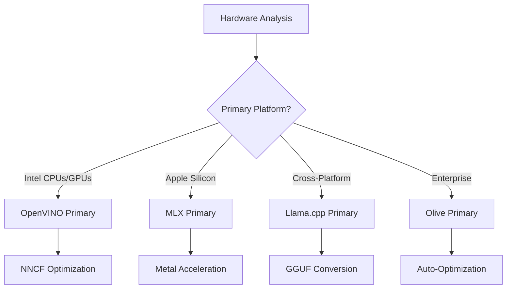
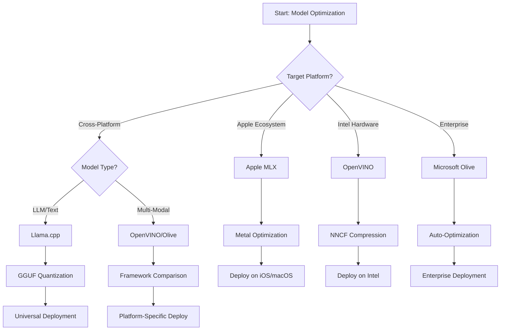
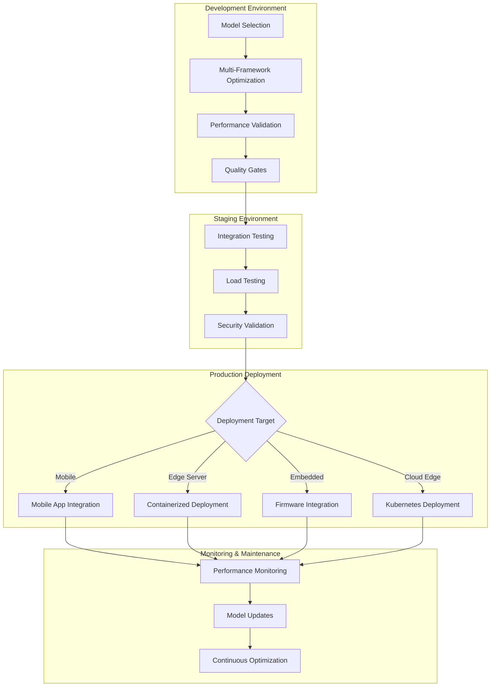

<!--
CO_OP_TRANSLATOR_METADATA:
{
  "original_hash": "6719c4a7e44b948230ac5f5cab3699bd",
  "translation_date": "2025-09-15T17:10:07+00:00",
  "source_file": "Module04/06.workflow-synthesis.md",
  "language_code": "fr"
}
-->
# Section 6 : Synthèse du flux de travail pour le développement de l'IA Edge

## Table des matières
1. [Introduction](../../../Module04)
2. [Objectifs d'apprentissage](../../../Module04)
3. [Vue d'ensemble du flux de travail unifié](../../../Module04)
4. [Matrice de sélection des frameworks](../../../Module04)
5. [Synthèse des meilleures pratiques](../../../Module04)
6. [Guide de stratégie de déploiement](../../../Module04)
7. [Flux de travail d'optimisation des performances](../../../Module04)
8. [Liste de contrôle pour la préparation à la production](../../../Module04)
9. [Dépannage et surveillance](../../../Module04)
10. [Anticiper l'avenir de votre pipeline Edge AI](../../../Module04)

## Introduction

Le développement de l'IA Edge nécessite une compréhension approfondie de plusieurs frameworks d'optimisation, stratégies de déploiement et considérations matérielles. Cette synthèse complète rassemble les connaissances issues de Llama.cpp, Microsoft Olive, OpenVINO et Apple MLX pour créer un flux de travail unifié qui maximise l'efficacité, maintient la qualité et garantit un déploiement réussi en production.

Tout au long de ce cours, nous avons exploré des frameworks d'optimisation individuels, chacun avec ses forces uniques et ses cas d'utilisation spécialisés. Cependant, les projets réels d'IA Edge nécessitent souvent de combiner des techniques de plusieurs frameworks ou de prendre des décisions stratégiques sur l'approche qui offrira les meilleurs résultats en fonction des contraintes et des exigences spécifiques.

Cette section synthétise les connaissances collectives de tous les frameworks en flux de travail exploitables, arbres de décision et meilleures pratiques qui vous permettent de construire des solutions d'IA Edge prêtes pour la production de manière efficace et efficiente. Que vous optimisiez pour des appareils mobiles, des systèmes embarqués ou des serveurs Edge, ce guide fournit le cadre stratégique pour prendre des décisions éclairées tout au long de votre cycle de développement.

## Objectifs d'apprentissage

À la fin de cette section, vous serez capable de :

### Prise de décision stratégique
- **Évaluer et sélectionner** le framework d'optimisation optimal en fonction des exigences du projet, des contraintes matérielles et des scénarios de déploiement
- **Concevoir des flux de travail complets** intégrant plusieurs techniques d'optimisation pour une efficacité maximale
- **Évaluer les compromis** entre précision du modèle, vitesse d'inférence, utilisation de la mémoire et complexité du déploiement à travers différents frameworks

### Intégration des flux de travail
- **Mettre en œuvre des pipelines de développement unifiés** exploitant les forces de plusieurs frameworks d'optimisation
- **Créer des flux de travail reproductibles** pour une optimisation et un déploiement cohérents des modèles dans différents environnements
- **Établir des seuils de qualité** et des processus de validation pour garantir que les modèles optimisés répondent aux exigences de production

### Optimisation des performances
- **Appliquer des stratégies d'optimisation systématiques** en utilisant la quantification, l'élagage et des techniques d'accélération spécifiques au matériel
- **Surveiller et mesurer** les performances des modèles à différents niveaux d'optimisation et cibles de déploiement
- **Optimiser pour des plateformes matérielles spécifiques** telles que CPU, GPU, NPU et accélérateurs Edge spécialisés

### Déploiement en production
- **Concevoir des architectures de déploiement évolutives** capables de gérer plusieurs formats de modèles et moteurs d'inférence
- **Mettre en œuvre la surveillance et l'observabilité** pour les applications d'IA Edge en production
- **Établir des flux de travail de maintenance** pour les mises à jour de modèles, la surveillance des performances et l'optimisation des systèmes

### Excellence multiplateforme
- **Déployer des modèles optimisés** sur des plateformes matérielles variées tout en maintenant des performances cohérentes
- **Gérer les optimisations spécifiques aux plateformes** pour Windows, macOS, Linux, mobile et systèmes embarqués
- **Créer des couches d'abstraction** permettant un déploiement fluide dans différents environnements Edge

## Vue d'ensemble du flux de travail unifié

### Phase 1 : Analyse des besoins et sélection des frameworks

La base d'un déploiement réussi de l'IA Edge commence par une analyse approfondie des besoins qui informe la sélection des frameworks et la stratégie d'optimisation.

#### 1.1 Évaluation du matériel


**Points clés à considérer :**
- **Architecture CPU** : Capacités x86, ARM, Apple Silicon
- **Disponibilité des accélérateurs** : GPU, NPU, VPU, puces AI spécialisées
- **Contraintes de mémoire** : Limites de RAM, capacité de stockage
- **Budget énergétique** : Autonomie de la batterie, contraintes thermiques
- **Connectivité** : Exigences hors ligne, limitations de bande passante

#### 1.2 Matrice des exigences de l'application

| Exigence | Llama.cpp | Microsoft Olive | OpenVINO | Apple MLX |
|----------|-----------|-----------------|----------|-----------|
| Multiplateforme | ✅ Excellent | ⚡ Bon | ⚡ Bon | ❌ Apple uniquement |
| Intégration entreprise | ⚡ Basique | ✅ Excellent | ✅ Excellent | ⚡ Limité |
| Déploiement mobile | ✅ Excellent | ⚡ Bon | ⚡ Bon | ✅ iOS Excellent |
| Inférence en temps réel | ✅ Excellent | ✅ Excellent | ✅ Excellent | ✅ Excellent |
| Diversité des modèles | ✅ Focalisé LLM | ✅ Tous modèles | ✅ Tous modèles | ✅ Focalisé LLM |
| Facilité d'utilisation | ✅ Simple | ✅ Automatisé | ⚡ Modéré | ✅ Simple |

### Phase 2 : Préparation et optimisation des modèles

#### 2.1 Pipeline universel d'évaluation des modèles

```python
# Universal Model Assessment Framework
class EdgeAIModelAssessment:
    def __init__(self, model_path, target_hardware):
        self.model_path = model_path
        self.target_hardware = target_hardware
        self.optimization_frameworks = []
        
    def assess_model_characteristics(self):
        """Analyze model size, architecture, and complexity"""
        return {
            'model_size': self.get_model_size(),
            'parameter_count': self.get_parameter_count(),
            'architecture_type': self.detect_architecture(),
            'quantization_compatibility': self.check_quantization_support()
        }
    
    def recommend_optimization_strategy(self):
        """Recommend optimal frameworks and techniques"""
        characteristics = self.assess_model_characteristics()
        
        if self.target_hardware.startswith('apple'):
            return self.mlx_optimization_strategy(characteristics)
        elif self.target_hardware.startswith('intel'):
            return self.openvino_optimization_strategy(characteristics)
        elif characteristics['model_size'] > 7_000_000_000:  # 7B+ parameters
            return self.enterprise_optimization_strategy(characteristics)
        else:
            return self.lightweight_optimization_strategy(characteristics)
```

#### 2.2 Pipeline d'optimisation multi-frameworks

**Approche d'optimisation séquentielle :**
1. **Conversion initiale** : Convertir au format intermédiaire (ONNX si possible)
2. **Optimisation spécifique au framework** : Appliquer des techniques spécialisées
3. **Validation croisée** : Vérifier les performances sur les plateformes cibles
4. **Emballage final** : Préparer pour le déploiement

```bash
# Multi-Framework Optimization Script
#!/bin/bash

MODEL_NAME="phi-3-mini"
BASE_MODEL="microsoft/Phi-3-mini-4k-instruct"

# Phase 1: ONNX Conversion (Universal)
python convert_to_onnx.py --model $BASE_MODEL --output models/onnx/

# Phase 2: Platform-Specific Optimization
if [[ "$TARGET_PLATFORM" == "intel" ]]; then
    # OpenVINO Optimization
    python optimize_openvino.py --input models/onnx/ --output models/openvino/
elif [[ "$TARGET_PLATFORM" == "apple" ]]; then
    # MLX Optimization
    python optimize_mlx.py --input $BASE_MODEL --output models/mlx/
elif [[ "$TARGET_PLATFORM" == "cross" ]]; then
    # Llama.cpp Optimization
    python convert_to_gguf.py --input models/onnx/ --output models/gguf/
fi

# Phase 3: Validation
python validate_optimization.py --original $BASE_MODEL --optimized models/$TARGET_PLATFORM/
```

### Phase 3 : Validation des performances et benchmarking

#### 3.1 Cadre de benchmarking complet

```python
class EdgeAIBenchmark:
    def __init__(self, optimized_models):
        self.models = optimized_models
        self.metrics = {
            'inference_time': [],
            'memory_usage': [],
            'accuracy_score': [],
            'throughput': [],
            'energy_consumption': []
        }
    
    def run_comprehensive_benchmark(self):
        """Execute standardized benchmarks across all optimized models"""
        test_inputs = self.generate_test_inputs()
        
        for model_framework, model_path in self.models.items():
            print(f"Benchmarking {model_framework}...")
            
            # Latency Testing
            latency = self.measure_inference_latency(model_path, test_inputs)
            
            # Memory Profiling
            memory = self.profile_memory_usage(model_path)
            
            # Accuracy Validation
            accuracy = self.validate_model_accuracy(model_path, test_inputs)
            
            # Throughput Analysis
            throughput = self.measure_throughput(model_path)
            
            self.record_metrics(model_framework, latency, memory, accuracy, throughput)
    
    def generate_optimization_report(self):
        """Create comprehensive comparison report"""
        report = {
            'recommendations': self.analyze_performance_trade_offs(),
            'deployment_guidance': self.generate_deployment_recommendations(),
            'monitoring_requirements': self.define_monitoring_metrics()
        }
        return report
```

## Matrice de sélection des frameworks

### Arbre de décision pour la sélection des frameworks



### Critères de sélection complets

#### 1. Alignement avec le cas d'utilisation principal

**Modèles de langage étendu (LLMs) :**
- **Llama.cpp** : Idéal pour un déploiement multiplateforme axé sur le CPU
- **Apple MLX** : Optimal pour Apple Silicon avec mémoire unifiée
- **OpenVINO** : Excellent pour le matériel Intel avec optimisation NNCF
- **Microsoft Olive** : Idéal pour les workflows d'entreprise avec automatisation

**Modèles multimodaux :**
- **OpenVINO** : Support complet pour vision, audio et texte
- **Microsoft Olive** : Optimisation de niveau entreprise pour pipelines complexes
- **Llama.cpp** : Limité aux modèles basés sur le texte
- **Apple MLX** : Support croissant pour les applications multimodales

#### 2. Matrice des plateformes matérielles

| Plateforme | Framework principal | Option secondaire | Fonctionnalités spécialisées |
|------------|---------------------|-------------------|-----------------------------|
| CPU/GPU Intel | OpenVINO | Microsoft Olive | Compression NNCF, optimisation Intel |
| GPU NVIDIA | Microsoft Olive | OpenVINO | Accélération CUDA, fonctionnalités entreprise |
| Apple Silicon | Apple MLX | Llama.cpp | Shaders Metal, mémoire unifiée |
| ARM Mobile | Llama.cpp | OpenVINO | Multiplateforme, dépendances minimales |
| Edge TPU | OpenVINO | Microsoft Olive | Support des accélérateurs spécialisés |
| ARM embarqué | Llama.cpp | OpenVINO | Empreinte minimale, inférence efficace |

#### 3. Préférences de flux de travail de développement

**Prototypage rapide :**
1. **Llama.cpp** : Configuration rapide, résultats immédiats
2. **Apple MLX** : API Python simple, itération rapide
3. **Microsoft Olive** : Optimisation automatisée, configuration minimale
4. **OpenVINO** : Configuration plus complexe, fonctionnalités complètes

**Production en entreprise :**
1. **Microsoft Olive** : Fonctionnalités entreprise, intégration Azure
2. **OpenVINO** : Écosystème Intel, outils complets
3. **Apple MLX** : Applications spécifiques à Apple en entreprise
4. **Llama.cpp** : Déploiement simple, fonctionnalités limitées en entreprise

## Synthèse des meilleures pratiques

### Principes universels d'optimisation

#### 1. Stratégie d'optimisation progressive

```python
class ProgressiveOptimization:
    def __init__(self, base_model):
        self.base_model = base_model
        self.optimization_stages = [
            'baseline_measurement',
            'format_conversion',
            'quantization_optimization',
            'hardware_acceleration',
            'production_validation'
        ]
    
    def execute_progressive_optimization(self):
        """Apply optimization techniques incrementally"""
        
        # Stage 1: Baseline Measurement
        baseline_metrics = self.measure_baseline_performance()
        
        # Stage 2: Format Conversion
        converted_model = self.convert_to_optimal_format()
        conversion_metrics = self.measure_performance(converted_model)
        
        # Stage 3: Quantization
        quantized_model = self.apply_quantization(converted_model)
        quantization_metrics = self.measure_performance(quantized_model)
        
        # Stage 4: Hardware Acceleration
        accelerated_model = self.enable_hardware_acceleration(quantized_model)
        acceleration_metrics = self.measure_performance(accelerated_model)
        
        # Stage 5: Validation
        production_ready = self.validate_for_production(accelerated_model)
        
        return self.compile_optimization_report(
            baseline_metrics, conversion_metrics, 
            quantization_metrics, acceleration_metrics
        )
```

#### 2. Mise en œuvre des seuils de qualité

**Seuils de préservation de la précision :**
- Maintenir >95 % de la précision originale du modèle
- Valider avec des ensembles de tests représentatifs
- Mettre en œuvre des tests A/B pour la validation en production

**Seuils d'amélioration des performances :**
- Obtenir une amélioration minimale de 2x en vitesse
- Réduire l'empreinte mémoire d'au moins 50 %
- Valider la cohérence des temps d'inférence

**Seuils de préparation à la production :**
- Réussir les tests de résistance sous charge
- Démontrer des performances stables dans le temps
- Valider les exigences de sécurité et de confidentialité

### Intégration des meilleures pratiques spécifiques aux frameworks

#### 1. Synthèse des stratégies de quantification

```python
# Unified Quantization Approach
class UnifiedQuantizationStrategy:
    def __init__(self, model, target_platform):
        self.model = model
        self.platform = target_platform
        
    def select_optimal_quantization(self):
        """Choose best quantization based on platform and requirements"""
        
        if self.platform == 'apple_silicon':
            return self.mlx_quantization_strategy()
        elif self.platform == 'intel_hardware':
            return self.openvino_quantization_strategy()
        elif self.platform == 'cross_platform':
            return self.llamacpp_quantization_strategy()
        else:
            return self.olive_quantization_strategy()
    
    def mlx_quantization_strategy(self):
        """Apple MLX-specific quantization"""
        return {
            'method': 'mlx_quantize',
            'precision': 'int4',
            'group_size': 64,
            'optimization_target': 'unified_memory'
        }
    
    def openvino_quantization_strategy(self):
        """OpenVINO NNCF quantization"""
        return {
            'method': 'nncf_quantize',
            'precision': 'int8',
            'calibration_method': 'post_training',
            'optimization_target': 'intel_hardware'
        }
```

#### 2. Optimisation de l'accélération matérielle

**Synthèse de l'optimisation CPU :**
- **Instructions SIMD** : Exploiter les noyaux optimisés dans les frameworks
- **Bande passante mémoire** : Optimiser les dispositions des données pour l'efficacité du cache
- **Threading** : Équilibrer le parallélisme avec les contraintes de ressources

**Meilleures pratiques pour l'accélération GPU :**
- **Traitement par lots** : Maximiser le débit avec des tailles de lots appropriées
- **Gestion de la mémoire** : Optimiser l'allocation et les transferts de mémoire GPU
- **Précision** : Utiliser FP16 lorsque pris en charge pour de meilleures performances

**Optimisation des accélérateurs NPU/spécialisés :**
- **Architecture du modèle** : Assurer la compatibilité avec les capacités de l'accélérateur
- **Flux de données** : Optimiser les pipelines d'entrée/sortie pour l'efficacité de l'accélérateur
- **Stratégies de repli** : Mettre en œuvre un repli CPU pour les opérations non prises en charge

## Guide de stratégie de déploiement

### Architecture universelle de déploiement



### Modèles de déploiement spécifiques aux plateformes

#### 1. Stratégie de déploiement mobile

```yaml
# Mobile Deployment Configuration
mobile_deployment:
  ios:
    framework: apple_mlx
    optimization:
      quantization: int4
      memory_mapping: true
      background_execution: limited
    packaging:
      format: mlx
      bundle_size: <50MB
      
  android:
    framework: llama_cpp
    optimization:
      quantization: q4_k_m
      threading: android_optimized
      memory_management: conservative
    packaging:
      format: gguf
      apk_size: <100MB
      
  cross_platform:
    framework: onnx_runtime
    optimization:
      quantization: int8
      execution_provider: cpu
    packaging:
      format: onnx
      shared_libraries: minimal
```

#### 2. Déploiement sur serveur Edge

```yaml
# Edge Server Deployment Configuration
edge_server:
  intel_based:
    framework: openvino
    optimization:
      quantization: int8
      acceleration: cpu_gpu_auto
      batch_processing: dynamic
    deployment:
      container: openvino_runtime
      orchestration: kubernetes
      scaling: horizontal
      
  nvidia_based:
    framework: microsoft_olive
    optimization:
      quantization: int4
      acceleration: cuda
      tensor_parallelism: true
    deployment:
      container: nvidia_triton
      orchestration: kubernetes
      scaling: gpu_aware
```

### Meilleures pratiques de conteneurisation

```dockerfile
# Multi-Framework Edge AI Container
FROM ubuntu:22.04 as base

# Install common dependencies
RUN apt-get update && apt-get install -y \
    python3 \
    python3-pip \
    build-essential \
    cmake \
    && rm -rf /var/lib/apt/lists/*

# Framework-specific stages
FROM base as openvino
RUN pip install openvino nncf optimum[intel]

FROM base as llamacpp
RUN git clone https://github.com/ggerganov/llama.cpp.git \
    && cd llama.cpp && make LLAMA_OPENBLAS=1

FROM base as olive
RUN pip install olive-ai[auto-opt] onnxruntime-genai

# Production stage with selected framework
FROM openvino as production
COPY models/ /app/models/
COPY src/ /app/src/
WORKDIR /app

EXPOSE 8080
CMD ["python3", "src/inference_server.py"]
```

## Flux de travail d'optimisation des performances

### Ajustement systématique des performances

#### 1. Pipeline de profilage des performances

```python
class EdgeAIPerformanceProfiler:
    def __init__(self, model_path, framework):
        self.model_path = model_path
        self.framework = framework
        self.profiling_results = {}
    
    def comprehensive_profiling(self):
        """Execute comprehensive performance analysis"""
        
        # CPU Profiling
        cpu_profile = self.profile_cpu_usage()
        
        # Memory Profiling
        memory_profile = self.profile_memory_usage()
        
        # Inference Latency
        latency_profile = self.profile_inference_latency()
        
        # Throughput Analysis
        throughput_profile = self.profile_throughput()
        
        # Energy Consumption (where available)
        energy_profile = self.profile_energy_consumption()
        
        return self.compile_performance_report(
            cpu_profile, memory_profile, latency_profile,
            throughput_profile, energy_profile
        )
    
    def identify_bottlenecks(self):
        """Automatically identify performance bottlenecks"""
        bottlenecks = []
        
        if self.profiling_results['cpu_utilization'] > 80:
            bottlenecks.append('cpu_bound')
        
        if self.profiling_results['memory_usage'] > 90:
            bottlenecks.append('memory_bound')
        
        if self.profiling_results['inference_variance'] > 20:
            bottlenecks.append('inconsistent_performance')
        
        return self.generate_optimization_recommendations(bottlenecks)
```

#### 2. Pipeline d'optimisation automatisée

```python
class AutomatedOptimizationPipeline:
    def __init__(self, base_model, target_constraints):
        self.base_model = base_model
        self.constraints = target_constraints
        self.optimization_history = []
    
    def execute_optimization_search(self):
        """Systematically search optimization space"""
        
        optimization_candidates = [
            {'quantization': 'int8', 'pruning': 0.1},
            {'quantization': 'int4', 'pruning': 0.2},
            {'quantization': 'int8', 'acceleration': 'gpu'},
            {'quantization': 'int4', 'acceleration': 'npu'}
        ]
        
        best_configuration = None
        best_score = 0
        
        for config in optimization_candidates:
            optimized_model = self.apply_optimization(config)
            score = self.evaluate_optimization(optimized_model)
            
            if score > best_score and self.meets_constraints(optimized_model):
                best_score = score
                best_configuration = config
            
            self.optimization_history.append({
                'config': config,
                'score': score,
                'model': optimized_model
            })
        
        return best_configuration, self.optimization_history
```

### Optimisation multi-objectifs

#### 1. Optimisation de Pareto pour l'IA Edge

```python
class ParetoOptimization:
    def __init__(self, objectives=['speed', 'accuracy', 'memory']):
        self.objectives = objectives
        self.pareto_frontier = []
    
    def find_pareto_optimal_solutions(self, optimization_results):
        """Identify Pareto-optimal configurations"""
        
        for result in optimization_results:
            is_dominated = False
            
            for frontier_point in self.pareto_frontier:
                if self.dominates(frontier_point, result):
                    is_dominated = True
                    break
            
            if not is_dominated:
                # Remove dominated points from frontier
                self.pareto_frontier = [
                    point for point in self.pareto_frontier 
                    if not self.dominates(result, point)
                ]
                
                self.pareto_frontier.append(result)
        
        return self.pareto_frontier
    
    def recommend_configuration(self, user_preferences):
        """Recommend configuration based on user preferences"""
        
        weighted_scores = []
        for config in self.pareto_frontier:
            score = sum(
                user_preferences[obj] * config['metrics'][obj] 
                for obj in self.objectives
            )
            weighted_scores.append((score, config))
        
        return max(weighted_scores, key=lambda x: x[0])[1]
```

## Liste de contrôle pour la préparation à la production

### Validation complète de la production

#### 1. Assurance qualité des modèles

```python
class ProductionReadinessValidator:
    def __init__(self, optimized_model, production_requirements):
        self.model = optimized_model
        self.requirements = production_requirements
        self.validation_results = {}
    
    def validate_model_quality(self):
        """Comprehensive model quality validation"""
        
        # Accuracy Validation
        accuracy_result = self.validate_accuracy()
        
        # Performance Validation
        performance_result = self.validate_performance()
        
        # Robustness Testing
        robustness_result = self.validate_robustness()
        
        # Security Assessment
        security_result = self.validate_security()
        
        # Compliance Verification
        compliance_result = self.validate_compliance()
        
        return self.compile_validation_report(
            accuracy_result, performance_result, robustness_result,
            security_result, compliance_result
        )
    
    def generate_certification_report(self):
        """Generate production certification report"""
        return {
            'model_signature': self.generate_model_signature(),
            'validation_timestamp': datetime.now(),
            'validation_results': self.validation_results,
            'deployment_approval': self.check_deployment_approval(),
            'monitoring_requirements': self.define_monitoring_requirements()
        }
```

#### 2. Liste de contrôle pour le déploiement en production

**Validation avant déploiement :**
- [ ] La précision du modèle répond aux exigences minimales (>95 % de la référence)
- [ ] Les objectifs de performance sont atteints (latence, débit, mémoire)
- [ ] Les vulnérabilités de sécurité sont évaluées et atténuées
- [ ] Les tests de résistance sont terminés sous charge attendue
- [ ] Les scénarios de défaillance sont testés et les procédures de récupération validées
- [ ] Les systèmes de surveillance et d'alerte sont configurés
- [ ] Les procédures de retour en arrière sont testées et documentées

**Processus de déploiement :**
- [ ] Stratégie de déploiement blue-green mise en œuvre
- [ ] Augmentation progressive du trafic configurée
- [ ] Tableaux de bord de surveillance en temps réel actifs
- [ ] Baselines de performance établies
- [ ] Seuils de taux d'erreur définis
- [ ] Déclencheurs de retour en arrière automatisés configurés

**Surveillance post-déploiement :**
- [ ] Détection de dérive du modèle active
- [ ] Alertes de dégradation des performances configurées
- [ ] Surveillance de l'utilisation des ressources activée
- [ ] Suivi des métriques d'expérience utilisateur
- [ ] Versionnement et traçabilité des modèles maintenus
- [ ] Revues régulières des performances des modèles programmées

### Intégration continue/déploiement continu (CI/CD)

```yaml
# Edge AI CI/CD Pipeline Configuration
edge_ai_pipeline:
  stages:
    - model_validation
    - optimization
    - testing
    - staging_deployment
    - production_deployment
    - monitoring
  
  model_validation:
    accuracy_threshold: 0.95
    performance_baseline: required
    security_scan: enabled
    
  optimization:
    frameworks:
      - llama_cpp
      - openvino
      - microsoft_olive
    validation:
      cross_validation: enabled
      performance_comparison: required
      
  testing:
    unit_tests: comprehensive
    integration_tests: full_pipeline
    load_tests: production_scale
    security_tests: comprehensive
    
  deployment:
    strategy: blue_green
    traffic_ramping: gradual
    rollback: automatic
    monitoring: real_time
```

## Dépannage et surveillance

### Cadre universel de dépannage

#### 1. Problèmes courants et solutions

**Problèmes de performance :**
```python
class PerformanceTroubleshooter:
    def __init__(self, model_metrics):
        self.metrics = model_metrics
        
    def diagnose_performance_issues(self):
        """Systematic performance issue diagnosis"""
        
        issues = []
        
        # High latency diagnosis
        if self.metrics['avg_latency'] > self.metrics['target_latency']:
            issues.append(self.diagnose_latency_issues())
        
        # Memory usage diagnosis
        if self.metrics['memory_usage'] > self.metrics['memory_limit']:
            issues.append(self.diagnose_memory_issues())
        
        # Throughput diagnosis
        if self.metrics['throughput'] < self.metrics['target_throughput']:
            issues.append(self.diagnose_throughput_issues())
        
        return self.generate_resolution_plan(issues)
    
    def diagnose_latency_issues(self):
        """Specific latency troubleshooting"""
        potential_causes = []
        
        if self.metrics['cpu_utilization'] > 80:
            potential_causes.append('cpu_bottleneck')
        
        if self.metrics['memory_bandwidth'] > 90:
            potential_causes.append('memory_bandwidth_limit')
        
        if self.metrics['model_size'] > self.metrics['optimal_size']:
            potential_causes.append('model_too_large')
        
        return {
            'issue': 'high_latency',
            'causes': potential_causes,
            'solutions': self.generate_latency_solutions(potential_causes)
        }
```

**Dépannage spécifique aux frameworks :**

| Problème | Llama.cpp | Microsoft Olive | OpenVINO | Apple MLX |
|----------|-----------|-----------------|----------|-----------|
| Problèmes de mémoire | Réduire la longueur du contexte | Réduire la taille du lot | Activer le cache | Utiliser le mappage mémoire |
| Inférence lente | Activer SIMD | Vérifier la quantification | Optimiser le threading | Activer Metal |
| Perte de précision | Quantification plus élevée | Réentraîner avec QAT | Augmenter la calibration | Affiner après quantification |
| Compatibilité | Vérifier le format du modèle | Vérifier la version du framework | Mettre à jour les pilotes | Vérifier la version macOS |

#### 2. Stratégie de surveillance en production

```python
class EdgeAIMonitoring:
    def __init__(self, deployment_config):
        self.config = deployment_config
        self.metrics_collectors = []
        self.alerting_rules = []
    
    def setup_comprehensive_monitoring(self):
        """Configure comprehensive monitoring for Edge AI deployment"""
        
        # Model Performance Monitoring
        self.setup_model_performance_monitoring()
        
        # Infrastructure Monitoring
        self.setup_infrastructure_monitoring()
        
        # Business Metrics Monitoring
        self.setup_business_metrics_monitoring()
        
        # Security Monitoring
        self.setup_security_monitoring()
    
    def setup_model_performance_monitoring(self):
        """Model-specific performance monitoring"""
        metrics = [
            'inference_latency_p50',
            'inference_latency_p95',
            'inference_latency_p99',
            'model_accuracy_drift',
            'prediction_confidence_distribution',
            'error_rate',
            'throughput_requests_per_second'
        ]
        
        for metric in metrics:
            self.add_metric_collector(metric)
            self.add_alerting_rule(metric)
    
    def detect_model_drift(self):
        """Automated model drift detection"""
        drift_indicators = [
            self.statistical_drift_detection(),
            self.performance_drift_detection(),
            self.data_distribution_shift_detection()
        ]
        
        return self.aggregate_drift_signals(drift_indicators)
```

### Résolution automatisée des problèmes

```python
class AutomatedIssueResolution:
    def __init__(self, monitoring_system):
        self.monitoring = monitoring_system
        self.resolution_strategies = {}
    
    def handle_performance_degradation(self, alert):
        """Automated performance issue resolution"""
        
        if alert['type'] == 'high_latency':
            return self.resolve_latency_issue(alert)
        elif alert['type'] == 'high_memory_usage':
            return self.resolve_memory_issue(alert)
        elif alert['type'] == 'accuracy_drift':
            return self.resolve_accuracy_issue(alert)
        
    def resolve_latency_issue(self, alert):
        """Automated latency issue resolution"""
        resolution_steps = [
            'increase_cpu_allocation',
            'enable_model_caching',
            'reduce_batch_size',
            'switch_to_quantized_model'
        ]
        
        for step in resolution_steps:
            if self.apply_resolution_step(step):
                return f"Resolved latency issue with: {step}"
        
        return "Escalating to human operator"
```

## Anticiper l'avenir de votre pipeline Edge AI

### Intégration des technologies émergentes

#### 1. Support des matériels de nouvelle génération

```python
class FutureHardwareIntegration:
    def __init__(self):
        self.supported_accelerators = [
            'npu_next_gen',
            'quantum_processors',
            'neuromorphic_chips',
            'optical_processors'
        ]
    
    def design_adaptive_pipeline(self):
        """Create hardware-agnostic optimization pipeline"""
        
        pipeline = {
            'model_preparation': self.universal_model_preparation(),
            'hardware_detection': self.dynamic_hardware_detection(),
            'optimization_selection': self.adaptive_optimization_selection(),
            'performance_validation': self.hardware_agnostic_validation()
        }
        
        return pipeline
    
    def adaptive_optimization_selection(self):
        """Dynamically select optimization based on available hardware"""
        
        def optimize_for_hardware(model, available_hardware):
            if 'npu' in available_hardware:
                return self.npu_optimization(model)
            elif 'quantum' in available_hardware:
                return self.quantum_optimization(model)
            elif 'neuromorphic' in available_hardware:
                return self.neuromorphic_optimization(model)
            else:
                return self.fallback_optimization(model)
        
        return optimize_for_hardware
```

#### 2. Évolution des architectures de modèles

**Support des architectures émergentes :**
- **Mixture of Experts (MoE)** : Architectures de modèles spars pour l'efficacité
- **Retrieval-Augmented Generation** : Systèmes hybrides modèle + base de connaissances
- **Modèles multimodaux** : Intégration vision + langage + audio
- **Apprentissage fédéré** : Entraînement et optimisation distribués

```python
class NextGenModelSupport:
    def __init__(self):
        self.architecture_handlers = {
            'moe': self.handle_mixture_of_experts,
            'rag': self.handle_retrieval_augmented,
            'multimodal': self.handle_multimodal,
            'federated': self.handle_federated_learning
        }
    
    def handle_mixture_of_experts(self, model):
        """Optimize Mixture of Experts models for edge deployment"""
        optimization_strategy = {
            'expert_pruning': True,
            'routing_optimization': True,
            'expert_quantization': 'per_expert',
            'load_balancing': 'dynamic'
        }
        return self.apply_moe_optimization(model, optimization_strategy)
```

### Apprentissage et adaptation continus

#### 1. Intégration de l'apprentissage en ligne

```python
class EdgeOnlineLearning:
    def __init__(self, base_model, learning_rate=0.001):
        self.base_model = base_model
        self.learning_rate = learning_rate
        self.adaptation_buffer = []
    
    def continuous_adaptation(self, new_data, feedback):
        """Continuously adapt model based on edge data"""
        
        # Privacy-preserving local adaptation
        local_updates = self.compute_local_gradients(new_data, feedback)
        
        # Apply updates with constraints
        adapted_model = self.apply_constrained_updates(
            self.base_model, local_updates
        )
        
        # Validate adaptation quality
        if self.validate_adaptation(adapted_model):
            self.base_model = adapted_model
            return True
        
        return False
    
    def federated_learning_participation(self):
        """Participate in federated learning while preserving privacy"""
        
        # Compute local model updates
        local_updates = self.compute_private_updates()
        
        # Differential privacy protection
        private_updates = self.apply_differential_privacy(local_updates)
        
        # Share with federated learning coordinator
        return self.share_updates(private_updates)
```

#### 2. Durabilité et IA verte

```python
class GreenEdgeAI:
    def __init__(self, sustainability_targets):
        self.targets = sustainability_targets
        self.energy_monitor = EnergyMonitor()
    
    def optimize_for_sustainability(self, model):
        """Optimize model for minimal environmental impact"""
        
        optimization_objectives = [
            'minimize_energy_consumption',
            'maximize_hardware_utilization',
            'reduce_model_training_cost',
            'extend_device_lifetime'
        ]
        
        return self.multi_objective_green_optimization(
            model, optimization_objectives
        )
    
    def carbon_aware_deployment(self):
        """Deploy models considering carbon footprint"""
        
        deployment_strategy = {
            'prefer_renewable_energy_regions': True,
            'optimize_for_energy_efficiency': True,
            'minimize_data_transfer': True,
            'lifecycle_carbon_accounting': True
        }
        
        return deployment_strategy
```

## Conclusion

Cette synthèse complète du flux de travail représente l'aboutissement des connaissances en optimisation de l'IA Edge, réunissant les meilleures pratiques de tous les principaux frameworks d'optimisation dans une approche unifiée et prête pour la production. En suivant ces directives, vous serez en mesure de :

**Atteindre des performances optimales** : Grâce à une sélection systématique des frameworks, une optimisation progressive et une validation complète, garantissant que vos applications d'IA Edge offrent une efficacité maximale.

**Assurer la préparation à la production** : Avec des tests approfondis, une surveillance et des seuils de qualité qui garantissent un déploiement et un fonctionnement fiables dans des environnements réels.

**Maintenir un succès à long terme** : Grâce à une surveillance continue, une résolution automatisée des problèmes et des stratégies d'adaptation qui maintiennent vos solutions d'IA Edge performantes et pertinentes.

**Anticiper l'avenir de votre investissement** : En concevant des pipelines flexibles et indépendants du matériel qui peuvent évoluer avec les technologies et les exigences émergentes.

Le paysage de l'IA Edge continue d'évoluer rapidement, avec de nouvelles plateformes matérielles, techniques d'optimisation et stratégies de déploiement qui émergent régulièrement. Cette synthèse fournit les bases pour naviguer dans cette complexité tout en construisant des solutions d'IA Edge robustes, efficaces et maintenables qui apportent une réelle valeur en production.
Rappelez-vous que la meilleure stratégie d'optimisation est celle qui répond à vos besoins spécifiques tout en conservant la flexibilité nécessaire pour s'adapter à l'évolution de ces besoins. Utilisez ce guide comme cadre pour prendre des décisions éclairées, mais validez toujours vos choix par des tests empiriques et une expérience de déploiement dans des conditions réelles.

## ➡️ Et après ?

Poursuivez votre parcours en Edge AI en explorant [Module 5 : SLMOps et Déploiement en Production](../Module05/README.md) pour en apprendre davantage sur les aspects opérationnels de la gestion du cycle de vie des Small Language Models.

---

**Avertissement** :  
Ce document a été traduit à l'aide du service de traduction automatique [Co-op Translator](https://github.com/Azure/co-op-translator). Bien que nous nous efforcions d'assurer l'exactitude, veuillez noter que les traductions automatisées peuvent contenir des erreurs ou des inexactitudes. Le document original dans sa langue d'origine doit être considéré comme la source faisant autorité. Pour des informations critiques, il est recommandé de recourir à une traduction professionnelle réalisée par un humain. Nous déclinons toute responsabilité en cas de malentendus ou d'interprétations erronées résultant de l'utilisation de cette traduction.