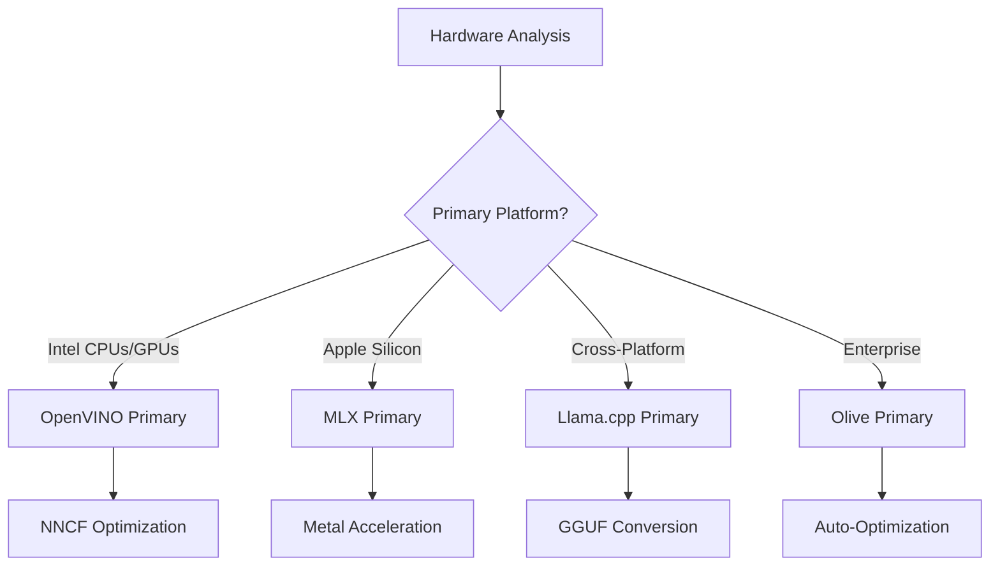
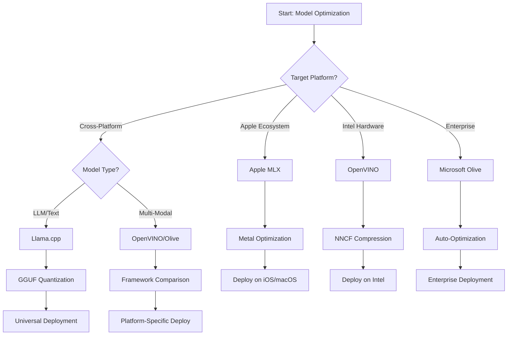
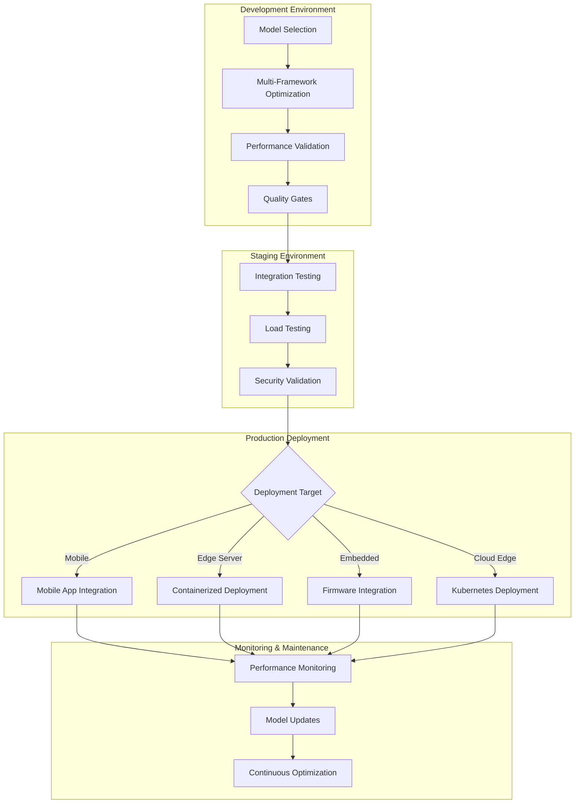

<!--
CO_OP_TRANSLATOR_METADATA:
{
  "original_hash": "6719c4a7e44b948230ac5f5cab3699bd",
  "translation_date": "2025-09-18T12:48:02+00:00",
  "source_file": "Module04/06.workflow-synthesis.md",
  "language_code": "he"
}
-->
# פרק 6: סינתזה של תהליך פיתוח Edge AI

## תוכן עניינים
1. [מבוא](../../../Module04)
2. [מטרות למידה](../../../Module04)
3. [סקירה כללית של תהליך מאוחד](../../../Module04)
4. [מטריצת בחירת מסגרות עבודה](../../../Module04)
5. [סינתזה של שיטות עבודה מומלצות](../../../Module04)
6. [מדריך אסטרטגיית פריסה](../../../Module04)
7. [תהליך אופטימיזציה לביצועים](../../../Module04)
8. [רשימת בדיקות למוכנות לייצור](../../../Module04)
9. [פתרון בעיות וניטור](../../../Module04)
10. [הבטחת עתידיות לצנרת Edge AI](../../../Module04)

## מבוא

פיתוח Edge AI דורש הבנה מעמיקה של מסגרות אופטימיזציה שונות, אסטרטגיות פריסה ושיקולי חומרה. סינתזה מקיפה זו מאחדת את הידע מ-Llama.cpp, Microsoft Olive, OpenVINO ו-Apple MLX ליצירת תהליך עבודה מאוחד שממקסם יעילות, שומר על איכות ומבטיח פריסה מוצלחת בייצור.

במהלך הקורס, חקרנו מסגרות אופטימיזציה בודדות, שלכל אחת מהן חוזקות ייחודיות ושימושים ייעודיים. עם זאת, פרויקטים אמיתיים של Edge AI דורשים לעיתים קרובות שילוב של טכניקות ממסגרות שונות או קבלת החלטות אסטרטגיות לגבי הגישה שתספק את התוצאות הטובות ביותר בהתחשב במגבלות ובדרישות.

פרק זה מסנתז את הידע המצטבר מכל המסגרות לתהליכי עבודה מעשיים, עצי החלטה ושיטות עבודה מומלצות, המאפשרים לכם לבנות פתרונות Edge AI מוכנים לייצור בצורה יעילה ואפקטיבית. בין אם אתם מבצעים אופטימיזציה למכשירים ניידים, מערכות משובצות או שרתי קצה, מדריך זה מספק את המסגרת האסטרטגית לקבלת החלטות מושכלות לאורך מחזור הפיתוח.

## מטרות למידה

בסיום פרק זה, תוכלו:

### קבלת החלטות אסטרטגית
- **להעריך ולבחור** את מסגרת האופטימיזציה האופטימלית בהתבסס על דרישות הפרויקט, מגבלות חומרה ותסריטי פריסה
- **לעצב תהליכי עבודה מקיפים** שמשלבים טכניקות אופטימיזציה מרובות למקסימום יעילות
- **להעריך פשרות** בין דיוק מודל, מהירות חיזוי, שימוש בזיכרון ומורכבות פריסה במסגרות שונות

### שילוב תהליכי עבודה
- **ליישם צנרות פיתוח מאוחדות** שמנצלות את החוזקות של מסגרות אופטימיזציה שונות
- **ליצור תהליכי עבודה שחוזרים על עצמם** לאופטימיזציה ופריסה עקבית של מודלים בסביבות שונות
- **להקים שערי איכות** ותהליכי ולידציה כדי להבטיח שהמודלים האופטימליים עומדים בדרישות הייצור

### אופטימיזציה לביצועים
- **ליישם אסטרטגיות אופטימיזציה שיטתיות** באמצעות כימות, גיזום וטכניקות האצה ייעודיות לחומרה
- **לנטר ולבצע בדיקות ביצועים** של מודלים ברמות אופטימיזציה שונות וביעדי פריסה שונים
- **לבצע אופטימיזציה לפלטפורמות חומרה ספציפיות** כולל CPU, GPU, NPU ומאיצי קצה ייעודיים

### פריסה בייצור
- **לעצב ארכיטקטורות פריסה ניתנות להרחבה** שמתאימות לפורמטים שונים של מודלים ומנועי חיזוי
- **ליישם ניטור ותצפיתיות** עבור יישומי Edge AI בסביבות ייצור
- **להקים תהליכי תחזוקה** לעדכוני מודלים, ניטור ביצועים ואופטימיזציית מערכות

### מצוינות בין-פלטפורמות
- **לפרוס מודלים אופטימליים** על פני פלטפורמות חומרה מגוונות תוך שמירה על ביצועים עקביים
- **לטפל באופטימיזציות ייעודיות לפלטפורמות** עבור Windows, macOS, Linux, מכשירים ניידים ומערכות משובצות
- **ליצור שכבות הפשטה** שמאפשרות פריסה חלקה בסביבות קצה שונות

## סקירה כללית של תהליך מאוחד

### שלב 1: ניתוח דרישות ובחירת מסגרת עבודה

הבסיס לפריסת Edge AI מוצלחת מתחיל בניתוח דרישות מעמיק שמנחה את בחירת המסגרת ואסטרטגיית האופטימיזציה.

#### 1.1 הערכת חומרה


**שיקולים מרכזיים:**
- **ארכיטקטורת CPU**: יכולות x86, ARM, Apple Silicon
- **זמינות מאיצים**: GPU, NPU, VPU, שבבי AI ייעודיים
- **מגבלות זיכרון**: מגבלות RAM, קיבולת אחסון
- **תקציב הספק**: חיי סוללה, מגבלות תרמיות
- **קישוריות**: דרישות עבודה לא מקוונת, מגבלות רוחב פס

#### 1.2 מטריצת דרישות יישום

| דרישה | Llama.cpp | Microsoft Olive | OpenVINO | Apple MLX |
|-------|-----------|-----------------|----------|-----------|
| בין-פלטפורמות | ✅ מצוין | ⚡ טוב | ⚡ טוב | ❌ רק Apple |
| אינטגרציה ארגונית | ⚡ בסיסי | ✅ מצוין | ✅ מצוין | ⚡ מוגבל |
| פריסה ניידת | ✅ מצוין | ⚡ טוב | ⚡ טוב | ✅ iOS מצוין |
| חיזוי בזמן אמת | ✅ מצוין | ✅ מצוין | ✅ מצוין | ✅ מצוין |
| מגוון מודלים | ✅ מיקוד LLM | ✅ כל המודלים | ✅ כל המודלים | ✅ מיקוד LLM |
| קלות שימוש | ✅ פשוט | ✅ אוטומטי | ⚡ בינוני | ✅ פשוט |

### שלב 2: הכנת מודל ואופטימיזציה

#### 2.1 צנרת הערכת מודל אוניברסלית

```python
# Universal Model Assessment Framework
class EdgeAIModelAssessment:
    def __init__(self, model_path, target_hardware):
        self.model_path = model_path
        self.target_hardware = target_hardware
        self.optimization_frameworks = []
        
    def assess_model_characteristics(self):
        """Analyze model size, architecture, and complexity"""
        return {
            'model_size': self.get_model_size(),
            'parameter_count': self.get_parameter_count(),
            'architecture_type': self.detect_architecture(),
            'quantization_compatibility': self.check_quantization_support()
        }
    
    def recommend_optimization_strategy(self):
        """Recommend optimal frameworks and techniques"""
        characteristics = self.assess_model_characteristics()
        
        if self.target_hardware.startswith('apple'):
            return self.mlx_optimization_strategy(characteristics)
        elif self.target_hardware.startswith('intel'):
            return self.openvino_optimization_strategy(characteristics)
        elif characteristics['model_size'] > 7_000_000_000:  # 7B+ parameters
            return self.enterprise_optimization_strategy(characteristics)
        else:
            return self.lightweight_optimization_strategy(characteristics)
```

#### 2.2 צנרת אופטימיזציה רב-מסגרתית

**גישה אופטימיזציה רציפה:**
1. **המרה ראשונית**: המרה לפורמט ביניים (ONNX כאשר אפשרי)
2. **אופטימיזציה ייעודית למסגרת**: יישום טכניקות ייחודיות
3. **ולידציה חוצה פלטפורמות**: אימות ביצועים ביעדי פריסה
4. **אריזה סופית**: הכנה לפריסה

```bash
# Multi-Framework Optimization Script
#!/bin/bash

MODEL_NAME="phi-3-mini"
BASE_MODEL="microsoft/Phi-3-mini-4k-instruct"

# Phase 1: ONNX Conversion (Universal)
python convert_to_onnx.py --model $BASE_MODEL --output models/onnx/

# Phase 2: Platform-Specific Optimization
if [[ "$TARGET_PLATFORM" == "intel" ]]; then
    # OpenVINO Optimization
    python optimize_openvino.py --input models/onnx/ --output models/openvino/
elif [[ "$TARGET_PLATFORM" == "apple" ]]; then
    # MLX Optimization
    python optimize_mlx.py --input $BASE_MODEL --output models/mlx/
elif [[ "$TARGET_PLATFORM" == "cross" ]]; then
    # Llama.cpp Optimization
    python convert_to_gguf.py --input models/onnx/ --output models/gguf/
fi

# Phase 3: Validation
python validate_optimization.py --original $BASE_MODEL --optimized models/$TARGET_PLATFORM/
```

### שלב 3: ולידציה ובדיקת ביצועים

#### 3.1 מסגרת בדיקות ביצועים מקיפה

```python
class EdgeAIBenchmark:
    def __init__(self, optimized_models):
        self.models = optimized_models
        self.metrics = {
            'inference_time': [],
            'memory_usage': [],
            'accuracy_score': [],
            'throughput': [],
            'energy_consumption': []
        }
    
    def run_comprehensive_benchmark(self):
        """Execute standardized benchmarks across all optimized models"""
        test_inputs = self.generate_test_inputs()
        
        for model_framework, model_path in self.models.items():
            print(f"Benchmarking {model_framework}...")
            
            # Latency Testing
            latency = self.measure_inference_latency(model_path, test_inputs)
            
            # Memory Profiling
            memory = self.profile_memory_usage(model_path)
            
            # Accuracy Validation
            accuracy = self.validate_model_accuracy(model_path, test_inputs)
            
            # Throughput Analysis
            throughput = self.measure_throughput(model_path)
            
            self.record_metrics(model_framework, latency, memory, accuracy, throughput)
    
    def generate_optimization_report(self):
        """Create comprehensive comparison report"""
        report = {
            'recommendations': self.analyze_performance_trade_offs(),
            'deployment_guidance': self.generate_deployment_recommendations(),
            'monitoring_requirements': self.define_monitoring_metrics()
        }
        return report
```

## מטריצת בחירת מסגרות עבודה

### עץ החלטות לבחירת מסגרת עבודה



### קריטריונים מקיפים לבחירה

#### 1. התאמה לשימוש עיקרי

**מודלים לשוניים גדולים (LLMs):**
- **Llama.cpp**: הטוב ביותר לפריסה ממוקדת CPU ובין-פלטפורמות
- **Apple MLX**: אופטימלי עבור Apple Silicon עם זיכרון מאוחד
- **OpenVINO**: מצוין עבור חומרת Intel עם אופטימיזציית NNCF
- **Microsoft Olive**: אידיאלי לתהליכי עבודה ארגוניים עם אוטומציה

**מודלים רב-מודאליים:**
- **OpenVINO**: תמיכה מקיפה בראייה, שמע וטקסט
- **Microsoft Olive**: אופטימיזציה ארגונית לצנרות מורכבות
- **Llama.cpp**: מוגבל למודלים מבוססי טקסט
- **Apple MLX**: תמיכה מתפתחת ליישומים רב-מודאליים

#### 2. מטריצת פלטפורמות חומרה

| פלטפורמה | מסגרת עיקרית | אפשרות משנית | תכונות ייחודיות |
|----------|--------------|---------------|------------------|
| Intel CPU/GPU | OpenVINO | Microsoft Olive | דחיסת NNCF, אופטימיזציית Intel |
| NVIDIA GPU | Microsoft Olive | OpenVINO | האצת CUDA, תכונות ארגוניות |
| Apple Silicon | Apple MLX | Llama.cpp | Metal shaders, זיכרון מאוחד |
| ARM Mobile | Llama.cpp | OpenVINO | בין-פלטפורמות, תלות מינימלית |
| Edge TPU | OpenVINO | Microsoft Olive | תמיכה במאיצים ייעודיים |
| Embedded ARM | Llama.cpp | OpenVINO | טביעת רגל מינימלית, חיזוי יעיל |

#### 3. העדפות תהליך פיתוח

**פרוטוטייפ מהיר:**
1. **Llama.cpp**: התקנה מהירה, תוצאות מיידיות
2. **Apple MLX**: API פשוט ב-Python, איטרציה מהירה
3. **Microsoft Olive**: אופטימיזציה אוטומטית, תצורה מינימלית
4. **OpenVINO**: התקנה מורכבת יותר, תכונות מקיפות

**ייצור ארגוני:**
1. **Microsoft Olive**: תכונות ארגוניות, אינטגרציה עם Azure
2. **OpenVINO**: אקוסיסטם Intel, כלים מקיפים
3. **Apple MLX**: יישומים ארגוניים ייעודיים ל-Apple
4. **Llama.cpp**: פריסה פשוטה, תכונות ארגוניות מוגבלות

## סינתזה של שיטות עבודה מומלצות

### עקרונות אופטימיזציה אוניברסליים

#### 1. אסטרטגיית אופטימיזציה פרוגרסיבית

```python
class ProgressiveOptimization:
    def __init__(self, base_model):
        self.base_model = base_model
        self.optimization_stages = [
            'baseline_measurement',
            'format_conversion',
            'quantization_optimization',
            'hardware_acceleration',
            'production_validation'
        ]
    
    def execute_progressive_optimization(self):
        """Apply optimization techniques incrementally"""
        
        # Stage 1: Baseline Measurement
        baseline_metrics = self.measure_baseline_performance()
        
        # Stage 2: Format Conversion
        converted_model = self.convert_to_optimal_format()
        conversion_metrics = self.measure_performance(converted_model)
        
        # Stage 3: Quantization
        quantized_model = self.apply_quantization(converted_model)
        quantization_metrics = self.measure_performance(quantized_model)
        
        # Stage 4: Hardware Acceleration
        accelerated_model = self.enable_hardware_acceleration(quantized_model)
        acceleration_metrics = self.measure_performance(accelerated_model)
        
        # Stage 5: Validation
        production_ready = self.validate_for_production(accelerated_model)
        
        return self.compile_optimization_report(
            baseline_metrics, conversion_metrics, 
            quantization_metrics, acceleration_metrics
        )
```

#### 2. יישום שערי איכות

**שערי שימור דיוק:**
- שמירה על >95% מדיוק המודל המקורי
- ולידציה מול מערכי בדיקה מייצגים
- יישום בדיקות A/B לאימות בייצור

**שערי שיפור ביצועים:**
- השגת שיפור מהירות מינימלי של פי 2
- הפחתת טביעת זיכרון בלפחות 50%
- אימות עקביות זמן חיזוי

**שערי מוכנות לייצור:**
- עמידה במבחני עומס
- הדגמת ביצועים יציבים לאורך זמן
- אימות דרישות אבטחה ופרטיות

### שילוב שיטות עבודה מומלצות ייעודיות למסגרות

#### 1. סינתזת אסטרטגיית כימות

```python
# Unified Quantization Approach
class UnifiedQuantizationStrategy:
    def __init__(self, model, target_platform):
        self.model = model
        self.platform = target_platform
        
    def select_optimal_quantization(self):
        """Choose best quantization based on platform and requirements"""
        
        if self.platform == 'apple_silicon':
            return self.mlx_quantization_strategy()
        elif self.platform == 'intel_hardware':
            return self.openvino_quantization_strategy()
        elif self.platform == 'cross_platform':
            return self.llamacpp_quantization_strategy()
        else:
            return self.olive_quantization_strategy()
    
    def mlx_quantization_strategy(self):
        """Apple MLX-specific quantization"""
        return {
            'method': 'mlx_quantize',
            'precision': 'int4',
            'group_size': 64,
            'optimization_target': 'unified_memory'
        }
    
    def openvino_quantization_strategy(self):
        """OpenVINO NNCF quantization"""
        return {
            'method': 'nncf_quantize',
            'precision': 'int8',
            'calibration_method': 'post_training',
            'optimization_target': 'intel_hardware'
        }
```

#### 2. אופטימיזציה להאצת חומרה

**סינתזת אופטימיזציה ל-CPU:**
- **הוראות SIMD**: ניצול ליבות אופטימליות בכל המסגרות
- **רוחב פס זיכרון**: אופטימיזציה של פריסות נתונים ליעילות מטמון
- **ת'רדינג**: איזון בין מקביליות למגבלות משאבים

**שיטות עבודה מומלצות להאצת GPU:**
- **עיבוד באצ'ים**: מקסום תפוקה עם גדלי באצ'ים מתאימים
- **ניהול זיכרון**: אופטימיזציה של הקצאת זיכרון GPU והעברות
- **דיוק**: שימוש ב-FP16 כאשר נתמך לשיפור ביצועים

**אופטימיזציה למאיצים ייעודיים/NPU:**
- **ארכיטקטורת מודל**: הבטחת תאימות ליכולות המאיץ
- **זרימת נתונים**: אופטימיזציה של צנרות קלט/פלט ליעילות המאיץ
- **אסטרטגיות גיבוי**: יישום גיבוי ל-CPU לפעולות לא נתמכות

## מדריך אסטרטגיית פריסה

### ארכיטקטורת פריסה אוניברסלית



### דפוסי פריסה ייעודיים לפלטפורמות

#### 1. אסטרטגיית פריסה לניידים

```yaml
# Mobile Deployment Configuration
mobile_deployment:
  ios:
    framework: apple_mlx
    optimization:
      quantization: int4
      memory_mapping: true
      background_execution: limited
    packaging:
      format: mlx
      bundle_size: <50MB
      
  android:
    framework: llama_cpp
    optimization:
      quantization: q4_k_m
      threading: android_optimized
      memory_management: conservative
    packaging:
      format: gguf
      apk_size: <100MB
      
  cross_platform:
    framework: onnx_runtime
    optimization:
      quantization: int8
      execution_provider: cpu
    packaging:
      format: onnx
      shared_libraries: minimal
```

#### 2. פריסת שרתי קצה

```yaml
# Edge Server Deployment Configuration
edge_server:
  intel_based:
    framework: openvino
    optimization:
      quantization: int8
      acceleration: cpu_gpu_auto
      batch_processing: dynamic
    deployment:
      container: openvino_runtime
      orchestration: kubernetes
      scaling: horizontal
      
  nvidia_based:
    framework: microsoft_olive
    optimization:
      quantization: int4
      acceleration: cuda
      tensor_parallelism: true
    deployment:
      container: nvidia_triton
      orchestration: kubernetes
      scaling: gpu_aware
```

### שיטות עבודה מומלצות לקונטיינריזציה

```dockerfile
# Multi-Framework Edge AI Container
FROM ubuntu:22.04 as base

# Install common dependencies
RUN apt-get update && apt-get install -y \
    python3 \
    python3-pip \
    build-essential \
    cmake \
    && rm -rf /var/lib/apt/lists/*

# Framework-specific stages
FROM base as openvino
RUN pip install openvino nncf optimum[intel]

FROM base as llamacpp
RUN git clone https://github.com/ggerganov/llama.cpp.git \
    && cd llama.cpp && make LLAMA_OPENBLAS=1

FROM base as olive
RUN pip install olive-ai[auto-opt] onnxruntime-genai

# Production stage with selected framework
FROM openvino as production
COPY models/ /app/models/
COPY src/ /app/src/
WORKDIR /app

EXPOSE 8080
CMD ["python3", "src/inference_server.py"]
```

## תהליך אופטימיזציה לביצועים

### כוונון ביצועים שיטתי

#### 1. צנרת פרופיל ביצועים

```python
class EdgeAIPerformanceProfiler:
    def __init__(self, model_path, framework):
        self.model_path = model_path
        self.framework = framework
        self.profiling_results = {}
    
    def comprehensive_profiling(self):
        """Execute comprehensive performance analysis"""
        
        # CPU Profiling
        cpu_profile = self.profile_cpu_usage()
        
        # Memory Profiling
        memory_profile = self.profile_memory_usage()
        
        # Inference Latency
        latency_profile = self.profile_inference_latency()
        
        # Throughput Analysis
        throughput_profile = self.profile_throughput()
        
        # Energy Consumption (where available)
        energy_profile = self.profile_energy_consumption()
        
        return self.compile_performance_report(
            cpu_profile, memory_profile, latency_profile,
            throughput_profile, energy_profile
        )
    
    def identify_bottlenecks(self):
        """Automatically identify performance bottlenecks"""
        bottlenecks = []
        
        if self.profiling_results['cpu_utilization'] > 80:
            bottlenecks.append('cpu_bound')
        
        if self.profiling_results['memory_usage'] > 90:
            bottlenecks.append('memory_bound')
        
        if self.profiling_results['inference_variance'] > 20:
            bottlenecks.append('inconsistent_performance')
        
        return self.generate_optimization_recommendations(bottlenecks)
```

#### 2. צנרת אופטימיזציה אוטומטית

```python
class AutomatedOptimizationPipeline:
    def __init__(self, base_model, target_constraints):
        self.base_model = base_model
        self.constraints = target_constraints
        self.optimization_history = []
    
    def execute_optimization_search(self):
        """Systematically search optimization space"""
        
        optimization_candidates = [
            {'quantization': 'int8', 'pruning': 0.1},
            {'quantization': 'int4', 'pruning': 0.2},
            {'quantization': 'int8', 'acceleration': 'gpu'},
            {'quantization': 'int4', 'acceleration': 'npu'}
        ]
        
        best_configuration = None
        best_score = 0
        
        for config in optimization_candidates:
            optimized_model = self.apply_optimization(config)
            score = self.evaluate_optimization(optimized_model)
            
            if score > best_score and self.meets_constraints(optimized_model):
                best_score = score
                best_configuration = config
            
            self.optimization_history.append({
                'config': config,
                'score': score,
                'model': optimized_model
            })
        
        return best_configuration, self.optimization_history
```

### אופטימיזציה רב-מטרתית

#### 1. אופטימיזציית Pareto ל-Edge AI

```python
class ParetoOptimization:
    def __init__(self, objectives=['speed', 'accuracy', 'memory']):
        self.objectives = objectives
        self.pareto_frontier = []
    
    def find_pareto_optimal_solutions(self, optimization_results):
        """Identify Pareto-optimal configurations"""
        
        for result in optimization_results:
            is_dominated = False
            
            for frontier_point in self.pareto_frontier:
                if self.dominates(frontier_point, result):
                    is_dominated = True
                    break
            
            if not is_dominated:
                # Remove dominated points from frontier
                self.pareto_frontier = [
                    point for point in self.pareto_frontier 
                    if not self.dominates(result, point)
                ]
                
                self.pareto_frontier.append(result)
        
        return self.pareto_frontier
    
    def recommend_configuration(self, user_preferences):
        """Recommend configuration based on user preferences"""
        
        weighted_scores = []
        for config in self.pareto_frontier:
            score = sum(
                user_preferences[obj] * config['metrics'][obj] 
                for obj in self.objectives
            )
            weighted_scores.append((score, config))
        
        return max(weighted_scores, key=lambda x: x[0])[1]
```

## רשימת בדיקות למוכנות לייצור

### ולידציה מקיפה לייצור

#### 1. הבטחת איכות מודל

```python
class ProductionReadinessValidator:
    def __init__(self, optimized_model, production_requirements):
        self.model = optimized_model
        self.requirements = production_requirements
        self.validation_results = {}
    
    def validate_model_quality(self):
        """Comprehensive model quality validation"""
        
        # Accuracy Validation
        accuracy_result = self.validate_accuracy()
        
        # Performance Validation
        performance_result = self.validate_performance()
        
        # Robustness Testing
        robustness_result = self.validate_robustness()
        
        # Security Assessment
        security_result = self.validate_security()
        
        # Compliance Verification
        compliance_result = self.validate_compliance()
        
        return self.compile_validation_report(
            accuracy_result, performance_result, robustness_result,
            security_result, compliance_result
        )
    
    def generate_certification_report(self):
        """Generate production certification report"""
        return {
            'model_signature': self.generate_model_signature(),
            'validation_timestamp': datetime.now(),
            'validation_results': self.validation_results,
            'deployment_approval': self.check_deployment_approval(),
            'monitoring_requirements': self.define_monitoring_requirements()
        }
```

#### 2. רשימת בדיקות לפריסה בייצור

**ולידציה לפני פריסה:**
- [ ] דיוק המודל עומד בדרישות המינימום (>95% מהבסיס)
- [ ] יעדי ביצועים הושגו (זמן תגובה, תפוקה, זיכרון)
- [ ] פגיעויות אבטחה הוערכו וטופלו
- [ ] מבחני עומס הושלמו תחת עומס צפוי
- [ ] תרחישי כשל נבדקו ותהליכי התאוששות אומתו
- [ ] מערכות ניטור והתראות הוגדרו
- [ ] תהליכי חזרה לאחור נבדקו ותועדו

**תהליך פריסה:**
- [ ] אסטרטגיית פריסה כחול-ירוק יושמה
- [ ] הגברת תנועה הדרגתית הוגדרה
- [ ] לוחות מחוונים לניטור בזמן אמת פעילים
- [ ] בסיסי ביצועים הוקמו
- [ ] ספי שיעור שגיאות הוגדרו
- [ ] טריגרים אוטומטיים לחזרה לאחור הוגדרו

**ניטור לאחר פריסה:**
- [ ] זיהוי סטיית מודל פעיל
- [ ] התראות על ירידת ביצועים הוגדרו
- [ ] ניטור ניצול משאבים הופעל
- [ ] מדדי חוויית משתמש נעקבים
- [ ] גרסאות מודל ושושלת נשמרות
- [ ] סקירות ביצועי מודל מתוזמנות באופן קבוע

### אינטגרציה של CI/CD

```yaml
# Edge AI CI/CD Pipeline Configuration
edge_ai_pipeline:
  stages:
    - model_validation
    - optimization
    - testing
    - staging_deployment
    - production_deployment
    - monitoring
  
  model_validation:
    accuracy_threshold: 0.95
    performance_baseline: required
    security_scan: enabled
    
  optimization:
    frameworks:
      - llama_cpp
      - openvino
      - microsoft_olive
    validation:
      cross_validation: enabled
      performance_comparison: required
      
  testing:
    unit_tests: comprehensive
    integration_tests: full_pipeline
    load_tests: production_scale
    security_tests: comprehensive
    
  deployment:
    strategy: blue_green
    traffic_ramping: gradual
    rollback: automatic
    monitoring: real_time
```

## פתרון בעיות וניטור

### מסגרת פתרון בעיות אוניברסלית

#### 1. בעיות נפוצות ופתרונות

**בעיות ביצועים:**
```python
class PerformanceTroubleshooter:
    def __init__(self, model_metrics):
        self.metrics = model_metrics
        
    def diagnose_performance_issues(self):
        """Systematic performance issue diagnosis"""
        
        issues = []
        
        # High latency diagnosis
        if self.metrics['avg_latency'] > self.metrics['target_latency']:
            issues.append(self.diagnose_latency_issues())
        
        # Memory usage diagnosis
        if self.metrics['memory_usage'] > self.metrics['memory_limit']:
            issues.append(self.diagnose_memory_issues())
        
        # Throughput diagnosis
        if self.metrics['throughput'] < self.metrics['target_throughput']:
            issues.append(self.diagnose_throughput_issues())
        
        return self.generate_resolution_plan(issues)
    
    def diagnose_latency_issues(self):
        """Specific latency troubleshooting"""
        potential_causes = []
        
        if self.metrics['cpu_utilization'] > 80:
            potential_causes.append('cpu_bottleneck')
        
        if self.metrics['memory_bandwidth'] > 90:
            potential_causes.append('memory_bandwidth_limit')
        
        if self.metrics['model_size'] > self.metrics['optimal_size']:
            potential_causes.append('model_too_large')
        
        return {
            'issue': 'high_latency',
            'causes': potential_causes,
            'solutions': self.generate_latency_solutions(potential_causes)
        }
```

**פתרון בעיות ייעודי למסגרות:**

| בעיה | Llama.cpp | Microsoft Olive | OpenVINO | Apple MLX |
|------|-----------|-----------------|----------|-----------|
| בעיות זיכרון | צמצום אורך הקשר | הקטנת גודל באצ' | הפעלת מטמון | שימוש במיפוי זיכרון |
| חיזוי איטי | הפעלת SIMD | בדיקת כימות | אופטימיזציית ת'רדינג | הפעלת Metal |
| אובדן דיוק | כימות גבוה יותר | אימון מחדש עם QAT | הגברת כיול | כוונון לאחר כימות |
| תאימות | בדיקת פורמט מודל | אימות גרסת מסגרת | עדכון דרייברים | בדיקת גרסת macOS |

#### 2. אסטרטגיית ניטור בייצור

```python
class EdgeAIMonitoring:
    def __init__(self, deployment_config):
        self.config = deployment_config
        self.metrics_collectors = []
        self.alerting_rules = []
    
    def setup_comprehensive_monitoring(self):
        """Configure comprehensive monitoring for Edge AI deployment"""
        
        # Model Performance Monitoring
        self.setup_model_performance_monitoring()
        
        # Infrastructure Monitoring
        self.setup_infrastructure_monitoring()
        
        # Business Metrics Monitoring
        self.setup_business_metrics_monitoring()
        
        # Security Monitoring
        self.setup_security_monitoring()
    
    def setup_model_performance_monitoring(self):
        """Model-specific performance monitoring"""
        metrics = [
            'inference_latency_p50',
            'inference_latency_p95',
            'inference_latency_p99',
            'model_accuracy_drift',
            'prediction_confidence_distribution',
            'error_rate',
            'throughput_requests_per_second'
        ]
        
        for metric in metrics:
            self.add_metric_collector(metric)
            self.add_alerting_rule(metric)
    
    def detect_model_drift(self):
        """Automated model drift detection"""
        drift_indicators = [
            self.statistical_drift_detection(),
            self.performance_drift_detection(),
            self.data_distribution_shift_detection()
        ]
        
        return self.aggregate_drift_signals(drift_indicators)
```

### פתרון בעיות אוטומטי

```python
class AutomatedIssueResolution:
    def __init__(self, monitoring_system):
        self.monitoring = monitoring_system
        self.resolution_strategies = {}
    
    def handle_performance_degradation(self, alert):
        """Automated performance issue resolution"""
        
        if alert['type'] == 'high_latency':
            return self.resolve_latency_issue(alert)
        elif alert['type'] == 'high_memory_usage':
            return self.resolve_memory_issue(alert)
        elif alert['type'] == 'accuracy_drift':
            return self.resolve_accuracy_issue(alert)
        
    def resolve_latency_issue(self, alert):
        """Automated latency issue resolution"""
        resolution_steps = [
            'increase_cpu_allocation',
            'enable_model_caching',
            'reduce_batch_size',
            'switch_to_quantized_model'
        ]
        
        for step in resolution_steps:
            if self.apply_resolution_step(step):
                return f"Resolved latency issue with: {step}"
        
        return "Escalating to human operator"
```

## הבטחת עתידיות לצנרת Edge AI

### אינטגרציה של טכנולוגיות מתקדמות

#### 1. תמיכה בחומרה מהדור הבא

```python
class FutureHardwareIntegration:
    def __init__(self):
        self.supported_accelerators = [
            'npu_next_gen',
            'quantum_processors',
            'neuromorphic_chips',
            'optical_processors'
        ]
    
    def design_adaptive_pipeline(self):
        """Create hardware-agnostic optimization pipeline"""
        
        pipeline = {
            'model_preparation': self.universal_model_preparation(),
            'hardware_detection': self.dynamic_hardware_detection(),
            'optimization_selection': self.adaptive_optimization_selection(),
            'performance_validation': self.hardware_agnostic_validation()
        }
        
        return pipeline
    
    def adaptive_optimization_selection(self):
        """Dynamically select optimization based on available hardware"""
        
        def optimize_for_hardware(model, available_hardware):
            if 'npu' in available_hardware:
                return self.npu_optimization(model)
            elif 'quantum' in available_hardware:
                return self.quantum_optimization(model)
            elif 'neuromorphic' in available_hardware:
                return self.neuromorphic_optimization(model)
            else:
                return self.fallback_optimization(model)
        
        return optimize_for_hardware
```

#### 2. אבולוציית ארכיטקטורת מודלים

**תמיכה בארכיטקטורות מתקדמות:**
- **Mixture of Experts (MoE)**: ארכיטקטורות מודלים דלילות ליעילות
- **חיזוי מוגבר על ידי שליפה**: מערכות היברידיות של מודל + בסיס ידע
- **מודלים רב-מודאליים**: אינטגרציה של ראייה + שפה + שמע
- **למידה מבוזרת**: אימון ואופטימיזציה מבוזרים

```python
class NextGenModelSupport:
    def __init__(self):
        self.architecture_handlers = {
            'moe': self.handle_mixture_of_experts,
            'rag': self.handle_retrieval_augmented,
            'multimodal': self.handle_multimodal,
            'federated': self.handle_federated_learning
        }
    
    def handle_mixture_of_experts(self, model):
        """Optimize Mixture of Experts models for edge deployment"""
        optimization_strategy = {
            'expert_pruning': True,
            'routing_optimization': True,
            'expert_quantization': 'per_expert',
            'load_balancing': 'dynamic'
        }
        return self.apply_moe_optimization(model, optimization_strategy)
```

### למידה והתאמה מתמשכת

#### 1. אינטגרציה של למידה מקוונת

```python
class EdgeOnlineLearning:
    def __init__(self, base_model, learning_rate=0.001):
        self.base_model = base_model
        self.learning_rate = learning_rate
        self.adaptation_buffer = []
    
    def continuous_adaptation(self, new_data, feedback):
        """Continuously adapt model based on edge data"""
        
        # Privacy-preserving local adaptation
        local_updates = self.compute_local_gradients(new_data, feedback)
        
        # Apply updates with constraints
        adapted_model = self.apply_constrained_updates(
            self.base_model, local_updates
        )
        
        # Validate adaptation quality
        if self.validate_adaptation(adapted_model):
            self.base_model = adapted_model
            return True
        
        return False
    
    def federated_learning_participation(self):
        """Participate in federated learning while preserving privacy"""
        
        # Compute local model updates
        local_updates = self.compute_private_updates()
        
        # Differential privacy protection
        private_updates = self.apply_differential_privacy(local_updates)
        
        # Share with federated learning coordinator
        return self.share_updates(private_updates)
```

#### 2. קיימות ו-AI ירוק

```python
class GreenEdgeAI:
    def __init__(self, sustainability_targets):
        self.targets = sustainability_targets
        self.energy_monitor = EnergyMonitor()
    
    def optimize_for_sustainability(self, model):
        """Optimize model for minimal environmental impact"""
        
        optimization_objectives = [
            'minimize_energy_consumption',
            'maximize_hardware_utilization',
            'reduce_model_training_cost',
            'extend_device_lifetime'
        ]
        
        return self.multi_objective_green_optimization(
            model, optimization_objectives
        )
    
    def carbon_aware_deployment(self):
        """Deploy models considering carbon footprint"""
        
        deployment_strategy = {
            'prefer_renewable_energy_regions': True,
            'optimize_for_energy_efficiency': True,
            'minimize_data_transfer': True,
            'lifecycle_carbon_accounting': True
        }
        
        return deployment_strategy
```

## סיכום

סינתזה מקיפה זו מייצגת את שיא הידע באופטימיזציית Edge AI, תוך איחוד
זכרו שהאסטרטגיה האופטימלית הטובה ביותר היא זו שעונה על הדרישות הספציפיות שלכם תוך שמירה על גמישות להתאמה ככל שהדרישות הללו מתפתחות. השתמשו במדריך זה כבסיס לקבלת החלטות מושכלות, אך תמיד תאמתו את הבחירות שלכם באמצעות בדיקות אמפיריות וניסיון פריסה בעולם האמיתי.

## ➡️ מה הלאה

המשיכו במסע ה-AI Edge שלכם על ידי חקירת [מודול 5: SLMOps ופריסה בייצור](../Module05/README.md) כדי ללמוד על ההיבטים התפעוליים של ניהול מחזור החיים של מודלים קטנים לשפה.

---

**כתב ויתור**:  
מסמך זה תורגם באמצעות שירות תרגום מבוסס בינה מלאכותית [Co-op Translator](https://github.com/Azure/co-op-translator). למרות שאנו שואפים לדיוק, יש לקחת בחשבון שתרגומים אוטומטיים עשויים להכיל שגיאות או אי דיוקים. המסמך המקורי בשפתו המקורית צריך להיחשב כמקור סמכותי. עבור מידע קריטי, מומלץ להשתמש בתרגום מקצועי על ידי אדם. איננו נושאים באחריות לאי הבנות או לפרשנויות שגויות הנובעות משימוש בתרגום זה.