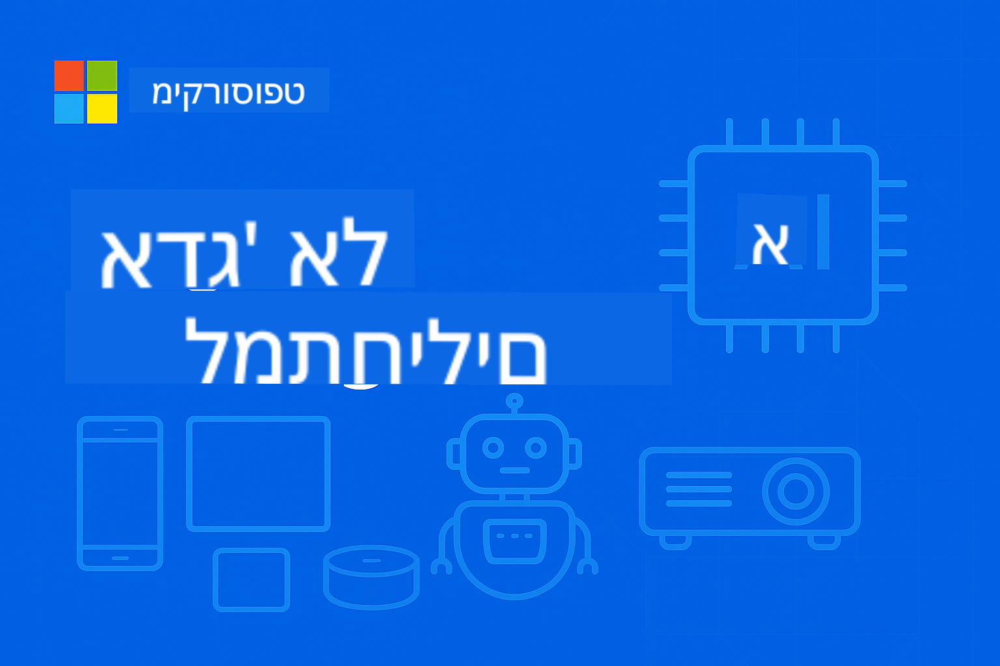

<!--
CO_OP_TRANSLATOR_METADATA:
{
  "original_hash": "9a189d7d9d47816a518ca119d79dc19b",
  "translation_date": "2025-09-22T21:34:38+00:00",
  "source_file": "README.md",
  "language_code": "he"
}
-->
# EdgeAI למתחילים



[](https://GitHub.com/microsoft/edgeai-for-beginners/graphs/contributors)  
[](https://GitHub.com/microsoft/edgeai-for-beginners/issues)  
[](https://GitHub.com/microsoft/edgeai-for-beginners/pulls)  
[](http://makeapullrequest.com)  

[](https://GitHub.com/microsoft/edgeai-for-beginners/watchers)  
[](https://GitHub.com/microsoft/edgeai-for-beginners/fork)  
[](https://GitHub.com/microsoft/edgeai-for-beginners/stargazers)  

[](https://discord.com/invite/ByRwuEEgH4)

עקבו אחר השלבים הבאים כדי להתחיל להשתמש במשאבים אלו:

1. **פיצול הריפוזיטורי**: לחצו [](https://GitHub.com/microsoft/edgeai-for-beginners/fork)  
2. **שכפול הריפוזיטורי**: `git clone https://github.com/microsoft/edgeai-for-beginners.git`  
3. [**הצטרפו ל-Azure AI Foundry Discord ופגשו מומחים ומפתחים נוספים**](https://discord.com/invite/ByRwuEEgH4)  

### 🌐 תמיכה רב-לשונית

#### נתמך באמצעות GitHub Action (אוטומטי ותמיד מעודכן)

[ערבית](../ar/README.md) | [בנגלית](../bn/README.md) | [בולגרית](../bg/README.md) | [בורמזית (מיאנמר)](../my/README.md) | [סינית (פשוטה)](../zh/README.md) | [סינית (מסורתית, הונג קונג)](../hk/README.md) | [סינית (מסורתית, מקאו)](../mo/README.md) | [סינית (מסורתית, טייוואן)](../tw/README.md) | [קרואטית](../hr/README.md) | [צ'כית](../cs/README.md) | [דנית](../da/README.md) | [הולנדית](../nl/README.md) | [פינית](../fi/README.md) | [צרפתית](../fr/README.md) | [גרמנית](../de/README.md) | [יוונית](../el/README.md) | [עברית](./README.md) | [הינדית](../hi/README.md) | [הונגרית](../hu/README.md) | [אינדונזית](../id/README.md) | [איטלקית](../it/README.md) | [יפנית](../ja/README.md) | [קוריאנית](../ko/README.md) | [מלאית](../ms/README.md) | [מרטהי](../mr/README.md) | [נפאלית](../ne/README.md) | [נורווגית](../no/README.md) | [פרסית (פארסי)](../fa/README.md) | [פולנית](../pl/README.md) | [פורטוגזית (ברזיל)](../br/README.md) | [פורטוגזית (פורטוגל)](../pt/README.md) | [פונג'בית (גורמוקי)](../pa/README.md) | [רומנית](../ro/README.md) | [רוסית](../ru/README.md) | [סרבית (קירילית)](../sr/README.md) | [סלובקית](../sk/README.md) | [סלובנית](../sl/README.md) | [ספרדית](../es/README.md) | [סוואהילית](../sw/README.md) | [שוודית](../sv/README.md) | [טאגאלוג (פיליפינית)](../tl/README.md) | [תאית](../th/README.md) | [טורקית](../tr/README.md) | [אוקראינית](../uk/README.md) | [אורדו](../ur/README.md) | [וייטנאמית](../vi/README.md)

**אם תרצו להוסיף שפות נוספות, רשימת השפות הנתמכות נמצאת [כאן](https://github.com/Azure/co-op-translator/blob/main/getting_started/supported-languages.md)**

## מבוא

ברוכים הבאים ל-**EdgeAI למתחילים** – המסע המקיף שלכם אל העולם המהפכני של בינה מלאכותית בקצה. הקורס הזה מחבר בין יכולות AI עוצמתיות לבין יישום מעשי בעולם האמיתי על מכשירי קצה, ומאפשר לכם לנצל את הפוטנציאל של AI ישירות במקום שבו הנתונים נוצרים וההחלטות צריכות להתקבל.

### מה תלמדו

הקורס הזה ייקח אתכם מהיסודות ועד ליישומים מוכנים לייצור, ויכסה:
- **מודלים שפתיים קטנים (SLMs)** המותאמים לפריסה בקצה
- **אופטימיזציה מודעת לחומרה** על פני פלטפורמות מגוונות
- **הסקה בזמן אמת** עם יכולות לשמירה על פרטיות
- **אסטרטגיות פריסה לייצור** עבור יישומים ארגוניים

### למה EdgeAI חשוב

Edge AI מייצג שינוי פרדיגמה שמטפל באתגרים מודרניים קריטיים:
- **פרטיות ואבטחה**: עיבוד נתונים רגישים באופן מקומי ללא חשיפה לענן
- **ביצועים בזמן אמת**: ביטול השהיית רשת עבור יישומים קריטיים בזמן
- **יעילות כלכלית**: הפחתת עלויות רוחב פס ומחשוב בענן
- **תפעול עמיד**: שמירה על פונקציונליות במהלך תקלות רשת
- **עמידה ברגולציות**: עמידה בדרישות ריבונות נתונים

### Edge AI

Edge AI מתייחס להפעלת אלגוריתמים של AI ומודלים שפתיים באופן מקומי על חומרה – קרוב למקום שבו הנתונים נוצרים – ללא תלות במשאבי ענן לצורך הסקה. זה מפחית השהיה, משפר פרטיות ומאפשר קבלת החלטות בזמן אמת.

### עקרונות מרכזיים:
- **הסקה על המכשיר**: מודלים של AI פועלים על מכשירי קצה (טלפונים, נתבים, מיקרו-בקרים, מחשבים תעשייתיים)
- **יכולת עבודה לא מקוונת**: פועל ללא צורך בחיבור אינטרנט מתמיד
- **השיהוי נמוך**: תגובות מיידיות המתאימות למערכות בזמן אמת
- **ריבונות נתונים**: שמירה על נתונים רגישים באופן מקומי, משפרת אבטחה ועמידה ברגולציות

### מודלים שפתיים קטנים (SLMs)

מודלים כמו Phi-4, Mistral-7B ו-Gemma הם גרסאות מותאמות של מודלים שפתיים גדולים – מאומנים או מזוקקים עבור:
- **שימוש יעיל בזיכרון**: ניצול יעיל של זיכרון מוגבל במכשירי קצה
- **דרישות חישוב נמוכות**: מותאמים לביצועי CPU ו-GPU בקצה
- **זמני הפעלה מהירים**: אתחול מהיר ליישומים תגובתיים

הם מאפשרים יכולות NLP עוצמתיות תוך עמידה במגבלות של:
- **מערכות משובצות**: מכשירי IoT ובקרים תעשייתיים
- **מכשירים ניידים**: סמארטפונים וטאבלטים עם יכולות לא מקוונות
- **מכשירי IoT**: חיישנים ומכשירים חכמים עם משאבים מוגבלים
- **שרתים בקצה**: יחידות עיבוד מקומיות עם משאבי GPU מוגבלים
- **מחשבים אישיים**: תרחישי פריסה על מחשבים שולחניים וניידים

## מבנה הקורס

### [מודול 01: יסודות EdgeAI והשינוי](./Module01/README.md)
**נושא**: השינוי המהפכני בפריסת Edge AI

#### מבנה הפרקים:
- [**סעיף 1: יסודות EdgeAI**](./Module01/01.EdgeAIFundamentals.md)
  - השוואה בין AI בענן ל-AI בקצה
  - אתגרים ומגבלות של מחשוב בקצה
  - טכנולוגיות מרכזיות: כימות מודלים, אופטימיזציה לדחיסה, מודלים שפתיים קטנים (SLMs)
  - האצת חומרה: NPUs, אופטימיזציה ל-GPU, אופטימיזציה ל-CPU
  - יתרונות: פרטיות ואבטחה, השיהוי נמוך, יכולות לא מקוונות, יעילות כלכלית

- [**סעיף 2: מחקרי מקרה בעולם האמיתי**](./Module01/02.RealWorldCaseStudies.md)
  - מערכת המודלים של Microsoft Phi & Mu
  - מחקר מקרה של מערכת דיווח AI של Japan Airlines
  - השפעת השוק וכיוונים עתידיים
  - שיקולי פריסה ופרקטיקות מומלצות

- [**סעיף 3: מדריך יישום מעשי**](./Module01/03.PracticalImplementationGuide.md)
  - הגדרת סביבת פיתוח (Python 3.10+, .NET 8+)
  - דרישות חומרה וקונפיגורציות מומלצות
  - משאבי משפחת מודלים מרכזיים
  - כלים לכימות ואופטימיזציה (Llama.cpp, Microsoft Olive, Apple MLX)
  - רשימת בדיקה להערכה ואימות

- [**סעיף 4: פלטפורמות חומרה לפריסת Edge AI**](./Module01/04.EdgeDeployment.md)
  - שיקולים ודרישות לפריסת Edge AI
  - חומרת Edge AI של Intel וטכניקות אופטימיזציה
  - פתרונות AI של Qualcomm למערכות ניידות ומשובצות
  - NVIDIA Jetson ופלטפורמות מחשוב בקצה
  - פלטפורמות AI למחשבים אישיים עם האצת NPU
  - אסטרטגיות אופטימיזציה ספציפיות לחומרה

---

### [מודול 02: יסודות מודלים שפתיים קטנים](./Module02/README.md)
**נושא**: עקרונות תיאורטיים, אסטרטגיות יישום ופריסת ייצור של SLM

#### מבנה הפרקים:
- [**סעיף 1: יסודות משפחת מודלים Phi של Microsoft**](./Module02/01.PhiFamily.md)
  - אבולוציית פילוסופיית העיצוב (Phi-1 עד Phi-4)
  - עיצוב ארכיטקטורה ממוקדת יעילות
  - יכולות מיוחדות (הסקה, מולטימודלי, פריסה בקצה)

- [**סעיף 2: יסודות משפחת Qwen**](./Module02/02.QwenFamily.md)
  - מצוינות בקוד פתוח (Qwen 1.0 עד Qwen3) – זמין דרך Hugging Face
  - ארכיטקטורת הסקה מתקדמת עם יכולות מצב חשיבה
  - אפשרויות פריסה ניתנות להרחבה (0.5B-235B פרמטרים)

- [**סעיף 3: יסודות משפחת Gemma**](./Module02/03.GemmaFamily.md)
  - חדשנות מונעת מחקר (Gemma 3 & 3n)
  - מצוינות מולטימודלית
  - ארכיטקטורה ממוקדת ניידים

- [**סעיף 4: יסודות משפחת BitNET**](./Module02/04.BitNETFamily.md)
  - טכנולוגיית כימות מהפכנית (1.58-bit)
  - מסגרת הסקה מיוחדת מ-https://github.com/microsoft/BitNet
  - מנהיגות AI בת קיימא באמצעות יעילות קיצונית

- [**סעיף 5: יסודות מודל Mu של Microsoft**](./Module02/05.mumodel.md)
  - ארכיטקטורה ממוקדת מכשירים מובנית ב-Windows 11
  - אינטגרציה מערכתית עם הגדרות Windows 11
  - פעולה לא מקוונת לשמירה על פרטיות

- [**סעיף 6: יסודות Phi-Silica**](./Module02/06.phisilica.md)
  - ארכיטקטורה מותאמת NPU מובנית במחשבי Windows 11 Copilot+
  - יעילות יוצאת דופן (650 טוקנים/שנייה ב-1.5W)
  - אינטגרציה למפתחים עם Windows App SDK

---

### [מודול 03: פריסת מודלים שפתיים קטנים](./Module03/README.md)
**נושא**: מחזור חיים מלא של SLM, מתיאוריה ועד סביבת ייצור

#### מבנה הפרקים:
- [**סעיף 1: למידה מתקדמת של SLM**](./Module03/01.SLMAdvancedLearning.md)
  - מסגרת סיווג פרמטרים (Micro SLM 100M-1.4B, Medium SLM 14B-30B)
  - טכניקות אופטימיזציה מתקדמות (שיטות כימות, כימות BitNET 1-bit)
  - אסטרטגיות רכישת מודלים (Azure AI Foundry עבור מודלים Phi, Hugging Face עבור מודלים נבחרים)

- [**סעיף 2: פריסה בסביבה מקומית**](./Module03/02.DeployingSLMinLocalEnv.md)
  - פריסת פלטפורמה אוניברסלית Ollama
  - פתרונות מקומיים ברמת ארגון של Microsoft Foundry
  - ניתוח השוואתי של מסגרות

- [**סעיף 3: פריסה בענן מבוססת קונטיינרים**](./Module03/03.DeployingSLMinCloud.md)
  - פריסת הסקה ביצועים גבוהים vLLM
  - אורקסטרציית קונטיינרים Ollama
  - יישום מותאם לקצה ONNX Runtime

---

### [מודול 04: המרת פורמט מודלים וכימות](./Module04/README.md)
**נושא**: ערכת כלים מלאה לאופטימיזציית מודלים לפריסה בקצה על פני פלטפורמות

#### מבנה הפרקים:
- [**סעיף 1: יסודות המרת פורמט מודלים וכימות**](./Module04/01.Introduce.md)
  - מסגרת סיווג דיוק (דיוק נמוך במיוחד, נמוך, בינוני)
  - יתרונות ושימושים של פורמטים GGUF ו-ONNX
  - יתרונות הכימות ליעילות תפעולית
  - השוואות ביצועים וטביעת זיכרון
- [**סעיף 2: מדריך ליישום Llama.cpp**](./Module04/02.Llamacpp.md)  
  - התקנה חוצת פלטפורמות (Windows, macOS, Linux)  
  - המרת פורמט GGUF ורמות כימות (Q2_K עד Q8_0)  
  - האצת חומרה (CUDA, Metal, OpenCL, Vulkan)  
  - שילוב עם Python ופריסת REST API  

- [**סעיף 3: Microsoft Olive Optimization Suite**](./Module04/03.MicrosoftOlive.md)  
  - אופטימיזציה מודעת חומרה עם יותר מ-40 רכיבים מובנים  
  - אוטומציה של אופטימיזציה עם כימות דינמי וסטטי  
  - שילוב ארגוני עם זרימות עבודה של Azure ML  
  - תמיכה במודלים פופולריים (Llama, Phi, מודלים נבחרים של Qwen, Gemma)  

- [**סעיף 4: OpenVINO Toolkit Optimization Suite**](./Module04/04.openvino.md)  
  - ערכת הכלים בקוד פתוח של Intel לפריסת AI חוצת פלטפורמות  
  - מסגרת דחיסת רשתות עצביות (NNCF) לאופטימיזציה מתקדמת  
  - OpenVINO GenAI לפריסת מודלים של שפה גדולה  
  - האצת חומרה על פני CPU, GPU, VPU ומאיצי AI  

- [**סעיף 5: Apple MLX Framework Deep Dive**](./Module04/05.AppleMLX.md)  
  - ארכיטקטורת זיכרון מאוחדת עבור Apple Silicon  
  - תמיכה ב-LLaMA, Mistral, Phi, מודלים נבחרים של Qwen  
  - כוונון LoRA והתאמת מודלים  
  - שילוב עם Hugging Face עם כימות 4-bit/8-bit  

- [**סעיף 6: סינתזת זרימת עבודה לפיתוח Edge AI**](./Module04/06.workflow-synthesis.md)  
  - ארכיטקטורת זרימת עבודה מאוחדת המשלבת מסגרות אופטימיזציה שונות  
  - עצי החלטה לבחירת מסגרות וניתוח פשרות ביצועים  
  - אימות מוכנות לייצור ואסטרטגיות פריסה מקיפות  
  - אסטרטגיות לעתיד עבור חומרה ומודלים מתפתחים  

---

### [מודול 05: SLMOps - תפעול מודלים קטנים של שפה](./Module05/README.md)  
**נושא**: תפעול מלא של מחזור החיים של SLM, מהזיקוק ועד לפריסה בייצור  

#### מבנה הפרקים:  
- [**סעיף 1: מבוא ל-SLMOps**](./Module05/01.IntroduceSLMOps.md)  
  - שינוי פרדיגמה בתפעול AI עם SLMOps  
  - יעילות עלות וארכיטקטורה ממוקדת פרטיות  
  - השפעה אסטרטגית על עסקים ויתרונות תחרותיים  
  - אתגרים ופתרונות ביישום בעולם האמיתי  

- [**סעיף 2: זיקוק מודלים - מתיאוריה לפרקטיקה**](./Module05/02.SLMOps-Distillation.md)  
  - העברת ידע ממודלים מורים למודלים תלמידים  
  - יישום תהליך זיקוק דו-שלבי  
  - זרימות עבודה של זיקוק ב-Azure ML עם דוגמאות מעשיות  
  - הפחתת זמן הסקה ב-85% עם שמירה על דיוק של 92%  

- [**סעיף 3: כוונון - התאמת מודלים למשימות ספציפיות**](./Module05/03.SLMOps-Finetuing.md)  
  - טכניקות כוונון יעילות פרמטרים (PEFT)  
  - שיטות מתקדמות כמו LoRA ו-QLoRA  
  - יישום כוונון עם Microsoft Olive  
  - אימון רב-מתאמים ואופטימיזציה של היפר-פרמטרים  

- [**סעיף 4: פריסה - יישום מוכן לייצור**](./Module05/04.SLMOps.Deployment.md)  
  - המרת מודלים וכימות לייצור  
  - תצורת פריסה מקומית עם Foundry Local  
  - מדדי ביצועים ואימות איכות  
  - הפחתת גודל ב-75% עם ניטור בייצור  

---

### [מודול 06: מערכות סוכנים של SLM - סוכני AI וקריאת פונקציות](./Module06/README.md)  
**נושא**: יישום מערכות סוכנים של SLM, מקרן היסוד ועד לקריאת פונקציות מתקדמת ושילוב פרוטוקול הקשר מודלים  

#### מבנה הפרקים:  
- [**סעיף 1: סוכני AI וקרן מודלים קטנים של שפה**](./Module06/01.IntroduceAgent.md)  
  - מסגרת סיווג סוכנים (רפלקס, מבוסס מודל, מבוסס מטרה, סוכנים לומדים)  
  - יסודות SLM ואסטרטגיות אופטימיזציה (GGUF, כימות, מסגרות קצה)  
  - ניתוח פשרות בין SLM ל-LLM (הפחתת עלות של 10-30×, יעילות משימות של 70-80%)  
  - פריסה מעשית עם Ollama, VLLM ופתרונות קצה של Microsoft  

- [**סעיף 2: קריאת פונקציות במודלים קטנים של שפה**](./Module06/02.FunctionCalling.md)  
  - יישום זרימת עבודה שיטתית (זיהוי כוונה, פלט JSON, ביצוע חיצוני)  
  - יישומים ספציפיים לפלטפורמות (Phi-4-mini, מודלים נבחרים של Qwen, Microsoft Foundry Local)  
  - דוגמאות מתקדמות (שיתוף פעולה רב-סוכנים, בחירת כלים דינמית)  
  - שיקולים לייצור (הגבלת קצב, רישום ביקורת, אמצעי אבטחה)  

- [**סעיף 3: שילוב פרוטוקול הקשר מודלים (MCP)**](./Module06/03.IntroduceMCP.md)  
  - ארכיטקטורת פרוטוקול ועיצוב מערכת שכבתית  
  - תמיכה רב-אחורית (Ollama לפיתוח, vLLM לייצור)  
  - פרוטוקולי חיבור (מצבי STDIO ו-SSE)  
  - יישומים בעולם האמיתי (אוטומציה של אתרים, עיבוד נתונים, שילוב API)  

---

### [מודול 07: דוגמאות ליישום EdgeAI](./Module07/README.md)  
**נושא**: יישומי EdgeAI מקיפים על פני פלטפורמות ומסגרות מגוונות  

#### מבנה הפרקים:  
- [**ערכת כלים ל-AI עבור Visual Studio Code**](./Module07/aitoolkit.md)  
  - סביבת פיתוח Edge AI מקיפה בתוך VS Code  
  - קטלוג מודלים וגילוי לפריסת קצה  
  - בדיקות מקומיות, אופטימיזציה וזרימות עבודה לפיתוח סוכנים  
  - ניטור ביצועים והערכה לתרחישי קצה  

- [**מדריך פיתוח EdgeAI ב-Windows**](./Module07/windowdeveloper.md)  
  - סקירה מקיפה של פלטפורמת Windows AI Foundry  
  - ממשק API של Phi Silica להסקת NPU יעילה  
  - ממשקי API לראייה ממוחשבת לעיבוד תמונה ו-OCR  
  - CLI של Foundry Local לפיתוח ובדיקה מקומיים  

- [**EdgeAI ב-NVIDIA Jetson Orin Nano**](./Module07/README.md#1-edgeai-in-nvidia-jetson-orin-nano)  
  - ביצועי AI של 67 TOPS בגודל כרטיס אשראי  
  - תמיכה במודלים של AI גנרטיבי (טרנספורמרים חזותיים, LLMs, מודלים של שפה חזותית)  
  - יישומים ברובוטיקה, רחפנים, מצלמות חכמות, מכשירים אוטונומיים  
  - פלטפורמה במחיר נגיש של $249 לפיתוח AI דמוקרטי  

- [**EdgeAI באפליקציות מובייל עם .NET MAUI ו-ONNX Runtime GenAI**](./Module07/README.md#2-edgeai-in-mobile-applications-with-net-maui-and-onnx-runtime-genai)  
  - AI למובייל חוצה פלטפורמות עם בסיס קוד יחיד ב-C#  
  - תמיכה בהאצת חומרה (CPU, GPU, מעבדי AI למובייל)  
  - אופטימיזציות ספציפיות לפלטפורמה (CoreML ל-iOS, NNAPI ל-Android)  
  - יישום מלא של לולאת AI גנרטיבי  

- [**EdgeAI ב-Azure עם מנוע מודלים קטנים של שפה**](./Module07/README.md#3-edgeai-in-azure-with-small-language-models-engine)  
  - ארכיטקטורת פריסה היברידית ענן-קצה  
  - שילוב שירותי Azure AI עם ONNX Runtime  
  - פריסה בקנה מידה ארגוני וניהול מודלים מתמשך  
  - זרימות עבודה היברידיות ל-AI חכם לעיבוד מסמכים  

- [**EdgeAI עם Windows ML**](./Module07/README.md#4-edgeai-with-windows-ml)  
  - יסודות Windows AI Foundry להסקת ביצועים על המכשיר  
  - תמיכה חומרתית אוניברסלית (AMD, Intel, NVIDIA, Qualcomm)  
  - הפשטת חומרה אוטומטית ואופטימיזציה  
  - מסגרת מאוחדת לאקוסיסטם חומרה מגוון של Windows  

- [**EdgeAI עם יישומים מקומיים של Foundry**](./Module07/README.md#5-edgeai-with-foundry-local-applications)  
  - יישום RAG ממוקד פרטיות עם משאבים מקומיים  
  - שילוב מודל שפה Phi-4 עם חיפוש סמנטי (מודלים של Phi בלבד)  
  - תמיכה בבסיסי נתונים וקטוריים מקומיים (SQLite, Qdrant)  
  - יכולות ריבונות נתונים ותפעול לא מקוון  

### [מודול 08: Microsoft Foundry Local – ערכת כלים מלאה למפתחים](./Module08/README.md)  
**נושא**: בנייה, הפעלה ושילוב AI באופן מקומי עם Foundry Local; סקיילינג והיברידיזציה עם Azure AI Foundry  

#### מבנה הפרקים:  
- [**1: התחלה עם Foundry Local**](./Module08/01.FoundryLocalSetup.md)  
- [**2: בניית פתרונות AI עם Azure AI Foundry**](./Module08/02.AzureAIFoundryIntegration.md)  
- [**3: מודלים בקוד פתוח עם Foundry Local**](./Module08/03.OpenSourceModels.md)  
- [**4: מודלים מתקדמים והסקה על המכשיר**](./Module08/04.CuttingEdgeModels.md)  
- [**5: סוכנים מבוססי AI עם Foundry Local**](./Module08/05.AIPoweredAgents.md)  
- [**6: מודלים ככלים**](./Module08/06.ModelsAsTools.md)  

## מטרות למידה של הקורס  

על ידי השלמת קורס EdgeAI מקיף זה, תפתחו את המומחיות לעצב, ליישם ולפרוס פתרונות EdgeAI מוכנים לייצור. הגישה המובנית שלנו מבטיחה שתשלוט הן ביסודות התיאורטיים והן בכישורי היישום המעשיים.  

### מיומנויות טכניות  

**ידע בסיסי**  
- הבנת ההבדלים הבסיסיים בין ארכיטקטורות AI מבוססות ענן לבין מבוססות קצה  
- שליטה בעקרונות כימות, דחיסה ואופטימיזציה של מודלים לסביבות מוגבלות משאבים  
- הבנת אפשרויות האצת חומרה (NPUs, GPUs, CPUs) והשלכות הפריסה שלהן  

**כישורי יישום**  
- פריסת מודלים קטנים של שפה על פני פלטפורמות קצה מגוונות (מובייל, משובצים, IoT, שרתי קצה)  
- יישום מסגרות אופטימיזציה כולל Llama.cpp, Microsoft Olive, ONNX Runtime ו-Apple MLX  
- יישום מערכות הסקה בזמן אמת עם דרישות תגובה תת-שנייה  

**מומחיות בייצור**  
- עיצוב ארכיטקטורות EdgeAI סקיילביליות ליישומים ארגוניים  
- יישום אסטרטגיות ניטור, תחזוקה ועדכון למערכות פרוסות  
- יישום שיטות אבטחה מיטביות ליישומי EdgeAI ממוקדי פרטיות  

### יכולות אסטרטגיות  

**מסגרת קבלת החלטות**  
- הערכת הזדמנויות EdgeAI וזיהוי מקרי שימוש מתאימים ליישומים עסקיים  
- הערכת פשרות בין דיוק מודל, מהירות הסקה, צריכת חשמל ועלויות חומרה  
- בחירת משפחות SLM ותצורות מתאימות בהתבסס על אילוצי פריסה ספציפיים  

**ארכיטקטורת מערכת**  
- עיצוב פתרונות EdgeAI מקצה לקצה שמשתלבים בתשתית קיימת  
- תכנון ארכיטקטורות היברידיות קצה-ענן לביצועים מיטביים ויעילות עלות  
- יישום זרימות נתונים וצינורות עיבוד ליישומי AI בזמן אמת  

### יישומים בתעשייה  

**תרחישי פריסה מעשיים**  
- **ייצור**: מערכות בקרת איכות, תחזוקה חזויה ואופטימיזציית תהליכים  
- **בריאות**: כלים אבחוניים ממוקדי פרטיות ומערכות ניטור מטופלים  
- **תחבורה**: קבלת החלטות ברכבים אוטונומיים וניהול תנועה  
- **ערים חכמות**: תשתיות חכמות ומערכות ניהול משאבים  
- **אלקטרוניקה צרכנית**: אפליקציות מובייל מבוססות AI ומכשירי בית חכם  

## סקירת תוצאות למידה  

### תוצאות למידה של מודול 01:  
- הבנת ההבדלים הבסיסיים בין ארכיטקטורות AI מבוססות ענן לבין מבוססות קצה  
- שליטה בטכניקות אופטימיזציה מרכזיות לפריסת קצה  
- זיהוי יישומים בעולם האמיתי וסיפורי הצלחה  
- רכישת כישורים מעשיים ליישום פתרונות EdgeAI  

### תוצאות למידה של מודול 02:  
- הבנה מעמיקה של פילוסופיות עיצוב שונות של SLM והשלכות הפריסה שלהן  
- שליטה ביכולות קבלת החלטות אסטרטגיות בהתבסס על אילוצים חישוביים ודרישות ביצועים  
- הבנת פשרות גמישות בפריסה  
- רכישת תובנות מוכנות לעתיד לארכיטקטורות AI יעילות  

### תוצאות למידה של מודול 03:  
- יכולות בחירת מודלים אסטרטגיות  
- שליטה בטכניקות אופטימיזציה  
- שליטה בגמישות פריסה  
- יכולות תצורה מוכנות לייצור  

### תוצאות למידה של מודול 04:  
- הבנה מעמיקה של גבולות כימות ויישומים מעשיים  
- ניסיון מעשי עם מסגרות אופטימיזציה שונות (Llama.cpp, Olive, OpenVINO, MLX)  
- שליטה באופטימיזציה חומרתית של Intel עם OpenVINO ו-NNCF  
- יכולות בחירת אופטימיזציה מודעת חומרה על פני פלטפורמות מגוונות  
- כישורי פריסה בייצור לסביבות מחשוב קצה חוצות פלטפורמות  
- בחירת מסגרות אסטרטגית וסינתזת זרימת עבודה לפתרונות Edge AI מיטביים  

### תוצאות למידה של מודול 05:  
- שליטה בפרדיגמת SLMOps ועקרונות תפעול  
- יישום זיקוק מודלים להעברת ידע ואופטימיזציית יעילות  
- יישום טכניקות כוונון להתאמת מודלים ספציפיים לתחום  
- פריסת פתרונות SLM מוכנים לייצור עם אסטרטגיות ניטור ותחזוקה  

### תוצאות למידה של מודול 06:  
- הבנת מושגי יסוד של סוכני AI וארכיטקטורת מודלים קטנים של שפה  
- שליטה ביישום קריאת פונקציות על פני פלטפורמות ומסגרות שונות  
- שילוב פרוטוקול הקשר מודלים (MCP) לאינטראקציה חיצונית סטנדרטית עם כלים  
- בניית מערכות סוכנים מתקדמות עם דרישות התערבות אנושית מינימליות  

### תוצאות למידה של מודול 07:  
- שליטה בערכת כלים ל-AI עבור Visual Studio Code לזרימות עבודה מקיפות לפיתוח Edge AI  
- רכישת מומחיות בפלטפורמת Windows AI Foundry ואסטרטגיות אופטימיזציה של NPU  
- ניסיון מעשי עם פלטפורמות EdgeAI מגוונות ואסטרטגיות יישום  
- שליטה בטכניקות אופטימיזציה ספציפ
- **ניהול סיכונים**: זיהוי והפחתת סיכונים טכניים ותפעוליים בפריסות EdgeAI  
- **אופטימיזציית ROI**: הצגת ערך עסקי מדיד מיישומי EdgeAI  

### הזדמנויות לקידום קריירה  

**תפקידים מקצועיים**  
- EdgeAI Solutions Architect  
- מהנדס למידת מכונה (התמחות ב-Edge)  
- מפתח IoT AI  
- מפתח יישומי AI למובייל  
- יועץ AI לארגונים  

**תחומי תעשייה**  
- ייצור חכם ותעשייה 4.0  
- כלי רכב אוטונומיים ותחבורה  
- טכנולוגיה רפואית ומכשור רפואי  
- טכנולוגיה פיננסית ואבטחה  
- אלקטרוניקה צרכנית ויישומי מובייל  

### הסמכה ואימות  

**פיתוח תיק עבודות**  
- השלמת פרויקטים מקצה לקצה ב-EdgeAI המוכיחים יכולת מעשית  
- פריסת פתרונות מוכנים לייצור על פני פלטפורמות חומרה שונות  
- תיעוד אסטרטגיות אופטימיזציה ושיפורי ביצועים שהושגו  

**מסלול למידה מתמשך**  
- בסיס להתמחויות מתקדמות ב-AI  
- הכנה לארכיטקטורות היברידיות ענן-Edge  
- שער לטכנולוגיות ומסגרות AI מתקדמות  

הקורס הזה מציב אותך בחזית פריסת טכנולוגיות AI, שם יכולות חכמות משולבות בצורה חלקה במכשירים ובמערכות שמניעים את החיים המודרניים.  

## תרשים מבנה קבצים  

```
edgeai-for-beginners/
├── imgs/
│   └── cover.png
├── Module01/ (EdgeAI Fundamentals and Transformation)
│   ├── 01.EdgeAIFundamentals.md
│   ├── 02.RealWorldCaseStudies.md
│   ├── 03.PracticalImplementationGuide.md
│   ├── 04.EdgeDeployment.md
│   └── README.md
├── Module02/ (Small Language Model Foundations)
│   ├── 01.PhiFamily.md
│   ├── 02.QwenFamily.md
│   ├── 03.GemmaFamily.md
│   ├── 04.BitNETFamily.md
│   ├── 05.mumodel.md
│   ├── 06.phisilica.md
│   └── README.md
├── Module03/ (SLM Deployment Practice)
│   ├── 01.SLMAdvancedLearning.md
│   ├── 02.DeployingSLMinLocalEnv.md
│   ├── 03.DeployingSLMinCloud.md
│   └── README.md
├── Module04/ (Model Format Conversion and Quantization)
│   ├── 01.Introduce.md
│   ├── 02.Llamacpp.md
│   ├── 03.MicrosoftOlive.md
│   ├── 04.openvino.md
│   ├── 05.AppleMLX.md
│   ├── 06.workflow-synthesis.md
│   └── README.md
├── Module05/ (SLMOps - Small Language Model Operations)
│   ├── 01.IntroduceSLMOps.md
│   ├── 02.SLMOps-Distillation.md
│   ├── 03.SLMOps-Finetuing.md
│   ├── 04.SLMOps.Deployment.md
│   └── README.md
├── Module06/ (SLM Agentic Systems)
│   ├── 01.IntroduceAgent.md
│   ├── 02.FunctionCalling.md
│   ├── 03.IntroduceMCP.md
│   └── README.md
├── Module07/ (EdgeAI Implementation Samples)
│   ├── aitoolkit.md
│   ├── windowdeveloper.md
│   └── README.md
├── Module08/ (Hands on with Foundry Local)
│   ├── 01.FoundryLocalSetup.md
│   ├── 02.AzureAIFoundryIntegration.md
│   ├── 03.OpenSourceModels.md
│   ├── 04.CuttingEdgeModels.md
│   ├── 05.AIPoweredAgents.md
│   ├── 06.ModelsAsTools.md
│   └── README.md
├── CODE_OF_CONDUCT.md
├── LICENSE
├── README.md (This file)
├── SECURITY.md
├── STUDY_GUIDE.md
└── SUPPORT.md
```
  

## מאפייני הקורס  

- **למידה מתקדמת**: התקדמות הדרגתית ממושגים בסיסיים לפריסה מתקדמת  
- **שילוב תיאוריה ופרקטיקה**: כל מודול כולל גם יסודות תיאורטיים וגם פעולות מעשיות  
- **מקרי מבחן אמיתיים**: מבוסס על מקרים אמיתיים ממיקרוסופט, עליבאבא, גוגל ואחרים  
- **תרגול מעשי**: קבצי תצורה מלאים, נהלי בדיקת API וסקריפטים לפריסה  
- **מדדי ביצועים**: השוואות מפורטות של מהירות הסקה, שימוש בזיכרון ודרישות משאבים  
- **שיקולים ברמת הארגון**: שיטות אבטחה, מסגרות תאימות ואסטרטגיות הגנת נתונים  

## איך להתחיל  

מסלול למידה מומלץ:  
1. התחילו עם **Module01** לבניית הבנה בסיסית של EdgeAI  
2. המשיכו ל-**Module02** להבנה מעמיקה של משפחות מודלים SLM שונות  
3. למדו את **Module03** לשליטה בכישורי פריסה מעשיים  
4. המשיכו עם **Module04** לאופטימיזציה מתקדמת של מודלים, המרת פורמטים וסינתזת מסגרות  
5. השלימו את **Module05** לשליטה ב-SLMOps ליישומים מוכנים לייצור  
6. חקרו את **Module06** להבנת מערכות סוכנים SLM ויכולות קריאה לפונקציות  
7. סיימו עם **Module07** לצבירת ניסיון מעשי עם AI Toolkit ודוגמאות יישום EdgeAI מגוונות  
8. חקרו את **Module08** לערכת כלים מלאה של Foundry Local למפתחים (פיתוח מקומי עם אינטגרציה היברידית של Azure)  

כל מודול תוכנן להיות שלם בפני עצמו, אך למידה רציפה תספק את התוצאות הטובות ביותר.  

## מדריך לימוד  

מדריך לימוד מקיף [Study Guide](STUDY_GUIDE.md) זמין כדי לעזור לכם למקסם את חוויית הלמידה שלכם. מדריך הלימוד מספק:  

- **מסלולי למידה מובנים**: לוחות זמנים אופטימליים להשלמת הקורס ב-20 שעות  
- **הכוונה לחלוקת זמן**: המלצות ספציפיות לאיזון בין קריאה, תרגילים ופרויקטים  
- **מיקוד מושגים מרכזיים**: מטרות למידה מועדפות לכל מודול  
- **כלי הערכה עצמית**: שאלות ותרגילים לבדיקת ההבנה שלכם  
- **רעיונות למיני-פרויקטים**: יישומים מעשיים לחיזוק הלמידה שלכם  

מדריך הלימוד תוכנן להתאים הן ללמידה אינטנסיבית (שבוע אחד) והן ללמידה חלקית (שלושה שבועות), עם הנחיות ברורות כיצד לחלק את הזמן שלכם בצורה יעילה גם אם תוכלו להקדיש רק 10 שעות לקורס.  

---

**עתיד ה-EdgeAI טמון בשיפור מתמיד של ארכיטקטורות מודלים, טכניקות כימות ואסטרטגיות פריסה שמעדיפות יעילות והתמחות על פני יכולות כלליות. ארגונים שיאמצו את שינוי הפרדיגמה הזה יהיו בעמדה טובה למנף את הפוטנציאל הטרנספורמטיבי של AI תוך שמירה על שליטה בנתונים ובתפעול שלהם.**  

## קורסים נוספים  

הצוות שלנו מציע קורסים נוספים! בדקו:  

- [MCP for Beginners](https://github.com/microsoft/mcp-for-beginners)  
- [AI Agents For Beginners](https://github.com/microsoft/ai-agents-for-beginners?WT.mc_id=academic-105485-koreyst)  
- [Generative AI for Beginners using .NET](https://github.com/microsoft/Generative-AI-for-beginners-dotnet?WT.mc_id=academic-105485-koreyst)  
- [Generative AI for Beginners using JavaScript](https://github.com/microsoft/generative-ai-with-javascript?WT.mc_id=academic-105485-koreyst)  
- [Generative AI for Beginners](https://github.com/microsoft/generative-ai-for-beginners?WT.mc_id=academic-105485-koreyst)  
- [ML for Beginners](https://aka.ms/ml-beginners?WT.mc_id=academic-105485-koreyst)  
- [Data Science for Beginners](https://aka.ms/datascience-beginners?WT.mc_id=academic-105485-koreyst)  
- [AI for Beginners](https://aka.ms/ai-beginners?WT.mc_id=academic-105485-koreyst)  
- [Cybersecurity for Beginners](https://github.com/microsoft/Security-101??WT.mc_id=academic-96948-sayoung)  
- [Web Dev for Beginners](https://aka.ms/webdev-beginners?WT.mc_id=academic-105485-koreyst)  
- [IoT for Beginners](https://aka.ms/iot-beginners?WT.mc_id=academic-105485-koreyst)  
- [XR Development for Beginners](https://github.com/microsoft/xr-development-for-beginners?WT.mc_id=academic-105485-koreyst)  
- [Mastering GitHub Copilot for AI Paired Programming](https://aka.ms/GitHubCopilotAI?WT.mc_id=academic-105485-koreyst)  
- [Mastering GitHub Copilot for C#/.NET Developers](https://github.com/microsoft/mastering-github-copilot-for-dotnet-csharp-developers?WT.mc_id=academic-105485-koreyst)  
- [Choose Your Own Copilot Adventure](https://github.com/microsoft/CopilotAdventures?WT.mc_id=academic-105485-koreyst)  

---

