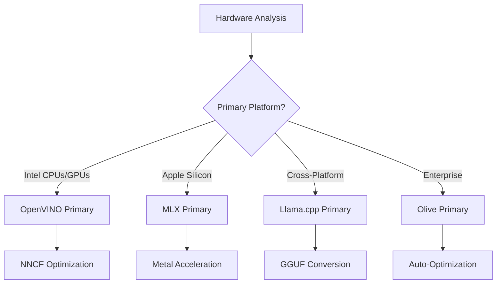
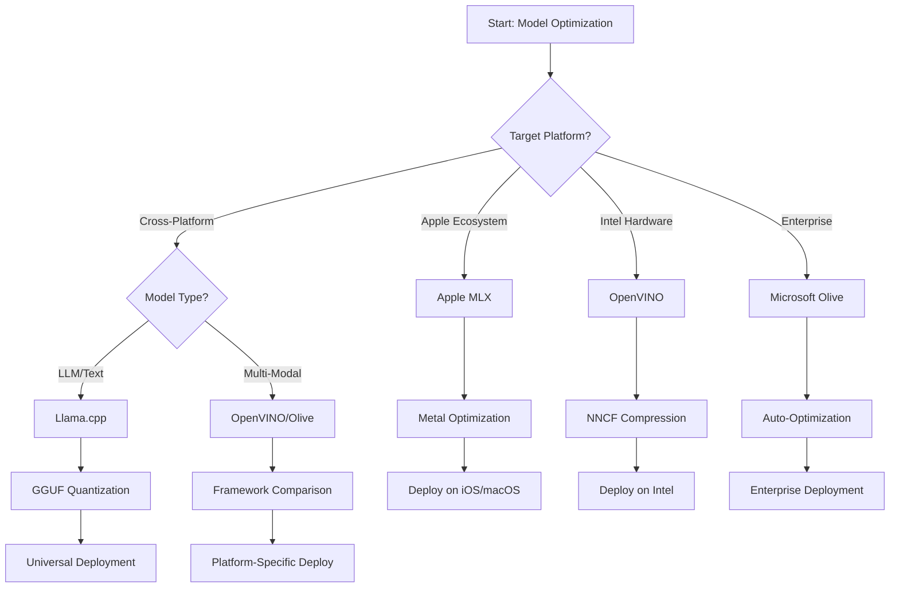
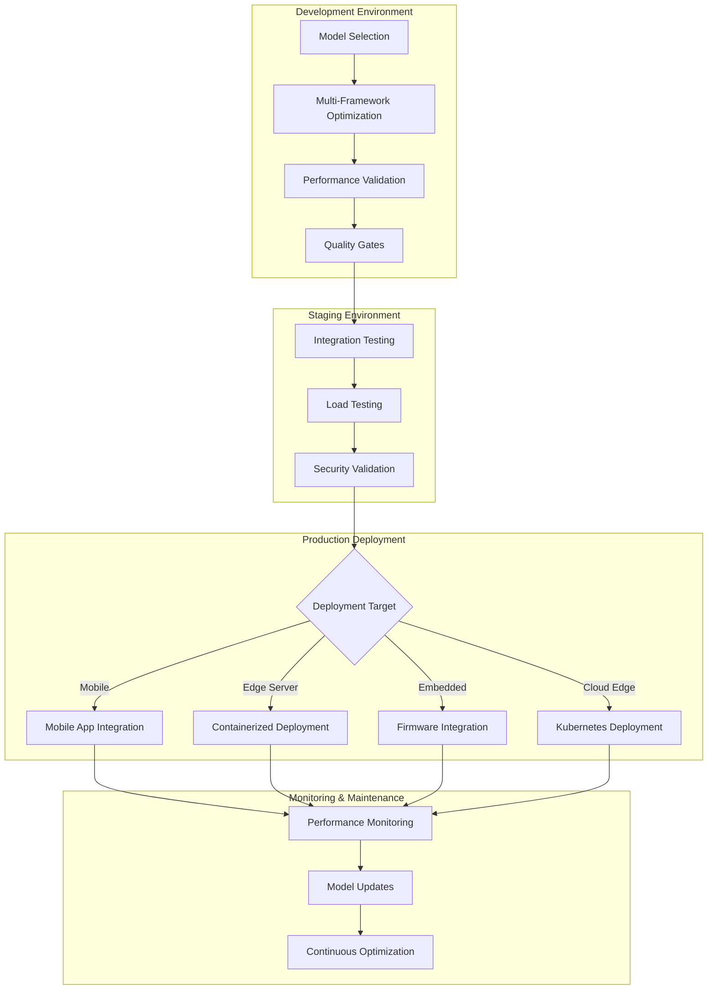

<!--
CO_OP_TRANSLATOR_METADATA:
{
  "original_hash": "6719c4a7e44b948230ac5f5cab3699bd",
  "translation_date": "2025-09-17T15:39:18+00:00",
  "source_file": "Module04/06.workflow-synthesis.md",
  "language_code": "hi"
}
-->
# अनुभाग 6: एज एआई विकास वर्कफ़्लो संश्लेषण

## सामग्री तालिका
1. [परिचय](../../../Module04)
2. [लक्ष्य](../../../Module04)
3. [एकीकृत वर्कफ़्लो अवलोकन](../../../Module04)
4. [फ्रेमवर्क चयन मैट्रिक्स](../../../Module04)
5. [सर्वोत्तम प्रथाओं का संश्लेषण](../../../Module04)
6. [डिप्लॉयमेंट रणनीति गाइड](../../../Module04)
7. [प्रदर्शन अनुकूलन वर्कफ़्लो](../../../Module04)
8. [उत्पादन तत्परता चेकलिस्ट](../../../Module04)
9. [समस्या समाधान और निगरानी](../../../Module04)
10. [आपके एज एआई पाइपलाइन का भविष्य सुनिश्चित करना](../../../Module04)

## परिचय

एज एआई विकास में कई अनुकूलन फ्रेमवर्क, डिप्लॉयमेंट रणनीतियों और हार्डवेयर विचारों की गहन समझ की आवश्यकता होती है। यह व्यापक संश्लेषण Llama.cpp, Microsoft Olive, OpenVINO, और Apple MLX से प्राप्त ज्ञान को एकीकृत वर्कफ़्लो में समेटता है, जो दक्षता को अधिकतम करता है, गुणवत्ता बनाए रखता है, और सफल उत्पादन डिप्लॉयमेंट सुनिश्चित करता है।

इस पाठ्यक्रम के दौरान, हमने व्यक्तिगत अनुकूलन फ्रेमवर्क का अध्ययन किया है, जिनमें से प्रत्येक की अपनी ताकत और विशेष उपयोग के मामले हैं। हालांकि, वास्तविक दुनिया के एज एआई प्रोजेक्ट्स अक्सर कई फ्रेमवर्क से तकनीकों को संयोजित करने या यह तय करने की आवश्यकता होती है कि विशिष्ट बाधाओं और आवश्यकताओं के लिए कौन सा दृष्टिकोण सर्वोत्तम परिणाम देगा।

यह अनुभाग सभी फ्रेमवर्क से सामूहिक ज्ञान को क्रियाशील वर्कफ़्लो, निर्णय पेड़ों, और सर्वोत्तम प्रथाओं में संश्लेषित करता है, जो आपको उत्पादन-तैयार एज एआई समाधान कुशलतापूर्वक और प्रभावी ढंग से बनाने में सक्षम बनाता है। चाहे आप मोबाइल उपकरणों, एम्बेडेड सिस्टम, या एज सर्वर के लिए अनुकूलन कर रहे हों, यह गाइड आपके विकास जीवनचक्र के दौरान सूचित निर्णय लेने के लिए रणनीतिक ढांचा प्रदान करता है।

## लक्ष्य

इस अनुभाग के अंत तक, आप सक्षम होंगे:

### रणनीतिक निर्णय लेना
- **मूल्यांकन और चयन करें**: प्रोजेक्ट आवश्यकताओं, हार्डवेयर बाधाओं, और डिप्लॉयमेंट परिदृश्यों के आधार पर इष्टतम अनुकूलन फ्रेमवर्क
- **व्यापक वर्कफ़्लो डिज़ाइन करें**: अधिकतम दक्षता के लिए कई अनुकूलन तकनीकों को एकीकृत करें
- **ट्रेड-ऑफ का आकलन करें**: मॉडल सटीकता, अनुमान गति, मेमोरी उपयोग, और विभिन्न फ्रेमवर्क के बीच डिप्लॉयमेंट जटिलता

### वर्कफ़्लो एकीकरण
- **एकीकृत विकास पाइपलाइन लागू करें**: जो कई अनुकूलन फ्रेमवर्क की ताकत का लाभ उठाती हैं
- **पुनरुत्पादनीय वर्कफ़्लो बनाएं**: विभिन्न वातावरणों में मॉडल अनुकूलन और डिप्लॉयमेंट के लिए
- **गुणवत्ता गेट्स और सत्यापन प्रक्रियाएं स्थापित करें**: सुनिश्चित करने के लिए कि अनुकूलित मॉडल उत्पादन आवश्यकताओं को पूरा करते हैं

### प्रदर्शन अनुकूलन
- **संगठित अनुकूलन रणनीतियां लागू करें**: क्वांटाइजेशन, प्रूनिंग, और हार्डवेयर-विशिष्ट त्वरण तकनीकों का उपयोग करके
- **मॉडल प्रदर्शन की निगरानी और बेंचमार्क करें**: विभिन्न अनुकूलन स्तरों और डिप्लॉयमेंट लक्ष्यों पर
- **विशिष्ट हार्डवेयर प्लेटफॉर्म के लिए अनुकूलित करें**: जैसे CPU, GPU, NPU, और विशेष एज एक्सेलेरेटर

### उत्पादन डिप्लॉयमेंट
- **स्केलेबल डिप्लॉयमेंट आर्किटेक्चर डिज़ाइन करें**: जो कई मॉडल प्रारूपों और अनुमान इंजन को समायोजित करता है
- **निगरानी और अवलोकन लागू करें**: उत्पादन वातावरण में एज एआई अनुप्रयोगों के लिए
- **रखरखाव वर्कफ़्लो स्थापित करें**: मॉडल अपडेट, प्रदर्शन निगरानी, और सिस्टम अनुकूलन के लिए

### क्रॉस-प्लेटफॉर्म उत्कृष्टता
- **अनुकूलित मॉडल डिप्लॉय करें**: विभिन्न हार्डवेयर प्लेटफॉर्म पर, जबकि प्रदर्शन में निरंतरता बनाए रखें
- **प्लेटफॉर्म-विशिष्ट अनुकूलन संभालें**: Windows, macOS, Linux, मोबाइल, और एम्बेडेड सिस्टम के लिए
- **एब्स्ट्रैक्शन लेयर बनाएं**: जो विभिन्न एज वातावरणों में सहज डिप्लॉयमेंट को सक्षम करती हैं

## एकीकृत वर्कफ़्लो अवलोकन

### चरण 1: आवश्यकताओं का विश्लेषण और फ्रेमवर्क चयन

सफल एज एआई डिप्लॉयमेंट की नींव गहन आवश्यकताओं के विश्लेषण से शुरू होती है, जो फ्रेमवर्क चयन और अनुकूलन रणनीति को सूचित करती है।

#### 1.1 हार्डवेयर मूल्यांकन


**मुख्य विचार:**
- **CPU आर्किटेक्चर**: x86, ARM, Apple Silicon क्षमताएं
- **एक्सेलेरेटर उपलब्धता**: GPU, NPU, VPU, विशेष AI चिप्स
- **मेमोरी बाधाएं**: RAM सीमाएं, स्टोरेज क्षमता
- **पावर बजट**: बैटरी जीवन, थर्मल बाधाएं
- **कनेक्टिविटी**: ऑफलाइन आवश्यकताएं, बैंडविड्थ सीमाएं

#### 1.2 एप्लिकेशन आवश्यकताओं का मैट्रिक्स

| आवश्यकता | Llama.cpp | Microsoft Olive | OpenVINO | Apple MLX |
|-----------|-----------|-----------------|----------|-----------|
| क्रॉस-प्लेटफॉर्म | ✅ उत्कृष्ट | ⚡ अच्छा | ⚡ अच्छा | ❌ केवल Apple |
| एंटरप्राइज़ इंटीग्रेशन | ⚡ बेसिक | ✅ उत्कृष्ट | ✅ उत्कृष्ट | ⚡ सीमित |
| मोबाइल डिप्लॉयमेंट | ✅ उत्कृष्ट | ⚡ अच्छा | ⚡ अच्छा | ✅ iOS उत्कृष्ट |
| रियल-टाइम अनुमान | ✅ उत्कृष्ट | ✅ उत्कृष्ट | ✅ उत्कृष्ट | ✅ उत्कृष्ट |
| मॉडल विविधता | ✅ LLM केंद्रित | ✅ सभी मॉडल | ✅ सभी मॉडल | ✅ LLM केंद्रित |
| उपयोग में आसानी | ✅ सरल | ✅ स्वचालित | ⚡ मध्यम | ✅ सरल |

### चरण 2: मॉडल तैयारी और अनुकूलन

#### 2.1 यूनिवर्सल मॉडल मूल्यांकन पाइपलाइन

```python
# Universal Model Assessment Framework
class EdgeAIModelAssessment:
    def __init__(self, model_path, target_hardware):
        self.model_path = model_path
        self.target_hardware = target_hardware
        self.optimization_frameworks = []
        
    def assess_model_characteristics(self):
        """Analyze model size, architecture, and complexity"""
        return {
            'model_size': self.get_model_size(),
            'parameter_count': self.get_parameter_count(),
            'architecture_type': self.detect_architecture(),
            'quantization_compatibility': self.check_quantization_support()
        }
    
    def recommend_optimization_strategy(self):
        """Recommend optimal frameworks and techniques"""
        characteristics = self.assess_model_characteristics()
        
        if self.target_hardware.startswith('apple'):
            return self.mlx_optimization_strategy(characteristics)
        elif self.target_hardware.startswith('intel'):
            return self.openvino_optimization_strategy(characteristics)
        elif characteristics['model_size'] > 7_000_000_000:  # 7B+ parameters
            return self.enterprise_optimization_strategy(characteristics)
        else:
            return self.lightweight_optimization_strategy(characteristics)
```

#### 2.2 मल्टी-फ्रेमवर्क अनुकूलन पाइपलाइन

**क्रमिक अनुकूलन दृष्टिकोण:**
1. **प्रारंभिक रूपांतरण**: मध्यवर्ती प्रारूप में रूपांतरण (जहां संभव हो ONNX)
2. **फ्रेमवर्क-विशिष्ट अनुकूलन**: विशेष तकनीकों को लागू करें
3. **क्रॉस-वैलिडेशन**: लक्ष्य प्लेटफॉर्म पर प्रदर्शन सत्यापित करें
4. **अंतिम पैकेजिंग**: डिप्लॉयमेंट के लिए तैयार करें

```bash
# Multi-Framework Optimization Script
#!/bin/bash

MODEL_NAME="phi-3-mini"
BASE_MODEL="microsoft/Phi-3-mini-4k-instruct"

# Phase 1: ONNX Conversion (Universal)
python convert_to_onnx.py --model $BASE_MODEL --output models/onnx/

# Phase 2: Platform-Specific Optimization
if [[ "$TARGET_PLATFORM" == "intel" ]]; then
    # OpenVINO Optimization
    python optimize_openvino.py --input models/onnx/ --output models/openvino/
elif [[ "$TARGET_PLATFORM" == "apple" ]]; then
    # MLX Optimization
    python optimize_mlx.py --input $BASE_MODEL --output models/mlx/
elif [[ "$TARGET_PLATFORM" == "cross" ]]; then
    # Llama.cpp Optimization
    python convert_to_gguf.py --input models/onnx/ --output models/gguf/
fi

# Phase 3: Validation
python validate_optimization.py --original $BASE_MODEL --optimized models/$TARGET_PLATFORM/
```

### चरण 3: प्रदर्शन सत्यापन और बेंचमार्किंग

#### 3.1 व्यापक बेंचमार्किंग फ्रेमवर्क

```python
class EdgeAIBenchmark:
    def __init__(self, optimized_models):
        self.models = optimized_models
        self.metrics = {
            'inference_time': [],
            'memory_usage': [],
            'accuracy_score': [],
            'throughput': [],
            'energy_consumption': []
        }
    
    def run_comprehensive_benchmark(self):
        """Execute standardized benchmarks across all optimized models"""
        test_inputs = self.generate_test_inputs()
        
        for model_framework, model_path in self.models.items():
            print(f"Benchmarking {model_framework}...")
            
            # Latency Testing
            latency = self.measure_inference_latency(model_path, test_inputs)
            
            # Memory Profiling
            memory = self.profile_memory_usage(model_path)
            
            # Accuracy Validation
            accuracy = self.validate_model_accuracy(model_path, test_inputs)
            
            # Throughput Analysis
            throughput = self.measure_throughput(model_path)
            
            self.record_metrics(model_framework, latency, memory, accuracy, throughput)
    
    def generate_optimization_report(self):
        """Create comprehensive comparison report"""
        report = {
            'recommendations': self.analyze_performance_trade_offs(),
            'deployment_guidance': self.generate_deployment_recommendations(),
            'monitoring_requirements': self.define_monitoring_metrics()
        }
        return report
```

## फ्रेमवर्क चयन मैट्रिक्स

### फ्रेमवर्क चयन के लिए निर्णय पेड़



### व्यापक चयन मानदंड

#### 1. प्राथमिक उपयोग केस संरेखण

**लार्ज लैंग्वेज मॉडल्स (LLMs):**
- **Llama.cpp**: CPU-केंद्रित, क्रॉस-प्लेटफॉर्म डिप्लॉयमेंट के लिए सर्वश्रेष्ठ
- **Apple MLX**: Apple Silicon के लिए आदर्श, यूनिफाइड मेमोरी के साथ
- **OpenVINO**: Intel हार्डवेयर के लिए उत्कृष्ट, NNCF अनुकूलन के साथ
- **Microsoft Olive**: एंटरप्राइज़ वर्कफ़्लो के लिए आदर्श, स्वचालन के साथ

**मल्टी-मोडल मॉडल्स:**
- **OpenVINO**: विज़न, ऑडियो, और टेक्स्ट के लिए व्यापक समर्थन
- **Microsoft Olive**: जटिल पाइपलाइनों के लिए एंटरप्राइज़-ग्रेड अनुकूलन
- **Llama.cpp**: केवल टेक्स्ट-आधारित मॉडल तक सीमित
- **Apple MLX**: मल्टी-मोडल एप्लिकेशन के लिए बढ़ता समर्थन

#### 2. हार्डवेयर प्लेटफॉर्म मैट्रिक्स

| प्लेटफॉर्म | प्राथमिक फ्रेमवर्क | द्वितीयक विकल्प | विशेष सुविधाएं |
|----------|------------------|------------------|---------------------|
| Intel CPU/GPU | OpenVINO | Microsoft Olive | NNCF संपीड़न, Intel अनुकूलन |
| NVIDIA GPU | Microsoft Olive | OpenVINO | CUDA त्वरण, एंटरप्राइज़ सुविधाएं |
| Apple Silicon | Apple MLX | Llama.cpp | मेटल शेडर्स, यूनिफाइड मेमोरी |
| ARM मोबाइल | Llama.cpp | OpenVINO | क्रॉस-प्लेटफॉर्म, न्यूनतम निर्भरताएं |
| Edge TPU | OpenVINO | Microsoft Olive | विशेष एक्सेलेरेटर समर्थन |
| एम्बेडेड ARM | Llama.cpp | OpenVINO | न्यूनतम फुटप्रिंट, कुशल अनुमान |

#### 3. विकास वर्कफ़्लो प्राथमिकताएं

**त्वरित प्रोटोटाइपिंग:**
1. **Llama.cpp**: सबसे तेज़ सेटअप, त्वरित परिणाम
2. **Apple MLX**: सरल Python API, तेज़ पुनरावृत्ति
3. **Microsoft Olive**: स्वचालित अनुकूलन, न्यूनतम कॉन्फ़िगरेशन
4. **OpenVINO**: अधिक जटिल सेटअप, व्यापक सुविधाएं

**एंटरप्राइज़ उत्पादन:**
1. **Microsoft Olive**: एंटरप्राइज़ सुविधाएं, Azure इंटीग्रेशन
2. **OpenVINO**: Intel इकोसिस्टम, व्यापक उपकरण
3. **Apple MLX**: Apple-विशिष्ट एंटरप्राइज़ एप्लिकेशन
4. **Llama.cpp**: सरल डिप्लॉयमेंट, सीमित एंटरप्राइज़ सुविधाएं

## सर्वोत्तम प्रथाओं का संश्लेषण

### सार्वभौमिक अनुकूलन सिद्धांत

#### 1. प्रगतिशील अनुकूलन रणनीति

```python
class ProgressiveOptimization:
    def __init__(self, base_model):
        self.base_model = base_model
        self.optimization_stages = [
            'baseline_measurement',
            'format_conversion',
            'quantization_optimization',
            'hardware_acceleration',
            'production_validation'
        ]
    
    def execute_progressive_optimization(self):
        """Apply optimization techniques incrementally"""
        
        # Stage 1: Baseline Measurement
        baseline_metrics = self.measure_baseline_performance()
        
        # Stage 2: Format Conversion
        converted_model = self.convert_to_optimal_format()
        conversion_metrics = self.measure_performance(converted_model)
        
        # Stage 3: Quantization
        quantized_model = self.apply_quantization(converted_model)
        quantization_metrics = self.measure_performance(quantized_model)
        
        # Stage 4: Hardware Acceleration
        accelerated_model = self.enable_hardware_acceleration(quantized_model)
        acceleration_metrics = self.measure_performance(accelerated_model)
        
        # Stage 5: Validation
        production_ready = self.validate_for_production(accelerated_model)
        
        return self.compile_optimization_report(
            baseline_metrics, conversion_metrics, 
            quantization_metrics, acceleration_metrics
        )
```

#### 2. गुणवत्ता गेट कार्यान्वयन

**सटीकता संरक्षण गेट्स:**
- मूल मॉडल सटीकता का >95% बनाए रखें
- प्रतिनिधि परीक्षण डेटासेट के खिलाफ सत्यापन करें
- उत्पादन सत्यापन के लिए A/B परीक्षण लागू करें

**प्रदर्शन सुधार गेट्स:**
- न्यूनतम 2x गति सुधार प्राप्त करें
- मेमोरी फुटप्रिंट को कम से कम 50% तक घटाएं
- अनुमान समय स्थिरता सत्यापित करें

**उत्पादन तत्परता गेट्स:**
- लोड के तहत तनाव परीक्षण पास करें
- समय के साथ स्थिर प्रदर्शन प्रदर्शित करें
- सुरक्षा और गोपनीयता आवश्यकताओं को सत्यापित करें

### फ्रेमवर्क-विशिष्ट सर्वोत्तम प्रथाओं का एकीकरण

#### 1. क्वांटाइजेशन रणनीति संश्लेषण

```python
# Unified Quantization Approach
class UnifiedQuantizationStrategy:
    def __init__(self, model, target_platform):
        self.model = model
        self.platform = target_platform
        
    def select_optimal_quantization(self):
        """Choose best quantization based on platform and requirements"""
        
        if self.platform == 'apple_silicon':
            return self.mlx_quantization_strategy()
        elif self.platform == 'intel_hardware':
            return self.openvino_quantization_strategy()
        elif self.platform == 'cross_platform':
            return self.llamacpp_quantization_strategy()
        else:
            return self.olive_quantization_strategy()
    
    def mlx_quantization_strategy(self):
        """Apple MLX-specific quantization"""
        return {
            'method': 'mlx_quantize',
            'precision': 'int4',
            'group_size': 64,
            'optimization_target': 'unified_memory'
        }
    
    def openvino_quantization_strategy(self):
        """OpenVINO NNCF quantization"""
        return {
            'method': 'nncf_quantize',
            'precision': 'int8',
            'calibration_method': 'post_training',
            'optimization_target': 'intel_hardware'
        }
```

#### 2. हार्डवेयर त्वरण अनुकूलन

**CPU अनुकूलन संश्लेषण:**
- **SIMD निर्देश**: फ्रेमवर्क में अनुकूलित कर्नेल का लाभ उठाएं
- **मेमोरी बैंडविड्थ**: कैश दक्षता के लिए डेटा लेआउट अनुकूलित करें
- **थ्रेडिंग**: संसाधन बाधाओं के साथ समानांतरता संतुलित करें

**GPU त्वरण सर्वोत्तम प्रथाएं:**
- **बैच प्रोसेसिंग**: उपयुक्त बैच आकारों के साथ थ्रूपुट को अधिकतम करें
- **मेमोरी प्रबंधन**: GPU मेमोरी आवंटन और स्थानांतरण को अनुकूलित करें
- **सटीकता**: बेहतर प्रदर्शन के लिए FP16 का उपयोग करें (जहां समर्थित हो)

**NPU/विशेष एक्सेलेरेटर अनुकूलन:**
- **मॉडल आर्किटेक्चर**: एक्सेलेरेटर क्षमताओं के साथ संगतता सुनिश्चित करें
- **डेटा प्रवाह**: एक्सेलेरेटर दक्षता के लिए इनपुट/आउटपुट पाइपलाइनों को अनुकूलित करें
- **फॉलबैक रणनीतियां**: असमर्थित संचालन के लिए CPU फॉलबैक लागू करें

## डिप्लॉयमेंट रणनीति गाइड

### सार्वभौमिक डिप्लॉयमेंट आर्किटेक्चर



### प्लेटफॉर्म-विशिष्ट डिप्लॉयमेंट पैटर्न

#### 1. मोबाइल डिप्लॉयमेंट रणनीति

```yaml
# Mobile Deployment Configuration
mobile_deployment:
  ios:
    framework: apple_mlx
    optimization:
      quantization: int4
      memory_mapping: true
      background_execution: limited
    packaging:
      format: mlx
      bundle_size: <50MB
      
  android:
    framework: llama_cpp
    optimization:
      quantization: q4_k_m
      threading: android_optimized
      memory_management: conservative
    packaging:
      format: gguf
      apk_size: <100MB
      
  cross_platform:
    framework: onnx_runtime
    optimization:
      quantization: int8
      execution_provider: cpu
    packaging:
      format: onnx
      shared_libraries: minimal
```

#### 2. एज सर्वर डिप्लॉयमेंट

```yaml
# Edge Server Deployment Configuration
edge_server:
  intel_based:
    framework: openvino
    optimization:
      quantization: int8
      acceleration: cpu_gpu_auto
      batch_processing: dynamic
    deployment:
      container: openvino_runtime
      orchestration: kubernetes
      scaling: horizontal
      
  nvidia_based:
    framework: microsoft_olive
    optimization:
      quantization: int4
      acceleration: cuda
      tensor_parallelism: true
    deployment:
      container: nvidia_triton
      orchestration: kubernetes
      scaling: gpu_aware
```

### कंटेनरीकरण सर्वोत्तम प्रथाएं

```dockerfile
# Multi-Framework Edge AI Container
FROM ubuntu:22.04 as base

# Install common dependencies
RUN apt-get update && apt-get install -y \
    python3 \
    python3-pip \
    build-essential \
    cmake \
    && rm -rf /var/lib/apt/lists/*

# Framework-specific stages
FROM base as openvino
RUN pip install openvino nncf optimum[intel]

FROM base as llamacpp
RUN git clone https://github.com/ggerganov/llama.cpp.git \
    && cd llama.cpp && make LLAMA_OPENBLAS=1

FROM base as olive
RUN pip install olive-ai[auto-opt] onnxruntime-genai

# Production stage with selected framework
FROM openvino as production
COPY models/ /app/models/
COPY src/ /app/src/
WORKDIR /app

EXPOSE 8080
CMD ["python3", "src/inference_server.py"]
```

## प्रदर्शन अनुकूलन वर्कफ़्लो

### व्यवस्थित प्रदर्शन ट्यूनिंग

#### 1. प्रदर्शन प्रोफाइलिंग पाइपलाइन

```python
class EdgeAIPerformanceProfiler:
    def __init__(self, model_path, framework):
        self.model_path = model_path
        self.framework = framework
        self.profiling_results = {}
    
    def comprehensive_profiling(self):
        """Execute comprehensive performance analysis"""
        
        # CPU Profiling
        cpu_profile = self.profile_cpu_usage()
        
        # Memory Profiling
        memory_profile = self.profile_memory_usage()
        
        # Inference Latency
        latency_profile = self.profile_inference_latency()
        
        # Throughput Analysis
        throughput_profile = self.profile_throughput()
        
        # Energy Consumption (where available)
        energy_profile = self.profile_energy_consumption()
        
        return self.compile_performance_report(
            cpu_profile, memory_profile, latency_profile,
            throughput_profile, energy_profile
        )
    
    def identify_bottlenecks(self):
        """Automatically identify performance bottlenecks"""
        bottlenecks = []
        
        if self.profiling_results['cpu_utilization'] > 80:
            bottlenecks.append('cpu_bound')
        
        if self.profiling_results['memory_usage'] > 90:
            bottlenecks.append('memory_bound')
        
        if self.profiling_results['inference_variance'] > 20:
            bottlenecks.append('inconsistent_performance')
        
        return self.generate_optimization_recommendations(bottlenecks)
```

#### 2. स्वचालित अनुकूलन पाइपलाइन

```python
class AutomatedOptimizationPipeline:
    def __init__(self, base_model, target_constraints):
        self.base_model = base_model
        self.constraints = target_constraints
        self.optimization_history = []
    
    def execute_optimization_search(self):
        """Systematically search optimization space"""
        
        optimization_candidates = [
            {'quantization': 'int8', 'pruning': 0.1},
            {'quantization': 'int4', 'pruning': 0.2},
            {'quantization': 'int8', 'acceleration': 'gpu'},
            {'quantization': 'int4', 'acceleration': 'npu'}
        ]
        
        best_configuration = None
        best_score = 0
        
        for config in optimization_candidates:
            optimized_model = self.apply_optimization(config)
            score = self.evaluate_optimization(optimized_model)
            
            if score > best_score and self.meets_constraints(optimized_model):
                best_score = score
                best_configuration = config
            
            self.optimization_history.append({
                'config': config,
                'score': score,
                'model': optimized_model
            })
        
        return best_configuration, self.optimization_history
```

### बहु-उद्देश्यीय अनुकूलन

#### 1. एज एआई के लिए पेरेटो अनुकूलन

```python
class ParetoOptimization:
    def __init__(self, objectives=['speed', 'accuracy', 'memory']):
        self.objectives = objectives
        self.pareto_frontier = []
    
    def find_pareto_optimal_solutions(self, optimization_results):
        """Identify Pareto-optimal configurations"""
        
        for result in optimization_results:
            is_dominated = False
            
            for frontier_point in self.pareto_frontier:
                if self.dominates(frontier_point, result):
                    is_dominated = True
                    break
            
            if not is_dominated:
                # Remove dominated points from frontier
                self.pareto_frontier = [
                    point for point in self.pareto_frontier 
                    if not self.dominates(result, point)
                ]
                
                self.pareto_frontier.append(result)
        
        return self.pareto_frontier
    
    def recommend_configuration(self, user_preferences):
        """Recommend configuration based on user preferences"""
        
        weighted_scores = []
        for config in self.pareto_frontier:
            score = sum(
                user_preferences[obj] * config['metrics'][obj] 
                for obj in self.objectives
            )
            weighted_scores.append((score, config))
        
        return max(weighted_scores, key=lambda x: x[0])[1]
```

## उत्पादन तत्परता चेकलिस्ट

### व्यापक उत्पादन सत्यापन

#### 1. मॉडल गुणवत्ता आश्वासन

```python
class ProductionReadinessValidator:
    def __init__(self, optimized_model, production_requirements):
        self.model = optimized_model
        self.requirements = production_requirements
        self.validation_results = {}
    
    def validate_model_quality(self):
        """Comprehensive model quality validation"""
        
        # Accuracy Validation
        accuracy_result = self.validate_accuracy()
        
        # Performance Validation
        performance_result = self.validate_performance()
        
        # Robustness Testing
        robustness_result = self.validate_robustness()
        
        # Security Assessment
        security_result = self.validate_security()
        
        # Compliance Verification
        compliance_result = self.validate_compliance()
        
        return self.compile_validation_report(
            accuracy_result, performance_result, robustness_result,
            security_result, compliance_result
        )
    
    def generate_certification_report(self):
        """Generate production certification report"""
        return {
            'model_signature': self.generate_model_signature(),
            'validation_timestamp': datetime.now(),
            'validation_results': self.validation_results,
            'deployment_approval': self.check_deployment_approval(),
            'monitoring_requirements': self.define_monitoring_requirements()
        }
```

#### 2. उत्पादन डिप्लॉयमेंट चेकलिस्ट

**पूर्व-डिप्लॉयमेंट सत्यापन:**
- [ ] मॉडल सटीकता न्यूनतम आवश्यकताओं को पूरा करती है (>95% बेसलाइन)
- [ ] प्रदर्शन लक्ष्य प्राप्त किए गए (लेटेंसी, थ्रूपुट, मेमोरी)
- [ ] सुरक्षा कमजोरियों का आकलन और समाधान किया गया
- [ ] अपेक्षित लोड के तहत तनाव परीक्षण पूरा हुआ
- [ ] विफलता परिदृश्यों का परीक्षण और रिकवरी प्रक्रियाओं का सत्यापन किया गया
- [ ] निगरानी और अलर्टिंग सिस्टम कॉन्फ़िगर किए गए
- [ ] रोलबैक प्रक्रियाओं का परीक्षण और दस्तावेज़ीकरण किया गया

**डिप्लॉयमेंट प्रक्रिया:**
- [ ] ब्लू-ग्रीन डिप्लॉयमेंट रणनीति लागू की गई
- [ ] धीरे-धीरे ट्रैफिक रैंपिंग कॉन्फ़िगर की गई
- [ ] रीयल-टाइम निगरानी डैशबोर्ड सक्रिय
- [ ] प्रदर्शन बेसलाइन स्थापित किए गए
- [ ] त्रुटि दर सीमा परिभाषित की गई
- [ ] स्वचालित रोलबैक ट्रिगर कॉन्फ़िगर किए गए

**पोस्ट-डिप्लॉयमेंट निगरानी:**
- [ ] मॉडल ड्रिफ्ट डिटेक्शन सक्रिय
- [ ] प्रदर्शन गिरावट अलर्ट कॉन्फ़िगर किए गए
- [ ] संसाधन उपयोग निगरानी सक्षम
- [ ] उपयोगकर्ता अनुभव मेट्रिक्स ट्रैक किए गए
- [ ] मॉडल संस्करण और वंशावली बनाए रखी गई
- [ ] नियमित मॉडल प्रदर्शन समीक्षा निर्धारित की गई

### निरंतर एकीकरण/निरंतर डिप्लॉयमेंट (CI/CD)

```yaml
# Edge AI CI/CD Pipeline Configuration
edge_ai_pipeline:
  stages:
    - model_validation
    - optimization
    - testing
    - staging_deployment
    - production_deployment
    - monitoring
  
  model_validation:
    accuracy_threshold: 0.95
    performance_baseline: required
    security_scan: enabled
    
  optimization:
    frameworks:
      - llama_cpp
      - openvino
      - microsoft_olive
    validation:
      cross_validation: enabled
      performance_comparison: required
      
  testing:
    unit_tests: comprehensive
    integration_tests: full_pipeline
    load_tests: production_scale
    security_tests: comprehensive
    
  deployment:
    strategy: blue_green
    traffic_ramping: gradual
    rollback: automatic
    monitoring: real_time
```

## समस्या समाधान और निगरानी

### सार्वभौमिक समस्या समाधान फ्रेमवर्क

#### 1. सामान्य समस्याएं और समाधान

**प्रदर्शन समस्याएं:**
```python
class PerformanceTroubleshooter:
    def __init__(self, model_metrics):
        self.metrics = model_metrics
        
    def diagnose_performance_issues(self):
        """Systematic performance issue diagnosis"""
        
        issues = []
        
        # High latency diagnosis
        if self.metrics['avg_latency'] > self.metrics['target_latency']:
            issues.append(self.diagnose_latency_issues())
        
        # Memory usage diagnosis
        if self.metrics['memory_usage'] > self.metrics['memory_limit']:
            issues.append(self.diagnose_memory_issues())
        
        # Throughput diagnosis
        if self.metrics['throughput'] < self.metrics['target_throughput']:
            issues.append(self.diagnose_throughput_issues())
        
        return self.generate_resolution_plan(issues)
    
    def diagnose_latency_issues(self):
        """Specific latency troubleshooting"""
        potential_causes = []
        
        if self.metrics['cpu_utilization'] > 80:
            potential_causes.append('cpu_bottleneck')
        
        if self.metrics['memory_bandwidth'] > 90:
            potential_causes.append('memory_bandwidth_limit')
        
        if self.metrics['model_size'] > self.metrics['optimal_size']:
            potential_causes.append('model_too_large')
        
        return {
            'issue': 'high_latency',
            'causes': potential_causes,
            'solutions': self.generate_latency_solutions(potential_causes)
        }
```

**फ्रेमवर्क-विशिष्ट समस्या समाधान:**

| समस्या | Llama.cpp | Microsoft Olive | OpenVINO | Apple MLX |
|-------|-----------|-----------------|----------|-----------|
| मेमोरी समस्याएं | संदर्भ लंबाई कम करें | बैच आकार घटाएं | कैशिंग सक्षम करें | मेमोरी मैपिंग का उपयोग करें |
| धीमा अनुमान | SIMD सक्षम करें | क्वांटाइजेशन जांचें | थ्रेडिंग अनुकूलित करें | मेटल सक्षम करें |
| सटीकता हानि | उच्च क्वांटाइजेशन | QAT के साथ पुन: प्रशिक्षण | कैलिब्रेशन बढ़ाएं | पोस्ट-क्वांट फाइन-ट्यून |
| संगतता | मॉडल प्रारूप जांचें | फ्रेमवर्क संस्करण सत्यापित करें | ड्राइवर अपडेट करें | macOS संस्करण जांचें |

#### 2. उत्पादन निगरानी रणनीति

```python
class EdgeAIMonitoring:
    def __init__(self, deployment_config):
        self.config = deployment_config
        self.metrics_collectors = []
        self.alerting_rules = []
    
    def setup_comprehensive_monitoring(self):
        """Configure comprehensive monitoring for Edge AI deployment"""
        
        # Model Performance Monitoring
        self.setup_model_performance_monitoring()
        
        # Infrastructure Monitoring
        self.setup_infrastructure_monitoring()
        
        # Business Metrics Monitoring
        self.setup_business_metrics_monitoring()
        
        # Security Monitoring
        self.setup_security_monitoring()
    
    def setup_model_performance_monitoring(self):
        """Model-specific performance monitoring"""
        metrics = [
            'inference_latency_p50',
            'inference_latency_p95',
            'inference_latency_p99',
            'model_accuracy_drift',
            'prediction_confidence_distribution',
            'error_rate',
            'throughput_requests_per_second'
        ]
        
        for metric in metrics:
            self.add_metric_collector(metric)
            self.add_alerting_rule(metric)
    
    def detect_model_drift(self):
        """Automated model drift detection"""
        drift_indicators = [
            self.statistical_drift_detection(),
            self.performance_drift_detection(),
            self.data_distribution_shift_detection()
        ]
        
        return self.aggregate_drift_signals(drift_indicators)
```

### स्वचालित समस्या समाधान

```python
class AutomatedIssueResolution:
    def __init__(self, monitoring_system):
        self.monitoring = monitoring_system
        self.resolution_strategies = {}
    
    def handle_performance_degradation(self, alert):
        """Automated performance issue resolution"""
        
        if alert['type'] == 'high_latency':
            return self.resolve_latency_issue(alert)
        elif alert['type'] == 'high_memory_usage':
            return self.resolve_memory_issue(alert)
        elif alert['type'] == 'accuracy_drift':
            return self.resolve_accuracy_issue(alert)
        
    def resolve_latency_issue(self, alert):
        """Automated latency issue resolution"""
        resolution_steps = [
            'increase_cpu_allocation',
            'enable_model_caching',
            'reduce_batch_size',
            'switch_to_quantized_model'
        ]
        
        for step in resolution_steps:
            if self.apply_resolution_step(step):
                return f"Resolved latency issue with: {step}"
        
        return "Escalating to human operator"
```

## आपके एज एआई पाइपलाइन का भविष्य सुनिश्चित करना

### उभरती प्रौद्योगिकियों का एकीकरण

#### 1. अगली पीढ़ी के हार्डवेयर समर्थन

```python
class FutureHardwareIntegration:
    def __init__(self):
        self.supported_accelerators = [
            'npu_next_gen',
            'quantum_processors',
            'neuromorphic_chips',
            'optical_processors'
        ]
    
    def design_adaptive_pipeline(self):
        """Create hardware-agnostic optimization pipeline"""
        
        pipeline = {
            'model_preparation': self.universal_model_preparation(),
            'hardware_detection': self.dynamic_hardware_detection(),
            'optimization_selection': self.adaptive_optimization_selection(),
            'performance_validation': self.hardware_agnostic_validation()
        }
        
        return pipeline
    
    def adaptive_optimization_selection(self):
        """Dynamically select optimization based on available hardware"""
        
        def optimize_for_hardware(model, available_hardware):
            if 'npu' in available_hardware:
                return self.npu_optimization(model)
            elif 'quantum' in available_hardware:
                return self.quantum_optimization(model)
            elif 'neuromorphic' in available_hardware:
                return self.neuromorphic_optimization(model)
            else:
                return self.fallback_optimization(model)
        
        return optimize_for_hardware
```

#### 2. मॉडल आर्किटेक्चर का विकास

**उभरते आर्किटेक्चर के लिए समर्थन:**
- **मिश्रण विशेषज्ञ (MoE)**: दक्षता के लिए स्पार्स मॉडल आर्किटेक्चर
- **रिट्रीवल-ऑगमेंटेड जनरेशन**: हाइब्रिड मॉडल + ज्ञान आधार प्रणाली
- **मल्टीमोडल मॉडल्स**: विज़न + भाषा + ऑडियो एकीकरण
- **फेडरेटेड लर्निंग**: वितरित प्रशिक्षण और अनुकूलन

```python
class NextGenModelSupport:
    def __init__(self):
        self.architecture_handlers = {
            'moe': self.handle_mixture_of_experts,
            'rag': self.handle_retrieval_augmented,
            'multimodal': self.handle_multimodal,
            'federated': self.handle_federated_learning
        }
    
    def handle_mixture_of_experts(self, model):
        """Optimize Mixture of Experts models for edge deployment"""
        optimization_strategy = {
            'expert_pruning': True,
            'routing_optimization': True,
            'expert_quantization': 'per_expert',
            'load_balancing': 'dynamic'
        }
        return self.apply_moe_optimization(model, optimization_strategy)
```

### निरंतर सीखना और अनुकूलन

#### 1. ऑनलाइन लर्निंग का एकीकरण

```python
class EdgeOnlineLearning:
    def __init__(self, base_model, learning_rate=0.001):
        self.base_model = base_model
        self.learning_rate = learning_rate
        self.adaptation_buffer = []
    
    def continuous_adaptation(self, new_data, feedback):
        """Continuously adapt model based on edge data"""
        
        # Privacy-preserving local adaptation
        local_updates = self.compute_local_gradients(new_data, feedback)
        
        # Apply updates with constraints
        adapted_model = self.apply_constrained_updates(
            self.base_model, local_updates
        )
        
        # Validate adaptation quality
        if self.validate_adaptation(adapted_model):
            self.base_model = adapted_model
            return True
        
        return False
    
    def federated_learning_participation(self):
        """Participate in federated learning while preserving privacy"""
        
        # Compute local model updates
        local_updates = self.compute_private_updates()
        
        # Differential privacy protection
        private_updates = self.apply_differential_privacy(local_updates)
        
        # Share with federated learning coordinator
        return self.share_updates(private_updates)
```

#### 2. स्थिरता और ग्रीन एआई

```python
class GreenEdgeAI:
    def __init__(self, sustainability_targets):
        self.targets = sustainability_targets
        self.energy_monitor = EnergyMonitor()
    
    def optimize_for_sustainability(self, model):
        """Optimize model for minimal environmental impact"""
        
        optimization_objectives = [
            'minimize_energy_consumption',
            'maximize_hardware_utilization',
            'reduce_model_training_cost',
            'extend_device_lifetime'
        ]
        
        return self.multi_objective_green_optimization(
            model, optimization_objectives
        )
    
    def carbon_aware_deployment(self):
        """Deploy models considering carbon footprint"""
        
        deployment_strategy = {
            'prefer_renewable_energy_regions': True,
            'optimize_for_energy_efficiency': True,
            'minimize_data_transfer': True,
            'lifecycle_carbon_accounting': True
        }
        
        return deployment_strategy
```

## निष्कर्ष

यह व्यापक वर्कफ़्लो संश्लेषण एज एआई अनुकूल
याद रखें कि सबसे अच्छी अनुकूलन रणनीति वह होती है जो आपके विशेष आवश्यकताओं को पूरा करती है और साथ ही उन आवश्यकताओं के बदलने पर अनुकूल होने की क्षमता बनाए रखती है। इस गाइड का उपयोग सूचित निर्णय लेने के लिए एक ढांचे के रूप में करें, लेकिन हमेशा अपने विकल्पों को अनुभवजन्य परीक्षण और वास्तविक दुनिया के तैनाती अनुभव के माध्यम से मान्य करें।

## ➡️ आगे क्या करें

अपने Edge AI यात्रा को जारी रखें और [Module 5: SLMOps and Production Deployment](../Module05/README.md) का अन्वेषण करें, जहां छोटे भाषा मॉडल जीवनचक्र प्रबंधन के परिचालन पहलुओं के बारे में जानें।

---

**अस्वीकरण**:  
यह दस्तावेज़ AI अनुवाद सेवा [Co-op Translator](https://github.com/Azure/co-op-translator) का उपयोग करके अनुवादित किया गया है। जबकि हम सटीकता सुनिश्चित करने का प्रयास करते हैं, कृपया ध्यान दें कि स्वचालित अनुवाद में त्रुटियां या अशुद्धियां हो सकती हैं। मूल भाषा में उपलब्ध मूल दस्तावेज़ को प्रामाणिक स्रोत माना जाना चाहिए। महत्वपूर्ण जानकारी के लिए, पेशेवर मानव अनुवाद की सिफारिश की जाती है। इस अनुवाद के उपयोग से उत्पन्न किसी भी गलतफहमी या गलत व्याख्या के लिए हम उत्तरदायी नहीं हैं।