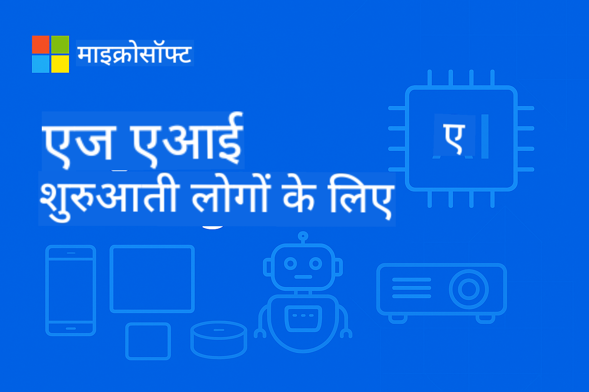

<!--
CO_OP_TRANSLATOR_METADATA:
{
  "original_hash": "cd9cb76aab17c30bfb19ef73060c5fb0",
  "translation_date": "2025-10-11T10:26:36+00:00",
  "source_file": "README.md",
  "language_code": "hi"
}
-->
# शुरुआती लोगों के लिए EdgeAI



[](https://GitHub.com/microsoft/edgeai-for-beginners/graphs/contributors)
[](https://GitHub.com/microsoft/edgeai-for-beginners/issues)
[](https://GitHub.com/microsoft/edgeai-for-beginners/pulls)
[](http://makeapullrequest.com)

[](https://GitHub.com/microsoft/edgeai-for-beginners/watchers)
[](https://GitHub.com/microsoft/edgeai-for-beginners/fork)
[](https://GitHub.com/microsoft/edgeai-for-beginners/stargazers)

[](https://discord.com/invite/ByRwuEEgH4)

इन संसाधनों का उपयोग शुरू करने के लिए निम्नलिखित चरणों का पालन करें:

1. **रेपो को फोर्क करें**: क्लिक करें [](https://GitHub.com/microsoft/edgeai-for-beginners/fork)
2. **रेपो को क्लोन करें**: `git clone https://github.com/microsoft/edgeai-for-beginners.git`
3. [**Azure AI Foundry Discord से जुड़ें और विशेषज्ञों व अन्य डेवलपर्स से मिलें**](https://discord.com/invite/ByRwuEEgH4)

### 🌐 बहुभाषी समर्थन

#### GitHub Action के माध्यम से समर्थित (स्वचालित और हमेशा अपडेटेड)

<!-- CO-OP TRANSLATOR LANGUAGES TABLE START -->
[अरबी](../ar/README.md) | [बंगाली](../bn/README.md) | [बुल्गेरियन](../bg/README.md) | [बर्मी (म्यांमार)](../my/README.md) | [चीनी (सरलीकृत)](../zh/README.md) | [चीनी (पारंपरिक, हांगकांग)](../hk/README.md) | [चीनी (पारंपरिक, मकाऊ)](../mo/README.md) | [चीनी (पारंपरिक, ताइवान)](../tw/README.md) | [क्रोएशियन](../hr/README.md) | [चेक](../cs/README.md) | [डेनिश](../da/README.md) | [डच](../nl/README.md) | [एस्टोनियन](../et/README.md) | [फिनिश](../fi/README.md) | [फ्रेंच](../fr/README.md) | [जर्मन](../de/README.md) | [ग्रीक](../el/README.md) | [हिब्रू](../he/README.md) | [हिंदी](./README.md) | [हंगेरियन](../hu/README.md) | [इंडोनेशियन](../id/README.md) | [इतालवी](../it/README.md) | [जापानी](../ja/README.md) | [कोरियाई](../ko/README.md) | [लिथुआनियन](../lt/README.md) | [मलय](../ms/README.md) | [मराठी](../mr/README.md) | [नेपाली](../ne/README.md) | [नॉर्वेजियन](../no/README.md) | [फारसी (फारसी)](../fa/README.md) | [पोलिश](../pl/README.md) | [पुर्तगाली (ब्राजील)](../br/README.md) | [पुर्तगाली (पुर्तगाल)](../pt/README.md) | [पंजाबी (गुरमुखी)](../pa/README.md) | [रोमानियन](../ro/README.md) | [रूसी](../ru/README.md) | [सर्बियन (सिरिलिक)](../sr/README.md) | [स्लोवाक](../sk/README.md) | [स्लोवेनियन](../sl/README.md) | [स्पेनिश](../es/README.md) | [स्वाहिली](../sw/README.md) | [स्वीडिश](../sv/README.md) | [टैगालोग (फिलिपिनो)](../tl/README.md) | [तमिल](../ta/README.md) | [थाई](../th/README.md) | [तुर्की](../tr/README.md) | [यूक्रेनी](../uk/README.md) | [उर्दू](../ur/README.md) | [वियतनामी](../vi/README.md)
<!-- CO-OP TRANSLATOR LANGUAGES TABLE END -->

**यदि आप अतिरिक्त भाषाओं में अनुवाद चाहते हैं, तो समर्थित भाषाओं की सूची [यहां](https://github.com/Azure/co-op-translator/blob/main/getting_started/supported-languages.md) उपलब्ध है।**

## परिचय

**EdgeAI for Beginners** में आपका स्वागत है – यह कोर्स आपको Edge Artificial Intelligence की दुनिया में ले जाता है। यह कोर्स AI की शक्तिशाली क्षमताओं और वास्तविक दुनिया में इसे edge डिवाइस पर लागू करने के बीच की खाई को पाटता है, जिससे आप AI की क्षमता को वहीं उपयोग कर सकते हैं जहां डेटा उत्पन्न होता है और निर्णय लेने की आवश्यकता होती है।

### आप क्या सीखेंगे

यह कोर्स आपको मूलभूत अवधारणाओं से लेकर उत्पादन-तैयार कार्यान्वयन तक ले जाता है, जिसमें शामिल हैं:
- **छोटे भाषा मॉडल (SLMs)** जो edge पर तैनाती के लिए अनुकूलित हैं
- **हार्डवेयर-अनुकूलन** विभिन्न प्लेटफार्मों पर
- **रियल-टाइम इनफेरेंस** गोपनीयता-संरक्षण क्षमताओं के साथ
- **उत्पादन तैनाती** रणनीतियाँ उद्यम अनुप्रयोगों के लिए

### EdgeAI क्यों महत्वपूर्ण है

Edge AI आधुनिक चुनौतियों का समाधान करता है:
- **गोपनीयता और सुरक्षा**: संवेदनशील डेटा को स्थानीय रूप से संसाधित करें, क्लाउड में उजागर किए बिना
- **रियल-टाइम प्रदर्शन**: समय-संवेदनशील अनुप्रयोगों के लिए नेटवर्क विलंबता को समाप्त करें
- **लागत दक्षता**: बैंडविड्थ और क्लाउड कंप्यूटिंग खर्च को कम करें
- **लचीला संचालन**: नेटवर्क आउटेज के दौरान कार्यक्षमता बनाए रखें
- **नियामक अनुपालन**: डेटा संप्रभुता आवश्यकताओं को पूरा करें

### Edge AI

Edge AI का मतलब है AI एल्गोरिदम और भाषा मॉडल को स्थानीय हार्डवेयर पर चलाना, जहां डेटा उत्पन्न होता है, बिना क्लाउड संसाधनों पर निर्भर हुए। यह विलंबता को कम करता है, गोपनीयता को बढ़ाता है, और रियल-टाइम निर्णय लेने में सक्षम बनाता है।

### मुख्य सिद्धांत:
- **डिवाइस पर इनफेरेंस**: AI मॉडल edge डिवाइस (फोन, राउटर, माइक्रोकंट्रोलर, औद्योगिक पीसी) पर चलते हैं
- **ऑफलाइन क्षमता**: निरंतर इंटरनेट कनेक्टिविटी के बिना कार्य करता है
- **कम विलंबता**: रियल-टाइम सिस्टम के लिए त्वरित प्रतिक्रिया
- **डेटा संप्रभुता**: संवेदनशील डेटा को स्थानीय रखता है, सुरक्षा और अनुपालन में सुधार करता है

### छोटे भाषा मॉडल (SLMs)

Phi-4, Mistral-7B, और Gemma जैसे SLMs बड़े LLMs के अनुकूलित संस्करण हैं—जो निम्नलिखित के लिए प्रशिक्षित या डिस्टिल किए गए हैं:
- **कम मेमोरी उपयोग**: सीमित edge डिवाइस मेमोरी का कुशल उपयोग
- **कम कंप्यूटिंग मांग**: CPU और edge GPU प्रदर्शन के लिए अनुकूलित
- **तेज स्टार्टअप समय**: उत्तरदायी अनुप्रयोगों के लिए त्वरित प्रारंभ

ये शक्तिशाली NLP क्षमताओं को अनलॉक करते हैं, जबकि निम्नलिखित बाधाओं को पूरा करते हैं:
- **एम्बेडेड सिस्टम**: IoT डिवाइस और औद्योगिक नियंत्रक
- **मोबाइल डिवाइस**: स्मार्टफोन और टैबलेट ऑफलाइन क्षमताओं के साथ
- **IoT डिवाइस**: सीमित संसाधनों वाले सेंसर और स्मार्ट डिवाइस
- **एज सर्वर**: सीमित GPU संसाधनों वाले स्थानीय प्रोसेसिंग यूनिट
- **पर्सनल कंप्यूटर**: डेस्कटॉप और लैपटॉप तैनाती परिदृश्य

## कोर्स मॉड्यूल और नेविगेशन

| मॉड्यूल | विषय | फोकस क्षेत्र | मुख्य सामग्री | स्तर | अवधि |
|--------|-------|------------|-------------|--------|----------|
| [📖 00 ](./introduction.md) | [EdgeAI का परिचय](./introduction.md) | आधार और संदर्भ | EdgeAI अवलोकन • उद्योग अनुप्रयोग • SLM परिचय • सीखने के उद्देश्य | शुरुआती | 1-2 घंटे |
| [📚 01](../../Module01) | [EdgeAI की मूल बातें](./Module01/README.md) | क्लाउड बनाम Edge AI तुलना | EdgeAI की मूल बातें • वास्तविक दुनिया के केस स्टडी • कार्यान्वयन गाइड • Edge तैनाती | शुरुआती | 3-4 घंटे |
| [🧠 02](../../Module02) | [SLM मॉडल की नींव](./Module02/README.md) | मॉडल परिवार और आर्किटेक्चर | Phi परिवार • Qwen परिवार • Gemma परिवार • BitNET • μModel • Phi-Silica | शुरुआती | 4-5 घंटे |
| [🚀 03](../../Module03) | [SLM तैनाती अभ्यास](./Module03/README.md) | स्थानीय और क्लाउड तैनाती | उन्नत सीखना • स्थानीय वातावरण • क्लाउड तैनाती | मध्यम | 4-5 घंटे |
| [⚙️ 04](../../Module04) | [मॉडल ऑप्टिमाइज़ेशन टूलकिट](./Module04/README.md) | क्रॉस-प्लेटफॉर्म ऑप्टिमाइज़ेशन | परिचय • Llama.cpp • Microsoft Olive • OpenVINO • Apple MLX • वर्कफ़्लो संश्लेषण | मध्यम | 5-6 घंटे |
| [🔧 05](../../Module05) | [SLMOps उत्पादन](./Module05/README.md) | उत्पादन संचालन | SLMOps परिचय • मॉडल डिस्टिलेशन • फाइन-ट्यूनिंग • उत्पादन तैनाती | उन्नत | 5-6 घंटे |
| [🤖 06](../../Module06) | [AI एजेंट और फंक्शन कॉलिंग](./Module06/README.md) | एजेंट फ्रेमवर्क और MCP | एजेंट परिचय • फंक्शन कॉलिंग • मॉडल संदर्भ प्रोटोकॉल | उन्नत | 4-5 घंटे |
| [💻 07](../../Module07) | [प्लेटफॉर्म कार्यान्वयन](./Module07/README.md) | क्रॉस-प्लेटफॉर्म नमूने | AI टूलकिट • Foundry Local • Windows विकास | उन्नत | 3-4 घंटे |
| [🏭 08](../../Module08) | [Foundry Local टूलकिट](./Module08/README.md) | उत्पादन-तैयार नमूने | नमूना अनुप्रयोग (नीचे विवरण देखें) | विशेषज्ञ | 8-10 घंटे |

### 🏭 **मॉड्यूल 08: नमूना अनुप्रयोग**

- [01: REST चैट क्विकस्टार्ट](./Module08/samples/01/README.md)
- [02: OpenAI SDK इंटीग्रेशन](./Module08/samples/02/README.md)
- [03: मॉडल डिस्कवरी और बेंचमार्किंग](./Module08/samples/03/README.md)
- [04: Chainlit RAG अनुप्रयोग](./Module08/samples/04/README.md)
- [05: मल्टी-एजेंट ऑर्केस्ट्रेशन](./Module08/samples/05/README.md)
- [06: मॉडल-एज़-टूल्स राउटर](./Module08/samples/06/README.md)
- [07: डायरेक्ट API क्लाइंट](./Module08/samples/07/README.md)
- [08: Windows 11 चैट ऐप](./Module08/samples/08/README.md)
- [09: उन्नत मल्टी-एजेंट सिस्टम](./Module08/samples/09/README.md)
- [10: Foundry टूल्स फ्रेमवर्क](./Module08/samples/10/README.md)

### 🎓 **वर्कशॉप: प्रैक्टिकल लर्निंग पाथ**

उत्पादन-तैयार कार्यान्वयन के साथ व्यापक प्रैक्टिकल वर्कशॉप सामग्री:

- **[वर्कशॉप गाइड](./Workshop/Readme.md)** - पूर्ण सीखने के उद्देश्य, परिणाम, और संसाधन नेविगेशन
- **Python नमूने** (6 सत्र) - सर्वोत्तम प्रथाओं, त्रुटि हैंडलिंग, और व्यापक दस्तावेज़ीकरण के साथ अपडेटेड
- **Jupyter नोटबुक्स** (8 इंटरैक्टिव) - चरण-दर-चरण ट्यूटोरियल बेंचमार्क और प्रदर्शन मॉनिटरिंग के साथ
- **सत्र गाइड** - प्रत्येक वर्कशॉप सत्र के लिए विस्तृत मार्कडाउन गाइड
- **वैलिडेशन टूल्स** - कोड गुणवत्ता सत्यापित करने और स्मोक टेस्ट चलाने के लिए स्क्रिप्ट

**आप क्या बनाएंगे:**
- स्थानीय AI चैट अनुप्रयोग स्ट्रीमिंग समर्थन के साथ
- RAG पाइपलाइन्स गुणवत्ता मूल्यांकन (RAGAS) के साथ
- मल्टी-मॉडल बेंचमार्किंग और तुलना उपकरण
- मल्टी-एजेंट ऑर्केस्ट्रेशन सिस्टम
- टास्क-आधारित चयन के साथ इंटेलिजेंट मॉडल राउटिंग

### 📊 **लर्निंग पाथ सारांश**
- **कुल अवधि**: 36-45 घंटे
- **शुरुआती पथ**: मॉड्यूल 01-02 (7-9 घंटे)  
- **मध्यम पथ**: मॉड्यूल 03-04 (9-11 घंटे)
- **उन्नत पथ**: मॉड्यूल 05-07 (12-15 घंटे)
- **विशेषज्ञ पथ**: मॉड्यूल 08 (8-10 घंटे)

## आप क्या बनाएंगे

### 🎯 मुख्य दक्षताएँ
- **Edge AI आर्किटेक्चर**: स्थानीय-प्रथम AI सिस्टम डिज़ाइन करें क्लाउड इंटीग्रेशन के साथ
- **मॉडल ऑप्टिमाइज़ेशन**: मॉडल को क्वांटाइज़ और कंप्रेस करें edge तैनाती के लिए (85% गति वृद्धि, 75% आकार में कमी)
- **मल्टी-प्लेटफॉर्म तैनाती**: Windows, मोबाइल, एम्बेडेड, और क्लाउड-एज हाइब्रिड सिस्टम
- **उत्पादन संचालन**: उत्पादन में एज एआई की निगरानी, स्केलिंग और रखरखाव

### 🏗️ व्यावहारिक प्रोजेक्ट्स
- **फाउंड्री लोकल चैट ऐप्स**: मॉडल स्विचिंग के साथ विंडोज़ 11 का नेटिव एप्लिकेशन  
- **मल्टी-एजेंट सिस्टम्स**: जटिल वर्कफ़्लो के लिए विशेषज्ञ एजेंटों के साथ समन्वयक  
- **RAG एप्लिकेशन**: स्थानीय दस्तावेज़ प्रसंस्करण और वेक्टर सर्च  
- **मॉडल राउटर्स**: कार्य विश्लेषण के आधार पर मॉडलों का बुद्धिमान चयन  
- **एपीआई फ्रेमवर्क्स**: स्ट्रीमिंग और हेल्थ मॉनिटरिंग के साथ उत्पादन-तैयार क्लाइंट्स  
- **क्रॉस-प्लेटफ़ॉर्म टूल्स**: LangChain/Semantic Kernel इंटीग्रेशन पैटर्न्स  

### 🏢 उद्योग अनुप्रयोग
**निर्माण** • **स्वास्थ्य सेवा** • **स्वायत्त वाहन** • **स्मार्ट सिटी** • **मोबाइल ऐप्स**

## त्वरित शुरुआत

**अनुशंसित लर्निंग पथ** (कुल 20-30 घंटे):

0. **📖 परिचय** ([Introduction.md](./introduction.md)): एज एआई की नींव + उद्योग संदर्भ + लर्निंग फ्रेमवर्क  
1. **📚 नींव** (मॉड्यूल 01-02): एज एआई की अवधारणाएं + SLM मॉडल परिवार  
2. **⚙️ अनुकूलन** (मॉड्यूल 03-04): डिप्लॉयमेंट + क्वांटाइज़ेशन फ्रेमवर्क  
3. **🚀 उत्पादन** (मॉड्यूल 05-06): SLMOps + एआई एजेंट्स + फंक्शन कॉलिंग  
4. **💻 कार्यान्वयन** (मॉड्यूल 07-08): प्लेटफ़ॉर्म सैंपल्स + फाउंड्री लोकल टूलकिट  

प्रत्येक मॉड्यूल में सिद्धांत, व्यावहारिक अभ्यास, और उत्पादन-तैयार कोड सैंपल्स शामिल हैं।

## करियर प्रभाव

**तकनीकी भूमिकाएं**: एज एआई सॉल्यूशंस आर्किटेक्ट • एमएल इंजीनियर (एज) • IoT एआई डेवलपर • मोबाइल एआई डेवलपर  

**उद्योग क्षेत्र**: मैन्युफैक्चरिंग 4.0 • हेल्थकेयर टेक • स्वायत्त सिस्टम्स • फिनटेक • कंज्यूमर इलेक्ट्रॉनिक्स  

**पोर्टफोलियो प्रोजेक्ट्स**: मल्टी-एजेंट सिस्टम्स • उत्पादन RAG ऐप्स • क्रॉस-प्लेटफ़ॉर्म डिप्लॉयमेंट • प्रदर्शन अनुकूलन  

## रिपॉजिटरी संरचना

```
edgeai-for-beginners/
├── 📖 introduction.md  # Foundation: EdgeAI Overview & Learning Framework
├── 📚 Module01-04/     # Fundamentals → SLMs → Deployment → Optimization  
├── 🔧 Module05-06/     # SLMOps → AI Agents → Function Calling
├── 💻 Module07/        # Platform Samples (VS Code, Windows, Jetson, Mobile)
├── 🏭 Module08/        # Foundry Local Toolkit + 10 Comprehensive Samples
│   ├── samples/01-06/  # Foundation: REST, SDK, RAG, Agents, Routing
│   └── samples/07-10/  # Advanced: API Client, Windows App, Enterprise Agents, Tools
├── 🌐 translations/    # Multi-language support (8+ languages)
└── 📋 STUDY_GUIDE.md   # Structured learning paths & time allocation
```

## कोर्स की मुख्य बातें

✅ **प्रगतिशील लर्निंग**: सिद्धांत → अभ्यास → उत्पादन डिप्लॉयमेंट  
✅ **वास्तविक केस स्टडीज**: माइक्रोसॉफ्ट, जापान एयरलाइंस, एंटरप्राइज इंप्लीमेंटेशन  
✅ **हैंड्स-ऑन सैंपल्स**: 50+ उदाहरण, 10 व्यापक फाउंड्री लोकल डेमो  
✅ **प्रदर्शन पर ध्यान**: 85% गति सुधार, 75% आकार में कमी  
✅ **मल्टी-प्लेटफ़ॉर्म**: विंडोज़, मोबाइल, एम्बेडेड, क्लाउड-एज हाइब्रिड  
✅ **उत्पादन-तैयार**: निगरानी, स्केलिंग, सुरक्षा, अनुपालन फ्रेमवर्क  

📖 **[अध्ययन गाइड उपलब्ध](STUDY_GUIDE.md)**: 20 घंटे का संरचित लर्निंग पथ जिसमें समय आवंटन मार्गदर्शन और आत्म-मूल्यांकन उपकरण शामिल हैं।

---

**एज एआई एआई डिप्लॉयमेंट का भविष्य है**: लोकल-फर्स्ट, प्राइवेसी-प्रिजर्विंग, और कुशल। इन कौशलों में महारत हासिल करें और अगली पीढ़ी के बुद्धिमान अनुप्रयोग बनाएं।

## अन्य कोर्स

हमारी टीम अन्य कोर्स भी बनाती है! देखें:

- [MCP for Beginners](https://github.com/microsoft/mcp-for-beginners)  
- [AI Agents For Beginners](https://github.com/microsoft/ai-agents-for-beginners?WT.mc_id=academic-105485-koreyst)  
- [Generative AI for Beginners using .NET](https://github.com/microsoft/Generative-AI-for-beginners-dotnet?WT.mc_id=academic-105485-koreyst)  
- [Generative AI for Beginners using JavaScript](https://github.com/microsoft/generative-ai-with-javascript?WT.mc_id=academic-105485-koreyst)  
- [Generative AI for Beginners](https://github.com/microsoft/generative-ai-for-beginners?WT.mc_id=academic-105485-koreyst)  
- [ML for Beginners](https://aka.ms/ml-beginners?WT.mc_id=academic-105485-koreyst)  
- [Data Science for Beginners](https://aka.ms/datascience-beginners?WT.mc_id=academic-105485-koreyst)  
- [AI for Beginners](https://aka.ms/ai-beginners?WT.mc_id=academic-105485-koreyst)  
- [Cybersecurity for Beginners](https://github.com/microsoft/Security-101??WT.mc_id=academic-96948-sayoung)  
- [Web Dev for Beginners](https://aka.ms/webdev-beginners?WT.mc_id=academic-105485-koreyst)  
- [IoT for Beginners](https://aka.ms/iot-beginners?WT.mc_id=academic-105485-koreyst)  
- [XR Development for Beginners](https://github.com/microsoft/xr-development-for-beginners?WT.mc_id=academic-105485-koreyst)  
- [Mastering GitHub Copilot for AI Paired Programming](https://aka.ms/GitHubCopilotAI?WT.mc_id=academic-105485-koreyst)  
- [Mastering GitHub Copilot for C#/.NET Developers](https://github.com/microsoft/mastering-github-copilot-for-dotnet-csharp-developers?WT.mc_id=academic-105485-koreyst)  
- [Choose Your Own Copilot Adventure](https://github.com/microsoft/CopilotAdventures?WT.mc_id=academic-105485-koreyst)  

## सहायता प्राप्त करना

यदि आप फंस जाते हैं या एआई ऐप्स बनाने के बारे में कोई प्रश्न हैं, तो जुड़ें:

[](https://aka.ms/foundry/discord)

यदि आपको उत्पाद प्रतिक्रिया देनी है या निर्माण के दौरान कोई त्रुटि आती है, तो यहां जाएं:

[](https://aka.ms/foundry/forum)

---

**अस्वीकरण**:  
यह दस्तावेज़ AI अनुवाद सेवा [Co-op Translator](https://github.com/Azure/co-op-translator) का उपयोग करके अनुवादित किया गया है। जबकि हम सटीकता सुनिश्चित करने का प्रयास करते हैं, कृपया ध्यान दें कि स्वचालित अनुवाद में त्रुटियां या अशुद्धियां हो सकती हैं। मूल भाषा में उपलब्ध मूल दस्तावेज़ को प्रामाणिक स्रोत माना जाना चाहिए। महत्वपूर्ण जानकारी के लिए, पेशेवर मानव अनुवाद की सिफारिश की जाती है। इस अनुवाद के उपयोग से उत्पन्न किसी भी गलतफहमी या गलत व्याख्या के लिए हम उत्तरदायी नहीं हैं।