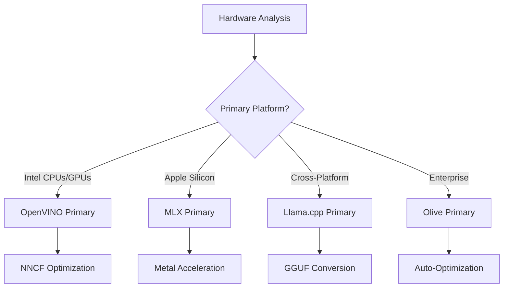
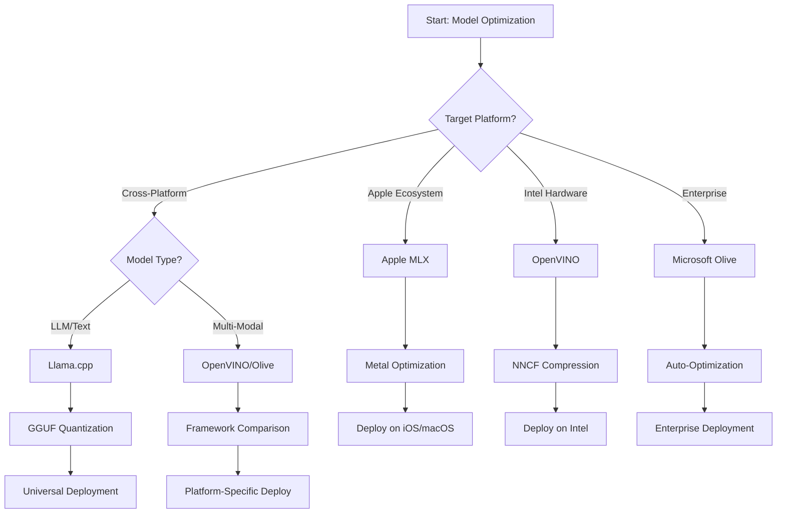
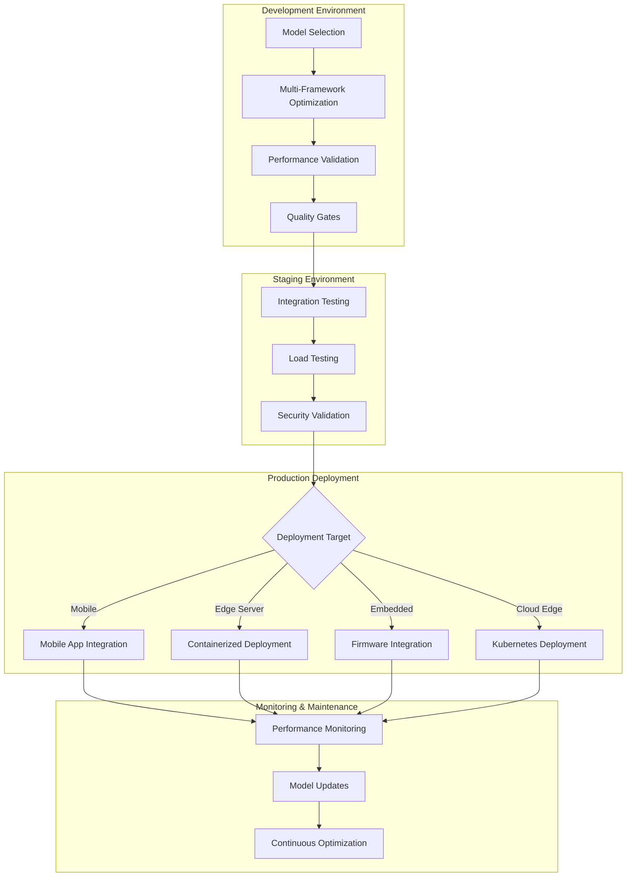

<!--
CO_OP_TRANSLATOR_METADATA:
{
  "original_hash": "6719c4a7e44b948230ac5f5cab3699bd",
  "translation_date": "2025-09-15T17:09:22+00:00",
  "source_file": "Module04/06.workflow-synthesis.md",
  "language_code": "hk"
}
-->
# 第六章：邊緣 AI 開發工作流程綜合

## 目錄
1. [簡介](../../../Module04)
2. [學習目標](../../../Module04)
3. [統一工作流程概述](../../../Module04)
4. [框架選擇矩陣](../../../Module04)
5. [最佳實踐綜合](../../../Module04)
6. [部署策略指南](../../../Module04)
7. [性能優化工作流程](../../../Module04)
8. [生產準備檢查表](../../../Module04)
9. [故障排除與監控](../../../Module04)
10. [未來化您的邊緣 AI 管道](../../../Module04)

## 簡介

邊緣 AI 開發需要對多種優化框架、部署策略和硬件考量有深入的理解。本章綜合了 Llama.cpp、Microsoft Olive、OpenVINO 和 Apple MLX 的知識，構建了一個統一的工作流程，以最大化效率、保持質量並確保成功的生產部署。

在整個課程中，我們探討了各個優化框架，每個框架都有其獨特的優勢和專門的使用場景。然而，現實中的邊緣 AI 項目通常需要結合多個框架的技術，或在特定限制和需求下做出策略性決策，以選擇最佳方法。

本章將所有框架的集體智慧綜合為可操作的工作流程、決策樹和最佳實踐，幫助您高效地構建生產就緒的邊緣 AI 解決方案。無論您是針對移動設備、嵌入式系統還是邊緣服務器進行優化，本指南都提供了在開發生命周期中做出明智決策的策略框架。

## 學習目標

完成本章後，您將能夠：

### 策略性決策
- **評估並選擇**基於項目需求、硬件限制和部署場景的最佳優化框架
- **設計全面的工作流程**，整合多種優化技術以最大化效率
- **評估權衡**，在模型準確性、推理速度、內存使用和部署複雜性之間做出平衡

### 工作流程整合
- **實施統一的開發管道**，利用多個優化框架的優勢
- **創建可重現的工作流程**，在不同環境中保持一致的模型優化和部署
- **建立質量門檻**和驗證流程，確保優化模型符合生產要求

### 性能優化
- **應用系統化的優化策略**，使用量化、剪枝和硬件特定的加速技術
- **監控和基準測試**模型在不同優化級別和部署目標上的性能
- **針對特定硬件平台進行優化**，包括 CPU、GPU、NPU 和專用邊緣加速器

### 生產部署
- **設計可擴展的部署架構**，支持多種模型格式和推理引擎
- **實施監控和可觀測性**，以便在生產環境中監控邊緣 AI 應用
- **建立維護工作流程**，包括模型更新、性能監控和系統優化

### 跨平台卓越
- **部署優化模型**，在多種硬件平台上保持一致的性能
- **處理平台特定的優化**，包括 Windows、macOS、Linux、移動和嵌入式系統
- **創建抽象層**，實現不同邊緣環境的無縫部署

## 統一工作流程概述

### 第一階段：需求分析與框架選擇

成功的邊緣 AI 部署的基礎是全面的需求分析，這為框架選擇和優化策略提供了指導。

#### 1.1 硬件評估


**主要考量：**
- **CPU 架構**：x86、ARM、Apple Silicon 的能力
- **加速器可用性**：GPU、NPU、VPU、專用 AI 芯片
- **內存限制**：RAM 限制、存儲容量
- **功耗預算**：電池壽命、熱量限制
- **連接性**：離線需求、帶寬限制

#### 1.2 應用需求矩陣

| 需求 | Llama.cpp | Microsoft Olive | OpenVINO | Apple MLX |
|------|-----------|-----------------|----------|-----------|
| 跨平台 | ✅ 優秀 | ⚡ 良好 | ⚡ 良好 | ❌ 僅限 Apple |
| 企業整合 | ⚡ 基本 | ✅ 優秀 | ✅ 優秀 | ⚡ 有限 |
| 移動部署 | ✅ 優秀 | ⚡ 良好 | ⚡ 良好 | ✅ iOS 優秀 |
| 實時推理 | ✅ 優秀 | ✅ 優秀 | ✅ 優秀 | ✅ 優秀 |
| 模型多樣性 | ✅ 專注於 LLM | ✅ 所有模型 | ✅ 所有模型 | ✅ 專注於 LLM |
| 易用性 | ✅ 簡單 | ✅ 自動化 | ⚡ 中等 | ✅ 簡單 |

### 第二階段：模型準備與優化

#### 2.1 通用模型評估管道

```python
# Universal Model Assessment Framework
class EdgeAIModelAssessment:
    def __init__(self, model_path, target_hardware):
        self.model_path = model_path
        self.target_hardware = target_hardware
        self.optimization_frameworks = []
        
    def assess_model_characteristics(self):
        """Analyze model size, architecture, and complexity"""
        return {
            'model_size': self.get_model_size(),
            'parameter_count': self.get_parameter_count(),
            'architecture_type': self.detect_architecture(),
            'quantization_compatibility': self.check_quantization_support()
        }
    
    def recommend_optimization_strategy(self):
        """Recommend optimal frameworks and techniques"""
        characteristics = self.assess_model_characteristics()
        
        if self.target_hardware.startswith('apple'):
            return self.mlx_optimization_strategy(characteristics)
        elif self.target_hardware.startswith('intel'):
            return self.openvino_optimization_strategy(characteristics)
        elif characteristics['model_size'] > 7_000_000_000:  # 7B+ parameters
            return self.enterprise_optimization_strategy(characteristics)
        else:
            return self.lightweight_optimization_strategy(characteristics)
```

#### 2.2 多框架優化管道

**順序優化方法：**
1. **初始轉換**：轉換為中間格式（盡可能使用 ONNX）
2. **框架特定優化**：應用專門技術
3. **交叉驗證**：在目標平台上驗證性能
4. **最終打包**：準備部署

```bash
# Multi-Framework Optimization Script
#!/bin/bash

MODEL_NAME="phi-3-mini"
BASE_MODEL="microsoft/Phi-3-mini-4k-instruct"

# Phase 1: ONNX Conversion (Universal)
python convert_to_onnx.py --model $BASE_MODEL --output models/onnx/

# Phase 2: Platform-Specific Optimization
if [[ "$TARGET_PLATFORM" == "intel" ]]; then
    # OpenVINO Optimization
    python optimize_openvino.py --input models/onnx/ --output models/openvino/
elif [[ "$TARGET_PLATFORM" == "apple" ]]; then
    # MLX Optimization
    python optimize_mlx.py --input $BASE_MODEL --output models/mlx/
elif [[ "$TARGET_PLATFORM" == "cross" ]]; then
    # Llama.cpp Optimization
    python convert_to_gguf.py --input models/onnx/ --output models/gguf/
fi

# Phase 3: Validation
python validate_optimization.py --original $BASE_MODEL --optimized models/$TARGET_PLATFORM/
```

### 第三階段：性能驗證與基準測試

#### 3.1 全面基準測試框架

```python
class EdgeAIBenchmark:
    def __init__(self, optimized_models):
        self.models = optimized_models
        self.metrics = {
            'inference_time': [],
            'memory_usage': [],
            'accuracy_score': [],
            'throughput': [],
            'energy_consumption': []
        }
    
    def run_comprehensive_benchmark(self):
        """Execute standardized benchmarks across all optimized models"""
        test_inputs = self.generate_test_inputs()
        
        for model_framework, model_path in self.models.items():
            print(f"Benchmarking {model_framework}...")
            
            # Latency Testing
            latency = self.measure_inference_latency(model_path, test_inputs)
            
            # Memory Profiling
            memory = self.profile_memory_usage(model_path)
            
            # Accuracy Validation
            accuracy = self.validate_model_accuracy(model_path, test_inputs)
            
            # Throughput Analysis
            throughput = self.measure_throughput(model_path)
            
            self.record_metrics(model_framework, latency, memory, accuracy, throughput)
    
    def generate_optimization_report(self):
        """Create comprehensive comparison report"""
        report = {
            'recommendations': self.analyze_performance_trade_offs(),
            'deployment_guidance': self.generate_deployment_recommendations(),
            'monitoring_requirements': self.define_monitoring_metrics()
        }
        return report
```

## 框架選擇矩陣

### 框架選擇決策樹



### 全面選擇標準

#### 1. 主要使用場景匹配

**大型語言模型 (LLMs)：**
- **Llama.cpp**：適合以 CPU 為主的跨平台部署
- **Apple MLX**：適合 Apple Silicon，支持統一內存
- **OpenVINO**：適合 Intel 硬件，支持 NNCF 優化
- **Microsoft Olive**：適合企業工作流程，自動化程度高

**多模態模型：**
- **OpenVINO**：全面支持視覺、音頻和文本
- **Microsoft Olive**：企業級優化，適合複雜管道
- **Llama.cpp**：僅限於文本模型
- **Apple MLX**：逐步支持多模態應用

#### 2. 硬件平台矩陣

| 平台 | 主要框架 | 次要選項 | 專用功能 |
|------|----------|----------|----------|
| Intel CPU/GPU | OpenVINO | Microsoft Olive | NNCF 壓縮，Intel 優化 |
| NVIDIA GPU | Microsoft Olive | OpenVINO | CUDA 加速，企業功能 |
| Apple Silicon | Apple MLX | Llama.cpp | Metal 着色器，統一內存 |
| ARM 移動 | Llama.cpp | OpenVINO | 跨平台，依賴性少 |
| Edge TPU | OpenVINO | Microsoft Olive | 專用加速器支持 |
| 嵌入式 ARM | Llama.cpp | OpenVINO | 占用空間小，高效推理 |

#### 3. 開發工作流程偏好

**快速原型：**
1. **Llama.cpp**：最快的設置，立即見效
2. **Apple MLX**：簡單的 Python API，快速迭代
3. **Microsoft Olive**：自動化優化，配置最少
4. **OpenVINO**：設置較複雜，功能全面

**企業生產：**
1. **Microsoft Olive**：企業功能，Azure 整合
2. **OpenVINO**：Intel 生態系統，工具全面
3. **Apple MLX**：適合 Apple 特定的企業應用
4. **Llama.cpp**：簡單部署，企業功能有限

## 最佳實踐綜合

### 通用優化原則

#### 1. 漸進式優化策略

```python
class ProgressiveOptimization:
    def __init__(self, base_model):
        self.base_model = base_model
        self.optimization_stages = [
            'baseline_measurement',
            'format_conversion',
            'quantization_optimization',
            'hardware_acceleration',
            'production_validation'
        ]
    
    def execute_progressive_optimization(self):
        """Apply optimization techniques incrementally"""
        
        # Stage 1: Baseline Measurement
        baseline_metrics = self.measure_baseline_performance()
        
        # Stage 2: Format Conversion
        converted_model = self.convert_to_optimal_format()
        conversion_metrics = self.measure_performance(converted_model)
        
        # Stage 3: Quantization
        quantized_model = self.apply_quantization(converted_model)
        quantization_metrics = self.measure_performance(quantized_model)
        
        # Stage 4: Hardware Acceleration
        accelerated_model = self.enable_hardware_acceleration(quantized_model)
        acceleration_metrics = self.measure_performance(accelerated_model)
        
        # Stage 5: Validation
        production_ready = self.validate_for_production(accelerated_model)
        
        return self.compile_optimization_report(
            baseline_metrics, conversion_metrics, 
            quantization_metrics, acceleration_metrics
        )
```

#### 2. 質量門檻實施

**準確性保留門檻：**
- 保持原始模型準確性 >95%
- 使用代表性測試數據集進行驗證
- 在生產環境中實施 A/B 測試

**性能提升門檻：**
- 至少達到 2 倍速度提升
- 將內存占用減少至少 50%
- 驗證推理時間的一致性

**生產準備門檻：**
- 通過負載壓力測試
- 展示穩定的長期性能
- 驗證安全性和隱私要求

### 框架特定最佳實踐整合

#### 1. 量化策略綜合

```python
# Unified Quantization Approach
class UnifiedQuantizationStrategy:
    def __init__(self, model, target_platform):
        self.model = model
        self.platform = target_platform
        
    def select_optimal_quantization(self):
        """Choose best quantization based on platform and requirements"""
        
        if self.platform == 'apple_silicon':
            return self.mlx_quantization_strategy()
        elif self.platform == 'intel_hardware':
            return self.openvino_quantization_strategy()
        elif self.platform == 'cross_platform':
            return self.llamacpp_quantization_strategy()
        else:
            return self.olive_quantization_strategy()
    
    def mlx_quantization_strategy(self):
        """Apple MLX-specific quantization"""
        return {
            'method': 'mlx_quantize',
            'precision': 'int4',
            'group_size': 64,
            'optimization_target': 'unified_memory'
        }
    
    def openvino_quantization_strategy(self):
        """OpenVINO NNCF quantization"""
        return {
            'method': 'nncf_quantize',
            'precision': 'int8',
            'calibration_method': 'post_training',
            'optimization_target': 'intel_hardware'
        }
```

#### 2. 硬件加速優化

**CPU 優化綜合：**
- **SIMD 指令**：利用框架中的優化內核
- **內存帶寬**：優化數據佈局以提高緩存效率
- **線程化**：平衡並行性與資源限制

**GPU 加速最佳實踐：**
- **批量處理**：通過適當的批量大小最大化吞吐量
- **內存管理**：優化 GPU 內存分配和傳輸
- **精度**：支持時使用 FP16 以提高性能

**NPU/專用加速器優化：**
- **模型架構**：確保與加速器能力兼容
- **數據流**：優化輸入/輸出管道以提高加速器效率
- **回退策略**：為不支持的操作實施 CPU 回退

## 部署策略指南

### 通用部署架構



### 平台特定部署模式

#### 1. 移動部署策略

```yaml
# Mobile Deployment Configuration
mobile_deployment:
  ios:
    framework: apple_mlx
    optimization:
      quantization: int4
      memory_mapping: true
      background_execution: limited
    packaging:
      format: mlx
      bundle_size: <50MB
      
  android:
    framework: llama_cpp
    optimization:
      quantization: q4_k_m
      threading: android_optimized
      memory_management: conservative
    packaging:
      format: gguf
      apk_size: <100MB
      
  cross_platform:
    framework: onnx_runtime
    optimization:
      quantization: int8
      execution_provider: cpu
    packaging:
      format: onnx
      shared_libraries: minimal
```

#### 2. 邊緣服務器部署

```yaml
# Edge Server Deployment Configuration
edge_server:
  intel_based:
    framework: openvino
    optimization:
      quantization: int8
      acceleration: cpu_gpu_auto
      batch_processing: dynamic
    deployment:
      container: openvino_runtime
      orchestration: kubernetes
      scaling: horizontal
      
  nvidia_based:
    framework: microsoft_olive
    optimization:
      quantization: int4
      acceleration: cuda
      tensor_parallelism: true
    deployment:
      container: nvidia_triton
      orchestration: kubernetes
      scaling: gpu_aware
```

### 容器化最佳實踐

```dockerfile
# Multi-Framework Edge AI Container
FROM ubuntu:22.04 as base

# Install common dependencies
RUN apt-get update && apt-get install -y \
    python3 \
    python3-pip \
    build-essential \
    cmake \
    && rm -rf /var/lib/apt/lists/*

# Framework-specific stages
FROM base as openvino
RUN pip install openvino nncf optimum[intel]

FROM base as llamacpp
RUN git clone https://github.com/ggerganov/llama.cpp.git \
    && cd llama.cpp && make LLAMA_OPENBLAS=1

FROM base as olive
RUN pip install olive-ai[auto-opt] onnxruntime-genai

# Production stage with selected framework
FROM openvino as production
COPY models/ /app/models/
COPY src/ /app/src/
WORKDIR /app

EXPOSE 8080
CMD ["python3", "src/inference_server.py"]
```

## 性能優化工作流程

### 系統化性能調整

#### 1. 性能分析管道

```python
class EdgeAIPerformanceProfiler:
    def __init__(self, model_path, framework):
        self.model_path = model_path
        self.framework = framework
        self.profiling_results = {}
    
    def comprehensive_profiling(self):
        """Execute comprehensive performance analysis"""
        
        # CPU Profiling
        cpu_profile = self.profile_cpu_usage()
        
        # Memory Profiling
        memory_profile = self.profile_memory_usage()
        
        # Inference Latency
        latency_profile = self.profile_inference_latency()
        
        # Throughput Analysis
        throughput_profile = self.profile_throughput()
        
        # Energy Consumption (where available)
        energy_profile = self.profile_energy_consumption()
        
        return self.compile_performance_report(
            cpu_profile, memory_profile, latency_profile,
            throughput_profile, energy_profile
        )
    
    def identify_bottlenecks(self):
        """Automatically identify performance bottlenecks"""
        bottlenecks = []
        
        if self.profiling_results['cpu_utilization'] > 80:
            bottlenecks.append('cpu_bound')
        
        if self.profiling_results['memory_usage'] > 90:
            bottlenecks.append('memory_bound')
        
        if self.profiling_results['inference_variance'] > 20:
            bottlenecks.append('inconsistent_performance')
        
        return self.generate_optimization_recommendations(bottlenecks)
```

#### 2. 自動化優化管道

```python
class AutomatedOptimizationPipeline:
    def __init__(self, base_model, target_constraints):
        self.base_model = base_model
        self.constraints = target_constraints
        self.optimization_history = []
    
    def execute_optimization_search(self):
        """Systematically search optimization space"""
        
        optimization_candidates = [
            {'quantization': 'int8', 'pruning': 0.1},
            {'quantization': 'int4', 'pruning': 0.2},
            {'quantization': 'int8', 'acceleration': 'gpu'},
            {'quantization': 'int4', 'acceleration': 'npu'}
        ]
        
        best_configuration = None
        best_score = 0
        
        for config in optimization_candidates:
            optimized_model = self.apply_optimization(config)
            score = self.evaluate_optimization(optimized_model)
            
            if score > best_score and self.meets_constraints(optimized_model):
                best_score = score
                best_configuration = config
            
            self.optimization_history.append({
                'config': config,
                'score': score,
                'model': optimized_model
            })
        
        return best_configuration, self.optimization_history
```

### 多目標優化

#### 1. 邊緣 AI 的帕累托優化

```python
class ParetoOptimization:
    def __init__(self, objectives=['speed', 'accuracy', 'memory']):
        self.objectives = objectives
        self.pareto_frontier = []
    
    def find_pareto_optimal_solutions(self, optimization_results):
        """Identify Pareto-optimal configurations"""
        
        for result in optimization_results:
            is_dominated = False
            
            for frontier_point in self.pareto_frontier:
                if self.dominates(frontier_point, result):
                    is_dominated = True
                    break
            
            if not is_dominated:
                # Remove dominated points from frontier
                self.pareto_frontier = [
                    point for point in self.pareto_frontier 
                    if not self.dominates(result, point)
                ]
                
                self.pareto_frontier.append(result)
        
        return self.pareto_frontier
    
    def recommend_configuration(self, user_preferences):
        """Recommend configuration based on user preferences"""
        
        weighted_scores = []
        for config in self.pareto_frontier:
            score = sum(
                user_preferences[obj] * config['metrics'][obj] 
                for obj in self.objectives
            )
            weighted_scores.append((score, config))
        
        return max(weighted_scores, key=lambda x: x[0])[1]
```

## 生產準備檢查表

### 全面生產驗證

#### 1. 模型質量保證

```python
class ProductionReadinessValidator:
    def __init__(self, optimized_model, production_requirements):
        self.model = optimized_model
        self.requirements = production_requirements
        self.validation_results = {}
    
    def validate_model_quality(self):
        """Comprehensive model quality validation"""
        
        # Accuracy Validation
        accuracy_result = self.validate_accuracy()
        
        # Performance Validation
        performance_result = self.validate_performance()
        
        # Robustness Testing
        robustness_result = self.validate_robustness()
        
        # Security Assessment
        security_result = self.validate_security()
        
        # Compliance Verification
        compliance_result = self.validate_compliance()
        
        return self.compile_validation_report(
            accuracy_result, performance_result, robustness_result,
            security_result, compliance_result
        )
    
    def generate_certification_report(self):
        """Generate production certification report"""
        return {
            'model_signature': self.generate_model_signature(),
            'validation_timestamp': datetime.now(),
            'validation_results': self.validation_results,
            'deployment_approval': self.check_deployment_approval(),
            'monitoring_requirements': self.define_monitoring_requirements()
        }
```

#### 2. 生產部署檢查表

**部署前驗證：**
- [ ] 模型準確性符合最低要求（>95% 基準）
- [ ] 達到性能目標（延遲、吞吐量、內存）
- [ ] 安全漏洞已評估並修復
- [ ] 完成預期負載下的壓力測試
- [ ] 測試故障場景並驗證恢復程序
- [ ] 配置監控和警報系統
- [ ] 測試並記錄回滾程序

**部署過程：**
- [ ] 實施藍綠部署策略
- [ ] 配置逐步流量提升
- [ ] 啟動實時監控儀表板
- [ ] 建立性能基準
- [ ] 定義錯誤率閾值
- [ ] 配置自動回滾觸發器

**部署後監控：**
- [ ] 啟動模型漂移檢測
- [ ] 配置性能下降警報
- [ ] 啟用資源利用率監控
- [ ] 跟踪用戶體驗指標
- [ ] 維護模型版本和譜系
- [ ] 定期安排模型性能審查

### 持續集成/持續部署 (CI/CD)

```yaml
# Edge AI CI/CD Pipeline Configuration
edge_ai_pipeline:
  stages:
    - model_validation
    - optimization
    - testing
    - staging_deployment
    - production_deployment
    - monitoring
  
  model_validation:
    accuracy_threshold: 0.95
    performance_baseline: required
    security_scan: enabled
    
  optimization:
    frameworks:
      - llama_cpp
      - openvino
      - microsoft_olive
    validation:
      cross_validation: enabled
      performance_comparison: required
      
  testing:
    unit_tests: comprehensive
    integration_tests: full_pipeline
    load_tests: production_scale
    security_tests: comprehensive
    
  deployment:
    strategy: blue_green
    traffic_ramping: gradual
    rollback: automatic
    monitoring: real_time
```

## 故障排除與監控

### 通用故障排除框架

#### 1. 常見問題與解決方案

**性能問題：**
```python
class PerformanceTroubleshooter:
    def __init__(self, model_metrics):
        self.metrics = model_metrics
        
    def diagnose_performance_issues(self):
        """Systematic performance issue diagnosis"""
        
        issues = []
        
        # High latency diagnosis
        if self.metrics['avg_latency'] > self.metrics['target_latency']:
            issues.append(self.diagnose_latency_issues())
        
        # Memory usage diagnosis
        if self.metrics['memory_usage'] > self.metrics['memory_limit']:
            issues.append(self.diagnose_memory_issues())
        
        # Throughput diagnosis
        if self.metrics['throughput'] < self.metrics['target_throughput']:
            issues.append(self.diagnose_throughput_issues())
        
        return self.generate_resolution_plan(issues)
    
    def diagnose_latency_issues(self):
        """Specific latency troubleshooting"""
        potential_causes = []
        
        if self.metrics['cpu_utilization'] > 80:
            potential_causes.append('cpu_bottleneck')
        
        if self.metrics['memory_bandwidth'] > 90:
            potential_causes.append('memory_bandwidth_limit')
        
        if self.metrics['model_size'] > self.metrics['optimal_size']:
            potential_causes.append('model_too_large')
        
        return {
            'issue': 'high_latency',
            'causes': potential_causes,
            'solutions': self.generate_latency_solutions(potential_causes)
        }
```

**框架特定故障排除：**

| 問題 | Llama.cpp | Microsoft Olive | OpenVINO | Apple MLX |
|------|-----------|-----------------|----------|-----------|
| 內存問題 | 減少上下文長度 | 降低批量大小 | 啟用緩存 | 使用內存映射 |
| 推理速度慢 | 啟用 SIMD | 檢查量化 | 優化線程化 | 啟用 Metal |
| 準確性下降 | 更高量化 | 使用 QAT 重新訓練 | 增加校準 | 量化後微調 |
| 兼容性 | 檢查模型格式 | 驗證框架版本 | 更新驅動 | 檢查 macOS 版本 |

#### 2. 生產監控策略

```python
class EdgeAIMonitoring:
    def __init__(self, deployment_config):
        self.config = deployment_config
        self.metrics_collectors = []
        self.alerting_rules = []
    
    def setup_comprehensive_monitoring(self):
        """Configure comprehensive monitoring for Edge AI deployment"""
        
        # Model Performance Monitoring
        self.setup_model_performance_monitoring()
        
        # Infrastructure Monitoring
        self.setup_infrastructure_monitoring()
        
        # Business Metrics Monitoring
        self.setup_business_metrics_monitoring()
        
        # Security Monitoring
        self.setup_security_monitoring()
    
    def setup_model_performance_monitoring(self):
        """Model-specific performance monitoring"""
        metrics = [
            'inference_latency_p50',
            'inference_latency_p95',
            'inference_latency_p99',
            'model_accuracy_drift',
            'prediction_confidence_distribution',
            'error_rate',
            'throughput_requests_per_second'
        ]
        
        for metric in metrics:
            self.add_metric_collector(metric)
            self.add_alerting_rule(metric)
    
    def detect_model_drift(self):
        """Automated model drift detection"""
        drift_indicators = [
            self.statistical_drift_detection(),
            self.performance_drift_detection(),
            self.data_distribution_shift_detection()
        ]
        
        return self.aggregate_drift_signals(drift_indicators)
```

### 自動化問題解決

```python
class AutomatedIssueResolution:
    def __init__(self, monitoring_system):
        self.monitoring = monitoring_system
        self.resolution_strategies = {}
    
    def handle_performance_degradation(self, alert):
        """Automated performance issue resolution"""
        
        if alert['type'] == 'high_latency':
            return self.resolve_latency_issue(alert)
        elif alert['type'] == 'high_memory_usage':
            return self.resolve_memory_issue(alert)
        elif alert['type'] == 'accuracy_drift':
            return self.resolve_accuracy_issue(alert)
        
    def resolve_latency_issue(self, alert):
        """Automated latency issue resolution"""
        resolution_steps = [
            'increase_cpu_allocation',
            'enable_model_caching',
            'reduce_batch_size',
            'switch_to_quantized_model'
        ]
        
        for step in resolution_steps:
            if self.apply_resolution_step(step):
                return f"Resolved latency issue with: {step}"
        
        return "Escalating to human operator"
```

## 未來化您的邊緣 AI 管道

### 新興技術整合

#### 1. 下一代硬件支持

```python
class FutureHardwareIntegration:
    def __init__(self):
        self.supported_accelerators = [
            'npu_next_gen',
            'quantum_processors',
            'neuromorphic_chips',
            'optical_processors'
        ]
    
    def design_adaptive_pipeline(self):
        """Create hardware-agnostic optimization pipeline"""
        
        pipeline = {
            'model_preparation': self.universal_model_preparation(),
            'hardware_detection': self.dynamic_hardware_detection(),
            'optimization_selection': self.adaptive_optimization_selection(),
            'performance_validation': self.hardware_agnostic_validation()
        }
        
        return pipeline
    
    def adaptive_optimization_selection(self):
        """Dynamically select optimization based on available hardware"""
        
        def optimize_for_hardware(model, available_hardware):
            if 'npu' in available_hardware:
                return self.npu_optimization(model)
            elif 'quantum' in available_hardware:
                return self.quantum_optimization(model)
            elif 'neuromorphic' in available_hardware:
                return self.neuromorphic_optimization(model)
            else:
                return self.fallback_optimization(model)
        
        return optimize_for_hardware
```

#### 2. 模型架構演進

**支持新興架構：**
- **專家混合 (MoE)**：稀疏模型架構以提高效率
- **檢索增強生成**：混合模型 + 知識庫系統
- **多模態模型**：視覺 + 語言 + 音頻整合
- **聯邦學習**：分佈式訓練與優化

```python
class NextGenModelSupport:
    def __init__(self):
        self.architecture_handlers = {
            'moe': self.handle_mixture_of_experts,
            'rag': self.handle_retrieval_augmented,
            'multimodal': self.handle_multimodal,
            'federated': self.handle_federated_learning
        }
    
    def handle_mixture_of_experts(self, model):
        """Optimize Mixture of Experts models for edge deployment"""
        optimization_strategy = {
            'expert_pruning': True,
            'routing_optimization': True,
            'expert_quantization': 'per_expert',
            'load_balancing': 'dynamic'
        }
        return self.apply_moe_optimization(model, optimization_strategy)
```

### 持續學習與適應

#### 1. 在線學習整合

```python
class EdgeOnlineLearning:
    def __init__(self, base_model, learning_rate=0.001):
        self.base_model = base_model
        self.learning_rate = learning_rate
        self.adaptation_buffer = []
    
    def continuous_adaptation(self, new_data, feedback):
        """Continuously adapt model based on edge data"""
        
        # Privacy-preserving local adaptation
        local_updates = self.compute_local_gradients(new_data, feedback)
        
        # Apply updates with constraints
        adapted_model = self.apply_constrained_updates(
            self.base_model, local_updates
        )
        
        # Validate adaptation quality
        if self.validate_adaptation(adapted_model):
            self.base_model = adapted_model
            return True
        
        return False
    
    def federated_learning_participation(self):
        """Participate in federated learning while preserving privacy"""
        
        # Compute local model updates
        local_updates = self.compute_private_updates()
        
        # Differential privacy protection
        private_updates = self.apply_differential_privacy(local_updates)
        
        # Share with federated learning coordinator
        return self.share_updates(private_updates)
```

#### 2. 可持續性與綠色 AI

```python
class GreenEdgeAI:
    def __init__(self, sustainability_targets):
        self.targets = sustainability_targets
        self.energy_monitor = EnergyMonitor()
    
    def optimize_for_sustainability(self, model):
        """Optimize model for minimal environmental impact"""
        
        optimization_objectives = [
            'minimize_energy_consumption',
            'maximize_hardware_utilization',
            'reduce_model_training_cost',
            'extend_device_lifetime'
        ]
        
        return self.multi_objective_green_optimization(
            model, optimization_objectives
        )
    
    def carbon_aware_deployment(self):
        """Deploy models considering carbon footprint"""
        
        deployment_strategy = {
            'prefer_renewable_energy_regions': True,
            'optimize_for_energy_efficiency': True,
            'minimize_data_transfer': True,
            'lifecycle_carbon_accounting': True
        }
        
        return deployment_strategy
```

## 結論

這份全面的工作流程綜合代表了邊緣 AI 優化知識的結晶，將所有主要優化框架的最佳實踐整合為統一的、生產就緒的方案。遵循這些指南，您將能夠：

**實現最佳性能**：通過系統化框架選擇、漸進式優化和全面驗證，確保您的邊緣 AI 應用提供最大效率。

**確保生產準備**：通過徹底的測試、監控和質量門檻，保證在現實環境中的可靠部署和運行。

**保持長期成功**：通過持續監控、自動化問題解決和適應策略，保持您的邊緣 AI 解決方案的性能和相關性。

**未來化您的投資**：設計靈活的、硬件無關的管道，能夠隨著新興技術和需求的變化而演進。

邊緣 AI 的領域正在快速發展，新硬件平台、優化技術和部署策略不斷湧現。本綜合提供了應對這種複雜性的基礎，同時構建穩健、高效且可維護的邊緣 AI 解決方案，能在生產環境中真正創造價值。
記住，最佳的優化策略是能滿足您的特定需求，同時保持靈活性以適應需求的演變。使用此指南作為制定明智決策的框架，但始終通過實驗測試和實際部署經驗來驗證您的選擇。

## ➡️ 下一步

繼續您的邊緣人工智能旅程，探索[模組 5：SLMOps 和生產部署](../Module05/README.md)，了解小型語言模型生命周期管理的運營方面。

---

**免責聲明**：  
本文件已使用人工智能翻譯服務 [Co-op Translator](https://github.com/Azure/co-op-translator) 進行翻譯。儘管我們致力於提供準確的翻譯，請注意自動翻譯可能包含錯誤或不準確之處。原始語言的文件應被視為權威來源。對於重要資訊，建議使用專業人工翻譯。我們對因使用此翻譯而引起的任何誤解或錯誤解釋概不負責。