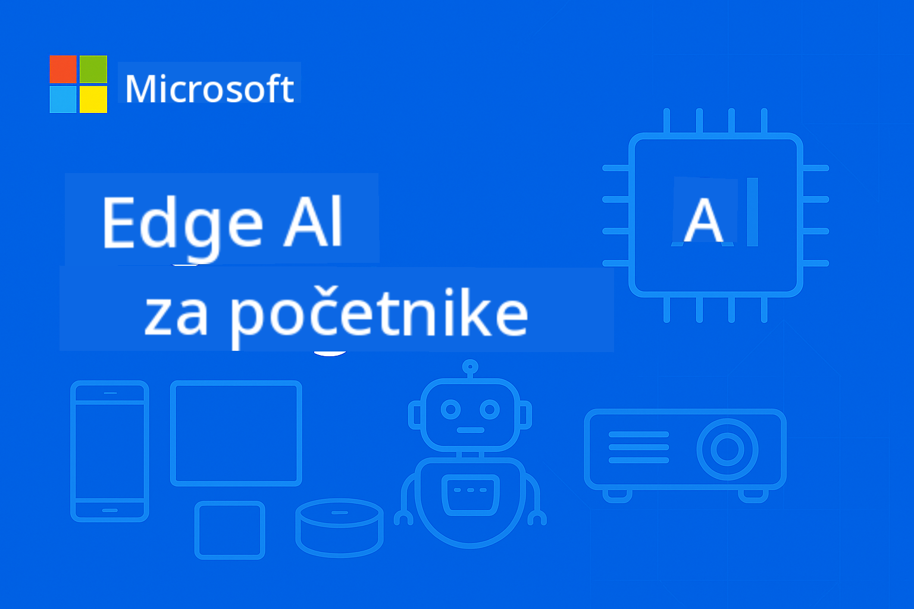

<!--
CO_OP_TRANSLATOR_METADATA:
{
  "original_hash": "22c6dae04591abc5f0d80f944ed663d5",
  "translation_date": "2025-09-26T10:46:05+00:00",
  "source_file": "introduction.md",
  "language_code": "hr"
}
-->
# Uvod u Edge AI za početnike



Dobrodošli na vaše putovanje u **Edge umjetnu inteligenciju** – revolucionarni pristup koji donosi moć AI-a direktno tamo gdje se podaci stvaraju i gdje se odluke trebaju donositi. Ovaj uvod postavit će temelje za razumijevanje zašto Edge AI predstavlja budućnost inteligentnog računalstva i kako možete ovladati njegovom primjenom.

## Što je Edge AI?

Edge AI označava temeljni pomak od tradicionalne obrade AI-a u oblaku prema **lokalnoj, uređajnoj inteligenciji**. Umjesto slanja podataka na udaljene servere, Edge AI obrađuje informacije direktno na rubnim uređajima – pametnim telefonima, IoT senzorima, industrijskoj opremi, autonomnim vozilima i ugrađenim sustavima.

### Paradigma Edge AI-a

```
Traditional AI:     Device → Cloud → Processing → Response → Device
Edge AI:           Device → Local Processing → Immediate Response
```
  
Ovaj pomak eliminira potrebu za slanjem podataka u oblak, omogućujući:
- **Trenutne odgovore** (latencija ispod milisekunde)
- **Poboljšanu privatnost** (podaci nikada ne napuštaju uređaj)
- **Pouzdan rad** (funkcionira bez internetske povezanosti)
- **Smanjene troškove** (minimalna potrošnja propusnosti i obrade u oblaku)

## Zašto je Edge AI važan sada?

### Savršena oluja inovacija

Tri tehnološka trenda spojila su se kako bi Edge AI učinili ne samo mogućim, već i neophodnim:

1. **Revolucija hardvera**: Moderni čipovi (Apple Silicon, Qualcomm Snapdragon, NVIDIA Jetson) sada nude AI ubrzanje u kompaktnim, energetski učinkovitim paketima  
2. **Optimizacija modela**: Mali jezični modeli (SLM-ovi) poput Phi-4, Gemma i Mistral pružaju 80-90% performansi velikih modela u 10-20% njihove veličine  
3. **Stvarne potrebe industrije**: Industrije zahtijevaju trenutni, privatni i pouzdani AI koji rješenja u oblaku ne mogu pružiti  

### Ključni poslovni pokretači

**Privatnost i usklađenost**  
- Zdravstvo: Podaci o pacijentima moraju ostati lokalni (usklađenost s HIPAA)  
- Financije: Obrada transakcija zahtijeva suverenitet podataka  
- Proizvodnja: Zaštita vlasničkih procesa od izlaganja  

**Zahtjevi performansi**  
- Autonomna vozila: Životno važne odluke u milisekundama  
- Industrijska automatizacija: Kontrola kvalitete i sigurnosno praćenje u stvarnom vremenu  
- Gaming i AR/VR: Uranjajuća iskustva zahtijevaju nultu primjetnu latenciju  

**Ekonomska učinkovitost**  
- Telekomunikacije: Obrada milijuna IoT senzorskih očitanja lokalno  
- Maloprodaja: Analitika u trgovinama bez velikih troškova propusnosti  
- Pametni gradovi: Distribuirana inteligencija na tisućama uređaja  

## Industrije transformirane Edge AI-em

### 🏭 **Proizvodnja i Industrija 4.0**  
- **Prediktivno održavanje**: AI modeli na industrijskoj opremi predviđaju kvarove prije nego što se dogode  
- **Kontrola kvalitete**: Otkrivanje nedostataka u stvarnom vremenu na proizvodnim linijama  
- **Praćenje sigurnosti**: Trenutno otkrivanje opasnosti i reakcija  
- **Opskrbni lanac**: Inteligentno upravljanje zalihama na svakom čvoru  

**Stvarni utjecaj**: Siemens koristi Edge AI za prediktivno održavanje, smanjujući zastoje za 30-50% i troškove održavanja za 25%.

### 🏥 **Zdravstvo i medicinski uređaji**  
- **Dijagnostičko snimanje**: Analiza X-zraka i MRI-a pomoću AI-a na mjestu pružanja usluge  
- **Praćenje pacijenata**: Kontinuirana procjena zdravlja putem nosivih uređaja  
- **Pomoć pri operacijama**: Vodič u stvarnom vremenu tijekom zahvata  
- **Otkrivanje lijekova**: Lokalna obrada molekularnih simulacija  

**Stvarni utjecaj**: Philipsova Edge AI rješenja omogućuju radiolozima da dijagnosticiraju stanja 40% brže uz održavanje 99% točnosti.

### 🚗 **Autonomni sustavi i transport**  
- **Autonomna vozila**: Odluke u djeliću sekunde za navigaciju i sigurnost  
- **Upravljanje prometom**: Inteligentna kontrola raskrižja i optimizacija protoka  
- **Upravljanje flotom**: Optimizacija ruta i praćenje zdravlja vozila u stvarnom vremenu  
- **Logistika**: Autonomni roboti u skladištima i sustavi dostave  

**Stvarni utjecaj**: Teslin sustav Full Self-Driving lokalno obrađuje podatke senzora, donoseći 40+ odluka u sekundi za sigurnu autonomnu navigaciju.

### 🏙️ **Pametni gradovi i infrastruktura**  
- **Javna sigurnost**: Otkrivanje prijetnji i hitna reakcija u stvarnom vremenu  
- **Upravljanje energijom**: Optimizacija pametne mreže i integracija obnovljive energije  
- **Praćenje okoliša**: Praćenje kvalitete zraka, buke i klimatskih promjena  
- **Urbanističko planiranje**: Analiza protoka prometa i optimizacija infrastrukture  

**Stvarni utjecaj**: Inicijativa pametnog grada Singapura koristi 100.000+ Edge AI senzora za upravljanje prometom, smanjujući vrijeme putovanja za 25%.

### 📱 **Potrošačka tehnologija i mobilni uređaji**  
- **Pametni telefoni**: Poboljšana fotografija, glasovni asistenti i personalizacija  
- **Pametni domovi**: Inteligentna automatizacija i sigurnosni sustavi  
- **Nosivi uređaji**: Praćenje zdravlja i optimizacija fitnessa  
- **Gaming**: Poboljšanje grafike u stvarnom vremenu i optimizacija igranja  

**Stvarni utjecaj**: Appleov Neural Engine lokalno obrađuje 15,8 trilijuna operacija u sekundi, omogućujući značajke poput prijevoda u stvarnom vremenu i računalne fotografije.

## Mali jezični modeli: Motor Edge AI-a

### Što su mali jezični modeli (SLM-ovi)?

SLM-ovi su **komprimirane, optimizirane verzije** velikih jezičnih modela, posebno dizajnirane za primjenu na rubnim uređajima:

- **Phi-4**: 14B parametara, optimiziran za zaključivanje i generiranje koda  
- **Gemma 2B/7B**: Googleovi učinkoviti modeli za razne NLP zadatke  
- **Mistral-7B**: Visokoučinkoviti model s licenciranjem prilagođenim komercijalnoj upotrebi  
- **Qwen serija**: Alibabaovi višejezični modeli optimizirani za mobilnu primjenu  

### Prednosti SLM-ova

| Sposobnost | Veliki jezični modeli | Mali jezični modeli |
|------------|----------------------|----------------------|
| **Veličina** | 70B-405B parametara | 1B-14B parametara |
| **Memorija** | 40-200GB RAM | 2-16GB RAM |
| **Brzina inferencije** | 2-10 sekundi | 50-500ms |
| **Primjena** | Serveri visokih performansi | Pametni telefoni, ugrađeni uređaji |
| **Trošak** | $1000+/mjesečno | Jednokratni trošak hardvera |
| **Privatnost** | Podaci se šalju u oblak | Obrada ostaje lokalna |

### Provjera performansi

Moderni SLM-ovi postižu izvanredne sposobnosti:
- **90% performansi GPT-3.5** u mnogim zadacima  
- **Razgovor u stvarnom vremenu**  
- **Generiranje i ispravljanje koda**  
- **Višejezični prijevod**  
- **Analiza i sažimanje dokumenata**  

## Ciljevi učenja

Završetkom ovog tečaja EdgeAI za početnike, naučit ćete:

### 🎯 **Temeljno znanje**  
- Razumjeti tehničke i poslovne pokretače usvajanja Edge AI-a  
- Usporediti arhitekture AI-a na rubu i u oblaku te njihove odgovarajuće primjene  
- Identificirati karakteristike i sposobnosti različitih obitelji SLM-ova  
- Analizirati hardverske zahtjeve za primjenu Edge AI-a  

### 🛠️ **Tehničke vještine**  
- Primijeniti SLM-ove na raznim platformama (Windows, mobilni uređaji, ugrađeni sustavi, hibridni sustavi rub-oblak)  
- Optimizirati modele za ograničenja rubnih uređaja pomoću kvantizacije, obrezivanja i kompresije  
- Implementirati Edge AI aplikacije spremne za proizvodnju s praćenjem i skaliranjem  
- Izraditi sustave s više agenata i okvire za pozivanje funkcija za složene radne tokove  

### 🏗️ **Praktična primjena**  
- Kreirati aplikacije za razgovor s lokalnim prebacivanjem modela i upravljanjem razgovorima  
- Razviti RAG (Generacija uz pomoć pretraživanja) sustave s lokalnom obradom dokumenata  
- Izgraditi usmjerivače modela koji inteligentno biraju između specijaliziranih AI modela  
- Dizajnirati API okvire sa streamingom, praćenjem zdravlja i rukovanjem pogreškama  

### 🚀 **Primjena u proizvodnji**  
- Uspostaviti SLMOps procese za verzioniranje, testiranje i primjenu modela  
- Implementirati najbolje sigurnosne prakse za Edge AI aplikacije  
- Dizajnirati skalabilne arhitekture koje balansiraju obradu na rubu i u oblaku  
- Kreirati strategije za praćenje i održavanje Edge AI sustava u proizvodnji  

## Ishodi učenja

Po završetku tečaja bit ćete osposobljeni za:

### **Tehničko znanje**  
✅ **Primjenu Edge AI rješenja spremnih za proizvodnju** na Windows, mobilnim i ugrađenim platformama  
✅ **Optimizaciju AI modela za ograničenja rubnih uređaja** uz postizanje 75% smanjenja veličine i 85% zadržavanja performansi  
✅ **Izradu inteligentnih sustava agenata** s pozivanjem funkcija i orkestracijom više modela  
✅ **Kreiranje skalabilnih hibridnih arhitektura rub-oblak** za poslovne aplikacije  

### **Primjena u industriji**  
✅ **Dizajn rješenja za proizvodnju** za prediktivno održavanje i kontrolu kvalitete  
✅ **Razvoj zdravstvenih aplikacija** s privatnom obradom podataka o pacijentima  
✅ **Izradu automobilskih sustava** za donošenje odluka u stvarnom vremenu i sigurnost  
✅ **Kreiranje infrastrukture pametnih gradova** za promet, sigurnost i praćenje okoliša  

### **Napredak u karijeri**  
✅ **EdgeAI arhitekt rješenja**: Dizajn sveobuhvatnih strategija Edge AI-a  
✅ **ML inženjer (specijalizacija za rub)**: Optimizacija i primjena modela za rubne okruženja  
✅ **IoT AI programer**: Izrada inteligentnih IoT sustava s lokalnom obradom  
✅ **Mobilni AI programer**: Razvoj AI aplikacija za mobilne uređaje s lokalnom inferencijom  

## Struktura tečaja

Ovaj tečaj slijedi **pristup progresivnog usvajanja znanja**:

### **Faza 1: Temelji** (Moduli 01-02)  
Izgradnja konceptualnog razumijevanja i istraživanje obitelji modela  

### **Faza 2: Primjena** (Moduli 03-04)  
Ovladavanje tehnikama primjene i optimizacije  

### **Faza 3: Proizvodnja** (Moduli 05-06)  
Učenje SLMOps procesa i naprednih okvira agenata  

### **Faza 4: Specijalizacija** (Moduli 07-08)  
Primjena specifična za platformu i sveobuhvatni primjeri  

## Metrike uspjeha

Pratite svoj napredak kroz ove konkretne rezultate:

- **Projekti u portfelju**: 10+ aplikacija spremnih za proizvodnju u raznim industrijama  
- **Referentne performanse**: Modeli koji rade s <500ms vremenom inferencije na rubnim uređajima  
- **Ciljevi primjene**: Aplikacije koje rade na Windows, mobilnim i ugrađenim platformama  
- **Spremnost za poslovanje**: Rješenja s okvirima za praćenje, skaliranje i sigurnost  

## Početak

Spremni za transformaciju vašeg razumijevanja primjene AI-a? Vaše putovanje počinje s **[Modulom 01: Osnove EdgeAI-a](./Module01/README.md)**, gdje ćete istražiti tehničke temelje koji omogućuju Edge AI i proučiti stvarne primjere iz industrije.

**Sljedeći korak**: [📚 Modul 01 - Osnove EdgeAI-a →](./Module01/README.md)

---

**Budućnost AI-a je lokalna, trenutna i privatna. Ovladajte Edge AI-em kako biste izgradili sljedeću generaciju inteligentnih aplikacija.**

---

