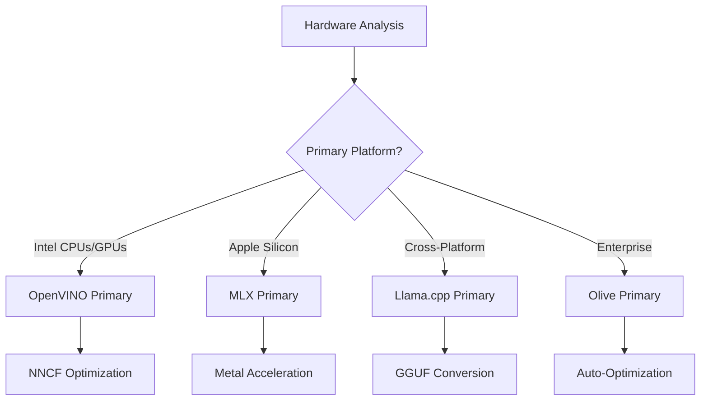
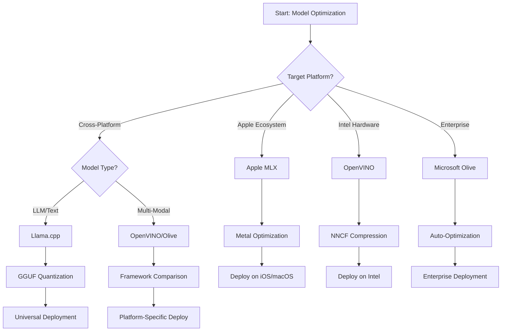
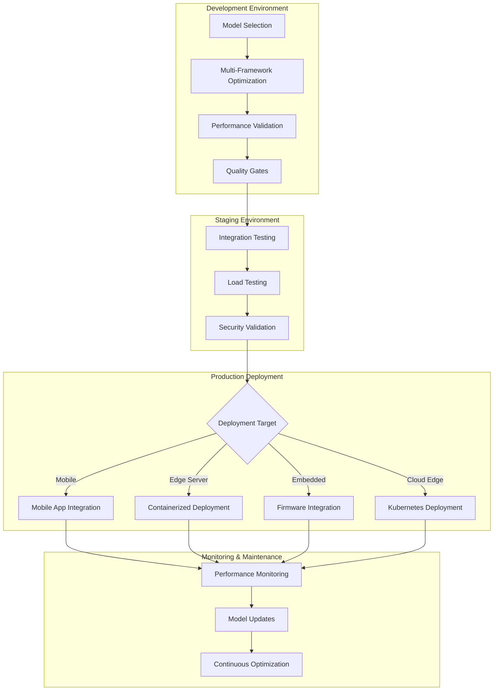

<!--
CO_OP_TRANSLATOR_METADATA:
{
  "original_hash": "6719c4a7e44b948230ac5f5cab3699bd",
  "translation_date": "2025-09-18T16:56:46+00:00",
  "source_file": "Module04/06.workflow-synthesis.md",
  "language_code": "hu"
}
-->
# 6. szakasz: Edge AI fejlesztési munkafolyamat szintézise

## Tartalomjegyzék
1. [Bevezetés](../../../Module04)
2. [Tanulási célok](../../../Module04)
3. [Egységes munkafolyamat áttekintése](../../../Module04)
4. [Keretrendszer-választási mátrix](../../../Module04)
5. [Legjobb gyakorlatok szintézise](../../../Module04)
6. [Telepítési stratégiai útmutató](../../../Module04)
7. [Teljesítményoptimalizálási munkafolyamat](../../../Module04)
8. [Gyártási készültségi ellenőrzőlista](../../../Module04)
9. [Hibaelhárítás és monitorozás](../../../Module04)
10. [Edge AI csővezeték jövőbiztosítása](../../../Module04)

## Bevezetés

Az Edge AI fejlesztéséhez mélyreható ismeretekre van szükség a különböző optimalizálási keretrendszerek, telepítési stratégiák és hardveres szempontok terén. Ez az átfogó szintézis egyesíti a Llama.cpp, Microsoft Olive, OpenVINO és Apple MLX keretrendszerek tudását, hogy egy egységes munkafolyamatot hozzon létre, amely maximalizálja a hatékonyságot, megőrzi a minőséget, és biztosítja a sikeres gyártási telepítést.

A kurzus során külön-külön vizsgáltuk az egyes optimalizálási keretrendszereket, amelyek mindegyike egyedi erősségekkel és speciális felhasználási területekkel rendelkezik. Azonban a valós Edge AI projektek gyakran megkövetelik több keretrendszer technikáinak kombinálását, vagy stratégiai döntéseket arról, hogy melyik megközelítés nyújtja a legjobb eredményeket az adott korlátok és követelmények mellett.

Ez a szakasz az összes keretrendszer kollektív bölcsességét cselekvésre alkalmas munkafolyamatokká, döntési fákká és legjobb gyakorlatokká szintetizálja, amelyek lehetővé teszik, hogy hatékonyan és eredményesen építsen gyártásra kész Edge AI megoldásokat. Legyen szó mobil eszközök, beágyazott rendszerek vagy edge szerverek optimalizálásáról, ez az útmutató stratégiai keretet biztosít az informált döntések meghozatalához a fejlesztési életciklus során.

## Tanulási célok

A szakasz végére képes lesz:

### Stratégiai döntéshozatal
- **Értékelni és kiválasztani** az optimális optimalizálási keretrendszert a projekt követelményei, hardveres korlátok és telepítési forgatókönyvek alapján
- **Átfogó munkafolyamatokat tervezni**, amelyek több optimalizálási technikát integrálnak a maximális hatékonyság érdekében
- **Felmérni a kompromisszumokat** a modell pontossága, az inferencia sebessége, a memóriahasználat és a telepítési komplexitás között különböző keretrendszerek esetében

### Munkafolyamat integráció
- **Egységes fejlesztési csővezetékeket megvalósítani**, amelyek több optimalizálási keretrendszer erősségeit hasznosítják
- **Reprodukálható munkafolyamatokat létrehozni**, amelyek biztosítják a modell optimalizálásának és telepítésének konzisztenciáját különböző környezetekben
- **Minőségi kapukat és validációs folyamatokat kialakítani**, hogy az optimalizált modellek megfeleljenek a gyártási követelményeknek

### Teljesítményoptimalizálás
- **Rendszeres optimalizálási stratégiákat alkalmazni**, például kvantálás, metszés és hardver-specifikus gyorsítási technikák
- **Monitorozni és benchmarkolni** a modell teljesítményét különböző optimalizálási szinteken és telepítési célokon
- **Optimalizálni specifikus hardverplatformokra**, beleértve a CPU-t, GPU-t, NPU-t és speciális edge gyorsítókat

### Gyártási telepítés
- **Skálázható telepítési architektúrákat tervezni**, amelyek több modellformátumot és inferencia motort támogatnak
- **Monitorozási és megfigyelési rendszereket megvalósítani** Edge AI alkalmazásokhoz gyártási környezetben
- **Karbantartási munkafolyamatokat kialakítani** modellfrissítésekhez, teljesítményfigyeléshez és rendszeroptimalizáláshoz

### Keresztplatformos kiválóság
- **Optimalizált modelleket telepíteni** különböző hardverplatformokon, miközben konzisztens teljesítményt biztosít
- **Platform-specifikus optimalizálásokat kezelni** Windows, macOS, Linux, mobil és beágyazott rendszerek esetében
- **Absztrakciós rétegeket létrehozni**, amelyek zökkenőmentes telepítést tesznek lehetővé különböző edge környezetekben

## Egységes munkafolyamat áttekintése

### 1. fázis: Követelmények elemzése és keretrendszer kiválasztása

A sikeres Edge AI telepítés alapja az alapos követelmény-elemzés, amely informálja a keretrendszer kiválasztását és az optimalizálási stratégiát.

#### 1.1 Hardverértékelés


**Kulcsfontosságú szempontok:**
- **CPU architektúra**: x86, ARM, Apple Silicon képességek
- **Gyorsító elérhetőség**: GPU, NPU, VPU, speciális AI chipek
- **Memória korlátok**: RAM korlátozások, tárolókapacitás
- **Energiakeret**: Akkumulátor élettartam, hőmérsékleti korlátok
- **Kapcsolódás**: Offline követelmények, sávszélesség korlátozások

#### 1.2 Alkalmazási követelmények mátrixa

| Követelmény | Llama.cpp | Microsoft Olive | OpenVINO | Apple MLX |
|-------------|-----------|-----------------|----------|-----------|
| Keresztplatform | ✅ Kiváló | ⚡ Jó | ⚡ Jó | ❌ Csak Apple |
| Vállalati integráció | ⚡ Alap | ✅ Kiváló | ✅ Kiváló | ⚡ Korlátozott |
| Mobil telepítés | ✅ Kiváló | ⚡ Jó | ⚡ Jó | ✅ iOS Kiváló |
| Valós idejű inferencia | ✅ Kiváló | ✅ Kiváló | ✅ Kiváló | ✅ Kiváló |
| Modell diverzitás | ✅ LLM fókusz | ✅ Minden modell | ✅ Minden modell | ✅ LLM fókusz |
| Használhatóság | ✅ Egyszerű | ✅ Automatizált | ⚡ Közepes | ✅ Egyszerű |

### 2. fázis: Modell előkészítése és optimalizálása

#### 2.1 Univerzális modellértékelési csővezeték

```python
# Universal Model Assessment Framework
class EdgeAIModelAssessment:
    def __init__(self, model_path, target_hardware):
        self.model_path = model_path
        self.target_hardware = target_hardware
        self.optimization_frameworks = []
        
    def assess_model_characteristics(self):
        """Analyze model size, architecture, and complexity"""
        return {
            'model_size': self.get_model_size(),
            'parameter_count': self.get_parameter_count(),
            'architecture_type': self.detect_architecture(),
            'quantization_compatibility': self.check_quantization_support()
        }
    
    def recommend_optimization_strategy(self):
        """Recommend optimal frameworks and techniques"""
        characteristics = self.assess_model_characteristics()
        
        if self.target_hardware.startswith('apple'):
            return self.mlx_optimization_strategy(characteristics)
        elif self.target_hardware.startswith('intel'):
            return self.openvino_optimization_strategy(characteristics)
        elif characteristics['model_size'] > 7_000_000_000:  # 7B+ parameters
            return self.enterprise_optimization_strategy(characteristics)
        else:
            return self.lightweight_optimization_strategy(characteristics)
```

#### 2.2 Több keretrendszeres optimalizálási csővezeték

**Szekvenciális optimalizálási megközelítés:**
1. **Kezdeti konverzió**: Átalakítás köztes formátumba (lehetőleg ONNX)
2. **Keretrendszer-specifikus optimalizálás**: Speciális technikák alkalmazása
3. **Keresztvalidáció**: Teljesítmény ellenőrzése a célplatformokon
4. **Végső csomagolás**: Felkészítés telepítésre

```bash
# Multi-Framework Optimization Script
#!/bin/bash

MODEL_NAME="phi-3-mini"
BASE_MODEL="microsoft/Phi-3-mini-4k-instruct"

# Phase 1: ONNX Conversion (Universal)
python convert_to_onnx.py --model $BASE_MODEL --output models/onnx/

# Phase 2: Platform-Specific Optimization
if [[ "$TARGET_PLATFORM" == "intel" ]]; then
    # OpenVINO Optimization
    python optimize_openvino.py --input models/onnx/ --output models/openvino/
elif [[ "$TARGET_PLATFORM" == "apple" ]]; then
    # MLX Optimization
    python optimize_mlx.py --input $BASE_MODEL --output models/mlx/
elif [[ "$TARGET_PLATFORM" == "cross" ]]; then
    # Llama.cpp Optimization
    python convert_to_gguf.py --input models/onnx/ --output models/gguf/
fi

# Phase 3: Validation
python validate_optimization.py --original $BASE_MODEL --optimized models/$TARGET_PLATFORM/
```

### 3. fázis: Teljesítmény validálása és benchmarkolás

#### 3.1 Átfogó benchmarkolási keretrendszer

```python
class EdgeAIBenchmark:
    def __init__(self, optimized_models):
        self.models = optimized_models
        self.metrics = {
            'inference_time': [],
            'memory_usage': [],
            'accuracy_score': [],
            'throughput': [],
            'energy_consumption': []
        }
    
    def run_comprehensive_benchmark(self):
        """Execute standardized benchmarks across all optimized models"""
        test_inputs = self.generate_test_inputs()
        
        for model_framework, model_path in self.models.items():
            print(f"Benchmarking {model_framework}...")
            
            # Latency Testing
            latency = self.measure_inference_latency(model_path, test_inputs)
            
            # Memory Profiling
            memory = self.profile_memory_usage(model_path)
            
            # Accuracy Validation
            accuracy = self.validate_model_accuracy(model_path, test_inputs)
            
            # Throughput Analysis
            throughput = self.measure_throughput(model_path)
            
            self.record_metrics(model_framework, latency, memory, accuracy, throughput)
    
    def generate_optimization_report(self):
        """Create comprehensive comparison report"""
        report = {
            'recommendations': self.analyze_performance_trade_offs(),
            'deployment_guidance': self.generate_deployment_recommendations(),
            'monitoring_requirements': self.define_monitoring_metrics()
        }
        return report
```

## Keretrendszer-választási mátrix

### Keretrendszer kiválasztási döntési fa



### Átfogó kiválasztási kritériumok

#### 1. Elsődleges felhasználási esetek összehangolása

**Nagy nyelvi modellek (LLM-ek):**
- **Llama.cpp**: Legjobb CPU-fókuszú, keresztplatformos telepítéshez
- **Apple MLX**: Optimális Apple Silicon esetén, egységes memóriával
- **OpenVINO**: Kiváló Intel hardverhez, NNCF optimalizálással
- **Microsoft Olive**: Ideális vállalati munkafolyamatokhoz, automatizálással

**Multimodális modellek:**
- **OpenVINO**: Átfogó támogatás látás, hang és szöveg esetén
- **Microsoft Olive**: Vállalati szintű optimalizálás komplex csővezetékekhez
- **Llama.cpp**: Korlátozott szöveg-alapú modellekre
- **Apple MLX**: Növekvő támogatás multimodális alkalmazásokhoz

#### 2. Hardverplatform mátrix

| Platform | Elsődleges keretrendszer | Másodlagos opció | Speciális jellemzők |
|----------|------------------|------------------|---------------------|
| Intel CPU/GPU | OpenVINO | Microsoft Olive | NNCF tömörítés, Intel optimalizálás |
| NVIDIA GPU | Microsoft Olive | OpenVINO | CUDA gyorsítás, vállalati funkciók |
| Apple Silicon | Apple MLX | Llama.cpp | Metal shaderek, egységes memória |
| ARM mobil | Llama.cpp | OpenVINO | Keresztplatform, minimális függőségek |
| Edge TPU | OpenVINO | Microsoft Olive | Speciális gyorsító támogatás |
| Beágyazott ARM | Llama.cpp | OpenVINO | Minimális lábnyom, hatékony inferencia |

#### 3. Fejlesztési munkafolyamat preferenciák

**Gyors prototípus készítés:**
1. **Llama.cpp**: Leggyorsabb beállítás, azonnali eredmények
2. **Apple MLX**: Egyszerű Python API, gyors iteráció
3. **Microsoft Olive**: Automatizált optimalizálás, minimális konfiguráció
4. **OpenVINO**: Bonyolultabb beállítás, átfogó funkciók

**Vállalati gyártás:**
1. **Microsoft Olive**: Vállalati funkciók, Azure integráció
2. **OpenVINO**: Intel ökoszisztéma, átfogó eszközök
3. **Apple MLX**: Apple-specifikus vállalati alkalmazások
4. **Llama.cpp**: Egyszerű telepítés, korlátozott vállalati funkciók

## Legjobb gyakorlatok szintézise

### Univerzális optimalizálási elvek

#### 1. Progresszív optimalizálási stratégia

```python
class ProgressiveOptimization:
    def __init__(self, base_model):
        self.base_model = base_model
        self.optimization_stages = [
            'baseline_measurement',
            'format_conversion',
            'quantization_optimization',
            'hardware_acceleration',
            'production_validation'
        ]
    
    def execute_progressive_optimization(self):
        """Apply optimization techniques incrementally"""
        
        # Stage 1: Baseline Measurement
        baseline_metrics = self.measure_baseline_performance()
        
        # Stage 2: Format Conversion
        converted_model = self.convert_to_optimal_format()
        conversion_metrics = self.measure_performance(converted_model)
        
        # Stage 3: Quantization
        quantized_model = self.apply_quantization(converted_model)
        quantization_metrics = self.measure_performance(quantized_model)
        
        # Stage 4: Hardware Acceleration
        accelerated_model = self.enable_hardware_acceleration(quantized_model)
        acceleration_metrics = self.measure_performance(accelerated_model)
        
        # Stage 5: Validation
        production_ready = self.validate_for_production(accelerated_model)
        
        return self.compile_optimization_report(
            baseline_metrics, conversion_metrics, 
            quantization_metrics, acceleration_metrics
        )
```

#### 2. Minőségi kapuk megvalósítása

**Pontosság megőrzési kapuk:**
- Az eredeti modell pontosságának >95%-át megőrizni
- Validálás reprezentatív tesztadatokon
- A/B tesztelés megvalósítása gyártási validáláshoz

**Teljesítményjavítási kapuk:**
- Minimum 2x sebességnövekedés elérése
- Memóriahasználat legalább 50%-os csökkentése
- Inferencia idő konzisztenciájának validálása

**Gyártási készültségi kapuk:**
- Terhelés alatti stressztesztelés
- Stabil teljesítmény demonstrálása idővel
- Biztonsági és adatvédelmi követelmények validálása

### Keretrendszer-specifikus legjobb gyakorlatok integrációja

#### 1. Kvantálási stratégia szintézise

```python
# Unified Quantization Approach
class UnifiedQuantizationStrategy:
    def __init__(self, model, target_platform):
        self.model = model
        self.platform = target_platform
        
    def select_optimal_quantization(self):
        """Choose best quantization based on platform and requirements"""
        
        if self.platform == 'apple_silicon':
            return self.mlx_quantization_strategy()
        elif self.platform == 'intel_hardware':
            return self.openvino_quantization_strategy()
        elif self.platform == 'cross_platform':
            return self.llamacpp_quantization_strategy()
        else:
            return self.olive_quantization_strategy()
    
    def mlx_quantization_strategy(self):
        """Apple MLX-specific quantization"""
        return {
            'method': 'mlx_quantize',
            'precision': 'int4',
            'group_size': 64,
            'optimization_target': 'unified_memory'
        }
    
    def openvino_quantization_strategy(self):
        """OpenVINO NNCF quantization"""
        return {
            'method': 'nncf_quantize',
            'precision': 'int8',
            'calibration_method': 'post_training',
            'optimization_target': 'intel_hardware'
        }
```

#### 2. Hardvergyorsítás optimalizálása

**CPU optimalizálási szintézis:**
- **SIMD utasítások**: Optimalizált kernelek kihasználása keretrendszerek között
- **Memóriasávszélesség**: Adatelrendezések optimalizálása a gyorsítótár hatékonyságáért
- **Szálkezelés**: Párhuzamosság kiegyensúlyozása erőforrás-korlátokkal

**GPU gyorsítás legjobb gyakorlatai:**
- **Batch feldolgozás**: Átbocsátóképesség maximalizálása megfelelő batch méretekkel
- **Memóriakezelés**: GPU memória allokáció és átvitelek optimalizálása
- **Precizitás**: FP16 használata, ha támogatott, a jobb teljesítmény érdekében

**NPU/specializált gyorsító optimalizálás:**
- **Modell architektúra**: Kompatibilitás biztosítása a gyorsító képességeivel
- **Adatfolyam**: Bemeneti/kimeneti csővezetékek optimalizálása a gyorsító hatékonyságáért
- **Visszaesési stratégiák**: CPU visszaesés megvalósítása nem támogatott műveletekhez

## Telepítési stratégiai útmutató

### Univerzális telepítési architektúra



### Platform-specifikus telepítési minták

#### 1. Mobil telepítési stratégia

```yaml
# Mobile Deployment Configuration
mobile_deployment:
  ios:
    framework: apple_mlx
    optimization:
      quantization: int4
      memory_mapping: true
      background_execution: limited
    packaging:
      format: mlx
      bundle_size: <50MB
      
  android:
    framework: llama_cpp
    optimization:
      quantization: q4_k_m
      threading: android_optimized
      memory_management: conservative
    packaging:
      format: gguf
      apk_size: <100MB
      
  cross_platform:
    framework: onnx_runtime
    optimization:
      quantization: int8
      execution_provider: cpu
    packaging:
      format: onnx
      shared_libraries: minimal
```

#### 2. Edge szerver telepítés

```yaml
# Edge Server Deployment Configuration
edge_server:
  intel_based:
    framework: openvino
    optimization:
      quantization: int8
      acceleration: cpu_gpu_auto
      batch_processing: dynamic
    deployment:
      container: openvino_runtime
      orchestration: kubernetes
      scaling: horizontal
      
  nvidia_based:
    framework: microsoft_olive
    optimization:
      quantization: int4
      acceleration: cuda
      tensor_parallelism: true
    deployment:
      container: nvidia_triton
      orchestration: kubernetes
      scaling: gpu_aware
```

### Konténerizáció legjobb gyakorlatai

```dockerfile
# Multi-Framework Edge AI Container
FROM ubuntu:22.04 as base

# Install common dependencies
RUN apt-get update && apt-get install -y \
    python3 \
    python3-pip \
    build-essential \
    cmake \
    && rm -rf /var/lib/apt/lists/*

# Framework-specific stages
FROM base as openvino
RUN pip install openvino nncf optimum[intel]

FROM base as llamacpp
RUN git clone https://github.com/ggerganov/llama.cpp.git \
    && cd llama.cpp && make LLAMA_OPENBLAS=1

FROM base as olive
RUN pip install olive-ai[auto-opt] onnxruntime-genai

# Production stage with selected framework
FROM openvino as production
COPY models/ /app/models/
COPY src/ /app/src/
WORKDIR /app

EXPOSE 8080
CMD ["python3", "src/inference_server.py"]
```

## Teljesítményoptimalizálási munkafolyamat

### Rendszeres teljesítményhangolás

#### 1. Teljesítményprofilozási csővezeték

```python
class EdgeAIPerformanceProfiler:
    def __init__(self, model_path, framework):
        self.model_path = model_path
        self.framework = framework
        self.profiling_results = {}
    
    def comprehensive_profiling(self):
        """Execute comprehensive performance analysis"""
        
        # CPU Profiling
        cpu_profile = self.profile_cpu_usage()
        
        # Memory Profiling
        memory_profile = self.profile_memory_usage()
        
        # Inference Latency
        latency_profile = self.profile_inference_latency()
        
        # Throughput Analysis
        throughput_profile = self.profile_throughput()
        
        # Energy Consumption (where available)
        energy_profile = self.profile_energy_consumption()
        
        return self.compile_performance_report(
            cpu_profile, memory_profile, latency_profile,
            throughput_profile, energy_profile
        )
    
    def identify_bottlenecks(self):
        """Automatically identify performance bottlenecks"""
        bottlenecks = []
        
        if self.profiling_results['cpu_utilization'] > 80:
            bottlenecks.append('cpu_bound')
        
        if self.profiling_results['memory_usage'] > 90:
            bottlenecks.append('memory_bound')
        
        if self.profiling_results['inference_variance'] > 20:
            bottlenecks.append('inconsistent_performance')
        
        return self.generate_optimization_recommendations(bottlenecks)
```

#### 2. Automatizált optimalizálási csővezeték

```python
class AutomatedOptimizationPipeline:
    def __init__(self, base_model, target_constraints):
        self.base_model = base_model
        self.constraints = target_constraints
        self.optimization_history = []
    
    def execute_optimization_search(self):
        """Systematically search optimization space"""
        
        optimization_candidates = [
            {'quantization': 'int8', 'pruning': 0.1},
            {'quantization': 'int4', 'pruning': 0.2},
            {'quantization': 'int8', 'acceleration': 'gpu'},
            {'quantization': 'int4', 'acceleration': 'npu'}
        ]
        
        best_configuration = None
        best_score = 0
        
        for config in optimization_candidates:
            optimized_model = self.apply_optimization(config)
            score = self.evaluate_optimization(optimized_model)
            
            if score > best_score and self.meets_constraints(optimized_model):
                best_score = score
                best_configuration = config
            
            self.optimization_history.append({
                'config': config,
                'score': score,
                'model': optimized_model
            })
        
        return best_configuration, self.optimization_history
```

### Többcélú optimalizálás

#### 1. Pareto optimalizálás Edge AI-hez

```python
class ParetoOptimization:
    def __init__(self, objectives=['speed', 'accuracy', 'memory']):
        self.objectives = objectives
        self.pareto_frontier = []
    
    def find_pareto_optimal_solutions(self, optimization_results):
        """Identify Pareto-optimal configurations"""
        
        for result in optimization_results:
            is_dominated = False
            
            for frontier_point in self.pareto_frontier:
                if self.dominates(frontier_point, result):
                    is_dominated = True
                    break
            
            if not is_dominated:
                # Remove dominated points from frontier
                self.pareto_frontier = [
                    point for point in self.pareto_frontier 
                    if not self.dominates(result, point)
                ]
                
                self.pareto_frontier.append(result)
        
        return self.pareto_frontier
    
    def recommend_configuration(self, user_preferences):
        """Recommend configuration based on user preferences"""
        
        weighted_scores = []
        for config in self.pareto_frontier:
            score = sum(
                user_preferences[obj] * config['metrics'][obj] 
                for obj in self.objectives
            )
            weighted_scores.append((score, config))
        
        return max(weighted_scores, key=lambda x: x[0])[1]
```

## Gyártási készültségi ellenőrzőlista

### Átfogó gyártási validálás

#### 1. Modell minőségbiztosítás

```python
class ProductionReadinessValidator:
    def __init__(self, optimized_model, production_requirements):
        self.model = optimized_model
        self.requirements = production_requirements
        self.validation_results = {}
    
    def validate_model_quality(self):
        """Comprehensive model quality validation"""
        
        # Accuracy Validation
        accuracy_result = self.validate_accuracy()
        
        # Performance Validation
        performance_result = self.validate_performance()
        
        # Robustness Testing
        robustness_result = self.validate_robustness()
        
        # Security Assessment
        security_result = self.validate_security()
        
        # Compliance Verification
        compliance_result = self.validate_compliance()
        
        return self.compile_validation_report(
            accuracy_result, performance_result, robustness_result,
            security_result, compliance_result
        )
    
    def generate_certification_report(self):
        """Generate production certification report"""
        return {
            'model_signature': self.generate_model_signature(),
            'validation_timestamp': datetime.now(),
            'validation_results': self.validation_results,
            'deployment_approval': self.check_deployment_approval(),
            'monitoring_requirements': self.define_monitoring_requirements()
        }
```

#### 2. Gyártási telepítési ellenőrzőlista

**Telepítés előtti validálás:**
- [ ] Modell pontossága megfelel a minimális követelményeknek (>95% az alapmodellhez képest)
- [ ] Teljesítménycélok elérése (késleltetés, átbocsátóképesség, memória)
- [ ] Biztonsági sebezhetőségek felmérése és enyhítése
- [ ] Stressztesztelés elvégzése a várható terhelés alatt
- [ ] Hibaforgatókönyvek tesztelése és helyreállítási eljárások validálása
- [ ] Monitorozási és riasztási rendszerek konfigurálása
- [ ] Visszaállítási eljárások tesztelése és dokumentálása

**Telepítési folyamat:**
- [ ] Blue-green telepítési stratégia megvalósítása
- [ ] Fokozatos forgalomterelés konfigurálása
- [ ] Valós idejű monitorozási irányítópultok aktiválása
- [ ] Teljesítmény alapértékek meghatározása
- [ ] Hibaarány küszöbértékek definiálása
- [ ] Automatizált visszaállítási triggerek konfigurálása

**Telepítés utáni monitorozás:**
- [ ] Modell eltolódás észlelése aktív
- [ ] Teljesítményromlás riasztások konfigurálása
- [ ] Erőforrás-használat monitorozása engedélyezve
- [ ] Felhasználói élmény mutatók nyomon követése
- [ ] Modell verziózás és származás fenntartása
- [ ] Rendszeres modell teljesítményértékelések ütemezése

### Folyamatos integráció/folyamatos telepítés (CI/CD)

```yaml
# Edge AI CI/CD Pipeline Configuration
edge_ai_pipeline:
  stages:
    - model_validation
    - optimization
    - testing
    - staging_deployment
    - production_deployment
    - monitoring
  
  model_validation:
    accuracy_threshold: 0.95
    performance_baseline: required
    security_scan: enabled
    
  optimization:
    frameworks:
      - llama_cpp
      - openvino
      - microsoft_olive
    validation:
      cross_validation: enabled
      performance_comparison: required
      
  testing:
    unit_tests: comprehensive
    integration_tests: full_pipeline
    load_tests: production_scale
    security_tests: comprehensive
    
  deployment:
    strategy: blue_green
    traffic_ramping: gradual
    rollback: automatic
    monitoring: real_time
```

## Hibaelhárítás és monitorozás

### Univerzális hibaelhárítási keretrendszer

#### 1. Gyakori problémák és megoldások

**Teljesítményproblémák:**
```python
class PerformanceTroubleshooter:
    def __init__(self, model_metrics):
        self.metrics = model_metrics
        
    def diagnose_performance_issues(self):
        """Systematic performance issue diagnosis"""
        
        issues = []
        
        # High latency diagnosis
        if self.metrics['avg_latency'] > self.metrics['target_latency']:
            issues.append(self.diagnose_latency_issues())
        
        # Memory usage diagnosis
        if self.metrics['memory_usage'] > self.metrics['memory_limit']:
            issues.append(self.diagnose_memory_issues())
        
        # Throughput diagnosis
        if self.metrics['throughput'] < self.metrics['target_throughput']:
            issues.append(self.diagnose_throughput_issues())
        
        return self.generate_resolution_plan(issues)
    
    def diagnose_latency_issues(self):
        """Specific latency troubleshooting"""
        potential_causes = []
        
        if self.metrics['cpu_utilization'] > 80:
            potential_causes.append('cpu_bottleneck')
        
        if self.metrics['memory_bandwidth'] > 90:
            potential_causes.append('memory_bandwidth_limit')
        
        if self.metrics['model_size'] > self.metrics['optimal_size']:
            potential_causes.append('model_too_large')
        
        return {
            'issue': 'high_latency',
            'causes': potential_causes,
            'solutions': self.generate_latency_solutions(potential_causes)
        }
```

**Keretrendszer-specifikus hibaelhárítás:**

| Probléma | Llama.cpp | Microsoft Olive
Ne feledje, hogy a legjobb optimalizálási stratégia az, amely megfelel az Ön konkrét igényeinek, miközben megőrzi a rugalmasságot, hogy alkalmazkodjon az igények változásához. Használja ezt az útmutatót keretként a megalapozott döntések meghozatalához, de mindig igazolja választásait empirikus teszteléssel és valós telepítési tapasztalatokkal.

## ➡️ Mi következik

Folytassa Edge AI útját azzal, hogy felfedezi [5. modul: SLMOps és termelési telepítés](../Module05/README.md), ahol megtanulhatja a Kis Nyelvi Modellek életciklus-kezelésének operatív aspektusait.

---

**Felelősség kizárása**:  
Ez a dokumentum az AI fordítási szolgáltatás [Co-op Translator](https://github.com/Azure/co-op-translator) segítségével lett lefordítva. Bár törekszünk a pontosságra, kérjük, vegye figyelembe, hogy az automatikus fordítások hibákat vagy pontatlanságokat tartalmazhatnak. Az eredeti dokumentum az eredeti nyelvén tekintendő hiteles forrásnak. Kritikus információk esetén javasolt professzionális emberi fordítást igénybe venni. Nem vállalunk felelősséget semmilyen félreértésért vagy téves értelmezésért, amely a fordítás használatából eredhet.