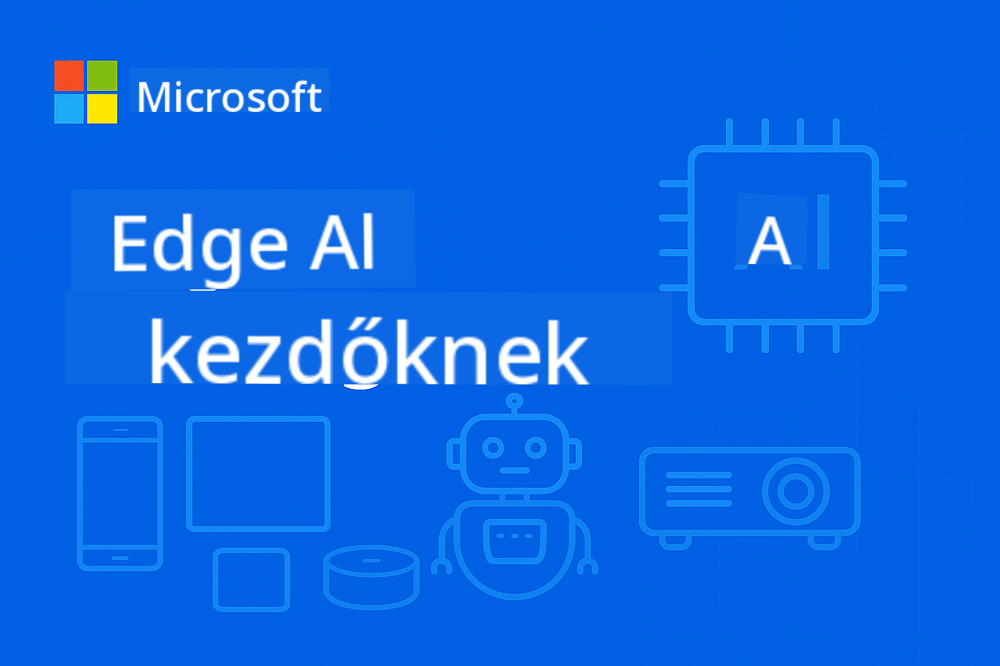

<!--
CO_OP_TRANSLATOR_METADATA:
{
  "original_hash": "dbe223abcd2955df69a08033ff16d389",
  "translation_date": "2025-10-03T08:09:15+00:00",
  "source_file": "README.md",
  "language_code": "hu"
}
-->
# EdgeAI kezdőknek



[](https://GitHub.com/microsoft/edgeai-for-beginners/graphs/contributors)
[](https://GitHub.com/microsoft/edgeai-for-beginners/issues)
[](https://GitHub.com/microsoft/edgeai-for-beginners/pulls)
[](http://makeapullrequest.com)

[](https://GitHub.com/microsoft/edgeai-for-beginners/watchers)
[](https://GitHub.com/microsoft/edgeai-for-beginners/fork)
[](https://GitHub.com/microsoft/edgeai-for-beginners/stargazers)

[](https://discord.com/invite/ByRwuEEgH4)

Kövesd az alábbi lépéseket, hogy elkezdhesd használni ezeket az erőforrásokat:

1. **Forkold a repót**: Kattints [](https://GitHub.com/microsoft/edgeai-for-beginners/fork)
2. **Clone-old a repót**: `git clone https://github.com/microsoft/edgeai-for-beginners.git`
3. [**Csatlakozz az Azure AI Foundry Discordhoz, és találkozz szakértőkkel és fejlesztőkkel**](https://discord.com/invite/ByRwuEEgH4)

### 🌐 Többnyelvű támogatás

#### GitHub Action által támogatott (Automatikus és mindig naprakész)

[Arab](../ar/README.md) | [Bengáli](../bn/README.md) | [Bolgár](../bg/README.md) | [Burmai (Mianmar)](../my/README.md) | [Kínai (Egyszerűsített)](../zh/README.md) | [Kínai (Hagyományos, Hongkong)](../hk/README.md) | [Kínai (Hagyományos, Makaó)](../mo/README.md) | [Kínai (Hagyományos, Tajvan)](../tw/README.md) | [Horvát](../hr/README.md) | [Cseh](../cs/README.md) | [Dán](../da/README.md) | [Holland](../nl/README.md) | [Finn](../fi/README.md) | [Francia](../fr/README.md) | [Német](../de/README.md) | [Görög](../el/README.md) | [Héber](../he/README.md) | [Hindi](../hi/README.md) | [Magyar](./README.md) | [Indonéz](../id/README.md) | [Olasz](../it/README.md) | [Japán](../ja/README.md) | [Koreai](../ko/README.md) | [Maláj](../ms/README.md) | [Maráthi](../mr/README.md) | [Nepáli](../ne/README.md) | [Norvég](../no/README.md) | [Perzsa (Fárszi)](../fa/README.md) | [Lengyel](../pl/README.md) | [Portugál (Brazília)](../br/README.md) | [Portugál (Portugália)](../pt/README.md) | [Pandzsábi (Gurmukhi)](../pa/README.md) | [Román](../ro/README.md) | [Orosz](../ru/README.md) | [Szerb (Cirill)](../sr/README.md) | [Szlovák](../sk/README.md) | [Szlovén](../sl/README.md) | [Spanyol](../es/README.md) | [Szuahéli](../sw/README.md) | [Svéd](../sv/README.md) | [Tagalog (Filippínó)](../tl/README.md) | [Thai](../th/README.md) | [Török](../tr/README.md) | [Ukrán](../uk/README.md) | [Urdu](../ur/README.md) | [Vietnámi](../vi/README.md)

**Ha további fordításokat szeretnél, a támogatott nyelvek listája [itt található](https://github.com/Azure/co-op-translator/blob/main/getting_started/supported-languages.md)**

## Bevezetés

Üdvözlünk az **EdgeAI kezdőknek** kurzusban – egy átfogó utazás az Edge Mesterséges Intelligencia átalakító világába. Ez a kurzus összekapcsolja a hatékony MI képességeket a gyakorlati, valós alkalmazásokkal az edge eszközökön, lehetővé téve, hogy közvetlenül ott használd az MI-t, ahol az adatok keletkeznek és döntéseket kell hozni.

### Amit elsajátíthatsz

Ez a kurzus az alapfogalmaktól a gyártásra kész megvalósításokig vezet, az alábbiakat lefedve:
- **Kis nyelvi modellek (SLM-ek)** optimalizálása edge telepítéshez
- **Hardver-tudatos optimalizálás** különböző platformokon
- **Valós idejű következtetés** adatvédelem mellett
- **Gyártási telepítési stratégiák** vállalati alkalmazásokhoz

### Miért fontos az EdgeAI?

Az EdgeAI egy paradigmaváltást képvisel, amely a modern kihívásokra ad választ:
- **Adatvédelem és biztonság**: Érzékeny adatok helyi feldolgozása, felhőbe való továbbítás nélkül
- **Valós idejű teljesítmény**: Hálózati késleltetés kiküszöbölése időkritikus alkalmazásokhoz
- **Költséghatékonyság**: Sávszélesség és felhőalapú számítási költségek csökkentése
- **Rugalmas működés**: Funkcionalitás fenntartása hálózati kiesés esetén
- **Szabályozási megfelelés**: Adatszuverenitási követelmények teljesítése

### Edge AI

Az Edge AI az MI algoritmusok és nyelvi modellek helyi futtatását jelenti hardveren, közel az adatok keletkezési helyéhez, anélkül, hogy a felhő erőforrásaira támaszkodna a következtetéshez. Ez csökkenti a késleltetést, növeli az adatvédelmet, és lehetővé teszi a valós idejű döntéshozatalt.

### Alapelvek:
- **Eszközön történő következtetés**: MI modellek futtatása edge eszközökön (telefonok, routerek, mikrokontrollerek, ipari PC-k)
- **Offline képesség**: Működés állandó internetkapcsolat nélkül
- **Alacsony késleltetés**: Azonnali válaszok valós idejű rendszerekhez
- **Adatszuverenitás**: Érzékeny adatok helyben tartása, növelve a biztonságot és megfelelőséget

### Kis nyelvi modellek (SLM-ek)

Az olyan SLM-ek, mint a Phi-4, Mistral-7B és Gemma, nagyobb LLM-ek optimalizált verziói – tréningezve vagy desztillálva az alábbiakra:
- **Csökkentett memóriaigény**: Hatékony használat korlátozott edge eszköz memóriával
- **Alacsonyabb számítási igény**: Optimalizálva CPU és edge GPU teljesítményre
- **Gyorsabb indítási idők**: Gyors inicializálás a reszponzív alkalmazásokhoz

Ezek erőteljes NLP képességeket nyújtanak, miközben megfelelnek az alábbi korlátoknak:
- **Beágyazott rendszerek**: IoT eszközök és ipari vezérlők
- **Mobil eszközök**: Okostelefonok és tabletek offline képességekkel
- **IoT eszközök**: Szenzorok és okos eszközök korlátozott erőforrásokkal
- **Edge szerverek**: Helyi feldolgozó egységek korlátozott GPU erőforrásokkal
- **Személyi számítógépek**: Asztali és laptop telepítési forgatókönyvek

## Kurzus modulok és navigáció

| Modul | Téma | Fókuszterület | Kulcsfontosságú tartalom | Szint | Időtartam |
|-------|------|---------------|--------------------------|-------|-----------|
| [📖 00 ](./introduction.md) | [Bevezetés az EdgeAI-ba](./introduction.md) | Alapok és kontextus | EdgeAI áttekintés • Ipari alkalmazások • SLM bevezetés • Tanulási célok | Kezdő | 1-2 óra |
| [📚 01](../../Module01) | [EdgeAI alapok](./Module01/README.md) | Felhő vs Edge AI összehasonlítás | EdgeAI alapok • Valós esettanulmányok • Megvalósítási útmutató • Edge telepítés | Kezdő | 3-4 óra |
| [🧠 02](../../Module02) | [SLM modellek alapjai](./Module02/README.md) | Modellcsaládok és architektúra | Phi család • Qwen család • Gemma család • BitNET • μModel • Phi-Silica | Kezdő | 4-5 óra |
| [🚀 03](../../Module03) | [SLM telepítési gyakorlat](./Module03/README.md) | Helyi és felhő telepítés | Haladó tanulás • Helyi környezet • Felhő telepítés | Középhaladó | 4-5 óra |
| [⚙️ 04](../../Module04) | [Modellek optimalizálási eszköztára](./Module04/README.md) | Keresztplatform optimalizálás | Bevezetés • Llama.cpp • Microsoft Olive • OpenVINO • Apple MLX • Munkafolyamat szintézis | Középhaladó | 5-6 óra |
| [🔧 05](../../Module05) | [SLMOps gyártás](./Module05/README.md) | Gyártási műveletek | SLMOps bevezetés • Modell desztilláció • Finomhangolás • Gyártási telepítés | Haladó | 5-6 óra |
| [🤖 06](../../Module06) | [AI ügynökök és funkcióhívás](./Module06/README.md) | Ügynök keretrendszerek és MCP | Ügynök bevezetés • Funkcióhívás • Modell kontextus protokoll | Haladó | 4-5 óra |
| [💻 07](../../Module07) | [Platform megvalósítás](./Module07/README.md) | Keresztplatform minták | AI eszköztár • Foundry Local • Windows fejlesztés | Haladó | 3-4 óra |
| [🏭 08](../../Module08) | [Foundry Local eszköztár](./Module08/README.md) | Gyártásra kész minták | Mintapéldák (részletek lent) | Szakértő | 8-10 óra |

### 🏭 **08. modul: Mintapéldák**

- [01: REST Chat gyorsindítás](./Module08/samples/01/README.md)
- [02: OpenAI SDK integráció](./Module08/samples/02/README.md)
- [03: Modell felfedezés és benchmarking](./Module08/samples/03/README.md)
- [04: Chainlit RAG alkalmazás](./Module08/samples/04/README.md)
- [05: Többügynökös orkestráció](./Module08/samples/05/README.md)
- [06: Modellek mint eszközök router](./Module08/samples/06/README.md)
- [07: Közvetlen API kliens](./Module08/samples/07/README.md)
- [08: Windows 11 Chat alkalmazás](./Module08/samples/08/README.md)
- [09: Haladó többügynökös rendszer](./Module08/samples/09/README.md)
- [10: Foundry eszközök keretrendszer](./Module08/samples/10/README.md)

### 📊 **Tanulási útvonal összefoglaló**
- **Teljes időtartam**: 36-45 óra
- **Kezdő útvonal**: 01-02 modulok (7-9 óra)  
- **Középhaladó útvonal**: 03-04 modulok (9-11 óra)
- **Haladó útvonal**: 05-07 modulok (12-15 óra)
- **Szakértő útvonal**: 08. modul (8-10 óra)

## Amit építeni fogsz

### 🎯 Alapvető kompetenciák
- **Edge AI architektúra**: Helyi elsődleges MI rendszerek tervezése felhőintegrációval
- **Modell optimalizálás**: Modellek kvantálása és tömörítése edge telepítéshez (85% sebességnövekedés, 75% méretcsökkentés)
- **Többplatformos telepítés**: Windows, mobil, beágyazott és felhő-edge hibrid rendszerek
- **Gyártási műveletek**: Edge AI monitorozása, skálázása és karbantartása gyártásban

### 🏗️ Gyakorlati projektek
- **Foundry Local Chat alkalmazások**: Windows 11 natív alkalmazás modellváltással
- **Többügynökös rendszerek**: Koordinátor specialistákkal összetett munkafolyamatokhoz  
- **RAG alkalmazások**: Helyi dokumentumfeldolgozás vektorkereséssel
- **Modell routerek**: Intelligens modellválasztás feladat elemzése alapján
- **API keretrendszerek**: Gyártásra kész kliensek streaminggel és állapotfigyeléssel
- **Keresztplatform eszközök**: LangChain/Semantic Kernel integrációs minták

### 🏢 Ipari alkalmazások
**Gyártás** • **Egészségügy** • **Autonóm járművek** • **Okos városok** • **Mobil alkalmazások**

## Gyors kezdés

**Ajánlott tanulási útvonal** (összesen 20-30 óra):

0. **📖 Bevezetés** ([Introduction.md](./introduction.md)): EdgeAI alapok + ipari kontextus + tanulási keretrendszer
1. **📚 Alapok** (01-02 modulok): EdgeAI fogalmak + SLM modellcsaládok
2. **⚙️ Optimalizálás** (03-04 modulok): Telepítés + kvantálási keretrendszerek  
3. **🚀 Gyártás** (05-06. modulok): SLMOps + AI ügynökök + funkcióhívás  
4. **💻 Megvalósítás** (07-08. modulok): Platform minták + Foundry Local eszközkészlet  

Minden modul tartalmaz elméletet, gyakorlati feladatokat és gyártásra kész kódmintákat.

## Karrierhatás

**Technikai szerepkörök**: EdgeAI megoldásépítész • ML mérnök (Edge) • IoT AI fejlesztő • Mobil AI fejlesztő  

**Iparágak**: Gyártás 4.0 • Egészségügyi technológia • Autonóm rendszerek • FinTech • Fogyasztói elektronika  

**Portfólió projektek**: Több ügynökös rendszerek • Gyártásra kész RAG alkalmazások • Keresztplatformos telepítés • Teljesítményoptimalizálás  

## Repository felépítése

```
edgeai-for-beginners/
├── 📖 introduction.md  # Foundation: EdgeAI Overview & Learning Framework
├── 📚 Module01-04/     # Fundamentals → SLMs → Deployment → Optimization  
├── 🔧 Module05-06/     # SLMOps → AI Agents → Function Calling
├── 💻 Module07/        # Platform Samples (VS Code, Windows, Jetson, Mobile)
├── 🏭 Module08/        # Foundry Local Toolkit + 10 Comprehensive Samples
│   ├── samples/01-06/  # Foundation: REST, SDK, RAG, Agents, Routing
│   └── samples/07-10/  # Advanced: API Client, Windows App, Enterprise Agents, Tools
├── 🌐 translations/    # Multi-language support (8+ languages)
└── 📋 STUDY_GUIDE.md   # Structured learning paths & time allocation
```
  

## Kurzus kiemelések

✅ **Fokozatos tanulás**: Elmélet → Gyakorlat → Gyártási telepítés  
✅ **Valós esettanulmányok**: Microsoft, Japan Airlines, vállalati megvalósítások  
✅ **Gyakorlati minták**: 50+ példa, 10 átfogó Foundry Local demó  
✅ **Teljesítményközpontúság**: 85%-os sebességnövekedés, 75%-os méretcsökkentés  
✅ **Többplatformos**: Windows, mobil, beágyazott, felhő-edge hibrid  
✅ **Gyártásra kész**: Felügyelet, skálázás, biztonság, megfelelőségi keretrendszerek  

📖 **[Tanulási útmutató elérhető](STUDY_GUIDE.md)**: Strukturált 20 órás tanulási útvonal időbeosztási útmutatóval és önértékelési eszközökkel.

---

**Az EdgeAI az AI telepítés jövőjét képviseli**: helyi elsőbbség, adatvédelem és hatékonyság. Sajátítsd el ezeket a készségeket, hogy megalkosd az intelligens alkalmazások következő generációját.

## Egyéb kurzusok

Csapatunk más kurzusokat is készít! Nézd meg:  

- [MCP kezdőknek](https://github.com/microsoft/mcp-for-beginners)  
- [AI ügynökök kezdőknek](https://github.com/microsoft/ai-agents-for-beginners?WT.mc_id=academic-105485-koreyst)  
- [Generatív AI kezdőknek .NET használatával](https://github.com/microsoft/Generative-AI-for-beginners-dotnet?WT.mc_id=academic-105485-koreyst)  
- [Generatív AI kezdőknek JavaScript használatával](https://github.com/microsoft/generative-ai-with-javascript?WT.mc_id=academic-105485-koreyst)  
- [Generatív AI kezdőknek](https://github.com/microsoft/generative-ai-for-beginners?WT.mc_id=academic-105485-koreyst)  
- [ML kezdőknek](https://aka.ms/ml-beginners?WT.mc_id=academic-105485-koreyst)  
- [Adattudomány kezdőknek](https://aka.ms/datascience-beginners?WT.mc_id=academic-105485-koreyst)  
- [AI kezdőknek](https://aka.ms/ai-beginners?WT.mc_id=academic-105485-koreyst)  
- [Kiberbiztonság kezdőknek](https://github.com/microsoft/Security-101??WT.mc_id=academic-96948-sayoung)  
- [Webfejlesztés kezdőknek](https://aka.ms/webdev-beginners?WT.mc_id=academic-105485-koreyst)  
- [IoT kezdőknek](https://aka.ms/iot-beginners?WT.mc_id=academic-105485-koreyst)  
- [XR fejlesztés kezdőknek](https://github.com/microsoft/xr-development-for-beginners?WT.mc_id=academic-105485-koreyst)  
- [GitHub Copilot mesterfokon AI páros programozáshoz](https://aka.ms/GitHubCopilotAI?WT.mc_id=academic-105485-koreyst)  
- [GitHub Copilot mesterfokon C#/.NET fejlesztőknek](https://github.com/microsoft/mastering-github-copilot-for-dotnet-csharp-developers?WT.mc_id=academic-105485-koreyst)  
- [Válaszd ki saját Copilot kalandodat](https://github.com/microsoft/CopilotAdventures?WT.mc_id=academic-105485-koreyst)  

## Segítségkérés

Ha elakadnál vagy kérdésed van az AI alkalmazások építésével kapcsolatban, csatlakozz:  

[](https://aka.ms/foundry/discord)  

Ha termék-visszajelzésed van vagy hibát tapasztalsz az építés során, látogass el:  

[](https://aka.ms/foundry/forum)  

---

**Felelősségkizárás**:  
Ezt a dokumentumot az [Co-op Translator](https://github.com/Azure/co-op-translator) AI fordítási szolgáltatás segítségével fordították le. Bár törekszünk a pontosságra, kérjük, vegye figyelembe, hogy az automatikus fordítások hibákat vagy pontatlanságokat tartalmazhatnak. Az eredeti dokumentum az eredeti nyelvén tekintendő hiteles forrásnak. Kritikus információk esetén javasolt professzionális emberi fordítást igénybe venni. Nem vállalunk felelősséget a fordítás használatából eredő félreértésekért vagy téves értelmezésekért.