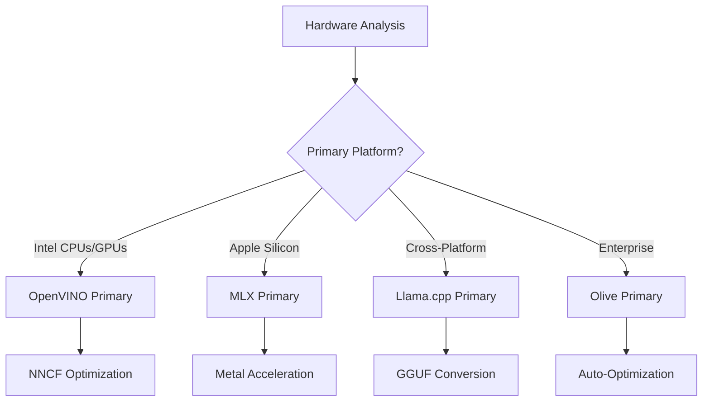
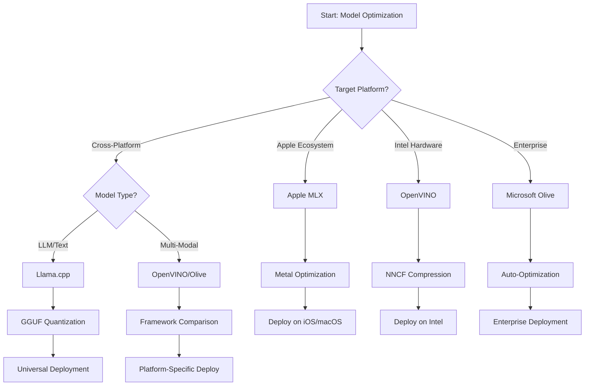
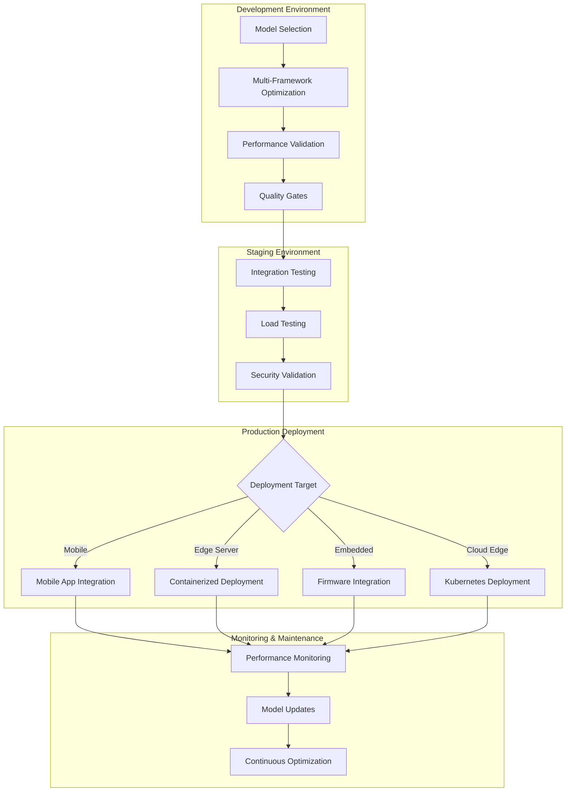

<!--
CO_OP_TRANSLATOR_METADATA:
{
  "original_hash": "6719c4a7e44b948230ac5f5cab3699bd",
  "translation_date": "2025-09-18T14:36:20+00:00",
  "source_file": "Module04/06.workflow-synthesis.md",
  "language_code": "id"
}
-->
# Bagian 6: Sintesis Alur Kerja Pengembangan Edge AI

## Daftar Isi
1. [Pendahuluan](../../../Module04)
2. [Tujuan Pembelajaran](../../../Module04)
3. [Ikhtisar Alur Kerja Terpadu](../../../Module04)
4. [Matriks Pemilihan Kerangka Kerja](../../../Module04)
5. [Sintesis Praktik Terbaik](../../../Module04)
6. [Panduan Strategi Penerapan](../../../Module04)
7. [Alur Kerja Optimasi Performa](../../../Module04)
8. [Daftar Periksa Kesiapan Produksi](../../../Module04)
9. [Pemecahan Masalah dan Pemantauan](../../../Module04)
10. [Masa Depan Pipeline Edge AI Anda](../../../Module04)

## Pendahuluan

Pengembangan Edge AI membutuhkan pemahaman mendalam tentang berbagai kerangka kerja optimasi, strategi penerapan, dan pertimbangan perangkat keras. Sintesis komprehensif ini menggabungkan pengetahuan dari Llama.cpp, Microsoft Olive, OpenVINO, dan Apple MLX untuk menciptakan alur kerja terpadu yang memaksimalkan efisiensi, menjaga kualitas, dan memastikan keberhasilan penerapan produksi.

Sepanjang kursus ini, kita telah mengeksplorasi kerangka kerja optimasi individu, masing-masing dengan kekuatan unik dan kasus penggunaan khusus. Namun, proyek Edge AI di dunia nyata sering kali membutuhkan kombinasi teknik dari berbagai kerangka kerja atau keputusan strategis tentang pendekatan mana yang memberikan hasil terbaik untuk kendala dan kebutuhan tertentu.

Bagian ini mensintesis wawasan kolektif dari semua kerangka kerja menjadi alur kerja yang dapat diterapkan, pohon keputusan, dan praktik terbaik yang memungkinkan Anda membangun solusi Edge AI siap produksi secara efisien dan efektif. Baik Anda mengoptimalkan untuk perangkat seluler, sistem tertanam, atau server edge, panduan ini menyediakan kerangka kerja strategis untuk membuat keputusan yang tepat sepanjang siklus pengembangan Anda.

## Tujuan Pembelajaran

Pada akhir bagian ini, Anda akan dapat:

### Pengambilan Keputusan Strategis
- **Mengevaluasi dan memilih** kerangka kerja optimasi yang optimal berdasarkan kebutuhan proyek, kendala perangkat keras, dan skenario penerapan
- **Merancang alur kerja komprehensif** yang mengintegrasikan berbagai teknik optimasi untuk efisiensi maksimal
- **Menilai trade-off** antara akurasi model, kecepatan inferensi, penggunaan memori, dan kompleksitas penerapan di berbagai kerangka kerja

### Integrasi Alur Kerja
- **Mengimplementasikan pipeline pengembangan terpadu** yang memanfaatkan kekuatan berbagai kerangka kerja optimasi
- **Menciptakan alur kerja yang dapat direproduksi** untuk optimasi model dan penerapan yang konsisten di berbagai lingkungan
- **Menetapkan gerbang kualitas** dan proses validasi untuk memastikan model yang dioptimalkan memenuhi persyaratan produksi

### Optimasi Performa
- **Menerapkan strategi optimasi sistematis** menggunakan kuantisasi, pruning, dan teknik akselerasi spesifik perangkat keras
- **Memantau dan mengukur** performa model di berbagai tingkat optimasi dan target penerapan
- **Mengoptimalkan untuk platform perangkat keras tertentu** termasuk CPU, GPU, NPU, dan akselerator edge khusus

### Penerapan Produksi
- **Merancang arsitektur penerapan yang skalabel** yang mendukung berbagai format model dan mesin inferensi
- **Mengimplementasikan pemantauan dan observabilitas** untuk aplikasi Edge AI di lingkungan produksi
- **Menetapkan alur kerja pemeliharaan** untuk pembaruan model, pemantauan performa, dan optimasi sistem

### Keunggulan Lintas Platform
- **Menerapkan model yang dioptimalkan** di berbagai platform perangkat keras sambil menjaga performa yang konsisten
- **Menangani optimasi spesifik platform** untuk Windows, macOS, Linux, perangkat seluler, dan sistem tertanam
- **Menciptakan lapisan abstraksi** yang memungkinkan penerapan yang mulus di berbagai lingkungan edge

## Ikhtisar Alur Kerja Terpadu

### Fase 1: Analisis Kebutuhan dan Pemilihan Kerangka Kerja

Dasar penerapan Edge AI yang sukses dimulai dengan analisis kebutuhan yang menyeluruh yang menginformasikan pemilihan kerangka kerja dan strategi optimasi.

#### 1.1 Penilaian Perangkat Keras


**Pertimbangan Utama:**
- **Arsitektur CPU**: Kemampuan x86, ARM, Apple Silicon
- **Ketersediaan Akselerator**: GPU, NPU, VPU, chip AI khusus
- **Keterbatasan Memori**: Batasan RAM, kapasitas penyimpanan
- **Anggaran Daya**: Masa pakai baterai, kendala termal
- **Konektivitas**: Kebutuhan offline, batasan bandwidth

#### 1.2 Matriks Kebutuhan Aplikasi

| Kebutuhan | Llama.cpp | Microsoft Olive | OpenVINO | Apple MLX |
|-----------|-----------|-----------------|----------|-----------|
| Lintas platform | ✅ Sangat Baik | ⚡ Baik | ⚡ Baik | ❌ Hanya Apple |
| Integrasi Enterprise | ⚡ Dasar | ✅ Sangat Baik | ✅ Sangat Baik | ⚡ Terbatas |
| Penerapan Seluler | ✅ Sangat Baik | ⚡ Baik | ⚡ Baik | ✅ iOS Sangat Baik |
| Inferensi Real-time | ✅ Sangat Baik | ✅ Sangat Baik | ✅ Sangat Baik | ✅ Sangat Baik |
| Keragaman Model | ✅ Fokus LLM | ✅ Semua Model | ✅ Semua Model | ✅ Fokus LLM |
| Kemudahan Penggunaan | ✅ Sederhana | ✅ Otomatis | ⚡ Sedang | ✅ Sederhana |

### Fase 2: Persiapan dan Optimasi Model

#### 2.1 Pipeline Penilaian Model Universal

```python
# Universal Model Assessment Framework
class EdgeAIModelAssessment:
    def __init__(self, model_path, target_hardware):
        self.model_path = model_path
        self.target_hardware = target_hardware
        self.optimization_frameworks = []
        
    def assess_model_characteristics(self):
        """Analyze model size, architecture, and complexity"""
        return {
            'model_size': self.get_model_size(),
            'parameter_count': self.get_parameter_count(),
            'architecture_type': self.detect_architecture(),
            'quantization_compatibility': self.check_quantization_support()
        }
    
    def recommend_optimization_strategy(self):
        """Recommend optimal frameworks and techniques"""
        characteristics = self.assess_model_characteristics()
        
        if self.target_hardware.startswith('apple'):
            return self.mlx_optimization_strategy(characteristics)
        elif self.target_hardware.startswith('intel'):
            return self.openvino_optimization_strategy(characteristics)
        elif characteristics['model_size'] > 7_000_000_000:  # 7B+ parameters
            return self.enterprise_optimization_strategy(characteristics)
        else:
            return self.lightweight_optimization_strategy(characteristics)
```

#### 2.2 Pipeline Optimasi Multi-Kerangka Kerja

**Pendekatan Optimasi Berurutan:**
1. **Konversi Awal**: Konversi ke format intermediate (ONNX jika memungkinkan)
2. **Optimasi Spesifik Kerangka Kerja**: Terapkan teknik khusus
3. **Validasi Lintas Platform**: Verifikasi performa di platform target
4. **Pengemasan Akhir**: Persiapkan untuk penerapan

```bash
# Multi-Framework Optimization Script
#!/bin/bash

MODEL_NAME="phi-3-mini"
BASE_MODEL="microsoft/Phi-3-mini-4k-instruct"

# Phase 1: ONNX Conversion (Universal)
python convert_to_onnx.py --model $BASE_MODEL --output models/onnx/

# Phase 2: Platform-Specific Optimization
if [[ "$TARGET_PLATFORM" == "intel" ]]; then
    # OpenVINO Optimization
    python optimize_openvino.py --input models/onnx/ --output models/openvino/
elif [[ "$TARGET_PLATFORM" == "apple" ]]; then
    # MLX Optimization
    python optimize_mlx.py --input $BASE_MODEL --output models/mlx/
elif [[ "$TARGET_PLATFORM" == "cross" ]]; then
    # Llama.cpp Optimization
    python convert_to_gguf.py --input models/onnx/ --output models/gguf/
fi

# Phase 3: Validation
python validate_optimization.py --original $BASE_MODEL --optimized models/$TARGET_PLATFORM/
```

### Fase 3: Validasi Performa dan Benchmarking

#### 3.1 Kerangka Benchmarking Komprehensif

```python
class EdgeAIBenchmark:
    def __init__(self, optimized_models):
        self.models = optimized_models
        self.metrics = {
            'inference_time': [],
            'memory_usage': [],
            'accuracy_score': [],
            'throughput': [],
            'energy_consumption': []
        }
    
    def run_comprehensive_benchmark(self):
        """Execute standardized benchmarks across all optimized models"""
        test_inputs = self.generate_test_inputs()
        
        for model_framework, model_path in self.models.items():
            print(f"Benchmarking {model_framework}...")
            
            # Latency Testing
            latency = self.measure_inference_latency(model_path, test_inputs)
            
            # Memory Profiling
            memory = self.profile_memory_usage(model_path)
            
            # Accuracy Validation
            accuracy = self.validate_model_accuracy(model_path, test_inputs)
            
            # Throughput Analysis
            throughput = self.measure_throughput(model_path)
            
            self.record_metrics(model_framework, latency, memory, accuracy, throughput)
    
    def generate_optimization_report(self):
        """Create comprehensive comparison report"""
        report = {
            'recommendations': self.analyze_performance_trade_offs(),
            'deployment_guidance': self.generate_deployment_recommendations(),
            'monitoring_requirements': self.define_monitoring_metrics()
        }
        return report
```

## Matriks Pemilihan Kerangka Kerja

### Pohon Keputusan untuk Pemilihan Kerangka Kerja



### Kriteria Pemilihan Komprehensif

#### 1. Penyesuaian Kasus Penggunaan Utama

**Model Bahasa Besar (LLMs):**
- **Llama.cpp**: Terbaik untuk penerapan berbasis CPU lintas platform
- **Apple MLX**: Optimal untuk Apple Silicon dengan memori terpadu
- **OpenVINO**: Sangat baik untuk perangkat keras Intel dengan optimasi NNCF
- **Microsoft Olive**: Ideal untuk alur kerja enterprise dengan otomatisasi

**Model Multi-Modal:**
- **OpenVINO**: Dukungan komprehensif untuk visi, audio, dan teks
- **Microsoft Olive**: Optimasi tingkat enterprise untuk pipeline kompleks
- **Llama.cpp**: Terbatas pada model berbasis teks
- **Apple MLX**: Dukungan yang berkembang untuk aplikasi multi-modal

#### 2. Matriks Platform Perangkat Keras

| Platform | Kerangka Kerja Utama | Opsi Sekunder | Fitur Khusus |
|----------|------------------|------------------|---------------------|
| Intel CPU/GPU | OpenVINO | Microsoft Olive | Kompresi NNCF, optimasi Intel |
| NVIDIA GPU | Microsoft Olive | OpenVINO | Akselerasi CUDA, fitur enterprise |
| Apple Silicon | Apple MLX | Llama.cpp | Metal shaders, memori terpadu |
| ARM Mobile | Llama.cpp | OpenVINO | Lintas platform, dependensi minimal |
| Edge TPU | OpenVINO | Microsoft Olive | Dukungan akselerator khusus |
| ARM Tertanam | Llama.cpp | OpenVINO | Jejak minimal, inferensi efisien |

#### 3. Preferensi Alur Kerja Pengembangan

**Prototipe Cepat:**
1. **Llama.cpp**: Pengaturan tercepat, hasil langsung
2. **Apple MLX**: API Python sederhana, iterasi cepat
3. **Microsoft Olive**: Optimasi otomatis, konfigurasi minimal
4. **OpenVINO**: Pengaturan lebih kompleks, fitur komprehensif

**Produksi Enterprise:**
1. **Microsoft Olive**: Fitur enterprise, integrasi Azure
2. **OpenVINO**: Ekosistem Intel, alat komprehensif
3. **Apple MLX**: Aplikasi enterprise spesifik Apple
4. **Llama.cpp**: Penerapan sederhana, fitur enterprise terbatas

## Sintesis Praktik Terbaik

### Prinsip Optimasi Universal

#### 1. Strategi Optimasi Progresif

```python
class ProgressiveOptimization:
    def __init__(self, base_model):
        self.base_model = base_model
        self.optimization_stages = [
            'baseline_measurement',
            'format_conversion',
            'quantization_optimization',
            'hardware_acceleration',
            'production_validation'
        ]
    
    def execute_progressive_optimization(self):
        """Apply optimization techniques incrementally"""
        
        # Stage 1: Baseline Measurement
        baseline_metrics = self.measure_baseline_performance()
        
        # Stage 2: Format Conversion
        converted_model = self.convert_to_optimal_format()
        conversion_metrics = self.measure_performance(converted_model)
        
        # Stage 3: Quantization
        quantized_model = self.apply_quantization(converted_model)
        quantization_metrics = self.measure_performance(quantized_model)
        
        # Stage 4: Hardware Acceleration
        accelerated_model = self.enable_hardware_acceleration(quantized_model)
        acceleration_metrics = self.measure_performance(accelerated_model)
        
        # Stage 5: Validation
        production_ready = self.validate_for_production(accelerated_model)
        
        return self.compile_optimization_report(
            baseline_metrics, conversion_metrics, 
            quantization_metrics, acceleration_metrics
        )
```

#### 2. Implementasi Gerbang Kualitas

**Gerbang Pelestarian Akurasi:**
- Mempertahankan >95% akurasi model asli
- Validasi terhadap dataset uji representatif
- Terapkan pengujian A/B untuk validasi produksi

**Gerbang Peningkatan Performa:**
- Mencapai peningkatan kecepatan minimal 2x
- Mengurangi jejak memori setidaknya 50%
- Validasi konsistensi waktu inferensi

**Gerbang Kesiapan Produksi:**
- Lulus pengujian stres di bawah beban
- Menunjukkan performa stabil dari waktu ke waktu
- Validasi persyaratan keamanan dan privasi

### Integrasi Praktik Terbaik Spesifik Kerangka Kerja

#### 1. Sintesis Strategi Kuantisasi

```python
# Unified Quantization Approach
class UnifiedQuantizationStrategy:
    def __init__(self, model, target_platform):
        self.model = model
        self.platform = target_platform
        
    def select_optimal_quantization(self):
        """Choose best quantization based on platform and requirements"""
        
        if self.platform == 'apple_silicon':
            return self.mlx_quantization_strategy()
        elif self.platform == 'intel_hardware':
            return self.openvino_quantization_strategy()
        elif self.platform == 'cross_platform':
            return self.llamacpp_quantization_strategy()
        else:
            return self.olive_quantization_strategy()
    
    def mlx_quantization_strategy(self):
        """Apple MLX-specific quantization"""
        return {
            'method': 'mlx_quantize',
            'precision': 'int4',
            'group_size': 64,
            'optimization_target': 'unified_memory'
        }
    
    def openvino_quantization_strategy(self):
        """OpenVINO NNCF quantization"""
        return {
            'method': 'nncf_quantize',
            'precision': 'int8',
            'calibration_method': 'post_training',
            'optimization_target': 'intel_hardware'
        }
```

#### 2. Optimasi Akselerasi Perangkat Keras

**Sintesis Optimasi CPU:**
- **Instruksi SIMD**: Manfaatkan kernel yang dioptimalkan di berbagai kerangka kerja
- **Bandwidth Memori**: Optimalkan tata letak data untuk efisiensi cache
- **Threading**: Seimbangkan paralelisme dengan kendala sumber daya

**Praktik Terbaik Akselerasi GPU:**
- **Pemrosesan Batch**: Maksimalkan throughput dengan ukuran batch yang sesuai
- **Manajemen Memori**: Optimalkan alokasi memori GPU dan transfer
- **Presisi**: Gunakan FP16 jika didukung untuk performa lebih baik

**Optimasi NPU/Akselerator Khusus:**
- **Arsitektur Model**: Pastikan kompatibilitas dengan kemampuan akselerator
- **Aliran Data**: Optimalkan pipeline input/output untuk efisiensi akselerator
- **Strategi Cadangan**: Terapkan fallback CPU untuk operasi yang tidak didukung

## Panduan Strategi Penerapan

### Arsitektur Penerapan Universal



### Pola Penerapan Spesifik Platform

#### 1. Strategi Penerapan Seluler

```yaml
# Mobile Deployment Configuration
mobile_deployment:
  ios:
    framework: apple_mlx
    optimization:
      quantization: int4
      memory_mapping: true
      background_execution: limited
    packaging:
      format: mlx
      bundle_size: <50MB
      
  android:
    framework: llama_cpp
    optimization:
      quantization: q4_k_m
      threading: android_optimized
      memory_management: conservative
    packaging:
      format: gguf
      apk_size: <100MB
      
  cross_platform:
    framework: onnx_runtime
    optimization:
      quantization: int8
      execution_provider: cpu
    packaging:
      format: onnx
      shared_libraries: minimal
```

#### 2. Penerapan Server Edge

```yaml
# Edge Server Deployment Configuration
edge_server:
  intel_based:
    framework: openvino
    optimization:
      quantization: int8
      acceleration: cpu_gpu_auto
      batch_processing: dynamic
    deployment:
      container: openvino_runtime
      orchestration: kubernetes
      scaling: horizontal
      
  nvidia_based:
    framework: microsoft_olive
    optimization:
      quantization: int4
      acceleration: cuda
      tensor_parallelism: true
    deployment:
      container: nvidia_triton
      orchestration: kubernetes
      scaling: gpu_aware
```

### Praktik Terbaik Kontainerisasi

```dockerfile
# Multi-Framework Edge AI Container
FROM ubuntu:22.04 as base

# Install common dependencies
RUN apt-get update && apt-get install -y \
    python3 \
    python3-pip \
    build-essential \
    cmake \
    && rm -rf /var/lib/apt/lists/*

# Framework-specific stages
FROM base as openvino
RUN pip install openvino nncf optimum[intel]

FROM base as llamacpp
RUN git clone https://github.com/ggerganov/llama.cpp.git \
    && cd llama.cpp && make LLAMA_OPENBLAS=1

FROM base as olive
RUN pip install olive-ai[auto-opt] onnxruntime-genai

# Production stage with selected framework
FROM openvino as production
COPY models/ /app/models/
COPY src/ /app/src/
WORKDIR /app

EXPOSE 8080
CMD ["python3", "src/inference_server.py"]
```

## Alur Kerja Optimasi Performa

### Penyempurnaan Performa Sistematis

#### 1. Pipeline Profiling Performa

```python
class EdgeAIPerformanceProfiler:
    def __init__(self, model_path, framework):
        self.model_path = model_path
        self.framework = framework
        self.profiling_results = {}
    
    def comprehensive_profiling(self):
        """Execute comprehensive performance analysis"""
        
        # CPU Profiling
        cpu_profile = self.profile_cpu_usage()
        
        # Memory Profiling
        memory_profile = self.profile_memory_usage()
        
        # Inference Latency
        latency_profile = self.profile_inference_latency()
        
        # Throughput Analysis
        throughput_profile = self.profile_throughput()
        
        # Energy Consumption (where available)
        energy_profile = self.profile_energy_consumption()
        
        return self.compile_performance_report(
            cpu_profile, memory_profile, latency_profile,
            throughput_profile, energy_profile
        )
    
    def identify_bottlenecks(self):
        """Automatically identify performance bottlenecks"""
        bottlenecks = []
        
        if self.profiling_results['cpu_utilization'] > 80:
            bottlenecks.append('cpu_bound')
        
        if self.profiling_results['memory_usage'] > 90:
            bottlenecks.append('memory_bound')
        
        if self.profiling_results['inference_variance'] > 20:
            bottlenecks.append('inconsistent_performance')
        
        return self.generate_optimization_recommendations(bottlenecks)
```

#### 2. Pipeline Optimasi Otomatis

```python
class AutomatedOptimizationPipeline:
    def __init__(self, base_model, target_constraints):
        self.base_model = base_model
        self.constraints = target_constraints
        self.optimization_history = []
    
    def execute_optimization_search(self):
        """Systematically search optimization space"""
        
        optimization_candidates = [
            {'quantization': 'int8', 'pruning': 0.1},
            {'quantization': 'int4', 'pruning': 0.2},
            {'quantization': 'int8', 'acceleration': 'gpu'},
            {'quantization': 'int4', 'acceleration': 'npu'}
        ]
        
        best_configuration = None
        best_score = 0
        
        for config in optimization_candidates:
            optimized_model = self.apply_optimization(config)
            score = self.evaluate_optimization(optimized_model)
            
            if score > best_score and self.meets_constraints(optimized_model):
                best_score = score
                best_configuration = config
            
            self.optimization_history.append({
                'config': config,
                'score': score,
                'model': optimized_model
            })
        
        return best_configuration, self.optimization_history
```

### Optimasi Multi-Objektif

#### 1. Optimasi Pareto untuk Edge AI

```python
class ParetoOptimization:
    def __init__(self, objectives=['speed', 'accuracy', 'memory']):
        self.objectives = objectives
        self.pareto_frontier = []
    
    def find_pareto_optimal_solutions(self, optimization_results):
        """Identify Pareto-optimal configurations"""
        
        for result in optimization_results:
            is_dominated = False
            
            for frontier_point in self.pareto_frontier:
                if self.dominates(frontier_point, result):
                    is_dominated = True
                    break
            
            if not is_dominated:
                # Remove dominated points from frontier
                self.pareto_frontier = [
                    point for point in self.pareto_frontier 
                    if not self.dominates(result, point)
                ]
                
                self.pareto_frontier.append(result)
        
        return self.pareto_frontier
    
    def recommend_configuration(self, user_preferences):
        """Recommend configuration based on user preferences"""
        
        weighted_scores = []
        for config in self.pareto_frontier:
            score = sum(
                user_preferences[obj] * config['metrics'][obj] 
                for obj in self.objectives
            )
            weighted_scores.append((score, config))
        
        return max(weighted_scores, key=lambda x: x[0])[1]
```

## Daftar Periksa Kesiapan Produksi

### Validasi Produksi Komprehensif

#### 1. Jaminan Kualitas Model

```python
class ProductionReadinessValidator:
    def __init__(self, optimized_model, production_requirements):
        self.model = optimized_model
        self.requirements = production_requirements
        self.validation_results = {}
    
    def validate_model_quality(self):
        """Comprehensive model quality validation"""
        
        # Accuracy Validation
        accuracy_result = self.validate_accuracy()
        
        # Performance Validation
        performance_result = self.validate_performance()
        
        # Robustness Testing
        robustness_result = self.validate_robustness()
        
        # Security Assessment
        security_result = self.validate_security()
        
        # Compliance Verification
        compliance_result = self.validate_compliance()
        
        return self.compile_validation_report(
            accuracy_result, performance_result, robustness_result,
            security_result, compliance_result
        )
    
    def generate_certification_report(self):
        """Generate production certification report"""
        return {
            'model_signature': self.generate_model_signature(),
            'validation_timestamp': datetime.now(),
            'validation_results': self.validation_results,
            'deployment_approval': self.check_deployment_approval(),
            'monitoring_requirements': self.define_monitoring_requirements()
        }
```

#### 2. Daftar Periksa Penerapan Produksi

**Validasi Pra-Penerapan:**
- [ ] Akurasi model memenuhi persyaratan minimum (>95% dari baseline)
- [ ] Target performa tercapai (latensi, throughput, memori)
- [ ] Kerentanan keamanan dinilai dan diatasi
- [ ] Pengujian stres selesai di bawah beban yang diharapkan
- [ ] Skenario kegagalan diuji dan prosedur pemulihan divalidasi
- [ ] Sistem pemantauan dan peringatan dikonfigurasi
- [ ] Prosedur rollback diuji dan didokumentasikan

**Proses Penerapan:**
- [ ] Strategi penerapan blue-green diimplementasikan
- [ ] Peningkatan lalu lintas secara bertahap dikonfigurasi
- [ ] Dashboard pemantauan real-time aktif
- [ ] Baseline performa ditetapkan
- [ ] Ambang batas tingkat kesalahan didefinisikan
- [ ] Pemicu rollback otomatis dikonfigurasi

**Pemantauan Pasca-Penerapan:**
- [ ] Deteksi drift model aktif
- [ ] Peringatan degradasi performa dikonfigurasi
- [ ] Pemantauan pemanfaatan sumber daya diaktifkan
- [ ] Metrik pengalaman pengguna dilacak
- [ ] Versi dan silsilah model dipertahankan
- [ ] Tinjauan performa model secara berkala dijadwalkan

### Integrasi/Penerapan Berkelanjutan (CI/CD)

```yaml
# Edge AI CI/CD Pipeline Configuration
edge_ai_pipeline:
  stages:
    - model_validation
    - optimization
    - testing
    - staging_deployment
    - production_deployment
    - monitoring
  
  model_validation:
    accuracy_threshold: 0.95
    performance_baseline: required
    security_scan: enabled
    
  optimization:
    frameworks:
      - llama_cpp
      - openvino
      - microsoft_olive
    validation:
      cross_validation: enabled
      performance_comparison: required
      
  testing:
    unit_tests: comprehensive
    integration_tests: full_pipeline
    load_tests: production_scale
    security_tests: comprehensive
    
  deployment:
    strategy: blue_green
    traffic_ramping: gradual
    rollback: automatic
    monitoring: real_time
```

## Pemecahan Masalah dan Pemantauan

### Kerangka Pemecahan Masalah Universal

#### 1. Masalah Umum dan Solusi

**Masalah Performa:**
```python
class PerformanceTroubleshooter:
    def __init__(self, model_metrics):
        self.metrics = model_metrics
        
    def diagnose_performance_issues(self):
        """Systematic performance issue diagnosis"""
        
        issues = []
        
        # High latency diagnosis
        if self.metrics['avg_latency'] > self.metrics['target_latency']:
            issues.append(self.diagnose_latency_issues())
        
        # Memory usage diagnosis
        if self.metrics['memory_usage'] > self.metrics['memory_limit']:
            issues.append(self.diagnose_memory_issues())
        
        # Throughput diagnosis
        if self.metrics['throughput'] < self.metrics['target_throughput']:
            issues.append(self.diagnose_throughput_issues())
        
        return self.generate_resolution_plan(issues)
    
    def diagnose_latency_issues(self):
        """Specific latency troubleshooting"""
        potential_causes = []
        
        if self.metrics['cpu_utilization'] > 80:
            potential_causes.append('cpu_bottleneck')
        
        if self.metrics['memory_bandwidth'] > 90:
            potential_causes.append('memory_bandwidth_limit')
        
        if self.metrics['model_size'] > self.metrics['optimal_size']:
            potential_causes.append('model_too_large')
        
        return {
            'issue': 'high_latency',
            'causes': potential_causes,
            'solutions': self.generate_latency_solutions(potential_causes)
        }
```

**Pemecahan Masalah Spesifik Kerangka Kerja:**

| Masalah | Llama.cpp | Microsoft Olive | OpenVINO | Apple MLX |
|---------|-----------|-----------------|----------|-----------|
| Masalah Memori | Kurangi panjang konteks | Turunkan ukuran batch | Aktifkan caching | Gunakan memory mapping |
| Inferensi Lambat | Aktifkan SIMD | Periksa kuantisasi | Optimalkan threading | Aktifkan Metal |
| Kehilangan Akurasi | Kuantisasi lebih tinggi | Latih ulang dengan QAT | Tingkatkan kalibrasi | Fine-tune pasca-kuantisasi |
| Kompatibilitas | Periksa format model | Verifikasi versi kerangka kerja | Perbarui driver | Periksa versi macOS |

#### 2. Strategi Pemantauan Produksi

```python
class EdgeAIMonitoring:
    def __init__(self, deployment_config):
        self.config = deployment_config
        self.metrics_collectors = []
        self.alerting_rules = []
    
    def setup_comprehensive_monitoring(self):
        """Configure comprehensive monitoring for Edge AI deployment"""
        
        # Model Performance Monitoring
        self.setup_model_performance_monitoring()
        
        # Infrastructure Monitoring
        self.setup_infrastructure_monitoring()
        
        # Business Metrics Monitoring
        self.setup_business_metrics_monitoring()
        
        # Security Monitoring
        self.setup_security_monitoring()
    
    def setup_model_performance_monitoring(self):
        """Model-specific performance monitoring"""
        metrics = [
            'inference_latency_p50',
            'inference_latency_p95',
            'inference_latency_p99',
            'model_accuracy_drift',
            'prediction_confidence_distribution',
            'error_rate',
            'throughput_requests_per_second'
        ]
        
        for metric in metrics:
            self.add_metric_collector(metric)
            self.add_alerting_rule(metric)
    
    def detect_model_drift(self):
        """Automated model drift detection"""
        drift_indicators = [
            self.statistical_drift_detection(),
            self.performance_drift_detection(),
            self.data_distribution_shift_detection()
        ]
        
        return self.aggregate_drift_signals(drift_indicators)
```

### Resolusi Masalah Otomatis

```python
class AutomatedIssueResolution:
    def __init__(self, monitoring_system):
        self.monitoring = monitoring_system
        self.resolution_strategies = {}
    
    def handle_performance_degradation(self, alert):
        """Automated performance issue resolution"""
        
        if alert['type'] == 'high_latency':
            return self.resolve_latency_issue(alert)
        elif alert['type'] == 'high_memory_usage':
            return self.resolve_memory_issue(alert)
        elif alert['type'] == 'accuracy_drift':
            return self.resolve_accuracy_issue(alert)
        
    def resolve_latency_issue(self, alert):
        """Automated latency issue resolution"""
        resolution_steps = [
            'increase_cpu_allocation',
            'enable_model_caching',
            'reduce_batch_size',
            'switch_to_quantized_model'
        ]
        
        for step in resolution_steps:
            if self.apply_resolution_step(step):
                return f"Resolved latency issue with: {step}"
        
        return "Escalating to human operator"
```

## Masa Depan Pipeline Edge AI Anda

### Integrasi Teknologi Baru

#### 1. Dukungan Perangkat Keras Generasi Berikutnya

```python
class FutureHardwareIntegration:
    def __init__(self):
        self.supported_accelerators = [
            'npu_next_gen',
            'quantum_processors',
            'neuromorphic_chips',
            'optical_processors'
        ]
    
    def design_adaptive_pipeline(self):
        """Create hardware-agnostic optimization pipeline"""
        
        pipeline = {
            'model_preparation': self.universal_model_preparation(),
            'hardware_detection': self.dynamic_hardware_detection(),
            'optimization_selection': self.adaptive_optimization_selection(),
            'performance_validation': self.hardware_agnostic_validation()
        }
        
        return pipeline
    
    def adaptive_optimization_selection(self):
        """Dynamically select optimization based on available hardware"""
        
        def optimize_for_hardware(model, available_hardware):
            if 'npu' in available_hardware:
                return self.npu_optimization(model)
            elif 'quantum' in available_hardware:
                return self.quantum_optimization(model)
            elif 'neuromorphic' in available_hardware:
                return self.neuromorphic_optimization(model)
            else:
                return self.fallback_optimization(model)
        
        return optimize_for_hardware
```

#### 2. Evolusi Arsitektur Model

**Dukungan untuk Arsitektur Baru:**
- **Mixture of Experts (MoE)**: Arsitektur model sparse untuk efisiensi
- **Retrieval-Augmented Generation**: Sistem model hybrid + basis pengetahuan
- **Model Multimodal**: Integrasi Visi + Bahasa + Audio
- **Federated Learning**: Pelatihan dan optimasi terdistribusi

```python
class NextGenModelSupport:
    def __init__(self):
        self.architecture_handlers = {
            'moe': self.handle_mixture_of_experts,
            'rag': self.handle_retrieval_augmented,
            'multimodal': self.handle_multimodal,
            'federated': self.handle_federated_learning
        }
    
    def handle_mixture_of_experts(self, model):
        """Optimize Mixture of Experts models for edge deployment"""
        optimization_strategy = {
            'expert_pruning': True,
            'routing_optimization': True,
            'expert_quantization': 'per_expert',
            'load_balancing': 'dynamic'
        }
        return self.apply_moe_optimization(model, optimization_strategy)
```

### Pembelajaran dan Adaptasi Berkelanjutan

#### 1. Integrasi Pembelajaran Online

```python
class EdgeOnlineLearning:
    def __init__(self, base_model, learning_rate=0.001):
        self.base_model = base_model
        self.learning_rate = learning_rate
        self.adaptation_buffer = []
    
    def continuous_adaptation(self, new_data, feedback):
        """Continuously adapt model based on edge data"""
        
        # Privacy-preserving local adaptation
        local_updates = self.compute_local_gradients(new_data, feedback)
        
        # Apply updates with constraints
        adapted_model = self.apply_constrained_updates(
            self.base_model, local_updates
        )
        
        # Validate adaptation quality
        if self.validate_adaptation(adapted_model):
            self.base_model = adapted_model
            return True
        
        return False
    
    def federated_learning_participation(self):
        """Participate in federated learning while preserving privacy"""
        
        # Compute local model updates
        local_updates = self.compute_private_updates()
        
        # Differential privacy protection
        private_updates = self.apply_differential_privacy(local_updates)
        
        # Share with federated learning coordinator
        return self.share_updates(private_updates)
```

#### 2. Keberlanjutan dan Green AI

```python
class GreenEdgeAI:
    def __init__(self, sustainability_targets):
        self.targets = sustainability_targets
        self.energy_monitor = EnergyMonitor()
    
    def optimize_for_sustainability(self, model):
        """Optimize model for minimal environmental impact"""
        
        optimization_objectives = [
            'minimize_energy_consumption',
            'maximize_hardware_utilization',
            'reduce_model_training_cost',
            'extend_device_lifetime'
        ]
        
        return self.multi_objective_green_optimization(
            model, optimization_objectives
        )
    
    def carbon_aware_deployment(self):
        """Deploy models considering carbon footprint"""
        
        deployment_strategy = {
            'prefer_renewable_energy_regions': True,
            'optimize_for_energy_efficiency': True,
            'minimize_data_transfer': True,
            'lifecycle_carbon_accounting': True
        }
        
        return deployment_strategy
```

## Kesimpulan

Sintesis alur kerja komprehensif ini merupakan puncak dari pengetahuan optimasi Edge AI, menggabungkan praktik terbaik dari semua kerangka kerja optimasi utama ke dalam pendekatan terpadu yang siap produksi. Dengan mengikuti panduan ini, Anda akan dapat:

**Mencapai Performa Optimal**: Melalui pemilihan kerangka kerja yang sistematis, optimasi progresif, dan validasi komprehensif, memastikan aplikasi Edge AI Anda memberikan efisiensi maksimal.

**Memastikan Kesiapan Produksi**: Dengan pengujian menyeluruh, pemantauan, dan gerbang kualitas yang menjamin penerapan dan operasi yang andal di lingkungan dunia nyata.

**Mempertahankan Kesuksesan Jangka Panjang**: Melalui pemantauan berkelanjutan, resolusi masalah otomatis, dan strategi adaptasi yang menjaga solusi Edge AI Anda tetap performatif dan relevan.

**Melindungi Investasi Anda di Masa Depan**: Dengan merancang pipeline fleksibel yang tidak bergantung pada perangkat keras dan dapat berkembang dengan teknologi dan kebutuhan yang muncul.

Lanskap Edge AI terus berkembang dengan cepat, dengan platform perangkat keras baru, teknik optimasi, dan strategi penerapan yang terus bermunculan. Sintesis ini memberikan dasar untuk menavigasi kompleksitas ini sambil membangun solusi Edge AI yang tangguh, efisien, dan dapat dipelihara yang memberikan nilai nyata di lingkungan produksi.
Ingatlah bahwa strategi optimasi terbaik adalah yang memenuhi kebutuhan spesifik Anda sambil tetap mempertahankan fleksibilitas untuk beradaptasi seiring perkembangan kebutuhan tersebut. Gunakan panduan ini sebagai kerangka kerja untuk membuat keputusan yang tepat, tetapi selalu validasi pilihan Anda melalui pengujian empiris dan pengalaman penerapan di dunia nyata.

## ➡️ Langkah Selanjutnya

Lanjutkan perjalanan Edge AI Anda dengan menjelajahi [Module 5: SLMOps dan Produksi Deployment](../Module05/README.md) untuk mempelajari aspek operasional dalam pengelolaan siklus hidup Small Language Model.

---

**Penafian**:  
Dokumen ini telah diterjemahkan menggunakan layanan penerjemahan AI [Co-op Translator](https://github.com/Azure/co-op-translator). Meskipun kami berusaha untuk memberikan hasil yang akurat, harap diingat bahwa terjemahan otomatis mungkin mengandung kesalahan atau ketidakakuratan. Dokumen asli dalam bahasa aslinya harus dianggap sebagai sumber yang otoritatif. Untuk informasi yang bersifat kritis, disarankan menggunakan jasa penerjemahan profesional oleh manusia. Kami tidak bertanggung jawab atas kesalahpahaman atau penafsiran yang keliru yang timbul dari penggunaan terjemahan ini.