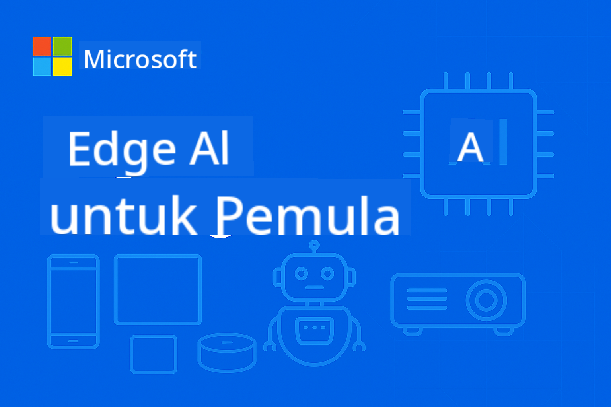

<!--
CO_OP_TRANSLATOR_METADATA:
{
  "original_hash": "c817161ba08864340737d623f761b9ae",
  "translation_date": "2025-09-18T13:29:01+00:00",
  "source_file": "README.md",
  "language_code": "id"
}
-->
# EdgeAI untuk Pemula



[](https://GitHub.com/microsoft/edgeai-for-beginners/graphs/contributors)  
[](https://GitHub.com/microsoft/edgeai-for-beginners/issues)  
[](https://GitHub.com/microsoft/edgeai-for-beginners/pulls)  
[](http://makeapullrequest.com)  

[](https://GitHub.com/microsoft/edgeai-for-beginners/watchers)  
[](https://GitHub.com/microsoft/edgeai-for-beginners/fork)  
[](https://GitHub.com/microsoft/edgeai-for-beginners/stargazers)  

[](https://discord.com/invite/ByRwuEEgH4)

Ikuti langkah-langkah berikut untuk mulai menggunakan sumber daya ini:

1. **Fork Repository**: Klik [](https://GitHub.com/microsoft/edgeai-for-beginners/fork)  
2. **Clone Repository**: `git clone https://github.com/microsoft/edgeai-for-beginners.git`  
3. [**Bergabunglah dengan Azure AI Foundry Discord dan temui para ahli serta pengembang lainnya**](https://discord.com/invite/ByRwuEEgH4)

### 🌐 Dukungan Multi-Bahasa

#### Didukung melalui GitHub Action (Otomatis & Selalu Terbaru)

[Arab](../ar/README.md) | [Bengali](../bn/README.md) | [Bulgaria](../bg/README.md) | [Burma (Myanmar)](../my/README.md) | [Cina (Sederhana)](../zh/README.md) | [Cina (Tradisional, Hong Kong)](../hk/README.md) | [Cina (Tradisional, Makau)](../mo/README.md) | [Cina (Tradisional, Taiwan)](../tw/README.md) | [Kroasia](../hr/README.md) | [Ceko](../cs/README.md) | [Denmark](../da/README.md) | [Belanda](../nl/README.md) | [Finlandia](../fi/README.md) | [Prancis](../fr/README.md) | [Jerman](../de/README.md) | [Yunani](../el/README.md) | [Ibrani](../he/README.md) | [Hindi](../hi/README.md) | [Hungaria](../hu/README.md) | [Indonesia](./README.md) | [Italia](../it/README.md) | [Jepang](../ja/README.md) | [Korea](../ko/README.md) | [Melayu](../ms/README.md) | [Marathi](../mr/README.md) | [Nepali](../ne/README.md) | [Norwegia](../no/README.md) | [Persia (Farsi)](../fa/README.md) | [Polandia](../pl/README.md) | [Portugis (Brasil)](../br/README.md) | [Portugis (Portugal)](../pt/README.md) | [Punjabi (Gurmukhi)](../pa/README.md) | [Rumania](../ro/README.md) | [Rusia](../ru/README.md) | [Serbia (Kiril)](../sr/README.md) | [Slovakia](../sk/README.md) | [Slovenia](../sl/README.md) | [Spanyol](../es/README.md) | [Swahili](../sw/README.md) | [Swedia](../sv/README.md) | [Tagalog (Filipina)](../tl/README.md) | [Thailand](../th/README.md) | [Turki](../tr/README.md) | [Ukraina](../uk/README.md) | [Urdu](../ur/README.md) | [Vietnam](../vi/README.md)

**Jika Anda ingin mendukung bahasa tambahan, daftar bahasa yang didukung tersedia [di sini](https://github.com/Azure/co-op-translator/blob/main/getting_started/supported-languages.md)**

## Pengantar

Selamat datang di **EdgeAI untuk Pemula** – perjalanan komprehensif Anda ke dunia transformasi Kecerdasan Buatan di Edge. Kursus ini menjembatani kesenjangan antara kemampuan AI yang kuat dan penerapan praktis di perangkat edge, memungkinkan Anda memanfaatkan potensi AI langsung di tempat data dihasilkan dan keputusan perlu dibuat.

### Apa yang Akan Anda Kuasai

Kursus ini membawa Anda dari konsep dasar hingga implementasi siap produksi, mencakup:
- **Small Language Models (SLMs)** yang dioptimalkan untuk penerapan di edge
- **Optimasi berbasis perangkat keras** di berbagai platform
- **Inferensi waktu nyata** dengan kemampuan menjaga privasi
- **Strategi penerapan produksi** untuk aplikasi perusahaan

### Mengapa EdgeAI Penting

Edge AI mewakili perubahan paradigma yang mengatasi tantangan modern yang kritis:
- **Privasi & Keamanan**: Memproses data sensitif secara lokal tanpa eksposur ke cloud
- **Performa Waktu Nyata**: Menghilangkan latensi jaringan untuk aplikasi yang membutuhkan waktu respons cepat
- **Efisiensi Biaya**: Mengurangi biaya bandwidth dan komputasi cloud
- **Operasi Tangguh**: Mempertahankan fungsi selama gangguan jaringan
- **Kepatuhan Regulasi**: Memenuhi persyaratan kedaulatan data

### Edge AI

Edge AI mengacu pada menjalankan algoritma AI dan model bahasa secara lokal di perangkat keras—dekat dengan tempat data dihasilkan—tanpa bergantung pada sumber daya cloud untuk inferensi. Ini mengurangi latensi, meningkatkan privasi, dan memungkinkan pengambilan keputusan waktu nyata.

### Prinsip Utama:
- **Inferensi di perangkat**: Model AI berjalan di perangkat edge (ponsel, router, mikrokontroler, PC industri)
- **Kemampuan offline**: Berfungsi tanpa konektivitas internet yang terus-menerus
- **Latensi rendah**: Respons langsung yang cocok untuk sistem waktu nyata
- **Kedaulatan data**: Menjaga data sensitif tetap lokal, meningkatkan keamanan dan kepatuhan

### Small Language Models (SLMs)

SLMs seperti Phi-4, Mistral-7B, dan Gemma adalah versi yang dioptimalkan dari LLM yang lebih besar—dilatih atau disaring untuk:
- **Jejak memori yang lebih kecil**: Penggunaan memori perangkat edge yang efisien
- **Permintaan komputasi lebih rendah**: Dioptimalkan untuk performa CPU dan GPU edge
- **Waktu startup lebih cepat**: Inisialisasi cepat untuk aplikasi yang responsif

Mereka membuka kemampuan NLP yang kuat sambil memenuhi batasan:
- **Sistem tertanam**: Perangkat IoT dan pengontrol industri
- **Perangkat seluler**: Ponsel pintar dan tablet dengan kemampuan offline
- **Perangkat IoT**: Sensor dan perangkat pintar dengan sumber daya terbatas
- **Server edge**: Unit pemrosesan lokal dengan sumber daya GPU terbatas
- **Komputer pribadi**: Skenario penerapan di desktop dan laptop

## Arsitektur Kursus

### [Modul 01: Dasar-dasar EdgeAI dan Transformasi](./Module01/README.md)
**Tema**: Perubahan transformasi penerapan Edge AI

#### Struktur Bab:
- [**Bagian 1: Dasar-dasar EdgeAI**](./Module01/01.EdgeAIFundamentals.md)
  - Perbandingan AI cloud tradisional vs Edge AI
  - Tantangan dan batasan komputasi edge
  - Teknologi utama: kuantisasi model, optimasi kompresi, Small Language Models (SLMs)
  - Akselerasi perangkat keras: NPUs, optimasi GPU, optimasi CPU
  - Keuntungan: keamanan privasi, latensi rendah, kemampuan offline, efisiensi biaya

- [**Bagian 2: Studi Kasus Dunia Nyata**](./Module01/02.RealWorldCaseStudies.md)
  - Ekosistem model Microsoft Phi & Mu
  - Studi kasus sistem pelaporan AI Japan Airlines
  - Dampak pasar dan arah masa depan
  - Pertimbangan penerapan dan praktik terbaik

- [**Bagian 3: Panduan Implementasi Praktis**](./Module01/03.PracticalImplementationGuide.md)
  - Pengaturan lingkungan pengembangan (Python 3.10+, .NET 8+)
  - Persyaratan perangkat keras dan konfigurasi yang direkomendasikan
  - Sumber daya keluarga model inti
  - Alat kuantisasi dan optimasi (Llama.cpp, Microsoft Olive, Apple MLX)
  - Daftar periksa penilaian dan verifikasi

- [**Bagian 4: Platform Perangkat Keras Penerapan Edge AI**](./Module01/04.EdgeDeployment.md)
  - Pertimbangan dan persyaratan penerapan Edge AI
  - Perangkat keras Edge AI Intel dan teknik optimasi
  - Solusi AI Qualcomm untuk sistem seluler dan tertanam
  - NVIDIA Jetson dan platform komputasi edge
  - Platform PC AI Windows dengan akselerasi NPU
  - Strategi optimasi khusus perangkat keras

---

### [Modul 02: Dasar-dasar Small Language Model](./Module02/README.md)
**Tema**: Prinsip teoretis SLM, strategi implementasi, dan penerapan produksi

#### Struktur Bab:
- [**Bagian 1: Dasar-dasar Keluarga Model Microsoft Phi**](./Module02/01.PhiFamily.md)
  - Evolusi filosofi desain (Phi-1 hingga Phi-4)
  - Desain arsitektur yang mengutamakan efisiensi
  - Kemampuan khusus (penalaran, multimodal, penerapan edge)

- [**Bagian 2: Dasar-dasar Keluarga Qwen**](./Module02/02.QwenFamily.md)
  - Keunggulan sumber terbuka (Qwen 1.0 hingga Qwen3) - tersedia melalui Hugging Face
  - Arsitektur penalaran canggih dengan kemampuan mode berpikir
  - Opsi penerapan yang skalabel (0.5B-235B parameter)

- [**Bagian 3: Dasar-dasar Keluarga Gemma**](./Module02/03.GemmaFamily.md)
  - Inovasi berbasis penelitian (Gemma 3 & 3n)
  - Keunggulan multimodal
  - Arsitektur yang mengutamakan perangkat seluler

- [**Bagian 4: Dasar-dasar Keluarga BitNET**](./Module02/04.BitNETFamily.md)
  - Teknologi kuantisasi revolusioner (1.58-bit)
  - Kerangka inferensi khusus dari https://github.com/microsoft/BitNet
  - Kepemimpinan AI yang berkelanjutan melalui efisiensi ekstrem

- [**Bagian 5: Dasar-dasar Model Microsoft Mu**](./Module02/05.mumodel.md)
  - Arsitektur yang mengutamakan perangkat, terintegrasi dalam Windows 11
  - Integrasi sistem dengan Pengaturan Windows 11
  - Operasi offline yang menjaga privasi

- [**Bagian 6: Dasar-dasar Phi-Silica**](./Module02/06.phisilica.md)
  - Arsitektur yang dioptimalkan NPU, terintegrasi dalam PC Windows 11 Copilot+
  - Efisiensi luar biasa (650 token/detik pada 1.5W)
  - Integrasi pengembang dengan Windows App SDK

---

### [Modul 03: Penerapan Small Language Model](./Module03/README.md)
**Tema**: Siklus penerapan SLM lengkap, dari teori hingga lingkungan produksi

#### Struktur Bab:
- [**Bagian 1: Pembelajaran Lanjutan SLM**](./Module03/01.SLMAdvancedLearning.md)
  - Kerangka klasifikasi parameter (Micro SLM 100M-1.4B, Medium SLM 14B-30B)
  - Teknik optimasi lanjutan (metode kuantisasi, kuantisasi BitNET 1-bit)
  - Strategi akuisisi model (Azure AI Foundry untuk model Phi, Hugging Face untuk model tertentu)

- [**Bagian 2: Penerapan Lingkungan Lokal**](./Module03/02.DeployingSLMinLocalEnv.md)
  - Penerapan platform universal Ollama
  - Solusi lokal kelas perusahaan Microsoft Foundry
  - Analisis perbandingan kerangka kerja

- [**Bagian 3: Penerapan Cloud yang Terkontainerisasi**](./Module03/03.DeployingSLMinCloud.md)
  - Penerapan inferensi berkinerja tinggi vLLM
  - Orkestrasi kontainer Ollama
  - Implementasi yang dioptimalkan ONNX Runtime untuk edge

---

### [Modul 04: Konversi Format Model dan Kuantisasi](./Module04/README.md)
**Tema**: Toolkit optimasi model lengkap untuk penerapan edge di berbagai platform

#### Struktur Bab:
- [**Bagian 1: Dasar-dasar Konversi Format Model dan Kuantisasi**](./Module04/01.Introduce.md)
  - Kerangka klasifikasi presisi (ultra-rendah, rendah, presisi sedang)
  - Keunggulan dan kasus penggunaan format GGUF dan ONNX
  - Manfaat kuantisasi untuk efisiensi operasional
  - Perbandingan kinerja dan jejak memori
- [**Bagian 2: Panduan Implementasi Llama.cpp**](./Module04/02.Llamacpp.md)
  - Instalasi lintas platform (Windows, macOS, Linux)
  - Konversi format GGUF dan tingkat kuantisasi (Q2_K hingga Q8_0)
  - Akselerasi perangkat keras (CUDA, Metal, OpenCL, Vulkan)
  - Integrasi Python dan penerapan REST API

- [**Bagian 3: Microsoft Olive Optimization Suite**](./Module04/03.MicrosoftOlive.md)
  - Optimasi model berbasis perangkat keras dengan lebih dari 40 komponen bawaan
  - Optimasi otomatis dengan kuantisasi dinamis dan statis
  - Integrasi perusahaan dengan alur kerja Azure ML
  - Dukungan model populer (Llama, Phi, model Qwen tertentu, Gemma)

- [**Bagian 4: OpenVINO Toolkit Optimization Suite**](./Module04/04.openvino.md)
  - Toolkit open-source dari Intel untuk penerapan AI lintas platform
  - Kerangka Kompresi Jaringan Saraf (NNCF) untuk optimasi lanjutan
  - OpenVINO GenAI untuk penerapan model bahasa besar
  - Akselerasi perangkat keras di CPU, GPU, VPU, dan akselerator AI

- [**Bagian 5: Pendalaman Kerangka Kerja Apple MLX**](./Module04/05.AppleMLX.md)
  - Arsitektur memori terpadu untuk Apple Silicon
  - Dukungan untuk LLaMA, Mistral, Phi-3, model Qwen tertentu
  - Fine-tuning LoRA dan kustomisasi model
  - Integrasi Hugging Face dengan kuantisasi 4-bit/8-bit

- [**Bagian 6: Sintesis Alur Kerja Pengembangan Edge AI**](./Module04/06.workflow-synthesis.md)
  - Arsitektur alur kerja terpadu yang mengintegrasikan berbagai kerangka optimasi
  - Pohon keputusan pemilihan kerangka kerja dan analisis kompromi kinerja
  - Validasi kesiapan produksi dan strategi penerapan yang komprehensif
  - Strategi masa depan untuk perangkat keras dan arsitektur model yang sedang berkembang

---

### [Modul 05: SLMOps - Operasi Model Bahasa Kecil](./Module05/README.md)
**Tema**: Operasi siklus hidup SLM lengkap dari distilasi hingga penerapan produksi

#### Struktur Bab:
- [**Bagian 1: Pengantar SLMOps**](./Module05/01.IntroduceSLMOps.md)
  - Pergeseran paradigma SLMOps dalam operasi AI
  - Efisiensi biaya dan arsitektur yang mengutamakan privasi
  - Dampak strategis pada bisnis dan keunggulan kompetitif
  - Tantangan implementasi di dunia nyata dan solusinya

- [**Bagian 2: Distilasi Model - Dari Teori ke Praktik**](./Module05/02.SLMOps-Distillation.md)
  - Transfer pengetahuan dari model guru ke model siswa
  - Implementasi proses distilasi dua tahap
  - Alur kerja distilasi Azure ML dengan contoh praktis
  - Pengurangan waktu inferensi hingga 85% dengan retensi akurasi 92%

- [**Bagian 3: Fine-Tuning - Kustomisasi Model untuk Tugas Spesifik**](./Module05/03.SLMOps-Finetuing.md)
  - Teknik fine-tuning yang efisien dalam parameter (PEFT)
  - Metode lanjutan LoRA dan QLoRA
  - Implementasi fine-tuning Microsoft Olive
  - Pelatihan multi-adapter dan optimasi hyperparameter

- [**Bagian 4: Penerapan - Implementasi Siap Produksi**](./Module05/04.SLMOps.Deployment.md)
  - Konversi dan kuantisasi model untuk produksi
  - Konfigurasi penerapan Foundry Local
  - Benchmarking kinerja dan validasi kualitas
  - Pengurangan ukuran hingga 75% dengan pemantauan produksi

---

### [Modul 06: Sistem Agenik SLM - Agen AI dan Pemanggilan Fungsi](./Module06/README.md)
**Tema**: Implementasi sistem agenik SLM dari dasar hingga pemanggilan fungsi lanjutan dan integrasi Model Context Protocol

#### Struktur Bab:
- [**Bagian 1: Agen AI dan Fondasi Model Bahasa Kecil**](./Module06/01.IntroduceAgent.md)
  - Kerangka klasifikasi agen (refleks, berbasis model, berbasis tujuan, agen pembelajar)
  - Dasar-dasar SLM dan strategi optimasi (GGUF, kuantisasi, kerangka kerja edge)
  - Analisis kompromi SLM vs LLM (pengurangan biaya 10-30×, efektivitas tugas 70-80%)
  - Penerapan praktis dengan Ollama, VLLM, dan solusi edge Microsoft

- [**Bagian 2: Pemanggilan Fungsi dalam Model Bahasa Kecil**](./Module06/02.FunctionCalling.md)
  - Implementasi alur kerja sistematis (deteksi niat, keluaran JSON, eksekusi eksternal)
  - Implementasi spesifik platform (Phi-4-mini, model Qwen tertentu, Microsoft Foundry Local)
  - Contoh lanjutan (kolaborasi multi-agen, pemilihan alat dinamis)
  - Pertimbangan produksi (pembatasan laju, pencatatan audit, langkah keamanan)

- [**Bagian 3: Integrasi Model Context Protocol (MCP)**](./Module06/03.IntroduceMCP.md)
  - Arsitektur protokol dan desain sistem berlapis
  - Dukungan multi-backend (Ollama untuk pengembangan, vLLM untuk produksi)
  - Protokol koneksi (mode STDIO dan SSE)
  - Aplikasi dunia nyata (otomasi web, pemrosesan data, integrasi API)

---

### [Modul 07: Contoh Implementasi EdgeAI](./Module07/README.md)
**Tema**: Implementasi EdgeAI yang komprehensif di berbagai platform dan kerangka kerja

#### Struktur Bab:
- [**AI Toolkit untuk Visual Studio Code**](./Module07/aitoolkit.md)
  - Lingkungan pengembangan Edge AI yang komprehensif dalam VS Code
  - Katalog model dan penemuan untuk penerapan edge
  - Pengujian lokal, optimasi, dan alur kerja pengembangan agen
  - Pemantauan kinerja dan evaluasi untuk skenario edge

- [**Panduan Pengembangan EdgeAI di Windows**](./Module07/windowdeveloper.md)
  - Ikhtisar lengkap platform Windows AI Foundry
  - API Phi Silica untuk inferensi NPU yang efisien
  - API Computer Vision untuk pemrosesan gambar dan OCR
  - Foundry Local CLI untuk pengembangan dan pengujian lokal

- [**EdgeAI di NVIDIA Jetson Orin Nano**](./Module07/README.md#1-edgeai-in-nvidia-jetson-orin-nano)
  - Performa AI 67 TOPS dalam bentuk seukuran kartu kredit
  - Dukungan model Generative AI (vision transformers, LLMs, model vision-language)
  - Aplikasi dalam robotika, drone, kamera pintar, perangkat otonom
  - Platform terjangkau seharga $249 untuk pengembangan AI yang terdemokratisasi

- [**EdgeAI dalam Aplikasi Mobile dengan .NET MAUI dan ONNX Runtime GenAI**](./Module07/README.md#2-edgeai-in-mobile-applications-with-net-maui-and-onnx-runtime-genai)
  - AI mobile lintas platform dengan basis kode C# tunggal
  - Dukungan akselerasi perangkat keras (CPU, GPU, prosesor AI mobile)
  - Optimasi spesifik platform (CoreML untuk iOS, NNAPI untuk Android)
  - Implementasi loop AI generatif yang lengkap

- [**EdgeAI di Azure dengan Mesin Model Bahasa Kecil**](./Module07/README.md#3-edgeai-in-azure-with-small-language-models-engine)
  - Arsitektur penerapan hybrid cloud-edge
  - Integrasi layanan Azure AI dengan ONNX Runtime
  - Penerapan skala perusahaan dan manajemen model berkelanjutan
  - Alur kerja AI hybrid untuk pemrosesan dokumen cerdas

- [**EdgeAI dengan Windows ML**](./Module07/README.md#4-edgeai-with-windows-ml)
  - Fondasi Windows AI Foundry untuk inferensi on-device yang berkinerja tinggi
  - Dukungan perangkat keras universal (AMD, Intel, NVIDIA, Qualcomm silicon)
  - Abstraksi perangkat keras otomatis dan optimasi
  - Kerangka kerja terpadu untuk ekosistem perangkat keras Windows yang beragam

- [**EdgeAI dengan Aplikasi Foundry Local**](./Module07/README.md#5-edgeai-with-foundry-local-applications)
  - Implementasi RAG yang berfokus pada privasi dengan sumber daya lokal
  - Integrasi model bahasa Phi-3 dengan pencarian semantik (hanya model Phi)
  - Dukungan basis data vektor lokal (SQLite, Qdrant)
  - Kemampuan operasi offline dan kedaulatan data

## Tujuan Pembelajaran Kursus

Dengan menyelesaikan kursus EdgeAI yang komprehensif ini, Anda akan mengembangkan keahlian untuk merancang, mengimplementasikan, dan menerapkan solusi EdgeAI yang siap produksi. Pendekatan terstruktur kami memastikan Anda menguasai baik dasar teori maupun keterampilan implementasi praktis.

### Kompetensi Teknis

**Pengetahuan Dasar**
- Memahami perbedaan mendasar antara arsitektur AI berbasis cloud dan berbasis edge
- Menguasai prinsip-prinsip kuantisasi model, kompresi, dan optimasi untuk lingkungan dengan sumber daya terbatas
- Memahami opsi akselerasi perangkat keras (NPU, GPU, CPU) dan implikasi penerapannya

**Keterampilan Implementasi**
- Menerapkan Model Bahasa Kecil di berbagai platform edge (mobile, embedded, IoT, edge server)
- Menggunakan kerangka optimasi seperti Llama.cpp, Microsoft Olive, ONNX Runtime, dan Apple MLX
- Mengimplementasikan sistem inferensi real-time dengan kebutuhan respons di bawah satu detik

**Keahlian Produksi**
- Merancang arsitektur EdgeAI yang skalabel untuk aplikasi perusahaan
- Menerapkan strategi pemantauan, pemeliharaan, dan pembaruan untuk sistem yang diterapkan
- Menggunakan praktik terbaik keamanan untuk implementasi EdgeAI yang menjaga privasi

### Kemampuan Strategis

**Kerangka Pengambilan Keputusan**
- Mengevaluasi peluang EdgeAI dan mengidentifikasi kasus penggunaan yang sesuai untuk aplikasi bisnis
- Menilai kompromi antara akurasi model, kecepatan inferensi, konsumsi daya, dan biaya perangkat keras
- Memilih keluarga SLM dan konfigurasi yang sesuai berdasarkan kendala penerapan tertentu

**Arsitektur Sistem**
- Merancang solusi EdgeAI end-to-end yang terintegrasi dengan infrastruktur yang ada
- Merencanakan arsitektur hybrid edge-cloud untuk kinerja dan efisiensi biaya yang optimal
- Mengimplementasikan alur data dan pipeline pemrosesan untuk aplikasi AI real-time

### Aplikasi Industri

**Skenario Penerapan Praktis**
- **Manufaktur**: Sistem kontrol kualitas, pemeliharaan prediktif, dan optimasi proses
- **Kesehatan**: Alat diagnostik yang menjaga privasi dan sistem pemantauan pasien
- **Transportasi**: Pengambilan keputusan kendaraan otonom dan manajemen lalu lintas
- **Kota Cerdas**: Infrastruktur cerdas dan sistem manajemen sumber daya
- **Elektronik Konsumen**: Aplikasi mobile berbasis AI dan perangkat rumah pintar

## Ringkasan Hasil Pembelajaran

### Hasil Pembelajaran Modul 01:
- Memahami perbedaan mendasar antara arsitektur AI cloud dan edge
- Menguasai teknik optimasi inti untuk penerapan edge
- Mengenali aplikasi dunia nyata dan kisah sukses
- Memperoleh keterampilan praktis untuk mengimplementasikan solusi EdgeAI

### Hasil Pembelajaran Modul 02:
- Pemahaman mendalam tentang filosofi desain SLM yang berbeda dan implikasi penerapannya
- Menguasai kemampuan pengambilan keputusan strategis berdasarkan kendala komputasi dan kebutuhan kinerja
- Memahami kompromi fleksibilitas penerapan
- Memiliki wawasan masa depan tentang arsitektur AI yang efisien

### Hasil Pembelajaran Modul 03:
- Kemampuan pemilihan model strategis
- Penguasaan teknik optimasi
- Penguasaan fleksibilitas penerapan
- Kemampuan konfigurasi siap produksi

### Hasil Pembelajaran Modul 04:
- Pemahaman mendalam tentang batasan kuantisasi dan aplikasi praktis
- Pengalaman langsung dengan berbagai kerangka optimasi (Llama.cpp, Olive, OpenVINO, MLX)
- Menguasai optimasi perangkat keras Intel dengan OpenVINO dan NNCF
- Kemampuan pemilihan optimasi berbasis perangkat keras di berbagai platform
- Keterampilan penerapan produksi untuk lingkungan komputasi edge lintas platform
- Pemilihan kerangka kerja strategis dan sintesis alur kerja untuk solusi Edge AI yang optimal

### Hasil Pembelajaran Modul 05:
- Menguasai paradigma SLMOps dan prinsip operasionalnya
- Menerapkan distilasi model untuk transfer pengetahuan dan optimasi efisiensi
- Menggunakan teknik fine-tuning untuk kustomisasi model spesifik domain
- Menerapkan solusi SLM siap produksi dengan strategi pemantauan dan pemeliharaan

### Hasil Pembelajaran Modul 06:
- Memahami konsep dasar agen AI dan arsitektur Model Bahasa Kecil
- Menguasai implementasi pemanggilan fungsi di berbagai platform dan kerangka kerja
- Mengintegrasikan Model Context Protocol (MCP) untuk interaksi alat eksternal yang terstandarisasi
- Membangun sistem agenik canggih dengan kebutuhan intervensi manusia minimal

### Hasil Pembelajaran Modul 07:
- Menguasai AI Toolkit untuk Visual Studio Code untuk alur kerja pengembangan Edge AI yang komprehensif
- Mendapatkan keahlian dalam platform Windows AI Foundry dan strategi optimasi NPU
- Memperoleh pengalaman langsung dengan berbagai platform dan strategi implementasi EdgeAI
- Menguasai teknik optimasi spesifik perangkat keras di platform NVIDIA, mobile, Azure, dan Windows
- Memahami kompromi penerapan antara kinerja, biaya, dan persyaratan privasi
- Mengembangkan keterampilan praktis untuk membangun aplikasi EdgeAI dunia nyata di berbagai ekosistem

## Hasil yang Diharapkan dari Kursus

Setelah berhasil menyelesaikan kursus ini, Anda akan dilengkapi dengan pengetahuan, keterampilan, dan kepercayaan diri untuk memimpin inisiatif EdgeAI di lingkungan profesional.

### Kesiapan Profesional

**Kepemimpinan Teknis**
- **Arsitektur Solusi**: Merancang sistem EdgeAI yang komprehensif yang memenuhi kebutuhan perusahaan
- **Optimasi Kinerja**: Mencapai keseimbangan optimal antara akurasi, kecepatan, dan konsumsi sumber daya
- **Penerapan Lintas Platform**: Mengimplementasikan solusi di Windows, Linux, mobile, dan platform embedded
- **Operasi Produksi**: Memelihara dan menskalakan sistem EdgeAI dengan keandalan tingkat perusahaan

**Keahlian Industri**
- **Evaluasi Teknologi**: Menilai dan merekomendasikan solusi EdgeAI untuk tantangan bisnis tertentu
- **Perencanaan Implementasi**: Mengembangkan garis waktu dan kebutuhan sumber daya yang realistis untuk proyek EdgeAI
- **Manajemen Risiko**: Mengidentifikasi dan mengurangi risiko teknis dan operasional dalam penerapan EdgeAI
- **Optimasi ROI**: Menunjukkan nilai bisnis yang terukur dari implementasi EdgeAI

### Peluang Pengembangan Karir

**Peran Profesional**
- Arsitek Solusi EdgeAI
- Insinyur Pembelajaran Mesin (Spesialisasi Edge)
- Pengembang AI IoT
- Pengembang Aplikasi AI Mobile
- Konsultan AI Perusahaan

**Sektor Industri**
- Manufaktur Cerdas dan Industri 4.0
- Kendaraan Otonom dan Transportasi
- Teknologi Kesehatan dan Perangkat Medis
- Teknologi Keuangan dan Keamanan
- Elektronik Konsumen dan Aplikasi Mobile

### Sertifikasi dan Validasi

**Pengembangan Portofolio**
- Menyelesaikan proyek EdgeAI end-to-end yang menunjukkan kompetensi praktis
- Menerapkan solusi siap produksi di berbagai platform perangkat keras
- Mendokumentasikan strategi optimasi dan peningkatan kinerja yang dicapai

**Jalur Pembelajaran Berkelanjutan**
- Fondasi untuk spesialisasi AI lanjutan
- Persiapan untuk arsitektur hybrid cloud-edge
- Gerbang menuju teknologi dan kerangka kerja AI yang sedang berkembang
Kursus ini menempatkan Anda di garis depan penerapan teknologi AI, di mana kemampuan cerdas terintegrasi secara mulus ke dalam perangkat dan sistem yang mendukung kehidupan modern.

## Diagram Struktur File

```
edgeai-for-beginners/
├── imgs/
│   └── cover.png
├── Module01/ (EdgeAI Fundamentals and Transformation)
│   ├── 01.EdgeAIFundamentals.md
│   ├── 02.RealWorldCaseStudies.md
│   ├── 03.PracticalImplementationGuide.md
│   ├── 04.EdgeDeployment.md
│   └── README.md
├── Module02/ (Small Language Model Foundations)
│   ├── 01.PhiFamily.md
│   ├── 02.QwenFamily.md
│   ├── 03.GemmaFamily.md
│   ├── 04.BitNETFamily.md
│   ├── 05.mumodel.md
│   ├── 06.phisilica.md
│   └── README.md
├── Module03/ (SLM Deployment Practice)
│   ├── 01.SLMAdvancedLearning.md
│   ├── 02.DeployingSLMinLocalEnv.md
│   ├── 03.DeployingSLMinCloud.md
│   └── README.md
├── Module04/ (Model Format Conversion and Quantization)
│   ├── 01.Introduce.md
│   ├── 02.Llamacpp.md
│   ├── 03.MicrosoftOlive.md
│   ├── 04.openvino.md
│   ├── 05.AppleMLX.md
│   ├── 06.workflow-synthesis.md
│   └── README.md
├── Module05/ (SLMOps - Small Language Model Operations)
│   ├── 01.IntroduceSLMOps.md
│   ├── 02.SLMOps-Distillation.md
│   ├── 03.SLMOps-Finetuing.md
│   ├── 04.SLMOps.Deployment.md
│   └── README.md
├── Module06/ (SLM Agentic Systems)
│   ├── 01.IntroduceAgent.md
│   ├── 02.FunctionCalling.md
│   ├── 03.IntroduceMCP.md
│   └── README.md
├── Module07/ (EdgeAI Implementation Samples)
│   ├── aitoolkit.md
│   ├── windowdeveloper.md
│   └── README.md
├── CODE_OF_CONDUCT.md
├── LICENSE
├── README.md (This file)
├── SECURITY.md
├── STUDY_GUIDE.md
└── SUPPORT.md
```

## Fitur Kursus

- **Pembelajaran Progresif**: Secara bertahap maju dari konsep dasar hingga penerapan tingkat lanjut  
- **Integrasi Teori dan Praktik**: Setiap modul mencakup dasar teori dan operasi praktis  
- **Studi Kasus Nyata**: Berdasarkan kasus nyata dari Microsoft, Alibaba, Google, dan lainnya  
- **Latihan Praktis**: File konfigurasi lengkap, prosedur pengujian API, dan skrip penerapan  
- **Tolok Ukur Kinerja**: Perbandingan rinci kecepatan inferensi, penggunaan memori, dan kebutuhan sumber daya  
- **Pertimbangan Kelas Enterprise**: Praktik keamanan, kerangka kerja kepatuhan, dan strategi perlindungan data  

## Memulai

Jalur Pembelajaran yang Direkomendasikan:  
1. Mulailah dengan **Module01** untuk membangun pemahaman dasar tentang EdgeAI  
2. Lanjutkan ke **Module02** untuk memahami secara mendalam berbagai keluarga model SLM  
3. Pelajari **Module03** untuk menguasai keterampilan penerapan praktis  
4. Lanjutkan dengan **Module04** untuk optimasi model tingkat lanjut, konversi format, dan sintesis kerangka kerja  
5. Selesaikan **Module05** untuk menguasai SLMOps untuk implementasi siap produksi  
6. Jelajahi **Module06** untuk memahami sistem agen SLM dan kemampuan pemanggilan fungsi  
7. Akhiri dengan **Module07** untuk mendapatkan pengalaman praktis dengan AI Toolkit dan berbagai contoh penerapan EdgeAI  

Setiap modul dirancang untuk dapat diselesaikan secara mandiri, tetapi pembelajaran secara berurutan akan memberikan hasil terbaik.

## Panduan Belajar

Panduan Belajar [Study Guide](STUDY_GUIDE.md) yang komprehensif tersedia untuk membantu Anda memaksimalkan pengalaman belajar. Panduan belajar ini menyediakan:  

- **Jalur Pembelajaran Terstruktur**: Jadwal yang dioptimalkan untuk menyelesaikan kursus dalam 20 jam  
- **Panduan Alokasi Waktu**: Rekomendasi spesifik untuk menyeimbangkan membaca, latihan, dan proyek  
- **Fokus Konsep Utama**: Tujuan pembelajaran yang diprioritaskan untuk setiap modul  
- **Alat Penilaian Mandiri**: Pertanyaan dan latihan untuk menguji pemahaman Anda  
- **Ide Proyek Mini**: Aplikasi praktis untuk memperkuat pembelajaran Anda  

Panduan belajar ini dirancang untuk mendukung pembelajaran intensif (1 minggu) maupun studi paruh waktu (3 minggu), dengan panduan yang jelas tentang cara mengalokasikan waktu Anda secara efektif bahkan jika Anda hanya memiliki 10 jam untuk kursus ini.

---

**Masa depan EdgeAI terletak pada peningkatan berkelanjutan arsitektur model, teknik kuantisasi, dan strategi penerapan yang memprioritaskan efisiensi dan spesialisasi dibandingkan kemampuan serba guna. Organisasi yang mengadopsi pergeseran paradigma ini akan berada dalam posisi yang baik untuk memanfaatkan potensi transformasi AI sambil tetap menjaga kendali atas data dan operasional mereka.**

## Kursus Lainnya

Tim kami juga menyediakan kursus lainnya! Lihat:  

- [MCP for Beginners](https://github.com/microsoft/mcp-for-beginners)  
- [AI Agents For Beginners](https://github.com/microsoft/ai-agents-for-beginners?WT.mc_id=academic-105485-koreyst)  
- [Generative AI for Beginners using .NET](https://github.com/microsoft/Generative-AI-for-beginners-dotnet?WT.mc_id=academic-105485-koreyst)  
- [Generative AI for Beginners using JavaScript](https://github.com/microsoft/generative-ai-with-javascript?WT.mc_id=academic-105485-koreyst)  
- [Generative AI for Beginners](https://github.com/microsoft/generative-ai-for-beginners?WT.mc_id=academic-105485-koreyst)  
- [ML for Beginners](https://aka.ms/ml-beginners?WT.mc_id=academic-105485-koreyst)  
- [Data Science for Beginners](https://aka.ms/datascience-beginners?WT.mc_id=academic-105485-koreyst)  
- [AI for Beginners](https://aka.ms/ai-beginners?WT.mc_id=academic-105485-koreyst)  
- [Cybersecurity for Beginners](https://github.com/microsoft/Security-101??WT.mc_id=academic-96948-sayoung)  
- [Web Dev for Beginners](https://aka.ms/webdev-beginners?WT.mc_id=academic-105485-koreyst)  
- [IoT for Beginners](https://aka.ms/iot-beginners?WT.mc_id=academic-105485-koreyst)  
- [XR Development for Beginners](https://github.com/microsoft/xr-development-for-beginners?WT.mc_id=academic-105485-koreyst)  
- [Mastering GitHub Copilot for AI Paired Programming](https://aka.ms/GitHubCopilotAI?WT.mc_id=academic-105485-koreyst)  
- [Mastering GitHub Copilot for C#/.NET Developers](https://github.com/microsoft/mastering-github-copilot-for-dotnet-csharp-developers?WT.mc_id=academic-105485-koreyst)  
- [Choose Your Own Copilot Adventure](https://github.com/microsoft/CopilotAdventures?WT.mc_id=academic-105485-koreyst)  

---

**Penafian**:  
Dokumen ini telah diterjemahkan menggunakan layanan penerjemahan AI [Co-op Translator](https://github.com/Azure/co-op-translator). Meskipun kami berusaha untuk memberikan hasil yang akurat, harap diketahui bahwa terjemahan otomatis mungkin mengandung kesalahan atau ketidakakuratan. Dokumen asli dalam bahasa aslinya harus dianggap sebagai sumber yang otoritatif. Untuk informasi yang bersifat kritis, disarankan menggunakan jasa penerjemahan profesional oleh manusia. Kami tidak bertanggung jawab atas kesalahpahaman atau penafsiran yang keliru yang timbul dari penggunaan terjemahan ini.