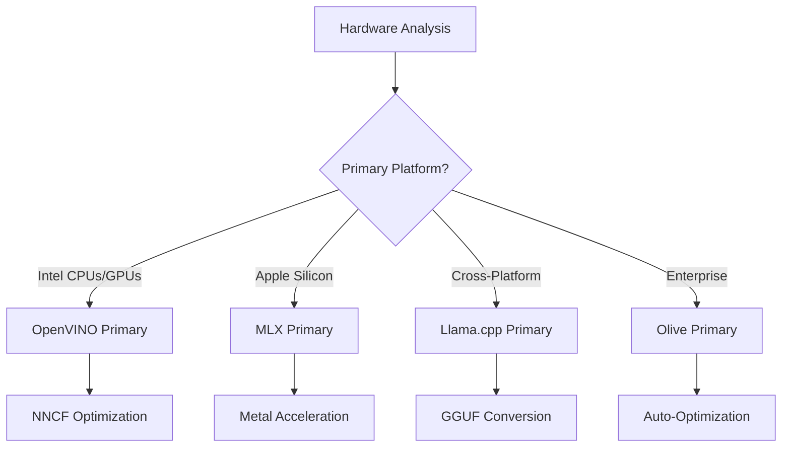
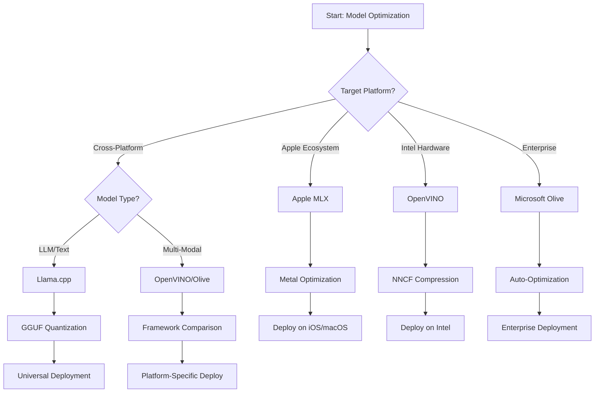
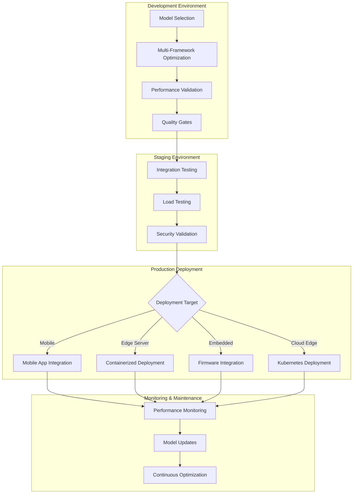

<!--
CO_OP_TRANSLATOR_METADATA:
{
  "original_hash": "6719c4a7e44b948230ac5f5cab3699bd",
  "translation_date": "2025-09-17T23:34:39+00:00",
  "source_file": "Module04/06.workflow-synthesis.md",
  "language_code": "it"
}
-->
# Sezione 6: Sintesi del Workflow di Sviluppo Edge AI

## Indice
1. [Introduzione](../../../Module04)
2. [Obiettivi di Apprendimento](../../../Module04)
3. [Panoramica del Workflow Unificato](../../../Module04)
4. [Matrice di Selezione dei Framework](../../../Module04)
5. [Sintesi delle Migliori Pratiche](../../../Module04)
6. [Guida alla Strategia di Deployment](../../../Module04)
7. [Workflow di Ottimizzazione delle Prestazioni](../../../Module04)
8. [Checklist per la Prontezza alla Produzione](../../../Module04)
9. [Risoluzione dei Problemi e Monitoraggio](../../../Module04)
10. [Preparare il Tuo Pipeline Edge AI per il Futuro](../../../Module04)

## Introduzione

Lo sviluppo di Edge AI richiede una comprensione approfondita di molteplici framework di ottimizzazione, strategie di deployment e considerazioni hardware. Questa sintesi completa riunisce le conoscenze di Llama.cpp, Microsoft Olive, OpenVINO e Apple MLX per creare un workflow unificato che massimizza l'efficienza, mantiene la qualità e garantisce un deployment di successo in produzione.

Durante questo corso, abbiamo esplorato singoli framework di ottimizzazione, ciascuno con punti di forza unici e casi d'uso specializzati. Tuttavia, i progetti Edge AI reali spesso richiedono la combinazione di tecniche provenienti da più framework o decisioni strategiche su quale approccio offra i migliori risultati per vincoli e requisiti specifici.

Questa sezione sintetizza la saggezza collettiva di tutti i framework in workflow pratici, alberi decisionali e migliori pratiche che ti permettono di costruire soluzioni Edge AI pronte per la produzione in modo efficiente ed efficace. Che tu stia ottimizzando per dispositivi mobili, sistemi embedded o server edge, questa guida fornisce il quadro strategico per prendere decisioni informate durante il ciclo di sviluppo.

## Obiettivi di Apprendimento

Alla fine di questa sezione, sarai in grado di:

### Decisioni Strategiche
- **Valutare e selezionare** il framework di ottimizzazione ottimale in base ai requisiti del progetto, ai vincoli hardware e agli scenari di deployment
- **Progettare workflow completi** che integrano tecniche di ottimizzazione multiple per la massima efficienza
- **Valutare i compromessi** tra accuratezza del modello, velocità di inferenza, utilizzo della memoria e complessità del deployment attraverso diversi framework

### Integrazione del Workflow
- **Implementare pipeline di sviluppo unificate** che sfruttano i punti di forza di più framework di ottimizzazione
- **Creare workflow riproducibili** per un'ottimizzazione e un deployment coerenti dei modelli in ambienti diversi
- **Stabilire gate di qualità** e processi di validazione per garantire che i modelli ottimizzati soddisfino i requisiti di produzione

### Ottimizzazione delle Prestazioni
- **Applicare strategie di ottimizzazione sistematiche** utilizzando tecniche di quantizzazione, pruning e accelerazione specifica per hardware
- **Monitorare e confrontare** le prestazioni dei modelli attraverso diversi livelli di ottimizzazione e target di deployment
- **Ottimizzare per piattaforme hardware specifiche** inclusi CPU, GPU, NPU e acceleratori edge specializzati

### Deployment in Produzione
- **Progettare architetture di deployment scalabili** che supportano formati di modelli multipli e motori di inferenza
- **Implementare monitoraggio e osservabilità** per applicazioni Edge AI in ambienti di produzione
- **Stabilire workflow di manutenzione** per aggiornamenti dei modelli, monitoraggio delle prestazioni e ottimizzazione del sistema

### Eccellenza Cross-Platform
- **Distribuire modelli ottimizzati** su piattaforme hardware diverse mantenendo prestazioni coerenti
- **Gestire ottimizzazioni specifiche per piattaforma** per Windows, macOS, Linux, dispositivi mobili e sistemi embedded
- **Creare livelli di astrazione** che consentano un deployment senza soluzione di continuità in ambienti edge diversi

## Panoramica del Workflow Unificato

### Fase 1: Analisi dei Requisiti e Selezione del Framework

La base per un deployment Edge AI di successo inizia con un'analisi approfondita dei requisiti che informa la selezione del framework e la strategia di ottimizzazione.

#### 1.1 Valutazione Hardware


**Considerazioni Chiave:**
- **Architettura CPU**: Capacità x86, ARM, Apple Silicon
- **Disponibilità di Acceleratori**: GPU, NPU, VPU, chip AI specializzati
- **Vincoli di Memoria**: Limitazioni RAM, capacità di archiviazione
- **Budget Energetico**: Durata della batteria, vincoli termici
- **Connettività**: Requisiti offline, limitazioni di larghezza di banda

#### 1.2 Matrice dei Requisiti dell'Applicazione

| Requisito | Llama.cpp | Microsoft Olive | OpenVINO | Apple MLX |
|-----------|-----------|-----------------|----------|-----------|
| Cross-platform | ✅ Eccellente | ⚡ Buono | ⚡ Buono | ❌ Solo Apple |
| Integrazione Enterprise | ⚡ Base | ✅ Eccellente | ✅ Eccellente | ⚡ Limitata |
| Deployment Mobile | ✅ Eccellente | ⚡ Buono | ⚡ Buono | ✅ iOS Eccellente |
| Inferenza in Tempo Reale | ✅ Eccellente | ✅ Eccellente | ✅ Eccellente | ✅ Eccellente |
| Diversità dei Modelli | ✅ Focus LLM | ✅ Tutti i Modelli | ✅ Tutti i Modelli | ✅ Focus LLM |
| Facilità d'Uso | ✅ Semplice | ✅ Automatizzato | ⚡ Moderato | ✅ Semplice |

### Fase 2: Preparazione e Ottimizzazione del Modello

#### 2.1 Pipeline Universale di Valutazione del Modello

```python
# Universal Model Assessment Framework
class EdgeAIModelAssessment:
    def __init__(self, model_path, target_hardware):
        self.model_path = model_path
        self.target_hardware = target_hardware
        self.optimization_frameworks = []
        
    def assess_model_characteristics(self):
        """Analyze model size, architecture, and complexity"""
        return {
            'model_size': self.get_model_size(),
            'parameter_count': self.get_parameter_count(),
            'architecture_type': self.detect_architecture(),
            'quantization_compatibility': self.check_quantization_support()
        }
    
    def recommend_optimization_strategy(self):
        """Recommend optimal frameworks and techniques"""
        characteristics = self.assess_model_characteristics()
        
        if self.target_hardware.startswith('apple'):
            return self.mlx_optimization_strategy(characteristics)
        elif self.target_hardware.startswith('intel'):
            return self.openvino_optimization_strategy(characteristics)
        elif characteristics['model_size'] > 7_000_000_000:  # 7B+ parameters
            return self.enterprise_optimization_strategy(characteristics)
        else:
            return self.lightweight_optimization_strategy(characteristics)
```

#### 2.2 Pipeline di Ottimizzazione Multi-Framework

**Approccio di Ottimizzazione Sequenziale:**
1. **Conversione Iniziale**: Convertire in formato intermedio (ONNX quando possibile)
2. **Ottimizzazione Specifica per Framework**: Applicare tecniche specializzate
3. **Validazione Incrociata**: Verificare le prestazioni su piattaforme target
4. **Packaging Finale**: Preparare per il deployment

```bash
# Multi-Framework Optimization Script
#!/bin/bash

MODEL_NAME="phi-3-mini"
BASE_MODEL="microsoft/Phi-3-mini-4k-instruct"

# Phase 1: ONNX Conversion (Universal)
python convert_to_onnx.py --model $BASE_MODEL --output models/onnx/

# Phase 2: Platform-Specific Optimization
if [[ "$TARGET_PLATFORM" == "intel" ]]; then
    # OpenVINO Optimization
    python optimize_openvino.py --input models/onnx/ --output models/openvino/
elif [[ "$TARGET_PLATFORM" == "apple" ]]; then
    # MLX Optimization
    python optimize_mlx.py --input $BASE_MODEL --output models/mlx/
elif [[ "$TARGET_PLATFORM" == "cross" ]]; then
    # Llama.cpp Optimization
    python convert_to_gguf.py --input models/onnx/ --output models/gguf/
fi

# Phase 3: Validation
python validate_optimization.py --original $BASE_MODEL --optimized models/$TARGET_PLATFORM/
```

### Fase 3: Validazione delle Prestazioni e Benchmarking

#### 3.1 Framework Completo di Benchmarking

```python
class EdgeAIBenchmark:
    def __init__(self, optimized_models):
        self.models = optimized_models
        self.metrics = {
            'inference_time': [],
            'memory_usage': [],
            'accuracy_score': [],
            'throughput': [],
            'energy_consumption': []
        }
    
    def run_comprehensive_benchmark(self):
        """Execute standardized benchmarks across all optimized models"""
        test_inputs = self.generate_test_inputs()
        
        for model_framework, model_path in self.models.items():
            print(f"Benchmarking {model_framework}...")
            
            # Latency Testing
            latency = self.measure_inference_latency(model_path, test_inputs)
            
            # Memory Profiling
            memory = self.profile_memory_usage(model_path)
            
            # Accuracy Validation
            accuracy = self.validate_model_accuracy(model_path, test_inputs)
            
            # Throughput Analysis
            throughput = self.measure_throughput(model_path)
            
            self.record_metrics(model_framework, latency, memory, accuracy, throughput)
    
    def generate_optimization_report(self):
        """Create comprehensive comparison report"""
        report = {
            'recommendations': self.analyze_performance_trade_offs(),
            'deployment_guidance': self.generate_deployment_recommendations(),
            'monitoring_requirements': self.define_monitoring_metrics()
        }
        return report
```

## Matrice di Selezione dei Framework

### Albero Decisionale per la Selezione del Framework



### Criteri di Selezione Completi

#### 1. Allineamento al Caso d'Uso Primario

**Modelli di Linguaggio di Grandi Dimensioni (LLM):**
- **Llama.cpp**: Ideale per deployment CPU-focused, cross-platform
- **Apple MLX**: Ottimale per Apple Silicon con memoria unificata
- **OpenVINO**: Eccellente per hardware Intel con ottimizzazione NNCF
- **Microsoft Olive**: Ideale per workflow enterprise con automazione

**Modelli Multi-Modali:**
- **OpenVINO**: Supporto completo per visione, audio e testo
- **Microsoft Olive**: Ottimizzazione di livello enterprise per pipeline complesse
- **Llama.cpp**: Limitato a modelli basati su testo
- **Apple MLX**: Supporto crescente per applicazioni multi-modali

#### 2. Matrice della Piattaforma Hardware

| Piattaforma | Framework Primario | Opzione Secondaria | Caratteristiche Specializzate |
|-------------|--------------------|--------------------|------------------------------|
| Intel CPU/GPU | OpenVINO | Microsoft Olive | Compressione NNCF, ottimizzazione Intel |
| NVIDIA GPU | Microsoft Olive | OpenVINO | Accelerazione CUDA, funzionalità enterprise |
| Apple Silicon | Apple MLX | Llama.cpp | Shader Metal, memoria unificata |
| ARM Mobile | Llama.cpp | OpenVINO | Cross-platform, dipendenze minime |
| Edge TPU | OpenVINO | Microsoft Olive | Supporto per acceleratori specializzati |
| ARM Embedded | Llama.cpp | OpenVINO | Impronta minima, inferenza efficiente |

#### 3. Preferenze del Workflow di Sviluppo

**Prototipazione Rapida:**
1. **Llama.cpp**: Configurazione più veloce, risultati immediati
2. **Apple MLX**: API Python semplice, iterazione rapida
3. **Microsoft Olive**: Ottimizzazione automatizzata, configurazione minima
4. **OpenVINO**: Configurazione più complessa, funzionalità complete

**Produzione Enterprise:**
1. **Microsoft Olive**: Funzionalità enterprise, integrazione Azure
2. **OpenVINO**: Ecosistema Intel, strumenti completi
3. **Apple MLX**: Applicazioni enterprise specifiche per Apple
4. **Llama.cpp**: Deployment semplice, funzionalità enterprise limitate

## Sintesi delle Migliori Pratiche

### Principi Universali di Ottimizzazione

#### 1. Strategia di Ottimizzazione Progressiva

```python
class ProgressiveOptimization:
    def __init__(self, base_model):
        self.base_model = base_model
        self.optimization_stages = [
            'baseline_measurement',
            'format_conversion',
            'quantization_optimization',
            'hardware_acceleration',
            'production_validation'
        ]
    
    def execute_progressive_optimization(self):
        """Apply optimization techniques incrementally"""
        
        # Stage 1: Baseline Measurement
        baseline_metrics = self.measure_baseline_performance()
        
        # Stage 2: Format Conversion
        converted_model = self.convert_to_optimal_format()
        conversion_metrics = self.measure_performance(converted_model)
        
        # Stage 3: Quantization
        quantized_model = self.apply_quantization(converted_model)
        quantization_metrics = self.measure_performance(quantized_model)
        
        # Stage 4: Hardware Acceleration
        accelerated_model = self.enable_hardware_acceleration(quantized_model)
        acceleration_metrics = self.measure_performance(accelerated_model)
        
        # Stage 5: Validation
        production_ready = self.validate_for_production(accelerated_model)
        
        return self.compile_optimization_report(
            baseline_metrics, conversion_metrics, 
            quantization_metrics, acceleration_metrics
        )
```

#### 2. Implementazione dei Gate di Qualità

**Gate per la Conservazione dell'Accuratezza:**
- Mantenere >95% dell'accuratezza originale del modello
- Validare su dataset di test rappresentativi
- Implementare test A/B per la validazione in produzione

**Gate per il Miglioramento delle Prestazioni:**
- Ottenere un miglioramento minimo di 2x nella velocità
- Ridurre l'impronta di memoria di almeno il 50%
- Validare la coerenza dei tempi di inferenza

**Gate per la Prontezza alla Produzione:**
- Superare test di stress sotto carico
- Dimostrare prestazioni stabili nel tempo
- Validare requisiti di sicurezza e privacy

### Integrazione delle Migliori Pratiche Specifiche per Framework

#### 1. Sintesi della Strategia di Quantizzazione

```python
# Unified Quantization Approach
class UnifiedQuantizationStrategy:
    def __init__(self, model, target_platform):
        self.model = model
        self.platform = target_platform
        
    def select_optimal_quantization(self):
        """Choose best quantization based on platform and requirements"""
        
        if self.platform == 'apple_silicon':
            return self.mlx_quantization_strategy()
        elif self.platform == 'intel_hardware':
            return self.openvino_quantization_strategy()
        elif self.platform == 'cross_platform':
            return self.llamacpp_quantization_strategy()
        else:
            return self.olive_quantization_strategy()
    
    def mlx_quantization_strategy(self):
        """Apple MLX-specific quantization"""
        return {
            'method': 'mlx_quantize',
            'precision': 'int4',
            'group_size': 64,
            'optimization_target': 'unified_memory'
        }
    
    def openvino_quantization_strategy(self):
        """OpenVINO NNCF quantization"""
        return {
            'method': 'nncf_quantize',
            'precision': 'int8',
            'calibration_method': 'post_training',
            'optimization_target': 'intel_hardware'
        }
```

#### 2. Ottimizzazione dell'Accelerazione Hardware

**Sintesi dell'Ottimizzazione CPU:**
- **Istruzioni SIMD**: Sfruttare kernel ottimizzati attraverso i framework
- **Larghezza di Banda della Memoria**: Ottimizzare layout dei dati per efficienza della cache
- **Threading**: Bilanciare il parallelismo con i vincoli delle risorse

**Migliori Pratiche per l'Accelerazione GPU:**
- **Elaborazione Batch**: Massimizzare il throughput con dimensioni batch appropriate
- **Gestione della Memoria**: Ottimizzare allocazione e trasferimenti di memoria GPU
- **Precisione**: Utilizzare FP16 quando supportato per migliori prestazioni

**Ottimizzazione NPU/Acceleratori Specializzati:**
- **Architettura del Modello**: Garantire compatibilità con le capacità dell'acceleratore
- **Flusso dei Dati**: Ottimizzare pipeline di input/output per efficienza dell'acceleratore
- **Strategie di Fallback**: Implementare fallback su CPU per operazioni non supportate

## Guida alla Strategia di Deployment

### Architettura Universale di Deployment



### Pattern di Deployment Specifici per Piattaforma

#### 1. Strategia di Deployment Mobile

```yaml
# Mobile Deployment Configuration
mobile_deployment:
  ios:
    framework: apple_mlx
    optimization:
      quantization: int4
      memory_mapping: true
      background_execution: limited
    packaging:
      format: mlx
      bundle_size: <50MB
      
  android:
    framework: llama_cpp
    optimization:
      quantization: q4_k_m
      threading: android_optimized
      memory_management: conservative
    packaging:
      format: gguf
      apk_size: <100MB
      
  cross_platform:
    framework: onnx_runtime
    optimization:
      quantization: int8
      execution_provider: cpu
    packaging:
      format: onnx
      shared_libraries: minimal
```

#### 2. Deployment su Server Edge

```yaml
# Edge Server Deployment Configuration
edge_server:
  intel_based:
    framework: openvino
    optimization:
      quantization: int8
      acceleration: cpu_gpu_auto
      batch_processing: dynamic
    deployment:
      container: openvino_runtime
      orchestration: kubernetes
      scaling: horizontal
      
  nvidia_based:
    framework: microsoft_olive
    optimization:
      quantization: int4
      acceleration: cuda
      tensor_parallelism: true
    deployment:
      container: nvidia_triton
      orchestration: kubernetes
      scaling: gpu_aware
```

### Migliori Pratiche per la Containerizzazione

```dockerfile
# Multi-Framework Edge AI Container
FROM ubuntu:22.04 as base

# Install common dependencies
RUN apt-get update && apt-get install -y \
    python3 \
    python3-pip \
    build-essential \
    cmake \
    && rm -rf /var/lib/apt/lists/*

# Framework-specific stages
FROM base as openvino
RUN pip install openvino nncf optimum[intel]

FROM base as llamacpp
RUN git clone https://github.com/ggerganov/llama.cpp.git \
    && cd llama.cpp && make LLAMA_OPENBLAS=1

FROM base as olive
RUN pip install olive-ai[auto-opt] onnxruntime-genai

# Production stage with selected framework
FROM openvino as production
COPY models/ /app/models/
COPY src/ /app/src/
WORKDIR /app

EXPOSE 8080
CMD ["python3", "src/inference_server.py"]
```

## Workflow di Ottimizzazione delle Prestazioni

### Ottimizzazione Sistematica delle Prestazioni

#### 1. Pipeline di Profiling delle Prestazioni

```python
class EdgeAIPerformanceProfiler:
    def __init__(self, model_path, framework):
        self.model_path = model_path
        self.framework = framework
        self.profiling_results = {}
    
    def comprehensive_profiling(self):
        """Execute comprehensive performance analysis"""
        
        # CPU Profiling
        cpu_profile = self.profile_cpu_usage()
        
        # Memory Profiling
        memory_profile = self.profile_memory_usage()
        
        # Inference Latency
        latency_profile = self.profile_inference_latency()
        
        # Throughput Analysis
        throughput_profile = self.profile_throughput()
        
        # Energy Consumption (where available)
        energy_profile = self.profile_energy_consumption()
        
        return self.compile_performance_report(
            cpu_profile, memory_profile, latency_profile,
            throughput_profile, energy_profile
        )
    
    def identify_bottlenecks(self):
        """Automatically identify performance bottlenecks"""
        bottlenecks = []
        
        if self.profiling_results['cpu_utilization'] > 80:
            bottlenecks.append('cpu_bound')
        
        if self.profiling_results['memory_usage'] > 90:
            bottlenecks.append('memory_bound')
        
        if self.profiling_results['inference_variance'] > 20:
            bottlenecks.append('inconsistent_performance')
        
        return self.generate_optimization_recommendations(bottlenecks)
```

#### 2. Pipeline di Ottimizzazione Automatica

```python
class AutomatedOptimizationPipeline:
    def __init__(self, base_model, target_constraints):
        self.base_model = base_model
        self.constraints = target_constraints
        self.optimization_history = []
    
    def execute_optimization_search(self):
        """Systematically search optimization space"""
        
        optimization_candidates = [
            {'quantization': 'int8', 'pruning': 0.1},
            {'quantization': 'int4', 'pruning': 0.2},
            {'quantization': 'int8', 'acceleration': 'gpu'},
            {'quantization': 'int4', 'acceleration': 'npu'}
        ]
        
        best_configuration = None
        best_score = 0
        
        for config in optimization_candidates:
            optimized_model = self.apply_optimization(config)
            score = self.evaluate_optimization(optimized_model)
            
            if score > best_score and self.meets_constraints(optimized_model):
                best_score = score
                best_configuration = config
            
            self.optimization_history.append({
                'config': config,
                'score': score,
                'model': optimized_model
            })
        
        return best_configuration, self.optimization_history
```

### Ottimizzazione Multi-Obiettivo

#### 1. Ottimizzazione Pareto per Edge AI

```python
class ParetoOptimization:
    def __init__(self, objectives=['speed', 'accuracy', 'memory']):
        self.objectives = objectives
        self.pareto_frontier = []
    
    def find_pareto_optimal_solutions(self, optimization_results):
        """Identify Pareto-optimal configurations"""
        
        for result in optimization_results:
            is_dominated = False
            
            for frontier_point in self.pareto_frontier:
                if self.dominates(frontier_point, result):
                    is_dominated = True
                    break
            
            if not is_dominated:
                # Remove dominated points from frontier
                self.pareto_frontier = [
                    point for point in self.pareto_frontier 
                    if not self.dominates(result, point)
                ]
                
                self.pareto_frontier.append(result)
        
        return self.pareto_frontier
    
    def recommend_configuration(self, user_preferences):
        """Recommend configuration based on user preferences"""
        
        weighted_scores = []
        for config in self.pareto_frontier:
            score = sum(
                user_preferences[obj] * config['metrics'][obj] 
                for obj in self.objectives
            )
            weighted_scores.append((score, config))
        
        return max(weighted_scores, key=lambda x: x[0])[1]
```

## Checklist per la Prontezza alla Produzione

### Validazione Completa per la Produzione

#### 1. Assicurazione della Qualità del Modello

```python
class ProductionReadinessValidator:
    def __init__(self, optimized_model, production_requirements):
        self.model = optimized_model
        self.requirements = production_requirements
        self.validation_results = {}
    
    def validate_model_quality(self):
        """Comprehensive model quality validation"""
        
        # Accuracy Validation
        accuracy_result = self.validate_accuracy()
        
        # Performance Validation
        performance_result = self.validate_performance()
        
        # Robustness Testing
        robustness_result = self.validate_robustness()
        
        # Security Assessment
        security_result = self.validate_security()
        
        # Compliance Verification
        compliance_result = self.validate_compliance()
        
        return self.compile_validation_report(
            accuracy_result, performance_result, robustness_result,
            security_result, compliance_result
        )
    
    def generate_certification_report(self):
        """Generate production certification report"""
        return {
            'model_signature': self.generate_model_signature(),
            'validation_timestamp': datetime.now(),
            'validation_results': self.validation_results,
            'deployment_approval': self.check_deployment_approval(),
            'monitoring_requirements': self.define_monitoring_requirements()
        }
```

#### 2. Checklist per il Deployment in Produzione

**Validazione Pre-Deployment:**
- [ ] L'accuratezza del modello soddisfa i requisiti minimi (>95% del baseline)
- [ ] Gli obiettivi di prestazione sono raggiunti (latenza, throughput, memoria)
- [ ] Le vulnerabilità di sicurezza sono state valutate e mitigate
- [ ] I test di stress sono stati completati sotto carico previsto
- [ ] Gli scenari di errore sono stati testati e le procedure di recupero validate
- [ ] I sistemi di monitoraggio e allerta sono configurati
- [ ] Le procedure di rollback sono state testate e documentate

**Processo di Deployment:**
- [ ] Strategia di deployment blue-green implementata
- [ ] Configurazione di ramping graduale del traffico
- [ ] Dashboard di monitoraggio in tempo reale attive
- [ ] Baseline delle prestazioni stabiliti
- [ ] Soglie di tasso di errore definite
- [ ] Trigger di rollback automatico configurati

**Monitoraggio Post-Deployment:**
- [ ] Rilevamento del drift del modello attivo
- [ ] Allerta per degrado delle prestazioni configurata
- [ ] Monitoraggio dell'utilizzo delle risorse abilitato
- [ ] Metriche di esperienza utente tracciate
- [ ] Versionamento e tracciabilità del modello mantenuti
- [ ] Revisioni regolari delle prestazioni del modello programmate

### Integrazione Continua/Deployment Continuo (CI/CD)

```yaml
# Edge AI CI/CD Pipeline Configuration
edge_ai_pipeline:
  stages:
    - model_validation
    - optimization
    - testing
    - staging_deployment
    - production_deployment
    - monitoring
  
  model_validation:
    accuracy_threshold: 0.95
    performance_baseline: required
    security_scan: enabled
    
  optimization:
    frameworks:
      - llama_cpp
      - openvino
      - microsoft_olive
    validation:
      cross_validation: enabled
      performance_comparison: required
      
  testing:
    unit_tests: comprehensive
    integration_tests: full_pipeline
    load_tests: production_scale
    security_tests: comprehensive
    
  deployment:
    strategy: blue_green
    traffic_ramping: gradual
    rollback: automatic
    monitoring: real_time
```

## Risoluzione dei Problemi e Monitoraggio

### Framework Universale di Risoluzione dei Problemi

#### 1. Problemi Comuni e Soluzioni

**Problemi di Prestazioni:**
```python
class PerformanceTroubleshooter:
    def __init__(self, model_metrics):
        self.metrics = model_metrics
        
    def diagnose_performance_issues(self):
        """Systematic performance issue diagnosis"""
        
        issues = []
        
        # High latency diagnosis
        if self.metrics['avg_latency'] > self.metrics['target_latency']:
            issues.append(self.diagnose_latency_issues())
        
        # Memory usage diagnosis
        if self.metrics['memory_usage'] > self.metrics['memory_limit']:
            issues.append(self.diagnose_memory_issues())
        
        # Throughput diagnosis
        if self.metrics['throughput'] < self.metrics['target_throughput']:
            issues.append(self.diagnose_throughput_issues())
        
        return self.generate_resolution_plan(issues)
    
    def diagnose_latency_issues(self):
        """Specific latency troubleshooting"""
        potential_causes = []
        
        if self.metrics['cpu_utilization'] > 80:
            potential_causes.append('cpu_bottleneck')
        
        if self.metrics['memory_bandwidth'] > 90:
            potential_causes.append('memory_bandwidth_limit')
        
        if self.metrics['model_size'] > self.metrics['optimal_size']:
            potential_causes.append('model_too_large')
        
        return {
            'issue': 'high_latency',
            'causes': potential_causes,
            'solutions': self.generate_latency_solutions(potential_causes)
        }
```

**Risoluzione dei Problemi Specifica per Framework:**

| Problema | Llama.cpp | Microsoft Olive | OpenVINO | Apple MLX |
|----------|-----------|-----------------|----------|-----------|
| Problemi di Memoria | Ridurre lunghezza contesto | Diminuire dimensione batch | Abilitare caching | Usare memory mapping |
| Inferenza Lenta | Abilitare SIMD | Controllare quantizzazione | Ottimizzare threading | Abilitare Metal |
| Perdita di Accuratezza | Quantizzazione più alta | Retrain con QAT | Aumentare calibrazione | Fine-tuning post-quant |
| Compatibilità | Controllare formato modello | Verificare versione framework | Aggiornare driver | Controllare versione macOS |

#### 2. Strategia di Monitoraggio in Produzione

```python
class EdgeAIMonitoring:
    def __init__(self, deployment_config):
        self.config = deployment_config
        self.metrics_collectors = []
        self.alerting_rules = []
    
    def setup_comprehensive_monitoring(self):
        """Configure comprehensive monitoring for Edge AI deployment"""
        
        # Model Performance Monitoring
        self.setup_model_performance_monitoring()
        
        # Infrastructure Monitoring
        self.setup_infrastructure_monitoring()
        
        # Business Metrics Monitoring
        self.setup_business_metrics_monitoring()
        
        # Security Monitoring
        self.setup_security_monitoring()
    
    def setup_model_performance_monitoring(self):
        """Model-specific performance monitoring"""
        metrics = [
            'inference_latency_p50',
            'inference_latency_p95',
            'inference_latency_p99',
            'model_accuracy_drift',
            'prediction_confidence_distribution',
            'error_rate',
            'throughput_requests_per_second'
        ]
        
        for metric in metrics:
            self.add_metric_collector(metric)
            self.add_alerting_rule(metric)
    
    def detect_model_drift(self):
        """Automated model drift detection"""
        drift_indicators = [
            self.statistical_drift_detection(),
            self.performance_drift_detection(),
            self.data_distribution_shift_detection()
        ]
        
        return self.aggregate_drift_signals(drift_indicators)
```

### Risoluzione Automatica dei Problemi

```python
class AutomatedIssueResolution:
    def __init__(self, monitoring_system):
        self.monitoring = monitoring_system
        self.resolution_strategies = {}
    
    def handle_performance_degradation(self, alert):
        """Automated performance issue resolution"""
        
        if alert['type'] == 'high_latency':
            return self.resolve_latency_issue(alert)
        elif alert['type'] == 'high_memory_usage':
            return self.resolve_memory_issue(alert)
        elif alert['type'] == 'accuracy_drift':
            return self.resolve_accuracy_issue(alert)
        
    def resolve_latency_issue(self, alert):
        """Automated latency issue resolution"""
        resolution_steps = [
            'increase_cpu_allocation',
            'enable_model_caching',
            'reduce_batch_size',
            'switch_to_quantized_model'
        ]
        
        for step in resolution_steps:
            if self.apply_resolution_step(step):
                return f"Resolved latency issue with: {step}"
        
        return "Escalating to human operator"
```

## Preparare il Tuo Pipeline Edge AI per il Futuro

### Integrazione delle Tecnologie Emergenti

#### 1. Supporto per Hardware di Nuova Generazione

```python
class FutureHardwareIntegration:
    def __init__(self):
        self.supported_accelerators = [
            'npu_next_gen',
            'quantum_processors',
            'neuromorphic_chips',
            'optical_processors'
        ]
    
    def design_adaptive_pipeline(self):
        """Create hardware-agnostic optimization pipeline"""
        
        pipeline = {
            'model_preparation': self.universal_model_preparation(),
            'hardware_detection': self.dynamic_hardware_detection(),
            'optimization_selection': self.adaptive_optimization_selection(),
            'performance_validation': self.hardware_agnostic_validation()
        }
        
        return pipeline
    
    def adaptive_optimization_selection(self):
        """Dynamically select optimization based on available hardware"""
        
        def optimize_for_hardware(model, available_hardware):
            if 'npu' in available_hardware:
                return self.npu_optimization(model)
            elif 'quantum' in available_hardware:
                return self.quantum_optimization(model)
            elif 'neuromorphic' in available_hardware:
                return self.neuromorphic_optimization(model)
            else:
                return self.fallback_optimization(model)
        
        return optimize_for_hardware
```

#### 2. Evoluzione dell'Architettura del Modello

**Supporto per Architetture Emergenti:**
- **Mixture of Experts (MoE)**: Architetture sparse per efficienza
- **Generazione Augmentata da Recupero**: Sistemi ibridi modello + base di conoscenza
- **Modelli Multimodali**: Integrazione Visione + Linguaggio + Audio
- **Federated Learning**: Training e ottimizzazione distribuiti

```python
class NextGenModelSupport:
    def __init__(self):
        self.architecture_handlers = {
            'moe': self.handle_mixture_of_experts,
            'rag': self.handle_retrieval_augmented,
            'multimodal': self.handle_multimodal,
            'federated': self.handle_federated_learning
        }
    
    def handle_mixture_of_experts(self, model):
        """Optimize Mixture of Experts models for edge deployment"""
        optimization_strategy = {
            'expert_pruning': True,
            'routing_optimization': True,
            'expert_quantization': 'per_expert',
            'load_balancing': 'dynamic'
        }
        return self.apply_moe_optimization(model, optimization_strategy)
```

### Apprendimento Continuo e Adattamento

#### 1. Integrazione dell'Apprendimento Online

```python
class EdgeOnlineLearning:
    def __init__(self, base_model, learning_rate=0.001):
        self.base_model = base_model
        self.learning_rate = learning_rate
        self.adaptation_buffer = []
    
    def continuous_adaptation(self, new_data, feedback):
        """Continuously adapt model based on edge data"""
        
        # Privacy-preserving local adaptation
        local_updates = self.compute_local_gradients(new_data, feedback)
        
        # Apply updates with constraints
        adapted_model = self.apply_constrained_updates(
            self.base_model, local_updates
        )
        
        # Validate adaptation quality
        if self.validate_adaptation(adapted_model):
            self.base_model = adapted_model
            return True
        
        return False
    
    def federated_learning_participation(self):
        """Participate in federated learning while preserving privacy"""
        
        # Compute local model updates
        local_updates = self.compute_private_updates()
        
        # Differential privacy protection
        private_updates = self.apply_differential_privacy(local_updates)
        
        # Share with federated learning coordinator
        return self.share_updates(private_updates)
```

#### 2. Sostenibilità e Green AI

```python
class GreenEdgeAI:
    def __init__(self, sustainability_targets):
        self.targets = sustainability_targets
        self.energy_monitor = EnergyMonitor()
    
    def optimize_for_sustainability(self, model):
        """Optimize model for minimal environmental impact"""
        
        optimization_objectives = [
            'minimize_energy_consumption',
            'maximize_hardware_utilization',
            'reduce_model_training_cost',
            'extend_device_lifetime'
        ]
        
        return self.multi_objective_green_optimization(
            model, optimization_objectives
        )
    
    def carbon_aware_deployment(self):
        """Deploy models considering carbon footprint"""
        
        deployment_strategy = {
            'prefer_renewable_energy_regions': True,
            'optimize_for_energy_efficiency': True,
            'minimize_data_transfer': True,
            'lifecycle_carbon_accounting': True
        }
        
        return deployment_strategy
```

## Conclusione

Questa sintesi completa del workflow rappresenta il culmine delle conoscenze sull'ottimizzazione Edge AI, riunendo le migliori pratiche di tutti i principali framework di ottimizzazione in un approccio unificato e pronto per la produzione. Seguendo queste linee guida, sarai in grado di:

**Raggiungere Prestazioni Ottimali**: Attraverso la selezione sistematica del framework, l'ottimizzazione progressiva e la validazione completa, garantendo che le tue applicazioni Edge AI offrano la massima efficienza.

**Garantire la Prontezza alla Produzione**: Con test approfonditi, monitoraggio e gate di qualità che assicurano un deployment affidabile e operativo in ambienti reali.

**Mantenere il Successo a Lungo Termine**: Attraverso monitoraggio continuo, risoluzione automatica dei problemi e strategie di adattamento che mantengono le tue soluzioni Edge AI performanti e rilevanti.

**Preparare il Tuo Investimento per il Futuro**: Progettando pipeline flessibili e indipendenti dall'hardware che possono evolversi con tecnologie e requisiti emergenti.

Il panorama Edge AI continua a evolversi rapidamente, con nuove piattaforme hardware, tecniche di ottimizzazione e strategie di deployment che emergono regolarmente. Questa sintesi fornisce le basi per navigare in questa complessità, costruendo soluzioni Edge AI robuste, efficienti e mantenibili che offrono valore reale in ambienti di produzione.
Ricorda che la migliore strategia di ottimizzazione è quella che soddisfa i tuoi requisiti specifici, mantenendo al contempo la flessibilità per adattarsi man mano che tali requisiti evolvono. Usa questa guida come base per prendere decisioni informate, ma valida sempre le tue scelte attraverso test empirici e esperienze di implementazione nel mondo reale.

## ➡️ Cosa fare dopo

Continua il tuo percorso nell'Edge AI esplorando [Modulo 5: SLMOps e Distribuzione in Produzione](../Module05/README.md) per approfondire gli aspetti operativi della gestione del ciclo di vita dei Small Language Model.

---

**Disclaimer**:  
Questo documento è stato tradotto utilizzando il servizio di traduzione automatica [Co-op Translator](https://github.com/Azure/co-op-translator). Sebbene ci impegniamo per garantire l'accuratezza, si prega di notare che le traduzioni automatiche possono contenere errori o imprecisioni. Il documento originale nella sua lingua nativa dovrebbe essere considerato la fonte autorevole. Per informazioni critiche, si raccomanda una traduzione professionale effettuata da un traduttore umano. Non siamo responsabili per eventuali incomprensioni o interpretazioni errate derivanti dall'uso di questa traduzione.