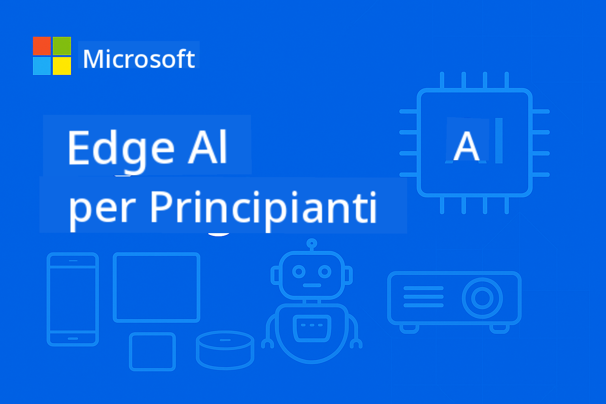

<!--
CO_OP_TRANSLATOR_METADATA:
{
  "original_hash": "cd9cb76aab17c30bfb19ef73060c5fb0",
  "translation_date": "2025-10-11T10:32:55+00:00",
  "source_file": "README.md",
  "language_code": "it"
}
-->
# EdgeAI per Principianti



[](https://GitHub.com/microsoft/edgeai-for-beginners/graphs/contributors)
[](https://GitHub.com/microsoft/edgeai-for-beginners/issues)
[](https://GitHub.com/microsoft/edgeai-for-beginners/pulls)
[](http://makeapullrequest.com)

[](https://GitHub.com/microsoft/edgeai-for-beginners/watchers)
[](https://GitHub.com/microsoft/edgeai-for-beginners/fork)
[](https://GitHub.com/microsoft/edgeai-for-beginners/stargazers)

[](https://discord.com/invite/ByRwuEEgH4)

Segui questi passaggi per iniziare a utilizzare queste risorse:

1. **Fai un Fork del Repository**: Clicca [](https://GitHub.com/microsoft/edgeai-for-beginners/fork)
2. **Clona il Repository**:   `git clone https://github.com/microsoft/edgeai-for-beginners.git`
3. [**Unisciti al Discord di Azure AI Foundry e incontra esperti e altri sviluppatori**](https://discord.com/invite/ByRwuEEgH4)

### 🌐 Supporto Multilingue

#### Supportato tramite GitHub Action (Automatizzato e Sempre Aggiornato)

[Arabo](../ar/README.md) | [Bengalese](../bn/README.md) | [Bulgaro](../bg/README.md) | [Birmano (Myanmar)](../my/README.md) | [Cinese (Semplificato)](../zh/README.md) | [Cinese (Tradizionale, Hong Kong)](../hk/README.md) | [Cinese (Tradizionale, Macao)](../mo/README.md) | [Cinese (Tradizionale, Taiwan)](../tw/README.md) | [Croato](../hr/README.md) | [Ceco](../cs/README.md) | [Danese](../da/README.md) | [Olandese](../nl/README.md) | [Estone](../et/README.md) | [Finlandese](../fi/README.md) | [Francese](../fr/README.md) | [Tedesco](../de/README.md) | [Greco](../el/README.md) | [Ebraico](../he/README.md) | [Hindi](../hi/README.md) | [Ungherese](../hu/README.md) | [Indonesiano](../id/README.md) | [Italiano](./README.md) | [Giapponese](../ja/README.md) | [Coreano](../ko/README.md) | [Lituano](../lt/README.md) | [Malese](../ms/README.md) | [Marathi](../mr/README.md) | [Nepalese](../ne/README.md) | [Norvegese](../no/README.md) | [Persiano (Farsi)](../fa/README.md) | [Polacco](../pl/README.md) | [Portoghese (Brasile)](../br/README.md) | [Portoghese (Portogallo)](../pt/README.md) | [Punjabi (Gurmukhi)](../pa/README.md) | [Rumeno](../ro/README.md) | [Russo](../ru/README.md) | [Serbo (Cirillico)](../sr/README.md) | [Slovacco](../sk/README.md) | [Sloveno](../sl/README.md) | [Spagnolo](../es/README.md) | [Swahili](../sw/README.md) | [Svedese](../sv/README.md) | [Tagalog (Filippino)](../tl/README.md) | [Tamil](../ta/README.md) | [Thailandese](../th/README.md) | [Turco](../tr/README.md) | [Ucraino](../uk/README.md) | [Urdu](../ur/README.md) | [Vietnamita](../vi/README.md)

**Se desideri supportare ulteriori lingue, l'elenco delle lingue supportate è disponibile [qui](https://github.com/Azure/co-op-translator/blob/main/getting_started/supported-languages.md)**

## Introduzione

Benvenuto in **EdgeAI per Principianti** – il tuo viaggio completo nel mondo trasformativo dell'Intelligenza Artificiale Edge. Questo corso colma il divario tra le potenti capacità dell'IA e la loro implementazione pratica su dispositivi edge, permettendoti di sfruttare il potenziale dell'IA direttamente dove i dati vengono generati e le decisioni devono essere prese.

### Cosa Imparerai

Questo corso ti guiderà dai concetti fondamentali fino alle implementazioni pronte per la produzione, trattando:
- **Small Language Models (SLMs)** ottimizzati per il deployment su dispositivi edge
- **Ottimizzazione hardware-aware** su diverse piattaforme
- **Inferenza in tempo reale** con capacità di preservare la privacy
- **Strategie di deployment in produzione** per applicazioni aziendali

### Perché EdgeAI è Importante

Edge AI rappresenta un cambiamento di paradigma che affronta sfide moderne cruciali:
- **Privacy e Sicurezza**: Processa dati sensibili localmente senza esposizione al cloud
- **Prestazioni in Tempo Reale**: Elimina la latenza di rete per applicazioni critiche
- **Efficienza dei Costi**: Riduce la larghezza di banda e le spese di calcolo nel cloud
- **Operazioni Resilienti**: Mantiene la funzionalità durante interruzioni di rete
- **Conformità Normativa**: Rispetta i requisiti di sovranità dei dati

### Edge AI

Edge AI si riferisce all'esecuzione di algoritmi di IA e modelli linguistici localmente su hardware, vicino al luogo in cui i dati vengono generati, senza dipendere dalle risorse cloud per l'inferenza. Riduce la latenza, migliora la privacy e consente decisioni in tempo reale.

### Principi Fondamentali:
- **Inferenza su dispositivo**: I modelli di IA vengono eseguiti su dispositivi edge (telefoni, router, microcontrollori, PC industriali)
- **Capacità offline**: Funziona senza connettività internet persistente
- **Bassa latenza**: Risposte immediate adatte a sistemi in tempo reale
- **Sovranità dei dati**: Mantiene i dati sensibili localmente, migliorando sicurezza e conformità

### Small Language Models (SLMs)

Gli SLMs come Phi-4, Mistral-7B e Gemma sono versioni ottimizzate di LLMs più grandi—addestrati o distillati per:
- **Ridotto consumo di memoria**: Utilizzo efficiente della memoria limitata dei dispositivi edge
- **Minore richiesta di calcolo**: Ottimizzati per prestazioni su CPU e GPU edge
- **Tempi di avvio più rapidi**: Inizializzazione veloce per applicazioni reattive

Sbloccano potenti capacità NLP rispettando i vincoli di:
- **Sistemi embedded**: Dispositivi IoT e controller industriali
- **Dispositivi mobili**: Smartphone e tablet con capacità offline
- **Dispositivi IoT**: Sensori e dispositivi intelligenti con risorse limitate
- **Server edge**: Unità di elaborazione locale con risorse GPU limitate
- **Computer personali**: Scenari di deployment su desktop e laptop

## Moduli del Corso e Navigazione

| Modulo | Argomento | Area di Focus | Contenuti Chiave | Livello | Durata |
|--------|-----------|---------------|------------------|---------|--------|
| [📖 00 ](./introduction.md) | [Introduzione a EdgeAI](./introduction.md) | Fondamenti e Contesto | Panoramica EdgeAI • Applicazioni Industriali • Introduzione agli SLM • Obiettivi di Apprendimento | Principiante | 1-2 ore |
| [📚 01](../../Module01) | [Fondamenti di EdgeAI](./Module01/README.md) | Confronto Cloud vs Edge AI | Fondamenti di EdgeAI • Casi di Studio Reali • Guida all'Implementazione • Deployment Edge | Principiante | 3-4 ore |
| [🧠 02](../../Module02) | [Fondamenti dei Modelli SLM](./Module02/README.md) | Famiglie di modelli e architettura | Famiglia Phi • Famiglia Qwen • Famiglia Gemma • BitNET • μModel • Phi-Silica | Principiante | 4-5 ore |
| [🚀 03](../../Module03) | [Pratica di Deployment SLM](./Module03/README.md) | Deployment locale e cloud | Apprendimento Avanzato • Ambiente Locale • Deployment Cloud | Intermedio | 4-5 ore |
| [⚙️ 04](../../Module04) | [Toolkit di Ottimizzazione Modelli](./Module04/README.md) | Ottimizzazione cross-platform | Introduzione • Llama.cpp • Microsoft Olive • OpenVINO • Apple MLX • Sintesi del Workflow | Intermedio | 5-6 ore |
| [🔧 05](../../Module05) | [SLMOps in Produzione](./Module05/README.md) | Operazioni di produzione | Introduzione a SLMOps • Distillazione Modelli • Fine-tuning • Deployment in Produzione | Avanzato | 5-6 ore |
| [🤖 06](../../Module06) | [Agenti AI e Chiamata di Funzioni](./Module06/README.md) | Framework di agenti e MCP | Introduzione agli Agenti • Chiamata di Funzioni • Protocollo di Contesto Modello | Avanzato | 4-5 ore |
| [💻 07](../../Module07) | [Implementazione su Piattaforma](./Module07/README.md) | Esempi cross-platform | Toolkit AI • Foundry Locale • Sviluppo su Windows | Avanzato | 3-4 ore |
| [🏭 08](../../Module08) | [Toolkit Foundry Locale](./Module08/README.md) | Esempi pronti per la produzione | Applicazioni di esempio (vedi dettagli sotto) | Esperto | 8-10 ore |

### 🏭 **Modulo 08: Applicazioni di Esempio**

- [01: Avvio Rapido REST Chat](./Module08/samples/01/README.md)
- [02: Integrazione SDK OpenAI](./Module08/samples/02/README.md)
- [03: Scoperta e Benchmarking Modelli](./Module08/samples/03/README.md)
- [04: Applicazione Chainlit RAG](./Module08/samples/04/README.md)
- [05: Orchestrazione Multi-Agente](./Module08/samples/05/README.md)
- [06: Router Modelli-come-Strumenti](./Module08/samples/06/README.md)
- [07: Client API Diretto](./Module08/samples/07/README.md)
- [08: App Chat Windows 11](./Module08/samples/08/README.md)
- [09: Sistema Multi-Agente Avanzato](./Module08/samples/09/README.md)
- [10: Framework Foundry Tools](./Module08/samples/10/README.md)

### 🎓 **Workshop: Percorso di Apprendimento Pratico**

Materiali completi per workshop pratici con implementazioni pronte per la produzione:

- **[Guida al Workshop](./Workshop/Readme.md)** - Obiettivi di apprendimento completi, risultati e navigazione delle risorse
- **Esempi Python** (6 sessioni) - Aggiornati con best practice, gestione degli errori e documentazione completa
- **Notebook Jupyter** (8 interattivi) - Tutorial passo-passo con benchmark e monitoraggio delle prestazioni
- **Guide alle Sessioni** - Guide dettagliate in markdown per ogni sessione del workshop
- **Strumenti di Validazione** - Script per verificare la qualità del codice e eseguire test preliminari

**Cosa Costruirai:**
- Applicazioni chat AI locali con supporto streaming
- Pipeline RAG con valutazione della qualità (RAGAS)
- Strumenti di benchmarking e confronto multi-modello
- Sistemi di orchestrazione multi-agente
- Routing intelligente dei modelli con selezione basata sui compiti

### 📊 **Riepilogo del Percorso di Apprendimento**
- **Durata Totale**: 36-45 ore
- **Percorso Principiante**: Moduli 01-02 (7-9 ore)  
- **Percorso Intermedio**: Moduli 03-04 (9-11 ore)
- **Percorso Avanzato**: Moduli 05-07 (12-15 ore)
- **Percorso Esperto**: Modulo 08 (8-10 ore)

## Cosa Costruirai

### 🎯 Competenze Chiave
- **Architettura Edge AI**: Progetta sistemi AI local-first con integrazione cloud
- **Ottimizzazione Modelli**: Quantizza e comprimi modelli per deployment edge (85% di aumento velocità, 75% di riduzione dimensioni)
- **Deployment Multi-Piattaforma**: Windows, mobile, embedded e sistemi ibridi cloud-edge
- **Operazioni di Produzione**: Monitoraggio, scalabilità e manutenzione dell'AI edge in produzione

### 🏗️ Progetti Pratici
- **Foundry Local Chat Apps**: Applicazione nativa per Windows 11 con cambio modello
- **Sistemi Multi-Agente**: Coordinatore con agenti specializzati per flussi di lavoro complessi  
- **Applicazioni RAG**: Elaborazione di documenti locali con ricerca vettoriale
- **Router di Modelli**: Selezione intelligente tra modelli basata sull'analisi dei compiti
- **Framework API**: Client pronti per la produzione con streaming e monitoraggio dello stato
- **Strumenti Cross-Platform**: Modelli di integrazione LangChain/Semantic Kernel

### 🏢 Applicazioni Industriali
**Manifattura** • **Sanità** • **Veicoli Autonomi** • **Città Intelligenti** • **App Mobile**

## Avvio Rapido

**Percorso di Apprendimento Consigliato** (20-30 ore totali):

0. **📖 Introduzione** ([Introduction.md](./introduction.md)): Fondamenti EdgeAI + contesto industriale + framework di apprendimento
1. **📚 Fondamenti** (Moduli 01-02): Concetti EdgeAI + famiglie di modelli SLM
2. **⚙️ Ottimizzazione** (Moduli 03-04): Deployment + framework di quantizzazione  
3. **🚀 Produzione** (Moduli 05-06): SLMOps + agenti AI + chiamata di funzioni
4. **💻 Implementazione** (Moduli 07-08): Esempi di piattaforma + toolkit Foundry Local

Ogni modulo include teoria, esercizi pratici e campioni di codice pronti per la produzione.

## Impatto sulla Carriera

**Ruoli Tecnici**: Architetto di Soluzioni EdgeAI • Ingegnere ML (Edge) • Sviluppatore AI IoT • Sviluppatore AI Mobile

**Settori Industriali**: Manifattura 4.0 • Tecnologia Sanitaria • Sistemi Autonomi • FinTech • Elettronica di Consumo

**Progetti di Portfolio**: Sistemi multi-agente • Applicazioni RAG in produzione • Deployment cross-platform • Ottimizzazione delle prestazioni

## Struttura del Repository

```
edgeai-for-beginners/
├── 📖 introduction.md  # Foundation: EdgeAI Overview & Learning Framework
├── 📚 Module01-04/     # Fundamentals → SLMs → Deployment → Optimization  
├── 🔧 Module05-06/     # SLMOps → AI Agents → Function Calling
├── 💻 Module07/        # Platform Samples (VS Code, Windows, Jetson, Mobile)
├── 🏭 Module08/        # Foundry Local Toolkit + 10 Comprehensive Samples
│   ├── samples/01-06/  # Foundation: REST, SDK, RAG, Agents, Routing
│   └── samples/07-10/  # Advanced: API Client, Windows App, Enterprise Agents, Tools
├── 🌐 translations/    # Multi-language support (8+ languages)
└── 📋 STUDY_GUIDE.md   # Structured learning paths & time allocation
```

## Punti Salienti del Corso

✅ **Apprendimento Progressivo**: Teoria → Pratica → Deployment in produzione  
✅ **Case Study Reali**: Microsoft, Japan Airlines, implementazioni aziendali  
✅ **Esempi Pratici**: Oltre 50 esempi, 10 demo complete di Foundry Local  
✅ **Focus sulle Prestazioni**: Miglioramenti di velocità dell'85%, riduzioni di dimensioni del 75%  
✅ **Multi-Piattaforma**: Windows, mobile, embedded, cloud-edge ibrido  
✅ **Pronto per la Produzione**: Monitoraggio, scalabilità, sicurezza, framework di conformità

📖 **[Guida allo Studio Disponibile](STUDY_GUIDE.md)**: Percorso di apprendimento strutturato di 20 ore con indicazioni di allocazione del tempo e strumenti di autovalutazione.

---

**EdgeAI rappresenta il futuro del deployment AI**: locale, rispettoso della privacy ed efficiente. Acquisisci queste competenze per costruire la prossima generazione di applicazioni intelligenti.

## Altri Corsi

Il nostro team produce altri corsi! Dai un'occhiata:

- [MCP for Beginners](https://github.com/microsoft/mcp-for-beginners)
- [AI Agents For Beginners](https://github.com/microsoft/ai-agents-for-beginners?WT.mc_id=academic-105485-koreyst)
- [Generative AI for Beginners using .NET](https://github.com/microsoft/Generative-AI-for-beginners-dotnet?WT.mc_id=academic-105485-koreyst)
- [Generative AI for Beginners using JavaScript](https://github.com/microsoft/generative-ai-with-javascript?WT.mc_id=academic-105485-koreyst)
- [Generative AI for Beginners](https://github.com/microsoft/generative-ai-for-beginners?WT.mc_id=academic-105485-koreyst)
- [ML for Beginners](https://aka.ms/ml-beginners?WT.mc_id=academic-105485-koreyst)
- [Data Science for Beginners](https://aka.ms/datascience-beginners?WT.mc_id=academic-105485-koreyst)
- [AI for Beginners](https://aka.ms/ai-beginners?WT.mc_id=academic-105485-koreyst)
- [Cybersecurity for Beginners](https://github.com/microsoft/Security-101??WT.mc_id=academic-96948-sayoung)
- [Web Dev for Beginners](https://aka.ms/webdev-beginners?WT.mc_id=academic-105485-koreyst)
- [IoT for Beginners](https://aka.ms/iot-beginners?WT.mc_id=academic-105485-koreyst)
- [XR Development for Beginners](https://github.com/microsoft/xr-development-for-beginners?WT.mc_id=academic-105485-koreyst)
- [Mastering GitHub Copilot for AI Paired Programming](https://aka.ms/GitHubCopilotAI?WT.mc_id=academic-105485-koreyst)
- [Mastering GitHub Copilot for C#/.NET Developers](https://github.com/microsoft/mastering-github-copilot-for-dotnet-csharp-developers?WT.mc_id=academic-105485-koreyst)
- [Choose Your Own Copilot Adventure](https://github.com/microsoft/CopilotAdventures?WT.mc_id=academic-105485-koreyst)

## Ottenere Aiuto

Se hai difficoltà o domande sulla creazione di app AI, unisciti a:

[](https://aka.ms/foundry/discord)

Se hai feedback sui prodotti o riscontri errori durante la creazione, visita:

[](https://aka.ms/foundry/forum)

---

**Disclaimer (Avvertenza)**:  
Questo documento è stato tradotto utilizzando il servizio di traduzione automatica [Co-op Translator](https://github.com/Azure/co-op-translator). Sebbene ci impegniamo per garantire l'accuratezza, si prega di notare che le traduzioni automatiche possono contenere errori o imprecisioni. Il documento originale nella sua lingua nativa dovrebbe essere considerato la fonte autorevole. Per informazioni critiche, si raccomanda una traduzione professionale effettuata da un esperto umano. Non siamo responsabili per eventuali incomprensioni o interpretazioni errate derivanti dall'uso di questa traduzione.