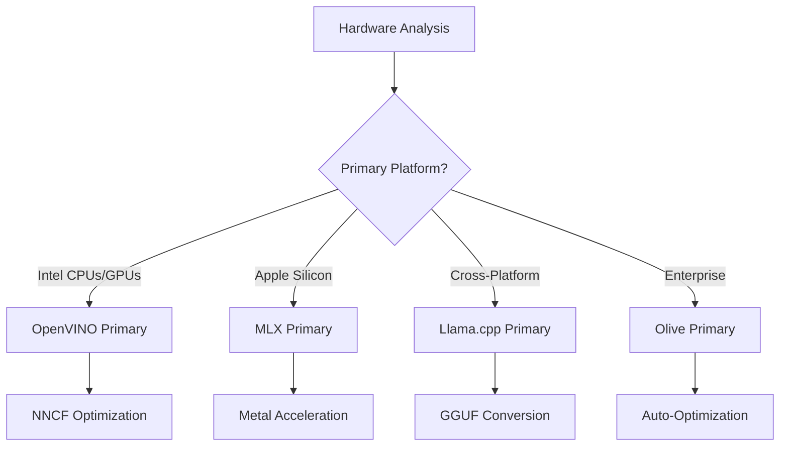
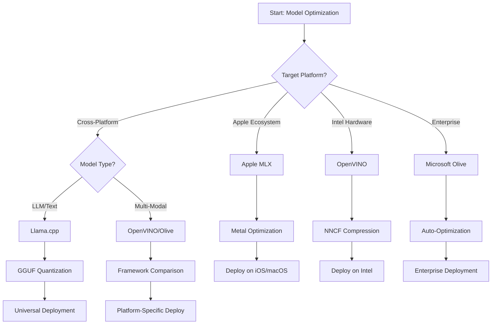
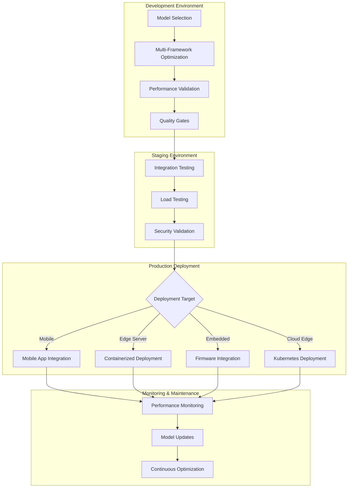

<!--
CO_OP_TRANSLATOR_METADATA:
{
  "original_hash": "6719c4a7e44b948230ac5f5cab3699bd",
  "translation_date": "2025-09-15T17:11:33+00:00",
  "source_file": "Module04/06.workflow-synthesis.md",
  "language_code": "ja"
}
-->
# セクション6: Edge AI開発ワークフローの統合

## 目次
1. [はじめに](../../../Module04)
2. [学習目標](../../../Module04)
3. [統合ワークフロー概要](../../../Module04)
4. [フレームワーク選択マトリックス](../../../Module04)
5. [ベストプラクティスの統合](../../../Module04)
6. [デプロイメント戦略ガイド](../../../Module04)
7. [パフォーマンス最適化ワークフロー](../../../Module04)
8. [本番準備チェックリスト](../../../Module04)
9. [トラブルシューティングとモニタリング](../../../Module04)
10. [Edge AIパイプラインの将来性確保](../../../Module04)

## はじめに

Edge AI開発には、複数の最適化フレームワーク、デプロイメント戦略、ハードウェアの考慮事項に関する高度な理解が必要です。この包括的な統合では、Llama.cpp、Microsoft Olive、OpenVINO、Apple MLXの知識を結集し、効率を最大化し、品質を維持し、成功する本番デプロイメントを保証する統合ワークフローを作成します。

このコースを通じて、各最適化フレームワークの個別の強みと専門的なユースケースを探求してきました。しかし、実際のEdge AIプロジェクトでは、複数のフレームワークの技術を組み合わせたり、特定の制約や要件に最適なアプローチを選択する戦略的な決定を行う必要があります。

このセクションでは、すべてのフレームワークから得られた知識を実行可能なワークフロー、意思決定ツリー、ベストプラクティスに統合し、効率的かつ効果的に本番対応のEdge AIソリューションを構築できるようにします。モバイルデバイス、組み込みシステム、エッジサーバーのいずれを最適化する場合でも、このガイドは開発ライフサイクル全体で情報に基づいた意思決定を行うための戦略的フレームワークを提供します。

## 学習目標

このセクションを終えるまでに、以下ができるようになります：

### 戦略的意思決定
- **評価と選択**: プロジェクト要件、ハードウェア制約、デプロイメントシナリオに基づいて最適な最適化フレームワークを選択する
- **包括的なワークフロー設計**: 複数の最適化技術を統合して効率を最大化する
- **トレードオフの評価**: モデルの精度、推論速度、メモリ使用量、デプロイメントの複雑さの間でのバランスを評価する

### ワークフロー統合
- **統合開発パイプラインの実装**: 複数の最適化フレームワークの強みを活用する
- **再現可能なワークフローの作成**: 異なる環境で一貫したモデル最適化とデプロイメントを実現する
- **品質ゲートの確立**: 最適化されたモデルが本番要件を満たしていることを確認する

### パフォーマンス最適化
- **体系的な最適化戦略の適用**: 量子化、プルーニング、ハードウェア特有のアクセラレーション技術を使用する
- **モデル性能のモニタリングとベンチマーク**: 異なる最適化レベルとデプロイメントターゲットで性能を検証する
- **特定のハードウェアプラットフォーム向けの最適化**: CPU、GPU、NPU、特殊なエッジアクセラレータを含む

### 本番デプロイメント
- **スケーラブルなデプロイメントアーキテクチャの設計**: 複数のモデル形式と推論エンジンに対応する
- **モニタリングと可観測性の実装**: 本番環境でのEdge AIアプリケーションの監視を行う
- **メンテナンスワークフローの確立**: モデルの更新、性能モニタリング、システム最適化を行う

### クロスプラットフォームの卓越性
- **最適化されたモデルのデプロイ**: 多様なハードウェアプラットフォームで一貫した性能を維持する
- **プラットフォーム特有の最適化の対応**: Windows、macOS、Linux、モバイル、組み込みシステム向け
- **抽象化レイヤーの作成**: 異なるエッジ環境間でシームレスなデプロイメントを可能にする

## 統合ワークフロー概要

### フェーズ1: 要件分析とフレームワーク選択

成功するEdge AIデプロイメントの基盤は、徹底的な要件分析から始まり、それがフレームワーク選択と最適化戦略を導きます。

#### 1.1 ハードウェア評価


**重要な考慮事項:**
- **CPUアーキテクチャ**: x86、ARM、Apple Siliconの能力
- **アクセラレータの有無**: GPU、NPU、VPU、特殊なAIチップ
- **メモリ制約**: RAMの制限、ストレージ容量
- **電力予算**: バッテリー寿命、熱制約
- **接続性**: オフライン要件、帯域幅の制限

#### 1.2 アプリケーション要件マトリックス

| 要件 | Llama.cpp | Microsoft Olive | OpenVINO | Apple MLX |
|------|-----------|-----------------|----------|-----------|
| クロスプラットフォーム | ✅ 優秀 | ⚡ 良好 | ⚡ 良好 | ❌ Apple専用 |
| エンタープライズ統合 | ⚡ 基本 | ✅ 優秀 | ✅ 優秀 | ⚡ 限定的 |
| モバイルデプロイメント | ✅ 優秀 | ⚡ 良好 | ⚡ 良好 | ✅ iOS優秀 |
| リアルタイム推論 | ✅ 優秀 | ✅ 優秀 | ✅ 優秀 | ✅ 優秀 |
| モデルの多様性 | ✅ LLM特化 | ✅ 全モデル対応 | ✅ 全モデル対応 | ✅ LLM特化 |
| 使いやすさ | ✅ シンプル | ✅ 自動化 | ⚡ 中程度 | ✅ シンプル |

### フェーズ2: モデル準備と最適化

#### 2.1 ユニバーサルモデル評価パイプライン

```python
# Universal Model Assessment Framework
class EdgeAIModelAssessment:
    def __init__(self, model_path, target_hardware):
        self.model_path = model_path
        self.target_hardware = target_hardware
        self.optimization_frameworks = []
        
    def assess_model_characteristics(self):
        """Analyze model size, architecture, and complexity"""
        return {
            'model_size': self.get_model_size(),
            'parameter_count': self.get_parameter_count(),
            'architecture_type': self.detect_architecture(),
            'quantization_compatibility': self.check_quantization_support()
        }
    
    def recommend_optimization_strategy(self):
        """Recommend optimal frameworks and techniques"""
        characteristics = self.assess_model_characteristics()
        
        if self.target_hardware.startswith('apple'):
            return self.mlx_optimization_strategy(characteristics)
        elif self.target_hardware.startswith('intel'):
            return self.openvino_optimization_strategy(characteristics)
        elif characteristics['model_size'] > 7_000_000_000:  # 7B+ parameters
            return self.enterprise_optimization_strategy(characteristics)
        else:
            return self.lightweight_optimization_strategy(characteristics)
```

#### 2.2 マルチフレームワーク最適化パイプライン

**逐次最適化アプローチ:**
1. **初期変換**: 中間形式（可能であればONNX）への変換
2. **フレームワーク特有の最適化**: 専門的な技術を適用
3. **クロスバリデーション**: ターゲットプラットフォーム全体で性能を検証
4. **最終パッケージ化**: デプロイメントの準備

```bash
# Multi-Framework Optimization Script
#!/bin/bash

MODEL_NAME="phi-3-mini"
BASE_MODEL="microsoft/Phi-3-mini-4k-instruct"

# Phase 1: ONNX Conversion (Universal)
python convert_to_onnx.py --model $BASE_MODEL --output models/onnx/

# Phase 2: Platform-Specific Optimization
if [[ "$TARGET_PLATFORM" == "intel" ]]; then
    # OpenVINO Optimization
    python optimize_openvino.py --input models/onnx/ --output models/openvino/
elif [[ "$TARGET_PLATFORM" == "apple" ]]; then
    # MLX Optimization
    python optimize_mlx.py --input $BASE_MODEL --output models/mlx/
elif [[ "$TARGET_PLATFORM" == "cross" ]]; then
    # Llama.cpp Optimization
    python convert_to_gguf.py --input models/onnx/ --output models/gguf/
fi

# Phase 3: Validation
python validate_optimization.py --original $BASE_MODEL --optimized models/$TARGET_PLATFORM/
```

### フェーズ3: 性能検証とベンチマーク

#### 3.1 包括的なベンチマークフレームワーク

```python
class EdgeAIBenchmark:
    def __init__(self, optimized_models):
        self.models = optimized_models
        self.metrics = {
            'inference_time': [],
            'memory_usage': [],
            'accuracy_score': [],
            'throughput': [],
            'energy_consumption': []
        }
    
    def run_comprehensive_benchmark(self):
        """Execute standardized benchmarks across all optimized models"""
        test_inputs = self.generate_test_inputs()
        
        for model_framework, model_path in self.models.items():
            print(f"Benchmarking {model_framework}...")
            
            # Latency Testing
            latency = self.measure_inference_latency(model_path, test_inputs)
            
            # Memory Profiling
            memory = self.profile_memory_usage(model_path)
            
            # Accuracy Validation
            accuracy = self.validate_model_accuracy(model_path, test_inputs)
            
            # Throughput Analysis
            throughput = self.measure_throughput(model_path)
            
            self.record_metrics(model_framework, latency, memory, accuracy, throughput)
    
    def generate_optimization_report(self):
        """Create comprehensive comparison report"""
        report = {
            'recommendations': self.analyze_performance_trade_offs(),
            'deployment_guidance': self.generate_deployment_recommendations(),
            'monitoring_requirements': self.define_monitoring_metrics()
        }
        return report
```

## フレームワーク選択マトリックス

### フレームワーク選択の意思決定ツリー



### 包括的な選択基準

#### 1. 主なユースケースの整合性

**大規模言語モデル（LLMs）:**
- **Llama.cpp**: CPU中心のクロスプラットフォームデプロイメントに最適
- **Apple MLX**: Apple Siliconの統合メモリに最適
- **OpenVINO**: IntelハードウェアとNNCF最適化に優れる
- **Microsoft Olive**: 自動化されたエンタープライズワークフローに最適

**マルチモーダルモデル:**
- **OpenVINO**: ビジョン、音声、テキストの包括的なサポート
- **Microsoft Olive**: 複雑なパイプライン向けのエンタープライズ最適化
- **Llama.cpp**: テキストベースモデルに限定
- **Apple MLX**: マルチモーダルアプリケーションのサポートが拡大中

#### 2. ハードウェアプラットフォームマトリックス

| プラットフォーム | 主なフレームワーク | 第二選択肢 | 特殊機能 |
|------------------|------------------|------------|----------|
| Intel CPU/GPU | OpenVINO | Microsoft Olive | NNCF圧縮、Intel最適化 |
| NVIDIA GPU | Microsoft Olive | OpenVINO | CUDAアクセラレーション、エンタープライズ機能 |
| Apple Silicon | Apple MLX | Llama.cpp | Metalシェーダー、統合メモリ |
| ARMモバイル | Llama.cpp | OpenVINO | クロスプラットフォーム、最小依存性 |
| Edge TPU | OpenVINO | Microsoft Olive | 特殊アクセラレータサポート |
| 組み込みARM | Llama.cpp | OpenVINO | 最小フットプリント、効率的推論 |

#### 3. 開発ワークフローの好み

**迅速なプロトタイピング:**
1. **Llama.cpp**: 最速のセットアップ、即時結果
2. **Apple MLX**: シンプルなPython API、迅速な反復
3. **Microsoft Olive**: 自動化された最適化、最小構成
4. **OpenVINO**: より複雑なセットアップ、包括的な機能

**エンタープライズ本番環境:**
1. **Microsoft Olive**: エンタープライズ機能、Azure統合
2. **OpenVINO**: Intelエコシステム、包括的ツール
3. **Apple MLX**: Apple特有のエンタープライズアプリケーション
4. **Llama.cpp**: シンプルなデプロイメント、エンタープライズ機能は限定的

## ベストプラクティスの統合

### ユニバーサル最適化原則

#### 1. 段階的最適化戦略

```python
class ProgressiveOptimization:
    def __init__(self, base_model):
        self.base_model = base_model
        self.optimization_stages = [
            'baseline_measurement',
            'format_conversion',
            'quantization_optimization',
            'hardware_acceleration',
            'production_validation'
        ]
    
    def execute_progressive_optimization(self):
        """Apply optimization techniques incrementally"""
        
        # Stage 1: Baseline Measurement
        baseline_metrics = self.measure_baseline_performance()
        
        # Stage 2: Format Conversion
        converted_model = self.convert_to_optimal_format()
        conversion_metrics = self.measure_performance(converted_model)
        
        # Stage 3: Quantization
        quantized_model = self.apply_quantization(converted_model)
        quantization_metrics = self.measure_performance(quantized_model)
        
        # Stage 4: Hardware Acceleration
        accelerated_model = self.enable_hardware_acceleration(quantized_model)
        acceleration_metrics = self.measure_performance(accelerated_model)
        
        # Stage 5: Validation
        production_ready = self.validate_for_production(accelerated_model)
        
        return self.compile_optimization_report(
            baseline_metrics, conversion_metrics, 
            quantization_metrics, acceleration_metrics
        )
```

#### 2. 品質ゲートの実装

**精度維持ゲート:**
- 元のモデル精度の95%以上を維持
- 代表的なテストデータセットで検証
- 本番検証のためのA/Bテストを実施

**性能向上ゲート:**
- 最低2倍の速度向上を達成
- メモリ使用量を50%以上削減
- 推論時間の一貫性を検証

**本番準備ゲート:**
- 負荷下でのストレステストを通過
- 長期間の安定した性能を実証
- セキュリティとプライバシー要件を検証

### フレームワーク特有のベストプラクティス統合

#### 1. 量子化戦略の統合

```python
# Unified Quantization Approach
class UnifiedQuantizationStrategy:
    def __init__(self, model, target_platform):
        self.model = model
        self.platform = target_platform
        
    def select_optimal_quantization(self):
        """Choose best quantization based on platform and requirements"""
        
        if self.platform == 'apple_silicon':
            return self.mlx_quantization_strategy()
        elif self.platform == 'intel_hardware':
            return self.openvino_quantization_strategy()
        elif self.platform == 'cross_platform':
            return self.llamacpp_quantization_strategy()
        else:
            return self.olive_quantization_strategy()
    
    def mlx_quantization_strategy(self):
        """Apple MLX-specific quantization"""
        return {
            'method': 'mlx_quantize',
            'precision': 'int4',
            'group_size': 64,
            'optimization_target': 'unified_memory'
        }
    
    def openvino_quantization_strategy(self):
        """OpenVINO NNCF quantization"""
        return {
            'method': 'nncf_quantize',
            'precision': 'int8',
            'calibration_method': 'post_training',
            'optimization_target': 'intel_hardware'
        }
```

#### 2. ハードウェアアクセラレーションの最適化

**CPU最適化統合:**
- **SIMD命令**: フレームワーク全体で最適化されたカーネルを活用
- **メモリ帯域幅**: キャッシュ効率を向上させるデータレイアウトを最適化
- **スレッド化**: 並列性とリソース制約のバランスを取る

**GPUアクセラレーションベストプラクティス:**
- **バッチ処理**: 適切なバッチサイズでスループットを最大化
- **メモリ管理**: GPUメモリの割り当てと転送を最適化
- **精度**: FP16がサポートされている場合は性能向上のために使用

**NPU/特殊アクセラレータの最適化:**
- **モデルアーキテクチャ**: アクセラレータの能力に対応することを確認
- **データフロー**: アクセラレータ効率のために入出力パイプラインを最適化
- **フォールバック戦略**: サポートされていない操作のためにCPUフォールバックを実装

## デプロイメント戦略ガイド

### ユニバーサルデプロイメントアーキテクチャ



### プラットフォーム特有のデプロイメントパターン

#### 1. モバイルデプロイメント戦略

```yaml
# Mobile Deployment Configuration
mobile_deployment:
  ios:
    framework: apple_mlx
    optimization:
      quantization: int4
      memory_mapping: true
      background_execution: limited
    packaging:
      format: mlx
      bundle_size: <50MB
      
  android:
    framework: llama_cpp
    optimization:
      quantization: q4_k_m
      threading: android_optimized
      memory_management: conservative
    packaging:
      format: gguf
      apk_size: <100MB
      
  cross_platform:
    framework: onnx_runtime
    optimization:
      quantization: int8
      execution_provider: cpu
    packaging:
      format: onnx
      shared_libraries: minimal
```

#### 2. エッジサーバーデプロイメント

```yaml
# Edge Server Deployment Configuration
edge_server:
  intel_based:
    framework: openvino
    optimization:
      quantization: int8
      acceleration: cpu_gpu_auto
      batch_processing: dynamic
    deployment:
      container: openvino_runtime
      orchestration: kubernetes
      scaling: horizontal
      
  nvidia_based:
    framework: microsoft_olive
    optimization:
      quantization: int4
      acceleration: cuda
      tensor_parallelism: true
    deployment:
      container: nvidia_triton
      orchestration: kubernetes
      scaling: gpu_aware
```

### コンテナ化ベストプラクティス

```dockerfile
# Multi-Framework Edge AI Container
FROM ubuntu:22.04 as base

# Install common dependencies
RUN apt-get update && apt-get install -y \
    python3 \
    python3-pip \
    build-essential \
    cmake \
    && rm -rf /var/lib/apt/lists/*

# Framework-specific stages
FROM base as openvino
RUN pip install openvino nncf optimum[intel]

FROM base as llamacpp
RUN git clone https://github.com/ggerganov/llama.cpp.git \
    && cd llama.cpp && make LLAMA_OPENBLAS=1

FROM base as olive
RUN pip install olive-ai[auto-opt] onnxruntime-genai

# Production stage with selected framework
FROM openvino as production
COPY models/ /app/models/
COPY src/ /app/src/
WORKDIR /app

EXPOSE 8080
CMD ["python3", "src/inference_server.py"]
```

## パフォーマンス最適化ワークフロー

### 体系的な性能調整

#### 1. 性能プロファイリングパイプライン

```python
class EdgeAIPerformanceProfiler:
    def __init__(self, model_path, framework):
        self.model_path = model_path
        self.framework = framework
        self.profiling_results = {}
    
    def comprehensive_profiling(self):
        """Execute comprehensive performance analysis"""
        
        # CPU Profiling
        cpu_profile = self.profile_cpu_usage()
        
        # Memory Profiling
        memory_profile = self.profile_memory_usage()
        
        # Inference Latency
        latency_profile = self.profile_inference_latency()
        
        # Throughput Analysis
        throughput_profile = self.profile_throughput()
        
        # Energy Consumption (where available)
        energy_profile = self.profile_energy_consumption()
        
        return self.compile_performance_report(
            cpu_profile, memory_profile, latency_profile,
            throughput_profile, energy_profile
        )
    
    def identify_bottlenecks(self):
        """Automatically identify performance bottlenecks"""
        bottlenecks = []
        
        if self.profiling_results['cpu_utilization'] > 80:
            bottlenecks.append('cpu_bound')
        
        if self.profiling_results['memory_usage'] > 90:
            bottlenecks.append('memory_bound')
        
        if self.profiling_results['inference_variance'] > 20:
            bottlenecks.append('inconsistent_performance')
        
        return self.generate_optimization_recommendations(bottlenecks)
```

#### 2. 自動化された最適化パイプライン

```python
class AutomatedOptimizationPipeline:
    def __init__(self, base_model, target_constraints):
        self.base_model = base_model
        self.constraints = target_constraints
        self.optimization_history = []
    
    def execute_optimization_search(self):
        """Systematically search optimization space"""
        
        optimization_candidates = [
            {'quantization': 'int8', 'pruning': 0.1},
            {'quantization': 'int4', 'pruning': 0.2},
            {'quantization': 'int8', 'acceleration': 'gpu'},
            {'quantization': 'int4', 'acceleration': 'npu'}
        ]
        
        best_configuration = None
        best_score = 0
        
        for config in optimization_candidates:
            optimized_model = self.apply_optimization(config)
            score = self.evaluate_optimization(optimized_model)
            
            if score > best_score and self.meets_constraints(optimized_model):
                best_score = score
                best_configuration = config
            
            self.optimization_history.append({
                'config': config,
                'score': score,
                'model': optimized_model
            })
        
        return best_configuration, self.optimization_history
```

### 多目的最適化

#### 1. Edge AIのためのパレート最適化

```python
class ParetoOptimization:
    def __init__(self, objectives=['speed', 'accuracy', 'memory']):
        self.objectives = objectives
        self.pareto_frontier = []
    
    def find_pareto_optimal_solutions(self, optimization_results):
        """Identify Pareto-optimal configurations"""
        
        for result in optimization_results:
            is_dominated = False
            
            for frontier_point in self.pareto_frontier:
                if self.dominates(frontier_point, result):
                    is_dominated = True
                    break
            
            if not is_dominated:
                # Remove dominated points from frontier
                self.pareto_frontier = [
                    point for point in self.pareto_frontier 
                    if not self.dominates(result, point)
                ]
                
                self.pareto_frontier.append(result)
        
        return self.pareto_frontier
    
    def recommend_configuration(self, user_preferences):
        """Recommend configuration based on user preferences"""
        
        weighted_scores = []
        for config in self.pareto_frontier:
            score = sum(
                user_preferences[obj] * config['metrics'][obj] 
                for obj in self.objectives
            )
            weighted_scores.append((score, config))
        
        return max(weighted_scores, key=lambda x: x[0])[1]
```

## 本番準備チェックリスト

### 包括的な本番検証

#### 1. モデル品質保証

```python
class ProductionReadinessValidator:
    def __init__(self, optimized_model, production_requirements):
        self.model = optimized_model
        self.requirements = production_requirements
        self.validation_results = {}
    
    def validate_model_quality(self):
        """Comprehensive model quality validation"""
        
        # Accuracy Validation
        accuracy_result = self.validate_accuracy()
        
        # Performance Validation
        performance_result = self.validate_performance()
        
        # Robustness Testing
        robustness_result = self.validate_robustness()
        
        # Security Assessment
        security_result = self.validate_security()
        
        # Compliance Verification
        compliance_result = self.validate_compliance()
        
        return self.compile_validation_report(
            accuracy_result, performance_result, robustness_result,
            security_result, compliance_result
        )
    
    def generate_certification_report(self):
        """Generate production certification report"""
        return {
            'model_signature': self.generate_model_signature(),
            'validation_timestamp': datetime.now(),
            'validation_results': self.validation_results,
            'deployment_approval': self.check_deployment_approval(),
            'monitoring_requirements': self.define_monitoring_requirements()
        }
```

#### 2. 本番デプロイメントチェックリスト

**事前デプロイメント検証:**
- [ ] モデル精度が最低要件を満たしている（ベースラインの95%以上）
- [ ] 性能目標を達成している（レイテンシ、スループット、メモリ）
- [ ] セキュリティ脆弱性を評価し、軽減している
- [ ] 予想される負荷下でストレステストを完了している
- [ ] 障害シナリオをテストし、復旧手順を検証している
- [ ] モニタリングとアラートシステムを構成している
- [ ] ロールバック手順をテストし、文書化している

**デプロイメントプロセス:**
- [ ] ブルーグリーンデプロイメント戦略を実装している
- [ ] 徐々にトラフィックを増加させる設定を行っている
- [ ] リアルタイムモニタリングダッシュボードをアクティブにしている
- [ ] 性能ベースラインを確立している
- [ ] エラーレートの閾値を定義している
- [ ] 自動ロールバックトリガーを構成している

**デプロイメント後のモニタリング:**
- [ ] モデルドリフト検出をアクティブにしている
- [ ] 性能劣化アラートを構成している
- [ ] リソース使用状況のモニタリングを有効にしている
- [ ] ユーザー体験メトリクスを追跡している
- [ ] モデルのバージョン管理と系譜を維持している
- [ ] 定期的なモデル性能レビューをスケジュールしている

### 継続的インテグレーション/継続的デプロイメント（CI/CD）

```yaml
# Edge AI CI/CD Pipeline Configuration
edge_ai_pipeline:
  stages:
    - model_validation
    - optimization
    - testing
    - staging_deployment
    - production_deployment
    - monitoring
  
  model_validation:
    accuracy_threshold: 0.95
    performance_baseline: required
    security_scan: enabled
    
  optimization:
    frameworks:
      - llama_cpp
      - openvino
      - microsoft_olive
    validation:
      cross_validation: enabled
      performance_comparison: required
      
  testing:
    unit_tests: comprehensive
    integration_tests: full_pipeline
    load_tests: production_scale
    security_tests: comprehensive
    
  deployment:
    strategy: blue_green
    traffic_ramping: gradual
    rollback: automatic
    monitoring: real_time
```

## トラブルシューティングとモニタリング

### ユニバーサルトラブルシューティングフレームワーク

#### 1. 一般的な問題と解決策

**性能問題:**
```python
class PerformanceTroubleshooter:
    def __init__(self, model_metrics):
        self.metrics = model_metrics
        
    def diagnose_performance_issues(self):
        """Systematic performance issue diagnosis"""
        
        issues = []
        
        # High latency diagnosis
        if self.metrics['avg_latency'] > self.metrics['target_latency']:
            issues.append(self.diagnose_latency_issues())
        
        # Memory usage diagnosis
        if self.metrics['memory_usage'] > self.metrics['memory_limit']:
            issues.append(self.diagnose_memory_issues())
        
        # Throughput diagnosis
        if self.metrics['throughput'] < self.metrics['target_throughput']:
            issues.append(self.diagnose_throughput_issues())
        
        return self.generate_resolution_plan(issues)
    
    def diagnose_latency_issues(self):
        """Specific latency troubleshooting"""
        potential_causes = []
        
        if self.metrics['cpu_utilization'] > 80:
            potential_causes.append('cpu_bottleneck')
        
        if self.metrics['memory_bandwidth'] > 90:
            potential_causes.append('memory_bandwidth_limit')
        
        if self.metrics['model_size'] > self.metrics['optimal_size']:
            potential_causes.append('model_too_large')
        
        return {
            'issue': 'high_latency',
            'causes': potential_causes,
            'solutions': self.generate_latency_solutions(potential_causes)
        }
```

**フレームワーク特有のトラブルシューティング:**

| 問題 | Llama.cpp | Microsoft Olive | OpenVINO | Apple MLX |
|------|-----------|-----------------|----------|-----------|
| メモリ問題 | コンテキスト長を短縮 | バッチサイズを減少 | キャッシュを有効化 | メモリマッピングを使用 |
| 推論が遅い | SIMDを有効化 | 量子化を確認 | スレッド化を最適化 | Metalを有効化 |
| 精度低下 | 高量子化 | QATで再学習 | キャリブレーションを増加 | 量子化後に微調整 |
| 互換性 | モデル形式を確認 | フレームワークバージョンを検証 | ドライバを更新 | macOSバージョンを確認 |

####
特定の要件を満たしつつ、それらの要件が進化する際に柔軟性を維持できる最適化戦略が最善です。このガイドを参考にして情報に基づいた決定を行いながら、必ず実証的なテストや実際の展開経験を通じて選択を検証してください。

## ➡️ 次に進む

[Module 5: SLMOpsと本番展開](../Module05/README.md)を探索し、小型言語モデルのライフサイクル管理における運用面について学びながら、Edge AIの旅を続けてください。

---

**免責事項**:  
この文書は、AI翻訳サービス [Co-op Translator](https://github.com/Azure/co-op-translator) を使用して翻訳されています。正確性を追求しておりますが、自動翻訳には誤りや不正確な部分が含まれる可能性があることをご承知ください。元の言語で記載された文書が正式な情報源とみなされるべきです。重要な情報については、専門の人間による翻訳を推奨します。この翻訳の使用に起因する誤解や誤った解釈について、当方は一切の責任を負いません。