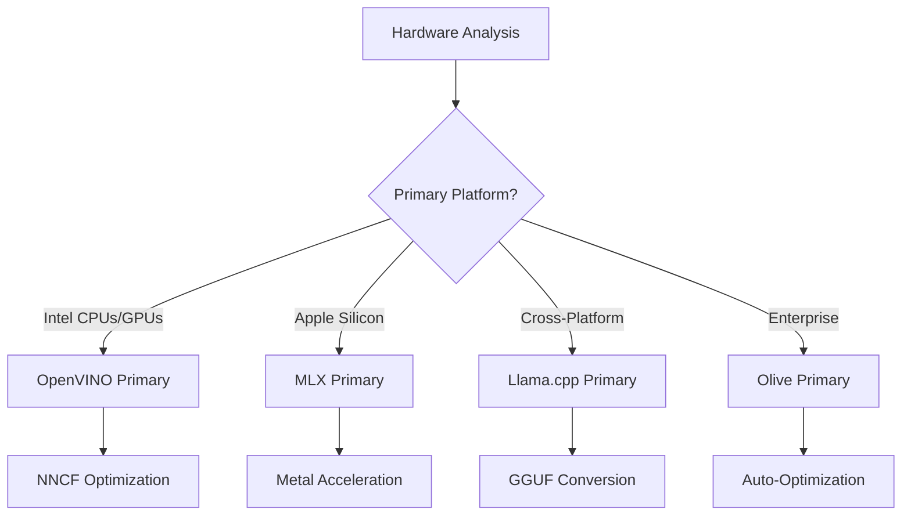
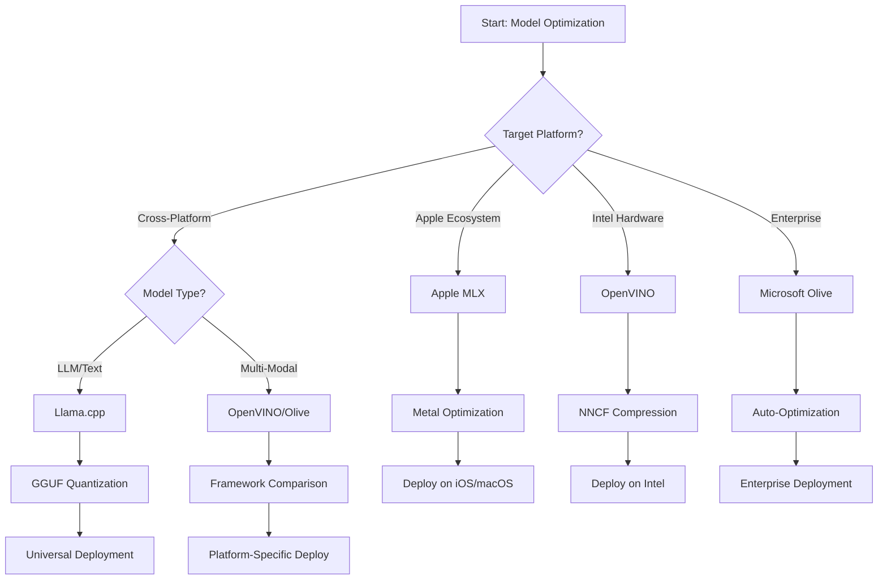
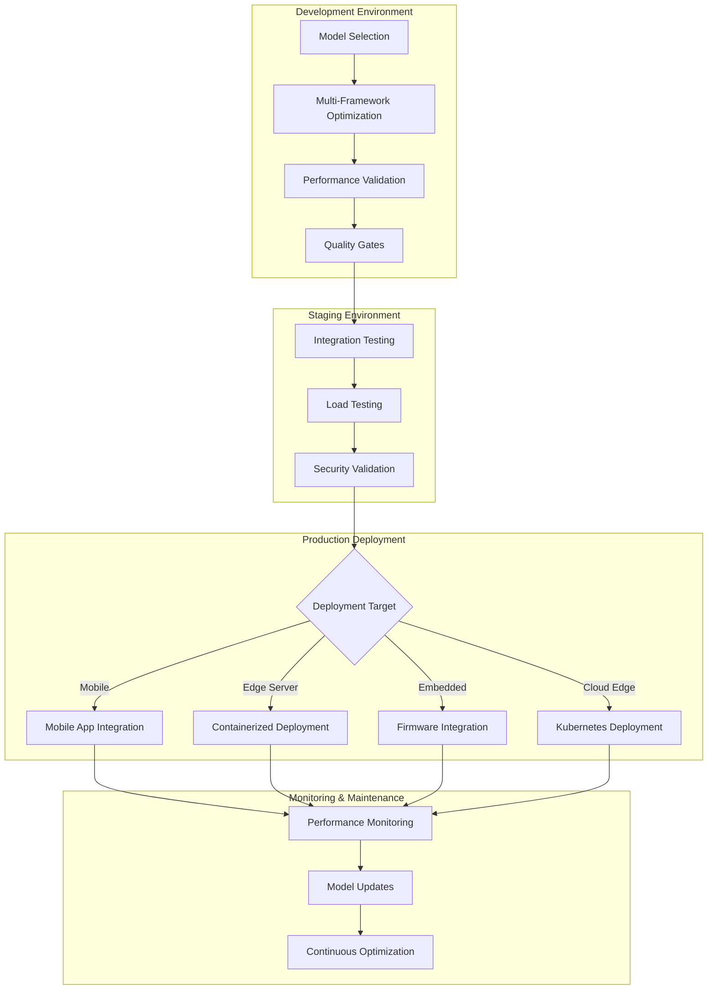

<!--
CO_OP_TRANSLATOR_METADATA:
{
  "original_hash": "6719c4a7e44b948230ac5f5cab3699bd",
  "translation_date": "2025-09-15T17:12:20+00:00",
  "source_file": "Module04/06.workflow-synthesis.md",
  "language_code": "ko"
}
-->
# 섹션 6: 엣지 AI 개발 워크플로우 종합

## 목차
1. [소개](../../../Module04)
2. [학습 목표](../../../Module04)
3. [통합 워크플로우 개요](../../../Module04)
4. [프레임워크 선택 매트릭스](../../../Module04)
5. [모범 사례 종합](../../../Module04)
6. [배포 전략 가이드](../../../Module04)
7. [성능 최적화 워크플로우](../../../Module04)
8. [프로덕션 준비 체크리스트](../../../Module04)
9. [문제 해결 및 모니터링](../../../Module04)
10. [엣지 AI 파이프라인의 미래 대비](../../../Module04)

## 소개

엣지 AI 개발은 다양한 최적화 프레임워크, 배포 전략, 하드웨어 고려 사항에 대한 깊은 이해를 요구합니다. 이 종합 가이드는 Llama.cpp, Microsoft Olive, OpenVINO, Apple MLX의 지식을 통합하여 효율성을 극대화하고 품질을 유지하며 성공적인 프로덕션 배포를 보장하는 통합 워크플로우를 제공합니다.

이 과정에서 우리는 각 프레임워크의 고유한 강점과 전문화된 사용 사례를 탐구했습니다. 하지만 실제 엣지 AI 프로젝트는 종종 여러 프레임워크의 기술을 결합하거나 특정 제약 조건과 요구 사항에 가장 적합한 접근 방식을 선택해야 합니다.

이 섹션은 모든 프레임워크의 집단적 지혜를 실행 가능한 워크플로우, 의사 결정 트리, 모범 사례로 종합하여 모바일 기기, 임베디드 시스템, 엣지 서버를 최적화하는 데 필요한 전략적 프레임워크를 제공합니다.

## 학습 목표

이 섹션을 완료하면 다음을 수행할 수 있습니다:

### 전략적 의사 결정
- 프로젝트 요구 사항, 하드웨어 제약, 배포 시나리오에 따라 최적의 최적화 프레임워크를 **평가하고 선택**합니다.
- 여러 최적화 기술을 통합하여 **포괄적인 워크플로우를 설계**합니다.
- 모델 정확도, 추론 속도, 메모리 사용량, 배포 복잡성 간의 **트레이드오프를 평가**합니다.

### 워크플로우 통합
- 여러 최적화 프레임워크의 강점을 활용하여 **통합 개발 파이프라인을 구현**합니다.
- 다양한 환경에서 일관된 모델 최적화 및 배포를 위한 **재현 가능한 워크플로우를 생성**합니다.
- 최적화된 모델이 프로덕션 요구 사항을 충족하도록 **품질 게이트와 검증 프로세스를 설정**합니다.

### 성능 최적화
- 양자화, 가지치기, 하드웨어별 가속 기술을 사용하여 **체계적인 최적화 전략을 적용**합니다.
- 다양한 최적화 수준과 배포 대상에서 모델 성능을 **모니터링하고 벤치마킹**합니다.
- CPU, GPU, NPU 및 특수 엣지 가속기를 포함한 특정 하드웨어 플랫폼에 **최적화**합니다.

### 프로덕션 배포
- 여러 모델 형식과 추론 엔진을 수용할 수 있는 **확장 가능한 배포 아키텍처를 설계**합니다.
- 프로덕션 환경에서 엣지 AI 애플리케이션을 위한 **모니터링 및 관찰 기능을 구현**합니다.
- 모델 업데이트, 성능 모니터링, 시스템 최적화를 위한 **유지 관리 워크플로우를 설정**합니다.

### 크로스 플랫폼 우수성
- 다양한 하드웨어 플랫폼에서 **최적화된 모델을 배포**하면서 일관된 성능을 유지합니다.
- Windows, macOS, Linux, 모바일 및 임베디드 시스템에 대한 **플랫폼별 최적화**를 처리합니다.
- 다양한 엣지 환경에서 원활한 배포를 가능하게 하는 **추상화 계층을 생성**합니다.

## 통합 워크플로우 개요

### 1단계: 요구 사항 분석 및 프레임워크 선택

성공적인 엣지 AI 배포의 기초는 철저한 요구 사항 분석으로, 이를 통해 프레임워크 선택과 최적화 전략을 결정합니다.

#### 1.1 하드웨어 평가


**주요 고려 사항:**
- **CPU 아키텍처**: x86, ARM, Apple Silicon 기능
- **가속기 사용 가능성**: GPU, NPU, VPU, 특수 AI 칩
- **메모리 제약**: RAM 제한, 저장 용량
- **전력 예산**: 배터리 수명, 열 제약
- **연결성**: 오프라인 요구 사항, 대역폭 제한

#### 1.2 애플리케이션 요구 사항 매트릭스

| 요구 사항 | Llama.cpp | Microsoft Olive | OpenVINO | Apple MLX |
|-----------|-----------|-----------------|----------|-----------|
| 크로스 플랫폼 | ✅ 우수 | ⚡ 양호 | ⚡ 양호 | ❌ Apple 전용 |
| 엔터프라이즈 통합 | ⚡ 기본 | ✅ 우수 | ✅ 우수 | ⚡ 제한적 |
| 모바일 배포 | ✅ 우수 | ⚡ 양호 | ⚡ 양호 | ✅ iOS 우수 |
| 실시간 추론 | ✅ 우수 | ✅ 우수 | ✅ 우수 | ✅ 우수 |
| 모델 다양성 | ✅ LLM 중심 | ✅ 모든 모델 | ✅ 모든 모델 | ✅ LLM 중심 |
| 사용 편의성 | ✅ 간단 | ✅ 자동화 | ⚡ 보통 | ✅ 간단 |

### 2단계: 모델 준비 및 최적화

#### 2.1 범용 모델 평가 파이프라인

```python
# Universal Model Assessment Framework
class EdgeAIModelAssessment:
    def __init__(self, model_path, target_hardware):
        self.model_path = model_path
        self.target_hardware = target_hardware
        self.optimization_frameworks = []
        
    def assess_model_characteristics(self):
        """Analyze model size, architecture, and complexity"""
        return {
            'model_size': self.get_model_size(),
            'parameter_count': self.get_parameter_count(),
            'architecture_type': self.detect_architecture(),
            'quantization_compatibility': self.check_quantization_support()
        }
    
    def recommend_optimization_strategy(self):
        """Recommend optimal frameworks and techniques"""
        characteristics = self.assess_model_characteristics()
        
        if self.target_hardware.startswith('apple'):
            return self.mlx_optimization_strategy(characteristics)
        elif self.target_hardware.startswith('intel'):
            return self.openvino_optimization_strategy(characteristics)
        elif characteristics['model_size'] > 7_000_000_000:  # 7B+ parameters
            return self.enterprise_optimization_strategy(characteristics)
        else:
            return self.lightweight_optimization_strategy(characteristics)
```

#### 2.2 다중 프레임워크 최적화 파이프라인

**순차적 최적화 접근법:**
1. **초기 변환**: 중간 형식으로 변환 (가능하면 ONNX)
2. **프레임워크별 최적화**: 특화된 기술 적용
3. **교차 검증**: 대상 플랫폼에서 성능 확인
4. **최종 패키징**: 배포 준비

```bash
# Multi-Framework Optimization Script
#!/bin/bash

MODEL_NAME="phi-3-mini"
BASE_MODEL="microsoft/Phi-3-mini-4k-instruct"

# Phase 1: ONNX Conversion (Universal)
python convert_to_onnx.py --model $BASE_MODEL --output models/onnx/

# Phase 2: Platform-Specific Optimization
if [[ "$TARGET_PLATFORM" == "intel" ]]; then
    # OpenVINO Optimization
    python optimize_openvino.py --input models/onnx/ --output models/openvino/
elif [[ "$TARGET_PLATFORM" == "apple" ]]; then
    # MLX Optimization
    python optimize_mlx.py --input $BASE_MODEL --output models/mlx/
elif [[ "$TARGET_PLATFORM" == "cross" ]]; then
    # Llama.cpp Optimization
    python convert_to_gguf.py --input models/onnx/ --output models/gguf/
fi

# Phase 3: Validation
python validate_optimization.py --original $BASE_MODEL --optimized models/$TARGET_PLATFORM/
```

### 3단계: 성능 검증 및 벤치마킹

#### 3.1 종합 벤치마킹 프레임워크

```python
class EdgeAIBenchmark:
    def __init__(self, optimized_models):
        self.models = optimized_models
        self.metrics = {
            'inference_time': [],
            'memory_usage': [],
            'accuracy_score': [],
            'throughput': [],
            'energy_consumption': []
        }
    
    def run_comprehensive_benchmark(self):
        """Execute standardized benchmarks across all optimized models"""
        test_inputs = self.generate_test_inputs()
        
        for model_framework, model_path in self.models.items():
            print(f"Benchmarking {model_framework}...")
            
            # Latency Testing
            latency = self.measure_inference_latency(model_path, test_inputs)
            
            # Memory Profiling
            memory = self.profile_memory_usage(model_path)
            
            # Accuracy Validation
            accuracy = self.validate_model_accuracy(model_path, test_inputs)
            
            # Throughput Analysis
            throughput = self.measure_throughput(model_path)
            
            self.record_metrics(model_framework, latency, memory, accuracy, throughput)
    
    def generate_optimization_report(self):
        """Create comprehensive comparison report"""
        report = {
            'recommendations': self.analyze_performance_trade_offs(),
            'deployment_guidance': self.generate_deployment_recommendations(),
            'monitoring_requirements': self.define_monitoring_metrics()
        }
        return report
```

## 프레임워크 선택 매트릭스

### 프레임워크 선택을 위한 의사 결정 트리



### 종합 선택 기준

#### 1. 주요 사용 사례 정렬

**대형 언어 모델 (LLMs):**
- **Llama.cpp**: CPU 중심, 크로스 플랫폼 배포에 최적
- **Apple MLX**: Apple Silicon과 통합 메모리에 최적화
- **OpenVINO**: Intel 하드웨어와 NNCF 최적화에 우수
- **Microsoft Olive**: 자동화된 엔터프라이즈 워크플로우에 이상적

**멀티모달 모델:**
- **OpenVINO**: 비전, 오디오, 텍스트를 포괄적으로 지원
- **Microsoft Olive**: 복잡한 파이프라인을 위한 엔터프라이즈급 최적화
- **Llama.cpp**: 텍스트 기반 모델에 제한적
- **Apple MLX**: 멀티모달 애플리케이션 지원 증가

#### 2. 하드웨어 플랫폼 매트릭스

| 플랫폼 | 주요 프레임워크 | 보조 옵션 | 특화된 기능 |
|--------|----------------|-----------|-------------|
| Intel CPU/GPU | OpenVINO | Microsoft Olive | NNCF 압축, Intel 최적화 |
| NVIDIA GPU | Microsoft Olive | OpenVINO | CUDA 가속, 엔터프라이즈 기능 |
| Apple Silicon | Apple MLX | Llama.cpp | Metal 셰이더, 통합 메모리 |
| ARM 모바일 | Llama.cpp | OpenVINO | 크로스 플랫폼, 최소 종속성 |
| Edge TPU | OpenVINO | Microsoft Olive | 특화된 가속기 지원 |
| 임베디드 ARM | Llama.cpp | OpenVINO | 최소 풋프린트, 효율적 추론 |

#### 3. 개발 워크플로우 선호도

**빠른 프로토타이핑:**
1. **Llama.cpp**: 가장 빠른 설정, 즉각적인 결과
2. **Apple MLX**: 간단한 Python API, 빠른 반복
3. **Microsoft Olive**: 자동화된 최적화, 최소 구성
4. **OpenVINO**: 더 복잡한 설정, 포괄적 기능

**엔터프라이즈 프로덕션:**
1. **Microsoft Olive**: 엔터프라이즈 기능, Azure 통합
2. **OpenVINO**: Intel 생태계, 포괄적 도구
3. **Apple MLX**: Apple 전용 엔터프라이즈 애플리케이션
4. **Llama.cpp**: 간단한 배포, 제한된 엔터프라이즈 기능

## 모범 사례 종합

### 범용 최적화 원칙

#### 1. 점진적 최적화 전략

```python
class ProgressiveOptimization:
    def __init__(self, base_model):
        self.base_model = base_model
        self.optimization_stages = [
            'baseline_measurement',
            'format_conversion',
            'quantization_optimization',
            'hardware_acceleration',
            'production_validation'
        ]
    
    def execute_progressive_optimization(self):
        """Apply optimization techniques incrementally"""
        
        # Stage 1: Baseline Measurement
        baseline_metrics = self.measure_baseline_performance()
        
        # Stage 2: Format Conversion
        converted_model = self.convert_to_optimal_format()
        conversion_metrics = self.measure_performance(converted_model)
        
        # Stage 3: Quantization
        quantized_model = self.apply_quantization(converted_model)
        quantization_metrics = self.measure_performance(quantized_model)
        
        # Stage 4: Hardware Acceleration
        accelerated_model = self.enable_hardware_acceleration(quantized_model)
        acceleration_metrics = self.measure_performance(accelerated_model)
        
        # Stage 5: Validation
        production_ready = self.validate_for_production(accelerated_model)
        
        return self.compile_optimization_report(
            baseline_metrics, conversion_metrics, 
            quantization_metrics, acceleration_metrics
        )
```

#### 2. 품질 게이트 구현

**정확도 유지 게이트:**
- 원래 모델 정확도의 95% 이상 유지
- 대표적인 테스트 데이터셋으로 검증
- 프로덕션 검증을 위한 A/B 테스트 구현

**성능 개선 게이트:**
- 최소 2배 속도 개선 달성
- 메모리 풋프린트 최소 50% 감소
- 추론 시간 일관성 검증

**프로덕션 준비 게이트:**
- 부하 상태에서 스트레스 테스트 통과
- 장시간 안정적인 성능 입증
- 보안 및 개인정보 요구 사항 검증

### 프레임워크별 모범 사례 통합

#### 1. 양자화 전략 종합

```python
# Unified Quantization Approach
class UnifiedQuantizationStrategy:
    def __init__(self, model, target_platform):
        self.model = model
        self.platform = target_platform
        
    def select_optimal_quantization(self):
        """Choose best quantization based on platform and requirements"""
        
        if self.platform == 'apple_silicon':
            return self.mlx_quantization_strategy()
        elif self.platform == 'intel_hardware':
            return self.openvino_quantization_strategy()
        elif self.platform == 'cross_platform':
            return self.llamacpp_quantization_strategy()
        else:
            return self.olive_quantization_strategy()
    
    def mlx_quantization_strategy(self):
        """Apple MLX-specific quantization"""
        return {
            'method': 'mlx_quantize',
            'precision': 'int4',
            'group_size': 64,
            'optimization_target': 'unified_memory'
        }
    
    def openvino_quantization_strategy(self):
        """OpenVINO NNCF quantization"""
        return {
            'method': 'nncf_quantize',
            'precision': 'int8',
            'calibration_method': 'post_training',
            'optimization_target': 'intel_hardware'
        }
```

#### 2. 하드웨어 가속 최적화

**CPU 최적화 종합:**
- **SIMD 명령어**: 프레임워크 전반에 걸쳐 최적화된 커널 활용
- **메모리 대역폭**: 캐시 효율성을 위한 데이터 레이아웃 최적화
- **스레딩**: 병렬 처리와 리소스 제약 간의 균형 유지

**GPU 가속 모범 사례:**
- **배치 처리**: 적절한 배치 크기로 처리량 극대화
- **메모리 관리**: GPU 메모리 할당 및 전송 최적화
- **정밀도**: FP16 지원 시 성능 향상

**NPU/특수 가속기 최적화:**
- **모델 아키텍처**: 가속기 기능과 호환성 보장
- **데이터 흐름**: 가속기 효율성을 위한 입출력 파이프라인 최적화
- **대체 전략**: 지원되지 않는 작업에 대한 CPU 대체 구현

## 배포 전략 가이드

### 범용 배포 아키텍처



### 플랫폼별 배포 패턴

#### 1. 모바일 배포 전략

```yaml
# Mobile Deployment Configuration
mobile_deployment:
  ios:
    framework: apple_mlx
    optimization:
      quantization: int4
      memory_mapping: true
      background_execution: limited
    packaging:
      format: mlx
      bundle_size: <50MB
      
  android:
    framework: llama_cpp
    optimization:
      quantization: q4_k_m
      threading: android_optimized
      memory_management: conservative
    packaging:
      format: gguf
      apk_size: <100MB
      
  cross_platform:
    framework: onnx_runtime
    optimization:
      quantization: int8
      execution_provider: cpu
    packaging:
      format: onnx
      shared_libraries: minimal
```

#### 2. 엣지 서버 배포

```yaml
# Edge Server Deployment Configuration
edge_server:
  intel_based:
    framework: openvino
    optimization:
      quantization: int8
      acceleration: cpu_gpu_auto
      batch_processing: dynamic
    deployment:
      container: openvino_runtime
      orchestration: kubernetes
      scaling: horizontal
      
  nvidia_based:
    framework: microsoft_olive
    optimization:
      quantization: int4
      acceleration: cuda
      tensor_parallelism: true
    deployment:
      container: nvidia_triton
      orchestration: kubernetes
      scaling: gpu_aware
```

### 컨테이너화 모범 사례

```dockerfile
# Multi-Framework Edge AI Container
FROM ubuntu:22.04 as base

# Install common dependencies
RUN apt-get update && apt-get install -y \
    python3 \
    python3-pip \
    build-essential \
    cmake \
    && rm -rf /var/lib/apt/lists/*

# Framework-specific stages
FROM base as openvino
RUN pip install openvino nncf optimum[intel]

FROM base as llamacpp
RUN git clone https://github.com/ggerganov/llama.cpp.git \
    && cd llama.cpp && make LLAMA_OPENBLAS=1

FROM base as olive
RUN pip install olive-ai[auto-opt] onnxruntime-genai

# Production stage with selected framework
FROM openvino as production
COPY models/ /app/models/
COPY src/ /app/src/
WORKDIR /app

EXPOSE 8080
CMD ["python3", "src/inference_server.py"]
```

## 성능 최적화 워크플로우

### 체계적인 성능 조정

#### 1. 성능 프로파일링 파이프라인

```python
class EdgeAIPerformanceProfiler:
    def __init__(self, model_path, framework):
        self.model_path = model_path
        self.framework = framework
        self.profiling_results = {}
    
    def comprehensive_profiling(self):
        """Execute comprehensive performance analysis"""
        
        # CPU Profiling
        cpu_profile = self.profile_cpu_usage()
        
        # Memory Profiling
        memory_profile = self.profile_memory_usage()
        
        # Inference Latency
        latency_profile = self.profile_inference_latency()
        
        # Throughput Analysis
        throughput_profile = self.profile_throughput()
        
        # Energy Consumption (where available)
        energy_profile = self.profile_energy_consumption()
        
        return self.compile_performance_report(
            cpu_profile, memory_profile, latency_profile,
            throughput_profile, energy_profile
        )
    
    def identify_bottlenecks(self):
        """Automatically identify performance bottlenecks"""
        bottlenecks = []
        
        if self.profiling_results['cpu_utilization'] > 80:
            bottlenecks.append('cpu_bound')
        
        if self.profiling_results['memory_usage'] > 90:
            bottlenecks.append('memory_bound')
        
        if self.profiling_results['inference_variance'] > 20:
            bottlenecks.append('inconsistent_performance')
        
        return self.generate_optimization_recommendations(bottlenecks)
```

#### 2. 자동화된 최적화 파이프라인

```python
class AutomatedOptimizationPipeline:
    def __init__(self, base_model, target_constraints):
        self.base_model = base_model
        self.constraints = target_constraints
        self.optimization_history = []
    
    def execute_optimization_search(self):
        """Systematically search optimization space"""
        
        optimization_candidates = [
            {'quantization': 'int8', 'pruning': 0.1},
            {'quantization': 'int4', 'pruning': 0.2},
            {'quantization': 'int8', 'acceleration': 'gpu'},
            {'quantization': 'int4', 'acceleration': 'npu'}
        ]
        
        best_configuration = None
        best_score = 0
        
        for config in optimization_candidates:
            optimized_model = self.apply_optimization(config)
            score = self.evaluate_optimization(optimized_model)
            
            if score > best_score and self.meets_constraints(optimized_model):
                best_score = score
                best_configuration = config
            
            self.optimization_history.append({
                'config': config,
                'score': score,
                'model': optimized_model
            })
        
        return best_configuration, self.optimization_history
```

### 다목적 최적화

#### 1. 엣지 AI를 위한 파레토 최적화

```python
class ParetoOptimization:
    def __init__(self, objectives=['speed', 'accuracy', 'memory']):
        self.objectives = objectives
        self.pareto_frontier = []
    
    def find_pareto_optimal_solutions(self, optimization_results):
        """Identify Pareto-optimal configurations"""
        
        for result in optimization_results:
            is_dominated = False
            
            for frontier_point in self.pareto_frontier:
                if self.dominates(frontier_point, result):
                    is_dominated = True
                    break
            
            if not is_dominated:
                # Remove dominated points from frontier
                self.pareto_frontier = [
                    point for point in self.pareto_frontier 
                    if not self.dominates(result, point)
                ]
                
                self.pareto_frontier.append(result)
        
        return self.pareto_frontier
    
    def recommend_configuration(self, user_preferences):
        """Recommend configuration based on user preferences"""
        
        weighted_scores = []
        for config in self.pareto_frontier:
            score = sum(
                user_preferences[obj] * config['metrics'][obj] 
                for obj in self.objectives
            )
            weighted_scores.append((score, config))
        
        return max(weighted_scores, key=lambda x: x[0])[1]
```

## 프로덕션 준비 체크리스트

### 종합적인 프로덕션 검증

#### 1. 모델 품질 보증

```python
class ProductionReadinessValidator:
    def __init__(self, optimized_model, production_requirements):
        self.model = optimized_model
        self.requirements = production_requirements
        self.validation_results = {}
    
    def validate_model_quality(self):
        """Comprehensive model quality validation"""
        
        # Accuracy Validation
        accuracy_result = self.validate_accuracy()
        
        # Performance Validation
        performance_result = self.validate_performance()
        
        # Robustness Testing
        robustness_result = self.validate_robustness()
        
        # Security Assessment
        security_result = self.validate_security()
        
        # Compliance Verification
        compliance_result = self.validate_compliance()
        
        return self.compile_validation_report(
            accuracy_result, performance_result, robustness_result,
            security_result, compliance_result
        )
    
    def generate_certification_report(self):
        """Generate production certification report"""
        return {
            'model_signature': self.generate_model_signature(),
            'validation_timestamp': datetime.now(),
            'validation_results': self.validation_results,
            'deployment_approval': self.check_deployment_approval(),
            'monitoring_requirements': self.define_monitoring_requirements()
        }
```

#### 2. 프로덕션 배포 체크리스트

**배포 전 검증:**
- [ ] 모델 정확도가 최소 요구 사항 충족 (>95% 기준선)
- [ ] 성능 목표 달성 (지연 시간, 처리량, 메모리)
- [ ] 보안 취약점 평가 및 완화
- [ ] 예상 부하 상태에서 스트레스 테스트 완료
- [ ] 실패 시나리오 테스트 및 복구 절차 검증
- [ ] 모니터링 및 경고 시스템 구성
- [ ] 롤백 절차 테스트 및 문서화

**배포 프로세스:**
- [ ] 블루-그린 배포 전략 구현
- [ ] 점진적 트래픽 증가 구성
- [ ] 실시간 모니터링 대시보드 활성화
- [ ] 성능 기준선 설정
- [ ] 오류율 임계값 정의
- [ ] 자동 롤백 트리거 구성

**배포 후 모니터링:**
- [ ] 모델 드리프트 감지 활성화
- [ ] 성능 저하 경고 구성
- [ ] 리소스 사용량 모니터링 활성화
- [ ] 사용자 경험 지표 추적
- [ ] 모델 버전 관리 및 계보 유지
- [ ] 정기적인 모델 성능 검토 일정 수립

### 지속적 통합/지속적 배포 (CI/CD)

```yaml
# Edge AI CI/CD Pipeline Configuration
edge_ai_pipeline:
  stages:
    - model_validation
    - optimization
    - testing
    - staging_deployment
    - production_deployment
    - monitoring
  
  model_validation:
    accuracy_threshold: 0.95
    performance_baseline: required
    security_scan: enabled
    
  optimization:
    frameworks:
      - llama_cpp
      - openvino
      - microsoft_olive
    validation:
      cross_validation: enabled
      performance_comparison: required
      
  testing:
    unit_tests: comprehensive
    integration_tests: full_pipeline
    load_tests: production_scale
    security_tests: comprehensive
    
  deployment:
    strategy: blue_green
    traffic_ramping: gradual
    rollback: automatic
    monitoring: real_time
```

## 문제 해결 및 모니터링

### 범용 문제 해결 프레임워크

#### 1. 일반적인 문제와 해결책

**성능 문제:**
```python
class PerformanceTroubleshooter:
    def __init__(self, model_metrics):
        self.metrics = model_metrics
        
    def diagnose_performance_issues(self):
        """Systematic performance issue diagnosis"""
        
        issues = []
        
        # High latency diagnosis
        if self.metrics['avg_latency'] > self.metrics['target_latency']:
            issues.append(self.diagnose_latency_issues())
        
        # Memory usage diagnosis
        if self.metrics['memory_usage'] > self.metrics['memory_limit']:
            issues.append(self.diagnose_memory_issues())
        
        # Throughput diagnosis
        if self.metrics['throughput'] < self.metrics['target_throughput']:
            issues.append(self.diagnose_throughput_issues())
        
        return self.generate_resolution_plan(issues)
    
    def diagnose_latency_issues(self):
        """Specific latency troubleshooting"""
        potential_causes = []
        
        if self.metrics['cpu_utilization'] > 80:
            potential_causes.append('cpu_bottleneck')
        
        if self.metrics['memory_bandwidth'] > 90:
            potential_causes.append('memory_bandwidth_limit')
        
        if self.metrics['model_size'] > self.metrics['optimal_size']:
            potential_causes.append('model_too_large')
        
        return {
            'issue': 'high_latency',
            'causes': potential_causes,
            'solutions': self.generate_latency_solutions(potential_causes)
        }
```

**프레임워크별 문제 해결:**

| 문제 | Llama.cpp | Microsoft Olive | OpenVINO | Apple MLX |
|------|-----------|-----------------|----------|-----------|
| 메모리 문제 | 컨텍스트 길이 축소 | 배치 크기 감소 | 캐싱 활성화 | 메모리 매핑 사용 |
| 느린 추론 | SIMD 활성화 | 양자화 확인 | 스레딩 최적화 | Metal 활성화 |
| 정확도 손실 | 높은 양자화 | QAT로 재학습 | 캘리브레이션 증가 | 양자화 후 미세 조정 |
| 호환성 | 모델 형식 확인 | 프레임워크 버전 확인 | 드라이버 업데이트 | macOS 버전 확인 |

#### 2. 프로덕션 모니터링 전략

```python
class EdgeAIMonitoring:
    def __init__(self, deployment_config):
        self.config = deployment_config
        self.metrics_collectors = []
        self.alerting_rules = []
    
    def setup_comprehensive_monitoring(self):
        """Configure comprehensive monitoring for Edge AI deployment"""
        
        # Model Performance Monitoring
        self.setup_model_performance_monitoring()
        
        # Infrastructure Monitoring
        self.setup_infrastructure_monitoring()
        
        # Business Metrics Monitoring
        self.setup_business_metrics_monitoring()
        
        # Security Monitoring
        self.setup_security_monitoring()
    
    def setup_model_performance_monitoring(self):
        """Model-specific performance monitoring"""
        metrics = [
            'inference_latency_p50',
            'inference_latency_p95',
            'inference_latency_p99',
            'model_accuracy_drift',
            'prediction_confidence_distribution',
            'error_rate',
            'throughput_requests_per_second'
        ]
        
        for metric in metrics:
            self.add_metric_collector(metric)
            self.add_alerting_rule(metric)
    
    def detect_model_drift(self):
        """Automated model drift detection"""
        drift_indicators = [
            self.statistical_drift_detection(),
            self.performance_drift_detection(),
            self.data_distribution_shift_detection()
        ]
        
        return self.aggregate_drift_signals(drift_indicators)
```

### 자동화된 문제 해결

```python
class AutomatedIssueResolution:
    def __init__(self, monitoring_system):
        self.monitoring = monitoring_system
        self.resolution_strategies = {}
    
    def handle_performance_degradation(self, alert):
        """Automated performance issue resolution"""
        
        if alert['type'] == 'high_latency':
            return self.resolve_latency_issue(alert)
        elif alert['type'] == 'high_memory_usage':
            return self.resolve_memory_issue(alert)
        elif alert['type'] == 'accuracy_drift':
            return self.resolve_accuracy_issue(alert)
        
    def resolve_latency_issue(self, alert):
        """Automated latency issue resolution"""
        resolution_steps = [
            'increase_cpu_allocation',
            'enable_model_caching',
            'reduce_batch_size',
            'switch_to_quantized_model'
        ]
        
        for step in resolution_steps:
            if self.apply_resolution_step(step):
                return f"Resolved latency issue with: {step}"
        
        return "Escalating to human operator"
```

## 엣지 AI 파이프라인의 미래 대비

### 신기술 통합

#### 1. 차세대 하드웨어 지원

```python
class FutureHardwareIntegration:
    def __init__(self):
        self.supported_accelerators = [
            'npu_next_gen',
            'quantum_processors',
            'neuromorphic_chips',
            'optical_processors'
        ]
    
    def design_adaptive_pipeline(self):
        """Create hardware-agnostic optimization pipeline"""
        
        pipeline = {
            'model_preparation': self.universal_model_preparation(),
            'hardware_detection': self.dynamic_hardware_detection(),
            'optimization_selection': self.adaptive_optimization_selection(),
            'performance_validation': self.hardware_agnostic_validation()
        }
        
        return pipeline
    
    def adaptive_optimization_selection(self):
        """Dynamically select optimization based on available hardware"""
        
        def optimize_for_hardware(model, available_hardware):
            if 'npu' in available_hardware:
                return self.npu_optimization(model)
            elif 'quantum' in available_hardware:
                return self.quantum_optimization(model)
            elif 'neuromorphic' in available_hardware:
                return self.neuromorphic_optimization(model)
            else:
                return self.fallback_optimization(model)
        
        return optimize_for_hardware
```

#### 2. 모델 아키텍처 진화

**신흥 아키텍처 지원:**
- **전문가 혼합 (MoE)**: 효율성을 위한 희소 모델 아키텍처
- **검색 증강 생성**: 하이브리드 모델 + 지식 기반 시스템
- **멀티모달 모델**: 비전 + 언어 + 오디오 통합
- **연합 학습**: 분산 학습 및 최적화

```python
class NextGenModelSupport:
    def __init__(self):
        self.architecture_handlers = {
            'moe': self.handle_mixture_of_experts,
            'rag': self.handle_retrieval_augmented,
            'multimodal': self.handle_multimodal,
            'federated': self.handle_federated_learning
        }
    
    def handle_mixture_of_experts(self, model):
        """Optimize Mixture of Experts models for edge deployment"""
        optimization_strategy = {
            'expert_pruning': True,
            'routing_optimization': True,
            'expert_quantization': 'per_expert',
            'load_balancing': 'dynamic'
        }
        return self.apply_moe_optimization(model, optimization_strategy)
```

### 지속적 학습 및 적응

#### 1. 온라인 학습 통합

```python
class EdgeOnlineLearning:
    def __init__(self, base_model, learning_rate=0.001):
        self.base_model = base_model
        self.learning_rate = learning_rate
        self.adaptation_buffer = []
    
    def continuous_adaptation(self, new_data, feedback):
        """Continuously adapt model based on edge data"""
        
        # Privacy-preserving local adaptation
        local_updates = self.compute_local_gradients(new_data, feedback)
        
        # Apply updates with constraints
        adapted_model = self.apply_constrained_updates(
            self.base_model, local_updates
        )
        
        # Validate adaptation quality
        if self.validate_adaptation(adapted_model):
            self.base_model = adapted_model
            return True
        
        return False
    
    def federated_learning_participation(self):
        """Participate in federated learning while preserving privacy"""
        
        # Compute local model updates
        local_updates = self.compute_private_updates()
        
        # Differential privacy protection
        private_updates = self.apply_differential_privacy(local_updates)
        
        # Share with federated learning coordinator
        return self.share_updates(private_updates)
```

#### 2. 지속 가능성과 그린 AI

```python
class GreenEdgeAI:
    def __init__(self, sustainability_targets):
        self.targets = sustainability_targets
        self.energy_monitor = EnergyMonitor()
    
    def optimize_for_sustainability(self, model):
        """Optimize model for minimal environmental impact"""
        
        optimization_objectives = [
            'minimize_energy_consumption',
            'maximize_hardware_utilization',
            'reduce_model_training_cost',
            'extend_device_lifetime'
        ]
        
        return self.multi_objective_green_optimization(
            model, optimization_objectives
        )
    
    def carbon_aware_deployment(self):
        """Deploy models considering carbon footprint"""
        
        deployment_strategy = {
            'prefer_renewable_energy_regions': True,
            'optimize_for_energy_efficiency': True,
            'minimize_data_transfer': True,
            'lifecycle_carbon_accounting': True
        }
        
        return deployment_strategy
```

## 결론

이 종합 워크플로우는 엣지 AI 최적화 지식의 정수를 대표하며, 주요 최적화 프레임워크의 모범 사례를 통합하여 통합적이고 프로덕션 준비된 접근 방식을 제공합니다. 이 가이드를 따르면 다음을 달성할 수 있습니다:

**최적의 성능 달성**: 체계적인 프레임워크 선택, 점진적 최적화, 종합적인 검증을 통해 엣지 AI 애플리케이션이 최대 효율을 발휘하도록 보장합니다.

**프로덕션 준비 보장**: 철저한 테스트, 모니터링, 품질 게이트를 통해 실제 환경에서 안정적인 배포와 운영을 보장합니다.

**장기적 성공 유지**: 지속적인 모니터링, 자동화된 문제 해결, 적응 전략을 통해 엣지 AI 솔루션의 성능과 관련성을 유지합니다.

**투자 미래 대비**: 유연하고 하드웨어에 구애받지 않는 파이프라인을 설계하여 신기술과 요구 사항에 따라 진화할 수 있도록 합니다.

엣지 AI 환경은 새로운 하드웨어 플랫폼, 최적화 기술, 배포 전략이 지속적으로 등장하며 빠르게 진화하고 있습니다. 이 종합 가이드는 이러한 복잡성을 탐색하면서 강력하고 효율적이며 유지 가능한 엣지 AI 솔루션을 구축할 수 있는 기반을 제공합니다.
특정 요구 사항을 충족하면서도 변화하는 요구 사항에 적응할 수 있는 유연성을 유지하는 최적화 전략이 가장 효과적이라는 점을 기억하세요. 이 가이드를 정보에 입각한 결정을 내리는 틀로 사용하되, 항상 실험적 테스트와 실제 배포 경험을 통해 선택을 검증하세요.

## ➡️ 다음 단계

[Module 5: SLMOps 및 프로덕션 배포](../Module05/README.md)를 탐색하여 소형 언어 모델 수명 주기 관리의 운영 측면에 대해 알아보며 Edge AI 여정을 계속하세요.

---

**면책 조항**:  
이 문서는 AI 번역 서비스 [Co-op Translator](https://github.com/Azure/co-op-translator)를 사용하여 번역되었습니다. 정확성을 위해 최선을 다하고 있으나, 자동 번역에는 오류나 부정확성이 포함될 수 있습니다. 원본 문서의 원어 버전이 권위 있는 출처로 간주되어야 합니다. 중요한 정보의 경우, 전문적인 인간 번역을 권장합니다. 이 번역 사용으로 인해 발생하는 오해나 잘못된 해석에 대해 책임을 지지 않습니다.