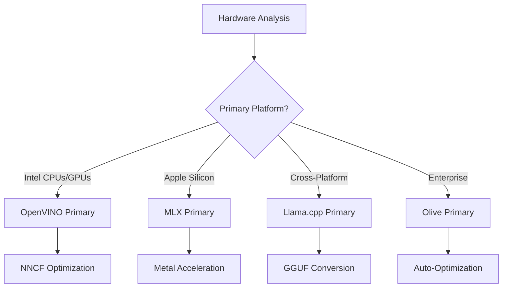
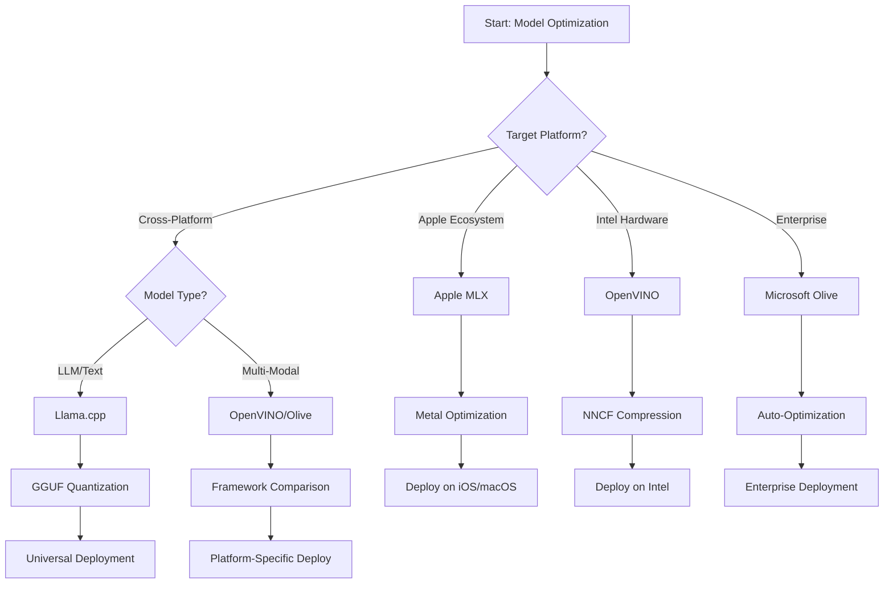
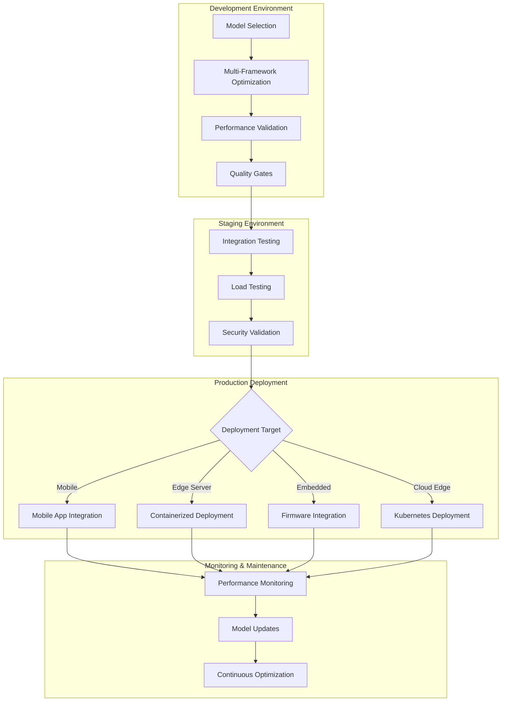

<!--
CO_OP_TRANSLATOR_METADATA:
{
  "original_hash": "6719c4a7e44b948230ac5f5cab3699bd",
  "translation_date": "2025-09-19T00:40:06+00:00",
  "source_file": "Module04/06.workflow-synthesis.md",
  "language_code": "lt"
}
-->
# 6 skyrius: Edge AI kūrimo darbo eigos sintezė

## Turinys
1. [Įvadas](../../../Module04)
2. [Mokymosi tikslai](../../../Module04)
3. [Vieningos darbo eigos apžvalga](../../../Module04)
4. [Karkaso pasirinkimo matrica](../../../Module04)
5. [Geriausių praktikų sintezė](../../../Module04)
6. [Diegimo strategijos vadovas](../../../Module04)
7. [Našumo optimizavimo darbo eiga](../../../Module04)
8. [Parengties gamybai kontrolinis sąrašas](../../../Module04)
9. [Trikčių šalinimas ir stebėjimas](../../../Module04)
10. [Edge AI sprendimų ateities užtikrinimas](../../../Module04)

## Įvadas

Edge AI kūrimas reikalauja išsamaus supratimo apie įvairius optimizavimo karkasus, diegimo strategijas ir techninės įrangos ypatybes. Ši išsami sintezė apjungia žinias iš Llama.cpp, Microsoft Olive, OpenVINO ir Apple MLX, kad sukurtų vieningą darbo eigą, kuri maksimaliai padidina efektyvumą, išlaiko kokybę ir užtikrina sėkmingą diegimą gamyboje.

Šio kurso metu nagrinėjome atskirus optimizavimo karkasus, kiekvieną su unikaliomis stiprybėmis ir specializuotais naudojimo atvejais. Tačiau realūs Edge AI projektai dažnai reikalauja derinti technikas iš kelių karkasų arba priimti strateginius sprendimus, kurie geriausiai atitiktų konkrečius apribojimus ir reikalavimus.

Šiame skyriuje pateikiama visų karkasų kolektyvinė išmintis, paversta įgyvendinamomis darbo eigomis, sprendimų medžiais ir geriausiomis praktikomis, kurios leidžia efektyviai ir veiksmingai kurti gamybai paruoštus Edge AI sprendimus. Nesvarbu, ar optimizuojate mobiliesiems įrenginiams, įterptinėms sistemoms ar edge serveriams, šis vadovas suteikia strateginį pagrindą informuotiems sprendimams priimti viso kūrimo ciklo metu.

## Mokymosi tikslai

Šio skyriaus pabaigoje galėsite:

### Strateginis sprendimų priėmimas
- **Įvertinti ir pasirinkti** optimalų optimizavimo karkasą pagal projekto reikalavimus, techninės įrangos apribojimus ir diegimo scenarijus
- **Sukurti išsamias darbo eigas**, kurios integruoja kelias optimizavimo technikas maksimaliam efektyvumui
- **Įvertinti kompromisus** tarp modelio tikslumo, įžvalgų greičio, atminties naudojimo ir diegimo sudėtingumo skirtinguose karkasuose

### Darbo eigos integracija
- **Įgyvendinti vieningas kūrimo pipelines**, kurios pasinaudoja kelių optimizavimo karkasų stiprybėmis
- **Sukurti atkuriamas darbo eigas**, užtikrinančias nuoseklų modelių optimizavimą ir diegimą skirtingose aplinkose
- **Nustatyti kokybės kontrolės vartus** ir validacijos procesus, kad optimizuoti modeliai atitiktų gamybos reikalavimus

### Našumo optimizavimas
- **Taikyti sistemingas optimizavimo strategijas**, naudojant kvantizaciją, genėjimą ir techninei įrangai specifines pagreičio technikas
- **Stebėti ir vertinti** modelio našumą skirtinguose optimizavimo lygiuose ir diegimo taškuose
- **Optimizuoti konkrečioms techninės įrangos platformoms**, įskaitant CPU, GPU, NPU ir specializuotus edge akceleratorius

### Diegimas gamyboje
- **Sukurti mastelio keičiamas diegimo architektūras**, kurios palaiko kelis modelių formatus ir įžvalgų variklius
- **Įgyvendinti stebėjimą ir stebėseną** Edge AI programoms gamybos aplinkoje
- **Nustatyti priežiūros darbo eigas** modelių atnaujinimui, našumo stebėjimui ir sistemos optimizavimui

### Kryžminės platformos kompetencija
- **Diegti optimizuotus modelius** įvairiose techninės įrangos platformose, išlaikant nuoseklų našumą
- **Tvarkyti platformai specifines optimizacijas** Windows, macOS, Linux, mobiliesiems ir įterptinėms sistemoms
- **Sukurti abstrakcijos sluoksnius**, leidžiančius sklandų diegimą skirtingose edge aplinkose

## Vieningos darbo eigos apžvalga

### 1 fazė: Reikalavimų analizė ir karkaso pasirinkimas

Sėkmingo Edge AI diegimo pagrindas yra išsami reikalavimų analizė, kuri informuoja karkaso pasirinkimą ir optimizavimo strategiją.

#### 1.1 Techninės įrangos vertinimas


**Pagrindiniai aspektai:**
- **CPU architektūra**: x86, ARM, Apple Silicon galimybės
- **Akceleratorių prieinamumas**: GPU, NPU, VPU, specializuoti AI lustai
- **Atminties apribojimai**: RAM ribos, saugojimo talpa
- **Energijos biudžetas**: Baterijos veikimo laikas, šiluminiai apribojimai
- **Ryšys**: Neprisijungimo reikalavimai, pralaidumo apribojimai

#### 1.2 Programos reikalavimų matrica

| Reikalavimas | Llama.cpp | Microsoft Olive | OpenVINO | Apple MLX |
|--------------|-----------|-----------------|----------|-----------|
| Kryžminė platforma | ✅ Puikiai | ⚡ Gerai | ⚡ Gerai | ❌ Tik Apple |
| Įmonės integracija | ⚡ Pagrindinė | ✅ Puikiai | ✅ Puikiai | ⚡ Ribota |
| Mobilusis diegimas | ✅ Puikiai | ⚡ Gerai | ⚡ Gerai | ✅ iOS Puikiai |
| Realaus laiko įžvalgos | ✅ Puikiai | ✅ Puikiai | ✅ Puikiai | ✅ Puikiai |
| Modelių įvairovė | ✅ LLM Fokusas | ✅ Visi modeliai | ✅ Visi modeliai | ✅ LLM Fokusas |
| Naudojimo paprastumas | ✅ Paprasta | ✅ Automatinė | ⚡ Vidutinė | ✅ Paprasta |

### 2 fazė: Modelio paruošimas ir optimizavimas

#### 2.1 Universalus modelio vertinimo pipeline

```python
# Universal Model Assessment Framework
class EdgeAIModelAssessment:
    def __init__(self, model_path, target_hardware):
        self.model_path = model_path
        self.target_hardware = target_hardware
        self.optimization_frameworks = []
        
    def assess_model_characteristics(self):
        """Analyze model size, architecture, and complexity"""
        return {
            'model_size': self.get_model_size(),
            'parameter_count': self.get_parameter_count(),
            'architecture_type': self.detect_architecture(),
            'quantization_compatibility': self.check_quantization_support()
        }
    
    def recommend_optimization_strategy(self):
        """Recommend optimal frameworks and techniques"""
        characteristics = self.assess_model_characteristics()
        
        if self.target_hardware.startswith('apple'):
            return self.mlx_optimization_strategy(characteristics)
        elif self.target_hardware.startswith('intel'):
            return self.openvino_optimization_strategy(characteristics)
        elif characteristics['model_size'] > 7_000_000_000:  # 7B+ parameters
            return self.enterprise_optimization_strategy(characteristics)
        else:
            return self.lightweight_optimization_strategy(characteristics)
```

#### 2.2 Kelių karkasų optimizavimo pipeline

**Sekvencinis optimizavimo metodas:**
1. **Pradinis konvertavimas**: Konvertuoti į tarpinį formatą (kai įmanoma, ONNX)
2. **Karkasui specifinė optimizacija**: Taikyti specializuotas technikas
3. **Kryžminė validacija**: Patikrinti našumą skirtingose tikslinėse platformose
4. **Galutinis pakavimas**: Paruošti diegimui

```bash
# Multi-Framework Optimization Script
#!/bin/bash

MODEL_NAME="phi-3-mini"
BASE_MODEL="microsoft/Phi-3-mini-4k-instruct"

# Phase 1: ONNX Conversion (Universal)
python convert_to_onnx.py --model $BASE_MODEL --output models/onnx/

# Phase 2: Platform-Specific Optimization
if [[ "$TARGET_PLATFORM" == "intel" ]]; then
    # OpenVINO Optimization
    python optimize_openvino.py --input models/onnx/ --output models/openvino/
elif [[ "$TARGET_PLATFORM" == "apple" ]]; then
    # MLX Optimization
    python optimize_mlx.py --input $BASE_MODEL --output models/mlx/
elif [[ "$TARGET_PLATFORM" == "cross" ]]; then
    # Llama.cpp Optimization
    python convert_to_gguf.py --input models/onnx/ --output models/gguf/
fi

# Phase 3: Validation
python validate_optimization.py --original $BASE_MODEL --optimized models/$TARGET_PLATFORM/
```

### 3 fazė: Našumo validacija ir vertinimas

#### 3.1 Išsamus vertinimo karkasas

```python
class EdgeAIBenchmark:
    def __init__(self, optimized_models):
        self.models = optimized_models
        self.metrics = {
            'inference_time': [],
            'memory_usage': [],
            'accuracy_score': [],
            'throughput': [],
            'energy_consumption': []
        }
    
    def run_comprehensive_benchmark(self):
        """Execute standardized benchmarks across all optimized models"""
        test_inputs = self.generate_test_inputs()
        
        for model_framework, model_path in self.models.items():
            print(f"Benchmarking {model_framework}...")
            
            # Latency Testing
            latency = self.measure_inference_latency(model_path, test_inputs)
            
            # Memory Profiling
            memory = self.profile_memory_usage(model_path)
            
            # Accuracy Validation
            accuracy = self.validate_model_accuracy(model_path, test_inputs)
            
            # Throughput Analysis
            throughput = self.measure_throughput(model_path)
            
            self.record_metrics(model_framework, latency, memory, accuracy, throughput)
    
    def generate_optimization_report(self):
        """Create comprehensive comparison report"""
        report = {
            'recommendations': self.analyze_performance_trade_offs(),
            'deployment_guidance': self.generate_deployment_recommendations(),
            'monitoring_requirements': self.define_monitoring_metrics()
        }
        return report
```

## Karkaso pasirinkimo matrica

### Sprendimų medis karkaso pasirinkimui



### Išsamūs pasirinkimo kriterijai

#### 1. Pagrindinis naudojimo atvejis

**Dideli kalbos modeliai (LLMs):**
- **Llama.cpp**: Geriausia CPU orientuotam, kryžminės platformos diegimui
- **Apple MLX**: Optimalu Apple Silicon su vieninga atmintimi
- **OpenVINO**: Puikiai tinka Intel techninei įrangai su NNCF optimizacija
- **Microsoft Olive**: Idealus įmonės darbo eigoms su automatizacija

**Daugiarūšiai modeliai:**
- **OpenVINO**: Išsamus palaikymas vizijai, garsui ir tekstui
- **Microsoft Olive**: Įmonės lygio optimizacija sudėtingiems pipelines
- **Llama.cpp**: Ribotas tekstiniams modeliams
- **Apple MLX**: Augantis palaikymas daugiarūšėms programoms

#### 2. Techninės įrangos platformos matrica

| Platforma | Pagrindinis karkasas | Antrinis pasirinkimas | Specializuotos funkcijos |
|-----------|----------------------|-----------------------|--------------------------|
| Intel CPU/GPU | OpenVINO | Microsoft Olive | NNCF suspaudimas, Intel optimizacija |
| NVIDIA GPU | Microsoft Olive | OpenVINO | CUDA pagreitis, įmonės funkcijos |
| Apple Silicon | Apple MLX | Llama.cpp | Metal shaders, vieninga atmintis |
| ARM mobilusis | Llama.cpp | OpenVINO | Kryžminė platforma, minimalūs priklausomybės |
| Edge TPU | OpenVINO | Microsoft Olive | Specializuotas akceleratoriaus palaikymas |
| Įterptinis ARM | Llama.cpp | OpenVINO | Minimalus pėdsakas, efektyvios įžvalgos |

#### 3. Kūrimo darbo eigos prioritetai

**Greitas prototipavimas:**
1. **Llama.cpp**: Greičiausias nustatymas, momentiniai rezultatai
2. **Apple MLX**: Paprastas Python API, greita iteracija
3. **Microsoft Olive**: Automatinė optimizacija, minimalus konfigūravimas
4. **OpenVINO**: Sudėtingesnis nustatymas, išsamios funkcijos

**Įmonės gamyba:**
1. **Microsoft Olive**: Įmonės funkcijos, Azure integracija
2. **OpenVINO**: Intel ekosistema, išsamūs įrankiai
3. **Apple MLX**: Apple specifinės įmonės programos
4. **Llama.cpp**: Paprastas diegimas, ribotos įmonės funkcijos

## Geriausių praktikų sintezė

### Universalūs optimizavimo principai

#### 1. Progresyvi optimizavimo strategija

```python
class ProgressiveOptimization:
    def __init__(self, base_model):
        self.base_model = base_model
        self.optimization_stages = [
            'baseline_measurement',
            'format_conversion',
            'quantization_optimization',
            'hardware_acceleration',
            'production_validation'
        ]
    
    def execute_progressive_optimization(self):
        """Apply optimization techniques incrementally"""
        
        # Stage 1: Baseline Measurement
        baseline_metrics = self.measure_baseline_performance()
        
        # Stage 2: Format Conversion
        converted_model = self.convert_to_optimal_format()
        conversion_metrics = self.measure_performance(converted_model)
        
        # Stage 3: Quantization
        quantized_model = self.apply_quantization(converted_model)
        quantization_metrics = self.measure_performance(quantized_model)
        
        # Stage 4: Hardware Acceleration
        accelerated_model = self.enable_hardware_acceleration(quantized_model)
        acceleration_metrics = self.measure_performance(accelerated_model)
        
        # Stage 5: Validation
        production_ready = self.validate_for_production(accelerated_model)
        
        return self.compile_optimization_report(
            baseline_metrics, conversion_metrics, 
            quantization_metrics, acceleration_metrics
        )
```

#### 2. Kokybės vartų įgyvendinimas

**Tikslumo išsaugojimo vartai:**
- Išlaikyti >95% pradinio modelio tikslumo
- Validuoti su reprezentatyviais testų duomenų rinkiniais
- Įgyvendinti A/B testavimą gamybos validacijai

**Našumo gerinimo vartai:**
- Pasiekti mažiausiai 2x greičio pagerėjimą
- Sumažinti atminties naudojimą bent 50%
- Validuoti įžvalgų laiko nuoseklumą

**Parengties gamybai vartai:**
- Išlaikyti stabilų našumą esant apkrovai
- Demonstravimas stabilaus veikimo laikui bėgant
- Validuoti saugumo ir privatumo reikalavimus

### Karkasui specifinių geriausių praktikų integracija

#### 1. Kvantizacijos strategijos sintezė

```python
# Unified Quantization Approach
class UnifiedQuantizationStrategy:
    def __init__(self, model, target_platform):
        self.model = model
        self.platform = target_platform
        
    def select_optimal_quantization(self):
        """Choose best quantization based on platform and requirements"""
        
        if self.platform == 'apple_silicon':
            return self.mlx_quantization_strategy()
        elif self.platform == 'intel_hardware':
            return self.openvino_quantization_strategy()
        elif self.platform == 'cross_platform':
            return self.llamacpp_quantization_strategy()
        else:
            return self.olive_quantization_strategy()
    
    def mlx_quantization_strategy(self):
        """Apple MLX-specific quantization"""
        return {
            'method': 'mlx_quantize',
            'precision': 'int4',
            'group_size': 64,
            'optimization_target': 'unified_memory'
        }
    
    def openvino_quantization_strategy(self):
        """OpenVINO NNCF quantization"""
        return {
            'method': 'nncf_quantize',
            'precision': 'int8',
            'calibration_method': 'post_training',
            'optimization_target': 'intel_hardware'
        }
```

#### 2. Techninės įrangos pagreičio optimizavimas

**CPU optimizavimo sintezė:**
- **SIMD instrukcijos**: Naudoti optimizuotus branduolius skirtinguose karkasuose
- **Atminties pralaidumas**: Optimizuoti duomenų išdėstymą efektyviam talpyklos naudojimui
- **Gijos**: Subalansuoti paralelizmą su resursų apribojimais

**GPU pagreičio geriausios praktikos:**
- **Partijų apdorojimas**: Maksimaliai padidinti pralaidumą su tinkamais partijos dydžiais
- **Atminties valdymas**: Optimizuoti GPU atminties paskirstymą ir perdavimus
- **Tikslumas**: Naudoti FP16, kai palaikoma, geresniam našumui

**NPU/specializuoto akceleratoriaus optimizavimas:**
- **Modelio architektūra**: Užtikrinti suderinamumą su akceleratoriaus galimybėmis
- **Duomenų srautas**: Optimizuoti įvesties/išvesties pipelines efektyvumui
- **Atsarginės strategijos**: Įgyvendinti CPU atsarginį sprendimą nepalaikomoms operacijoms

## Diegimo strategijos vadovas

### Universali diegimo architektūra



### Platformai specifiniai diegimo modeliai

#### 1. Mobiliojo diegimo strategija

```yaml
# Mobile Deployment Configuration
mobile_deployment:
  ios:
    framework: apple_mlx
    optimization:
      quantization: int4
      memory_mapping: true
      background_execution: limited
    packaging:
      format: mlx
      bundle_size: <50MB
      
  android:
    framework: llama_cpp
    optimization:
      quantization: q4_k_m
      threading: android_optimized
      memory_management: conservative
    packaging:
      format: gguf
      apk_size: <100MB
      
  cross_platform:
    framework: onnx_runtime
    optimization:
      quantization: int8
      execution_provider: cpu
    packaging:
      format: onnx
      shared_libraries: minimal
```

#### 2. Edge serverio diegimas

```yaml
# Edge Server Deployment Configuration
edge_server:
  intel_based:
    framework: openvino
    optimization:
      quantization: int8
      acceleration: cpu_gpu_auto
      batch_processing: dynamic
    deployment:
      container: openvino_runtime
      orchestration: kubernetes
      scaling: horizontal
      
  nvidia_based:
    framework: microsoft_olive
    optimization:
      quantization: int4
      acceleration: cuda
      tensor_parallelism: true
    deployment:
      container: nvidia_triton
      orchestration: kubernetes
      scaling: gpu_aware
```

### Konteinerizacijos geriausios praktikos

```dockerfile
# Multi-Framework Edge AI Container
FROM ubuntu:22.04 as base

# Install common dependencies
RUN apt-get update && apt-get install -y \
    python3 \
    python3-pip \
    build-essential \
    cmake \
    && rm -rf /var/lib/apt/lists/*

# Framework-specific stages
FROM base as openvino
RUN pip install openvino nncf optimum[intel]

FROM base as llamacpp
RUN git clone https://github.com/ggerganov/llama.cpp.git \
    && cd llama.cpp && make LLAMA_OPENBLAS=1

FROM base as olive
RUN pip install olive-ai[auto-opt] onnxruntime-genai

# Production stage with selected framework
FROM openvino as production
COPY models/ /app/models/
COPY src/ /app/src/
WORKDIR /app

EXPOSE 8080
CMD ["python3", "src/inference_server.py"]
```

## Našumo optimizavimo darbo eiga

### Sistemingas našumo derinimas

#### 1. Našumo profiliavimo pipeline

```python
class EdgeAIPerformanceProfiler:
    def __init__(self, model_path, framework):
        self.model_path = model_path
        self.framework = framework
        self.profiling_results = {}
    
    def comprehensive_profiling(self):
        """Execute comprehensive performance analysis"""
        
        # CPU Profiling
        cpu_profile = self.profile_cpu_usage()
        
        # Memory Profiling
        memory_profile = self.profile_memory_usage()
        
        # Inference Latency
        latency_profile = self.profile_inference_latency()
        
        # Throughput Analysis
        throughput_profile = self.profile_throughput()
        
        # Energy Consumption (where available)
        energy_profile = self.profile_energy_consumption()
        
        return self.compile_performance_report(
            cpu_profile, memory_profile, latency_profile,
            throughput_profile, energy_profile
        )
    
    def identify_bottlenecks(self):
        """Automatically identify performance bottlenecks"""
        bottlenecks = []
        
        if self.profiling_results['cpu_utilization'] > 80:
            bottlenecks.append('cpu_bound')
        
        if self.profiling_results['memory_usage'] > 90:
            bottlenecks.append('memory_bound')
        
        if self.profiling_results['inference_variance'] > 20:
            bottlenecks.append('inconsistent_performance')
        
        return self.generate_optimization_recommendations(bottlenecks)
```

#### 2. Automatinės optimizacijos pipeline

```python
class AutomatedOptimizationPipeline:
    def __init__(self, base_model, target_constraints):
        self.base_model = base_model
        self.constraints = target_constraints
        self.optimization_history = []
    
    def execute_optimization_search(self):
        """Systematically search optimization space"""
        
        optimization_candidates = [
            {'quantization': 'int8', 'pruning': 0.1},
            {'quantization': 'int4', 'pruning': 0.2},
            {'quantization': 'int8', 'acceleration': 'gpu'},
            {'quantization': 'int4', 'acceleration': 'npu'}
        ]
        
        best_configuration = None
        best_score = 0
        
        for config in optimization_candidates:
            optimized_model = self.apply_optimization(config)
            score = self.evaluate_optimization(optimized_model)
            
            if score > best_score and self.meets_constraints(optimized_model):
                best_score = score
                best_configuration = config
            
            self.optimization_history.append({
                'config': config,
                'score': score,
                'model': optimized_model
            })
        
        return best_configuration, self.optimization_history
```

### Daugiatikslė optimizacija

#### 1. Pareto optimizacija Edge AI

```python
class ParetoOptimization:
    def __init__(self, objectives=['speed', 'accuracy', 'memory']):
        self.objectives = objectives
        self.pareto_frontier = []
    
    def find_pareto_optimal_solutions(self, optimization_results):
        """Identify Pareto-optimal configurations"""
        
        for result in optimization_results:
            is_dominated = False
            
            for frontier_point in self.pareto_frontier:
                if self.dominates(frontier_point, result):
                    is_dominated = True
                    break
            
            if not is_dominated:
                # Remove dominated points from frontier
                self.pareto_frontier = [
                    point for point in self.pareto_frontier 
                    if not self.dominates(result, point)
                ]
                
                self.pareto_frontier.append(result)
        
        return self.pareto_frontier
    
    def recommend_configuration(self, user_preferences):
        """Recommend configuration based on user preferences"""
        
        weighted_scores = []
        for config in self.pareto_frontier:
            score = sum(
                user_preferences[obj] * config['metrics'][obj] 
                for obj in self.objectives
            )
            weighted_scores.append((score, config))
        
        return max(weighted_scores, key=lambda x: x[0])[1]
```

## Parengties gamybai kontrolinis sąrašas

### Išsami gamybos validacija

#### 1. Modelio kokybės užtikrinimas

```python
class ProductionReadinessValidator:
    def __init__(self, optimized_model, production_requirements):
        self.model = optimized_model
        self.requirements = production_requirements
        self.validation_results = {}
    
    def validate_model_quality(self):
        """Comprehensive model quality validation"""
        
        # Accuracy Validation
        accuracy_result = self.validate_accuracy()
        
        # Performance Validation
        performance_result = self.validate_performance()
        
        # Robustness Testing
        robustness_result = self.validate_robustness()
        
        # Security Assessment
        security_result = self.validate_security()
        
        # Compliance Verification
        compliance_result = self.validate_compliance()
        
        return self.compile_validation_report(
            accuracy_result, performance_result, robustness_result,
            security_result, compliance_result
        )
    
    def generate_certification_report(self):
        """Generate production certification report"""
        return {
            'model_signature': self.generate_model_signature(),
            'validation_timestamp': datetime.now(),
            'validation_results': self.validation_results,
            'deployment_approval': self.check_deployment_approval(),
            'monitoring_requirements': self.define_monitoring_requirements()
        }
```

#### 2. Gamybos diegimo kontrolinis sąrašas

**Prieš diegimą validacija:**
- [ ] Modelio tikslumas atitinka minimalius reikalavimus (>95% pradinio)
- [ ] Pasiekti našumo tikslai (vėlavimas, pralaidumas, atmintis)
- [ ] Įvertintos ir pašalintos saugumo spragos
- [ ] Baigtas apkrovos testavimas pagal numatomą apkrovą
- [ ] Išbandyti gedimų scenarijai ir patvirtintos atkūrimo procedūros
- [ ] Suaktyvintos stebėjimo ir įspėjimo sistemos
- [ ] Išbandytos ir dokumentuotos atsarginės procedūros

**Diegimo procesas:**
- [ ] Įgyvendinta mėlynos-žalios diegimo strategija
- [ ] Suaktyvintas laipsniškas srauto didinimas
- [ ] Aktyvios realaus laiko stebėjimo ataskaitų lentos
- [ ] Nustatyti našumo baziniai rodikliai
- [ ] Apibrėžtos klaidų rodiklių ribos
- [ ] Suaktyvinti automatiniai atsarginiai sprendimai

**Po diegimo stebėjimas:**
- [ ] Aktyvus modelio dreifo aptikimas
- [ ] Suaktyvinti našumo degradacijos įspėjimai
- [ ] Įjungtas resursų naudojimo stebėjimas
- [ ] Stebimi vartotojo patirties rodikliai
- [ ] Palaikomas modelio versijavimas ir kilmė
- [ ] Reguliariai planuojamos modelio našumo peržiūros

### Nuolatinė integracija/nuolatinis diegimas (CI/CD)

```yaml
# Edge AI CI/CD Pipeline Configuration
edge_ai_pipeline:
  stages:
    - model_validation
    - optimization
    - testing
    - staging_deployment
    - production_deployment
    - monitoring
  
  model_validation:
    accuracy_threshold: 0.95
    performance_baseline: required
    security_scan: enabled
    
  optimization:
    frameworks:
      - llama_cpp
      - openvino
      - microsoft_olive
    validation:
      cross_validation: enabled
      performance_comparison: required
      
  testing:
    unit_tests: comprehensive
    integration_tests: full_pipeline
    load_tests: production_scale
    security_tests: comprehensive
    
  deployment:
    strategy: blue_green
    traffic_ramping: gradual
    rollback: automatic
    monitoring: real_time
```

## Trikčių šalinimas ir stebėjimas

### Universali trikčių šalinimo sistema

#### 1. Dažnos problemos ir sprendimai

**Našumo problemos:**
```python
class PerformanceTroubleshooter:
    def __init__(self, model_metrics):
        self.metrics = model_metrics
        
    def diagnose_performance_issues(self):
        """Systematic performance issue diagnosis"""
        
        issues = []
        
        # High latency diagnosis
        if self.metrics['avg_latency'] > self.metrics['target_latency']:
            issues.append(self.diagnose_latency_issues())
        
        # Memory usage diagnosis
        if self.metrics['memory_usage'] > self.metrics['memory_limit']:
            issues.append(self.diagnose_memory_issues())
        
        # Throughput diagnosis
        if self.metrics['throughput'] < self.metrics['target_throughput']:
            issues.append(self.diagnose_throughput_issues())
        
        return self.generate_resolution_plan(issues)
    
    def diagnose_latency_issues(self):
        """Specific latency troubleshooting"""
        potential_causes = []
        
        if self.metrics['cpu_utilization'] > 80:
            potential_causes.append('cpu_bottleneck')
        
        if self.metrics['memory_bandwidth'] > 90:
            potential_causes.append('memory_bandwidth_limit')
        
        if self.metrics['model_size'] > self.metrics['optimal_size']:
            potential_causes.append('model_too_large')
        
        return {
            'issue': 'high_latency',
            'causes': potential_causes,
            'solutions': self.generate_latency_solutions(potential_causes)
        }
```

**Karkasui specifinis trikčių šalinimas:**

| Problema | Llama.cpp | Microsoft Olive | OpenVINO | Apple MLX |
|----------|-----------|-----------------|----------|-----------|
| Atminties problemos | Sumažinti konteksto ilgį | Mažinti partijos dydį | Įjungti talpyklą | Naudoti atminties žemėlapį |
| Lėta įžvalga | Įjungti SIMD | Patikrinti kvantizaciją | Optimizuoti gijas | Įjungti Metal |
| Tikslumo praradimas | Aukštesnė kvantizacija | Pertreniruoti su QAT | Padidinti kalibravimą | Patobulinti po kvantizacijos |
| Suderinamumas | Patikrinti modelio formatą | Patikrinti karkaso versiją | Atnaujinti tvarkykles | Patikrinti macOS versiją |

#### 2. Gamybos stebėjimo strategija

```python
class EdgeAIMonitoring:
    def __init__(self, deployment_config):
        self.config = deployment_config
        self.metrics_collectors = []
        self.alerting_rules = []
    
    def setup_comprehensive_monitoring(self):
        """Configure comprehensive monitoring for Edge AI deployment"""
        
        # Model Performance Monitoring
        self.setup_model_performance_monitoring()
        
        # Infrastructure Monitoring
        self.setup_infrastructure_monitoring()
        
        # Business Metrics Monitoring
        self.setup_business_metrics_monitoring()
        
        # Security Monitoring
        self.setup_security_monitoring()
    
    def setup_model_performance_monitoring(self):
        """Model-specific performance monitoring"""
        metrics = [
            'inference_latency_p50',
            'inference_latency_p95',
            'inference_latency_p99',
            'model_accuracy_drift',
            'prediction_confidence_distribution',
            'error_rate',
            'throughput_requests_per_second'
        ]
        
        for metric in metrics:
            self.add_metric_collector(metric)
            self.add_alerting_rule(metric)
    
    def detect_model_drift(self):
        """Automated model drift detection"""
        drift_indicators = [
            self.statistical_drift_detection(),
            self.performance_drift_detection(),
            self.data_distribution_shift_detection()
        ]
        
        return self.aggregate_drift_signals(drift_indicators)
```

### Automatinis problemų sprendimas

```python
class AutomatedIssueResolution:
    def __init__(self, monitoring_system):
        self.monitoring = monitoring_system
        self.resolution_strategies = {}
    
    def handle_performance_degradation(self, alert):
        """Automated performance issue resolution"""
        
        if alert['type'] == 'high_latency':
            return self.resolve_latency_issue(alert)
        elif alert['type'] == 'high_memory_usage':
            return self.resolve_memory_issue(alert)
        elif alert['type'] == 'accuracy_drift':
            return self.resolve_accuracy_issue(alert)
        
    def resolve_latency_issue(self, alert):
        """Automated latency issue resolution"""
        resolution_steps = [
            'increase_cpu_allocation',
            'enable_model_caching',
            'reduce_batch_size',
            'switch_to_quantized_model'
        ]
        
        for step in resolution_steps:
            if self.apply_resolution_step(step):
                return f"Resolved latency issue with: {step}"
        
        return "Escalating to human operator"
```

## Edge AI sprendimų ateities užtikrinimas

### Naujos technologijos integracija

#### 1. Kitos kartos techninės įrangos palaik
Atminkite, kad geriausia optimizavimo strategija yra ta, kuri atitinka jūsų konkrečius reikalavimus, tuo pačiu išlaikant lankstumą prisitaikyti, kai tie reikalavimai keičiasi. Naudokite šį vadovą kaip pagrindą informuotiems sprendimams priimti, tačiau visada patvirtinkite savo pasirinkimus empiriniais testais ir realaus pasaulio diegimo patirtimi.

## ➡️ Kas toliau

Tęskite savo Edge AI kelionę, tyrinėdami [5 modulį: SLMOps ir diegimas gamyboje](../Module05/README.md), kad sužinotumėte apie mažų kalbos modelių gyvavimo ciklo valdymo operacinius aspektus.

---

**Atsakomybės apribojimas**:  
Šis dokumentas buvo išverstas naudojant AI vertimo paslaugą [Co-op Translator](https://github.com/Azure/co-op-translator). Nors siekiame tikslumo, prašome atkreipti dėmesį, kad automatiniai vertimai gali turėti klaidų ar netikslumų. Originalus dokumentas jo gimtąja kalba turėtų būti laikomas autoritetingu šaltiniu. Kritinei informacijai rekomenduojama profesionali žmogaus vertimo paslauga. Mes neprisiimame atsakomybės už nesusipratimus ar klaidingus interpretavimus, atsiradusius naudojant šį vertimą.