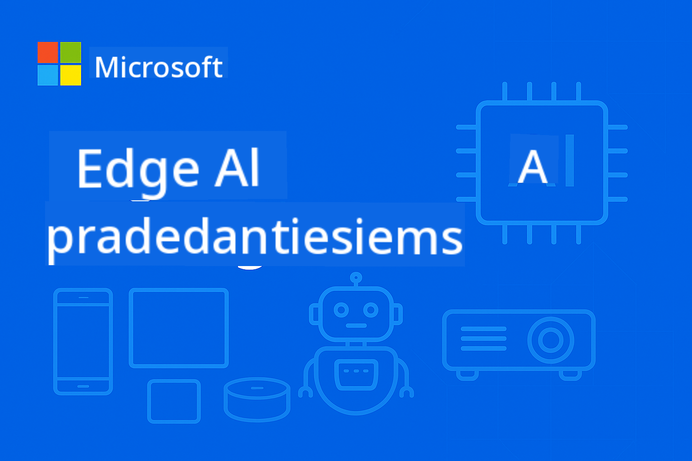

<!--
CO_OP_TRANSLATOR_METADATA:
{
  "original_hash": "9a189d7d9d47816a518ca119d79dc19b",
  "translation_date": "2025-09-23T00:36:22+00:00",
  "source_file": "README.md",
  "language_code": "lt"
}
-->
# EdgeAI pradedantiesiems



[](https://GitHub.com/microsoft/edgeai-for-beginners/graphs/contributors)
[](https://GitHub.com/microsoft/edgeai-for-beginners/issues)
[](https://GitHub.com/microsoft/edgeai-for-beginners/pulls)
[](http://makeapullrequest.com)

[](https://GitHub.com/microsoft/edgeai-for-beginners/watchers)
[](https://GitHub.com/microsoft/edgeai-for-beginners/fork)
[](https://GitHub.com/microsoft/edgeai-for-beginners/stargazers)

[](https://discord.com/invite/ByRwuEEgH4)

Sekite šiuos žingsnius, kad pradėtumėte naudotis šiais ištekliais:

1. **Fork Repository**: Spustelėkite [](https://GitHub.com/microsoft/edgeai-for-beginners/fork)
2. **Klonuokite Repository**: `git clone https://github.com/microsoft/edgeai-for-beginners.git`
3. [**Prisijunkite prie Azure AI Foundry Discord ir susipažinkite su ekspertais bei kitais kūrėjais**](https://discord.com/invite/ByRwuEEgH4)

### 🌐 Daugiakalbė palaikymas

#### Palaikoma per GitHub Action (Automatizuota ir visada atnaujinta)

[Arabų](../ar/README.md) | [Bengalų](../bn/README.md) | [Bulgarų](../bg/README.md) | [Birmos (Mianmaras)](../my/README.md) | [Kinų (supaprastinta)](../zh/README.md) | [Kinų (tradicinė, Honkongas)](../hk/README.md) | [Kinų (tradicinė, Makao)](../mo/README.md) | [Kinų (tradicinė, Taivanas)](../tw/README.md) | [Kroatų](../hr/README.md) | [Čekų](../cs/README.md) | [Danų](../da/README.md) | [Olandų](../nl/README.md) | [Suomių](../fi/README.md) | [Prancūzų](../fr/README.md) | [Vokiečių](../de/README.md) | [Graikų](../el/README.md) | [Hebrajų](../he/README.md) | [Hindi](../hi/README.md) | [Vengrų](../hu/README.md) | [Indoneziečių](../id/README.md) | [Italų](../it/README.md) | [Japonų](../ja/README.md) | [Korėjiečių](../ko/README.md) | [Malajų](../ms/README.md) | [Maratų](../mr/README.md) | [Nepalų](../ne/README.md) | [Norvegų](../no/README.md) | [Persų (Farsi)](../fa/README.md) | [Lenkų](../pl/README.md) | [Portugalų (Brazilija)](../br/README.md) | [Portugalų (Portugalija)](../pt/README.md) | [Pundžabi (Gurmukhi)](../pa/README.md) | [Rumunų](../ro/README.md) | [Rusų](../ru/README.md) | [Serbų (kirilica)](../sr/README.md) | [Slovakų](../sk/README.md) | [Slovėnų](../sl/README.md) | [Ispanų](../es/README.md) | [Svahilių](../sw/README.md) | [Švedų](../sv/README.md) | [Tagalogų (Filipinų)](../tl/README.md) | [Tajų](../th/README.md) | [Turkų](../tr/README.md) | [Ukrainiečių](../uk/README.md) | [Urdu](../ur/README.md) | [Vietnamiečių](../vi/README.md)

**Jei norite, kad būtų palaikomos papildomos kalbos, sąrašą rasite [čia](https://github.com/Azure/co-op-translator/blob/main/getting_started/supported-languages.md)**

## Įvadas

Sveiki atvykę į **EdgeAI pradedantiesiems** – išsamų kursą apie Edge dirbtinio intelekto pasaulį. Šis kursas sujungia galingas AI galimybes su praktiniu pritaikymu kraštiniuose įrenginiuose, suteikdamas galimybę naudoti AI tiesiogiai ten, kur generuojami duomenys ir priimami sprendimai.

### Ko išmoksite

Šis kursas apima viską nuo pagrindinių sąvokų iki paruoštų gamybai sprendimų:
- **Maži kalbos modeliai (SLM)**, optimizuoti kraštiniam naudojimui
- **Aparatūros optimizacija** įvairiose platformose
- **Realaus laiko prognozavimas** su privatumo išsaugojimu
- **Gamybos diegimo strategijos** verslo aplikacijoms

### Kodėl EdgeAI yra svarbus

Edge AI keičia žaidimo taisykles, sprendžiant šiuolaikinius iššūkius:
- **Privatumas ir saugumas**: Apdorokite jautrius duomenis vietoje, be debesų
- **Realaus laiko našumas**: Pašalinkite tinklo vėlavimą kritinėms aplikacijoms
- **Ekonominis efektyvumas**: Sumažinkite tinklo ir debesų kompiuterijos išlaidas
- **Atsparumas**: Užtikrinkite funkcionalumą tinklo gedimų metu
- **Reguliacinis atitikimas**: Atitikite duomenų suvereniteto reikalavimus

### Edge AI

Edge AI reiškia AI algoritmų ir kalbos modelių vykdymą vietoje, kraštiniuose įrenginiuose – arti duomenų generavimo vietos – be debesų resursų naudojimo prognozavimui. Tai sumažina vėlavimą, pagerina privatumą ir leidžia priimti sprendimus realiu laiku.

### Pagrindiniai principai:
- **Prognozavimas įrenginyje**: AI modeliai veikia kraštiniuose įrenginiuose (telefonuose, maršrutizatoriuose, mikrovaldikliuose, pramoniniuose kompiuteriuose)
- **Neprisijungimo galimybė**: Funkcionuoja be nuolatinio interneto ryšio
- **Mažas vėlavimas**: Greiti atsakymai, tinkami realaus laiko sistemoms
- **Duomenų suverenitetas**: Jautrūs duomenys lieka vietoje, gerinant saugumą ir atitiktį

### Maži kalbos modeliai (SLM)

SLM, tokie kaip Phi-4, Mistral-7B ir Gemma, yra optimizuotos didesnių LLM versijos – treniruotos arba distiliuotos:
- **Mažesnė atminties apkrova**: Efektyvus ribotos kraštinių įrenginių atminties naudojimas
- **Mažesnis skaičiavimo poreikis**: Optimizuota CPU ir kraštinių GPU našumui
- **Greitesnis paleidimas**: Greitas inicializavimas, skirtas jautrioms aplikacijoms

Jie suteikia galingas NLP galimybes, atitinkančias:
- **Įterptinės sistemos**: IoT įrenginiai ir pramoniniai valdikliai
- **Mobilūs įrenginiai**: Išmanieji telefonai ir planšetiniai kompiuteriai su neprisijungimo galimybėmis
- **IoT įrenginiai**: Jutikliai ir išmanieji įrenginiai su ribotais resursais
- **Kraštiniai serveriai**: Vietiniai apdorojimo įrenginiai su ribotais GPU resursais
- **Asmeniniai kompiuteriai**: Darbalaukio ir nešiojamojo kompiuterio diegimo scenarijai

## Kurso struktūra

### [1 modulis: EdgeAI pagrindai ir transformacija](./Module01/README.md)
**Tema**: Kraštinio AI diegimo transformacinis pokytis

#### Skyrių struktūra:
- [**1 skyrius: EdgeAI pagrindai**](./Module01/01.EdgeAIFundamentals.md)
  - Tradicinio debesų AI ir kraštinio AI palyginimas
  - Kraštinio kompiuterio iššūkiai ir apribojimai
  - Pagrindinės technologijos: modelio kvantavimas, suspaudimo optimizacija, maži kalbos modeliai (SLM)
  - Aparatūros pagreitinimas: NPU, GPU optimizacija, CPU optimizacija
  - Privalumai: privatumas, saugumas, mažas vėlavimas, neprisijungimo galimybės, ekonominis efektyvumas

- [**2 skyrius: Realaus pasaulio atvejų analizės**](./Module01/02.RealWorldCaseStudies.md)
  - Microsoft Phi ir Mu modelių ekosistema
  - Japan Airlines AI ataskaitų sistema
  - Rinkos poveikis ir ateities kryptys
  - Diegimo svarstymai ir geriausios praktikos

- [**3 skyrius: Praktinis įgyvendinimo vadovas**](./Module01/03.PracticalImplementationGuide.md)
  - Kūrimo aplinkos nustatymas (Python 3.10+, .NET 8+)
  - Aparatūros reikalavimai ir rekomenduojamos konfigūracijos
  - Pagrindiniai modelių šeimos ištekliai
  - Kvantavimo ir optimizavimo įrankiai (Llama.cpp, Microsoft Olive, Apple MLX)
  - Vertinimo ir patikrinimo kontrolinis sąrašas

- [**4 skyrius: Kraštinio AI diegimo aparatūros platformos**](./Module01/04.EdgeDeployment.md)
  - Kraštinio AI diegimo svarstymai ir reikalavimai
  - Intel kraštinio AI aparatūra ir optimizavimo technikos
  - Qualcomm AI sprendimai mobiliesiems ir įterptinėms sistemoms
  - NVIDIA Jetson ir kraštinio kompiuterio platformos
  - Windows AI PC platformos su NPU pagreitinimu
  - Aparatūros specifinės optimizavimo strategijos

---

### [2 modulis: Mažų kalbos modelių pagrindai](./Module02/README.md)
**Tema**: SLM teoriniai principai, įgyvendinimo strategijos ir gamybos diegimas

#### Skyrių struktūra:
- [**1 skyrius: Microsoft Phi modelių šeimos pagrindai**](./Module02/01.PhiFamily.md)
  - Dizaino filosofijos evoliucija (Phi-1 iki Phi-4)
  - Efektyvumo pirmumo architektūros dizainas
  - Specializuotos galimybės (samprotavimas, multimodalumas, kraštinis diegimas)

- [**2 skyrius: Qwen šeimos pagrindai**](./Module02/02.QwenFamily.md)
  - Atvirojo kodo pranašumai (Qwen 1.0 iki Qwen3) – prieinami per Hugging Face
  - Pažangi samprotavimo architektūra su mąstymo režimo galimybėmis
  - Skalavimo diegimo galimybės (0.5B-235B parametrų)

- [**3 skyrius: Gemma šeimos pagrindai**](./Module02/03.GemmaFamily.md)
  - Tyrimų pagrindu inovacijos (Gemma 3 ir 3n)
  - Multimodalinis pranašumas
  - Mobilus pirmumo architektūra

- [**4 skyrius: BitNET šeimos pagrindai**](./Module02/04.BitNETFamily.md)
  - Revoliucinė kvantavimo technologija (1.58-bit)
  - Specializuota prognozavimo sistema iš https://github.com/microsoft/BitNet
  - Tvarus AI lyderystė per ekstremalų efektyvumą

- [**5 skyrius: Microsoft Mu modelio pagrindai**](./Module02/05.mumodel.md)
  - Įrenginio pirmumo architektūra, integruota į Windows 11
  - Sistemos integracija su Windows 11 nustatymais
  - Privatumo išsaugojimo neprisijungimo veikimas

- [**6 skyrius: Phi-Silica pagrindai**](./Module02/06.phisilica.md)
  - NPU optimizuota architektūra, integruota į Windows 11 Copilot+ PC
  - Išskirtinis efektyvumas (650 žetonų/sekundę prie 1.5W)
  - Kūrėjų integracija su Windows App SDK

---

### [3 modulis: Mažų kalbos modelių diegimas](./Module03/README.md)
**Tema**: Pilnas SLM gyvavimo ciklo diegimas nuo teorijos iki gamybos aplinkos

#### Skyrių struktūra:
- [**1 skyrius: SLM pažangus mokymasis**](./Module03/01.SLMAdvancedLearning.md)
  - Parametrų klasifikavimo sistema (Micro SLM 100M-1.4B, Medium SLM 14B-30B)
  - Pažangios optimizavimo technikos (kvantavimo metodai, BitNET 1-bit kvantavimas)
  - Modelių įsigijimo strategijos (Azure AI Foundry Phi modeliams, Hugging Face pasirinktiems modeliams)

- [**2 skyrius: Vietinės aplinkos diegimas**](./Module03/02.DeployingSLMinLocalEnv.md)
  - Ollama universalios platformos diegimas
  - Microsoft Foundry vietiniai verslo klasės sprendimai
  - Sistemų palyginimo analizė

- [**3 skyrius: Konteinerizuotas debesų diegimas**](./Module03/03.DeployingSLMinCloud.md)
  - vLLM aukštos našumo prognozavimo diegimas
  - Ollama konteinerių orkestracija
  - ONNX Runtime kraštinis optimizuotas įgyvendinimas

---

### [4 modulis: Modelio formato konversija ir kvantavimas](./Module04/README.md)
**Tema**: Pilnas modelio optimizavimo įrankių rinkinys kraštiniam diegimui įvairiose platformose

#### Skyrių struktūra:
- [**1 skyrius: Modelio formato konversijos ir kvantavimo pagrindai**](./Module04/01.Introduce.md)
  - Tikslumo klasifikavimo sistema (ultra žemas, žemas, vidutinis tikslumas)
  - GGUF ir ONNX formato privalumai ir naudojimo atvejai
  - Kvantavimo privalumai operacinio efektyvumo atžvilgiu
  - Našumo etalonai ir atminties apkrovos palyginimai
- [**2 skyrius: Llama.cpp įgyvendinimo vadovas**](./Module04/02.Llamacpp.md)
  - Įdiegimas įvairiose platformose (Windows, macOS, Linux)
  - GGUF formato konvertavimas ir kvantizacijos lygiai (Q2_K iki Q8_0)
  - Aparatinės įrangos spartinimas (CUDA, Metal, OpenCL, Vulkan)
  - Python integracija ir REST API diegimas

- [**3 skyrius: Microsoft Olive optimizavimo rinkinys**](./Module04/03.MicrosoftOlive.md)
  - Modelių optimizavimas, pritaikytas aparatinės įrangos galimybėms, su daugiau nei 40 integruotų komponentų
  - Automatinis optimizavimas naudojant dinaminę ir statinę kvantizaciją
  - Įmonių integracija su Azure ML darbo eigomis
  - Populiarių modelių palaikymas (Llama, Phi, pasirinkti Qwen modeliai, Gemma)

- [**4 skyrius: OpenVINO Toolkit optimizavimo rinkinys**](./Module04/04.openvino.md)
  - Intel atvirojo kodo įrankių rinkinys AI diegimui įvairiose platformose
  - Neural Network Compression Framework (NNCF) pažangiai optimizacijai
  - OpenVINO GenAI didelių kalbos modelių diegimui
  - Aparatinės įrangos spartinimas CPU, GPU, VPU ir AI akceleratoriuose

- [**5 skyrius: Apple MLX Framework išsamus tyrimas**](./Module04/05.AppleMLX.md)
  - Vieninga atminties architektūra Apple Silicon
  - LLaMA, Mistral, Phi, pasirinkti Qwen modeliai palaikymas
  - LoRA modelių pritaikymas ir personalizavimas
  - Hugging Face integracija su 4-bitų/8-bitų kvantizacija

- [**6 skyrius: Edge AI kūrimo darbo eigos sintezė**](./Module04/06.workflow-synthesis.md)
  - Vieninga darbo eigos architektūra, integruojanti kelis optimizavimo rėmus
  - Rėmų pasirinkimo sprendimų medžiai ir našumo kompromisų analizė
  - Paruošimo gamybai patikrinimas ir išsamios diegimo strategijos
  - Ateities strategijos naujai atsirandančiai aparatinės įrangai ir modelių architektūroms

---

### [5 modulis: SLMOps - Mažų kalbos modelių operacijos](./Module05/README.md)
**Tema**: Pilnas SLM gyvavimo ciklas nuo distiliacijos iki diegimo gamyboje

#### Skyrių struktūra:
- [**1 skyrius: Įvadas į SLMOps**](./Module05/01.IntroduceSLMOps.md)
  - SLMOps paradigmos pokytis AI operacijose
  - Efektyvumas kaštų atžvilgiu ir privatumo pirmumo architektūra
  - Strateginis verslo poveikis ir konkurenciniai pranašumai
  - Realūs įgyvendinimo iššūkiai ir sprendimai

- [**2 skyrius: Modelio distiliacija - nuo teorijos iki praktikos**](./Module05/02.SLMOps-Distillation.md)
  - Žinių perdavimas iš mokytojo į studento modelius
  - Dviejų etapų distiliacijos proceso įgyvendinimas
  - Azure ML distiliacijos darbo eigos su praktiniais pavyzdžiais
  - 85% sumažintas įžvalgos laikas su 92% tikslumo išlaikymu

- [**3 skyrius: Modelių pritaikymas specifinėms užduotims**](./Module05/03.SLMOps-Finetuing.md)
  - Efektyvūs parametrų pritaikymo (PEFT) metodai
  - Pažangūs LoRA ir QLoRA metodai
  - Microsoft Olive pritaikymo įgyvendinimas
  - Daugiaadapterinis mokymas ir hiperparametrų optimizavimas

- [**4 skyrius: Diegimas - paruošimas gamybai**](./Module05/04.SLMOps.Deployment.md)
  - Modelio konvertavimas ir kvantizacija gamybai
  - Foundry Local diegimo konfigūracija
  - Našumo palyginimas ir kokybės patikrinimas
  - 75% dydžio sumažinimas su gamybos stebėsena

---

### [6 modulis: SLM agentinės sistemos - AI agentai ir funkcijų iškvietimas](./Module06/README.md)
**Tema**: SLM agentinių sistemų įgyvendinimas nuo pagrindų iki pažangaus funkcijų iškvietimo ir Model Context Protocol integracijos

#### Skyrių struktūra:
- [**1 skyrius: AI agentai ir mažų kalbos modelių pagrindai**](./Module06/01.IntroduceAgent.md)
  - Agentų klasifikavimo sistema (refleksiniai, modeliu pagrįsti, tiksliniai, mokymosi agentai)
  - SLM pagrindai ir optimizavimo strategijos (GGUF, kvantizacija, edge rėmai)
  - SLM ir LLM kompromisų analizė (10-30× kaštų sumažinimas, 70-80% užduočių efektyvumas)
  - Praktinis diegimas su Ollama, VLLM ir Microsoft edge sprendimais

- [**2 skyrius: Funkcijų iškvietimas mažų kalbos modeliuose**](./Module06/02.FunctionCalling.md)
  - Sistemingo darbo eigos įgyvendinimas (ketinimų aptikimas, JSON išvestis, išorinis vykdymas)
  - Platformai specifiniai įgyvendinimai (Phi-4-mini, pasirinkti Qwen modeliai, Microsoft Foundry Local)
  - Pažangūs pavyzdžiai (daugiagentinis bendradarbiavimas, dinaminis įrankių pasirinkimas)
  - Gamybos aspektai (greičio ribojimas, audito žurnalai, saugumo priemonės)

- [**3 skyrius: Model Context Protocol (MCP) integracija**](./Module06/03.IntroduceMCP.md)
  - Protokolo architektūra ir sluoksniuota sistemos konstrukcija
  - Daugiafunkcinis palaikymas (Ollama kūrimui, vLLM gamybai)
  - Jungties protokolai (STDIO ir SSE režimai)
  - Realūs pritaikymai (interneto automatizavimas, duomenų apdorojimas, API integracija)

---

### [7 modulis: EdgeAI įgyvendinimo pavyzdžiai](./Module07/README.md)
**Tema**: Išsamūs EdgeAI įgyvendinimai įvairiose platformose ir rėmuose

#### Skyrių struktūra:
- [**AI įrankių rinkinys Visual Studio Code**](./Module07/aitoolkit.md)
  - Išsamus Edge AI kūrimo aplinka Visual Studio Code
  - Modelių katalogas ir atradimas edge diegimui
  - Vietinis testavimas, optimizavimas ir agentų kūrimo darbo eigos
  - Našumo stebėjimas ir vertinimas edge scenarijams

- [**Windows EdgeAI kūrimo vadovas**](./Module07/windowdeveloper.md)
  - Windows AI Foundry platformos išsamus apžvalga
  - Phi Silica API efektyviam NPU įžvalgai
  - Kompiuterinės vizijos API vaizdų apdorojimui ir OCR
  - Foundry Local CLI vietiniam kūrimui ir testavimui

- [**EdgeAI NVIDIA Jetson Orin Nano**](./Module07/README.md#1-edgeai-in-nvidia-jetson-orin-nano)
  - 67 TOPS AI našumas kreditinės kortelės dydžio formate
  - Generatyvūs AI modeliai palaikymas (vizijos transformatoriai, LLM, vizijos-kalbos modeliai)
  - Pritaikymai robotikoje, dronuose, išmaniose kamerose, autonominiuose įrenginiuose
  - Prieinama $249 platforma demokratizuotam AI kūrimui

- [**EdgeAI mobiliose aplikacijose su .NET MAUI ir ONNX Runtime GenAI**](./Module07/README.md#2-edgeai-in-mobile-applications-with-net-maui-and-onnx-runtime-genai)
  - Kryžminės platformos mobilus AI su vienu C# kodu
  - Aparatinės įrangos spartinimo palaikymas (CPU, GPU, mobilūs AI procesoriai)
  - Platformai specifinės optimizacijos (CoreML iOS, NNAPI Android)
  - Pilnas generatyvios AI ciklo įgyvendinimas

- [**EdgeAI Azure su mažų kalbos modelių varikliu**](./Module07/README.md#3-edgeai-in-azure-with-small-language-models-engine)
  - Hibridinė debesų-edge diegimo architektūra
  - Azure AI paslaugų integracija su ONNX Runtime
  - Įmonės masto diegimas ir nuolatinis modelių valdymas
  - Hibridinės AI darbo eigos intelektualiam dokumentų apdorojimui

- [**EdgeAI su Windows ML**](./Module07/README.md#4-edgeai-with-windows-ml)
  - Windows AI Foundry pagrindas efektyviam įrenginio įžvalgai
  - Universalus aparatinės įrangos palaikymas (AMD, Intel, NVIDIA, Qualcomm silicio)
  - Automatinė aparatinės įrangos abstrakcija ir optimizacija
  - Vieningas rėmas įvairiai Windows aparatinės įrangos ekosistemai

- [**EdgeAI su Foundry Local aplikacijomis**](./Module07/README.md#5-edgeai-with-foundry-local-applications)
  - Privatumo orientuotas RAG įgyvendinimas su vietiniais ištekliais
  - Phi-4 kalbos modelio integracija su semantine paieška (tik Phi modeliai)
  - Vietinių vektorių duomenų bazių palaikymas (SQLite, Qdrant)
  - Duomenų suverenumas ir neprisijungimo veikimo galimybės

### [8 modulis: Microsoft Foundry Local – pilnas kūrėjo įrankių rinkinys](./Module08/README.md)
**Tema**: Kurkite, paleiskite ir integruokite AI vietoje su Foundry Local; mastelio keitimas ir hibridizavimas su Azure AI Foundry

#### Skyrių struktūra:
- [**1: Pradžia su Foundry Local**](./Module08/01.FoundryLocalSetup.md)
- [**2: AI sprendimų kūrimas su Azure AI Foundry**](./Module08/02.AzureAIFoundryIntegration.md)
- [**3: Atvirojo kodo modeliai Foundry Local**](./Module08/03.OpenSourceModels.md)
- [**4: Pažangūs modeliai ir įrenginio įžvalga**](./Module08/04.CuttingEdgeModels.md)
- [**5: AI agentai su Foundry Local**](./Module08/05.AIPoweredAgents.md)
- [**6: Modeliai kaip įrankiai**](./Module08/06.ModelsAsTools.md)

## Kurso mokymosi tikslai

Baigę šį išsamų EdgeAI kursą, įgysite kompetenciją kurti, įgyvendinti ir diegti gamybai paruoštus EdgeAI sprendimus. Mūsų struktūruotas požiūris užtikrina, kad įvaldysite tiek teorinius pagrindus, tiek praktinius įgyvendinimo įgūdžius.

### Techninės kompetencijos

**Pagrindinės žinios**
- Suprasti esminius skirtumus tarp debesų ir edge AI architektūrų
- Įvaldyti modelių kvantizacijos, suspaudimo ir optimizavimo principus ribotų išteklių aplinkoje
- Suprasti aparatinės įrangos spartinimo galimybes (NPU, GPU, CPU) ir jų diegimo pasekmes

**Įgyvendinimo įgūdžiai**
- Diegti mažus kalbos modelius įvairiose edge platformose (mobilios, įterptinės, IoT, edge serveriai)
- Taikyti optimizavimo rėmus, įskaitant Llama.cpp, Microsoft Olive, ONNX Runtime ir Apple MLX
- Įgyvendinti realaus laiko įžvalgos sistemas su sub-sekundės atsako reikalavimais

**Gamybos ekspertizė**
- Kurti mastelio keičiamas EdgeAI architektūras įmonių aplikacijoms
- Įgyvendinti stebėjimo, priežiūros ir atnaujinimo strategijas diegtiems sistemoms
- Taikyti saugumo geriausią praktiką privatumo išsaugojimo EdgeAI įgyvendinimams

### Strateginės galimybės

**Sprendimų priėmimo sistema**
- Įvertinti EdgeAI galimybes ir identifikuoti tinkamus verslo pritaikymo atvejus
- Įvertinti kompromisus tarp modelio tikslumo, įžvalgos greičio, energijos sąnaudų ir aparatinės įrangos kaštų
- Pasirinkti tinkamas SLM šeimas ir konfigūracijas pagal specifinius diegimo apribojimus

**Sistemos architektūra**
- Kurti pilnus EdgeAI sprendimus, kurie integruojasi su esama infrastruktūra
- Planuoti hibridines edge-debesų architektūras optimaliam našumui ir kaštų efektyvumui
- Įgyvendinti duomenų srauto ir apdorojimo vamzdynus realaus laiko AI aplikacijoms

### Pramonės pritaikymai

**Praktiniai diegimo scenarijai**
- **Gamyba**: Kokybės kontrolės sistemos, prevencinė priežiūra ir procesų optimizavimas
- **Sveikatos apsauga**: Privatumo išsaugojimo diagnostikos įrankiai ir pacientų stebėjimo sistemos
- **Transportas**: Autonominių transporto priemonių sprendimų priėmimas ir eismo valdymas
- **Išmanieji miestai**: Intelektuali infrastruktūra ir išteklių valdymo sistemos
- **Vartotojų elektronika**: AI palaikomos mobilios aplikacijos ir išmanieji namų įrenginiai

## Mokymosi rezultatų apžvalga

### 1 modulio mokymosi rezultatai:
- Suprasti esminius skirtumus tarp debesų ir edge AI architektūrų
- Įvaldyti pagrindines optimizavimo technikas edge diegimui
- Atpažinti realius pritaikymo atvejus ir sėkmės istorijas
- Įgyti praktinių įgūdžių EdgeAI sprendimų įgyvendinimui

### 2 modulio mokymosi rezultatai:
- Giliai suprasti skirtingas SLM dizaino filosofijas ir jų diegimo pasekmes
- Įvaldyti strateginio sprendimų priėmimo galimybes pagal skaičiavimo apribojimus ir našumo reikalavimus
- Suprasti diegimo lankstumo kompromisus
- Turėti ateities pasirengimą efektyvioms AI architektūroms

### 3 modulio mokymosi rezultatai:
- Strateginio modelio pasirinkimo galimybės
- Optimizavimo technikų įvaldymas
- Diegimo lankstumo įvaldymas
- Gamybai paruoštų konfigūracijų galimybės

### 4 modulio mokymosi rezultatai:
- Giliai suprasti kvantizacijos ribas ir praktinius pritaikymus
- Praktinė patirtis su keliais optimizavimo rėmais (Llama.cpp, Olive, OpenVINO, MLX)
- Įvaldyti Intel aparatinės įrangos optimizavimą su OpenVINO ir NNCF
- Aparatinės įrangos optimizavimo pasirinkimo galimybės įvairiose platformose
- Gamybos diegimo įgūdžiai įvairių platformų edge kompiuterijos aplinkoje
- Strateginio rėmo pasirinkimo ir darbo eigos sintezės galimybės optimaliems Edge AI sprendimams

### 5 modulio mokymosi rezultatai:
- Įvaldyti SLMOps paradigmą ir operacinius principus
- Įgyvendinti modelio distiliaciją žinių perdavimui ir efektyvumo optimizavimui
- Taikyti pritaikymo technikas specifinių sričių modelių personalizavimui
- Diegti gamybai paruoštus SLM sprendimus su stebėjimo ir priežiūros strategijomis

### 6 modulio mokymosi rezultatai:
- Suprasti pagrindines AI agentų ir mažų kalbos modelių architektūros sąvokas
- Įvaldyti funkcijų iškvietimo įgyvendinimą įvairiose platformose ir rėmuose
- Integruoti Model Context Protocol (MCP) standartizuotam išorinių įrankių sąveikai
- Kurti sudėtingas agentines sistemas su minimaliu žmogaus įsikišimu

### 7 modulio mokymosi rezultatai:
- Į
- **Rizikos valdymas**: Nustatyti ir sumažinti technines bei operacines rizikas EdgeAI diegimuose
- **ROI optimizavimas**: Pademonstruoti apčiuopiamą verslo vertę iš EdgeAI įgyvendinimų

### Karjeros galimybės

**Profesinės pozicijos**
- EdgeAI sprendimų architektas
- Mašininio mokymosi inžinierius (Edge specializacija)
- IoT AI kūrėjas
- Mobiliosios AI programos kūrėjas
- Įmonių AI konsultantas

**Pramonės sektoriai**
- Išmanioji gamyba ir Pramonė 4.0
- Autonominiai automobiliai ir transportas
- Sveikatos technologijos ir medicinos prietaisai
- Finansinės technologijos ir saugumas
- Vartotojų elektronika ir mobiliosios programos

### Sertifikavimas ir kompetencijų patvirtinimas

**Portfolio kūrimas**
- Užbaigti pilnus EdgeAI projektus, demonstruojančius praktinius įgūdžius
- Diegti gamybai paruoštus sprendimus įvairiose techninės įrangos platformose
- Dokumentuoti optimizavimo strategijas ir pasiektus našumo patobulinimus

**Nuolatinio mokymosi kelias**
- Pagrindas pažangioms AI specializacijoms
- Pasiruošimas debesų ir Edge hibridinėms architektūroms
- Vartai į naujausias AI technologijas ir sistemas

Šis kursas padės jums tapti AI technologijų diegimo lyderiu, kur intelektualios galimybės sklandžiai integruojamos į įrenginius ir sistemas, kurie palaiko šiuolaikinį gyvenimą.

## Failų struktūros medžio diagrama

```
edgeai-for-beginners/
├── imgs/
│   └── cover.png
├── Module01/ (EdgeAI Fundamentals and Transformation)
│   ├── 01.EdgeAIFundamentals.md
│   ├── 02.RealWorldCaseStudies.md
│   ├── 03.PracticalImplementationGuide.md
│   ├── 04.EdgeDeployment.md
│   └── README.md
├── Module02/ (Small Language Model Foundations)
│   ├── 01.PhiFamily.md
│   ├── 02.QwenFamily.md
│   ├── 03.GemmaFamily.md
│   ├── 04.BitNETFamily.md
│   ├── 05.mumodel.md
│   ├── 06.phisilica.md
│   └── README.md
├── Module03/ (SLM Deployment Practice)
│   ├── 01.SLMAdvancedLearning.md
│   ├── 02.DeployingSLMinLocalEnv.md
│   ├── 03.DeployingSLMinCloud.md
│   └── README.md
├── Module04/ (Model Format Conversion and Quantization)
│   ├── 01.Introduce.md
│   ├── 02.Llamacpp.md
│   ├── 03.MicrosoftOlive.md
│   ├── 04.openvino.md
│   ├── 05.AppleMLX.md
│   ├── 06.workflow-synthesis.md
│   └── README.md
├── Module05/ (SLMOps - Small Language Model Operations)
│   ├── 01.IntroduceSLMOps.md
│   ├── 02.SLMOps-Distillation.md
│   ├── 03.SLMOps-Finetuing.md
│   ├── 04.SLMOps.Deployment.md
│   └── README.md
├── Module06/ (SLM Agentic Systems)
│   ├── 01.IntroduceAgent.md
│   ├── 02.FunctionCalling.md
│   ├── 03.IntroduceMCP.md
│   └── README.md
├── Module07/ (EdgeAI Implementation Samples)
│   ├── aitoolkit.md
│   ├── windowdeveloper.md
│   └── README.md
├── Module08/ (Hands on with Foundry Local)
│   ├── 01.FoundryLocalSetup.md
│   ├── 02.AzureAIFoundryIntegration.md
│   ├── 03.OpenSourceModels.md
│   ├── 04.CuttingEdgeModels.md
│   ├── 05.AIPoweredAgents.md
│   ├── 06.ModelsAsTools.md
│   └── README.md
├── CODE_OF_CONDUCT.md
├── LICENSE
├── README.md (This file)
├── SECURITY.md
├── STUDY_GUIDE.md
└── SUPPORT.md
```

## Kurso ypatybės

- **Progresyvus mokymasis**: Palaipsniui pereinama nuo pagrindinių sąvokų prie pažangių diegimų
- **Teorijos ir praktikos integracija**: Kiekviename modulyje pateikiami teoriniai pagrindai ir praktiniai veiksmai
- **Tikri atvejų tyrimai**: Remiantis realiais Microsoft, Alibaba, Google ir kitų atvejais
- **Praktiniai užsiėmimai**: Užbaigti konfigūracijos failai, API testavimo procedūros ir diegimo scenarijai
- **Našumo rodikliai**: Išsamūs palyginimai apie išvedimo greitį, atminties naudojimą ir resursų poreikius
- **Įmonių lygio aspektai**: Saugumo praktikos, atitikties sistemos ir duomenų apsaugos strategijos

## Pradžia

Rekomenduojamas mokymosi kelias:
1. Pradėkite nuo **Module01**, kad įgytumėte pagrindinį EdgeAI supratimą
2. Pereikite prie **Module02**, kad giliai suprastumėte įvairias SLM modelių šeimas
3. Mokykitės **Module03**, kad įvaldytumėte praktinius diegimo įgūdžius
4. Tęskite su **Module04**, kad išmoktumėte pažangias modelių optimizavimo, formato konvertavimo ir sistemų sintezės technikas
5. Užbaikite **Module05**, kad įvaldytumėte SLMOps gamybai paruoštus įgyvendinimus
6. Ištyrinėkite **Module06**, kad suprastumėte SLM agentines sistemas ir funkcijų iškvietimo galimybes
7. Baikite su **Module07**, kad įgytumėte praktinės patirties su AI Toolkit ir įvairiais EdgeAI įgyvendinimo pavyzdžiais
8. Ištyrinėkite **Module08**, kad pilnai įsisavintumėte Foundry Local kūrėjo įrankių rinkinį (vietinis kūrimas su hibridine Azure integracija)

Kiekvienas modulis yra savarankiškai užbaigtas, tačiau mokymasis iš eilės suteiks geriausius rezultatus.

## Mokymosi vadovas

Išsamus [Mokymosi vadovas](STUDY_GUIDE.md) yra prieinamas, kad padėtų maksimaliai išnaudoti mokymosi patirtį. Mokymosi vadovas pateikia:

- **Struktūruotus mokymosi kelius**: Optimizuoti tvarkaraščiai kursui užbaigti per 20 valandų
- **Laiko paskirstymo rekomendacijas**: Konkretūs patarimai, kaip subalansuoti skaitymą, užduotis ir projektus
- **Pagrindinių sąvokų akcentavimą**: Prioritetiniai mokymosi tikslai kiekvienam moduliui
- **Savęs vertinimo įrankius**: Klausimai ir užduotys, skirtos jūsų supratimui patikrinti
- **Mini projektų idėjas**: Praktiniai pritaikymai, skirti sustiprinti mokymąsi

Mokymosi vadovas pritaikytas tiek intensyviam mokymuisi (1 savaitė), tiek daliniam mokymuisi (3 savaitės), su aiškiais patarimais, kaip efektyviai paskirstyti laiką, net jei galite skirti tik 10 valandų kursui.

---

**EdgeAI ateitis slypi nuolatiniame modelių architektūrų, kvantizavimo technikų ir diegimo strategijų tobulinime, kurios prioritetą teikia efektyvumui ir specializacijai, o ne bendrojo pobūdžio galimybėms. Organizacijos, kurios priims šį paradigmos pokytį, bus gerai pasiruošusios pasinaudoti AI transformaciniu potencialu, išlaikydamos duomenų ir operacijų kontrolę.**

## Kiti kursai

Mūsų komanda siūlo ir kitus kursus! Peržiūrėkite:

- [MCP pradedantiesiems](https://github.com/microsoft/mcp-for-beginners)
- [AI agentai pradedantiesiems](https://github.com/microsoft/ai-agents-for-beginners?WT.mc_id=academic-105485-koreyst)
- [Generatyvinė AI pradedantiesiems naudojant .NET](https://github.com/microsoft/Generative-AI-for-beginners-dotnet?WT.mc_id=academic-105485-koreyst)
- [Generatyvinė AI pradedantiesiems naudojant JavaScript](https://github.com/microsoft/generative-ai-with-javascript?WT.mc_id=academic-105485-koreyst)
- [Generatyvinė AI pradedantiesiems](https://github.com/microsoft/generative-ai-for-beginners?WT.mc_id=academic-105485-koreyst)
- [ML pradedantiesiems](https://aka.ms/ml-beginners?WT.mc_id=academic-105485-koreyst)
- [Duomenų mokslas pradedantiesiems](https://aka.ms/datascience-beginners?WT.mc_id=academic-105485-koreyst)
- [AI pradedantiesiems](https://aka.ms/ai-beginners?WT.mc_id=academic-105485-koreyst)
- [Kibernetinis saugumas pradedantiesiems](https://github.com/microsoft/Security-101??WT.mc_id=academic-96948-sayoung)
- [Web kūrimas pradedantiesiems](https://aka.ms/webdev-beginners?WT.mc_id=academic-105485-koreyst)
- [IoT pradedantiesiems](https://aka.ms/iot-beginners?WT.mc_id=academic-105485-koreyst)
- [XR kūrimas pradedantiesiems](https://github.com/microsoft/xr-development-for-beginners?WT.mc_id=academic-105485-koreyst)
- [GitHub Copilot įvaldymas AI poriniam programavimui](https://aka.ms/GitHubCopilotAI?WT.mc_id=academic-105485-koreyst)
- [GitHub Copilot įvaldymas C#/.NET kūrėjams](https://github.com/microsoft/mastering-github-copilot-for-dotnet-csharp-developers?WT.mc_id=academic-105485-koreyst)
- [Pasirinkite savo Copilot nuotykį](https://github.com/microsoft/CopilotAdventures?WT.mc_id=academic-105485-koreyst)

---

