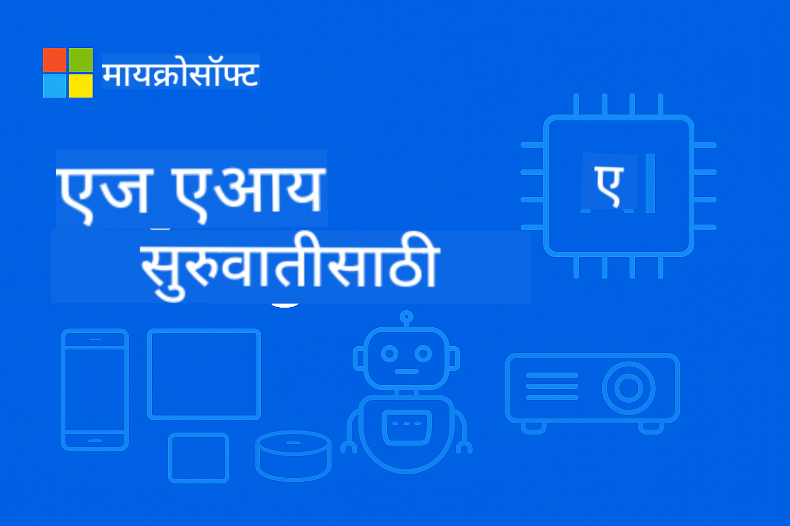

<!--
CO_OP_TRANSLATOR_METADATA:
{
  "original_hash": "ff006cd813df4152f5036e7b2bc5ed32",
  "translation_date": "2025-09-24T15:08:11+00:00",
  "source_file": "README.md",
  "language_code": "mr"
}
-->
# EdgeAI नवशिक्यांसाठी



[](https://GitHub.com/microsoft/edgeai-for-beginners/graphs/contributors)
[](https://GitHub.com/microsoft/edgeai-for-beginners/issues)
[](https://GitHub.com/microsoft/edgeai-for-beginners/pulls)
[](http://makeapullrequest.com)

[](https://GitHub.com/microsoft/edgeai-for-beginners/watchers)
[](https://GitHub.com/microsoft/edgeai-for-beginners/fork)
[](https://GitHub.com/microsoft/edgeai-for-beginners/stargazers)

[](https://discord.com/invite/ByRwuEEgH4)

या संसाधनांचा वापर सुरू करण्यासाठी खालील चरणांचे अनुसरण करा:

1. **रेपॉझिटरी फोर्क करा**: क्लिक करा [](https://GitHub.com/microsoft/edgeai-for-beginners/fork)
2. **रेपॉझिटरी क्लोन करा**: `git clone https://github.com/microsoft/edgeai-for-beginners.git`
3. [**Azure AI Foundry Discord मध्ये सामील व्हा आणि तज्ञ व इतर डेव्हलपर्सशी संवाद साधा**](https://discord.com/invite/ByRwuEEgH4)

### 🌐 बहुभाषिक समर्थन

#### GitHub Action द्वारे समर्थित (स्वयंचलित आणि नेहमी अद्ययावत)

[Arabic](../ar/README.md) | [Bengali](../bn/README.md) | [Bulgarian](../bg/README.md) | [Burmese (Myanmar)](../my/README.md) | [Chinese (Simplified)](../zh/README.md) | [Chinese (Traditional, Hong Kong)](../hk/README.md) | [Chinese (Traditional, Macau)](../mo/README.md) | [Chinese (Traditional, Taiwan)](../tw/README.md) | [Croatian](../hr/README.md) | [Czech](../cs/README.md) | [Danish](../da/README.md) | [Dutch](../nl/README.md) | [Finnish](../fi/README.md) | [French](../fr/README.md) | [German](../de/README.md) | [Greek](../el/README.md) | [Hebrew](../he/README.md) | [Hindi](../hi/README.md) | [Hungarian](../hu/README.md) | [Indonesian](../id/README.md) | [Italian](../it/README.md) | [Japanese](../ja/README.md) | [Korean](../ko/README.md) | [Malay](../ms/README.md) | [Marathi](./README.md) | [Nepali](../ne/README.md) | [Norwegian](../no/README.md) | [Persian (Farsi)](../fa/README.md) | [Polish](../pl/README.md) | [Portuguese (Brazil)](../br/README.md) | [Portuguese (Portugal)](../pt/README.md) | [Punjabi (Gurmukhi)](../pa/README.md) | [Romanian](../ro/README.md) | [Russian](../ru/README.md) | [Serbian (Cyrillic)](../sr/README.md) | [Slovak](../sk/README.md) | [Slovenian](../sl/README.md) | [Spanish](../es/README.md) | [Swahili](../sw/README.md) | [Swedish](../sv/README.md) | [Tagalog (Filipino)](../tl/README.md) | [Thai](../th/README.md) | [Turkish](../tr/README.md) | [Ukrainian](../uk/README.md) | [Urdu](../ur/README.md) | [Vietnamese](../vi/README.md)

**जर तुम्हाला अतिरिक्त भाषांमध्ये अनुवाद हवा असेल तर समर्थित भाषांची यादी [येथे](https://github.com/Azure/co-op-translator/blob/main/getting_started/supported-languages.md) आहे.**

## परिचय

**EdgeAI for Beginners** मध्ये आपले स्वागत आहे – Edge Artificial Intelligence च्या परिवर्तनशील जगात आपली सविस्तर यात्रा. हा कोर्स शक्तिशाली AI क्षमता आणि एज डिव्हाइसवर व्यावहारिक, वास्तविक-जगातील तैनाती यामधील अंतर भरतो, ज्यामुळे तुम्हाला डेटा निर्माण होतो तिथेच आणि निर्णय घेण्याची गरज असते तिथे AI चा उपयोग करण्यास सक्षम बनवतो.

### तुम्ही काय शिकाल

हा कोर्स तुम्हाला मूलभूत संकल्पनांपासून उत्पादन-तयार अंमलबजावणीपर्यंत घेऊन जातो, ज्यामध्ये समाविष्ट आहे:
- **Small Language Models (SLMs)** एज तैनातीसाठी अनुकूलित
- **हार्डवेअर-जाणीव असलेली ऑप्टिमायझेशन** विविध प्लॅटफॉर्मवर
- **रिअल-टाइम इनफरन्स** गोपनीयता-संरक्षण क्षमतांसह
- **उत्पादन तैनाती** एंटरप्राइझ अनुप्रयोगांसाठी रणनीती

### EdgeAI का महत्त्वाचे आहे

Edge AI आधुनिक आव्हाने सोडवण्यासाठी एक नवीन दृष्टिकोन सादर करते:
- **गोपनीयता आणि सुरक्षा**: संवेदनशील डेटा स्थानिक पातळीवर प्रक्रिया करा, क्लाउडमध्ये उघड न करता
- **रिअल-टाइम कार्यक्षमता**: वेळेवर महत्त्वाच्या अनुप्रयोगांसाठी नेटवर्क विलंब टाळा
- **खर्च कार्यक्षमता**: बँडविड्थ आणि क्लाउड संगणन खर्च कमी करा
- **सक्षम ऑपरेशन्स**: नेटवर्क बंद पडल्यावरही कार्यक्षमता टिकवा
- **नियामक अनुपालन**: डेटा सार्वभौमत्व आवश्यकता पूर्ण करा

### Edge AI म्हणजे काय?

Edge AI म्हणजे AI अल्गोरिदम आणि भाषा मॉडेल्स स्थानिक हार्डवेअरवर चालवणे, डेटा निर्माण होतो तिथेच, क्लाउड संसाधनांवर अवलंबून न राहता. यामुळे विलंब कमी होतो, गोपनीयता वाढते आणि रिअल-टाइम निर्णय घेणे शक्य होते.

### मुख्य तत्त्वे:
- **ऑन-डिव्हाइस इनफरन्स**: AI मॉडेल्स एज डिव्हाइसवर चालतात (फोन, राउटर, मायक्रोकंट्रोलर, औद्योगिक पीसी)
- **ऑफलाइन क्षमता**: सतत इंटरनेट कनेक्टिव्हिटीशिवाय कार्य करते
- **कमी विलंब**: रिअल-टाइम सिस्टीमसाठी त्वरित प्रतिसाद
- **डेटा सार्वभौमत्व**: संवेदनशील डेटा स्थानिक ठेवून सुरक्षा आणि अनुपालन सुधारते

### Small Language Models (SLMs)

Phi-4, Mistral-7B, आणि Gemma सारखे SLMs मोठ्या LLMs चे अनुकूलित आवृत्त्या आहेत—प्रशिक्षित किंवा डिस्टिल्ड:
- **कमी मेमरी वापर**: मर्यादित एज डिव्हाइस मेमरीचा कार्यक्षम वापर
- **कमी संगणन मागणी**: CPU आणि एज GPU कार्यक्षमतेसाठी अनुकूलित
- **जलद प्रारंभ वेळा**: प्रतिसादक्षम अनुप्रयोगांसाठी जलद प्रारंभ

हे शक्तिशाली NLP क्षमता अनलॉक करतात आणि खालील मर्यादा पूर्ण करतात:
- **एम्बेडेड सिस्टीम्स**: IoT डिव्हाइस आणि औद्योगिक नियंत्रक
- **मोबाइल डिव्हाइस**: ऑफलाइन क्षमतांसह स्मार्टफोन आणि टॅब्लेट
- **IoT डिव्हाइस**: मर्यादित संसाधनांसह सेन्सर्स आणि स्मार्ट डिव्हाइस
- **एज सर्व्हर**: मर्यादित GPU संसाधनांसह स्थानिक प्रक्रिया युनिट्स
- **पर्सनल कॉम्प्युटर्स**: डेस्कटॉप आणि लॅपटॉप तैनाती परिदृश्ये

## कोर्स मॉड्यूल्स आणि नेव्हिगेशन

| मॉड्यूल | विषय | लक्ष केंद्रित क्षेत्र | मुख्य सामग्री | स्तर | कालावधी |
|--------|-------|------------|-------------|--------|----------|
| [📚 01](../../Module01) | [EdgeAI मूलभूत गोष्टी](./Module01/README.md) | क्लाउड वि. एज AI तुलना | EdgeAI मूलभूत गोष्टी • वास्तविक-जगातील केस स्टडीज • अंमलबजावणी मार्गदर्शक • एज तैनाती | नवशिक्या | 3-4 तास |
| [🧠 02](../../Module02) | [SLM मॉडेल फाउंडेशन](./Module02/README.md) | मॉडेल कुटुंबे आणि आर्किटेक्चर | Phi कुटुंब • Qwen कुटुंब • Gemma कुटुंब • BitNET • μModel • Phi-Silica | नवशिक्या | 4-5 तास |
| [🚀 03](../../Module03) | [SLM तैनाती सराव](./Module03/README.md) | स्थानिक आणि क्लाउड तैनाती | प्रगत शिक्षण • स्थानिक वातावरण • क्लाउड तैनाती | मध्यम | 4-5 तास |
| [⚙️ 04](../../Module04) | [मॉडेल ऑप्टिमायझेशन टूलकिट](./Module04/README.md) | क्रॉस-प्लॅटफॉर्म ऑप्टिमायझेशन | परिचय • Llama.cpp • Microsoft Olive • OpenVINO • Apple MLX • वर्कफ्लो सिंथेसिस | मध्यम | 5-6 तास |
| [🔧 05](../../Module05) | [SLMOps उत्पादन](./Module05/README.md) | उत्पादन ऑपरेशन्स | SLMOps परिचय • मॉडेल डिस्टिलेशन • फाइन-ट्यूनिंग • उत्पादन तैनाती | प्रगत | 5-6 तास |
| [🤖 06](../../Module06) | [AI एजंट्स आणि फंक्शन कॉलिंग](./Module06/README.md) | एजंट फ्रेमवर्क आणि MCP | एजंट परिचय • फंक्शन कॉलिंग • मॉडेल संदर्भ प्रोटोकॉल | प्रगत | 4-5 तास |
| [💻 07](../../Module07) | [प्लॅटफॉर्म अंमलबजावणी](./Module07/README.md) | क्रॉस-प्लॅटफॉर्म नमुने | AI टूलकिट • Foundry Local • Windows विकास | प्रगत | 3-4 तास |
| [🏭 08](../../Module08) | [Foundry Local टूलकिट](./Module08/README.md) | उत्पादन-तयार नमुने | नमुना अनुप्रयोग (खाली तपशील पहा) | तज्ञ | 8-10 तास |

### 🏭 **मॉड्यूल 08: नमुना अनुप्रयोग**

- [01: REST Chat क्विकस्टार्ट](./Module08/samples/01/README.md)
- [02: OpenAI SDK एकत्रीकरण](./Module08/samples/02/README.md)
- [03: मॉडेल शोध आणि बेंचमार्किंग](./Module08/samples/03/README.md)
- [04: Chainlit RAG अनुप्रयोग](./Module08/samples/04/README.md)
- [05: मल्टी-एजंट ऑर्केस्ट्रेशन](./Module08/samples/05/README.md)
- [06: मॉडेल्स-as-Tools राउटर](./Module08/samples/06/README.md)
- [07: डायरेक्ट API क्लायंट](./Module08/samples/07/README.md)
- [08: Windows 11 Chat अॅप](./Module08/samples/08/README.md)
- [09: प्रगत मल्टी-एजंट सिस्टम](./Module08/samples/09/README.md)
- [10: Foundry Tools फ्रेमवर्क](./Module08/samples/10/README.md)

### 📊 **शिकण्याचा मार्ग सारांश**
- **एकूण कालावधी**: 36-45 तास
- **नवशिक्या मार्ग**: मॉड्यूल्स 01-02 (7-9 तास)  
- **मध्यम मार्ग**: मॉड्यूल्स 03-04 (9-11 तास)
- **प्रगत मार्ग**: मॉड्यूल्स 05-07 (12-15 तास)
- **तज्ञ मार्ग**: मॉड्यूल 08 (8-10 तास)

## तुम्ही काय तयार कराल

### 🎯 मुख्य कौशल्ये
- **Edge AI आर्किटेक्चर**: स्थानिक-प्रथम AI प्रणाली डिझाइन करा क्लाउड एकत्रीकरणासह
- **मॉडेल ऑप्टिमायझेशन**: एज तैनातीसाठी मॉडेल्स क्वांटाइझ आणि संकुचित करा (85% गती वाढ, 75% आकार कमी)
- **मल्टी-प्लॅटफॉर्म तैनाती**: Windows, मोबाइल, एम्बेडेड, आणि क्लाउड-एज हायब्रिड सिस्टम्स
- **उत्पादन ऑपरेशन्स**: एज AI चे उत्पादनात निरीक्षण, स्केलिंग, आणि देखभाल

### 🏗️ व्यावहारिक प्रकल्प
- **Foundry Local Chat अॅप्स**: मॉडेल स्विचिंगसह Windows 11 मूळ अनुप्रयोग
- **मल्टी-एजंट सिस्टम्स**: जटिल वर्कफ्लो साठी विशेषज्ञ एजंट्ससह समन्वयक  
- **RAG अनुप्रयोग**: व्हेक्टर शोधासह स्थानिक दस्तऐवज प्रक्रिया
- **मॉडेल राउटर्स**: कार्य विश्लेषणावर आधारित मॉडेल्स दरम्यान बुद्धिमान निवड
- **API फ्रेमवर्क्स**: स्ट्रीमिंग आणि हेल्थ मॉनिटरिंगसह उत्पादन-तयार क्लायंट्स
- **क्रॉस-प्लॅटफॉर्म टूल्स**: LangChain/Semantic Kernel एकत्रीकरण नमुने

### 🏢 औद्योगिक अनुप्रयोग
**मॅन्युफॅक्चरिंग** • **हेल्थकेअर** • **स्वायत्त वाहने** • **स्मार्ट सिटीज** • **मोबाइल अॅप्स**

## जलद प्रारंभ

**शिफारस केलेला शिकण्याचा मार्ग** (एकूण 20-30 तास):

1. **📚 पाया** (मॉड्यूल्स 01-02): EdgeAI संकल्पना + SLM मॉडेल कुटुंबे
2. **⚙️ ऑप्टिमायझेशन** (मॉड्यूल्स 03-04): तैनाती + क्वांटायझेशन फ्रेमवर्क्स  
3. **🚀 उत्पादन** (मॉड्यूल्स 05-06): SLMOps + AI एजंट्स + फंक्शन कॉलिंग
4. **💻 अंमलबजावणी** (मॉड्यूल्स 07-08): प्लॅटफॉर्म नमुने + Foundry Local टूलकिट

प्रत्येक मॉड्यूलमध्ये सिद्धांत, हाताळणीचे व्यायाम, आणि उत्पादन-तयार कोड नमुने समाविष्ट आहेत.

## करिअर प्रभाव
**तांत्रिक भूमिका**: EdgeAI सोल्यूशन्स आर्किटेक्ट • ML इंजिनिअर (एज) • IoT AI डेव्हलपर • मोबाइल AI डेव्हलपर

**उद्योग क्षेत्रे**: मॅन्युफॅक्चरिंग 4.0 • हेल्थकेअर टेक • स्वायत्त प्रणाली • फिनटेक • ग्राहक इलेक्ट्रॉनिक्स

**पोर्टफोलिओ प्रोजेक्ट्स**: मल्टी-एजंट सिस्टीम्स • प्रॉडक्शन RAG अ‍ॅप्स • क्रॉस-प्लॅटफॉर्म डिप्लॉयमेंट • परफॉर्मन्स ऑप्टिमायझेशन

## रिपॉझिटरी स्ट्रक्चर

```
edgeai-for-beginners/
├── 📚 Module01-04/     # Fundamentals → SLMs → Deployment → Optimization  
├── 🔧 Module05-06/     # SLMOps → AI Agents → Function Calling
├── 💻 Module07/        # Platform Samples (VS Code, Windows, Jetson, Mobile)
├── 🏭 Module08/        # Foundry Local Toolkit + 10 Comprehensive Samples
│   ├── samples/01-06/  # Foundation: REST, SDK, RAG, Agents, Routing
│   └── samples/07-10/  # Advanced: API Client, Windows App, Enterprise Agents, Tools
├── 🌐 translations/    # Multi-language support (8+ languages)
└── 📋 STUDY_GUIDE.md   # Structured learning paths & time allocation
```

## कोर्स हायलाइट्स

✅ **प्रोग्रेसिव लर्निंग**: सिद्धांत → सराव → उत्पादन डिप्लॉयमेंट  
✅ **खऱ्या केस स्टडीज**: मायक्रोसॉफ्ट, जपान एअरलाईन्स, एंटरप्राइज अंमलबजावणी  
✅ **हँड्स-ऑन नमुने**: 50+ उदाहरणे, 10 सविस्तर Foundry Local डेमो  
✅ **परफॉर्मन्स फोकस**: 85% गती सुधारणा, 75% आकार कमी  
✅ **मल्टी-प्लॅटफॉर्म**: विंडोज, मोबाइल, एम्बेडेड, क्लाउड-एज हायब्रिड  
✅ **प्रॉडक्शन रेडी**: मॉनिटरिंग, स्केलिंग, सुरक्षा, अनुपालन फ्रेमवर्क्स

📖 **[स्टडी गाईड उपलब्ध](STUDY_GUIDE.md)**: 20 तासांचे संरचित शिक्षण मार्गदर्शन, वेळ वाटप सूचना आणि स्व-मूल्यांकन साधने.

---

**EdgeAI म्हणजे AI डिप्लॉयमेंटचे भविष्य आहे**: स्थानिक-प्रथम, गोपनीयता-संरक्षण आणि कार्यक्षम. या कौशल्यांमध्ये प्रावीण्य मिळवा आणि पुढील पिढीच्या बुद्धिमान अ‍ॅप्लिकेशन्स तयार करा.

## इतर कोर्सेस

आमची टीम इतर कोर्सेस देखील तयार करते! पहा:

- [MCP फॉर बिगिनर्स](https://github.com/microsoft/mcp-for-beginners)
- [AI एजंट्स फॉर बिगिनर्स](https://github.com/microsoft/ai-agents-for-beginners?WT.mc_id=academic-105485-koreyst)
- [Generative AI फॉर बिगिनर्स using .NET](https://github.com/microsoft/Generative-AI-for-beginners-dotnet?WT.mc_id=academic-105485-koreyst)
- [Generative AI फॉर बिगिनर्स using JavaScript](https://github.com/microsoft/generative-ai-with-javascript?WT.mc_id=academic-105485-koreyst)
- [Generative AI फॉर बिगिनर्स](https://github.com/microsoft/generative-ai-for-beginners?WT.mc_id=academic-105485-koreyst)
- [ML फॉर बिगिनर्स](https://aka.ms/ml-beginners?WT.mc_id=academic-105485-koreyst)
- [डेटा सायन्स फॉर बिगिनर्स](https://aka.ms/datascience-beginners?WT.mc_id=academic-105485-koreyst)
- [AI फॉर बिगिनर्स](https://aka.ms/ai-beginners?WT.mc_id=academic-105485-koreyst)
- [सायबरसुरक्षा फॉर बिगिनर्स](https://github.com/microsoft/Security-101??WT.mc_id=academic-96948-sayoung)
- [वेब डेव्हलपमेंट फॉर बिगिनर्स](https://aka.ms/webdev-beginners?WT.mc_id=academic-105485-koreyst)
- [IoT फॉर बिगिनर्स](https://aka.ms/iot-beginners?WT.mc_id=academic-105485-koreyst)
- [XR डेव्हलपमेंट फॉर बिगिनर्स](https://github.com/microsoft/xr-development-for-beginners?WT.mc_id=academic-105485-koreyst)
- [GitHub Copilot साठी मास्टरी AI पायर्ड प्रोग्रामिंग](https://aka.ms/GitHubCopilotAI?WT.mc_id=academic-105485-koreyst)
- [GitHub Copilot साठी मास्टरी C#/.NET डेव्हलपर्स](https://github.com/microsoft/mastering-github-copilot-for-dotnet-csharp-developers?WT.mc_id=academic-105485-koreyst)
- [Choose Your Own Copilot Adventure](https://github.com/microsoft/CopilotAdventures?WT.mc_id=academic-105485-koreyst)

---

