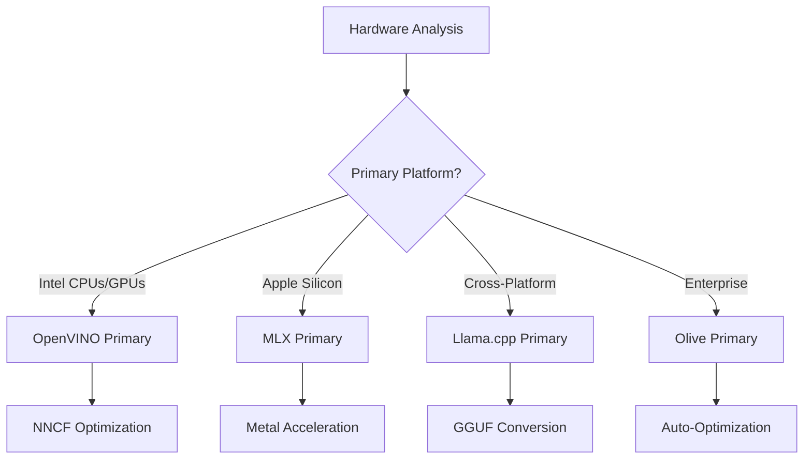
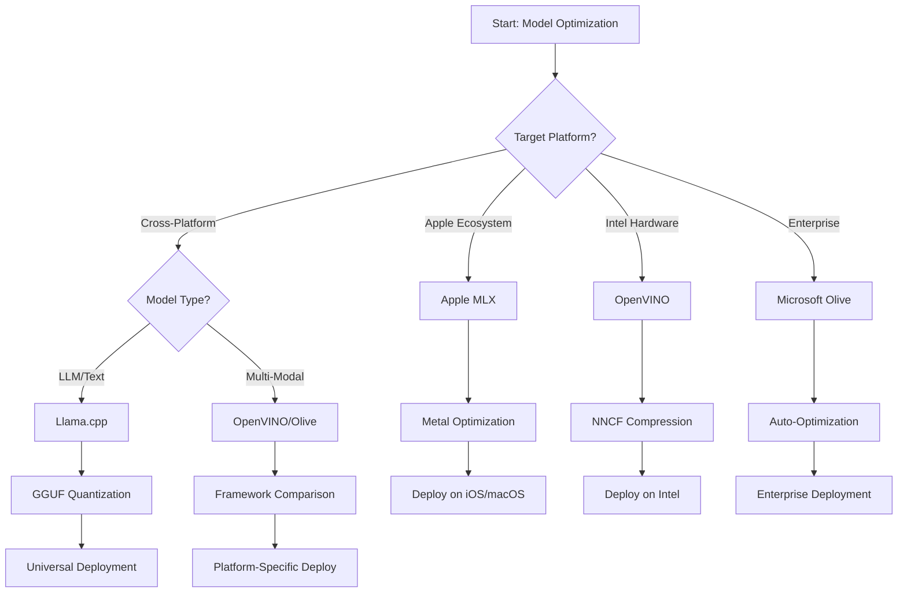
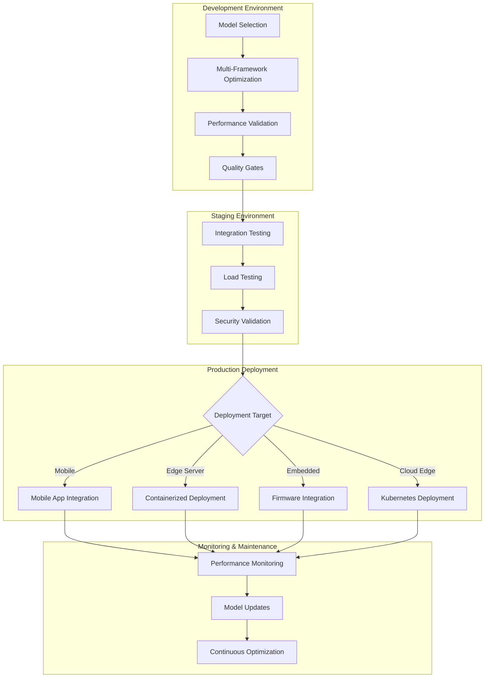

<!--
CO_OP_TRANSLATOR_METADATA:
{
  "original_hash": "6719c4a7e44b948230ac5f5cab3699bd",
  "translation_date": "2025-09-18T14:37:15+00:00",
  "source_file": "Module04/06.workflow-synthesis.md",
  "language_code": "ms"
}
-->
# Seksyen 6: Sintesis Aliran Kerja Pembangunan Edge AI

## Kandungan
1. [Pengenalan](../../../Module04)
2. [Objektif Pembelajaran](../../../Module04)
3. [Gambaran Keseluruhan Aliran Kerja Bersatu](../../../Module04)
4. [Matriks Pemilihan Rangka Kerja](../../../Module04)
5. [Sintesis Amalan Terbaik](../../../Module04)
6. [Panduan Strategi Penggunaan](../../../Module04)
7. [Aliran Kerja Pengoptimuman Prestasi](../../../Module04)
8. [Senarai Semak Kesiapan Pengeluaran](../../../Module04)
9. [Penyelesaian Masalah dan Pemantauan](../../../Module04)
10. [Masa Depan Pipeline Edge AI Anda](../../../Module04)

## Pengenalan

Pembangunan Edge AI memerlukan pemahaman mendalam tentang pelbagai rangka kerja pengoptimuman, strategi penggunaan, dan pertimbangan perkakasan. Sintesis menyeluruh ini menggabungkan pengetahuan daripada Llama.cpp, Microsoft Olive, OpenVINO, dan Apple MLX untuk mencipta aliran kerja bersatu yang memaksimumkan kecekapan, mengekalkan kualiti, dan memastikan kejayaan penggunaan dalam pengeluaran.

Sepanjang kursus ini, kita telah meneroka rangka kerja pengoptimuman individu, masing-masing dengan kekuatan unik dan kes penggunaan khusus. Walau bagaimanapun, projek Edge AI dunia sebenar sering memerlukan gabungan teknik daripada pelbagai rangka kerja atau keputusan strategik tentang pendekatan mana yang memberikan hasil terbaik berdasarkan kekangan dan keperluan tertentu.

Bahagian ini mensintesis kebijaksanaan kolektif daripada semua rangka kerja ke dalam aliran kerja yang boleh dilaksanakan, pokok keputusan, dan amalan terbaik yang membolehkan anda membina penyelesaian Edge AI yang sedia untuk pengeluaran dengan cekap dan berkesan. Sama ada anda mengoptimumkan untuk peranti mudah alih, sistem terbenam, atau pelayan edge, panduan ini menyediakan rangka kerja strategik untuk membuat keputusan yang tepat sepanjang kitaran hayat pembangunan anda.

## Objektif Pembelajaran

Menjelang akhir bahagian ini, anda akan dapat:

### Pengambilan Keputusan Strategik
- **Menilai dan memilih** rangka kerja pengoptimuman yang optimum berdasarkan keperluan projek, kekangan perkakasan, dan senario penggunaan
- **Mereka bentuk aliran kerja menyeluruh** yang mengintegrasikan pelbagai teknik pengoptimuman untuk kecekapan maksimum
- **Menilai pertukaran** antara ketepatan model, kelajuan inferens, penggunaan memori, dan kerumitan penggunaan merentasi pelbagai rangka kerja

### Integrasi Aliran Kerja
- **Melaksanakan pipeline pembangunan bersatu** yang memanfaatkan kekuatan pelbagai rangka kerja pengoptimuman
- **Mencipta aliran kerja yang boleh diulang** untuk pengoptimuman model dan penggunaan yang konsisten merentasi persekitaran yang berbeza
- **Menubuhkan pintu kualiti** dan proses pengesahan untuk memastikan model yang dioptimumkan memenuhi keperluan pengeluaran

### Pengoptimuman Prestasi
- **Mengaplikasikan strategi pengoptimuman sistematik** menggunakan kuantisasi, pemangkasan, dan teknik pecutan khusus perkakasan
- **Memantau dan menanda aras** prestasi model merentasi tahap pengoptimuman dan sasaran penggunaan yang berbeza
- **Mengoptimumkan untuk platform perkakasan tertentu** termasuk CPU, GPU, NPU, dan pemecut edge khusus

### Penggunaan Pengeluaran
- **Mereka bentuk seni bina penggunaan yang boleh diskalakan** yang menampung pelbagai format model dan enjin inferens
- **Melaksanakan pemantauan dan pemerhatian** untuk aplikasi Edge AI dalam persekitaran pengeluaran
- **Menubuhkan aliran kerja penyelenggaraan** untuk kemas kini model, pemantauan prestasi, dan pengoptimuman sistem

### Kecemerlangan Merentas Platform
- **Menggunakan model yang dioptimumkan** merentasi pelbagai platform perkakasan sambil mengekalkan prestasi yang konsisten
- **Mengendalikan pengoptimuman khusus platform** untuk Windows, macOS, Linux, mudah alih, dan sistem terbenam
- **Mencipta lapisan abstraksi** yang membolehkan penggunaan lancar merentasi persekitaran edge yang berbeza

## Gambaran Keseluruhan Aliran Kerja Bersatu

### Fasa 1: Analisis Keperluan dan Pemilihan Rangka Kerja

Asas kejayaan penggunaan Edge AI bermula dengan analisis keperluan yang teliti yang memaklumkan pemilihan rangka kerja dan strategi pengoptimuman.

#### 1.1 Penilaian Perkakasan


**Pertimbangan Utama:**
- **Seni Bina CPU**: Keupayaan x86, ARM, Apple Silicon
- **Ketersediaan Pemecut**: GPU, NPU, VPU, cip AI khusus
- **Kekangan Memori**: Had RAM, kapasiti storan
- **Bajet Kuasa**: Hayat bateri, kekangan haba
- **Kesambungan**: Keperluan luar talian, had lebar jalur

#### 1.2 Matriks Keperluan Aplikasi

| Keperluan | Llama.cpp | Microsoft Olive | OpenVINO | Apple MLX |
|-----------|-----------|-----------------|----------|-----------|
| Merentas platform | ✅ Cemerlang | ⚡ Baik | ⚡ Baik | ❌ Hanya Apple |
| Integrasi Perusahaan | ⚡ Asas | ✅ Cemerlang | ✅ Cemerlang | ⚡ Terhad |
| Penggunaan Mudah Alih | ✅ Cemerlang | ⚡ Baik | ⚡ Baik | ✅ iOS Cemerlang |
| Inferens Masa Nyata | ✅ Cemerlang | ✅ Cemerlang | ✅ Cemerlang | ✅ Cemerlang |
| Kepelbagaian Model | ✅ Fokus LLM | ✅ Semua Model | ✅ Semua Model | ✅ Fokus LLM |
| Kemudahan Penggunaan | ✅ Mudah | ✅ Automatik | ⚡ Sederhana | ✅ Mudah |

### Fasa 2: Penyediaan dan Pengoptimuman Model

#### 2.1 Pipeline Penilaian Model Universal

```python
# Universal Model Assessment Framework
class EdgeAIModelAssessment:
    def __init__(self, model_path, target_hardware):
        self.model_path = model_path
        self.target_hardware = target_hardware
        self.optimization_frameworks = []
        
    def assess_model_characteristics(self):
        """Analyze model size, architecture, and complexity"""
        return {
            'model_size': self.get_model_size(),
            'parameter_count': self.get_parameter_count(),
            'architecture_type': self.detect_architecture(),
            'quantization_compatibility': self.check_quantization_support()
        }
    
    def recommend_optimization_strategy(self):
        """Recommend optimal frameworks and techniques"""
        characteristics = self.assess_model_characteristics()
        
        if self.target_hardware.startswith('apple'):
            return self.mlx_optimization_strategy(characteristics)
        elif self.target_hardware.startswith('intel'):
            return self.openvino_optimization_strategy(characteristics)
        elif characteristics['model_size'] > 7_000_000_000:  # 7B+ parameters
            return self.enterprise_optimization_strategy(characteristics)
        else:
            return self.lightweight_optimization_strategy(characteristics)
```

#### 2.2 Pipeline Pengoptimuman Pelbagai Rangka Kerja

**Pendekatan Pengoptimuman Berurutan:**
1. **Penukaran Awal**: Tukar kepada format perantaraan (ONNX jika boleh)
2. **Pengoptimuman Khusus Rangka Kerja**: Terapkan teknik khusus
3. **Pengesahan Silang**: Sahkan prestasi merentasi platform sasaran
4. **Pembungkusan Akhir**: Sediakan untuk penggunaan

```bash
# Multi-Framework Optimization Script
#!/bin/bash

MODEL_NAME="phi-3-mini"
BASE_MODEL="microsoft/Phi-3-mini-4k-instruct"

# Phase 1: ONNX Conversion (Universal)
python convert_to_onnx.py --model $BASE_MODEL --output models/onnx/

# Phase 2: Platform-Specific Optimization
if [[ "$TARGET_PLATFORM" == "intel" ]]; then
    # OpenVINO Optimization
    python optimize_openvino.py --input models/onnx/ --output models/openvino/
elif [[ "$TARGET_PLATFORM" == "apple" ]]; then
    # MLX Optimization
    python optimize_mlx.py --input $BASE_MODEL --output models/mlx/
elif [[ "$TARGET_PLATFORM" == "cross" ]]; then
    # Llama.cpp Optimization
    python convert_to_gguf.py --input models/onnx/ --output models/gguf/
fi

# Phase 3: Validation
python validate_optimization.py --original $BASE_MODEL --optimized models/$TARGET_PLATFORM/
```

### Fasa 3: Pengesahan Prestasi dan Penanda Aras

#### 3.1 Rangka Kerja Penanda Aras Komprehensif

```python
class EdgeAIBenchmark:
    def __init__(self, optimized_models):
        self.models = optimized_models
        self.metrics = {
            'inference_time': [],
            'memory_usage': [],
            'accuracy_score': [],
            'throughput': [],
            'energy_consumption': []
        }
    
    def run_comprehensive_benchmark(self):
        """Execute standardized benchmarks across all optimized models"""
        test_inputs = self.generate_test_inputs()
        
        for model_framework, model_path in self.models.items():
            print(f"Benchmarking {model_framework}...")
            
            # Latency Testing
            latency = self.measure_inference_latency(model_path, test_inputs)
            
            # Memory Profiling
            memory = self.profile_memory_usage(model_path)
            
            # Accuracy Validation
            accuracy = self.validate_model_accuracy(model_path, test_inputs)
            
            # Throughput Analysis
            throughput = self.measure_throughput(model_path)
            
            self.record_metrics(model_framework, latency, memory, accuracy, throughput)
    
    def generate_optimization_report(self):
        """Create comprehensive comparison report"""
        report = {
            'recommendations': self.analyze_performance_trade_offs(),
            'deployment_guidance': self.generate_deployment_recommendations(),
            'monitoring_requirements': self.define_monitoring_metrics()
        }
        return report
```

## Matriks Pemilihan Rangka Kerja

### Pokok Keputusan untuk Pemilihan Rangka Kerja



### Kriteria Pemilihan Komprehensif

#### 1. Penjajaran Kes Penggunaan Utama

**Model Bahasa Besar (LLM):**
- **Llama.cpp**: Terbaik untuk penggunaan berfokuskan CPU, merentas platform
- **Apple MLX**: Optimum untuk Apple Silicon dengan memori bersatu
- **OpenVINO**: Cemerlang untuk perkakasan Intel dengan pengoptimuman NNCF
- **Microsoft Olive**: Ideal untuk aliran kerja perusahaan dengan automasi

**Model Multi-Mod:**
- **OpenVINO**: Sokongan menyeluruh untuk visi, audio, dan teks
- **Microsoft Olive**: Pengoptimuman gred perusahaan untuk pipeline kompleks
- **Llama.cpp**: Terhad kepada model berasaskan teks
- **Apple MLX**: Sokongan berkembang untuk aplikasi multi-mod

#### 2. Matriks Platform Perkakasan

| Platform | Rangka Kerja Utama | Pilihan Sekunder | Ciri Khusus |
|----------|------------------|------------------|---------------------|
| Intel CPU/GPU | OpenVINO | Microsoft Olive | Pemampatan NNCF, pengoptimuman Intel |
| NVIDIA GPU | Microsoft Olive | OpenVINO | Pecutan CUDA, ciri perusahaan |
| Apple Silicon | Apple MLX | Llama.cpp | Shader Metal, memori bersatu |
| ARM Mudah Alih | Llama.cpp | OpenVINO | Merentas platform, kebergantungan minimum |
| Edge TPU | OpenVINO | Microsoft Olive | Sokongan pemecut khusus |
| ARM Terbenam | Llama.cpp | OpenVINO | Jejak minimum, inferens cekap |

#### 3. Pilihan Aliran Kerja Pembangunan

**Prototip Pantas:**
1. **Llama.cpp**: Persediaan terpantas, hasil segera
2. **Apple MLX**: API Python mudah, iterasi cepat
3. **Microsoft Olive**: Pengoptimuman automatik, konfigurasi minimum
4. **OpenVINO**: Persediaan lebih kompleks, ciri menyeluruh

**Pengeluaran Perusahaan:**
1. **Microsoft Olive**: Ciri perusahaan, integrasi Azure
2. **OpenVINO**: Ekosistem Intel, alat menyeluruh
3. **Apple MLX**: Aplikasi perusahaan khusus Apple
4. **Llama.cpp**: Penggunaan mudah, ciri perusahaan terhad

## Sintesis Amalan Terbaik

### Prinsip Pengoptimuman Universal

#### 1. Strategi Pengoptimuman Progresif

```python
class ProgressiveOptimization:
    def __init__(self, base_model):
        self.base_model = base_model
        self.optimization_stages = [
            'baseline_measurement',
            'format_conversion',
            'quantization_optimization',
            'hardware_acceleration',
            'production_validation'
        ]
    
    def execute_progressive_optimization(self):
        """Apply optimization techniques incrementally"""
        
        # Stage 1: Baseline Measurement
        baseline_metrics = self.measure_baseline_performance()
        
        # Stage 2: Format Conversion
        converted_model = self.convert_to_optimal_format()
        conversion_metrics = self.measure_performance(converted_model)
        
        # Stage 3: Quantization
        quantized_model = self.apply_quantization(converted_model)
        quantization_metrics = self.measure_performance(quantized_model)
        
        # Stage 4: Hardware Acceleration
        accelerated_model = self.enable_hardware_acceleration(quantized_model)
        acceleration_metrics = self.measure_performance(accelerated_model)
        
        # Stage 5: Validation
        production_ready = self.validate_for_production(accelerated_model)
        
        return self.compile_optimization_report(
            baseline_metrics, conversion_metrics, 
            quantization_metrics, acceleration_metrics
        )
```

#### 2. Pelaksanaan Pintu Kualiti

**Pintu Pemeliharaan Ketepatan:**
- Mengekalkan >95% ketepatan model asal
- Sahkan terhadap set data ujian yang mewakili
- Laksanakan ujian A/B untuk pengesahan pengeluaran

**Pintu Peningkatan Prestasi:**
- Mencapai sekurang-kurangnya 2x peningkatan kelajuan
- Mengurangkan jejak memori sekurang-kurangnya 50%
- Sahkan konsistensi masa inferens

**Pintu Kesiapan Pengeluaran:**
- Lulus ujian tekanan di bawah beban
- Menunjukkan prestasi stabil dari masa ke masa
- Sahkan keperluan keselamatan dan privasi

### Integrasi Amalan Terbaik Khusus Rangka Kerja

#### 1. Sintesis Strategi Kuantisasi

```python
# Unified Quantization Approach
class UnifiedQuantizationStrategy:
    def __init__(self, model, target_platform):
        self.model = model
        self.platform = target_platform
        
    def select_optimal_quantization(self):
        """Choose best quantization based on platform and requirements"""
        
        if self.platform == 'apple_silicon':
            return self.mlx_quantization_strategy()
        elif self.platform == 'intel_hardware':
            return self.openvino_quantization_strategy()
        elif self.platform == 'cross_platform':
            return self.llamacpp_quantization_strategy()
        else:
            return self.olive_quantization_strategy()
    
    def mlx_quantization_strategy(self):
        """Apple MLX-specific quantization"""
        return {
            'method': 'mlx_quantize',
            'precision': 'int4',
            'group_size': 64,
            'optimization_target': 'unified_memory'
        }
    
    def openvino_quantization_strategy(self):
        """OpenVINO NNCF quantization"""
        return {
            'method': 'nncf_quantize',
            'precision': 'int8',
            'calibration_method': 'post_training',
            'optimization_target': 'intel_hardware'
        }
```

#### 2. Pengoptimuman Pecutan Perkakasan

**Sintesis Pengoptimuman CPU:**
- **Arahan SIMD**: Manfaatkan kernel yang dioptimumkan merentasi rangka kerja
- **Lebar Jalur Memori**: Optimumkan susun atur data untuk kecekapan cache
- **Penguliran**: Imbangkan paralelisme dengan kekangan sumber

**Amalan Terbaik Pecutan GPU:**
- **Pemprosesan Kumpulan**: Maksimumkan throughput dengan saiz kumpulan yang sesuai
- **Pengurusan Memori**: Optimumkan peruntukan memori GPU dan pemindahan
- **Ketepatan**: Gunakan FP16 jika disokong untuk prestasi lebih baik

**Pengoptimuman Pemecut NPU/Pemecut Khusus:**
- **Seni Bina Model**: Pastikan keserasian dengan keupayaan pemecut
- **Aliran Data**: Optimumkan pipeline input/output untuk kecekapan pemecut
- **Strategi Sandaran**: Laksanakan sandaran CPU untuk operasi yang tidak disokong

## Panduan Strategi Penggunaan

### Seni Bina Penggunaan Universal



### Corak Penggunaan Khusus Platform

#### 1. Strategi Penggunaan Mudah Alih

```yaml
# Mobile Deployment Configuration
mobile_deployment:
  ios:
    framework: apple_mlx
    optimization:
      quantization: int4
      memory_mapping: true
      background_execution: limited
    packaging:
      format: mlx
      bundle_size: <50MB
      
  android:
    framework: llama_cpp
    optimization:
      quantization: q4_k_m
      threading: android_optimized
      memory_management: conservative
    packaging:
      format: gguf
      apk_size: <100MB
      
  cross_platform:
    framework: onnx_runtime
    optimization:
      quantization: int8
      execution_provider: cpu
    packaging:
      format: onnx
      shared_libraries: minimal
```

#### 2. Penggunaan Pelayan Edge

```yaml
# Edge Server Deployment Configuration
edge_server:
  intel_based:
    framework: openvino
    optimization:
      quantization: int8
      acceleration: cpu_gpu_auto
      batch_processing: dynamic
    deployment:
      container: openvino_runtime
      orchestration: kubernetes
      scaling: horizontal
      
  nvidia_based:
    framework: microsoft_olive
    optimization:
      quantization: int4
      acceleration: cuda
      tensor_parallelism: true
    deployment:
      container: nvidia_triton
      orchestration: kubernetes
      scaling: gpu_aware
```

### Amalan Terbaik Pengkontenaan

```dockerfile
# Multi-Framework Edge AI Container
FROM ubuntu:22.04 as base

# Install common dependencies
RUN apt-get update && apt-get install -y \
    python3 \
    python3-pip \
    build-essential \
    cmake \
    && rm -rf /var/lib/apt/lists/*

# Framework-specific stages
FROM base as openvino
RUN pip install openvino nncf optimum[intel]

FROM base as llamacpp
RUN git clone https://github.com/ggerganov/llama.cpp.git \
    && cd llama.cpp && make LLAMA_OPENBLAS=1

FROM base as olive
RUN pip install olive-ai[auto-opt] onnxruntime-genai

# Production stage with selected framework
FROM openvino as production
COPY models/ /app/models/
COPY src/ /app/src/
WORKDIR /app

EXPOSE 8080
CMD ["python3", "src/inference_server.py"]
```

## Aliran Kerja Pengoptimuman Prestasi

### Penalaan Prestasi Sistematik

#### 1. Pipeline Pemprofilan Prestasi

```python
class EdgeAIPerformanceProfiler:
    def __init__(self, model_path, framework):
        self.model_path = model_path
        self.framework = framework
        self.profiling_results = {}
    
    def comprehensive_profiling(self):
        """Execute comprehensive performance analysis"""
        
        # CPU Profiling
        cpu_profile = self.profile_cpu_usage()
        
        # Memory Profiling
        memory_profile = self.profile_memory_usage()
        
        # Inference Latency
        latency_profile = self.profile_inference_latency()
        
        # Throughput Analysis
        throughput_profile = self.profile_throughput()
        
        # Energy Consumption (where available)
        energy_profile = self.profile_energy_consumption()
        
        return self.compile_performance_report(
            cpu_profile, memory_profile, latency_profile,
            throughput_profile, energy_profile
        )
    
    def identify_bottlenecks(self):
        """Automatically identify performance bottlenecks"""
        bottlenecks = []
        
        if self.profiling_results['cpu_utilization'] > 80:
            bottlenecks.append('cpu_bound')
        
        if self.profiling_results['memory_usage'] > 90:
            bottlenecks.append('memory_bound')
        
        if self.profiling_results['inference_variance'] > 20:
            bottlenecks.append('inconsistent_performance')
        
        return self.generate_optimization_recommendations(bottlenecks)
```

#### 2. Pipeline Pengoptimuman Automatik

```python
class AutomatedOptimizationPipeline:
    def __init__(self, base_model, target_constraints):
        self.base_model = base_model
        self.constraints = target_constraints
        self.optimization_history = []
    
    def execute_optimization_search(self):
        """Systematically search optimization space"""
        
        optimization_candidates = [
            {'quantization': 'int8', 'pruning': 0.1},
            {'quantization': 'int4', 'pruning': 0.2},
            {'quantization': 'int8', 'acceleration': 'gpu'},
            {'quantization': 'int4', 'acceleration': 'npu'}
        ]
        
        best_configuration = None
        best_score = 0
        
        for config in optimization_candidates:
            optimized_model = self.apply_optimization(config)
            score = self.evaluate_optimization(optimized_model)
            
            if score > best_score and self.meets_constraints(optimized_model):
                best_score = score
                best_configuration = config
            
            self.optimization_history.append({
                'config': config,
                'score': score,
                'model': optimized_model
            })
        
        return best_configuration, self.optimization_history
```

### Pengoptimuman Pelbagai Objektif

#### 1. Pengoptimuman Pareto untuk Edge AI

```python
class ParetoOptimization:
    def __init__(self, objectives=['speed', 'accuracy', 'memory']):
        self.objectives = objectives
        self.pareto_frontier = []
    
    def find_pareto_optimal_solutions(self, optimization_results):
        """Identify Pareto-optimal configurations"""
        
        for result in optimization_results:
            is_dominated = False
            
            for frontier_point in self.pareto_frontier:
                if self.dominates(frontier_point, result):
                    is_dominated = True
                    break
            
            if not is_dominated:
                # Remove dominated points from frontier
                self.pareto_frontier = [
                    point for point in self.pareto_frontier 
                    if not self.dominates(result, point)
                ]
                
                self.pareto_frontier.append(result)
        
        return self.pareto_frontier
    
    def recommend_configuration(self, user_preferences):
        """Recommend configuration based on user preferences"""
        
        weighted_scores = []
        for config in self.pareto_frontier:
            score = sum(
                user_preferences[obj] * config['metrics'][obj] 
                for obj in self.objectives
            )
            weighted_scores.append((score, config))
        
        return max(weighted_scores, key=lambda x: x[0])[1]
```

## Senarai Semak Kesiapan Pengeluaran

### Pengesahan Pengeluaran Komprehensif

#### 1. Jaminan Kualiti Model

```python
class ProductionReadinessValidator:
    def __init__(self, optimized_model, production_requirements):
        self.model = optimized_model
        self.requirements = production_requirements
        self.validation_results = {}
    
    def validate_model_quality(self):
        """Comprehensive model quality validation"""
        
        # Accuracy Validation
        accuracy_result = self.validate_accuracy()
        
        # Performance Validation
        performance_result = self.validate_performance()
        
        # Robustness Testing
        robustness_result = self.validate_robustness()
        
        # Security Assessment
        security_result = self.validate_security()
        
        # Compliance Verification
        compliance_result = self.validate_compliance()
        
        return self.compile_validation_report(
            accuracy_result, performance_result, robustness_result,
            security_result, compliance_result
        )
    
    def generate_certification_report(self):
        """Generate production certification report"""
        return {
            'model_signature': self.generate_model_signature(),
            'validation_timestamp': datetime.now(),
            'validation_results': self.validation_results,
            'deployment_approval': self.check_deployment_approval(),
            'monitoring_requirements': self.define_monitoring_requirements()
        }
```

#### 2. Senarai Semak Penggunaan Pengeluaran

**Pengesahan Pra-Penggunaan:**
- [ ] Ketepatan model memenuhi keperluan minimum (>95% daripada asas)
- [ ] Sasaran prestasi dicapai (latensi, throughput, memori)
- [ ] Kerentanan keselamatan dinilai dan dikurangkan
- [ ] Ujian tekanan selesai di bawah beban yang dijangka
- [ ] Senario kegagalan diuji dan prosedur pemulihan disahkan
- [ ] Sistem pemantauan dan amaran dikonfigurasikan
- [ ] Prosedur rollback diuji dan didokumentasikan

**Proses Penggunaan:**
- [ ] Strategi penggunaan biru-hijau dilaksanakan
- [ ] Peningkatan trafik secara beransur-ansur dikonfigurasikan
- [ ] Papan pemantauan masa nyata aktif
- [ ] Garis dasar prestasi ditubuhkan
- [ ] Ambang kadar ralat ditakrifkan
- [ ] Pencetus rollback automatik dikonfigurasikan

**Pemantauan Pasca Penggunaan:**
- [ ] Pengesanan drift model aktif
- [ ] Amaran kemerosotan prestasi dikonfigurasikan
- [ ] Pemantauan penggunaan sumber diaktifkan
- [ ] Metrik pengalaman pengguna dijejak
- [ ] Versi dan keturunan model dikekalkan
- [ ] Semakan prestasi model berkala dijadualkan

### Integrasi Berterusan/Penggunaan Berterusan (CI/CD)

```yaml
# Edge AI CI/CD Pipeline Configuration
edge_ai_pipeline:
  stages:
    - model_validation
    - optimization
    - testing
    - staging_deployment
    - production_deployment
    - monitoring
  
  model_validation:
    accuracy_threshold: 0.95
    performance_baseline: required
    security_scan: enabled
    
  optimization:
    frameworks:
      - llama_cpp
      - openvino
      - microsoft_olive
    validation:
      cross_validation: enabled
      performance_comparison: required
      
  testing:
    unit_tests: comprehensive
    integration_tests: full_pipeline
    load_tests: production_scale
    security_tests: comprehensive
    
  deployment:
    strategy: blue_green
    traffic_ramping: gradual
    rollback: automatic
    monitoring: real_time
```

## Penyelesaian Masalah dan Pemantauan

### Rangka Kerja Penyelesaian Masalah Universal

#### 1. Isu dan Penyelesaian Biasa

**Isu Prestasi:**
```python
class PerformanceTroubleshooter:
    def __init__(self, model_metrics):
        self.metrics = model_metrics
        
    def diagnose_performance_issues(self):
        """Systematic performance issue diagnosis"""
        
        issues = []
        
        # High latency diagnosis
        if self.metrics['avg_latency'] > self.metrics['target_latency']:
            issues.append(self.diagnose_latency_issues())
        
        # Memory usage diagnosis
        if self.metrics['memory_usage'] > self.metrics['memory_limit']:
            issues.append(self.diagnose_memory_issues())
        
        # Throughput diagnosis
        if self.metrics['throughput'] < self.metrics['target_throughput']:
            issues.append(self.diagnose_throughput_issues())
        
        return self.generate_resolution_plan(issues)
    
    def diagnose_latency_issues(self):
        """Specific latency troubleshooting"""
        potential_causes = []
        
        if self.metrics['cpu_utilization'] > 80:
            potential_causes.append('cpu_bottleneck')
        
        if self.metrics['memory_bandwidth'] > 90:
            potential_causes.append('memory_bandwidth_limit')
        
        if self.metrics['model_size'] > self.metrics['optimal_size']:
            potential_causes.append('model_too_large')
        
        return {
            'issue': 'high_latency',
            'causes': potential_causes,
            'solutions': self.generate_latency_solutions(potential_causes)
        }
```

**Penyelesaian Masalah Khusus Rangka Kerja:**

| Isu | Llama.cpp | Microsoft Olive | OpenVINO | Apple MLX |
|-----|-----------|-----------------|----------|-----------|
| Isu Memori | Kurangkan panjang konteks | Kurangkan saiz kumpulan | Aktifkan caching | Gunakan pemetaan memori |
| Inferens Perlahan | Aktifkan SIMD | Semak kuantisasi | Optimumkan penguliran | Aktifkan Metal |
| Kehilangan Ketepatan | Kuantisasi lebih tinggi | Latih semula dengan QAT | Tingkatkan penentukuran | Haluskan selepas kuantisasi |
| Keserasian | Semak format model | Sahkan versi rangka kerja | Kemas kini pemacu | Semak versi macOS |

#### 2. Strategi Pemantauan Pengeluaran

```python
class EdgeAIMonitoring:
    def __init__(self, deployment_config):
        self.config = deployment_config
        self.metrics_collectors = []
        self.alerting_rules = []
    
    def setup_comprehensive_monitoring(self):
        """Configure comprehensive monitoring for Edge AI deployment"""
        
        # Model Performance Monitoring
        self.setup_model_performance_monitoring()
        
        # Infrastructure Monitoring
        self.setup_infrastructure_monitoring()
        
        # Business Metrics Monitoring
        self.setup_business_metrics_monitoring()
        
        # Security Monitoring
        self.setup_security_monitoring()
    
    def setup_model_performance_monitoring(self):
        """Model-specific performance monitoring"""
        metrics = [
            'inference_latency_p50',
            'inference_latency_p95',
            'inference_latency_p99',
            'model_accuracy_drift',
            'prediction_confidence_distribution',
            'error_rate',
            'throughput_requests_per_second'
        ]
        
        for metric in metrics:
            self.add_metric_collector(metric)
            self.add_alerting_rule(metric)
    
    def detect_model_drift(self):
        """Automated model drift detection"""
        drift_indicators = [
            self.statistical_drift_detection(),
            self.performance_drift_detection(),
            self.data_distribution_shift_detection()
        ]
        
        return self.aggregate_drift_signals(drift_indicators)
```

### Penyelesaian Isu Automatik

```python
class AutomatedIssueResolution:
    def __init__(self, monitoring_system):
        self.monitoring = monitoring_system
        self.resolution_strategies = {}
    
    def handle_performance_degradation(self, alert):
        """Automated performance issue resolution"""
        
        if alert['type'] == 'high_latency':
            return self.resolve_latency_issue(alert)
        elif alert['type'] == 'high_memory_usage':
            return self.resolve_memory_issue(alert)
        elif alert['type'] == 'accuracy_drift':
            return self.resolve_accuracy_issue(alert)
        
    def resolve_latency_issue(self, alert):
        """Automated latency issue resolution"""
        resolution_steps = [
            'increase_cpu_allocation',
            'enable_model_caching',
            'reduce_batch_size',
            'switch_to_quantized_model'
        ]
        
        for step in resolution_steps:
            if self.apply_resolution_step(step):
                return f"Resolved latency issue with: {step}"
        
        return "Escalating to human operator"
```

## Masa Depan Pipeline Edge AI Anda

### Integrasi Teknologi Baharu

#### 1. Sokongan Perkakasan Generasi Seterusnya

```python
class FutureHardwareIntegration:
    def __init__(self):
        self.supported_accelerators = [
            'npu_next_gen',
            'quantum_processors',
            'neuromorphic_chips',
            'optical_processors'
        ]
    
    def design_adaptive_pipeline(self):
        """Create hardware-agnostic optimization pipeline"""
        
        pipeline = {
            'model_preparation': self.universal_model_preparation(),
            'hardware_detection': self.dynamic_hardware_detection(),
            'optimization_selection': self.adaptive_optimization_selection(),
            'performance_validation': self.hardware_agnostic_validation()
        }
        
        return pipeline
    
    def adaptive_optimization_selection(self):
        """Dynamically select optimization based on available hardware"""
        
        def optimize_for_hardware(model, available_hardware):
            if 'npu' in available_hardware:
                return self.npu_optimization(model)
            elif 'quantum' in available_hardware:
                return self.quantum_optimization(model)
            elif 'neuromorphic' in available_hardware:
                return self.neuromorphic_optimization(model)
            else:
                return self.fallback_optimization(model)
        
        return optimize_for_hardware
```

#### 2. Evolusi Seni Bina Model

**Sokongan untuk Seni Bina Baharu:**
- **Mixture of Experts (MoE)**: Seni bina model jarang untuk kecekapan
- **Retrieval-Augmented Generation**: Sistem hibrid model + pangkalan pengetahuan
- **Model Multimodal**: Integrasi Visi + Bahasa + Audio
- **Federated Learning**: Latihan dan pengoptimuman teragih

```python
class NextGenModelSupport:
    def __init__(self):
        self.architecture_handlers = {
            'moe': self.handle_mixture_of_experts,
            'rag': self.handle_retrieval_augmented,
            'multimodal': self.handle_multimodal,
            'federated': self.handle_federated_learning
        }
    
    def handle_mixture_of_experts(self, model):
        """Optimize Mixture of Experts models for edge deployment"""
        optimization_strategy = {
            'expert_pruning': True,
            'routing_optimization': True,
            'expert_quantization': 'per_expert',
            'load_balancing': 'dynamic'
        }
        return self.apply_moe_optimization(model, optimization_strategy)
```

### Pembelajaran dan Penyesuaian Berterusan

#### 1. Integrasi Pembelajaran Dalam Talian

```python
class EdgeOnlineLearning:
    def __init__(self, base_model, learning_rate=0.001):
        self.base_model = base_model
        self.learning_rate = learning_rate
        self.adaptation_buffer = []
    
    def continuous_adaptation(self, new_data, feedback):
        """Continuously adapt model based on edge data"""
        
        # Privacy-preserving local adaptation
        local_updates = self.compute_local_gradients(new_data, feedback)
        
        # Apply updates with constraints
        adapted_model = self.apply_constrained_updates(
            self.base_model, local_updates
        )
        
        # Validate adaptation quality
        if self.validate_adaptation(adapted_model):
            self.base_model = adapted_model
            return True
        
        return False
    
    def federated_learning_participation(self):
        """Participate in federated learning while preserving privacy"""
        
        # Compute local model updates
        local_updates = self.compute_private_updates()
        
        # Differential privacy protection
        private_updates = self.apply_differential_privacy(local_updates)
        
        # Share with federated learning coordinator
        return self.share_updates(private_updates)
```

#### 2. Kelestarian dan AI Hijau

```python
class GreenEdgeAI:
    def __init__(self, sustainability_targets):
        self.targets = sustainability_targets
        self.energy_monitor = EnergyMonitor()
    
    def optimize_for_sustainability(self, model):
        """Optimize model for minimal environmental impact"""
        
        optimization_objectives = [
            'minimize_energy_consumption',
            'maximize_hardware_utilization',
            'reduce_model_training_cost',
            'extend_device_lifetime'
        ]
        
        return self.multi_objective_green_optimization(
            model, optimization_objectives
        )
    
    def carbon_aware_deployment(self):
        """Deploy models considering carbon footprint"""
        
        deployment_strategy = {
            'prefer_renewable_energy_regions': True,
            'optimize_for_energy_efficiency': True,
            'minimize_data_transfer': True,
            'lifecycle_carbon_accounting': True
        }
        
        return deployment_strategy
```

## Kesimpulan

Sintesis aliran kerja menyeluruh ini mewakili kemuncak pengetahuan pengoptimuman Edge AI, menggabungkan amalan terbaik daripada semua rangka kerja pengoptimuman utama ke dalam pendekatan bersatu yang sedia untuk pengeluaran. Dengan mengikuti garis panduan ini, anda akan dapat:

**Mencapai Prestasi Optimum**: Melalui pemilihan rangka kerja yang sistematik, pengoptimuman progresif, dan pengesahan menyeluruh, memastikan aplikasi Edge AI anda memberikan kecekapan maksimum.

**Memastikan Kesiapan Pengeluaran**: Dengan ujian menyeluruh, pemantauan, dan pintu kualiti yang menjamin penggunaan dan operasi yang boleh dipercayai dalam persekitaran dunia sebenar.

**Menjaga Kejayaan Jangka Panjang**: Melalui pemantauan berterusan, penyelesaian isu automatik, dan strategi penyesuaian yang memastikan penyelesaian Edge AI anda kekal berprestasi dan relevan.

**Melindungi Pelaburan Anda di Masa Depan**: Dengan mereka bentuk pipeline yang fleksibel dan bebas perkakasan yang boleh berkembang dengan teknologi dan keperluan yang muncul.

Landskap Edge AI terus berkembang pesat, dengan platform perkakasan baharu, teknik pengoptimuman, dan strategi penggunaan yang muncul secara berkala. Sintesis ini menyediakan asas untuk menavigasi kerumitan ini sambil membina penyelesaian Edge AI yang mantap, cekap, dan boleh diselenggara yang memberikan nilai sebenar dalam persekitaran pengeluaran.
Ingatlah bahawa strategi pengoptimuman terbaik adalah yang memenuhi keperluan khusus anda sambil mengekalkan fleksibiliti untuk menyesuaikan diri apabila keperluan tersebut berkembang. Gunakan panduan ini sebagai kerangka untuk membuat keputusan yang bijak, tetapi sentiasa sahkan pilihan anda melalui ujian empirikal dan pengalaman penggunaan dunia sebenar.

## ➡️ Apa yang seterusnya

Teruskan perjalanan Edge AI anda dengan meneroka [Module 5: SLMOps and Production Deployment](../Module05/README.md) untuk mempelajari aspek operasi pengurusan kitaran hayat Small Language Model.

---

**Penafian**:  
Dokumen ini telah diterjemahkan menggunakan perkhidmatan terjemahan AI [Co-op Translator](https://github.com/Azure/co-op-translator). Walaupun kami berusaha untuk memastikan ketepatan, sila ambil perhatian bahawa terjemahan automatik mungkin mengandungi kesilapan atau ketidaktepatan. Dokumen asal dalam bahasa asalnya harus dianggap sebagai sumber yang berwibawa. Untuk maklumat yang kritikal, terjemahan manusia profesional adalah disyorkan. Kami tidak bertanggungjawab atas sebarang salah faham atau salah tafsir yang timbul daripada penggunaan terjemahan ini.