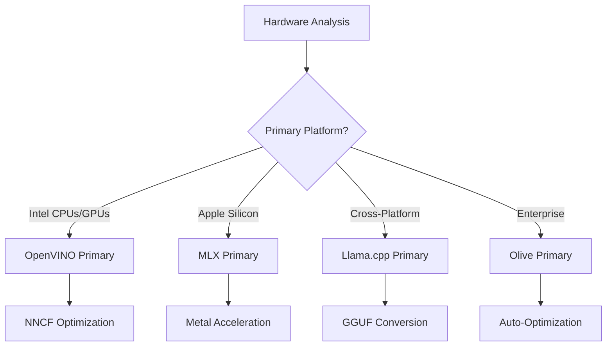
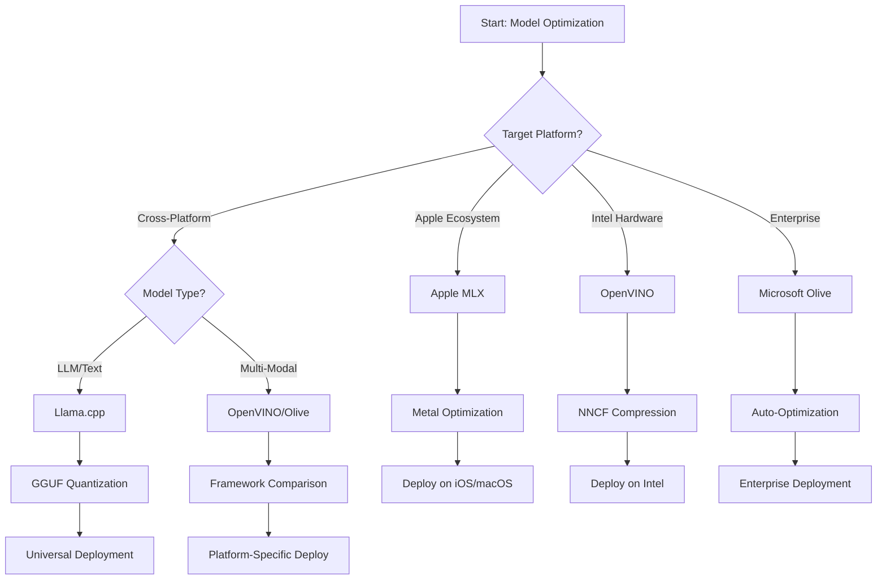
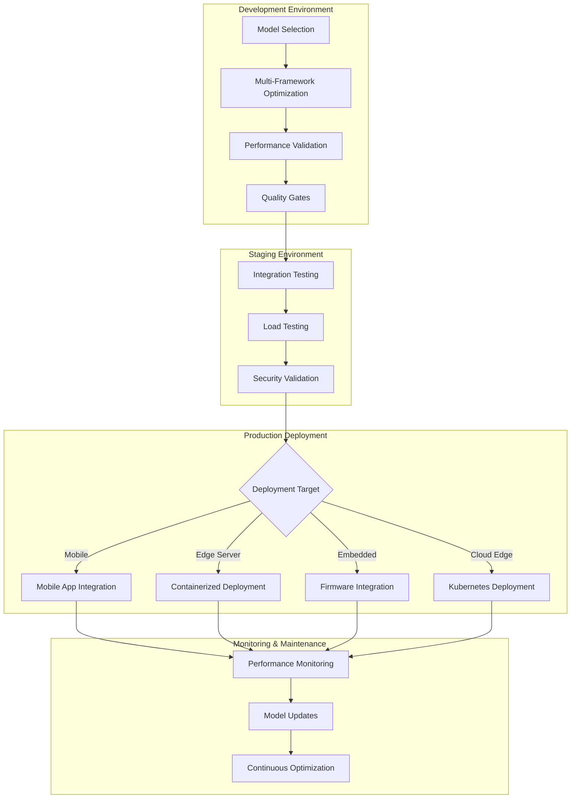

<!--
CO_OP_TRANSLATOR_METADATA:
{
  "original_hash": "6719c4a7e44b948230ac5f5cab3699bd",
  "translation_date": "2025-09-19T00:37:08+00:00",
  "source_file": "Module04/06.workflow-synthesis.md",
  "language_code": "my"
}
-->
# အပိုင်း ၆: Edge AI ဖွံ့ဖြိုးတိုးတက်မှုလုပ်ငန်းစဉ်များ၏ အနှစ်ချုပ်

## အကြောင်းအရာများ
1. [မိတ်ဆက်](../../../Module04)
2. [သင်ယူရမည့်ရည်မှန်းချက်များ](../../../Module04)
3. [လုပ်ငန်းစဉ်များ၏ အနှစ်ချုပ်](../../../Module04)
4. [Framework ရွေးချယ်မှု Matrix](../../../Module04)
5. [အကောင်းဆုံးအလေ့အကျင့်များ၏ အနှစ်ချုပ်](../../../Module04)
6. [Deployment မဟာဗျူဟာလမ်းညွှန်](../../../Module04)
7. [Performance တိုးတက်မှုလုပ်ငန်းစဉ်](../../../Module04)
8. [ထုတ်လုပ်မှုအဆင်သင့်ဖြစ်မှု စစ်ဆေးစာရင်း](../../../Module04)
9. [ပြဿနာဖြေရှင်းခြင်းနှင့် စောင့်ကြည့်မှု](../../../Module04)
10. [Edge AI Pipeline ကို အနာဂတ်အတွက် ပြင်ဆင်ခြင်း](../../../Module04)

## မိတ်ဆက်

Edge AI ဖွံ့ဖြိုးတိုးတက်မှုသည် အများပြည်သူ optimization frameworks, deployment မဟာဗျူဟာများနှင့် hardware အခြေအနေများကို နားလည်မှုအဆင့်မြင့်တစ်ခုလိုအပ်သည်။ ဒီအပိုင်းမှာ Llama.cpp, Microsoft Olive, OpenVINO, Apple MLX တို့မှ ရရှိသော အတွေ့အကြုံများကို စုစည်းပြီး အကျိုးရှိစွာအသုံးချနိုင်သော workflow တစ်ခုကို ဖန်တီးထားသည်။ 

ဒီသင်တန်းတစ်ခုလုံးမှာ Framework တစ်ခုချင်းစီ၏ အားသာချက်များနှင့် အထူးအသုံးပြုမှုများကို လေ့လာခဲ့ပြီးဖြစ်သည်။ သို့သော် အမှန်တကယ် Edge AI ပရောဂျက်များတွင် Framework များစွာကို ပေါင်းစပ်အသုံးပြုရန်လိုအပ်သည်။ 

ဒီအပိုင်းမှာ Framework များ၏ အတွေ့အကြုံများကို စုစည်းပြီး သင်၏ Edge AI ပရောဂျက်များကို ထုတ်လုပ်မှုအဆင့်သို့ အကျိုးရှိစွာရောက်ရှိစေမည့် လုပ်ငန်းစဉ်များနှင့် မဟာဗျူဟာများကို ဖော်ပြထားသည်။

## သင်ယူရမည့်ရည်မှန်းချက်များ

### မဟာဗျူဟာဆိုင်ရာ ဆုံးဖြတ်ချက်များ
- **Project လိုအပ်ချက်များ**၊ hardware အကန့်အသတ်များနှင့် deployment အခြေအနေများအပေါ် အခြေခံပြီး အကောင်းဆုံး optimization framework ကို ရွေးချယ်နိုင်ရန်
- **Optimization နည်းလမ်းများ**ကို ပေါင်းစပ်ပြီး အကျိုးရှိစွာ workflow များကို ဖန်တီးနိုင်ရန်
- **Accuracy, Speed, Memory Usage** နှင့် Deployment ရှုပ်ထွေးမှုတို့အကြား trade-offs များကို သုံးသပ်နိုင်ရန်

### Workflow ပေါင်းစည်းမှု
- **Framework များစွာကို ပေါင်းစပ်ထားသော Development Pipeline** များကို အကောင်းဆုံးအသုံးချနိုင်ရန်
- **Reproducible Workflow များ**ကို ဖန်တီးပြီး မတူညီသောပတ်ဝန်းကျင်များတွင် အဆင်ပြေစွာ အသုံးပြုနိုင်ရန်
- **Quality Gates** များကို ထည့်သွင်းပြီး ထုတ်လုပ်မှုအဆင့်သို့ ရောက်ရှိရန်

### Performance တိုးတက်မှု
- **Quantization, Pruning** နှင့် Hardware-specific acceleration နည်းလမ်းများကို အသုံးပြုနိုင်ရန်
- **Benchmarking** နှင့် **Monitoring** ကို အဆင့်မြှင့်တင်ရန်
- **CPU, GPU, NPU** နှင့် Edge Accelerators များအတွက် အထူး optimization များကို လုပ်ဆောင်နိုင်ရန်

### ထုတ်လုပ်မှု Deployment
- **Scalable Deployment Architectures** ကို ဖန်တီးပြီး မတူညီသော Model Formats များနှင့် Inference Engines များကို ထည့်သွင်းနိုင်ရန်
- **Monitoring နှင့် Observability** ကို ထုတ်လုပ်မှုအဆင့်တွင် အကောင်းဆုံးအသုံးပြုနိုင်ရန်
- **Maintenance Workflow** များကို ဖန်တီးပြီး Model Updates, Performance Monitoring နှင့် System Optimization များကို လုပ်ဆောင်နိုင်ရန်

### Cross-Platform အထူးကျွမ်းကျင်မှု
- **Optimized Models** များကို မတူညီသော Hardware Platforms များတွင် Deployment လုပ်နိုင်ရန်
- **Platform-specific Optimization** များကို Windows, macOS, Linux, Mobile နှင့် Embedded Systems များအတွက် လုပ်ဆောင်နိုင်ရန်
- **Abstraction Layers** များကို ဖန်တီးပြီး မတူညီသော Edge ပတ်ဝန်းကျင်များတွင် Seamless Deployment လုပ်နိုင်ရန်

## လုပ်ငန်းစဉ်များ၏ အနှစ်ချုပ်

### အဆင့် ၁: လိုအပ်ချက်များနှင့် Framework ရွေးချယ်မှု

Edge AI Deployment အောင်မြင်မှု၏ အခြေခံသည် လိုအပ်ချက်များကို သေချာစွာ သုံးသပ်ပြီး Framework ရွေးချယ်မှုနှင့် Optimization Strategy ကို သတ်မှတ်ခြင်းဖြစ်သည်။

#### ၁.၁ Hardware အကန့်အသတ်များ


**အရေးကြီးသောအချက်များ:**
- **CPU Architecture**: x86, ARM, Apple Silicon
- **Accelerator Availability**: GPU, NPU, VPU, AI Chips
- **Memory Constraints**: RAM, Storage
- **Power Budget**: Battery Life, Thermal Constraints
- **Connectivity**: Offline, Bandwidth

#### ၁.၂ Application လိုအပ်ချက် Matrix

| Requirement | Llama.cpp | Microsoft Olive | OpenVINO | Apple MLX |
|-------------|-----------|-----------------|----------|-----------|
| Cross-platform | ✅ Excellent | ⚡ Good | ⚡ Good | ❌ Apple Only |
| Enterprise Integration | ⚡ Basic | ✅ Excellent | ✅ Excellent | ⚡ Limited |
| Mobile Deployment | ✅ Excellent | ⚡ Good | ⚡ Good | ✅ iOS Excellent |
| Real-time Inference | ✅ Excellent | ✅ Excellent | ✅ Excellent | ✅ Excellent |
| Model Diversity | ✅ LLM Focus | ✅ All Models | ✅ All Models | ✅ LLM Focus |
| Ease of Use | ✅ Simple | ✅ Automated | ⚡ Moderate | ✅ Simple |

### အဆင့် ၂: Model ပြင်ဆင်မှုနှင့် Optimization

#### ၂.၁ Universal Model Assessment Pipeline

```python
# Universal Model Assessment Framework
class EdgeAIModelAssessment:
    def __init__(self, model_path, target_hardware):
        self.model_path = model_path
        self.target_hardware = target_hardware
        self.optimization_frameworks = []
        
    def assess_model_characteristics(self):
        """Analyze model size, architecture, and complexity"""
        return {
            'model_size': self.get_model_size(),
            'parameter_count': self.get_parameter_count(),
            'architecture_type': self.detect_architecture(),
            'quantization_compatibility': self.check_quantization_support()
        }
    
    def recommend_optimization_strategy(self):
        """Recommend optimal frameworks and techniques"""
        characteristics = self.assess_model_characteristics()
        
        if self.target_hardware.startswith('apple'):
            return self.mlx_optimization_strategy(characteristics)
        elif self.target_hardware.startswith('intel'):
            return self.openvino_optimization_strategy(characteristics)
        elif characteristics['model_size'] > 7_000_000_000:  # 7B+ parameters
            return self.enterprise_optimization_strategy(characteristics)
        else:
            return self.lightweight_optimization_strategy(characteristics)
```

#### ၂.၂ Multi-Framework Optimization Pipeline

**Sequential Optimization Approach:**
1. **Initial Conversion**: ONNX Intermediate Format
2. **Framework-Specific Optimization**: Techniques Apply
3. **Cross-Validation**: Platforms Performance Verify
4. **Final Packaging**: Deployment Ready

```bash
# Multi-Framework Optimization Script
#!/bin/bash

MODEL_NAME="phi-3-mini"
BASE_MODEL="microsoft/Phi-3-mini-4k-instruct"

# Phase 1: ONNX Conversion (Universal)
python convert_to_onnx.py --model $BASE_MODEL --output models/onnx/

# Phase 2: Platform-Specific Optimization
if [[ "$TARGET_PLATFORM" == "intel" ]]; then
    # OpenVINO Optimization
    python optimize_openvino.py --input models/onnx/ --output models/openvino/
elif [[ "$TARGET_PLATFORM" == "apple" ]]; then
    # MLX Optimization
    python optimize_mlx.py --input $BASE_MODEL --output models/mlx/
elif [[ "$TARGET_PLATFORM" == "cross" ]]; then
    # Llama.cpp Optimization
    python convert_to_gguf.py --input models/onnx/ --output models/gguf/
fi

# Phase 3: Validation
python validate_optimization.py --original $BASE_MODEL --optimized models/$TARGET_PLATFORM/
```

### အဆင့် ၃: Performance Validation နှင့် Benchmarking

#### ၃.၁ Comprehensive Benchmarking Framework

```python
class EdgeAIBenchmark:
    def __init__(self, optimized_models):
        self.models = optimized_models
        self.metrics = {
            'inference_time': [],
            'memory_usage': [],
            'accuracy_score': [],
            'throughput': [],
            'energy_consumption': []
        }
    
    def run_comprehensive_benchmark(self):
        """Execute standardized benchmarks across all optimized models"""
        test_inputs = self.generate_test_inputs()
        
        for model_framework, model_path in self.models.items():
            print(f"Benchmarking {model_framework}...")
            
            # Latency Testing
            latency = self.measure_inference_latency(model_path, test_inputs)
            
            # Memory Profiling
            memory = self.profile_memory_usage(model_path)
            
            # Accuracy Validation
            accuracy = self.validate_model_accuracy(model_path, test_inputs)
            
            # Throughput Analysis
            throughput = self.measure_throughput(model_path)
            
            self.record_metrics(model_framework, latency, memory, accuracy, throughput)
    
    def generate_optimization_report(self):
        """Create comprehensive comparison report"""
        report = {
            'recommendations': self.analyze_performance_trade_offs(),
            'deployment_guidance': self.generate_deployment_recommendations(),
            'monitoring_requirements': self.define_monitoring_metrics()
        }
        return report
```

## Framework ရွေးချယ်မှု Matrix

### Framework ရွေးချယ်မှု Decision Tree



### ရွေးချယ်မှုအခြေခံချက်များ

#### ၁. Primary Use Case Alignment

**Large Language Models (LLMs):**
- **Llama.cpp**: CPU-focused, Cross-platform
- **Apple MLX**: Apple Silicon
- **OpenVINO**: Intel Hardware
- **Microsoft Olive**: Enterprise Automation

**Multi-Modal Models:**
- **OpenVINO**: Vision, Audio, Text
- **Microsoft Olive**: Enterprise-grade
- **Llama.cpp**: Text-based
- **Apple MLX**: Growing Support

#### ၂. Hardware Platform Matrix

| Platform | Primary Framework | Secondary Option | Specialized Features |
|----------|------------------|------------------|---------------------|
| Intel CPU/GPU | OpenVINO | Microsoft Olive | NNCF Compression |
| NVIDIA GPU | Microsoft Olive | OpenVINO | CUDA Acceleration |
| Apple Silicon | Apple MLX | Llama.cpp | Metal Shaders |
| ARM Mobile | Llama.cpp | OpenVINO | Minimal Dependencies |
| Edge TPU | OpenVINO | Microsoft Olive | Accelerator Support |
| Embedded ARM | Llama.cpp | OpenVINO | Efficient Inference |

#### ၃. Development Workflow Preferences

**Rapid Prototyping:**
1. **Llama.cpp**: Fast Setup
2. **Apple MLX**: Python API
3. **Microsoft Olive**: Automated Optimization
4. **OpenVINO**: Comprehensive Features

**Enterprise Production:**
1. **Microsoft Olive**: Azure Integration
2. **OpenVINO**: Intel Ecosystem
3. **Apple MLX**: Apple Applications
4. **Llama.cpp**: Simple Deployment

## အကောင်းဆုံးအလေ့အကျင့်များ၏ အနှစ်ချုပ်

### Universal Optimization Principles

#### ၁. Progressive Optimization Strategy

```python
class ProgressiveOptimization:
    def __init__(self, base_model):
        self.base_model = base_model
        self.optimization_stages = [
            'baseline_measurement',
            'format_conversion',
            'quantization_optimization',
            'hardware_acceleration',
            'production_validation'
        ]
    
    def execute_progressive_optimization(self):
        """Apply optimization techniques incrementally"""
        
        # Stage 1: Baseline Measurement
        baseline_metrics = self.measure_baseline_performance()
        
        # Stage 2: Format Conversion
        converted_model = self.convert_to_optimal_format()
        conversion_metrics = self.measure_performance(converted_model)
        
        # Stage 3: Quantization
        quantized_model = self.apply_quantization(converted_model)
        quantization_metrics = self.measure_performance(quantized_model)
        
        # Stage 4: Hardware Acceleration
        accelerated_model = self.enable_hardware_acceleration(quantized_model)
        acceleration_metrics = self.measure_performance(accelerated_model)
        
        # Stage 5: Validation
        production_ready = self.validate_for_production(accelerated_model)
        
        return self.compile_optimization_report(
            baseline_metrics, conversion_metrics, 
            quantization_metrics, acceleration_metrics
        )
```

#### ၂. Quality Gate Implementation

**Accuracy Preservation Gates:**
- Model Accuracy >95%
- Representative Test Dataset Validation
- A/B Testing

**Performance Improvement Gates:**
- Speed Improvement 2x
- Memory Footprint 50% Reduction
- Inference Time Consistency

**Production Readiness Gates:**
- Stress Testing
- Stable Performance
- Security Validation

### Framework-Specific Best Practices Integration

#### ၁. Quantization Strategy Synthesis

```python
# Unified Quantization Approach
class UnifiedQuantizationStrategy:
    def __init__(self, model, target_platform):
        self.model = model
        self.platform = target_platform
        
    def select_optimal_quantization(self):
        """Choose best quantization based on platform and requirements"""
        
        if self.platform == 'apple_silicon':
            return self.mlx_quantization_strategy()
        elif self.platform == 'intel_hardware':
            return self.openvino_quantization_strategy()
        elif self.platform == 'cross_platform':
            return self.llamacpp_quantization_strategy()
        else:
            return self.olive_quantization_strategy()
    
    def mlx_quantization_strategy(self):
        """Apple MLX-specific quantization"""
        return {
            'method': 'mlx_quantize',
            'precision': 'int4',
            'group_size': 64,
            'optimization_target': 'unified_memory'
        }
    
    def openvino_quantization_strategy(self):
        """OpenVINO NNCF quantization"""
        return {
            'method': 'nncf_quantize',
            'precision': 'int8',
            'calibration_method': 'post_training',
            'optimization_target': 'intel_hardware'
        }
```

#### ၂. Hardware Acceleration Optimization

**CPU Optimization:**
- **SIMD Instructions**: Optimized Kernels
- **Memory Bandwidth**: Cache Efficiency
- **Threading**: Parallelism Balance

**GPU Acceleration:**
- **Batch Processing**: Throughput Maximize
- **Memory Management**: GPU Allocation
- **Precision**: FP16 Support

**NPU/Specialized Accelerator Optimization:**
- **Model Architecture**: Compatibility
- **Data Flow**: Efficiency
- **Fallback Strategies**: CPU Fallback

## Deployment မဟာဗျူဟာလမ်းညွှန်

### Universal Deployment Architecture



### Platform-Specific Deployment Patterns

#### ၁. Mobile Deployment Strategy

```yaml
# Mobile Deployment Configuration
mobile_deployment:
  ios:
    framework: apple_mlx
    optimization:
      quantization: int4
      memory_mapping: true
      background_execution: limited
    packaging:
      format: mlx
      bundle_size: <50MB
      
  android:
    framework: llama_cpp
    optimization:
      quantization: q4_k_m
      threading: android_optimized
      memory_management: conservative
    packaging:
      format: gguf
      apk_size: <100MB
      
  cross_platform:
    framework: onnx_runtime
    optimization:
      quantization: int8
      execution_provider: cpu
    packaging:
      format: onnx
      shared_libraries: minimal
```

#### ၂. Edge Server Deployment

```yaml
# Edge Server Deployment Configuration
edge_server:
  intel_based:
    framework: openvino
    optimization:
      quantization: int8
      acceleration: cpu_gpu_auto
      batch_processing: dynamic
    deployment:
      container: openvino_runtime
      orchestration: kubernetes
      scaling: horizontal
      
  nvidia_based:
    framework: microsoft_olive
    optimization:
      quantization: int4
      acceleration: cuda
      tensor_parallelism: true
    deployment:
      container: nvidia_triton
      orchestration: kubernetes
      scaling: gpu_aware
```

### Containerization Best Practices

```dockerfile
# Multi-Framework Edge AI Container
FROM ubuntu:22.04 as base

# Install common dependencies
RUN apt-get update && apt-get install -y \
    python3 \
    python3-pip \
    build-essential \
    cmake \
    && rm -rf /var/lib/apt/lists/*

# Framework-specific stages
FROM base as openvino
RUN pip install openvino nncf optimum[intel]

FROM base as llamacpp
RUN git clone https://github.com/ggerganov/llama.cpp.git \
    && cd llama.cpp && make LLAMA_OPENBLAS=1

FROM base as olive
RUN pip install olive-ai[auto-opt] onnxruntime-genai

# Production stage with selected framework
FROM openvino as production
COPY models/ /app/models/
COPY src/ /app/src/
WORKDIR /app

EXPOSE 8080
CMD ["python3", "src/inference_server.py"]
```

## Performance တိုးတက်မှုလုပ်ငန်းစဉ်

### Systematic Performance Tuning

#### ၁. Performance Profiling Pipeline

```python
class EdgeAIPerformanceProfiler:
    def __init__(self, model_path, framework):
        self.model_path = model_path
        self.framework = framework
        self.profiling_results = {}
    
    def comprehensive_profiling(self):
        """Execute comprehensive performance analysis"""
        
        # CPU Profiling
        cpu_profile = self.profile_cpu_usage()
        
        # Memory Profiling
        memory_profile = self.profile_memory_usage()
        
        # Inference Latency
        latency_profile = self.profile_inference_latency()
        
        # Throughput Analysis
        throughput_profile = self.profile_throughput()
        
        # Energy Consumption (where available)
        energy_profile = self.profile_energy_consumption()
        
        return self.compile_performance_report(
            cpu_profile, memory_profile, latency_profile,
            throughput_profile, energy_profile
        )
    
    def identify_bottlenecks(self):
        """Automatically identify performance bottlenecks"""
        bottlenecks = []
        
        if self.profiling_results['cpu_utilization'] > 80:
            bottlenecks.append('cpu_bound')
        
        if self.profiling_results['memory_usage'] > 90:
            bottlenecks.append('memory_bound')
        
        if self.profiling_results['inference_variance'] > 20:
            bottlenecks.append('inconsistent_performance')
        
        return self.generate_optimization_recommendations(bottlenecks)
```

#### ၂. Automated Optimization Pipeline

```python
class AutomatedOptimizationPipeline:
    def __init__(self, base_model, target_constraints):
        self.base_model = base_model
        self.constraints = target_constraints
        self.optimization_history = []
    
    def execute_optimization_search(self):
        """Systematically search optimization space"""
        
        optimization_candidates = [
            {'quantization': 'int8', 'pruning': 0.1},
            {'quantization': 'int4', 'pruning': 0.2},
            {'quantization': 'int8', 'acceleration': 'gpu'},
            {'quantization': 'int4', 'acceleration': 'npu'}
        ]
        
        best_configuration = None
        best_score = 0
        
        for config in optimization_candidates:
            optimized_model = self.apply_optimization(config)
            score = self.evaluate_optimization(optimized_model)
            
            if score > best_score and self.meets_constraints(optimized_model):
                best_score = score
                best_configuration = config
            
            self.optimization_history.append({
                'config': config,
                'score': score,
                'model': optimized_model
            })
        
        return best_configuration, self.optimization_history
```

### Multi-Objective Optimization

#### ၁. Pareto Optimization for Edge AI

```python
class ParetoOptimization:
    def __init__(self, objectives=['speed', 'accuracy', 'memory']):
        self.objectives = objectives
        self.pareto_frontier = []
    
    def find_pareto_optimal_solutions(self, optimization_results):
        """Identify Pareto-optimal configurations"""
        
        for result in optimization_results:
            is_dominated = False
            
            for frontier_point in self.pareto_frontier:
                if self.dominates(frontier_point, result):
                    is_dominated = True
                    break
            
            if not is_dominated:
                # Remove dominated points from frontier
                self.pareto_frontier = [
                    point for point in self.pareto_frontier 
                    if not self.dominates(result, point)
                ]
                
                self.pareto_frontier.append(result)
        
        return self.pareto_frontier
    
    def recommend_configuration(self, user_preferences):
        """Recommend configuration based on user preferences"""
        
        weighted_scores = []
        for config in self.pareto_frontier:
            score = sum(
                user_preferences[obj] * config['metrics'][obj] 
                for obj in self.objectives
            )
            weighted_scores.append((score, config))
        
        return max(weighted_scores, key=lambda x: x[0])[1]
```

## ထုတ်လုပ်မှုအဆင်သင့်ဖြစ်မှု စစ်ဆေးစာရင်း

### Comprehensive Production Validation

#### ၁. Model Quality Assurance

```python
class ProductionReadinessValidator:
    def __init__(self, optimized_model, production_requirements):
        self.model = optimized_model
        self.requirements = production_requirements
        self.validation_results = {}
    
    def validate_model_quality(self):
        """Comprehensive model quality validation"""
        
        # Accuracy Validation
        accuracy_result = self.validate_accuracy()
        
        # Performance Validation
        performance_result = self.validate_performance()
        
        # Robustness Testing
        robustness_result = self.validate_robustness()
        
        # Security Assessment
        security_result = self.validate_security()
        
        # Compliance Verification
        compliance_result = self.validate_compliance()
        
        return self.compile_validation_report(
            accuracy_result, performance_result, robustness_result,
            security_result, compliance_result
        )
    
    def generate_certification_report(self):
        """Generate production certification report"""
        return {
            'model_signature': self.generate_model_signature(),
            'validation_timestamp': datetime.now(),
            'validation_results': self.validation_results,
            'deployment_approval': self.check_deployment_approval(),
            'monitoring_requirements': self.define_monitoring_requirements()
        }
```

#### ၂. Production Deployment Checklist

**Pre-Deployment Validation:**
- [ ] Model Accuracy >95%
- [ ] Performance Targets Achieved
- [ ] Security Vulnerabilities Mitigated
- [ ] Stress Testing Completed
- [ ] Failure Scenarios Validated
- [ ] Monitoring Configured
- [ ] Rollback Procedures Documented

**Deployment Process:**
- [ ] Blue-Green Deployment
- [ ] Gradual Traffic Ramp
- [ ] Monitoring Dashboards Active
- [ ] Performance Baselines
- [ ] Error Rate Thresholds
- [ ] Automated Rollback

**Post-Deployment Monitoring:**
- [ ] Model Drift Detection
- [ ] Performance Alerts
- [ ] Resource Utilization Monitoring
- [ ] User Experience Metrics
- [ ] Model Versioning
- [ ] Regular Reviews

### Continuous Integration/Continuous Deployment (CI/CD)

```yaml
# Edge AI CI/CD Pipeline Configuration
edge_ai_pipeline:
  stages:
    - model_validation
    - optimization
    - testing
    - staging_deployment
    - production_deployment
    - monitoring
  
  model_validation:
    accuracy_threshold: 0.95
    performance_baseline: required
    security_scan: enabled
    
  optimization:
    frameworks:
      - llama_cpp
      - openvino
      - microsoft_olive
    validation:
      cross_validation: enabled
      performance_comparison: required
      
  testing:
    unit_tests: comprehensive
    integration_tests: full_pipeline
    load_tests: production_scale
    security_tests: comprehensive
    
  deployment:
    strategy: blue_green
    traffic_ramping: gradual
    rollback: automatic
    monitoring: real_time
```

## ပြဿနာဖြေရှင်းခြင်းနှင့် စောင့်ကြည့်မှု

### Universal Troubleshooting Framework

#### ၁. Common Issues and Solutions

**Performance Issues:**
```python
class PerformanceTroubleshooter:
    def __init__(self, model_metrics):
        self.metrics = model_metrics
        
    def diagnose_performance_issues(self):
        """Systematic performance issue diagnosis"""
        
        issues = []
        
        # High latency diagnosis
        if self.metrics['avg_latency'] > self.metrics['target_latency']:
            issues.append(self.diagnose_latency_issues())
        
        # Memory usage diagnosis
        if self.metrics['memory_usage'] > self.metrics['memory_limit']:
            issues.append(self.diagnose_memory_issues())
        
        # Throughput diagnosis
        if self.metrics['throughput'] < self.metrics['target_throughput']:
            issues.append(self.diagnose_throughput_issues())
        
        return self.generate_resolution_plan(issues)
    
    def diagnose_latency_issues(self):
        """Specific latency troubleshooting"""
        potential_causes = []
        
        if self.metrics['cpu_utilization'] > 80:
            potential_causes.append('cpu_bottleneck')
        
        if self.metrics['memory_bandwidth'] > 90:
            potential_causes.append('memory_bandwidth_limit')
        
        if self.metrics['model_size'] > self.metrics['optimal_size']:
            potential_causes.append('model_too_large')
        
        return {
            'issue': 'high_latency',
            'causes': potential_causes,
            'solutions': self.generate_latency_solutions(potential_causes)
        }
```

**Framework-Specific Troubleshooting:**

| Issue | Llama.cpp | Microsoft Olive | OpenVINO | Apple MLX |
|-------|-----------|-----------------|----------|-----------|
| Memory Issues | Reduce Context Length | Lower Batch Size | Enable Caching | Use Memory Mapping |
| Slow Inference | Enable SIMD | Check Quantization | Optimize Threading | Enable Metal |
| Accuracy Loss | Higher Quantization | Retrain with QAT | Increase Calibration | Fine-tune Post-Quant |
| Compatibility | Check Model Format | Verify Framework Version | Update Drivers | Check macOS Version |

#### ၂. Production Monitoring Strategy

```python
class EdgeAIMonitoring:
    def __init__(self, deployment_config):
        self.config = deployment_config
        self.metrics_collectors = []
        self.alerting_rules = []
    
    def setup_comprehensive_monitoring(self):
        """Configure comprehensive monitoring for Edge AI deployment"""
        
        # Model Performance Monitoring
        self.setup_model_performance_monitoring()
        
        # Infrastructure Monitoring
        self.setup_infrastructure_monitoring()
        
        # Business Metrics Monitoring
        self.setup_business_metrics_monitoring()
        
        # Security Monitoring
        self.setup_security_monitoring()
    
    def setup_model_performance_monitoring(self):
        """Model-specific performance monitoring"""
        metrics = [
            'inference_latency_p50',
            'inference_latency_p95',
            'inference_latency_p99',
            'model_accuracy_drift',
            'prediction_confidence_distribution',
            'error_rate',
            'throughput_requests_per_second'
        ]
        
        for metric in metrics:
            self.add_metric_collector(metric)
            self.add_alerting_rule(metric)
    
    def detect_model_drift(self):
        """Automated model drift detection"""
        drift_indicators = [
            self.statistical_drift_detection(),
            self.performance_drift_detection(),
            self.data_distribution_shift_detection()
        ]
        
        return self.aggregate_drift_signals(drift_indicators)
```

### Automated Issue Resolution

```python
class AutomatedIssueResolution:
    def __init__(self, monitoring_system):
        self.monitoring = monitoring_system
        self.resolution_strategies = {}
    
    def handle_performance_degradation(self, alert):
        """Automated performance issue resolution"""
        
        if alert['type'] == 'high_latency':
            return self.resolve_latency_issue(alert)
        elif alert['type'] == 'high_memory_usage':
            return self.resolve_memory_issue(alert)
        elif alert['type'] == 'accuracy_drift':
            return self.resolve_accuracy_issue(alert)
        
    def resolve_latency_issue(self, alert):
        """Automated latency issue resolution"""
        resolution_steps = [
            'increase_cpu_allocation',
            'enable_model_caching',
            'reduce_batch_size',
            'switch_to_quantized_model'
        ]
        
        for step in resolution_steps:
            if self.apply_resolution_step(step):
                return f"Resolved latency issue with: {step}"
        
        return "Escalating to human operator"
```

## Edge AI Pipeline ကို အနာဂတ်အတွက် ပြင်ဆင်ခြင်း

### Emerging Technologies Integration

#### ၁. Next-Generation Hardware Support

```python
class FutureHardwareIntegration:
    def __init__(self):
        self.supported_accelerators = [
            'npu_next_gen',
            'quantum_processors',
            'neuromorphic_chips',
            'optical_processors'
        ]
    
    def design_adaptive_pipeline(self):
        """Create hardware-agnostic optimization pipeline"""
        
        pipeline = {
            'model_preparation': self.universal_model_preparation(),
            'hardware_detection': self.dynamic_hardware_detection(),
            'optimization_selection': self.adaptive_optimization_selection(),
            'performance_validation': self.hardware_agnostic_validation()
        }
        
        return pipeline
    
    def adaptive_optimization_selection(self):
        """Dynamically select optimization based on available hardware"""
        
        def optimize_for_hardware(model, available_hardware):
            if 'npu' in available_hardware:
                return self.npu_optimization(model)
            elif 'quantum' in available_hardware:
                return self.quantum_optimization(model)
            elif 'neuromorphic' in available_hardware:
                return self.neuromorphic_optimization(model)
            else:
                return self.fallback_optimization(model)
        
        return optimize_for_hardware
```

#### ၂. Model Architecture Evolution

**Support for Emerging Architectures:**
- **Mixture of Experts (MoE)**: Sparse Models
- **Retrieval-Augmented Generation**: Hybrid Systems
- **Multimodal Models**: Vision + Language + Audio
- **Federated Learning**: Distributed Training

```python
class NextGenModelSupport:
    def __init__(self):
        self.architecture_handlers = {
            'moe': self.handle_mixture_of_experts,
            'rag': self.handle_retrieval_augmented,
            'multimodal': self.handle_multimodal,
            'federated': self.handle_federated_learning
        }
    
    def handle_mixture_of_experts(self, model):
        """Optimize Mixture of Experts models for edge deployment"""
        optimization_strategy = {
            'expert_pruning': True,
            'routing_optimization': True,
            'expert_quantization': 'per_expert',
            'load_balancing': 'dynamic'
        }
        return self.apply_moe_optimization(model, optimization_strategy)
```

### Continuous Learning and Adaptation

#### ၁. Online Learning Integration

```python
class EdgeOnlineLearning:
    def __init__(self, base_model, learning_rate=0.001):
        self.base_model = base_model
        self.learning_rate = learning_rate
        self.adaptation_buffer = []
    
    def continuous_adaptation(self, new_data, feedback):
        """Continuously adapt model based on edge data"""
        
        # Privacy-preserving local adaptation
        local_updates = self.compute_local_gradients(new_data, feedback)
        
        # Apply updates with constraints
        adapted_model = self.apply_constrained_updates(
            self.base_model, local_updates
        )
        
        # Validate adaptation quality
        if self.validate_adaptation(adapted_model):
            self.base_model = adapted_model
            return True
        
        return False
    
    def federated_learning_participation(self):
        """Participate in federated learning while preserving privacy"""
        
        # Compute local model updates
        local_updates = self.compute_private_updates()
        
        # Differential privacy protection
        private_updates = self.apply_differential_privacy(local_updates)
        
        # Share with federated learning coordinator
        return self.share_updates(private_updates)
```

#### ၂. Sustainability and Green AI

```python
class GreenEdgeAI:
    def __init__(self, sustainability_targets):
        self.targets = sustainability_targets
        self.energy_monitor = EnergyMonitor()
    
    def optimize_for_sustainability(self, model):
        """Optimize model for minimal environmental impact"""
        
        optimization_objectives = [
            'minimize_energy_consumption',
            'maximize_hardware_utilization',
            'reduce_model_training_cost',
            'extend_device_lifetime'
        ]
        
        return self.multi_objective_green_optimization(
            model, optimization_objectives
        )
    
    def carbon_aware_deployment(self):
        """Deploy models considering carbon footprint"""
        
        deployment_strategy = {
            'prefer_renewable_energy_regions': True,
            'optimize_for_energy_efficiency': True,
            'minimize_data_transfer': True,
            'lifecycle_carbon_accounting': True
        }
        
        return deployment_strategy
```

## နိဂုံး

ဒီလုပ်ငန်းစဉ်အနှစ်ချုပ်သည် Edge AI Optimization အတွေ့အကြုံများကို စုစည်းပြီး ထုတ်လုပ်မှုအဆင့်သို့ ရောက်ရှိရန် အကောင်းဆုံးနည်းလမ်းများကို ဖော်ပြထားသည်။ 

**အကောင်းဆုံး Performance ရရှိရန်**: Framework ရွေးချယ်မှု, Optimization, Validation များကို အကျိုးရှိစွာအသုံးပြုခြင်း။

**ထုတ်လုပ်မှုအဆင့်သို့ ရောက်ရှိရန်**: စစ်ဆေးမှုများနှင့် Quality Gates များကို ထည့်သွင်းခြင်း။

**ရေရှည်အောင်မြင်မှု**: Monitoring, Issue Resolution, Adaptation Strategies များကို အသုံးပြုခြင်း။

**အနာဂတ်အတွက် ပြင်ဆင်မှု**: Hardware-agnostic Pipelines များကို ဖန်တီးခြင်း။

Edge AI နည်းပညာများသည် အလျင်အမြန်တိုးတက်နေပြီး Hardware Platforms, Optimization Techniques, Deployment Strategies များသည် အဆက်မပြတ် ပေါ်ထွက်နေသည်။ ဒီအနှစ်ချုပ်သည် ဒီအခက်အခဲများကို ကျော်လွှားပြီး ထိရောက်သော Edge AI Solutions များကို ဖန်တီးရန် အခြေခံအဆင့်များကို ပံ့ပိုးပေးသည်။
သင့်ရဲ့ အထူးလိုအပ်ချက်များကို ဖြည့်ဆည်းနိုင်ပြီး အလိုအလျောက် ပြောင်းလွယ်ပြင်လွယ်ဖြစ်စေတဲ့ အကျိုးရှိတဲ့ နည်းလမ်းကို ရွေးချယ်ဖို့ အရေးကြီးပါတယ်။ ဒီလမ်းညွှန်ကို အခြေခံပြီး သင့်ရဲ့ ဆုံးဖြတ်ချက်တွေကို အချက်အလက်အတိအကျနဲ့ ပြုလုပ်နိုင်ဖို့ အသုံးပြုပါ၊ ဒါပေမယ့် သင့်ရဲ့ ရွေးချယ်မှုတွေကို လက်တွေ့စမ်းသပ်မှုနဲ့ အတွေ့အကြုံအပေါ် အခြေခံပြီး အတည်ပြုဖို့ မမေ့ပါနဲ့။

## ➡️ နောက်တစ်ဆင့်

သေးငယ်တဲ့ ဘာသာစကားမော်ဒယ် (Small Language Model) ရဲ့ အသက်တာစီမံခန့်ခွဲမှုဆိုင်ရာ လုပ်ငန်းဆောင်တာတွေကို လေ့လာဖို့ [Module 5: SLMOps and Production Deployment](../Module05/README.md) ကို ဆက်လက်လေ့လာပြီး Edge AI ခရီးကို ဆက်လက်တိုးတက်ပါ။

---

**အကြောင်းကြားချက်**:  
ဤစာရွက်စာတမ်းကို AI ဘာသာပြန်ဝန်ဆောင်မှု [Co-op Translator](https://github.com/Azure/co-op-translator) ကို အသုံးပြု၍ ဘာသာပြန်ထားပါသည်။ ကျွန်ုပ်တို့သည် တိကျမှုအတွက် ကြိုးစားနေသော်လည်း၊ အလိုအလျောက် ဘာသာပြန်ခြင်းတွင် အမှားများ သို့မဟုတ် မတိကျမှုများ ပါဝင်နိုင်သည်ကို သတိပြုပါ။ မူရင်းစာရွက်စာတမ်းကို ၎င်း၏ မူလဘာသာစကားဖြင့် အာဏာတရားရှိသော အရင်းအမြစ်အဖြစ် ရှုလေ့လာသင့်ပါသည်။ အရေးကြီးသော အချက်အလက်များအတွက် လူက ဘာသာပြန်ခြင်းကို အကြံပြုပါသည်။ ဤဘာသာပြန်ကို အသုံးပြုခြင်းမှ ဖြစ်ပေါ်လာသော အလွဲအလွတ်များ သို့မဟုတ် အနားလွဲမှုများအတွက် ကျွန်ုပ်တို့သည် တာဝန်မယူပါ။