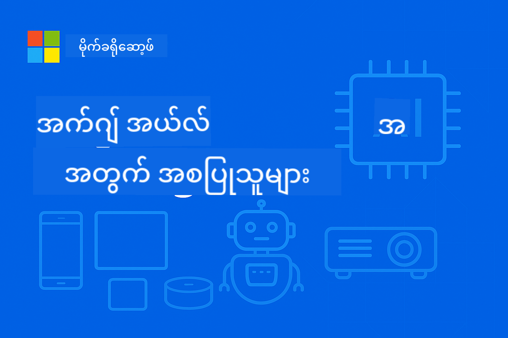

<!--
CO_OP_TRANSLATOR_METADATA:
{
  "original_hash": "22c6dae04591abc5f0d80f944ed663d5",
  "translation_date": "2025-09-26T10:47:23+00:00",
  "source_file": "introduction.md",
  "language_code": "my"
}
-->
# Edge AI အကြောင်းအကျဉ်းချုပ်



**Edge Artificial Intelligence** အကြောင်းကို စတင်လေ့လာဖို့ ကြိုဆိုပါတယ်။ ဒါဟာ AI ရဲ့ အာနိသင်ကို ဒေတာဖန်တီးရာနေရာမှာပဲ သုံးစွဲနိုင်အောင် ပြောင်းလဲပေးတဲ့ နည်းလမ်းတစ်ခုဖြစ်ပါတယ်။ ဒီအကျဉ်းချုပ်မှာ Edge AI ရဲ့ အရေးပါမှုကို နားလည်စေဖို့အခြေခံကို တည်ဆောက်ပေးပြီး၊ Edge AI ကို အကောင်းဆုံးအသုံးချနိုင်ဖို့ နည်းလမ်းများကို လေ့လာနိုင်ပါမယ်။

## Edge AI ဆိုတာဘာလဲ?

Edge AI ဆိုတာ **Cloud-based AI** ကို **Local, On-device Intelligence** အဖြစ် ပြောင်းလဲပေးတဲ့ နည်းလမ်းတစ်ခုဖြစ်ပါတယ်။ ဒေတာကို Cloud server တွေကို ပို့စရာမလိုဘဲ Edge device တွေ – smartphone, IoT sensor, စက်မှုပစ္စည်းများ, autonomous vehicle, embedded system တွေမှာ တိုက်ရိုက် process လုပ်ပေးပါတယ်။

### Edge AI ရဲ့ Paradigm

```
Traditional AI:     Device → Cloud → Processing → Response → Device
Edge AI:           Device → Local Processing → Immediate Response
```

ဒီ paradigm shift က Cloud server ကို သွားလာစရာမလိုအောင် ပြောင်းလဲပေးပြီး:
- **အမြန်ဆုံးတုံ့ပြန်မှု** (sub-millisecond latency)
- **Privacy တိုးတက်မှု** (ဒေတာ device ထဲမှာပဲ ရှိနေ)
- **ယုံကြည်စိတ်ချမှု** (Internet မရှိလည်း အလုပ်လုပ်နိုင်)
- **ကုန်ကျစရိတ်လျော့ချမှု** (Bandwidth နဲ့ Cloud compute usage အနည်းဆုံး)

## Edge AI အရေးပါတဲ့အကြောင်း

### နည်းပညာတိုးတက်မှုရဲ့ Perfect Storm

Edge AI ကို မဖြစ်မနေလိုအပ်အောင် ဖန်တီးပေးတဲ့ နည်းပညာသုံးခု:
1. **Hardware Revolution**: Apple Silicon, Qualcomm Snapdragon, NVIDIA Jetson စတဲ့ chipsets တွေက AI acceleration ကို compact နဲ့ power-efficient package ထဲမှာ ထည့်သွင်းပေး
2. **Model Optimization**: Phi-4, Gemma, Mistral စတဲ့ Small Language Models (SLMs) တွေက performance 80-90% ကို size 10-20% နဲ့ပဲ ရရှိစေ
3. **Real-World Demand**: Industry တွေက Cloud solution မဖြစ်နိုင်တဲ့ instant, private, reliable AI ကို လိုအပ်နေ

### အရေးပါတဲ့ Business Drivers

**Privacy & Compliance**
- Healthcare: Patient data ကို on-premises ထဲမှာပဲ ထားရမယ် (HIPAA compliance)
- Finance: Transaction processing ကို data sovereignty လိုအပ်
- Manufacturing: Proprietary process တွေကို အပြင်မထွက်အောင် ကာကွယ်ရမယ်

**Performance Requirements**
- Autonomous vehicles: မိမိအသက်ကို အရေးပါတဲ့ ဆုံးဖြတ်ချက်တွေ milliseconds အတွင်းမှာ လုပ်ဆောင်ရမယ်
- Industrial automation: Real-time defect detection နဲ့ safety monitoring
- Gaming & AR/VR: Immersive experience တွေ zero perceptible latency လိုအပ်

**Economic Efficiency**
- Telecommunications: IoT sensor reading များစွာကို locally process လုပ်
- Retail: In-store analytics ကို bandwidth အနည်းဆုံးနဲ့
- Smart cities: Distributed intelligence ကို device အများအပြားမှာ

## Edge AI က ပြောင်းလဲပေးတဲ့ Industry တွေ

### 🏭 **စက်မှုလုပ်ငန်း & Industry 4.0**
- **Predictive Maintenance**: စက်မှုပစ္စည်းတွေမှာ AI model တွေက fault တွေကို ကြိုတင်ခန့်မှန်း
- **Quality Control**: Production line တွေမှာ defect detection ကို real-time လုပ်
- **Safety Monitoring**: အန္တရာယ်တွေကို ချက်ချင်း detect နဲ့ response
- **Supply Chain**: Inventory management ကို node တစ်ခုချင်းစီမှာ intelligent ဖြစ်အောင်

**အကျိုးသက်ရောက်မှု**: Siemens က Edge AI ကို အသုံးပြုပြီး downtime ကို 30-50% လျော့ချပြီး maintenance cost ကို 25% လျော့ချနိုင်ပါတယ်။

### 🏥 **ကျန်းမာရေး & ဆေးဘက်ဆိုင်ရာပစ္စည်းများ**
- **Diagnostic Imaging**: X-ray နဲ့ MRI analysis ကို care point မှာ AI-powered
- **Patient Monitoring**: Wearable device တွေက health assessment ကို ဆက်လက်လုပ်ဆောင်
- **Surgical Assistance**: Procedure တွေမှာ real-time guidance
- **Drug Discovery**: Molecular simulation တွေကို local processing

**အကျိုးသက်ရောက်မှု**: Philips ရဲ့ Edge AI solution တွေက radiologist တွေကို 40% ပိုမြန်စွာ diagnosis လုပ်နိုင်အောင် ကူညီပေးပြီး accuracy 99% ထိရှိပါတယ်။

### 🚗 **Autonomous Systems & Transportation**
- **Self-Driving Vehicles**: Navigation နဲ့ safety အတွက် split-second decision making
- **Traffic Management**: Intelligent intersection control နဲ့ flow optimization
- **Fleet Operations**: Route optimization နဲ့ vehicle health monitoring
- **Logistics**: Autonomous warehouse robot နဲ့ delivery system

**အကျိုးသက်ရောက်မှု**: Tesla ရဲ့ Full Self-Driving system က sensor data ကို locally process လုပ်ပြီး second တစ်ခုလျှင် 40+ decision တွေကို လုပ်ဆောင်ပါတယ်။

### 🏙️ **Smart Cities & Infrastructure**
- **Public Safety**: Threat detection နဲ့ emergency response ကို real-time
- **Energy Management**: Smart grid optimization နဲ့ renewable energy integration
- **Environmental Monitoring**: Air quality, noise pollution, climate tracking
- **Urban Planning**: Traffic flow analysis နဲ့ infrastructure optimization

**အကျိုးသက်ရောက်မှု**: Singapore ရဲ့ smart city initiative က Edge AI sensor 100,000+ ကို traffic management အတွက် အသုံးပြုပြီး commute time ကို 25% လျော့ချနိုင်ပါတယ်။

### 📱 **Consumer Technology & Mobile**
- **Smartphone AI**: Enhanced photography, voice assistant, personalization
- **Smart Homes**: Intelligent automation နဲ့ security system
- **Wearable Devices**: Health monitoring နဲ့ fitness optimization
- **Gaming**: Real-time graphics enhancement နဲ့ gameplay optimization

**အကျိုးသက်ရောက်မှု**: Apple ရဲ့ Neural Engine က second တစ်ခုလျှင် 15.8 trillion operation တွေကို locally process လုပ်ပြီး real-time language translation နဲ့ computational photography စတဲ့ feature တွေကို enable လုပ်ပါတယ်။

## Small Language Models: Edge AI ရဲ့ အင်ဂျင်

### Small Language Models (SLMs) ဆိုတာဘာလဲ?

SLMs ဆိုတာ **Large Language Models** တွေကို compress နဲ့ optimize လုပ်ထားတဲ့ version တွေဖြစ်ပြီး edge deployment အတွက် အထူးပြုလုပ်ထားပါတယ်:

- **Phi-4**: 14B parameters, reasoning နဲ့ code generation အတွက် optimize
- **Gemma 2B/7B**: Google ရဲ့ efficient model တွေ diverse NLP task အတွက်
- **Mistral-7B**: High-performance model, commercial-friendly licensing
- **Qwen Series**: Alibaba ရဲ့ multilingual model တွေ mobile deployment အတွက် optimize

### SLM ရဲ့ အားသာချက်

| Capability | Large Language Models | Small Language Models |
|------------|----------------------|----------------------|
| **Size** | 70B-405B parameters | 1B-14B parameters |
| **Memory** | 40-200GB RAM | 2-16GB RAM |
| **Inference Speed** | 2-10 seconds | 50-500ms |
| **Deployment** | High-end servers | Smartphones, embedded devices |
| **Cost** | $1000s/month | One-time hardware cost |
| **Privacy** | Data sent to cloud | Processing stays local |

### Performance Reality Check

SLM တွေက အံ့မခန်းစွမ်းဆောင်ရည်တွေ ရရှိထားပါတယ်:
- GPT-3.5 ရဲ့ performance 90% ကို task အများစုမှာ ရရှိ
- Real-time conversation စွမ်းရည်
- Code generation နဲ့ debugging
- Multilingual translation
- Document analysis နဲ့ summarization

## Learning Objectives

EdgeAI for Beginners course ကို ပြီးမြောက်ပါက သင်ရရှိမယ့်အရာများ:

### 🎯 **အခြေခံသိမှတ်စရာ**
- Edge AI ကို အသုံးပြုရတဲ့ နည်းပညာနဲ့ business driver တွေကို နားလည်
- Edge နဲ့ Cloud AI architecture တွေကို နှိုင်းယှဉ်ပြီး သင့်တော်တဲ့ use case တွေကို ရှာဖွေ
- SLM family တွေရဲ့ အင်္ဂါရပ်နဲ့ စွမ်းရည်တွေကို သုံးသပ်
- Edge AI deployment အတွက် hardware လိုအပ်ချက်တွေကို ချမှတ်

### 🛠️ **နည်းပညာကျွမ်းကျင်မှု**
- SLM တွေကို Windows, mobile, embedded, cloud-edge hybrid platform တွေမှာ deploy လုပ်
- Quantization, pruning, compression နဲ့ model optimization လုပ်
- Monitoring နဲ့ scaling ပါတဲ့ Edge AI application တွေကို production-ready အဖြစ် implement
- Multi-agent system နဲ့ function-calling framework တွေကို complex workflow အတွက် တည်ဆောက်

### 🏗️ **လက်တွေ့အသုံးချမှု**
- Local model switching နဲ့ conversation management ပါတဲ့ chat application တွေ ဖန်တီး
- Local document processing ပါတဲ့ RAG (Retrieval-Augmented Generation) system တွေ တည်ဆောက်
- Specialized AI model တွေကို intelligent select လုပ်တဲ့ model router တွေ ဖန်တီး
- Streaming, health monitoring, error handling ပါတဲ့ API framework တွေ ဒီဇိုင်းဆွဲ

### 🚀 **Production Deployment**
- Model versioning, testing, deployment အတွက် SLMOps pipeline တွေ တည်ဆောက်
- Edge AI application တွေအတွက် security best practice တွေ implement
- Edge နဲ့ Cloud processing ကို balance လုပ်တဲ့ scalable architecture တွေ ဒီဇိုင်းဆွဲ
- Production Edge AI system တွေအတွက် monitoring နဲ့ maintenance strategy တွေ ဖန်တီး

## Learning Outcomes

Course ကို ပြီးမြောက်ပါက သင်ရရှိမယ့်အရာများ:

### **နည်းပညာကျွမ်းကျင်မှု**
✅ **Production-ready Edge AI solution** တွေကို Windows, mobile, embedded platform တွေမှာ deploy လုပ်  
✅ **Edge constraint အတွက် AI model တွေ optimize** လုပ်ပြီး size 75% လျော့ချ၊ performance 85% ထိရရှိ  
✅ **Function calling နဲ့ multi-model orchestration ပါတဲ့ intelligent agent system** တွေ တည်ဆောက်  
✅ **Enterprise application အတွက် scalable edge-cloud hybrid architecture** တွေ ဖန်တီး

### **Industry အသုံးချမှု**
✅ **Predictive maintenance နဲ့ quality control အတွက် စက်မှုလုပ်ငန်း solution** တွေ ဒီဇိုင်းဆွဲ  
✅ **Privacy-compliant patient data processing ပါတဲ့ healthcare application** တွေ ဖန်တီး  
✅ **Real-time decision making နဲ့ safety အတွက် automotive system** တွေ တည်ဆောက်  
✅ **Traffic, safety, environmental monitoring အတွက် smart city infrastructure** တွေ ဖန်တီး

### **အလုပ်အကိုင်တိုးတက်မှု**
✅ **EdgeAI Solutions Architect**: Comprehensive edge AI strategy တွေ ဒီဇိုင်းဆွဲ  
✅ **ML Engineer (Edge Specialization)**: Edge environment အတွက် model တွေ optimize နဲ့ deploy  
✅ **IoT AI Developer**: Local processing ပါတဲ့ intelligent IoT system တွေ ဖန်တီး  
✅ **Mobile AI Developer**: Local inference ပါတဲ့ AI-powered mobile application တွေ တည်ဆောက်

## Course Architecture

ဒီ course က **progressive mastery approach** ကို လိုက်နာပါတယ်:

### **Phase 1: Foundation** (Modules 01-02)
Conceptual understanding တည်ဆောက်ပြီး model family တွေကို explore

### **Phase 2: Implementation** (Modules 03-04) 
Deployment နဲ့ optimization technique တွေ ကျွမ်းကျင်

### **Phase 3: Production** (Modules 05-06)
SLMOps နဲ့ advanced agent framework တွေကို လေ့လာ

### **Phase 4: Specialization** (Modules 07-08)
Platform-specific implementation နဲ့ comprehensive sample တွေ

## Success Metrics

သင့်ရဲ့ progress ကို အောက်ပါအတိုင်း tracking လုပ်ပါ:

- **Portfolio Projects**: Industry အများအပြားကို ဖုံးလွှမ်းတဲ့ production-ready application 10+  
- **Performance Benchmarks**: Edge device တွေမှာ <500ms inference time ရရှိ  
- **Deployment Targets**: Windows, mobile, embedded platform တွေမှာ application တွေ run  
- **Enterprise Readiness**: Monitoring, scaling, security framework ပါတဲ့ solution တွေ

## Getting Started

AI deployment ကို နားလည်မှု ပြောင်းလဲဖို့ အဆင်သင့်ဖြစ်ပါပြီလား? သင့်ရဲ့ Edge AI ခရီးစဉ်ကို **[Module 01: EdgeAI Fundamentals](./Module01/README.md)** မှာ စတင်ပြီး နည်းပညာအခြေခံတွေကို လေ့လာပြီး industry leader တွေရဲ့ real-world case study တွေကို ကြည့်ရှုပါ။

**Next Step**: [📚 Module 01 - EdgeAI Fundamentals →](./Module01/README.md)

---

**AI ရဲ့ အနာဂတ်က local, immediate, private ဖြစ်ပါတယ်။ Edge AI ကို ကျွမ်းကျင်ပြီး နောက်မျိုးဆက် intelligent application တွေကို ဖန်တီးပါ။**

---

