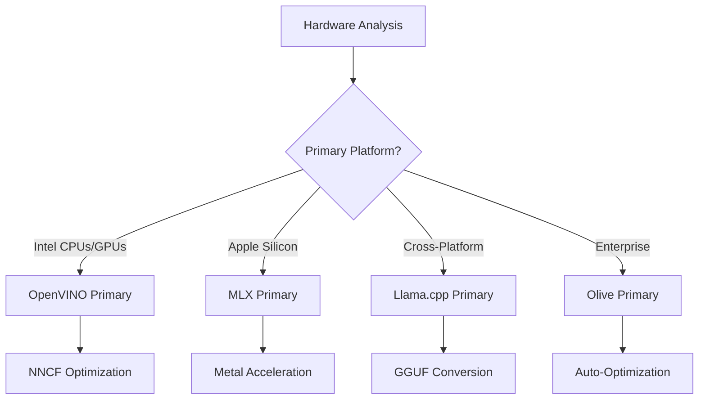
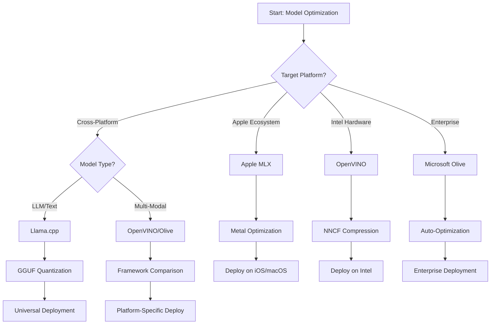

<!--
CO_OP_TRANSLATOR_METADATA:
{
  "original_hash": "6719c4a7e44b948230ac5f5cab3699bd",
  "translation_date": "2025-09-17T21:00:43+00:00",
  "source_file": "Module04/06.workflow-synthesis.md",
  "language_code": "ne"
}
-->
# खण्ड ६: एज एआई विकास कार्यप्रवाह संश्लेषण

## सामग्री सूची
1. [परिचय](../../../Module04)
2. [शिक्षण उद्देश्यहरू](../../../Module04)
3. [एकीकृत कार्यप्रवाह अवलोकन](../../../Module04)
4. [फ्रेमवर्क चयन म्याट्रिक्स](../../../Module04)
5. [सर्वोत्तम अभ्यास संश्लेषण](../../../Module04)
6. [परिनियोजन रणनीति मार्गदर्शिका](../../../Module04)
7. [प्रदर्शन अनुकूलन कार्यप्रवाह](../../../Module04)
8. [उत्पादन तयारी चेकलिस्ट](../../../Module04)
9. [समस्या समाधान र अनुगमन](../../../Module04)
10. [तपाईंको एज एआई पाइपलाइनलाई भविष्यमा सुरक्षित बनाउने](../../../Module04)

## परिचय

एज एआई विकासले विभिन्न अनुकूलन फ्रेमवर्क, परिनियोजन रणनीतिहरू, र हार्डवेयर विचारहरूको गहिरो बुझाइ आवश्यक गर्दछ। यो व्यापक संश्लेषणले Llama.cpp, Microsoft Olive, OpenVINO, र Apple MLX बाट प्राप्त ज्ञानलाई एकीकृत कार्यप्रवाहमा समेट्छ, जसले दक्षता अधिकतम बनाउँछ, गुणस्तर कायम राख्छ, र सफल उत्पादन परिनियोजन सुनिश्चित गर्दछ।

यस पाठक्रमभरि, हामीले व्यक्तिगत अनुकूलन फ्रेमवर्कहरूको अन्वेषण गरेका छौं, जसको आफ्नै विशेष बल र उपयोगका केसहरू छन्। यद्यपि, वास्तविक संसारका एज एआई परियोजनाहरूले प्रायः धेरै फ्रेमवर्कहरूबाट प्रविधिहरू संयोजन गर्न वा विशिष्ट बाधा र आवश्यकताहरूका लागि सबैभन्दा राम्रो परिणाम दिने दृष्टिकोणको बारेमा रणनीतिक निर्णय लिन आवश्यक पर्छ।

यस खण्डले सबै फ्रेमवर्कहरूको सामूहिक ज्ञानलाई कार्यान्वयनयोग्य कार्यप्रवाह, निर्णय वृक्ष, र सर्वोत्तम अभ्यासहरूमा संश्लेषण गर्दछ, जसले तपाईंलाई उत्पादन-तयार एज एआई समाधानहरू कुशलतापूर्वक र प्रभावकारी रूपमा निर्माण गर्न सक्षम बनाउँछ। चाहे तपाईं मोबाइल उपकरणहरू, एम्बेडेड प्रणालीहरू, वा एज सर्भरहरूको लागि अनुकूलन गर्दै हुनुहुन्छ, यो मार्गदर्शिकाले तपाईंको विकास जीवनचक्रभरि सूचित निर्णयहरू लिनको लागि रणनीतिक रूपरेखा प्रदान गर्दछ।

## शिक्षण उद्देश्यहरू

यस खण्डको अन्त्यसम्ममा, तपाईंले निम्न गर्न सक्षम हुनुहुनेछ:

### रणनीतिक निर्णय लिनु
- परियोजनाका आवश्यकताहरू, हार्डवेयर सीमाहरू, र परिनियोजन परिदृश्यहरूको आधारमा **उपयुक्त अनुकूलन फ्रेमवर्कको मूल्याङ्कन र चयन गर्नुहोस्**  
- **धेरै अनुकूलन प्रविधिहरूलाई एकीकृत गर्ने व्यापक कार्यप्रवाहहरू डिजाइन गर्नुहोस्**  
- विभिन्न फ्रेमवर्कहरूमा मोडेल सटीकता, अनुमान गति, मेमोरी प्रयोग, र परिनियोजन जटिलताबीचको **समझदारीपूर्वक सम्झौता गर्नुहोस्**  

### कार्यप्रवाह एकीकरण
- **धेरै अनुकूलन फ्रेमवर्कहरूको बललाई उपयोग गर्ने एकीकृत विकास पाइपलाइनहरू कार्यान्वयन गर्नुहोस्**  
- **विभिन्न वातावरणहरूमा निरन्तर मोडेल अनुकूलन र परिनियोजनका लागि पुनरुत्पादनयोग्य कार्यप्रवाहहरू सिर्जना गर्नुहोस्**  
- **गुणस्तर गेटहरू र प्रमाणीकरण प्रक्रियाहरू स्थापना गर्नुहोस्** ताकि अनुकूलित मोडेलहरूले उत्पादन आवश्यकताहरू पूरा गर्न सकून्  

### प्रदर्शन अनुकूलन
- **मात्रात्मककरण, प्रूनिङ, र हार्डवेयर-विशिष्ट प्रवर्धन प्रविधिहरू प्रयोग गरेर प्रणालीगत अनुकूलन रणनीतिहरू लागू गर्नुहोस्**  
- **विभिन्न अनुकूलन स्तरहरू र परिनियोजन लक्ष्यहरूमा मोडेल प्रदर्शनको अनुगमन र तुलनात्मक अध्ययन गर्नुहोस्**  
- **CPU, GPU, NPU, र विशेष एज प्रवर्धकहरू सहित विशिष्ट हार्डवेयर प्लेटफर्महरूको लागि अनुकूलन गर्नुहोस्**  

### उत्पादन परिनियोजन
- **धेरै मोडेल ढाँचाहरू र अनुमान इन्जिनहरू समायोजन गर्न सक्ने स्केलेबल परिनियोजन आर्किटेक्चरहरू डिजाइन गर्नुहोस्**  
- **उत्पादन वातावरणमा एज एआई अनुप्रयोगहरूको लागि अनुगमन र अवलोकनीयता कार्यान्वयन गर्नुहोस्**  
- **मोडेल अपडेट, प्रदर्शन अनुगमन, र प्रणाली अनुकूलनका लागि मर्मत कार्यप्रवाहहरू स्थापना गर्नुहोस्**  

### क्रस-प्लेटफर्म उत्कृष्टता
- **विविध हार्डवेयर प्लेटफर्महरूमा अनुकूलित मोडेलहरू परिनियोजन गर्नुहोस्, प्रदर्शन निरन्तरता कायम राख्दै**  
- **Windows, macOS, Linux, मोबाइल, र एम्बेडेड प्रणालीहरूको लागि प्लेटफर्म-विशिष्ट अनुकूलनहरू व्यवस्थापन गर्नुहोस्**  
- **विभिन्न एज वातावरणहरूमा सहज परिनियोजन सक्षम गर्न अमूर्त तहहरू सिर्जना गर्नुहोस्**  

## एकीकृत कार्यप्रवाह अवलोकन

### चरण १: आवश्यकताहरू विश्लेषण र फ्रेमवर्क चयन

सफल एज एआई परिनियोजनको आधार भनेको गहिरो आवश्यकताहरू विश्लेषण हो, जसले फ्रेमवर्क चयन र अनुकूलन रणनीतिलाई सूचित गर्दछ।

#### १.१ हार्डवेयर मूल्याङ्कन


**मुख्य विचारहरू:**
- **CPU आर्किटेक्चर**: x86, ARM, Apple Silicon क्षमताहरू  
- **प्रवर्धक उपलब्धता**: GPU, NPU, VPU, विशेष एआई चिप्स  
- **मेमोरी सीमाहरू**: RAM सीमितता, भण्डारण क्षमता  
- **पावर बजेट**: ब्याट्री जीवन, थर्मल सीमाहरू  
- **कनेक्टिविटी**: अफलाइन आवश्यकताहरू, ब्यान्डविथ सीमाहरू  

#### १.२ अनुप्रयोग आवश्यकताहरू म्याट्रिक्स

| आवश्यकताहरू | Llama.cpp | Microsoft Olive | OpenVINO | Apple MLX |
|-------------|-----------|-----------------|----------|-----------|
| क्रस-प्लेटफर्म | ✅ उत्कृष्ट | ⚡ राम्रो | ⚡ राम्रो | ❌ केवल एप्पल |
| उद्यम एकीकरण | ⚡ आधारभूत | ✅ उत्कृष्ट | ✅ उत्कृष्ट | ⚡ सीमित |
| मोबाइल परिनियोजन | ✅ उत्कृष्ट | ⚡ राम्रो | ⚡ राम्रो | ✅ iOS उत्कृष्ट |
| वास्तविक-समय अनुमान | ✅ उत्कृष्ट | ✅ उत्कृष्ट | ✅ उत्कृष्ट | ✅ उत्कृष्ट |
| मोडेल विविधता | ✅ LLM केन्द्रित | ✅ सबै मोडेल | ✅ सबै मोडेल | ✅ LLM केन्द्रित |
| प्रयोगको सजिलो | ✅ सरल | ✅ स्वचालित | ⚡ मध्यम | ✅ सरल |  

### चरण २: मोडेल तयारी र अनुकूलन

#### २.१ सार्वभौमिक मोडेल मूल्याङ्कन पाइपलाइन

```python
# Universal Model Assessment Framework
class EdgeAIModelAssessment:
    def __init__(self, model_path, target_hardware):
        self.model_path = model_path
        self.target_hardware = target_hardware
        self.optimization_frameworks = []
        
    def assess_model_characteristics(self):
        """Analyze model size, architecture, and complexity"""
        return {
            'model_size': self.get_model_size(),
            'parameter_count': self.get_parameter_count(),
            'architecture_type': self.detect_architecture(),
            'quantization_compatibility': self.check_quantization_support()
        }
    
    def recommend_optimization_strategy(self):
        """Recommend optimal frameworks and techniques"""
        characteristics = self.assess_model_characteristics()
        
        if self.target_hardware.startswith('apple'):
            return self.mlx_optimization_strategy(characteristics)
        elif self.target_hardware.startswith('intel'):
            return self.openvino_optimization_strategy(characteristics)
        elif characteristics['model_size'] > 7_000_000_000:  # 7B+ parameters
            return self.enterprise_optimization_strategy(characteristics)
        else:
            return self.lightweight_optimization_strategy(characteristics)
```

#### २.२ बहु-फ्रेमवर्क अनुकूलन पाइपलाइन

**क्रमिक अनुकूलन दृष्टिकोण:**
1. **प्रारम्भिक रूपान्तरण**: मध्यवर्ती ढाँचामा रूपान्तरण गर्नुहोस् (ONNX सम्भव भएमा)  
2. **फ्रेमवर्क-विशिष्ट अनुकूलन**: विशेष प्रविधिहरू लागू गर्नुहोस्  
3. **क्रस-प्रमाणीकरण**: लक्ष्य प्लेटफर्महरूमा प्रदर्शन प्रमाणीकरण गर्नुहोस्  
4. **अन्तिम प्याकेजिङ**: परिनियोजनको लागि तयारी गर्नुहोस्  

```bash
# Multi-Framework Optimization Script
#!/bin/bash

MODEL_NAME="phi-3-mini"
BASE_MODEL="microsoft/Phi-3-mini-4k-instruct"

# Phase 1: ONNX Conversion (Universal)
python convert_to_onnx.py --model $BASE_MODEL --output models/onnx/

# Phase 2: Platform-Specific Optimization
if [[ "$TARGET_PLATFORM" == "intel" ]]; then
    # OpenVINO Optimization
    python optimize_openvino.py --input models/onnx/ --output models/openvino/
elif [[ "$TARGET_PLATFORM" == "apple" ]]; then
    # MLX Optimization
    python optimize_mlx.py --input $BASE_MODEL --output models/mlx/
elif [[ "$TARGET_PLATFORM" == "cross" ]]; then
    # Llama.cpp Optimization
    python convert_to_gguf.py --input models/onnx/ --output models/gguf/
fi

# Phase 3: Validation
python validate_optimization.py --original $BASE_MODEL --optimized models/$TARGET_PLATFORM/
```

### चरण ३: प्रदर्शन प्रमाणीकरण र तुलनात्मक अध्ययन

#### ३.१ व्यापक तुलनात्मक अध्ययन फ्रेमवर्क

```python
class EdgeAIBenchmark:
    def __init__(self, optimized_models):
        self.models = optimized_models
        self.metrics = {
            'inference_time': [],
            'memory_usage': [],
            'accuracy_score': [],
            'throughput': [],
            'energy_consumption': []
        }
    
    def run_comprehensive_benchmark(self):
        """Execute standardized benchmarks across all optimized models"""
        test_inputs = self.generate_test_inputs()
        
        for model_framework, model_path in self.models.items():
            print(f"Benchmarking {model_framework}...")
            
            # Latency Testing
            latency = self.measure_inference_latency(model_path, test_inputs)
            
            # Memory Profiling
            memory = self.profile_memory_usage(model_path)
            
            # Accuracy Validation
            accuracy = self.validate_model_accuracy(model_path, test_inputs)
            
            # Throughput Analysis
            throughput = self.measure_throughput(model_path)
            
            self.record_metrics(model_framework, latency, memory, accuracy, throughput)
    
    def generate_optimization_report(self):
        """Create comprehensive comparison report"""
        report = {
            'recommendations': self.analyze_performance_trade_offs(),
            'deployment_guidance': self.generate_deployment_recommendations(),
            'monitoring_requirements': self.define_monitoring_metrics()
        }
        return report
```

## फ्रेमवर्क चयन म्याट्रिक्स

### फ्रेमवर्क चयनको लागि निर्णय वृक्ष



### व्यापक चयन मापदण्ड

#### १. प्राथमिक उपयोग केस संरेखण

**ठूला भाषा मोडेल (LLMs):**
- **Llama.cpp**: CPU-केंद्रित, क्रस-प्लेटफर्म परिनियोजनका लागि उत्कृष्ट  
- **Apple MLX**: Apple Silicon को लागि उपयुक्त, एकीकृत मेमोरीको साथ  
- **OpenVINO**: Intel हार्डवेयरका लागि उत्कृष्ट, NNCF अनुकूलनको साथ  
- **Microsoft Olive**: स्वचालनसहितको उद्यम कार्यप्रवाहका लागि आदर्श  

**बहु-मोडल मोडेलहरू:**
- **OpenVINO**: दृष्टि, अडियो, र पाठको लागि व्यापक समर्थन  
- **Microsoft Olive**: जटिल पाइपलाइनहरूको लागि उद्यम-ग्रेड अनुकूलन  
- **Llama.cpp**: पाठ-आधारित मोडेलहरूमा सीमित  
- **Apple MLX**: बहु-मोडल अनुप्रयोगहरूको लागि बढ्दो समर्थन  

#### २. हार्डवेयर प्लेटफर्म म्याट्रिक्स

| प्लेटफर्म | प्राथमिक फ्रेमवर्क | द्वितीयक विकल्प | विशेष सुविधाहरू |
|----------|------------------|------------------|---------------------|
| Intel CPU/GPU | OpenVINO | Microsoft Olive | NNCF कम्प्रेसन, Intel अनुकूलन |
| NVIDIA GPU | Microsoft Olive | OpenVINO | CUDA प्रवर्धन, उद्यम सुविधाहरू |
| Apple Silicon | Apple MLX | Llama.cpp | Metal शेडरहरू, एकीकृत मेमोरी |
| ARM मोबाइल | Llama.cpp | OpenVINO | क्रस-प्लेटफर्म, न्यूनतम निर्भरताहरू |
| Edge TPU | OpenVINO | Microsoft Olive | विशेष प्रवर्धक समर्थन |
| एम्बेडेड ARM | Llama.cpp | OpenVINO | न्यूनतम फूटप्रिन्ट, कुशल अनुमान |  

#### ३. विकास कार्यप्रवाह प्राथमिकताहरू

**द्रुत प्रोटोटाइपिङ:**
1. **Llama.cpp**: सबैभन्दा छिटो सेटअप, तत्काल परिणाम  
2. **Apple MLX**: सरल Python API, छिटो पुनरावृत्ति  
3. **Microsoft Olive**: स्वचालित अनुकूलन, न्यूनतम कन्फिगरेसन  
4. **OpenVINO**: थप जटिल सेटअप, व्यापक सुविधाहरू  

**उद्यम उत्पादन:**
1. **Microsoft Olive**: उद्यम सुविधाहरू, Azure एकीकरण  
2. **OpenVINO**: Intel इकोसिस्टम, व्यापक उपकरणहरू  
3. **Apple MLX**: Apple-विशिष्ट उद्यम अनुप्रयोगहरू  
4. **Llama.cpp**: सरल परिनियोजन, सीमित उद्यम सुविधाहरू  
तपाईंको विशेष आवश्यकताहरू पूरा गर्दै लचिलोपन कायम राख्न सक्ने सबैभन्दा राम्रो अनुकूलन रणनीति नै उत्कृष्ट हुन्छ। यो मार्गदर्शनलाई सूचित निर्णयहरू गर्नको लागि रूपरेखा रूपमा प्रयोग गर्नुहोस्, तर सधैं आफ्नो छनोटलाई अनुभवजन्य परीक्षण र वास्तविक-विश्व परिनियोजन अनुभव मार्फत प्रमाणित गर्नुहोस्।

## ➡️ अब के गर्ने

साना भाषा मोडेल जीवनचक्र व्यवस्थापनको सञ्चालन पक्षहरू सिक्न [Module 5: SLMOps and Production Deployment](../Module05/README.md) अन्वेषण गरेर आफ्नो Edge AI यात्रा जारी राख्नुहोस्।

---

**अस्वीकरण**:  
यो दस्तावेज़ AI अनुवाद सेवा [Co-op Translator](https://github.com/Azure/co-op-translator) प्रयोग गरेर अनुवाद गरिएको छ। हामी शुद्धताको लागि प्रयास गर्छौं, तर कृपया ध्यान दिनुहोस् कि स्वचालित अनुवादमा त्रुटिहरू वा अशुद्धताहरू हुन सक्छ। यसको मूल भाषा मा रहेको मूल दस्तावेज़लाई आधिकारिक स्रोत मानिनुपर्छ। महत्वपूर्ण जानकारीको लागि, व्यावसायिक मानव अनुवाद सिफारिस गरिन्छ। यस अनुवादको प्रयोगबाट उत्पन्न हुने कुनै पनि गलतफहमी वा गलत व्याख्याको लागि हामी जिम्मेवार हुने छैनौं।