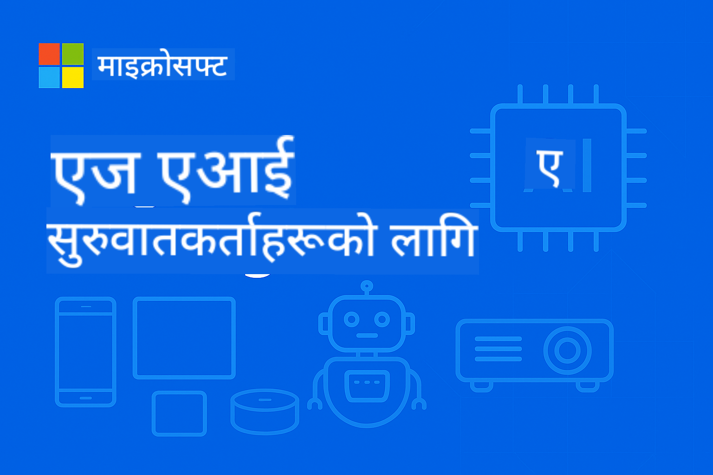

<!--
CO_OP_TRANSLATOR_METADATA:
{
  "original_hash": "3f3219903847ef3849e482fa30a64ad4",
  "translation_date": "2025-09-26T08:24:09+00:00",
  "source_file": "README.md",
  "language_code": "ne"
}
-->
# EdgeAI का लागि शुरुवात 



[](https://GitHub.com/microsoft/edgeai-for-beginners/graphs/contributors)
[](https://GitHub.com/microsoft/edgeai-for-beginners/issues)
[](https://GitHub.com/microsoft/edgeai-for-beginners/pulls)
[](http://makeapullrequest.com)

[](https://GitHub.com/microsoft/edgeai-for-beginners/watchers)
[](https://GitHub.com/microsoft/edgeai-for-beginners/fork)
[](https://GitHub.com/microsoft/edgeai-for-beginners/stargazers)

[](https://discord.com/invite/ByRwuEEgH4)

यी स्रोतहरू प्रयोग गर्न सुरु गर्न निम्न चरणहरू अनुसरण गर्नुहोस्:

1. **रिपोजिटरी फोर्क गर्नुहोस्**: क्लिक गर्नुहोस् [](https://GitHub.com/microsoft/edgeai-for-beginners/fork)
2. **रिपोजिटरी क्लोन गर्नुहोस्**: `git clone https://github.com/microsoft/edgeai-for-beginners.git`
3. [**Azure AI Foundry Discord मा सामेल हुनुहोस् र विशेषज्ञहरू तथा अन्य विकासकर्ताहरूलाई भेट्नुहोस्**](https://discord.com/invite/ByRwuEEgH4)

### 🌐 बहुभाषिक समर्थन

#### GitHub Action मार्फत समर्थित (स्वचालित र सधैं अद्यावधिक)

[Arabic](../ar/README.md) | [Bengali](../bn/README.md) | [Bulgarian](../bg/README.md) | [Burmese (Myanmar)](../my/README.md) | [Chinese (Simplified)](../zh/README.md) | [Chinese (Traditional, Hong Kong)](../hk/README.md) | [Chinese (Traditional, Macau)](../mo/README.md) | [Chinese (Traditional, Taiwan)](../tw/README.md) | [Croatian](../hr/README.md) | [Czech](../cs/README.md) | [Danish](../da/README.md) | [Dutch](../nl/README.md) | [Finnish](../fi/README.md) | [French](../fr/README.md) | [German](../de/README.md) | [Greek](../el/README.md) | [Hebrew](../he/README.md) | [Hindi](../hi/README.md) | [Hungarian](../hu/README.md) | [Indonesian](../id/README.md) | [Italian](../it/README.md) | [Japanese](../ja/README.md) | [Korean](../ko/README.md) | [Malay](../ms/README.md) | [Marathi](../mr/README.md) | [Nepali](./README.md) | [Norwegian](../no/README.md) | [Persian (Farsi)](../fa/README.md) | [Polish](../pl/README.md) | [Portuguese (Brazil)](../br/README.md) | [Portuguese (Portugal)](../pt/README.md) | [Punjabi (Gurmukhi)](../pa/README.md) | [Romanian](../ro/README.md) | [Russian](../ru/README.md) | [Serbian (Cyrillic)](../sr/README.md) | [Slovak](../sk/README.md) | [Slovenian](../sl/README.md) | [Spanish](../es/README.md) | [Swahili](../sw/README.md) | [Swedish](../sv/README.md) | [Tagalog (Filipino)](../tl/README.md) | [Thai](../th/README.md) | [Turkish](../tr/README.md) | [Ukrainian](../uk/README.md) | [Urdu](../ur/README.md) | [Vietnamese](../vi/README.md)

**यदि तपाईं थप भाषाहरूको अनुवाद चाहनुहुन्छ भने यहाँ सूचीबद्ध छन् [यहाँ](https://github.com/Azure/co-op-translator/blob/main/getting_started/supported-languages.md)**

## परिचय

**EdgeAI for Beginners** मा स्वागत छ – Edge Artificial Intelligence को परिवर्तनकारी संसारमा तपाईंको व्यापक यात्रा। यो कोर्सले शक्तिशाली AI क्षमताहरू र वास्तविक संसारमा प्रयोग गर्न सकिने समाधानहरू बीचको दूरीलाई कम गर्दछ, जसले तपाईंलाई डेटा उत्पन्न हुने स्थानमा नै AI को शक्ति प्रयोग गर्न सक्षम बनाउँछ।

### तपाईंले के सिक्नुहुनेछ

यो कोर्सले आधारभूत अवधारणाहरूदेखि उत्पादन-तयार कार्यान्वयनसम्मको यात्रा समेट्छ:
- **साना भाषा मोडेलहरू (SLMs)** जो Edge मा प्रयोगका लागि अनुकूलित छन्
- **हार्डवेयर-आधारित अनुकूलन** विभिन्न प्लेटफर्महरूमा
- **रियल-टाइम इनफरेन्स** गोपनीयता-संरक्षण क्षमतासहित
- **उत्पादन परिनियोजन** उद्यम अनुप्रयोगहरूको लागि रणनीतिहरू

### किन EdgeAI महत्त्वपूर्ण छ

Edge AI ले आधुनिक चुनौतीहरूको समाधान गर्ने नयाँ दृष्टिकोण प्रस्तुत गर्दछ:
- **गोपनीयता र सुरक्षा**: संवेदनशील डेटा स्थानीय रूपमा प्रक्रिया गर्नुहोस्, क्लाउडमा पठाउनु पर्दैन
- **रियल-टाइम प्रदर्शन**: समय-संवेदनशील अनुप्रयोगहरूको लागि नेटवर्क ढिलाइ हटाउनुहोस्
- **खर्च दक्षता**: ब्यान्डविथ र क्लाउड कम्प्युटिङ खर्च घटाउनुहोस्
- **लचिलो सञ्चालन**: नेटवर्क अवरोध हुँदा पनि कार्यक्षमता कायम राख्नुहोस्
- **नियम अनुपालन**: डेटा सार्वभौमिकता आवश्यकताहरू पूरा गर्नुहोस्

### Edge AI

Edge AI भनेको AI एल्गोरिदम र भाषा मोडेलहरू स्थानीय हार्डवेयरमा चलाउनु हो, जहाँ डेटा उत्पन्न हुन्छ, क्लाउड स्रोतहरूमा निर्भर नगरी। यसले ढिलाइ घटाउँछ, गोपनीयता सुधार गर्छ, र वास्तविक समयमा निर्णय लिन सक्षम बनाउँछ।

### मुख्य सिद्धान्तहरू:
- **डिभाइसमा इनफरेन्स**: AI मोडेलहरू Edge उपकरणहरूमा चल्छन् (फोन, राउटर, माइक्रोकन्ट्रोलर, औद्योगिक PCs)
- **अफलाइन क्षमता**: स्थायी इन्टरनेट जडान बिना काम गर्छ
- **कम ढिलाइ**: वास्तविक-समय प्रणालीहरूको लागि तुरुन्त प्रतिक्रिया
- **डेटा सार्वभौमिकता**: संवेदनशील डेटा स्थानीय राख्छ, सुरक्षा र अनुपालन सुधार गर्छ

### साना भाषा मोडेलहरू (SLMs)

Phi-4, Mistral-7B, र Gemma जस्ता SLMs ठूला LLMs का अनुकूलित संस्करणहरू हुन्—जसलाई Edge मा प्रयोगका लागि प्रशिक्षित वा संकुचित गरिएको छ:
- **कम मेमोरी प्रयोग**: सीमित Edge उपकरण मेमोरीको कुशल प्रयोग
- **कम कम्प्युटिङ माग**: CPU र Edge GPU प्रदर्शनका लागि अनुकूलित
- **छिटो सुरु हुने समय**: प्रतिक्रियात्मक अनुप्रयोगहरूको लागि छिटो सुरुवात

यी मोडेलहरूले शक्तिशाली NLP क्षमताहरू अनलक गर्छन् र निम्न सीमाहरू पूरा गर्छन्:
- **एम्बेडेड प्रणालीहरू**: IoT उपकरणहरू र औद्योगिक कन्ट्रोलरहरू
- **मोबाइल उपकरणहरू**: स्मार्टफोन र ट्याब्लेटहरू अफलाइन क्षमतासहित
- **IoT उपकरणहरू**: सीमित स्रोतहरू भएका सेन्सर र स्मार्ट उपकरणहरू
- **Edge सर्भरहरू**: सीमित GPU स्रोतहरू भएका स्थानीय प्रोसेसिङ युनिटहरू
- **पर्सनल कम्प्युटरहरू**: डेस्कटप र ल्यापटप परिनियोजन परिदृश्यहरू

## कोर्स मोड्युलहरू र नेभिगेसन

| मोड्युल | विषय | ध्यान केन्द्रित क्षेत्र | मुख्य सामग्री | स्तर | अवधि |
|--------|-------|------------|-------------|--------|----------|
| [📖 00 ](./introduction.md) | [EdgeAI को परिचय](./introduction.md) | आधारभूत र सन्दर्भ | EdgeAI अवलोकन • उद्योग अनुप्रयोगहरू • SLM परिचय • सिक्ने उद्देश्यहरू | शुरुवात | 1-2 घण्टा |
| [📚 01](../../Module01) | [EdgeAI का आधारभूत तत्वहरू](./Module01/README.md) | क्लाउड बनाम Edge AI तुलना | EdgeAI का आधारभूत तत्वहरू • वास्तविक संसारका केस अध्ययनहरू • कार्यान्वयन मार्गदर्शन • Edge परिनियोजन | शुरुवात | 3-4 घण्टा |
| [🧠 02](../../Module02) | [SLM मोडेलका आधारभूत तत्वहरू](./Module02/README.md) | मोडेल परिवारहरू र वास्तुकला | Phi परिवार • Qwen परिवार • Gemma परिवार • BitNET • μModel • Phi-Silica | शुरुवात | 4-5 घण्टा |
| [🚀 03](../../Module03) | [SLM परिनियोजन अभ्यास](./Module03/README.md) | स्थानीय र क्लाउड परिनियोजन | उन्नत सिकाइ • स्थानीय वातावरण • क्लाउड परिनियोजन | मध्यम | 4-5 घण्टा |
| [⚙️ 04](../../Module04) | [मोडेल अनुकूलन उपकरण](./Module04/README.md) | क्रस-प्लेटफर्म अनुकूलन | परिचय • Llama.cpp • Microsoft Olive • OpenVINO • Apple MLX • कार्यप्रवाह संश्लेषण | मध्यम | 5-6 घण्टा |
| [🔧 05](../../Module05) | [SLMOps उत्पादन](./Module05/README.md) | उत्पादन सञ्चालन | SLMOps परिचय • मोडेल संकुचन • फाइन-ट्युनिङ • उत्पादन परिनियोजन | उन्नत | 5-6 घण्टा |
| [🤖 06](../../Module06) | [AI एजेन्टहरू र फङ्सन कलिङ](./Module06/README.md) | एजेन्ट फ्रेमवर्कहरू र MCP | एजेन्ट परिचय • फङ्सन कलिङ • मोडेल सन्दर्भ प्रोटोकल | उन्नत | 4-5 घण्टा |
| [💻 07](../../Module07) | [प्लेटफर्म कार्यान्वयन](./Module07/README.md) | क्रस-प्लेटफर्म नमूनाहरू | AI उपकरणकिट • Foundry Local • Windows विकास | उन्नत | 3-4 घण्टा |
| [🏭 08](../../Module08) | [Foundry Local उपकरणकिट](./Module08/README.md) | उत्पादन-तयार नमूनाहरू | नमूना अनुप्रयोगहरू (तल विवरण हेर्नुहोस्) | विशेषज्ञ | 8-10 घण्टा |

### 🏭 **मोड्युल 08: नमूना अनुप्रयोगहरू**

- [01: REST Chat Quickstart](./Module08/samples/01/README.md)
- [02: OpenAI SDK Integration](./Module08/samples/02/README.md)
- [03: मोडेल खोज र बेंचमार्किङ](./Module08/samples/03/README.md)
- [04: Chainlit RAG अनुप्रयोग](./Module08/samples/04/README.md)
- [05: बहु-एजेन्ट समन्वय](./Module08/samples/05/README.md)
- [06: मोडेल-को-उपकरण राउटर](./Module08/samples/06/README.md)
- [07: प्रत्यक्ष API क्लाइन्ट](./Module08/samples/07/README.md)
- [08: Windows 11 Chat अनुप्रयोग](./Module08/samples/08/README.md)
- [09: उन्नत बहु-एजेन्ट प्रणाली](./Module08/samples/09/README.md)
- [10: Foundry उपकरण फ्रेमवर्क](./Module08/samples/10/README.md)

### 📊 **सिकाइ मार्ग सारांश**
- **कुल अवधि**: 36-45 घण्टा
- **शुरुवात मार्ग**: मोड्युल 01-02 (7-9 घण्टा)  
- **मध्यम मार्ग**: मोड्युल 03-04 (9-11 घण्टा)
- **उन्नत मार्ग**: मोड्युल 05-07 (12-15 घण्टा)
- **विशेषज्ञ मार्ग**: मोड्युल 08 (8-10 घण्टा)

## तपाईंले के निर्माण गर्नुहुनेछ

### 🎯 मुख्य दक्षताहरू
- **Edge AI वास्तुकला**: स्थानीय-प्रथम AI प्रणालीहरू डिजाइन गर्नुहोस् क्लाउड एकीकरणसहित
- **मोडेल अनुकूलन**: Edge परिनियोजनका लागि मोडेलहरू संकुचित र अनुकूलित गर्नुहोस् (85% गति वृद्धि, 75% आकार घटाउने)
- **बहु-प्लेटफर्म परिनियोजन**: Windows, मोबाइल, एम्बेडेड, र क्लाउड-Edge हाइब्रिड प्रणालीहरू
- **उत्पादन सञ्चालन**: Edge AI लाई उत्पादनमा निगरानी, स्केलिङ, र मर्मत गर्नुहोस्

### 🏗️ व्यावहारिक परियोजनाहरू
- **Foundry Local Chat अनुप्रयोगहरू**: Windows 11 स्थानीय अनुप्रयोग मोडेल स्विचिङसहित
- **बहु-एजेन्ट प्रणालीहरू**: जटिल कार्यप्रवाहहरूको लागि विशेषज्ञ एजेन्टहरूसहित समन्वयक  
- **RAG अनुप्रयोगहरू**: स्थानीय दस्तावेज प्रशोधन भेक्टर खोजसहित
- **मोडेल राउटरहरू**: कार्य विश्लेषणको आधारमा मोडेल चयन गर्ने बुद्धिमान प्रणाली
- **API फ्रेमवर्कहरू**: उत्पादन-तयार क्लाइन्टहरू स्ट्रिमिङ र स्वास्थ्य निगरानीसहित
- **क्रस-प्लेटफर्म उपकरणहरू**: LangChain/Semantic Kernel एकीकरण ढाँचाहरू

### 🏢 उद्योग अनुप्रयोगहरू
**निर्माण** • **स्वास्थ्य सेवा** • **स्वायत्त सवारी साधनहरू** • **स्मार्ट सहरहरू** • **मोबाइल अनुप्रयोगहरू**

## छिटो सुरु

**सिफारिस गरिएको सिकाइ मार्ग** (कुल 20-30 घण्टा):

0. **📖 परिचय** ([Introduction.md](./introduction.md)): EdgeAI को आधारभूत तत्व + उद्योग सन्दर्भ + सिकाइ ढाँचा
1. **📚 आधारभूत तत्वहरू** (मोड्युल 01-02): EdgeAI अवधारणाहरू + SLM मोडेल परिवारहरू
2. **⚙️ अनुकूलन** (मोड्युल 03-04): परिनियोजन + संकुचन उपकरणहरू  
3. **🚀 उत्पादन** (मोड्युल 05-06): SLMOps + AI एजेन्टहरू + फङ्सन कलिङ  
4. **💻 कार्यान्वयन** (मोड्युल 07-08): प्लेटफर्म नमूनाहरू + Foundry Local टूलकिट  

प्रत्येक मोड्युलमा सिद्धान्त, व्यावहारिक अभ्यासहरू, र उत्पादन-तय कोड नमूनाहरू समावेश छन्।  

## करियर प्रभाव  

**प्राविधिक भूमिकाहरू**: EdgeAI समाधान आर्किटेक्ट • ML इन्जिनियर (एज) • IoT AI डेभलपर • मोबाइल AI डेभलपर  

**उद्योग क्षेत्रहरू**: म्यानुफ्याक्चरिङ 4.0 • हेल्थकेयर टेक • स्वायत्त प्रणालीहरू • फिनटेक • उपभोक्ता इलेक्ट्रोनिक्स  

**पोर्टफोलियो परियोजनाहरू**: बहु-एजेन्ट प्रणालीहरू • उत्पादन RAG एप्स • क्रस-प्लेटफर्म परिनियोजन • प्रदर्शन अनुकूलन  

## रिपोजिटरी संरचना  

```
edgeai-for-beginners/
├── 📖 introduction.md  # Foundation: EdgeAI Overview & Learning Framework
├── 📚 Module01-04/     # Fundamentals → SLMs → Deployment → Optimization  
├── 🔧 Module05-06/     # SLMOps → AI Agents → Function Calling
├── 💻 Module07/        # Platform Samples (VS Code, Windows, Jetson, Mobile)
├── 🏭 Module08/        # Foundry Local Toolkit + 10 Comprehensive Samples
│   ├── samples/01-06/  # Foundation: REST, SDK, RAG, Agents, Routing
│   └── samples/07-10/  # Advanced: API Client, Windows App, Enterprise Agents, Tools
├── 🌐 translations/    # Multi-language support (8+ languages)
└── 📋 STUDY_GUIDE.md   # Structured learning paths & time allocation
```
  

## पाठ्यक्रमका मुख्य विशेषताहरू  

✅ **प्रगतिशील सिकाइ**: सिद्धान्त → अभ्यास → उत्पादन परिनियोजन  
✅ **वास्तविक केस अध्ययनहरू**: माइक्रोसफ्ट, जापान एयरलाइन्स, उद्यम कार्यान्वयनहरू  
✅ **व्यावहारिक नमूनाहरू**: ५०+ उदाहरणहरू, १० व्यापक Foundry Local डेमोहरू  
✅ **प्रदर्शन केन्द्रित**: ८५% गति सुधार, ७५% आकार कमी  
✅ **बहु-प्लेटफर्म**: विन्डोज, मोबाइल, एम्बेडेड, क्लाउड-एज हाइब्रिड  
✅ **उत्पादन तयार**: निगरानी, स्केलिङ, सुरक्षा, अनुपालन फ्रेमवर्कहरू  

📖 **[अध्ययन मार्गदर्शक उपलब्ध छ](STUDY_GUIDE.md)**: २०-घण्टाको संरचित सिकाइ मार्ग, समय व्यवस्थापन निर्देशन, र आत्म-मूल्यांकन उपकरणहरू।  

---  

**EdgeAI भविष्यको AI परिनियोजनको प्रतिनिधित्व गर्दछ**: स्थानीय-प्रथम, गोपनीयता-संरक्षण, र कुशल। यी सीपहरू मास्टर गरेर अर्को पुस्ताको बौद्धिक अनुप्रयोगहरू निर्माण गर्नुहोस्।  

## अन्य पाठ्यक्रमहरू  

हाम्रो टोलीले अन्य पाठ्यक्रमहरू उत्पादन गर्दछ! हेर्नुहोस्:  

- [MCP for Beginners](https://github.com/microsoft/mcp-for-beginners)  
- [AI Agents For Beginners](https://github.com/microsoft/ai-agents-for-beginners?WT.mc_id=academic-105485-koreyst)  
- [Generative AI for Beginners using .NET](https://github.com/microsoft/Generative-AI-for-beginners-dotnet?WT.mc_id=academic-105485-koreyst)  
- [Generative AI for Beginners using JavaScript](https://github.com/microsoft/generative-ai-with-javascript?WT.mc_id=academic-105485-koreyst)  
- [Generative AI for Beginners](https://github.com/microsoft/generative-ai-for-beginners?WT.mc_id=academic-105485-koreyst)  
- [ML for Beginners](https://aka.ms/ml-beginners?WT.mc_id=academic-105485-koreyst)  
- [Data Science for Beginners](https://aka.ms/datascience-beginners?WT.mc_id=academic-105485-koreyst)  
- [AI for Beginners](https://aka.ms/ai-beginners?WT.mc_id=academic-105485-koreyst)  
- [Cybersecurity for Beginners](https://github.com/microsoft/Security-101??WT.mc_id=academic-96948-sayoung)  
- [Web Dev for Beginners](https://aka.ms/webdev-beginners?WT.mc_id=academic-105485-koreyst)  
- [IoT for Beginners](https://aka.ms/iot-beginners?WT.mc_id=academic-105485-koreyst)  
- [XR Development for Beginners](https://github.com/microsoft/xr-development-for-beginners?WT.mc_id=academic-105485-koreyst)  
- [Mastering GitHub Copilot for AI Paired Programming](https://aka.ms/GitHubCopilotAI?WT.mc_id=academic-105485-koreyst)  
- [Mastering GitHub Copilot for C#/.NET Developers](https://github.com/microsoft/mastering-github-copilot-for-dotnet-csharp-developers?WT.mc_id=academic-105485-koreyst)  
- [Choose Your Own Copilot Adventure](https://github.com/microsoft/CopilotAdventures?WT.mc_id=academic-105485-koreyst)  

---

