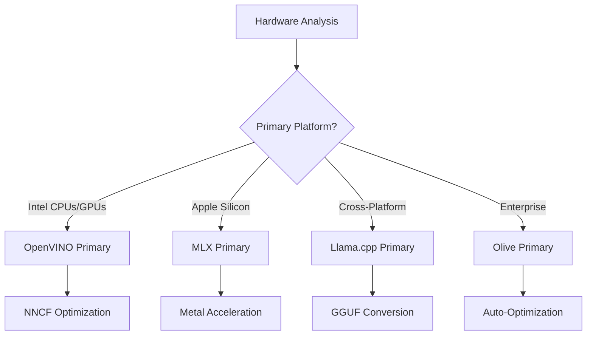
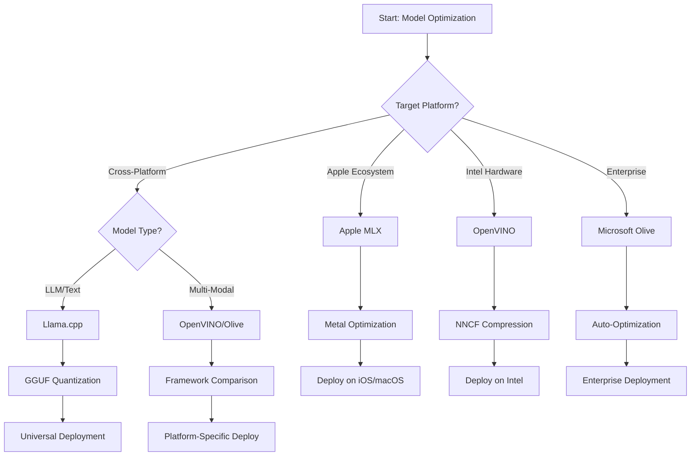
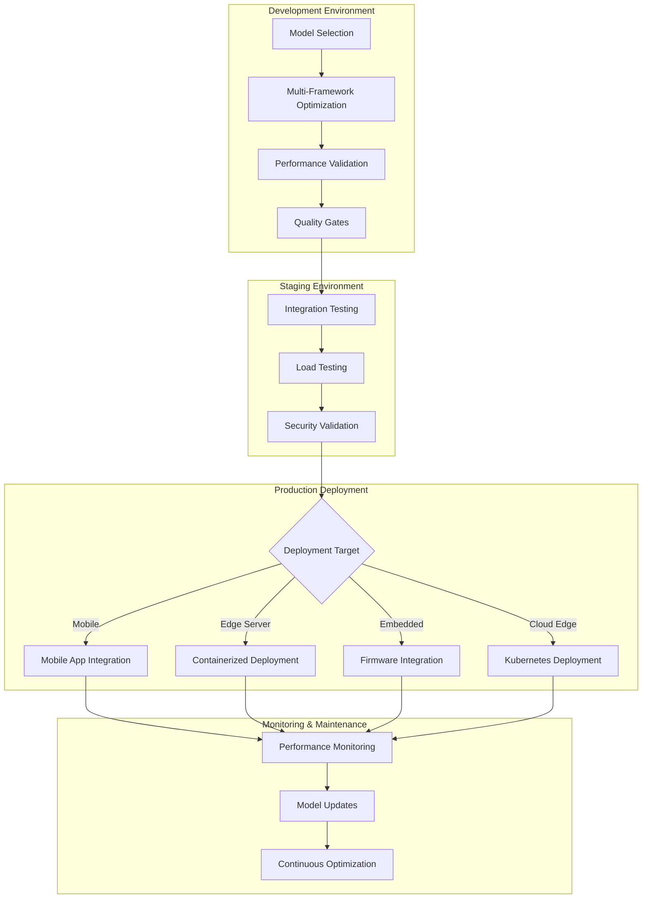

<!--
CO_OP_TRANSLATOR_METADATA:
{
  "original_hash": "6719c4a7e44b948230ac5f5cab3699bd",
  "translation_date": "2025-09-18T12:47:12+00:00",
  "source_file": "Module04/06.workflow-synthesis.md",
  "language_code": "nl"
}
-->
# Sectie 6: Synthese van Edge AI Ontwikkelingsworkflow

## Inhoudsopgave
1. [Introductie](../../../Module04)
2. [Leerdoelen](../../../Module04)
3. [Overzicht van de Gecombineerde Workflow](../../../Module04)
4. [Framework Selectiematrix](../../../Module04)
5. [Synthese van Best Practices](../../../Module04)
6. [Handleiding voor Implementatiestrategieën](../../../Module04)
7. [Workflow voor Prestatieoptimalisatie](../../../Module04)
8. [Checklist voor Productiegereedheid](../../../Module04)
9. [Probleemoplossing en Monitoring](../../../Module04)
10. [Toekomstbestendig maken van je Edge AI Pipeline](../../../Module04)

## Introductie

Edge AI-ontwikkeling vereist een diepgaande kennis van verschillende optimalisatieframeworks, implementatiestrategieën en hardwareoverwegingen. Deze uitgebreide synthese brengt de kennis van Llama.cpp, Microsoft Olive, OpenVINO en Apple MLX samen om een uniforme workflow te creëren die efficiëntie maximaliseert, kwaliteit behoudt en succesvolle productie-implementatie garandeert.

Tijdens deze cursus hebben we individuele optimalisatieframeworks verkend, elk met unieke sterke punten en gespecialiseerde toepassingen. Echter, echte Edge AI-projecten vereisen vaak een combinatie van technieken uit meerdere frameworks of strategische beslissingen over welke aanpak de beste resultaten oplevert binnen specifieke beperkingen en vereisten.

Deze sectie synthetiseert de gezamenlijke kennis van alle frameworks in praktische workflows, beslissingsbomen en best practices die je in staat stellen om productieklare Edge AI-oplossingen efficiënt en effectief te bouwen. Of je nu optimaliseert voor mobiele apparaten, embedded systemen of edge servers, deze gids biedt het strategische kader om weloverwogen beslissingen te nemen gedurende je ontwikkelingscyclus.

## Leerdoelen

Aan het einde van deze sectie kun je:

### Strategische Besluitvorming
- **Evalueren en selecteren** van het optimale optimalisatieframework op basis van projectvereisten, hardwarebeperkingen en implementatiescenario's
- **Ontwerpen van uitgebreide workflows** die meerdere optimalisatietechnieken integreren voor maximale efficiëntie
- **Afwegingen beoordelen** tussen modelnauwkeurigheid, inferentiesnelheid, geheugengebruik en implementatiecomplexiteit over verschillende frameworks

### Workflow Integratie
- **Implementeren van uniforme ontwikkelingspipelines** die de sterke punten van meerdere optimalisatieframeworks benutten
- **Creëren van reproduceerbare workflows** voor consistente modeloptimalisatie en implementatie in verschillende omgevingen
- **Kwaliteitscriteria vaststellen** en validatieprocessen implementeren om ervoor te zorgen dat geoptimaliseerde modellen voldoen aan productievereisten

### Prestatieoptimalisatie
- **Systematische optimalisatiestrategieën toepassen** met behulp van kwantisatie, pruning en hardware-specifieke versnellingstechnieken
- **Monitoren en benchmarken** van modelprestaties op verschillende optimalisatieniveaus en implementatiedoelen
- **Optimaliseren voor specifieke hardwareplatforms** zoals CPU, GPU, NPU en gespecialiseerde edge-versnellers

### Productie-implementatie
- **Ontwerpen van schaalbare implementatiearchitecturen** die meerdere modelformaten en inferentie-engines ondersteunen
- **Monitoring en observatie implementeren** voor Edge AI-toepassingen in productieomgevingen
- **Onderhoudsworkflows opzetten** voor modelupdates, prestatiemonitoring en systeemoptimalisatie

### Cross-Platform Uitmuntendheid
- **Geoptimaliseerde modellen implementeren** op diverse hardwareplatforms met behoud van consistente prestaties
- **Platformspecifieke optimalisaties afhandelen** voor Windows, macOS, Linux, mobiele en embedded systemen
- **Abstractielaag creëren** die naadloze implementatie mogelijk maakt in verschillende edge-omgevingen

## Overzicht van de Gecombineerde Workflow

### Fase 1: Analyse van Vereisten en Framework Selectie

Succesvolle Edge AI-implementatie begint met een grondige analyse van vereisten die de frameworkselectie en optimalisatiestrategie informeert.

#### 1.1 Hardwarebeoordeling


**Belangrijke Overwegingen:**
- **CPU Architectuur**: x86, ARM, Apple Silicon mogelijkheden
- **Beschikbaarheid van Versnellers**: GPU, NPU, VPU, gespecialiseerde AI-chips
- **Geheugenbeperkingen**: RAM-limieten, opslagcapaciteit
- **Energieverbruik**: Batterijduur, thermische beperkingen
- **Connectiviteit**: Offline vereisten, bandbreedtebeperkingen

#### 1.2 Applicatievereistenmatrix

| Vereiste | Llama.cpp | Microsoft Olive | OpenVINO | Apple MLX |
|----------|-----------|-----------------|----------|-----------|
| Cross-platform | ✅ Uitstekend | ⚡ Goed | ⚡ Goed | ❌ Alleen Apple |
| Integratie in bedrijven | ⚡ Basis | ✅ Uitstekend | ✅ Uitstekend | ⚡ Beperkt |
| Mobiele implementatie | ✅ Uitstekend | ⚡ Goed | ⚡ Goed | ✅ iOS Uitstekend |
| Real-time inferentie | ✅ Uitstekend | ✅ Uitstekend | ✅ Uitstekend | ✅ Uitstekend |
| Modeldiversiteit | ✅ LLM Focus | ✅ Alle modellen | ✅ Alle modellen | ✅ LLM Focus |
| Gebruiksvriendelijkheid | ✅ Eenvoudig | ✅ Geautomatiseerd | ⚡ Gemiddeld | ✅ Eenvoudig |

### Fase 2: Modelvoorbereiding en Optimalisatie

#### 2.1 Universele Modelbeoordelingspipeline

```python
# Universal Model Assessment Framework
class EdgeAIModelAssessment:
    def __init__(self, model_path, target_hardware):
        self.model_path = model_path
        self.target_hardware = target_hardware
        self.optimization_frameworks = []
        
    def assess_model_characteristics(self):
        """Analyze model size, architecture, and complexity"""
        return {
            'model_size': self.get_model_size(),
            'parameter_count': self.get_parameter_count(),
            'architecture_type': self.detect_architecture(),
            'quantization_compatibility': self.check_quantization_support()
        }
    
    def recommend_optimization_strategy(self):
        """Recommend optimal frameworks and techniques"""
        characteristics = self.assess_model_characteristics()
        
        if self.target_hardware.startswith('apple'):
            return self.mlx_optimization_strategy(characteristics)
        elif self.target_hardware.startswith('intel'):
            return self.openvino_optimization_strategy(characteristics)
        elif characteristics['model_size'] > 7_000_000_000:  # 7B+ parameters
            return self.enterprise_optimization_strategy(characteristics)
        else:
            return self.lightweight_optimization_strategy(characteristics)
```

#### 2.2 Multi-Framework Optimalisatiepipeline

**Sequentiële Optimalisatieaanpak:**
1. **Initiële Conversie**: Converteren naar een tussenformaat (bij voorkeur ONNX)
2. **Framework-specifieke Optimalisatie**: Toepassen van gespecialiseerde technieken
3. **Cross-validatie**: Prestaties verifiëren op doelplatforms
4. **Eindverpakking**: Klaarmaken voor implementatie

```bash
# Multi-Framework Optimization Script
#!/bin/bash

MODEL_NAME="phi-3-mini"
BASE_MODEL="microsoft/Phi-3-mini-4k-instruct"

# Phase 1: ONNX Conversion (Universal)
python convert_to_onnx.py --model $BASE_MODEL --output models/onnx/

# Phase 2: Platform-Specific Optimization
if [[ "$TARGET_PLATFORM" == "intel" ]]; then
    # OpenVINO Optimization
    python optimize_openvino.py --input models/onnx/ --output models/openvino/
elif [[ "$TARGET_PLATFORM" == "apple" ]]; then
    # MLX Optimization
    python optimize_mlx.py --input $BASE_MODEL --output models/mlx/
elif [[ "$TARGET_PLATFORM" == "cross" ]]; then
    # Llama.cpp Optimization
    python convert_to_gguf.py --input models/onnx/ --output models/gguf/
fi

# Phase 3: Validation
python validate_optimization.py --original $BASE_MODEL --optimized models/$TARGET_PLATFORM/
```

### Fase 3: Prestatievalidatie en Benchmarking

#### 3.1 Uitgebreid Benchmarking Framework

```python
class EdgeAIBenchmark:
    def __init__(self, optimized_models):
        self.models = optimized_models
        self.metrics = {
            'inference_time': [],
            'memory_usage': [],
            'accuracy_score': [],
            'throughput': [],
            'energy_consumption': []
        }
    
    def run_comprehensive_benchmark(self):
        """Execute standardized benchmarks across all optimized models"""
        test_inputs = self.generate_test_inputs()
        
        for model_framework, model_path in self.models.items():
            print(f"Benchmarking {model_framework}...")
            
            # Latency Testing
            latency = self.measure_inference_latency(model_path, test_inputs)
            
            # Memory Profiling
            memory = self.profile_memory_usage(model_path)
            
            # Accuracy Validation
            accuracy = self.validate_model_accuracy(model_path, test_inputs)
            
            # Throughput Analysis
            throughput = self.measure_throughput(model_path)
            
            self.record_metrics(model_framework, latency, memory, accuracy, throughput)
    
    def generate_optimization_report(self):
        """Create comprehensive comparison report"""
        report = {
            'recommendations': self.analyze_performance_trade_offs(),
            'deployment_guidance': self.generate_deployment_recommendations(),
            'monitoring_requirements': self.define_monitoring_metrics()
        }
        return report
```

## Framework Selectiematrix

### Beslissingsboom voor Framework Selectie



### Uitgebreide Selectiecriteria

#### 1. Afstemming op Primaire Toepassing

**Grote Taalmodellen (LLMs):**
- **Llama.cpp**: Beste voor CPU-gebaseerde, cross-platform implementatie
- **Apple MLX**: Optimaal voor Apple Silicon met gedeeld geheugen
- **OpenVINO**: Uitstekend voor Intel-hardware met NNCF-optimalisatie
- **Microsoft Olive**: Ideaal voor bedrijfsworkflows met automatisering

**Multi-Modale Modellen:**
- **OpenVINO**: Uitgebreide ondersteuning voor beeld, audio en tekst
- **Microsoft Olive**: Bedrijfsklare optimalisatie voor complexe pipelines
- **Llama.cpp**: Beperkt tot tekstgebaseerde modellen
- **Apple MLX**: Groeiende ondersteuning voor multimodale toepassingen

#### 2. Hardwareplatformmatrix

| Platform | Primair Framework | Secundaire Optie | Gespecialiseerde Functies |
|----------|------------------|------------------|---------------------------|
| Intel CPU/GPU | OpenVINO | Microsoft Olive | NNCF-compressie, Intel-optimalisatie |
| NVIDIA GPU | Microsoft Olive | OpenVINO | CUDA-versnelling, bedrijfsfuncties |
| Apple Silicon | Apple MLX | Llama.cpp | Metal-shaders, gedeeld geheugen |
| ARM Mobiel | Llama.cpp | OpenVINO | Cross-platform, minimale afhankelijkheden |
| Edge TPU | OpenVINO | Microsoft Olive | Ondersteuning voor gespecialiseerde versnellers |
| Embedded ARM | Llama.cpp | OpenVINO | Kleine footprint, efficiënte inferentie |

#### 3. Voorkeuren voor Ontwikkelingsworkflow

**Snel Prototypen:**
1. **Llama.cpp**: Snelste setup, directe resultaten
2. **Apple MLX**: Eenvoudige Python API, snelle iteratie
3. **Microsoft Olive**: Geautomatiseerde optimalisatie, minimale configuratie
4. **OpenVINO**: Complexere setup, uitgebreide functies

**Bedrijfsproductie:**
1. **Microsoft Olive**: Bedrijfsfuncties, Azure-integratie
2. **OpenVINO**: Intel-ecosysteem, uitgebreide tools
3. **Apple MLX**: Apple-specifieke bedrijfsapplicaties
4. **Llama.cpp**: Eenvoudige implementatie, beperkte bedrijfsfuncties

## Synthese van Best Practices

### Universele Optimalisatieprincipes

#### 1. Progressieve Optimalisatiestrategie

```python
class ProgressiveOptimization:
    def __init__(self, base_model):
        self.base_model = base_model
        self.optimization_stages = [
            'baseline_measurement',
            'format_conversion',
            'quantization_optimization',
            'hardware_acceleration',
            'production_validation'
        ]
    
    def execute_progressive_optimization(self):
        """Apply optimization techniques incrementally"""
        
        # Stage 1: Baseline Measurement
        baseline_metrics = self.measure_baseline_performance()
        
        # Stage 2: Format Conversion
        converted_model = self.convert_to_optimal_format()
        conversion_metrics = self.measure_performance(converted_model)
        
        # Stage 3: Quantization
        quantized_model = self.apply_quantization(converted_model)
        quantization_metrics = self.measure_performance(quantized_model)
        
        # Stage 4: Hardware Acceleration
        accelerated_model = self.enable_hardware_acceleration(quantized_model)
        acceleration_metrics = self.measure_performance(accelerated_model)
        
        # Stage 5: Validation
        production_ready = self.validate_for_production(accelerated_model)
        
        return self.compile_optimization_report(
            baseline_metrics, conversion_metrics, 
            quantization_metrics, acceleration_metrics
        )
```

#### 2. Implementatie van Kwaliteitscriteria

**Criteria voor Behoud van Nauwkeurigheid:**
- Behoud >95% van de oorspronkelijke modelnauwkeurigheid
- Valideren met representatieve testdatasets
- A/B-testen implementeren voor productievalidatie

**Criteria voor Prestatieverbetering:**
- Minimaal 2x snelheidsverbetering behalen
- Geheugenverbruik met minstens 50% verminderen
- Consistentie van inferentietijd valideren

**Criteria voor Productiegereedheid:**
- Belastbaarheidstests onder belasting doorstaan
- Stabiele prestaties over tijd aantonen
- Beveiligings- en privacyvereisten valideren

### Integratie van Framework-specifieke Best Practices

#### 1. Synthese van Kwantisatiestrategieën

```python
# Unified Quantization Approach
class UnifiedQuantizationStrategy:
    def __init__(self, model, target_platform):
        self.model = model
        self.platform = target_platform
        
    def select_optimal_quantization(self):
        """Choose best quantization based on platform and requirements"""
        
        if self.platform == 'apple_silicon':
            return self.mlx_quantization_strategy()
        elif self.platform == 'intel_hardware':
            return self.openvino_quantization_strategy()
        elif self.platform == 'cross_platform':
            return self.llamacpp_quantization_strategy()
        else:
            return self.olive_quantization_strategy()
    
    def mlx_quantization_strategy(self):
        """Apple MLX-specific quantization"""
        return {
            'method': 'mlx_quantize',
            'precision': 'int4',
            'group_size': 64,
            'optimization_target': 'unified_memory'
        }
    
    def openvino_quantization_strategy(self):
        """OpenVINO NNCF quantization"""
        return {
            'method': 'nncf_quantize',
            'precision': 'int8',
            'calibration_method': 'post_training',
            'optimization_target': 'intel_hardware'
        }
```

#### 2. Optimalisatie van Hardwareversnelling

**Synthese van CPU-optimalisatie:**
- **SIMD-instructies**: Geoptimaliseerde kernels benutten over frameworks
- **Geheugenbandbreedte**: Gegevensindelingen optimaliseren voor cache-efficiëntie
- **Threading**: Parallelisme balanceren met resourcebeperkingen

**Best Practices voor GPU-versnelling:**
- **Batchverwerking**: Doorvoer maximaliseren met geschikte batchgroottes
- **Geheugenbeheer**: GPU-geheugenallocatie en -overdrachten optimaliseren
- **Precisie**: FP16 gebruiken waar ondersteund voor betere prestaties

**Optimalisatie voor NPU/gespecialiseerde versnellers:**
- **Modelarchitectuur**: Compatibiliteit met versnellerfuncties garanderen
- **Gegevensstroom**: Input/output-pipelines optimaliseren voor versnellerefficiëntie
- **Fallbackstrategieën**: CPU-fallback implementeren voor niet-ondersteunde operaties

## Handleiding voor Implementatiestrategieën

### Universele Implementatiearchitectuur



### Platformspecifieke Implementatiepatronen

#### 1. Strategie voor Mobiele Implementatie

```yaml
# Mobile Deployment Configuration
mobile_deployment:
  ios:
    framework: apple_mlx
    optimization:
      quantization: int4
      memory_mapping: true
      background_execution: limited
    packaging:
      format: mlx
      bundle_size: <50MB
      
  android:
    framework: llama_cpp
    optimization:
      quantization: q4_k_m
      threading: android_optimized
      memory_management: conservative
    packaging:
      format: gguf
      apk_size: <100MB
      
  cross_platform:
    framework: onnx_runtime
    optimization:
      quantization: int8
      execution_provider: cpu
    packaging:
      format: onnx
      shared_libraries: minimal
```

#### 2. Edge Server Implementatie

```yaml
# Edge Server Deployment Configuration
edge_server:
  intel_based:
    framework: openvino
    optimization:
      quantization: int8
      acceleration: cpu_gpu_auto
      batch_processing: dynamic
    deployment:
      container: openvino_runtime
      orchestration: kubernetes
      scaling: horizontal
      
  nvidia_based:
    framework: microsoft_olive
    optimization:
      quantization: int4
      acceleration: cuda
      tensor_parallelism: true
    deployment:
      container: nvidia_triton
      orchestration: kubernetes
      scaling: gpu_aware
```

### Best Practices voor Containerisatie

```dockerfile
# Multi-Framework Edge AI Container
FROM ubuntu:22.04 as base

# Install common dependencies
RUN apt-get update && apt-get install -y \
    python3 \
    python3-pip \
    build-essential \
    cmake \
    && rm -rf /var/lib/apt/lists/*

# Framework-specific stages
FROM base as openvino
RUN pip install openvino nncf optimum[intel]

FROM base as llamacpp
RUN git clone https://github.com/ggerganov/llama.cpp.git \
    && cd llama.cpp && make LLAMA_OPENBLAS=1

FROM base as olive
RUN pip install olive-ai[auto-opt] onnxruntime-genai

# Production stage with selected framework
FROM openvino as production
COPY models/ /app/models/
COPY src/ /app/src/
WORKDIR /app

EXPOSE 8080
CMD ["python3", "src/inference_server.py"]
```

## Workflow voor Prestatieoptimalisatie

### Systematische Prestatieafstemming

#### 1. Pipeline voor Prestatieprofilering

```python
class EdgeAIPerformanceProfiler:
    def __init__(self, model_path, framework):
        self.model_path = model_path
        self.framework = framework
        self.profiling_results = {}
    
    def comprehensive_profiling(self):
        """Execute comprehensive performance analysis"""
        
        # CPU Profiling
        cpu_profile = self.profile_cpu_usage()
        
        # Memory Profiling
        memory_profile = self.profile_memory_usage()
        
        # Inference Latency
        latency_profile = self.profile_inference_latency()
        
        # Throughput Analysis
        throughput_profile = self.profile_throughput()
        
        # Energy Consumption (where available)
        energy_profile = self.profile_energy_consumption()
        
        return self.compile_performance_report(
            cpu_profile, memory_profile, latency_profile,
            throughput_profile, energy_profile
        )
    
    def identify_bottlenecks(self):
        """Automatically identify performance bottlenecks"""
        bottlenecks = []
        
        if self.profiling_results['cpu_utilization'] > 80:
            bottlenecks.append('cpu_bound')
        
        if self.profiling_results['memory_usage'] > 90:
            bottlenecks.append('memory_bound')
        
        if self.profiling_results['inference_variance'] > 20:
            bottlenecks.append('inconsistent_performance')
        
        return self.generate_optimization_recommendations(bottlenecks)
```

#### 2. Geautomatiseerde Optimalisatiepipeline

```python
class AutomatedOptimizationPipeline:
    def __init__(self, base_model, target_constraints):
        self.base_model = base_model
        self.constraints = target_constraints
        self.optimization_history = []
    
    def execute_optimization_search(self):
        """Systematically search optimization space"""
        
        optimization_candidates = [
            {'quantization': 'int8', 'pruning': 0.1},
            {'quantization': 'int4', 'pruning': 0.2},
            {'quantization': 'int8', 'acceleration': 'gpu'},
            {'quantization': 'int4', 'acceleration': 'npu'}
        ]
        
        best_configuration = None
        best_score = 0
        
        for config in optimization_candidates:
            optimized_model = self.apply_optimization(config)
            score = self.evaluate_optimization(optimized_model)
            
            if score > best_score and self.meets_constraints(optimized_model):
                best_score = score
                best_configuration = config
            
            self.optimization_history.append({
                'config': config,
                'score': score,
                'model': optimized_model
            })
        
        return best_configuration, self.optimization_history
```

### Multi-Objective Optimalisatie

#### 1. Pareto-optimalisatie voor Edge AI

```python
class ParetoOptimization:
    def __init__(self, objectives=['speed', 'accuracy', 'memory']):
        self.objectives = objectives
        self.pareto_frontier = []
    
    def find_pareto_optimal_solutions(self, optimization_results):
        """Identify Pareto-optimal configurations"""
        
        for result in optimization_results:
            is_dominated = False
            
            for frontier_point in self.pareto_frontier:
                if self.dominates(frontier_point, result):
                    is_dominated = True
                    break
            
            if not is_dominated:
                # Remove dominated points from frontier
                self.pareto_frontier = [
                    point for point in self.pareto_frontier 
                    if not self.dominates(result, point)
                ]
                
                self.pareto_frontier.append(result)
        
        return self.pareto_frontier
    
    def recommend_configuration(self, user_preferences):
        """Recommend configuration based on user preferences"""
        
        weighted_scores = []
        for config in self.pareto_frontier:
            score = sum(
                user_preferences[obj] * config['metrics'][obj] 
                for obj in self.objectives
            )
            weighted_scores.append((score, config))
        
        return max(weighted_scores, key=lambda x: x[0])[1]
```

## Checklist voor Productiegereedheid

### Uitgebreide Productievalidatie

#### 1. Kwaliteitsborging van Modellen

```python
class ProductionReadinessValidator:
    def __init__(self, optimized_model, production_requirements):
        self.model = optimized_model
        self.requirements = production_requirements
        self.validation_results = {}
    
    def validate_model_quality(self):
        """Comprehensive model quality validation"""
        
        # Accuracy Validation
        accuracy_result = self.validate_accuracy()
        
        # Performance Validation
        performance_result = self.validate_performance()
        
        # Robustness Testing
        robustness_result = self.validate_robustness()
        
        # Security Assessment
        security_result = self.validate_security()
        
        # Compliance Verification
        compliance_result = self.validate_compliance()
        
        return self.compile_validation_report(
            accuracy_result, performance_result, robustness_result,
            security_result, compliance_result
        )
    
    def generate_certification_report(self):
        """Generate production certification report"""
        return {
            'model_signature': self.generate_model_signature(),
            'validation_timestamp': datetime.now(),
            'validation_results': self.validation_results,
            'deployment_approval': self.check_deployment_approval(),
            'monitoring_requirements': self.define_monitoring_requirements()
        }
```

#### 2. Checklist voor Productie-implementatie

**Validatie vóór Implementatie:**
- [ ] Modelnauwkeurigheid voldoet aan minimumeisen (>95% van baseline)
- [ ] Prestatie-doelen bereikt (latentie, doorvoer, geheugen)
- [ ] Beveiligingskwetsbaarheden beoordeeld en opgelost
- [ ] Belastbaarheidstests voltooid onder verwachte belasting
- [ ] Foutscenario's getest en herstelprocedures gevalideerd
- [ ] Monitoring- en waarschuwingssystemen geconfigureerd
- [ ] Rollbackprocedures getest en gedocumenteerd

**Implementatieproces:**
- [ ] Blue-green implementatiestrategie geïmplementeerd
- [ ] Geleidelijke verkeersverhoging geconfigureerd
- [ ] Real-time monitoringdashboards actief
- [ ] Prestatie-baselines vastgesteld
- [ ] Foutpercentage-drempels gedefinieerd
- [ ] Geautomatiseerde rollbacktriggers geconfigureerd

**Monitoring na Implementatie:**
- [ ] Detectie van modeldrift actief
- [ ] Waarschuwingen voor prestatieverslechtering geconfigureerd
- [ ] Monitoring van resourcegebruik ingeschakeld
- [ ] Gebruikerservaringsstatistieken bijgehouden
- [ ] Modelversiebeheer en herkomst onderhouden
- [ ] Regelmatige modelprestatiebeoordelingen gepland

### Continuous Integration/Continuous Deployment (CI/CD)

```yaml
# Edge AI CI/CD Pipeline Configuration
edge_ai_pipeline:
  stages:
    - model_validation
    - optimization
    - testing
    - staging_deployment
    - production_deployment
    - monitoring
  
  model_validation:
    accuracy_threshold: 0.95
    performance_baseline: required
    security_scan: enabled
    
  optimization:
    frameworks:
      - llama_cpp
      - openvino
      - microsoft_olive
    validation:
      cross_validation: enabled
      performance_comparison: required
      
  testing:
    unit_tests: comprehensive
    integration_tests: full_pipeline
    load_tests: production_scale
    security_tests: comprehensive
    
  deployment:
    strategy: blue_green
    traffic_ramping: gradual
    rollback: automatic
    monitoring: real_time
```

## Probleemoplossing en Monitoring

### Universeel Probleemoplossingskader

#### 1. Veelvoorkomende Problemen en Oplossingen

**Prestatieproblemen:**
```python
class PerformanceTroubleshooter:
    def __init__(self, model_metrics):
        self.metrics = model_metrics
        
    def diagnose_performance_issues(self):
        """Systematic performance issue diagnosis"""
        
        issues = []
        
        # High latency diagnosis
        if self.metrics['avg_latency'] > self.metrics['target_latency']:
            issues.append(self.diagnose_latency_issues())
        
        # Memory usage diagnosis
        if self.metrics['memory_usage'] > self.metrics['memory_limit']:
            issues.append(self.diagnose_memory_issues())
        
        # Throughput diagnosis
        if self.metrics['throughput'] < self.metrics['target_throughput']:
            issues.append(self.diagnose_throughput_issues())
        
        return self.generate_resolution_plan(issues)
    
    def diagnose_latency_issues(self):
        """Specific latency troubleshooting"""
        potential_causes = []
        
        if self.metrics['cpu_utilization'] > 80:
            potential_causes.append('cpu_bottleneck')
        
        if self.metrics['memory_bandwidth'] > 90:
            potential_causes.append('memory_bandwidth_limit')
        
        if self.metrics['model_size'] > self.metrics['optimal_size']:
            potential_causes.append('model_too_large')
        
        return {
            'issue': 'high_latency',
            'causes': potential_causes,
            'solutions': self.generate_latency_solutions(potential_causes)
        }
```

**Framework-specifieke Probleemoplossing:**

| Probleem | Llama.cpp | Microsoft Olive | OpenVINO | Apple MLX |
|----------|-----------|-----------------|----------|-----------|
| Geheugenproblemen | Contextlengte verminderen | Batchgrootte verlagen | Caching inschakelen | Geheugenmapping gebruiken |
| Trage inferentie | SIMD inschakelen | Kwantisatie controleren | Threading optimaliseren | Metal inschakelen |
| Nauwkeurigheidsverlies | Hogere kwantisatie | Hertrainen met QAT | Kalibratie verhogen | Fijn-afstemmen na kwantisatie |
| Compatibiliteit | Modelformaat controleren | Frameworkversie verifiëren | Drivers updaten | macOS-versie controleren |

#### 2. Strategie voor Monitoring in Productie

```python
class EdgeAIMonitoring:
    def __init__(self, deployment_config):
        self.config = deployment_config
        self.metrics_collectors = []
        self.alerting_rules = []
    
    def setup_comprehensive_monitoring(self):
        """Configure comprehensive monitoring for Edge AI deployment"""
        
        # Model Performance Monitoring
        self.setup_model_performance_monitoring()
        
        # Infrastructure Monitoring
        self.setup_infrastructure_monitoring()
        
        # Business Metrics Monitoring
        self.setup_business_metrics_monitoring()
        
        # Security Monitoring
        self.setup_security_monitoring()
    
    def setup_model_performance_monitoring(self):
        """Model-specific performance monitoring"""
        metrics = [
            'inference_latency_p50',
            'inference_latency_p95',
            'inference_latency_p99',
            'model_accuracy_drift',
            'prediction_confidence_distribution',
            'error_rate',
            'throughput_requests_per_second'
        ]
        
        for metric in metrics:
            self.add_metric_collector(metric)
            self.add_alerting_rule(metric)
    
    def detect_model_drift(self):
        """Automated model drift detection"""
        drift_indicators = [
            self.statistical_drift_detection(),
            self.performance_drift_detection(),
            self.data_distribution_shift_detection()
        ]
        
        return self.aggregate_drift_signals(drift_indicators)
```

### Geautomatiseerde Probleemoplossing

```python
class AutomatedIssueResolution:
    def __init__(self, monitoring_system):
        self.monitoring = monitoring_system
        self.resolution_strategies = {}
    
    def handle_performance_degradation(self, alert):
        """Automated performance issue resolution"""
        
        if alert['type'] == 'high_latency':
            return self.resolve_latency_issue(alert)
        elif alert['type'] == 'high_memory_usage':
            return self.resolve_memory_issue(alert)
        elif alert['type'] == 'accuracy_drift':
            return self.resolve_accuracy_issue(alert)
        
    def resolve_latency_issue(self, alert):
        """Automated latency issue resolution"""
        resolution_steps = [
            'increase_cpu_allocation',
            'enable_model_caching',
            'reduce_batch_size',
            'switch_to_quantized_model'
        ]
        
        for step in resolution_steps:
            if self.apply_resolution_step(step):
                return f"Resolved latency issue with: {step}"
        
        return "Escalating to human operator"
```

## Toekomstbestendig maken van je Edge AI Pipeline

### Integratie van Opkomende Technologieën

#### 1. Ondersteuning voor Next-Generation Hardware

```python
class FutureHardwareIntegration:
    def __init__(self):
        self.supported_accelerators = [
            'npu_next_gen',
            'quantum_processors',
            'neuromorphic_chips',
            'optical_processors'
        ]
    
    def design_adaptive_pipeline(self):
        """Create hardware-agnostic optimization pipeline"""
        
        pipeline = {
            'model_preparation': self.universal_model_preparation(),
            'hardware_detection': self.dynamic_hardware_detection(),
            'optimization_selection': self.adaptive_optimization_selection(),
            'performance_validation': self.hardware_agnostic_validation()
        }
        
        return pipeline
    
    def adaptive_optimization_selection(self):
        """Dynamically select optimization based on available hardware"""
        
        def optimize_for_hardware(model, available_hardware):
            if 'npu' in available_hardware:
                return self.npu_optimization(model)
            elif 'quantum' in available_hardware:
                return self.quantum_optimization(model)
            elif 'neuromorphic' in available_hardware:
                return self.neuromorphic_optimization(model)
            else:
                return self.fallback_optimization(model)
        
        return optimize_for_hardware
```

#### 2. Evolutie van Modelarchitectuur

**Ondersteuning voor Opkomende Architecturen:**
- **Mixture of Experts (MoE)**: Spaarzame modelarchitecturen voor efficiëntie
- **Retrieval-Augmented Generation**: Hybride model + kennisbasesystemen
- **Multimodale Modellen**: Integratie van beeld, taal en audio
- **Federated Learning**: Gedistribueerde training en optimalisatie

```python
class NextGenModelSupport:
    def __init__(self):
        self.architecture_handlers = {
            'moe': self.handle_mixture_of_experts,
            'rag': self.handle_retrieval_augmented,
            'multimodal': self.handle_multimodal,
            'federated': self.handle_federated_learning
        }
    
    def handle_mixture_of_experts(self, model):
        """Optimize Mixture of Experts models for edge deployment"""
        optimization_strategy = {
            'expert_pruning': True,
            'routing_optimization': True,
            'expert_quantization': 'per_expert',
            'load_balancing': 'dynamic'
        }
        return self.apply_moe_optimization(model, optimization_strategy)
```

### Continu Leren en Aanpassing

#### 1. Integratie van Online Leren

```python
class EdgeOnlineLearning:
    def __init__(self, base_model, learning_rate=0.001):
        self.base_model = base_model
        self.learning_rate = learning_rate
        self.adaptation_buffer = []
    
    def continuous_adaptation(self, new_data, feedback):
        """Continuously adapt model based on edge data"""
        
        # Privacy-preserving local adaptation
        local_updates = self.compute_local_gradients(new_data, feedback)
        
        # Apply updates with constraints
        adapted_model = self.apply_constrained_updates(
            self.base_model, local_updates
        )
        
        # Validate adaptation quality
        if self.validate_adaptation(adapted_model):
            self.base_model = adapted_model
            return True
        
        return False
    
    def federated_learning_participation(self):
        """Participate in federated learning while preserving privacy"""
        
        # Compute local model updates
        local_updates = self.compute_private_updates()
        
        # Differential privacy protection
        private_updates = self.apply_differential_privacy(local_updates)
        
        # Share with federated learning coordinator
        return self.share_updates(private_updates)
```

#### 2. Duurzaamheid en Green AI

```python
class GreenEdgeAI:
    def __init__(self, sustainability_targets):
        self.targets = sustainability_targets
        self.energy_monitor = EnergyMonitor()
    
    def optimize_for_sustainability(self, model):
        """Optimize model for minimal environmental impact"""
        
        optimization_objectives = [
            'minimize_energy_consumption',
            'maximize_hardware_utilization',
            'reduce_model_training_cost',
            'extend_device_lifetime'
        ]
        
        return self.multi_objective_green_optimization(
            model, optimization_objectives
        )
    
    def carbon_aware_deployment(self):
        """Deploy models considering carbon footprint"""
        
        deployment_strategy = {
            'prefer_renewable_energy_regions': True,
            'optimize_for_energy_efficiency': True,
            'minimize_data_transfer': True,
            'lifecycle_carbon_accounting': True
        }
        
        return deployment_strategy
```

## Conclusie

Deze uitgebreide workflow-synthese vertegenwoordigt de culminatie van Edge AI-optimalisatiekennis, waarbij de beste praktijken van alle grote optimalisatieframeworks worden samengebracht in een uniforme, productieklare aanpak. Door deze richtlijnen te volgen, kun je:

**Optimale Prestaties Bereiken**: Door systematische frameworkselectie, progressieve optimalisatie en uitgebreide validatie, zodat je Edge AI-toepassingen maximale efficiëntie leveren.

**Productiegereedheid Garanderen**: Met grondige tests, monitoring en kwaliteitscriteria die betrouwbare implementatie en werking in echte omgevingen garanderen.

**Langetermijnsucces Behouden**: Door continue monitoring, geautomatiseerde probleemoplossing en aanpassingsstrategieën die je Edge AI-oplossingen performant en relevant houden.

**Je Investering Toekomstbestendig Maken**: Door flexibele, hardware-onafhankelijke pipelines te ontwerpen die kunnen evolueren met opkomende technologieën en vereisten.

Het Edge AI-landschap blijft zich snel ontwikkelen, met nieuwe hardwareplatforms, optimalisatietechnieken en implementatiestrategieën die regelmatig opduiken. Deze synthese biedt de basis om deze complexiteit te navigeren en robuuste, efficiënte en onderhoudbare Edge AI-oplossingen te bouwen die echte waarde leveren in productieomgevingen.
Onthoud dat de beste optimalisatiestrategie degene is die aan jouw specifieke eisen voldoet, terwijl je de flexibiliteit behoudt om je aan te passen naarmate die eisen veranderen. Gebruik deze gids als een kader om weloverwogen beslissingen te nemen, maar valideer je keuzes altijd door middel van empirische tests en ervaring in de praktijk.

## ➡️ Wat is de volgende stap

Zet je Edge AI-reis voort door [Module 5: SLMOps en Productie-implementatie](../Module05/README.md) te verkennen, waar je meer leert over de operationele aspecten van het beheer van de levenscyclus van Small Language Models.

---

**Disclaimer**:  
Dit document is vertaald met behulp van de AI-vertalingsservice [Co-op Translator](https://github.com/Azure/co-op-translator). Hoewel we streven naar nauwkeurigheid, dient u zich ervan bewust te zijn dat geautomatiseerde vertalingen fouten of onnauwkeurigheden kunnen bevatten. Het originele document in zijn oorspronkelijke taal moet worden beschouwd als de gezaghebbende bron. Voor cruciale informatie wordt professionele menselijke vertaling aanbevolen. Wij zijn niet aansprakelijk voor eventuele misverstanden of verkeerde interpretaties die voortvloeien uit het gebruik van deze vertaling.