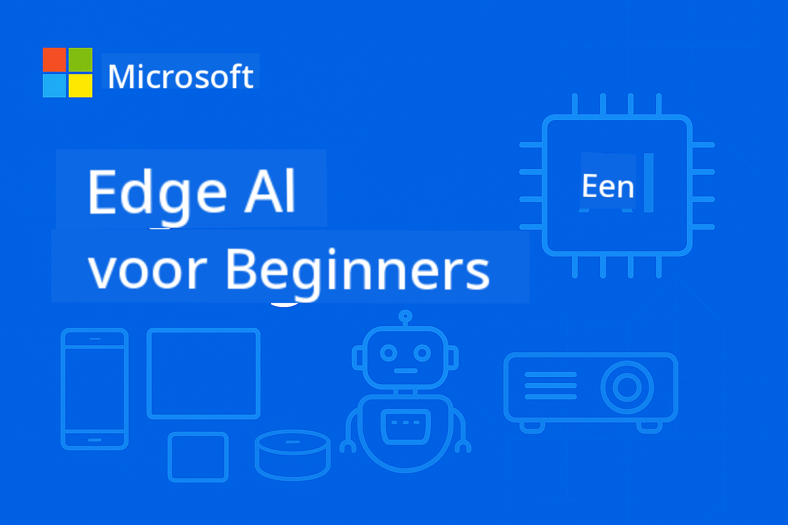

<!--
CO_OP_TRANSLATOR_METADATA:
{
  "original_hash": "8bcf70fe61c9007c880f9753cc9c3e01",
  "translation_date": "2025-10-09T16:25:08+00:00",
  "source_file": "README.md",
  "language_code": "nl"
}
-->
# EdgeAI voor Beginners



[](https://GitHub.com/microsoft/edgeai-for-beginners/graphs/contributors)  
[](https://GitHub.com/microsoft/edgeai-for-beginners/issues)  
[](https://GitHub.com/microsoft/edgeai-for-beginners/pulls)  
[](http://makeapullrequest.com)  

[](https://GitHub.com/microsoft/edgeai-for-beginners/watchers)  
[](https://GitHub.com/microsoft/edgeai-for-beginners/fork)  
[](https://GitHub.com/microsoft/edgeai-for-beginners/stargazers)  

[](https://discord.com/invite/ByRwuEEgH4)

Volg deze stappen om aan de slag te gaan met deze bronnen:

1. **Fork de repository**: Klik [](https://GitHub.com/microsoft/edgeai-for-beginners/fork)  
2. **Clone de repository**: `git clone https://github.com/microsoft/edgeai-for-beginners.git`  
3. [**Word lid van de Azure AI Foundry Discord en ontmoet experts en mede-ontwikkelaars**](https://discord.com/invite/ByRwuEEgH4)

### 🌐 Ondersteuning voor meerdere talen

#### Ondersteund via GitHub Action (Automatisch & Altijd up-to-date)

[Arabisch](../ar/README.md) | [Bengaals](../bn/README.md) | [Bulgaars](../bg/README.md) | [Birmaans (Myanmar)](../my/README.md) | [Chinees (Vereenvoudigd)](../zh/README.md) | [Chinees (Traditioneel, Hong Kong)](../hk/README.md) | [Chinees (Traditioneel, Macau)](../mo/README.md) | [Chinees (Traditioneel, Taiwan)](../tw/README.md) | [Kroatisch](../hr/README.md) | [Tsjechisch](../cs/README.md) | [Deens](../da/README.md) | [Nederlands](./README.md) | [Fins](../fi/README.md) | [Frans](../fr/README.md) | [Duits](../de/README.md) | [Grieks](../el/README.md) | [Hebreeuws](../he/README.md) | [Hindi](../hi/README.md) | [Hongaars](../hu/README.md) | [Indonesisch](../id/README.md) | [Italiaans](../it/README.md) | [Japans](../ja/README.md) | [Koreaans](../ko/README.md) | [Maleis](../ms/README.md) | [Marathi](../mr/README.md) | [Nepalees](../ne/README.md) | [Noors](../no/README.md) | [Perzisch (Farsi)](../fa/README.md) | [Pools](../pl/README.md) | [Portugees (Brazilië)](../br/README.md) | [Portugees (Portugal)](../pt/README.md) | [Punjabi (Gurmukhi)](../pa/README.md) | [Roemeens](../ro/README.md) | [Russisch](../ru/README.md) | [Servisch (Cyrillisch)](../sr/README.md) | [Slowaaks](../sk/README.md) | [Sloveens](../sl/README.md) | [Spaans](../es/README.md) | [Swahili](../sw/README.md) | [Zweeds](../sv/README.md) | [Tagalog (Filipino)](../tl/README.md) | [Thais](../th/README.md) | [Turks](../tr/README.md) | [Oekraïens](../uk/README.md) | [Urdu](../ur/README.md) | [Vietnamees](../vi/README.md)

**Als je wilt dat er extra talen worden ondersteund, kun je de lijst met ondersteunde talen [hier](https://github.com/Azure/co-op-translator/blob/main/getting_started/supported-languages.md) bekijken.**

## Introductie

Welkom bij **EdgeAI voor Beginners** – jouw uitgebreide reis in de wereld van Edge Artificial Intelligence. Deze cursus overbrugt de kloof tussen krachtige AI-mogelijkheden en praktische, real-world implementaties op edge-apparaten, zodat je AI direct kunt benutten waar data wordt gegenereerd en beslissingen moeten worden genomen.

### Wat je zult leren

Deze cursus neemt je mee van fundamentele concepten tot implementaties die klaar zijn voor productie, met onderwerpen zoals:
- **Small Language Models (SLMs)** geoptimaliseerd voor edge-implementatie
- **Hardware-bewuste optimalisatie** voor diverse platforms
- **Realtime inferentie** met privacybeschermende mogelijkheden
- **Productie-implementatiestrategieën** voor zakelijke toepassingen

### Waarom EdgeAI belangrijk is

Edge AI biedt een paradigmaverschuiving die moderne uitdagingen aanpakt:
- **Privacy & Beveiliging**: Verwerk gevoelige data lokaal zonder blootstelling aan de cloud
- **Realtime prestaties**: Verminder netwerkvertragingen voor tijdkritische toepassingen
- **Kostenbesparing**: Verlaag bandbreedte- en cloudcomputingkosten
- **Robuuste werking**: Blijf functioneren tijdens netwerkstoringen
- **Regelgeving naleving**: Voldoe aan eisen voor gegevenssoevereiniteit

### Edge AI

Edge AI verwijst naar het lokaal uitvoeren van AI-algoritmen en taalmodellen op hardware, dicht bij waar data wordt gegenereerd, zonder afhankelijk te zijn van cloudbronnen voor inferentie. Het vermindert latentie, verbetert privacy en maakt realtime besluitvorming mogelijk.

### Kernprincipes:
- **On-device inferentie**: AI-modellen draaien op edge-apparaten (telefoons, routers, microcontrollers, industriële pc's)
- **Offline mogelijkheden**: Functioneert zonder constante internetverbinding
- **Lage latentie**: Directe reacties geschikt voor realtime systemen
- **Gegevenssoevereiniteit**: Houdt gevoelige data lokaal, wat beveiliging en naleving verbetert

### Small Language Models (SLMs)

SLMs zoals Phi-4, Mistral-7B en Gemma zijn geoptimaliseerde versies van grotere LLMs – getraind of gedistilleerd voor:
- **Verminderde geheugengebruik**: Efficiënt gebruik van beperkte edge-apparaatgeheugen
- **Lagere rekenkracht**: Geoptimaliseerd voor CPU- en edge-GPU-prestaties
- **Snellere opstarttijden**: Snelle initialisatie voor responsieve toepassingen

Ze bieden krachtige NLP-mogelijkheden terwijl ze voldoen aan de beperkingen van:
- **Embedded systemen**: IoT-apparaten en industriële controllers
- **Mobiele apparaten**: Smartphones en tablets met offline mogelijkheden
- **IoT-apparaten**: Sensoren en slimme apparaten met beperkte middelen
- **Edge-servers**: Lokale verwerkingsunits met beperkte GPU-middelen
- **Personal computers**: Desktop- en laptopimplementatiescenario's

## Cursusmodules & Navigatie

| Module | Onderwerp | Focusgebied | Belangrijkste inhoud | Niveau | Duur |
|--------|-----------|-------------|-----------------------|--------|------|
| [📖 00 ](./introduction.md) | [Introductie tot EdgeAI](./introduction.md) | Basis & Context | Overzicht EdgeAI • Toepassingen in de industrie • Introductie SLM • Leerdoelen | Beginner | 1-2 uur |
| [📚 01](../../Module01) | [EdgeAI Grondbeginselen](./Module01/README.md) | Vergelijking Cloud vs Edge AI | Grondbeginselen EdgeAI • Praktijkvoorbeelden • Implementatiegids • Edge-implementatie | Beginner | 3-4 uur |
| [🧠 02](../../Module02) | [SLM Model Grondslagen](./Module02/README.md) | Modelfamilies & architectuur | Phi-familie • Qwen-familie • Gemma-familie • BitNET • μModel • Phi-Silica | Beginner | 4-5 uur |
| [🚀 03](../../Module03) | [SLM Implementatiepraktijk](./Module03/README.md) | Lokale & cloud-implementatie | Geavanceerd leren • Lokale omgeving • Cloud-implementatie | Gemiddeld | 4-5 uur |
| [⚙️ 04](../../Module04) | [Model Optimalisatie Toolkit](./Module04/README.md) | Cross-platform optimalisatie | Introductie • Llama.cpp • Microsoft Olive • OpenVINO • Apple MLX • Workflow-synthese | Gemiddeld | 5-6 uur |
| [🔧 05](../../Module05) | [SLMOps Productie](./Module05/README.md) | Productie-operaties | Introductie SLMOps • Modeldistillatie • Fine-tuning • Productie-implementatie | Gevorderd | 5-6 uur |
| [🤖 06](../../Module06) | [AI Agents & Functieaanroepen](./Module06/README.md) | Agent-frameworks & MCP | Introductie Agenten • Functieaanroepen • Model Context Protocol | Gevorderd | 4-5 uur |
| [💻 07](../../Module07) | [Platform Implementatie](./Module07/README.md) | Cross-platform voorbeelden | AI Toolkit • Foundry Local • Windows-ontwikkeling | Gevorderd | 3-4 uur |
| [🏭 08](../../Module08) | [Foundry Local Toolkit](./Module08/README.md) | Productieklaar voorbeelden | Voorbeeldtoepassingen (zie details hieronder) | Expert | 8-10 uur |

### 🏭 **Module 08: Voorbeeldtoepassingen**

- [01: REST Chat Quickstart](./Module08/samples/01/README.md)  
- [02: OpenAI SDK Integratie](./Module08/samples/02/README.md)  
- [03: Modelontdekking & Benchmarking](./Module08/samples/03/README.md)  
- [04: Chainlit RAG-toepassing](./Module08/samples/04/README.md)  
- [05: Multi-Agent Orchestratie](./Module08/samples/05/README.md)  
- [06: Models-as-Tools Router](./Module08/samples/06/README.md)  
- [07: Directe API Client](./Module08/samples/07/README.md)  
- [08: Windows 11 Chat App](./Module08/samples/08/README.md)  
- [09: Geavanceerd Multi-Agent Systeem](./Module08/samples/09/README.md)  
- [10: Foundry Tools Framework](./Module08/samples/10/README.md)  

### 🎓 **Workshop: Praktisch Leerpad**

Uitgebreide hands-on workshopmaterialen met implementaties die klaar zijn voor productie:

- **[Workshopgids](./Workshop/Readme.md)** - Complete leerdoelen, resultaten en bronverwijzingen  
- **Python Voorbeelden** (6 sessies) - Geüpdatet met best practices, foutafhandeling en uitgebreide documentatie  
- **Jupyter Notebooks** (8 interactief) - Stapsgewijze tutorials met benchmarks en prestatiemonitoring  
- **Sessiegidsen** - Gedetailleerde markdown-gidsen voor elke workshopsessie  
- **Validatietools** - Scripts om codekwaliteit te verifiëren en rooktests uit te voeren  

**Wat je zult bouwen:**
- Lokale AI-chattoepassingen met streamingondersteuning  
- RAG-pijplijnen met kwaliteitsbeoordeling (RAGAS)  
- Multi-model benchmarking en vergelijkingstools  
- Multi-agent orchestratiesystemen  
- Intelligente modelroutering met taakgebaseerde selectie  

### 📊 **Samenvatting Leerpad**
- **Totale duur**: 36-45 uur  
- **Beginner Pad**: Modules 01-02 (7-9 uur)  
- **Gemiddeld Pad**: Modules 03-04 (9-11 uur)  
- **Gevorderd Pad**: Modules 05-07 (12-15 uur)  
- **Expert Pad**: Module 08 (8-10 uur)  

## Wat je zult bouwen

### 🎯 Kerncompetenties
- **Edge AI Architectuur**: Ontwerp lokaal-gebaseerde AI-systemen met cloudintegratie  
- **Modeloptimalisatie**: Kwantificeer en comprimeer modellen voor edge-implementatie (85% snelheidsverbetering, 75% groottevermindering)  
- **Multi-platform implementatie**: Windows, mobiel, embedded en cloud-edge hybride systemen  
- **Productie-operaties**: Monitoring, schaalvergroting en onderhoud van edge AI in productie  

### 🏗️ Praktische Projecten
- **Foundry Local Chat Apps**: Windows 11 native applicatie met modelwisseling  
- **Multi-Agent Systemen**: Coördinator met specialistische agenten voor complexe workflows  
- **RAG-toepassingen**: Lokale documentverwerking met vectorzoekopdrachten  
- **Model Routers**: Intelligente selectie tussen modellen op basis van taakanalyse  
- **API Frameworks**: Productieklare clients met streaming en gezondheidsmonitoring  
- **Cross-Platform Tools**: Integratiepatronen voor LangChain/Semantic Kernel  

### 🏢 Toepassingen in de industrie  
**Productie** • **Gezondheidszorg** • **Autonome voertuigen** • **Slimme steden** • **Mobiele apps**  

## Snel starten  

**Aanbevolen leerpad** (20-30 uur totaal):  

0. **📖 Introductie** ([Introduction.md](./introduction.md)): EdgeAI basis + industriecontext + leerframework  
1. **📚 Basis** (Modules 01-02): EdgeAI concepten + SLM modelgroepen  
2. **⚙️ Optimalisatie** (Modules 03-04): Implementatie + kwantisatie frameworks  
3. **🚀 Productie** (Modules 05-06): SLMOps + AI agents + functieaanroepen  
4. **💻 Implementatie** (Modules 07-08): Platformvoorbeelden + Foundry Local toolkit  

Elke module bevat theorie, praktische oefeningen en productieklare codevoorbeelden.  

## Carrière-impact  

**Technische rollen**: EdgeAI Solutions Architect • ML Engineer (Edge) • IoT AI Developer • Mobile AI Developer  

**Industriesectoren**: Productie 4.0 • Gezondheidstechnologie • Autonome systemen • FinTech • Consumentenelektronica  

**Portfolio-projecten**: Multi-agent systemen • Productie RAG apps • Cross-platform implementatie • Prestatieoptimalisatie  

## Repository-structuur  

```
edgeai-for-beginners/
├── 📖 introduction.md  # Foundation: EdgeAI Overview & Learning Framework
├── 📚 Module01-04/     # Fundamentals → SLMs → Deployment → Optimization  
├── 🔧 Module05-06/     # SLMOps → AI Agents → Function Calling
├── 💻 Module07/        # Platform Samples (VS Code, Windows, Jetson, Mobile)
├── 🏭 Module08/        # Foundry Local Toolkit + 10 Comprehensive Samples
│   ├── samples/01-06/  # Foundation: REST, SDK, RAG, Agents, Routing
│   └── samples/07-10/  # Advanced: API Client, Windows App, Enterprise Agents, Tools
├── 🌐 translations/    # Multi-language support (8+ languages)
└── 📋 STUDY_GUIDE.md   # Structured learning paths & time allocation
```
  

## Cursus hoogtepunten  

✅ **Progressief leren**: Theorie → Praktijk → Productie-implementatie  
✅ **Echte casestudies**: Microsoft, Japan Airlines, bedrijfsimplementaties  
✅ **Praktische voorbeelden**: 50+ voorbeelden, 10 uitgebreide Foundry Local demo's  
✅ **Focus op prestaties**: 85% snelheidsverbeteringen, 75% formaatreducties  
✅ **Multi-platform**: Windows, mobiel, embedded, cloud-edge hybride  
✅ **Productieklaar**: Monitoring, schaalbaarheid, beveiliging, compliance frameworks  

📖 **[Studiegids beschikbaar](STUDY_GUIDE.md)**: Gestructureerd 20-uur leerpad met tijdsindeling en zelfevaluatietools.  

---  

**EdgeAI vertegenwoordigt de toekomst van AI-implementatie**: lokaal eerst, privacyvriendelijk en efficiënt. Beheers deze vaardigheden om de volgende generatie intelligente applicaties te bouwen.  

## Andere cursussen  

Ons team biedt ook andere cursussen aan! Bekijk:  

- [MCP voor Beginners](https://github.com/microsoft/mcp-for-beginners)  
- [AI Agents Voor Beginners](https://github.com/microsoft/ai-agents-for-beginners?WT.mc_id=academic-105485-koreyst)  
- [Generatieve AI voor Beginners met .NET](https://github.com/microsoft/Generative-AI-for-beginners-dotnet?WT.mc_id=academic-105485-koreyst)  
- [Generatieve AI voor Beginners met JavaScript](https://github.com/microsoft/generative-ai-with-javascript?WT.mc_id=academic-105485-koreyst)  
- [Generatieve AI voor Beginners](https://github.com/microsoft/generative-ai-for-beginners?WT.mc_id=academic-105485-koreyst)  
- [ML voor Beginners](https://aka.ms/ml-beginners?WT.mc_id=academic-105485-koreyst)  
- [Data Science voor Beginners](https://aka.ms/datascience-beginners?WT.mc_id=academic-105485-koreyst)  
- [AI voor Beginners](https://aka.ms/ai-beginners?WT.mc_id=academic-105485-koreyst)  
- [Cybersecurity voor Beginners](https://github.com/microsoft/Security-101??WT.mc_id=academic-96948-sayoung)  
- [Webontwikkeling voor Beginners](https://aka.ms/webdev-beginners?WT.mc_id=academic-105485-koreyst)  
- [IoT voor Beginners](https://aka.ms/iot-beginners?WT.mc_id=academic-105485-koreyst)  
- [XR Ontwikkeling voor Beginners](https://github.com/microsoft/xr-development-for-beginners?WT.mc_id=academic-105485-koreyst)  
- [GitHub Copilot Meesteren voor AI Pair Programming](https://aka.ms/GitHubCopilotAI?WT.mc_id=academic-105485-koreyst)  
- [GitHub Copilot Meesteren voor C#/.NET Ontwikkelaars](https://github.com/microsoft/mastering-github-copilot-for-dotnet-csharp-developers?WT.mc_id=academic-105485-koreyst)  
- [Kies Je Eigen Copilot Avontuur](https://github.com/microsoft/CopilotAdventures?WT.mc_id=academic-105485-koreyst)  

## Hulp krijgen  

Als je vastloopt of vragen hebt over het bouwen van AI-apps, sluit je aan bij:  

[](https://aka.ms/foundry/discord)  

Als je productfeedback hebt of fouten tegenkomt tijdens het bouwen, bezoek:  

[](https://aka.ms/foundry/forum)  

---

**Disclaimer**:  
Dit document is vertaald met behulp van de AI-vertalingsservice [Co-op Translator](https://github.com/Azure/co-op-translator). Hoewel we streven naar nauwkeurigheid, dient u zich ervan bewust te zijn dat geautomatiseerde vertalingen fouten of onnauwkeurigheden kunnen bevatten. Het originele document in de oorspronkelijke taal moet worden beschouwd als de gezaghebbende bron. Voor cruciale informatie wordt professionele menselijke vertaling aanbevolen. Wij zijn niet aansprakelijk voor misverstanden of verkeerde interpretaties die voortvloeien uit het gebruik van deze vertaling.