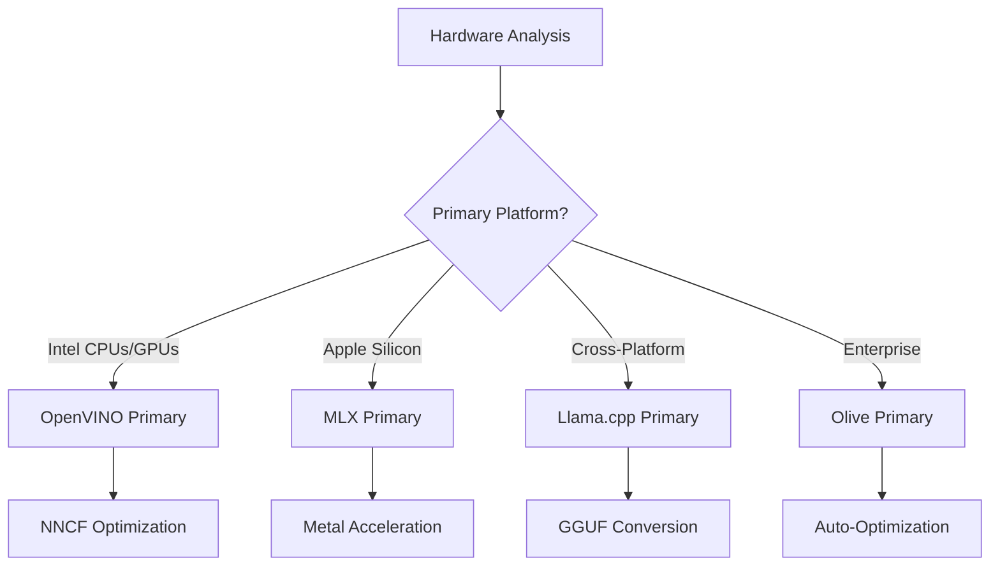
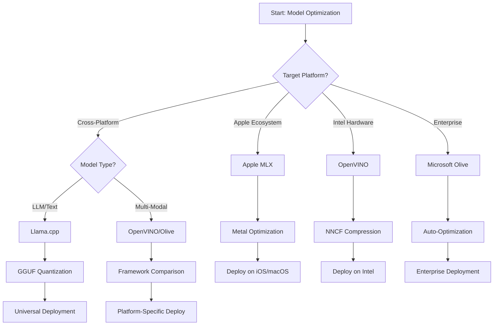
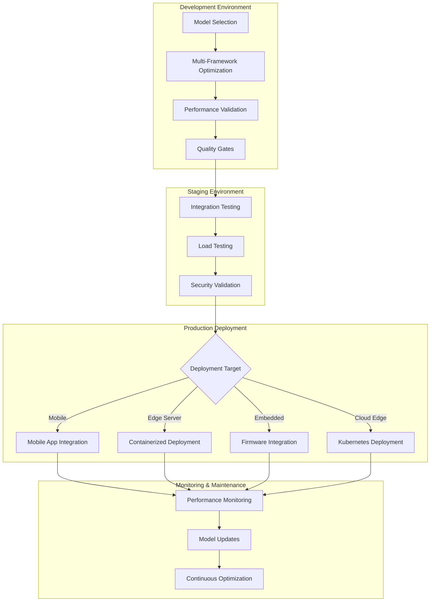

<!--
CO_OP_TRANSLATOR_METADATA:
{
  "original_hash": "6719c4a7e44b948230ac5f5cab3699bd",
  "translation_date": "2025-09-18T10:18:48+00:00",
  "source_file": "Module04/06.workflow-synthesis.md",
  "language_code": "no"
}
-->
# Seksjon 6: Sammensetning av Edge AI Utviklingsarbeidsflyt

## Innholdsfortegnelse
1. [Introduksjon](../../../Module04)
2. [Læringsmål](../../../Module04)
3. [Oversikt over enhetlig arbeidsflyt](../../../Module04)
4. [Rammeverksvalgsmatrise](../../../Module04)
5. [Syntese av beste praksis](../../../Module04)
6. [Veiledning for distribusjonsstrategi](../../../Module04)
7. [Arbeidsflyt for ytelsesoptimalisering](../../../Module04)
8. [Sjekkliste for produksjonsklarhet](../../../Module04)
9. [Feilsøking og overvåking](../../../Module04)
10. [Fremtidssikring av Edge AI-pipeline](../../../Module04)

## Introduksjon

Utvikling av Edge AI krever en sofistikert forståelse av flere optimaliseringsrammeverk, distribusjonsstrategier og maskinvarehensyn. Denne omfattende syntesen samler kunnskapen fra Llama.cpp, Microsoft Olive, OpenVINO og Apple MLX for å skape en enhetlig arbeidsflyt som maksimerer effektivitet, opprettholder kvalitet og sikrer vellykket produksjonsdistribusjon.

Gjennom dette kurset har vi utforsket individuelle optimaliseringsrammeverk, hver med sine unike styrker og spesialiserte bruksområder. Imidlertid krever virkelige Edge AI-prosjekter ofte en kombinasjon av teknikker fra flere rammeverk eller strategiske beslutninger om hvilken tilnærming som gir de beste resultatene for spesifikke begrensninger og krav.

Denne seksjonen syntetiserer den samlede kunnskapen fra alle rammeverk til handlingsrettede arbeidsflyter, beslutningstrær og beste praksis som gjør det mulig å bygge produksjonsklare Edge AI-løsninger effektivt og målrettet. Enten du optimaliserer for mobile enheter, innebygde systemer eller edge-servere, gir denne veiledningen det strategiske rammeverket for å ta informerte beslutninger gjennom hele utviklingssyklusen.

## Læringsmål

Ved slutten av denne seksjonen vil du kunne:

### Strategisk beslutningstaking
- **Evaluere og velge** det optimale optimaliseringsrammeverket basert på prosjektkrav, maskinvarebegrensninger og distribusjonsscenarier
- **Designe omfattende arbeidsflyter** som integrerer flere optimaliseringsteknikker for maksimal effektivitet
- **Vurdere avveininger** mellom modellnøyaktighet, inferenshastighet, minnebruk og distribusjonskompleksitet på tvers av ulike rammeverk

### Arbeidsflytintegrasjon
- **Implementere enhetlige utviklingspipelines** som utnytter styrkene til flere optimaliseringsrammeverk
- **Skape reproduserbare arbeidsflyter** for konsistent modelloptimalisering og distribusjon på tvers av ulike miljøer
- **Etablere kvalitetsporter** og valideringsprosesser for å sikre at optimaliserte modeller oppfyller produksjonskrav

### Ytelsesoptimalisering
- **Bruke systematiske optimaliseringsstrategier** som kvantisering, beskjæring og maskinvare-spesifikke akselerasjonsteknikker
- **Overvåke og benchmarke** modellytelse på tvers av ulike optimaliseringsnivåer og distribusjonsmål
- **Optimalisere for spesifikke maskinvareplattformer** inkludert CPU, GPU, NPU og spesialiserte edge-akseleratorer

### Produksjonsdistribusjon
- **Designe skalerbare distribusjonsarkitekturer** som kan håndtere flere modellformater og inferensmotorer
- **Implementere overvåking og observabilitet** for Edge AI-applikasjoner i produksjonsmiljøer
- **Etablere vedlikeholdsarbeidsflyter** for modelloppdateringer, ytelsesovervåking og systemoptimalisering

### Plattformuavhengig ekspertise
- **Distribuere optimaliserte modeller** på tvers av ulike maskinvareplattformer samtidig som konsistent ytelse opprettholdes
- **Håndtere plattformspesifikke optimaliseringer** for Windows, macOS, Linux, mobile og innebygde systemer
- **Skape abstraksjonslag** som muliggjør sømløs distribusjon på tvers av ulike edge-miljøer

## Oversikt over enhetlig arbeidsflyt

### Fase 1: Kravsanalyse og rammeverksvalg

Grunnlaget for vellykket Edge AI-distribusjon starter med grundig kravsanalyse som informerer rammeverksvalg og optimaliseringsstrategi.

#### 1.1 Maskinvarevurdering


**Viktige hensyn:**
- **CPU-arkitektur**: x86, ARM, Apple Silicon-egenskaper
- **Akselerator tilgjengelighet**: GPU, NPU, VPU, spesialiserte AI-brikker
- **Minnebegrensninger**: RAM-begrensninger, lagringskapasitet
- **Strømbudsjett**: Batterilevetid, termiske begrensninger
- **Tilkobling**: Offline-krav, båndbreddebegrensninger

#### 1.2 Matrise for applikasjonskrav

| Krav | Llama.cpp | Microsoft Olive | OpenVINO | Apple MLX |
|------|-----------|-----------------|----------|-----------|
| Plattformuavhengig | ✅ Utmerket | ⚡ Bra | ⚡ Bra | ❌ Kun Apple |
| Bedriftsintegrasjon | ⚡ Grunnleggende | ✅ Utmerket | ✅ Utmerket | ⚡ Begrenset |
| Mobil distribusjon | ✅ Utmerket | ⚡ Bra | ⚡ Bra | ✅ iOS Utmerket |
| Sanntidsinferens | ✅ Utmerket | ✅ Utmerket | ✅ Utmerket | ✅ Utmerket |
| Modellmangfold | ✅ Fokus på LLM | ✅ Alle modeller | ✅ Alle modeller | ✅ Fokus på LLM |
| Brukervennlighet | ✅ Enkel | ✅ Automatisert | ⚡ Moderat | ✅ Enkel |

### Fase 2: Modellforberedelse og optimalisering

#### 2.1 Universell modellvurderingspipeline

```python
# Universal Model Assessment Framework
class EdgeAIModelAssessment:
    def __init__(self, model_path, target_hardware):
        self.model_path = model_path
        self.target_hardware = target_hardware
        self.optimization_frameworks = []
        
    def assess_model_characteristics(self):
        """Analyze model size, architecture, and complexity"""
        return {
            'model_size': self.get_model_size(),
            'parameter_count': self.get_parameter_count(),
            'architecture_type': self.detect_architecture(),
            'quantization_compatibility': self.check_quantization_support()
        }
    
    def recommend_optimization_strategy(self):
        """Recommend optimal frameworks and techniques"""
        characteristics = self.assess_model_characteristics()
        
        if self.target_hardware.startswith('apple'):
            return self.mlx_optimization_strategy(characteristics)
        elif self.target_hardware.startswith('intel'):
            return self.openvino_optimization_strategy(characteristics)
        elif characteristics['model_size'] > 7_000_000_000:  # 7B+ parameters
            return self.enterprise_optimization_strategy(characteristics)
        else:
            return self.lightweight_optimization_strategy(characteristics)
```

#### 2.2 Multi-rammeverks optimaliseringspipeline

**Sekvensiell optimaliseringstilnærming:**
1. **Innledende konvertering**: Konverter til mellomformat (ONNX når mulig)
2. **Rammeverk-spesifikk optimalisering**: Bruk spesialiserte teknikker
3. **Tverrvalidering**: Verifiser ytelse på tvers av målplattformer
4. **Endelig pakking**: Klargjør for distribusjon

```bash
# Multi-Framework Optimization Script
#!/bin/bash

MODEL_NAME="phi-3-mini"
BASE_MODEL="microsoft/Phi-3-mini-4k-instruct"

# Phase 1: ONNX Conversion (Universal)
python convert_to_onnx.py --model $BASE_MODEL --output models/onnx/

# Phase 2: Platform-Specific Optimization
if [[ "$TARGET_PLATFORM" == "intel" ]]; then
    # OpenVINO Optimization
    python optimize_openvino.py --input models/onnx/ --output models/openvino/
elif [[ "$TARGET_PLATFORM" == "apple" ]]; then
    # MLX Optimization
    python optimize_mlx.py --input $BASE_MODEL --output models/mlx/
elif [[ "$TARGET_PLATFORM" == "cross" ]]; then
    # Llama.cpp Optimization
    python convert_to_gguf.py --input models/onnx/ --output models/gguf/
fi

# Phase 3: Validation
python validate_optimization.py --original $BASE_MODEL --optimized models/$TARGET_PLATFORM/
```

### Fase 3: Ytelsesvalidering og benchmarking

#### 3.1 Omfattende benchmarkingsrammeverk

```python
class EdgeAIBenchmark:
    def __init__(self, optimized_models):
        self.models = optimized_models
        self.metrics = {
            'inference_time': [],
            'memory_usage': [],
            'accuracy_score': [],
            'throughput': [],
            'energy_consumption': []
        }
    
    def run_comprehensive_benchmark(self):
        """Execute standardized benchmarks across all optimized models"""
        test_inputs = self.generate_test_inputs()
        
        for model_framework, model_path in self.models.items():
            print(f"Benchmarking {model_framework}...")
            
            # Latency Testing
            latency = self.measure_inference_latency(model_path, test_inputs)
            
            # Memory Profiling
            memory = self.profile_memory_usage(model_path)
            
            # Accuracy Validation
            accuracy = self.validate_model_accuracy(model_path, test_inputs)
            
            # Throughput Analysis
            throughput = self.measure_throughput(model_path)
            
            self.record_metrics(model_framework, latency, memory, accuracy, throughput)
    
    def generate_optimization_report(self):
        """Create comprehensive comparison report"""
        report = {
            'recommendations': self.analyze_performance_trade_offs(),
            'deployment_guidance': self.generate_deployment_recommendations(),
            'monitoring_requirements': self.define_monitoring_metrics()
        }
        return report
```

## Rammeverksvalgsmatrise

### Beslutningstre for rammeverksvalg



### Omfattende utvalgskriterier

#### 1. Primær bruksområde

**Store språkmodeller (LLMs):**
- **Llama.cpp**: Best for CPU-fokusert, plattformuavhengig distribusjon
- **Apple MLX**: Optimalt for Apple Silicon med enhetlig minne
- **OpenVINO**: Utmerket for Intel-maskinvare med NNCF-optimalisering
- **Microsoft Olive**: Ideelt for bedriftsarbeidsflyter med automatisering

**Multimodale modeller:**
- **OpenVINO**: Omfattende støtte for visjon, lyd og tekst
- **Microsoft Olive**: Bedriftsgrad optimalisering for komplekse pipelines
- **Llama.cpp**: Begrenset til tekstbaserte modeller
- **Apple MLX**: Økende støtte for multimodale applikasjoner

#### 2. Maskinvareplattformmatrise

| Plattform | Primært rammeverk | Sekundært alternativ | Spesialiserte funksjoner |
|-----------|-------------------|----------------------|--------------------------|
| Intel CPU/GPU | OpenVINO | Microsoft Olive | NNCF-kompresjon, Intel-optimalisering |
| NVIDIA GPU | Microsoft Olive | OpenVINO | CUDA-akselerasjon, bedriftsfunksjoner |
| Apple Silicon | Apple MLX | Llama.cpp | Metal-shaders, enhetlig minne |
| ARM Mobil | Llama.cpp | OpenVINO | Plattformuavhengig, minimale avhengigheter |
| Edge TPU | OpenVINO | Microsoft Olive | Spesialisert akseleratorstøtte |
| Innebygd ARM | Llama.cpp | OpenVINO | Minimal fotavtrykk, effektiv inferens |

#### 3. Utviklingsarbeidsflytpreferanser

**Rask prototyping:**
1. **Llama.cpp**: Raskest oppsett, umiddelbare resultater
2. **Apple MLX**: Enkel Python-API, rask iterasjon
3. **Microsoft Olive**: Automatisert optimalisering, minimal konfigurasjon
4. **OpenVINO**: Mer kompleks oppsett, omfattende funksjoner

**Bedriftsproduksjon:**
1. **Microsoft Olive**: Bedriftsfunksjoner, Azure-integrasjon
2. **OpenVINO**: Intel-økosystem, omfattende verktøy
3. **Apple MLX**: Apple-spesifikke bedriftsapplikasjoner
4. **Llama.cpp**: Enkel distribusjon, begrensede bedriftsfunksjoner

## Syntese av beste praksis

### Universelle optimaliseringsprinsipper

#### 1. Progressiv optimaliseringsstrategi

```python
class ProgressiveOptimization:
    def __init__(self, base_model):
        self.base_model = base_model
        self.optimization_stages = [
            'baseline_measurement',
            'format_conversion',
            'quantization_optimization',
            'hardware_acceleration',
            'production_validation'
        ]
    
    def execute_progressive_optimization(self):
        """Apply optimization techniques incrementally"""
        
        # Stage 1: Baseline Measurement
        baseline_metrics = self.measure_baseline_performance()
        
        # Stage 2: Format Conversion
        converted_model = self.convert_to_optimal_format()
        conversion_metrics = self.measure_performance(converted_model)
        
        # Stage 3: Quantization
        quantized_model = self.apply_quantization(converted_model)
        quantization_metrics = self.measure_performance(quantized_model)
        
        # Stage 4: Hardware Acceleration
        accelerated_model = self.enable_hardware_acceleration(quantized_model)
        acceleration_metrics = self.measure_performance(accelerated_model)
        
        # Stage 5: Validation
        production_ready = self.validate_for_production(accelerated_model)
        
        return self.compile_optimization_report(
            baseline_metrics, conversion_metrics, 
            quantization_metrics, acceleration_metrics
        )
```

#### 2. Implementering av kvalitetsporter

**Nøyaktighetsbevaringsporter:**
- Oppretthold >95% av original modellnøyaktighet
- Valider mot representative testdatasett
- Implementer A/B-testing for produksjonsvalidering

**Ytelsesforbedringsporter:**
- Oppnå minimum 2x hastighetsforbedring
- Reduser minnebruk med minst 50%
- Valider konsistens i inferenstid

**Produksjonsklarhetsporter:**
- Bestå stresstesting under belastning
- Demonstrer stabil ytelse over tid
- Valider sikkerhets- og personvernkrav

### Rammeverk-spesifikk integrasjon av beste praksis

#### 1. Kvantiseringsstrategi-syntese

```python
# Unified Quantization Approach
class UnifiedQuantizationStrategy:
    def __init__(self, model, target_platform):
        self.model = model
        self.platform = target_platform
        
    def select_optimal_quantization(self):
        """Choose best quantization based on platform and requirements"""
        
        if self.platform == 'apple_silicon':
            return self.mlx_quantization_strategy()
        elif self.platform == 'intel_hardware':
            return self.openvino_quantization_strategy()
        elif self.platform == 'cross_platform':
            return self.llamacpp_quantization_strategy()
        else:
            return self.olive_quantization_strategy()
    
    def mlx_quantization_strategy(self):
        """Apple MLX-specific quantization"""
        return {
            'method': 'mlx_quantize',
            'precision': 'int4',
            'group_size': 64,
            'optimization_target': 'unified_memory'
        }
    
    def openvino_quantization_strategy(self):
        """OpenVINO NNCF quantization"""
        return {
            'method': 'nncf_quantize',
            'precision': 'int8',
            'calibration_method': 'post_training',
            'optimization_target': 'intel_hardware'
        }
```

#### 2. Optimalisering for maskinvareakselerasjon

**CPU-optimalisering syntese:**
- **SIMD-instruksjoner**: Utnytt optimaliserte kjerner på tvers av rammeverk
- **Minnebåndbredde**: Optimaliser datalayouts for cache-effektivitet
- **Tråding**: Balanser parallellisme med ressursbegrensninger

**GPU-akselerasjon beste praksis:**
- **Batch-prosessering**: Maksimer gjennomstrømning med passende batch-størrelser
- **Minnehåndtering**: Optimaliser GPU-minneallokering og overføringer
- **Presisjon**: Bruk FP16 når støttet for bedre ytelse

**NPU/spesialisert akseleratoroptimalisering:**
- **Modellarkitektur**: Sikre kompatibilitet med akseleratorens egenskaper
- **Dataflyt**: Optimaliser input/output-pipelines for akseleratoreffektivitet
- **Fallback-strategier**: Implementer CPU-fallback for ikke-støttede operasjoner

## Veiledning for distribusjonsstrategi

### Universell distribusjonsarkitektur



### Plattformspesifikke distribusjonsmønstre

#### 1. Mobil distribusjonsstrategi

```yaml
# Mobile Deployment Configuration
mobile_deployment:
  ios:
    framework: apple_mlx
    optimization:
      quantization: int4
      memory_mapping: true
      background_execution: limited
    packaging:
      format: mlx
      bundle_size: <50MB
      
  android:
    framework: llama_cpp
    optimization:
      quantization: q4_k_m
      threading: android_optimized
      memory_management: conservative
    packaging:
      format: gguf
      apk_size: <100MB
      
  cross_platform:
    framework: onnx_runtime
    optimization:
      quantization: int8
      execution_provider: cpu
    packaging:
      format: onnx
      shared_libraries: minimal
```

#### 2. Edge-server distribusjon

```yaml
# Edge Server Deployment Configuration
edge_server:
  intel_based:
    framework: openvino
    optimization:
      quantization: int8
      acceleration: cpu_gpu_auto
      batch_processing: dynamic
    deployment:
      container: openvino_runtime
      orchestration: kubernetes
      scaling: horizontal
      
  nvidia_based:
    framework: microsoft_olive
    optimization:
      quantization: int4
      acceleration: cuda
      tensor_parallelism: true
    deployment:
      container: nvidia_triton
      orchestration: kubernetes
      scaling: gpu_aware
```

### Beste praksis for containerisering

```dockerfile
# Multi-Framework Edge AI Container
FROM ubuntu:22.04 as base

# Install common dependencies
RUN apt-get update && apt-get install -y \
    python3 \
    python3-pip \
    build-essential \
    cmake \
    && rm -rf /var/lib/apt/lists/*

# Framework-specific stages
FROM base as openvino
RUN pip install openvino nncf optimum[intel]

FROM base as llamacpp
RUN git clone https://github.com/ggerganov/llama.cpp.git \
    && cd llama.cpp && make LLAMA_OPENBLAS=1

FROM base as olive
RUN pip install olive-ai[auto-opt] onnxruntime-genai

# Production stage with selected framework
FROM openvino as production
COPY models/ /app/models/
COPY src/ /app/src/
WORKDIR /app

EXPOSE 8080
CMD ["python3", "src/inference_server.py"]
```

## Arbeidsflyt for ytelsesoptimalisering

### Systematisk ytelsestuning

#### 1. Ytelsesprofileringspipeline

```python
class EdgeAIPerformanceProfiler:
    def __init__(self, model_path, framework):
        self.model_path = model_path
        self.framework = framework
        self.profiling_results = {}
    
    def comprehensive_profiling(self):
        """Execute comprehensive performance analysis"""
        
        # CPU Profiling
        cpu_profile = self.profile_cpu_usage()
        
        # Memory Profiling
        memory_profile = self.profile_memory_usage()
        
        # Inference Latency
        latency_profile = self.profile_inference_latency()
        
        # Throughput Analysis
        throughput_profile = self.profile_throughput()
        
        # Energy Consumption (where available)
        energy_profile = self.profile_energy_consumption()
        
        return self.compile_performance_report(
            cpu_profile, memory_profile, latency_profile,
            throughput_profile, energy_profile
        )
    
    def identify_bottlenecks(self):
        """Automatically identify performance bottlenecks"""
        bottlenecks = []
        
        if self.profiling_results['cpu_utilization'] > 80:
            bottlenecks.append('cpu_bound')
        
        if self.profiling_results['memory_usage'] > 90:
            bottlenecks.append('memory_bound')
        
        if self.profiling_results['inference_variance'] > 20:
            bottlenecks.append('inconsistent_performance')
        
        return self.generate_optimization_recommendations(bottlenecks)
```

#### 2. Automatisert optimaliseringspipeline

```python
class AutomatedOptimizationPipeline:
    def __init__(self, base_model, target_constraints):
        self.base_model = base_model
        self.constraints = target_constraints
        self.optimization_history = []
    
    def execute_optimization_search(self):
        """Systematically search optimization space"""
        
        optimization_candidates = [
            {'quantization': 'int8', 'pruning': 0.1},
            {'quantization': 'int4', 'pruning': 0.2},
            {'quantization': 'int8', 'acceleration': 'gpu'},
            {'quantization': 'int4', 'acceleration': 'npu'}
        ]
        
        best_configuration = None
        best_score = 0
        
        for config in optimization_candidates:
            optimized_model = self.apply_optimization(config)
            score = self.evaluate_optimization(optimized_model)
            
            if score > best_score and self.meets_constraints(optimized_model):
                best_score = score
                best_configuration = config
            
            self.optimization_history.append({
                'config': config,
                'score': score,
                'model': optimized_model
            })
        
        return best_configuration, self.optimization_history
```

### Multi-mål optimalisering

#### 1. Pareto-optimalisering for Edge AI

```python
class ParetoOptimization:
    def __init__(self, objectives=['speed', 'accuracy', 'memory']):
        self.objectives = objectives
        self.pareto_frontier = []
    
    def find_pareto_optimal_solutions(self, optimization_results):
        """Identify Pareto-optimal configurations"""
        
        for result in optimization_results:
            is_dominated = False
            
            for frontier_point in self.pareto_frontier:
                if self.dominates(frontier_point, result):
                    is_dominated = True
                    break
            
            if not is_dominated:
                # Remove dominated points from frontier
                self.pareto_frontier = [
                    point for point in self.pareto_frontier 
                    if not self.dominates(result, point)
                ]
                
                self.pareto_frontier.append(result)
        
        return self.pareto_frontier
    
    def recommend_configuration(self, user_preferences):
        """Recommend configuration based on user preferences"""
        
        weighted_scores = []
        for config in self.pareto_frontier:
            score = sum(
                user_preferences[obj] * config['metrics'][obj] 
                for obj in self.objectives
            )
            weighted_scores.append((score, config))
        
        return max(weighted_scores, key=lambda x: x[0])[1]
```

## Sjekkliste for produksjonsklarhet

### Omfattende produksjonsvalidering

#### 1. Modellkvalitetssikring

```python
class ProductionReadinessValidator:
    def __init__(self, optimized_model, production_requirements):
        self.model = optimized_model
        self.requirements = production_requirements
        self.validation_results = {}
    
    def validate_model_quality(self):
        """Comprehensive model quality validation"""
        
        # Accuracy Validation
        accuracy_result = self.validate_accuracy()
        
        # Performance Validation
        performance_result = self.validate_performance()
        
        # Robustness Testing
        robustness_result = self.validate_robustness()
        
        # Security Assessment
        security_result = self.validate_security()
        
        # Compliance Verification
        compliance_result = self.validate_compliance()
        
        return self.compile_validation_report(
            accuracy_result, performance_result, robustness_result,
            security_result, compliance_result
        )
    
    def generate_certification_report(self):
        """Generate production certification report"""
        return {
            'model_signature': self.generate_model_signature(),
            'validation_timestamp': datetime.now(),
            'validation_results': self.validation_results,
            'deployment_approval': self.check_deployment_approval(),
            'monitoring_requirements': self.define_monitoring_requirements()
        }
```

#### 2. Sjekkliste for produksjonsdistribusjon

**Validering før distribusjon:**
- [ ] Modellnøyaktighet oppfyller minimumskrav (>95% av baseline)
- [ ] Ytelsesmål oppnådd (latens, gjennomstrømning, minne)
- [ ] Sikkerhetsproblemer vurdert og mitigert
- [ ] Stresstesting fullført under forventet belastning
- [ ] Feilscenarier testet og gjenopprettingsprosedyrer validert
- [ ] Overvåkings- og varslingssystemer konfigurert
- [ ] Tilbakerullingsprosedyrer testet og dokumentert

**Distribusjonsprosess:**
- [ ] Blå-grønn distribusjonsstrategi implementert
- [ ] Gradvis trafikkøkning konfigurert
- [ ] Sanntidsovervåkingsdashbord aktivert
- [ ] Ytelsesbaser etablert
- [ ] Feilrateterskler definert
- [ ] Automatiserte tilbakerullingstriggere konfigurert

**Overvåking etter distribusjon:**
- [ ] Modelldrift-deteksjon aktiv
- [ ] Ytelsesforringelsesvarsler konfigurert
- [ ] Ressursutnyttelsesovervåking aktivert
- [ ] Brukeropplevelsesmetrikker sporet
- [ ] Modellversjonering og opprinnelse opprettholdt
- [ ] Regelmessige modellytelsesgjennomganger planlagt

### Kontinuerlig integrasjon/kontinuerlig distribusjon (CI/CD)

```yaml
# Edge AI CI/CD Pipeline Configuration
edge_ai_pipeline:
  stages:
    - model_validation
    - optimization
    - testing
    - staging_deployment
    - production_deployment
    - monitoring
  
  model_validation:
    accuracy_threshold: 0.95
    performance_baseline: required
    security_scan: enabled
    
  optimization:
    frameworks:
      - llama_cpp
      - openvino
      - microsoft_olive
    validation:
      cross_validation: enabled
      performance_comparison: required
      
  testing:
    unit_tests: comprehensive
    integration_tests: full_pipeline
    load_tests: production_scale
    security_tests: comprehensive
    
  deployment:
    strategy: blue_green
    traffic_ramping: gradual
    rollback: automatic
    monitoring: real_time
```

## Feilsøking og overvåking

### Universelt feilsøkingsrammeverk

#### 1. Vanlige problemer og løsninger

**Ytelsesproblemer:**
```python
class PerformanceTroubleshooter:
    def __init__(self, model_metrics):
        self.metrics = model_metrics
        
    def diagnose_performance_issues(self):
        """Systematic performance issue diagnosis"""
        
        issues = []
        
        # High latency diagnosis
        if self.metrics['avg_latency'] > self.metrics['target_latency']:
            issues.append(self.diagnose_latency_issues())
        
        # Memory usage diagnosis
        if self.metrics['memory_usage'] > self.metrics['memory_limit']:
            issues.append(self.diagnose_memory_issues())
        
        # Throughput diagnosis
        if self.metrics['throughput'] < self.metrics['target_throughput']:
            issues.append(self.diagnose_throughput_issues())
        
        return self.generate_resolution_plan(issues)
    
    def diagnose_latency_issues(self):
        """Specific latency troubleshooting"""
        potential_causes = []
        
        if self.metrics['cpu_utilization'] > 80:
            potential_causes.append('cpu_bottleneck')
        
        if self.metrics['memory_bandwidth'] > 90:
            potential_causes.append('memory_bandwidth_limit')
        
        if self.metrics['model_size'] > self.metrics['optimal_size']:
            potential_causes.append('model_too_large')
        
        return {
            'issue': 'high_latency',
            'causes': potential_causes,
            'solutions': self.generate_latency_solutions(potential_causes)
        }
```

**Rammeverk-spesifikk feilsøking:**

| Problem | Llama.cpp | Microsoft Olive | OpenVINO | Apple MLX |
|---------|-----------|-----------------|----------|-----------|
| Minneproblemer | Reduser kontekstlengde | Senk batch-størrelse | Aktiver caching | Bruk minnekartlegging |
| Langsom inferens | Aktiver SIMD | Sjekk kvantisering | Optimaliser tråding | Aktiver Metal |
| Nøyaktighetstap | Høyere kvantisering | Tren med QAT | Øk kalibrering | Finjuster etter kvantisering |
| Kompatibilitet | Sjekk modellformat | Verifiser rammeverksversjon | Oppdater drivere | Sjekk macOS-versjon |

#### 2. Produksjonsovervåkingsstrategi

```python
class EdgeAIMonitoring:
    def __init__(self, deployment_config):
        self.config = deployment_config
        self.metrics_collectors = []
        self.alerting_rules = []
    
    def setup_comprehensive_monitoring(self):
        """Configure comprehensive monitoring for Edge AI deployment"""
        
        # Model Performance Monitoring
        self.setup_model_performance_monitoring()
        
        # Infrastructure Monitoring
        self.setup_infrastructure_monitoring()
        
        # Business Metrics Monitoring
        self.setup_business_metrics_monitoring()
        
        # Security Monitoring
        self.setup_security_monitoring()
    
    def setup_model_performance_monitoring(self):
        """Model-specific performance monitoring"""
        metrics = [
            'inference_latency_p50',
            'inference_latency_p95',
            'inference_latency_p99',
            'model_accuracy_drift',
            'prediction_confidence_distribution',
            'error_rate',
            'throughput_requests_per_second'
        ]
        
        for metric in metrics:
            self.add_metric_collector(metric)
            self.add_alerting_rule(metric)
    
    def detect_model_drift(self):
        """Automated model drift detection"""
        drift_indicators = [
            self.statistical_drift_detection(),
            self.performance_drift_detection(),
            self.data_distribution_shift_detection()
        ]
        
        return self.aggregate_drift_signals(drift_indicators)
```

### Automatisert problemløsning

```python
class AutomatedIssueResolution:
    def __init__(self, monitoring_system):
        self.monitoring = monitoring_system
        self.resolution_strategies = {}
    
    def handle_performance_degradation(self, alert):
        """Automated performance issue resolution"""
        
        if alert['type'] == 'high_latency':
            return self.resolve_latency_issue(alert)
        elif alert['type'] == 'high_memory_usage':
            return self.resolve_memory_issue(alert)
        elif alert['type'] == 'accuracy_drift':
            return self.resolve_accuracy_issue(alert)
        
    def resolve_latency_issue(self, alert):
        """Automated latency issue resolution"""
        resolution_steps = [
            'increase_cpu_allocation',
            'enable_model_caching',
            'reduce_batch_size',
            'switch_to_quantized_model'
        ]
        
        for step in resolution_steps:
            if self.apply_resolution_step(step):
                return f"Resolved latency issue with: {step}"
        
        return "Escalating to human operator"
```

## Fremtidssikring av Edge AI-pipeline

### Integrasjon av fremvoksende teknologier

#### 1. Støtte for neste generasjons maskinvare

```python
class FutureHardwareIntegration:
    def __init__(self):
        self.supported_accelerators = [
            'npu_next_gen',
            'quantum_processors',
            'neuromorphic_chips',
            'optical_processors'
        ]
    
    def design_adaptive_pipeline(self):
        """Create hardware-agnostic optimization pipeline"""
        
        pipeline = {
            'model_preparation': self.universal_model_preparation(),
            'hardware_detection': self.dynamic_hardware_detection(),
            'optimization_selection': self.adaptive_optimization_selection(),
            'performance_validation': self.hardware_agnostic_validation()
        }
        
        return pipeline
    
    def adaptive_optimization_selection(self):
        """Dynamically select optimization based on available hardware"""
        
        def optimize_for_hardware(model, available_hardware):
            if 'npu' in available_hardware:
                return self.npu_optimization(model)
            elif 'quantum' in available_hardware:
                return self.quantum_optimization(model)
            elif 'neuromorphic' in available_hardware:
                return self.neuromorphic_optimization(model)
            else:
                return self.fallback_optimization(model)
        
        return optimize_for_hardware
```

#### 2. Modellarkitekturutvikling

**Støtte for fremvoksende arkitekturer:**
- **Mixture of Experts (MoE)**: Sparse modellarkitekturer for effektivitet
- **Retrieval-Augmented Generation**: Hybrid modell + kunnskapsbase-systemer
- **Multimodale modeller**: Integrasjon av visjon + språk + lyd
- **Federated Learning**: Distribuert trening og optimalisering

```python
class NextGenModelSupport:
    def __init__(self):
        self.architecture_handlers = {
            'moe': self.handle_mixture_of_experts,
            'rag': self.handle_retrieval_augmented,
            'multimodal': self.handle_multimodal,
            'federated': self.handle_federated_learning
        }
    
    def handle_mixture_of_experts(self, model):
        """Optimize Mixture of Experts models for edge deployment"""
        optimization_strategy = {
            'expert_pruning': True,
            'routing_optimization': True,
            'expert_quantization': 'per_expert',
            'load_balancing': 'dynamic'
        }
        return self.apply_moe_optimization(model, optimization_strategy)
```

### Kontinuerlig læring og tilpasning

#### 1. Integrasjon av online læring

```python
class EdgeOnlineLearning:
    def __init__(self, base_model, learning_rate=0.001):
        self.base_model = base_model
        self.learning_rate = learning_rate
        self.adaptation_buffer = []
    
    def continuous_adaptation(self, new_data, feedback):
        """Continuously adapt model based on edge data"""
        
        # Privacy-preserving local adaptation
        local_updates = self.compute_local_gradients(new_data, feedback)
        
        # Apply updates with constraints
        adapted_model = self.apply_constrained_updates(
            self.base_model, local_updates
        )
        
        # Validate adaptation quality
        if self.validate_adaptation(adapted_model):
            self.base_model = adapted_model
            return True
        
        return False
    
    def federated_learning_participation(self):
        """Participate in federated learning while preserving privacy"""
        
        # Compute local model updates
        local_updates = self.compute_private_updates()
        
        # Differential privacy protection
        private_updates = self.apply_differential_privacy(local_updates)
        
        # Share with federated learning coordinator
        return self.share_updates(private_updates)
```

#### 2. Bærekraft og grønn AI

```python
class GreenEdgeAI:
    def __init__(self, sustainability_targets):
        self.targets = sustainability_targets
        self.energy_monitor = EnergyMonitor()
    
    def optimize_for_sustainability(self, model):
        """Optimize model for minimal environmental impact"""
        
        optimization_objectives = [
            'minimize_energy_consumption',
            'maximize_hardware_utilization',
            'reduce_model_training_cost',
            'extend_device_lifetime'
        ]
        
        return self.multi_objective_green_optimization(
            model, optimization_objectives
        )
    
    def carbon_aware_deployment(self):
        """Deploy models considering carbon footprint"""
        
        deployment_strategy = {
            'prefer_renewable_energy_regions': True,
            'optimize_for_energy_efficiency': True,
            'minimize_data_transfer': True,
            'lifecycle_carbon_accounting': True
        }
        
        return deployment_strategy
```

## Konklusjon

Denne omfattende arbeidsflytsyntesen representerer kulminasjonen av kunnskap om Edge AI-optimalisering, og samler beste praksis fra alle større optimaliseringsrammeverk til en enhetlig, produksjonsklar tilnærming. Ved å følge disse retningslinjene vil du kunne:

**Oppnå optimal ytelse**: Gjennom systematisk rammeverksvalg, progressiv optimalisering og omfattende validering, som sikrer at Edge AI-applikasjonene dine leverer maksimal effektivitet.

**Sikre produksjonsklarhet**: Med grundig testing, overvåking og kvalitetsporter som garanterer pålitelig distribusjon og drift i virkelige miljøer.

**Opprettholde langsiktig suksess**: Gjennom kontinuerlig overvåking, automatisert problemløsning og tilpasningsstrategier som holder Edge AI-løsningene dine ytelsesdyktige og relevante.

**Fremtidssikre investeringen din**: Ved å designe fleksible, maskinvareuavhengige pipelines som kan utvikle seg med fremvoksende teknologier og krav.

Edge AI-landskapet fortsetter å utvikle seg raskt, med nye maskinvareplattformer, optimaliseringsteknikker og distribusjonsstrategier som dukker opp regelmessig. Denne syntesen gir grunnlaget for å navigere i denne kompleksiteten samtidig som du bygger robuste, effektive og vedlikeholdbare Edge AI-løsninger som gir reell verdi i produksjonsmiljøer.
Husk at den beste optimaliseringsstrategien er den som oppfyller dine spesifikke krav samtidig som den opprettholder fleksibiliteten til å tilpasse seg etter hvert som kravene utvikler seg. Bruk denne veiledningen som et rammeverk for å ta informerte beslutninger, men valider alltid valgene dine gjennom empirisk testing og erfaring fra virkelige implementeringer.

## ➡️ Hva er neste steg

Fortsett din Edge AI-reise ved å utforske [Module 5: SLMOps and Production Deployment](../Module05/README.md) for å lære om de operasjonelle aspektene ved livssyklushåndtering for Small Language Models.

---

**Ansvarsfraskrivelse**:  
Dette dokumentet er oversatt ved hjelp av AI-oversettelsestjenesten [Co-op Translator](https://github.com/Azure/co-op-translator). Selv om vi tilstreber nøyaktighet, vær oppmerksom på at automatiske oversettelser kan inneholde feil eller unøyaktigheter. Det originale dokumentet på sitt opprinnelige språk bør anses som den autoritative kilden. For kritisk informasjon anbefales profesjonell menneskelig oversettelse. Vi er ikke ansvarlige for eventuelle misforståelser eller feiltolkninger som oppstår ved bruk av denne oversettelsen.